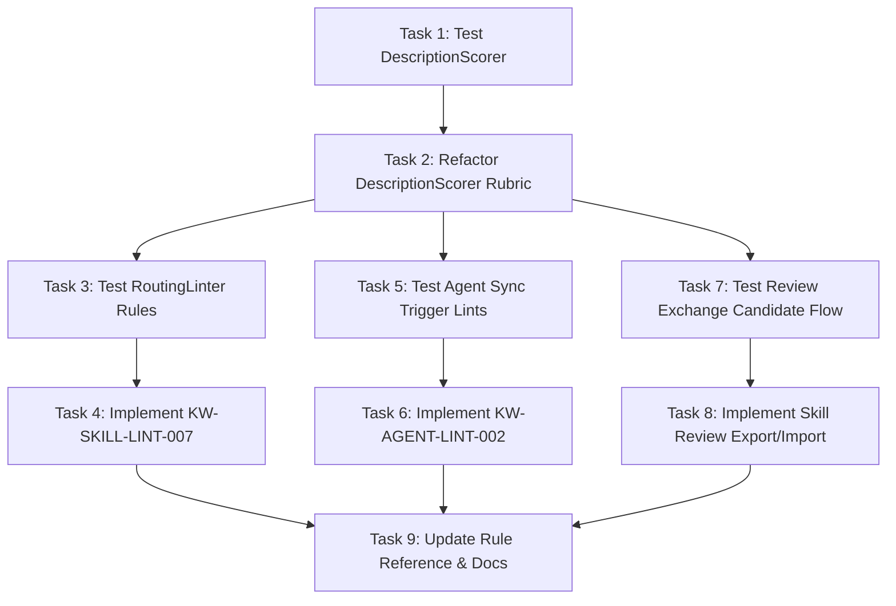

# Skill & Agent Description Quality: Semantic Trigger Verification & Agent Review

**Status:** Archived  
**Archive Date:** 2026-08-14  
**Date:** 2026-08-14  
**Goal:** Verify and review skill and agent descriptions to ensure they communicate when to activate rather than merely summarizing actions, supported by deterministic scoring and agent review exchange.

---

## 1. Problem / Motivation

Skill and agent descriptions in multi-agent environments are **activation triggers**, not passive documentation summaries. When an orchestrator or LLM selects which skill to invoke or which subagent to delegate a task to, it relies directly on the artifact's `description`.

### Observed Gaps in Kyber-Weave:
1. **Action-Summary Phrasing vs. Trigger Intent**:
   - Authors frequently write descriptions that explain *what the tool/skill does* (e.g., `"Generates SQL queries, validates schema syntax, and connects to Postgres database"`) rather than *when the agent should activate it* (e.g., `"Use when the user asks to inspect, write, or troubleshoot PostgreSQL queries. Do NOT use for database migrations."`).
   - In `src/KyberWeave.Core/Skills/Validation/DescriptionScorer.cs`, `StartsWithActionVerb` awards points for verbs such as `generate`, `create`, `process`, `handle`, and `calculate`, which actively rewards task execution summaries instead of activation triggers.
2. **Semantic Review Need**:
   - Pure heuristics (regexes and lexical bags of words) cannot fully evaluate subtle semantic intent. Determining whether a description accurately captures *when to use* vs *what it does* requires agent-assisted review.
   - Kyber-Weave has established candidate export/verdict import review pipelines for documentation (`docs review export` / `import`), but ContextHygiene (`skill` and `agent` commands) lacks an equivalent mechanism for evaluating description intent.
3. **Agent Governance Disparity**:
   - `AgentSpecValidator` only checks that a description exists (`KW-AGENT-SPEC-002`), while `AgentSyncLinter` runs `DescriptionScorer` with a loose threshold (`< 50`) as an `Info` finding (`KW-AGENT-LINT-001`). There is no dedicated trigger-quality verification across harness definitions.

---

## 2. Approved Decisions

- **D1 (Semantic & Trigger-First Focus)**: The primary quality signal is semantic intent—verifying that descriptions communicate **when to activate** the skill/agent (trigger condition and optional negative boundary) rather than merely summarizing actions. The length budget penalizes descriptions shorter than 40 characters as under-specified and excessive verbosity as noisy, without rigid word-count gating.
- **D2 (Dual-Layer Governance)**:
  1. **Deterministic Fast Gate (CI-safe)**: Offline regex and lexical classification in `DescriptionScorer`, `RoutingLinter` (`KW-SKILL-LINT-007`), and `AgentSyncLinter` (`KW-AGENT-LINT-002`) to catch obvious action summaries, missing triggers, and vague openings.
  2. **Agent-Assisted Review Exchange**: Introduce `skill review export` / `import` (and agent review candidate generation) following the proven `IDocsAnalysisCommandService` / `DocsReviewExchange` pattern, allowing an agent/LLM reviewer to grade description trigger intent, suggest sharpened trigger phrasing, and cache content-addressed review verdicts.

---

## 3. Investigation Findings

- **Existing Verification Infrastructure**:
  - `SpecValidator` checks spec conformance; `RoutingLinter` checks routing readiness and collisions; `AgentSyncLinter` checks harness parity, drift, and description scoring.
  - `DescriptionScorer` computes total score (0-100) across 5 dimensions: Trigger clause (35), Negative boundary (20), Specific opening (15), Trigger keywords (15), Length budget (15).
  - Diagnostic codes follow the stable `KW-*` pattern (`KW-SKILL-LINT-*`, `KW-AGENT-LINT-*`, `KW-SKILL-SPEC-*`, `KW-AGENT-SPEC-*`).
- **Review Architecture Precedent**:
  - `KyberWeave.Core.Docs.Analysis.Review` provides a model for candidate bundles, verdict schemas, content hashing, and atomic filesystem exports/imports (`DocsReviewExportCommand`, `DocsReviewImportCommand`).

---

## 4. Test Contract

| Task # | Test project / file | Runner command | Behavior asserted (RED → GREEN) |
|---|---|---|---|
| **T1** | `tests/KyberWeave.Tests/DescriptionScorerTests.cs` | `dotnet test tests/KyberWeave.Tests/KyberWeave.Tests.csproj --filter FullyQualifiedName~DescriptionScorerTests` | `DescriptionScorer.Score` scores trigger-framed descriptions (`"Use when..."`, `"Invoke when..."`) high (35 pts for trigger dimension), awards 0 pts to pure action descriptions (`"Generates SQL..."`, `"Handles customer data..."`, `"Use this to..."`), and preserves scores for semantic trigger quality over arbitrary word length. |
| **T2** | `tests/KyberWeave.Tests/ValidationTests.cs` | `dotnet test tests/KyberWeave.Tests/KyberWeave.Tests.csproj --filter FullyQualifiedName~RoutingLinterTests.Flags_Action_Summary_Without_Trigger` | `RoutingLinter.LintSkill` emits `KW-SKILL-LINT-007` (Warning) when a skill description explains only what the skill does without stating when to use it. |
| **T3** | `tests/KyberWeave.Tests/AgentGovernanceTests.cs` | `dotnet test tests/KyberWeave.Tests/KyberWeave.Tests.csproj --filter FullyQualifiedName~AgentGovernanceTests.AgentSyncLinter_Flags_Missing_Trigger_Phrasing` | `AgentSyncLinter.LintSet` evaluates agent descriptions with `DescriptionScorer`, emitting `KW-AGENT-LINT-002` (Warning) when an agent manifest description lacks trigger phrasing. |
| **T4** | `tests/KyberWeave.Tests/SkillReviewTests.cs` | `dotnet test tests/KyberWeave.Tests/KyberWeave.Tests.csproj --filter FullyQualifiedName~SkillReviewTests` | `SkillReviewExchange.Export` serializes skill and agent description review candidates to JSON, and `SkillReviewExchange.Import` validates agent verdicts (e.g. `is_trigger_oriented`, `suggested_trigger_description`). |
| **T5** | `tests/KyberWeave.Tests/ValidationTests.cs` | `dotnet test tests/KyberWeave.Tests/KyberWeave.Tests.csproj --filter FullyQualifiedName~CliLintExplainTests` | `skill lint --explain` CLI renders the updated rubric breakdown highlighting Trigger Clause, Negative Boundary, Trigger Term Density, and Intent Framing. |

---

## 5. Task List

| # | Phase | Component | Description | Skills |
|---|---|---|---|---|
| **1** | Test | `KyberWeave.Tests` | Author failing unit tests for `DescriptionScorer` trigger vs action classification in `DescriptionScorerTests.cs`. Ref: Test Contract T1. | `test-dev` |
| **2** | Implementation | `KyberWeave.Core` | Refactor `src/KyberWeave.Core/Skills/Validation/DescriptionScorer.cs` to differentiate activation trigger framing from action-only summaries and adjust scoring weights. Ref: Test Contract T1. | `dotnet-dev` |
| **3** | Test | `KyberWeave.Tests` | Author failing unit tests for `RoutingLinter` emitting `KW-SKILL-LINT-007` in `ValidationTests.cs`. Ref: Test Contract T2. | `test-dev` |
| **4** | Implementation | `KyberWeave.Core` | Update `src/KyberWeave.Core/Skills/Validation/RoutingLinter.cs` to emit `KW-SKILL-LINT-007` when description is an action summary without trigger framing. Ref: Test Contract T2. | `dotnet-dev` |
| **5** | Test | `KyberWeave.Tests` | Author failing unit tests for `AgentSyncLinter` emitting `KW-AGENT-LINT-002` in `AgentGovernanceTests.cs`. Ref: Test Contract T3. | `test-dev` |
| **6** | Implementation | `KyberWeave.Core` | Update `src/KyberWeave.Core/Agents/Validation/AgentSyncLinter.cs` and `src/KyberWeave.Core/Agents/Validation/AgentSpecValidator.cs` to check trigger quality. Ref: Test Contract T3. | `dotnet-dev` |
| **7** | Test | `KyberWeave.Tests` | Author failing unit tests for skill and agent description review candidate export and verdict import in `SkillReviewTests.cs`. Ref: Test Contract T4. | `test-dev` |
| **8** | Implementation | `KyberWeave.Core` & `Cli` | Implement `SkillReviewExchange` candidate model and export/import commands (`kyber-weave skill review export / import`). Ref: Test Contract T4, T5. | `dotnet-dev` |
| **9** | Docs / Polish | `KyberWeave.Docs` | Update `docs/ci-pipelines/rule-reference.md`, `docs/context-hygiene/skills.md`, and `docs/context-hygiene/agents.md`. (no-test, manual inspection). | `doc-writer` |

---

## 6. Sequencing / Dependency Graph

---

## 7. Residual Decisions / Risks

- **Risk**: Overly rigid trigger regexes could flag valid domain-specific trigger clauses.
  - *Resolution*: Regexes support flexible patterns (`Use when...`, `Use for...`, `Trigger when...`, `Apply when...`, `Invoke when...`), and findings are emitted as `Warning` rather than fatal errors.
- **Risk**: Semantic drift during offline CI execution.
  - *Resolution*: CI uses deterministic `skill lint` / `agent sync-check` rules, while agent review export/import allows offline cached verdicts.

---

## 8. Out of Scope

- Modifying runtime execution logic inside external harnesses (Cursor, Claude, Codex, Kilo).
- Automatic in-place mutation of `SKILL.md` frontmatter without human/agent review confirmation.

---

## 9. Required Skills

- `test-dev`: Authoring failing xUnit tests across .NET 10 test harness.
- `dotnet-dev`: C# / .NET 10 regex analysis, diagnostic generation, and Spectre.Console CLI command implementation.
- `doc-writer`: Updating governance documentation and rule registries.

---

## 10. Verification Harness

The plan is done only when:
1. Every Test Contract test (T1–T5) is **GREEN** via `dotnet test tests/KyberWeave.Tests/KyberWeave.Tests.csproj`.
2. All existing tests in the solution pass with zero regressions.
3. Documentation conformance passes via `kyber-weave docs validate .`.
