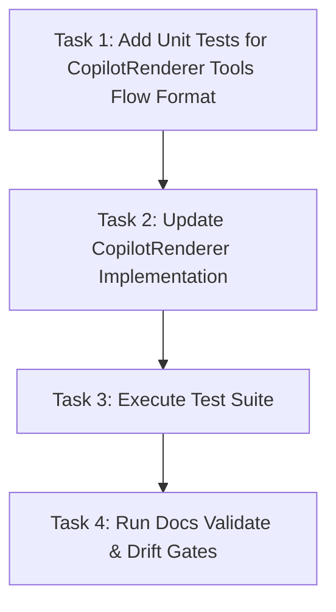

# GitHub Copilot Agent Tools Format and MCP Integration

**Status:** Archived
**Archive Date:** 2026-08-17
**Date:** 2026-08-17
**Goal:** Align GitHub Copilot custom agent definitions by updating `CopilotRenderer` to serialize the `tools` frontmatter field as a YAML flow sequence containing VS Code environment tools, capability-governed built-ins, standard MCP server wildcards (`codegraph`, `kyber-weave`, `context7`), and problems diagnostics.

---

## 1. Problem / Motivation

GitHub Copilot custom agents deployed under `.github/agents/*.agent.md` currently emit the `tools` YAML frontmatter property as a multi-line YAML block list containing only a subset of built-in tool strings (`execute`, `read`, `edit`, `search`, `todo`, `agent`, `web`).

This causes three critical issues in VS Code and GitHub Copilot agent execution:
1. **Tooling Format Mismatch:** Copilot agent parsing and conventions in VS Code expect a concise inline YAML flow sequence (e.g. `tools: [vscode, execute, read, 'codegraph/*', 'kyber-weave/*', 'context7/*', edit, search, todo]`).
2. **MCP Tool Access Blockade:** In GitHub Copilot custom agents, specifying a non-empty `tools` list acts as an explicit allow-list. Because MCP tools (`codegraph/*`, `kyber-weave/*`, `context7/*`) were omitted from `tools`, VS Code Copilot withheld all MCP servers from the agents, breaking code navigation, documentation graph retrieval, and context tools.
3. **Environment & Diagnostics Visibility:** Agents lacked the `vscode` environment tool identifier (which provides access to workspace diagnostics and the `#problems` tool such as `vscode/get_problems`), preventing agents from observing and resolving compiler warnings, Roslyn diagnostics, and linter findings.

## 2. Approved decisions

- **D1:** The `tools` frontmatter property in `.github/agents/*.agent.md` shall be serialized as a YAML flow sequence (e.g. `tools: [vscode, execute, read, 'codegraph/*', 'kyber-weave/*', 'context7/*', edit, search, todo]`).
- **D2:** Tool entries containing wildcard characters (e.g. `'codegraph/*'`, `'kyber-weave/*'`, `'context7/*'`) must be single-quoted in the flow sequence to prevent YAML parsers from interpreting `*` as an alias indicator.
- **D3:** MCP tool wildcards (`'codegraph/*'`, `'kyber-weave/*'`, `'context7/*'`) are capability-gated: they are granted to all analytical, development, and review agents having `filesystem.read: allow`, and are strictly withheld from pure orchestrators (`conductor`, `conductor-v3`) to enforce PM role separation and prevent unauthorized discovery actions.
- **D4:** Sourcing of MCP tools uses the standard core trio (`'codegraph/*'`, `'kyber-weave/*'`, `'context7/*'`), with `vscode` (environment context and diagnostics) and `todo` (session task list) granted as base ungoverned tools.
- **D5:** Emission order for tools in the flow sequence is strictly deterministic: `vscode`, `execute`, `read`, `'codegraph/*'`, `'kyber-weave/*'`, `'context7/*'`, `edit`, `search`, `agent`, `web`, `todo`.

## 3. Investigation findings

1. `src/KyberWeave.Core/Squad/Rendering/CopilotRenderer.cs`:
   - `ResolveTools` mapped only `process.execute`, `filesystem.read`, `filesystem.search`, `filesystem.write`, `delegate`, `network.read`, plus `todo`.
   - `frontmatter["tools"]` was stored as `IReadOnlyList<string>`, which YamlDotNet serialized as a multi-line YAML block sequence (`- execute\n- read...`).
   - Neither `vscode` nor MCP wildcards were present in `CapabilityTools` or `ToolOrder`.
2. `src/KyberWeave.Core/Squad/Rendering/SquadRendererRegistry.cs`:
   - Enforces single-projection rules, target validation, and path normalization across renderers.
   - `CopilotRenderer` is registered as the native Copilot harness renderer.
3. Official GitHub Copilot / VS Code Custom Agents Specification:
   - Custom agents in `.github/agents/*.agent.md` support YAML flow sequence syntax `tools: [tool1, tool2, 'mcp/*']`.
   - MCP servers must be referenced as `'<server-name>/*'`.
   - Specifying `tools` withholds any tool not named; hence MCP tools and `vscode` must be explicitly listed in `tools`.

## 4. Task list

| # | Phase | Component | Description | Skills |
|---|-------|-----------|-------------|--------|
| 1 | 1. Red Tests | KyberWeave.Tests | Add unit tests in `KyberWeave.Tests` specifying the expected YAML flow sequence formatting for `tools: [...]`, single-quoting of MCP wildcards, inclusion of `vscode`, and capability gating (verifying MCP tools are present for worker/architect/dev agents and withheld from conductor). | csharp, test |
| 2 | 2. Implementation | KyberWeave.Core | Update `CopilotRenderer.cs` to include `vscode`, gate the MCP trio (`'codegraph/*'`, `'kyber-weave/*'`, `'context7/*'`) by `filesystem.read` and non-orchestrator role, establish deterministic sequence ordering, and serialize `tools` as a YAML flow sequence with quoted wildcards. | csharp |
| 3 | 3. Validation | KyberWeave.Tests | Run test suite (`dotnet test KyberWeave.Tests.csproj -c Release`) and ensure all rendering tests pass without regression. | csharp, test |
| 4 | 4. Governance & Drift | KyberWeave.Cli | Run `dotnet run --project src/KyberWeave.Cli -- docs validate .` and `docs drift .` to confirm docs corpus remains zero-finding clean. | csharp, cli |

## 5. Sequencing / dependency graph

## 6. Residual decisions / risks

- **Risk:** Additional custom MCP servers beyond the standard trio.
  - **Mitigation:** Sourcing is fixed to the standard trio unless explicitly widened in future capability profile schemas.
- **Risk:** YAML parser variations across different host tools.
  - **Mitigation:** Flow sequence format adheres to standard YAML 1.2 flow sequence specification with explicit single quotes around wildcard tokens.

## 7. Out of scope

- Rendering modifications for other harnesses (Codex, Cursor, Claude, OpenCode, Kilo, Gemini, Antigravity, Warp, Factory).
- Changes to APM packaging or release asset distribution.
- Schema modifications to `capability-profiles.schema.json` (capability vocabulary remains unchanged).

## 8. Required skills

- `csharp`: C# .NET 10 implementation adhering to `<csharp-coding-standard>`.
- `test`: xUnit test authoring adhering to `<test-coding-standard>`.
- `cli`: Kyber-Weave CLI execution for governance validation.

## 9. Verification harness

- **Unit Tests:** `tests/KyberWeave.Tests` verifying:
  - Flow sequence format `tools: [...]` in rendered `.github/agents/*.agent.md`.
  - Quoted wildcard tokens `'codegraph/*'`, `'kyber-weave/*'`, `'context7/*'`.
  - Presence of `vscode` and `todo` across all agents.
  - Absence of MCP tools on `conductor` and `conductor-v3`.
  - Presence of MCP tools on `architect`, `csharp-dev`, `python-dev`, `react-dev`, `test-dev`, etc.
- **Build & Quality Gates:**
  - `dotnet build KyberWeave.sln -c Release` (0 warnings).
  - `dotnet test tests/KyberWeave.Tests/KyberWeave.Tests.csproj -c Release`.
  - `dotnet run --project src/KyberWeave.Cli -- docs validate .`
  - `dotnet run --project src/KyberWeave.Cli -- docs drift .`
