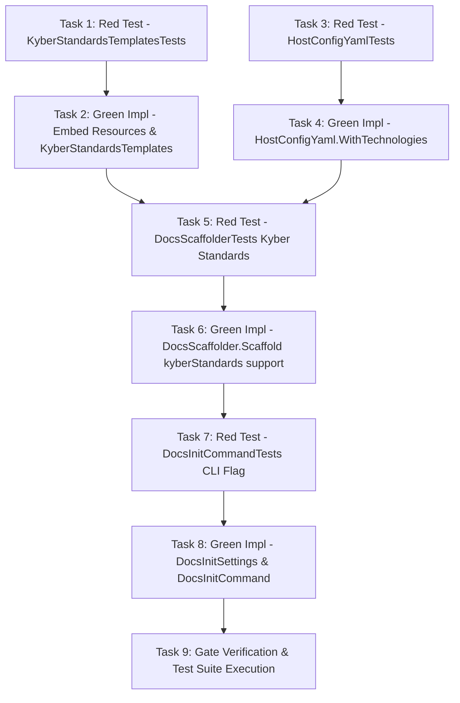

# Add `--kyber-standards` Flag to `docs init`

**Status:** Archived
**Archive Date:** 2026-08-17
**Date:** 2026-08-17  
**Goal:** Add a `--kyber-standards` option to `kyber-weave docs init` that embeds and scaffolds the 10 rich Kyber Squad coding standards templates into `<docs-root>/standards/`, automatically populates `ontology.technologies`, and registers standard paths in the repository's Config Reg.

---

## 1. Problem / Motivation

Currently, `kyber-weave docs init` creates only minimal stubs for coding standards when a host repository explicitly declares technologies in `ontology.technologies`. If no technologies are declared, no standard folders or files are created.

Kyber Squad maintains 10 high-quality, battle-tested coding standards templates under `products/kyber-squad/standards/`:
1. `csharp`
2. `test`
3. `react`
4. `python`
5. `pulumi`
6. `maui`
7. `data-access-layer`
8. `sql`
9. `azure`
10. `github-actions`

Operators bootstrapping a new or existing repository currently have no way to install these rich templates directly through the CLI during initialization. Introducing `--kyber-standards` allows operators to install the complete suite of rich standards templates with one flag, ensuring the generated corpus passes `docs validate` cleanly.

## 2. Approved decisions

- **D1 (Resource Embedding):** The 10 rich standards templates located in `products/kyber-squad/standards/**/*.md` are embedded into `KyberWeave.Core` as `<EmbeddedResource>` items via `KyberWeave.Core.csproj`. An internal accessor `KyberStandardsTemplates` in `KyberWeave.Core.Docs.Scaffolding` loads, enumerates, and renders them. This ensures single-file binaries (`kyber-weave` CLI and `kyber-weave-mcp`) remain self-contained without runtime disk dependencies.
- **D2 (CLI Option):** Add `--kyber-standards` (boolean, default `false`) to `DocsInitSettings` in `KyberWeave.Cli.Commands.Docs`.
- **D3 (Scaffolding Behavior):** When `--kyber-standards` is specified:
  - All 10 standards (`csharp`, `test`, `react`, `python`, `pulumi`, `maui`, `data-access-layer`, `sql`, `azure`, `github-actions`) are scaffolded under `<docs-root>/standards/<technology>/README.md`.
  - Frontmatter `owner` is populated with the resolved `--owner` value (default `unassigned`), and `last-reviewed` is populated with today's date (`yyyy-MM-dd`).
  - The 10 technologies are added/merged into `ontology.technologies` in `.kyber-weave/kyber-weave.yml` via `HostConfigYaml`.
  - The AGENTS.md Config Reg block renders all 10 `<{tech}-coding-standard>` properties.
  - The resulting corpus passes `kyber-weave docs validate .` with zero errors.
- **D4 (Overwrite and Existing Files):**
  - Without `--force`, existing files under `<docs-root>/standards/<technology>/README.md` are preserved and marked `ScaffoldOutcome.Skipped`.
  - With `--force`, existing standard files are overwritten with the rich templates and marked `ScaffoldOutcome.Updated`.
  - Without `--kyber-standards`, default behavior is unchanged (minimal stubs for explicitly declared technologies).
- **D5 (Host Config Preservation):** When updating `.kyber-weave/kyber-weave.yml` with the 10 technologies, `HostConfigYaml` merges them in place, preserving all comments, indentation, and existing custom settings.

## 3. Investigation findings

- **Template Location:** Verified that all 10 templates exist in `products/kyber-squad/standards/<tech>/README.md`.
- **Frontmatter Invariants:** In `DocSpecValidator.cs`, each coding standard document requires `doc-type: coding-standard` and a `technology` key matching both its directory name (`misplaced-technology` / `KW-DOC-SPEC-007`) and an entry in `ontology.technologies` (`invalid-vocabulary` / `KW-DOC-SPEC-002`). Therefore, scaffolding rich standards requires `ontology.technologies` to declare all 10 technologies so validation passes.
- **Configuration Registry:** `ConfigRegConfig.Resolve(ontology)` dynamically generates `<{technology}-coding-standard>` for each technology in `ontology.Technologies`. Adding the 10 technologies to `ontology.technologies` automatically generates all 10 registry properties in `AGENTS.md`.
- **Scaffolder Pipeline:** `DocsScaffolder.Scaffold` currently writes `HostConfig`, `AnalysisCacheIgnore`, `OntologyReference`, `Catalog`, `DocumentationIndex`, folder indices for `DocsLayout.Folders`, and technology standards for `ontology.Technologies`. Adding a `bool kyberStandards = false` parameter cleanly extends this pipeline.

## 4. Test contract

All tests are implemented in `tests/KyberWeave.Tests/KyberWeave.Tests.csproj` and executed with `dotnet test tests/KyberWeave.Tests/KyberWeave.Tests.csproj -c Release`.

| Task # | Test project / file | Runner command | Behavior asserted (RED → GREEN) |
|---|---|---|---|
| T1 | `tests/KyberWeave.Tests/KyberStandardsTemplatesTests.cs` | `dotnet test tests/KyberWeave.Tests/KyberWeave.Tests.csproj --filter KyberStandardsTemplatesTests` | `KyberStandardsTemplates` embeds and successfully loads all 10 templates; `Render(tech, owner)` injects specified owner and ISO date into frontmatter. |
| T2 | `tests/KyberWeave.Tests/HostConfigYamlTests.cs` | `dotnet test tests/KyberWeave.Tests/KyberWeave.Tests.csproj --filter HostConfigYamlTests` | `HostConfigYaml.WithTechnologies` adds/merges technologies in a YAML configuration string while preserving comments, existing keys, and indentation. |
| T3 | `tests/KyberWeave.Tests/DocsScaffolderTests.cs` | `dotnet test tests/KyberWeave.Tests/KyberWeave.Tests.csproj --filter DocsScaffolderTests` | `DocsScaffolder.Scaffold` with `kyberStandards: true` on fresh repository creates all 10 rich standards under `<docs-root>/standards/`, writes all 10 technologies to `kyber-weave.yml`, publishes all 10 properties to `AGENTS.md`, and validates clean with zero `DocSpecValidator` diagnostics. |
| T4 | `tests/KyberWeave.Tests/DocsScaffolderTests.cs` | `dotnet test tests/KyberWeave.Tests/KyberWeave.Tests.csproj --filter DocsScaffolderTests` | `DocsScaffolder.Scaffold` with `kyberStandards: true` skips existing standards without `--force` (`ScaffoldOutcome.Skipped`) and overwrites them with `--force` (`ScaffoldOutcome.Updated`). |
| T5 | `tests/KyberWeave.Tests/DocsInitCommandTests.cs` | `dotnet test tests/KyberWeave.Tests/KyberWeave.Tests.csproj --filter DocsInitCommandTests` | `DocsInitSettings` parses `--kyber-standards` flag and `DocsInitCommand.TryScaffold` forwards `kyberStandards: true` to `DocsScaffolder.Scaffold`. |

## 5. Task list

| # | Phase | Component | Description | Skills |
|---|---|---|---|---|
| 1 | Test-Dev | `KyberWeave.Tests` | Add failing unit tests in `KyberStandardsTemplatesTests.cs` asserting resource loading, 10 technology templates availability, and rendering with custom owner/date (Contract T1). | `csharp-dev`, `test-dev` |
| 2 | Implementation | `KyberWeave.Core` | Embed `products/kyber-squad/standards/**/*.md` in `KyberWeave.Core.csproj` and implement `KyberStandardsTemplates` in `KyberWeave.Core.Docs.Scaffolding` to load and render embedded templates. | `csharp-dev` |
| 3 | Test-Dev | `KyberWeave.Tests` | Add failing unit tests in `HostConfigYamlTests.cs` (or `DocsScaffolderTests.cs`) asserting `HostConfigYaml.WithTechnologies` merges technologies into existing YAML while preserving comments and structure (Contract T2). | `csharp-dev`, `test-dev` |
| 4 | Implementation | `KyberWeave.Core` | Implement `HostConfigYaml.WithTechnologies` in `KyberWeave.Core.Docs.Scaffolding.HostConfigYaml` to support text-preserving technology sequence insertion and merging. | `csharp-dev` |
| 5 | Test-Dev | `KyberWeave.Tests` | Add failing tests in `DocsScaffolderTests.cs` for fresh init with `kyberStandards: true`, verifying all 10 rich standards files, config update, Config Reg rendering, and clean `docs validate` (Contracts T3, T4). | `csharp-dev`, `test-dev` |
| 6 | Implementation | `KyberWeave.Core` | Update `DocsScaffolder.Scaffold` and `WriteHostConfig` to accept `kyberStandards` parameter, merge the 10 technologies into ontology/host config, and write rich standard templates when enabled. | `csharp-dev` |
| 7 | Test-Dev | `KyberWeave.Tests` | Add failing tests in `DocsInitCommandTests.cs` verifying `--kyber-standards` CLI argument binding and propagation to `TryScaffold` (Contract T5). | `csharp-dev`, `test-dev` |
| 8 | Implementation | `KyberWeave.Cli` | Add `[CommandOption("--kyber-standards")]` to `DocsInitSettings` and pass `settings.KyberStandards` in `DocsInitCommand.TryScaffold`. | `csharp-dev` |
| 9 | Validation | Repository Gates | Run `dotnet build KyberWeave.sln -c Release`, `dotnet test tests/KyberWeave.Tests/KyberWeave.Tests.csproj -c Release`, `dotnet run --project src/KyberWeave.Cli -- docs validate .`, and `dotnet run --project src/KyberWeave.Cli -- docs drift .`. | `csharp-dev`, `test-dev` |

## 6. Sequencing / dependency graph

## 7. Residual decisions / risks

- **Risk: Resource Name Mismatch**: Embedded resources in .NET SDK can have varying manifest resource names depending on folder structure and csproj settings.
  - *Mitigation:* Explicitly set `LogicalName` or verify with `assembly.GetManifestResourceNames()` in unit tests (Contract T1).
- **Risk: YAML Formatting Drift in Host Config**: Adding 10 items to a flow vs block sequence could reformat existing YAML.
  - *Mitigation:* `HostConfigYaml.WithTechnologies` handles existing block/flow formats and uses shallowest block indentation (Contract T2).

## 8. Out of scope

- Interactive technology selection prompt (e.g. checkbox prompt in console) — out of scope; `--kyber-standards` installs the complete standard suite, and custom subsets can be configured via `ontology.technologies`.
- Modifying contents of the 10 rich standards templates in `products/kyber-squad/standards/` — these are canonical templates governed by Kyber Squad.

## 9. Required skills

- `csharp-dev`: C# implementation in `KyberWeave.Core` and `KyberWeave.Cli`.
- `test-dev`: Authoring unit tests with xUnit and verifying test gates.

## 10. Verification harness

1. All Test Contract tests in §4 are GREEN:
   - `dotnet test tests/KyberWeave.Tests/KyberWeave.Tests.csproj -c Release`
2. All repository gates pass cleanly:
   - `dotnet run --project src/KyberWeave.Cli -- docs validate .`
   - `dotnet run --project src/KyberWeave.Cli -- docs drift .`
   - `dotnet run --project src/KyberWeave.Cli -- skill validate .apm/skills/kyber-weave-docs`
   - `dotnet run --project src/KyberWeave.Cli -- skill scan .apm/skills/kyber-weave-docs`
3. Code review and security checks complete with zero findings.
