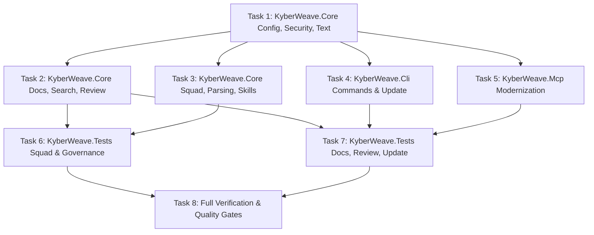

# Complete Recommended InspectCode Improvements

**Status:** Archived  
**Archive Date:** 2026-08-22  
**Date:** 2026-08-21  
**Outcome / Closeout:** Completed. All 17 recommended InspectCode static analysis improvements implemented across `KyberWeave.sln` in strict compliance with repository C# and test coding standards. Architectural clean code policies harvested into [ADR 0004](../../adr/0004-solution-level-static-analysis-and-noise-suppression.md). 100% build and test pass rate.  
**Goal:** Complete all 17 "Recommended to Do" static analysis code quality improvements across `KyberWeave.sln` to modernize codebase idioms (collection expressions, primary constructors, UTF-8 literals, immutability, pattern matching) in strict compliance with repository coding standards.

---

## 1. Problem / Motivation

Following the resolution of all actionable warnings in `KyberWeave.sln`, static analysis triage of `artifacts/inspectcode.xml` identified 17 high-value "Recommended to Do" inspection categories spanning `KyberWeave.Core`, `KyberWeave.Cli`, `KyberWeave.Mcp`, and `KyberWeave.Tests`.

These improvements modernize the codebase to modern C# 12/13 idioms, reduce boilerplate, tighten encapsulation, and enhance execution efficiency:
1. **Accessibility Narrowing (`MemberCanBePrivate.Global` / `MemberCanBePrivate.Local`)**: 30+ internal constants, utility methods, and property accessors are exposed with higher accessibility than necessary despite being referenced only within their containing types.
2. **Collection Expressions (`UseCollectionExpression`)**: 40+ array/list instantiations use legacy `new[] { ... }` or `new List<T>()` syntax instead of modern C# 12 `[...]` collection expressions.
3. **Immutability & Encapsulation (`PropertyCanBeMadeInitOnly.Local` / `.Global`)**: Data transfer models and record properties retain mutable setters where init-only `{ get; init; }` semantics are safer and express true immutability.
4. **Pattern Matching Modernization (`MergeIntoPattern`)**: 30+ compound null checks, type checks, and relational comparisons can be simplified into unified C# pattern expressions (`is not null and not ""` or `is { Length: > 0 }`).
5. **Primary Constructors (`ConvertToPrimaryConstructor`)**: Immutable service, reader, linter, and fixture classes repeat constructor-to-field boilerplate instead of concise primary constructor definitions.
6. **String & Literal Modernization (`RedundantVerbatimStringPrefix`, `UseUtf8StringLiteral`, `StringLiteralAsInterpolationArgument`)**: Eliminates redundant `@` verbatim prefixes on strings lacking escapes, converts `Encoding.UTF8.GetBytes(...)` to zero-allocation C# 11 `"...\"u8` literals, and cleans interpolated string literals.
7. **Idiomatic Cleanups**: Simplifies dictionary lookups (`CanSimplifyDictionaryTryGetValueWithGetValueOrDefault`), converts trivial lambdas to method groups (`ConvertClosureToMethodGroup`), uses non-destructive mutation (`UseWithExpressionToCopyRecord`), narrows local variable scopes (`TooWideLocalVariableScope`), uses async disposal (`UseAwaitUsing`), merges null-conditionals (`MergeConditionalExpression`), fixes control brace indentations (`BadControlBracesIndent`), and propagates cancellation tokens (`MethodSupportsCancellation`).

Completing these improvements systematically across the solution ensures maximum static analysis cleanliness and elevates the codebase to modern .NET standards.

---

## 2. Approved decisions

- **D1:** Implement all 17 "Recommended to Do" InspectCode improvements across `KyberWeave.Core`, `KyberWeave.Cli`, `KyberWeave.Mcp`, and `KyberWeave.Tests`.
- **D2:** Strict compliance with repository coding standards (`AGENTS.md`, `docs/standards/csharp/README.md`, `docs/standards/test/README.md`):
  - **Explicit types, never `var`**: When adopting collection expressions `[...]`, explicit variable typing MUST be preserved (e.g. `string[] items = ["a", "b"];` or `IReadOnlyList<string> list = ["a", "b"];`, NEVER `var items = [...]`).
  - **File-scoped namespaces** and **Allman braces** must be preserved across all edits.
  - **Comments explain why, not what**: Preserve all explanatory comments and rationale blocks.
  - `TreatWarningsAsErrors` remains enabled with `AnalysisMode=all` in `Directory.Build.props`. No suppressions added to `NoWarn`.
- **D3:** Primary constructors are applied to immutable service classes, linters, exporters, and test fixtures where dependencies are passed directly to private fields or base constructors without complex multi-step constructor initialization logic.
- **D4:** UTF-8 string literals (`"...\"u8` or `"...\"u8.ToArray()`) replace `Encoding.UTF8.GetBytes(...)` for static test payloads, mock handlers, and fixtures to improve readability and eliminate runtime string encoding.
- **D5:** Decompose implementation into 7 disjoint component tasks so worker agents can execute concurrently without file collisions.
- **D6:** Verification contract: 100% Release build pass with zero warnings/errors, 100% test pass rate across all 1,527 tests, zero actionable findings in InspectCode XML, clean `dotnet format`, and zero documentation validation drift (`docs validate .`).

---

## 3. Investigation findings

The findings from `artifacts/inspectcode.xml` and live codebase inspection map to the following exact file and category locations:

### 1. `KyberWeave.Cli`
- **`MemberCanBePrivate.Global` / `.Local`**:
  - `src/KyberWeave.Cli/Commands/Docs/DocsAnalysisCommands.cs` (`FindingExitCode` -> `private static int`)
  - `src/KyberWeave.Cli/Commands/Docs/DocsCommandComposition.cs` (`TryCreateLoader` -> `private static bool`, `EmbeddingGenerator` -> `private`)
  - `src/KyberWeave.Cli/Commands/Review/ReviewGatesCommand.cs` (`NoGatesDeclared` -> `private const string`)
  - `src/KyberWeave.Cli/Commands/Review/ReviewVerdictCommand.cs` (`UnreadableInput`, `Verdict` -> `private const string`)
  - `src/KyberWeave.Cli/Update/BinaryInstaller.cs` (`ClearMacQuarantine` -> `private static void`)
  - `src/KyberWeave.Cli/Update/SelfUpdateHost.cs` (`ReadCurrentVersion` -> `private static string`)
  - `src/KyberWeave.Cli/Update/SelfUpdater.cs` (`CanWriteDirectory` -> `private static bool`)
- **`UseCollectionExpression`**:
  - `src/KyberWeave.Cli/Commands/Agents/AgentCatalogCommand.cs` (Line 37)
- **`PropertyCanBeMadeInitOnly.Local`**:
  - `src/KyberWeave.Cli/Update/GitHubReleaseClient.cs` (Lines 216, 219: `GitHubReleaseAsset.Name`, `BrowserDownloadUrl`)
- **`MergeIntoPattern`**:
  - `src/KyberWeave.Cli/Commands/Review/ReviewGatesCommand.cs` (Line 66)
  - `src/KyberWeave.Cli/Commands/Skills/LintCommand.cs` (Line 36)
  - `src/KyberWeave.Cli/Commands/Squad/SquadDoctorCommand.cs` (Line 72)
  - `src/KyberWeave.Cli/Update/ChecksumVerifier.cs` (Lines 61, 62, 63)
- **`ConvertToPrimaryConstructor`**:
  - `src/KyberWeave.Cli/Commands/Docs/DocsCommandComposition.cs` (Line 217: `DocsAnalysisRuntime`)
- **`TooWideLocalVariableScope`**:
  - `src/KyberWeave.Cli/Commands/Docs/DocsGraphCommand.cs` (Line 41: `glossary` declared inside `try` block)
- **`ConvertIfStatementToConditionalTernaryExpression`**:
  - `src/KyberWeave.Cli/Commands/Skills/RouteCommand.cs` (Line 99: `AnsiConsole.MarkupLine(result.Fired ? ... : ...)`)
- **`UseAwaitUsing`**:
  - `src/KyberWeave.Cli/Commands/Squad/Infrastructure/GitHubSquadReleaseSource.cs` (Line 550)

### 2. `KyberWeave.Core`
- **`MemberCanBePrivate.Global` / `.Local`**:
  - `src/KyberWeave.Core/Agents/Parsing/AgentLoader.cs` (`LoadResults` -> `private static`)
  - `src/KyberWeave.Core/Agents/Validation/AgentSyncLinter.cs` (`RuleInstructionDrift` -> `private const string`)
  - `src/KyberWeave.Core/Configuration/ConfigRegConfigLoader.cs` (`SectionKey` -> `private const string`)
  - `src/KyberWeave.Core/Configuration/DocsAnalysisConfig.cs` (`ResolvedGlossaryPath.init`, `VerdictConfidence.init` -> `private init`)
  - `src/KyberWeave.Core/Configuration/DocsRootPath.cs` (`NormalizeRoot` -> `private static`)
  - `src/KyberWeave.Core/Configuration/HarnessProfileConfig.cs` (`Profiles.init` -> `private init`)
  - `src/KyberWeave.Core/Configuration/KyberWeaveConfigLoadResult.cs` (`Success.init`, `Error.init`, `ConfigPath.init`, `Config.init` -> `private init`)
  - `src/KyberWeave.Core/Configuration/OntologyConfig.cs` (`DocTypes.init`, `Statuses.init`, `CatalogPath`, `ExcludedPathSegments.init`, `ExcludedFiles.init`, etc. -> `private`)
  - `src/KyberWeave.Core/Configuration/OntologyConfigLoader.cs` (`DocsRootKey`, `CatalogPathKey`, `TechnologiesKey` -> `private const string`, `NormalizeDocsRoots`, `NormalizeTechnologies` -> `private static`)
  - `src/KyberWeave.Core/Configuration/OntologyConfigLoadResult.cs` (`Success.init`, `ParseError.init`, `Config.init` -> `private init`)
  - `src/KyberWeave.Core/Docs/Analysis/Claims/IgnoreMarkupReader.cs` (`DiagnosticCode` -> `private const string`)
  - `src/KyberWeave.Core/Docs/Analysis/Review/DocumentationReviewExchange.cs` (`VerdictSchema` -> `private const string`)
  - `src/KyberWeave.Core/Docs/Graph/DocGraphProjection.cs` (`DocId` -> `private static`)
  - `src/KyberWeave.Core/Docs/Parsing/DocumentLoader.cs` (`IsExcluded`, `ParseDocType`, `ParseStatus` -> `private static`)
  - `src/KyberWeave.Core/Docs/Scaffolding/DocsScaffolder.cs` (`DetectDocsRoot`, `ResolveDocsRoot` -> `private static`)
  - `src/KyberWeave.Core/Docs/Search/DocumentIndex.cs` (`MinRelevanceScore` -> `private const double`)
  - `src/KyberWeave.Core/Docs/Validation/DocDriftLinter.cs` (`SourceRootNotIndexed` -> `private const string`)
  - `src/KyberWeave.Core/Docs/Validation/DocSpecValidator.cs` (`Levenshtein` -> `private static`)
  - `src/KyberWeave.Core/Review/VerdictEngine.cs` (`MajorFindingThreshold` -> `private const int`)
  - `src/KyberWeave.Core/Skills/Review/SkillReviewExchange.cs` (`CandidateSchema`, `VerdictSchema`, `ReviewRuleCode` -> `private const string`, `ExportCandidates` -> `private static`)
  - `src/KyberWeave.Core/Skills/Validation/RoutingLinter.cs` (`BodyTokenBudget`, `BodyLineBudget`, `OverlapThreshold` -> `private const / get-only`)
  - `src/KyberWeave.Core/Skills/Validation/SpecValidator.cs` (`NameMaxLength`, `CompatibilityMaxLength` -> `private const int`)
  - `src/KyberWeave.Core/Squad/Deployment/SquadTargetResolver.cs` (`InstallRecoveryCommand`, `UpdateRecoveryCommand`, `UninstallRecoveryCommand` -> `private const string`)
  - `src/KyberWeave.Core/Text/TextVectorizer.cs` (`Tokenize` -> `private static`)
- **`UseCollectionExpression`**:
  - `src/KyberWeave.Core/Docs/Analysis/DocumentationAnalyzer.cs` (Line 296)
  - `src/KyberWeave.Core/Docs/Analysis/Glossary/ManagedGlossaryService.cs` (Lines 337, 844)
  - `src/KyberWeave.Core/Docs/Scaffolding/DocsScaffolder.cs` (Line 133)
  - `src/KyberWeave.Core/Docs/Scaffolding/HostConfigYaml.cs` (Lines 186, 661)
  - `src/KyberWeave.Core/Security/InstructionSurfacePatterns.cs` (Lines 23, 33, 41)
  - `src/KyberWeave.Core/Squad/Deployment/SquadTransaction.cs` (Line 991)
- **`PropertyCanBeMadeInitOnly.Global` (Internal Models)**:
  - `src/KyberWeave.Core/Agents/Model/AgentModel.cs` (Lines 14, 15, 16, 18)
  - `src/KyberWeave.Core/Docs/Model/DocumentModel.cs` (Lines 50-62)
  - `src/KyberWeave.Core/Skills/Model/SkillFrontmatter.cs` (Lines 16, 20)
  - `src/KyberWeave.Core/Skills/Routing/RoutingEvaluator.cs` (Lines 14, 15, 24)
- **`MergeIntoPattern`**:
  - `src/KyberWeave.Core/Agents/Parsing/AgentLoader.cs` (Line 33)
  - `src/KyberWeave.Core/Docs/Analysis/Claims/ClaimExtractor.cs` (Line 48)
  - `src/KyberWeave.Core/Review/VerdictEngine.cs` (Lines 283, 371)
  - `src/KyberWeave.Core/Skills/Parsing/SkillParser.cs` (Line 112)
  - `src/KyberWeave.Core/Squad/Deployment/SquadTransaction.cs` (Lines 1240, 2689, 2846, 2848)
- **`ConvertToPrimaryConstructor`**:
  - `src/KyberWeave.Core/Agents/Model/AgentSet.cs` (Line 10)
  - `src/KyberWeave.Core/Docs/Analysis/DocumentationAnalyzer.cs` (Line 40)
  - `src/KyberWeave.Core/Docs/Analysis/Embeddings/EmbeddingCoordinator.cs` (Line 14)
  - `src/KyberWeave.Core/Docs/Export/DocGraphExporter.cs` (Line 24)
  - `src/KyberWeave.Core/Docs/Validation/DocDriftLinter.cs` (Line 24)
  - `src/KyberWeave.Core/Skills/Model/SkillSet.cs` (Line 11)
  - `src/KyberWeave.Core/Skills/Routing/RoutingEvaluator.cs` (Line 53)
  - `src/KyberWeave.Core/Squad/Deployment/SquadTransaction.cs` (Line 3283)
  - `src/KyberWeave.Core/Squad/Rendering/CopilotRenderer.cs` (Lines 393, 405)
- **`RedundantVerbatimStringPrefix`**:
  - `src/KyberWeave.Core/Security/InstructionSurfacePatterns.cs` (Lines 15, 42, 43, 45, 50)
  - `src/KyberWeave.Core/Skills/Validation/SpecValidator.cs` (Line 19)
  - `src/KyberWeave.Core/Text/TextVectorizer.cs` (Line 102)
- **`CanSimplifyDictionaryTryGetValueWithGetValueOrDefault`**:
  - `src/KyberWeave.Core/Agents/Parsing/AgentLoader.cs` (Line 110)
  - `src/KyberWeave.Core/Docs/Search/DocumentCorpus.cs` (Lines 141, 151)
- **`ConvertClosureToMethodGroup`**:
  - `src/KyberWeave.Core/Docs/Analysis/Candidates/LexicalSimilarity.cs` (Line 34: `leftTokens.Count(rightTokens.Contains)`)
  - `src/KyberWeave.Core/Docs/Analysis/Embeddings/EmbeddingCoordinator.cs` (Line 138: `orderedKeys.Count(cached.ContainsKey)`)
- **`UseWithExpressionToCopyRecord`**:
  - `src/KyberWeave.Core/Squad/Parsing/SquadSourceLoader.cs` (Lines 462, 545: `file with { Content = frontmatter.Yaml }`)
- **`MergeConditionalExpression`**:
  - `src/KyberWeave.Core/Configuration/DocsAnalysisConfigLoader.cs` (Line 29: `section.Statuses?.ToArray() ?? defaults.Statuses`)
- **`BadControlBracesIndent`**:
  - `src/KyberWeave.Core/Docs/Analysis/Claims/IgnoreMarkupReader.cs` (Line 91: Align label indentation)

### 3. `KyberWeave.Mcp`
- **`MergeIntoPattern`**:
  - `src/KyberWeave.Mcp/Program.cs` (Line 90)
  - `src/KyberWeave.Mcp/RepositoryDocsAnalysisReader.cs` (Line 86)

### 4. `KyberWeave.Tests`
- **`MemberCanBePrivate.Global` / `.Local`**:
  - `tests/KyberWeave.Tests/Fakes/FakeSquadRenderer.cs` (Lines 14, 38, 67, 73, 303, 328, 340)
  - `tests/KyberWeave.Tests/MotorcycleRagHostProfileTests.cs` (Line 207: `Root` -> `private string`)
  - `tests/KyberWeave.Tests/OntologyConfigTests.cs` (Line 215: `Root` -> `private string`)
  - `tests/KyberWeave.Tests/SqliteTestFixture.cs` (Line 57: `SqliteStartInfo` -> `private static`)
  - `tests/KyberWeave.Tests/SquadCliCommandTests.cs` (Line 1243: `Write` -> `private static`)
  - `tests/KyberWeave.Tests/SquadPackAndReleaseTests.cs` (Line 518: `Write` -> `private static`)
  - `tests/KyberWeave.Tests/UpdateCommandTests.cs` (Line 557: `Map` -> `private static`)
- **`UseCollectionExpression`**:
  - `AgentGovernanceTests.cs` (Lines 112, 235, 290, 311)
  - `AnalysisPersistenceTests.cs` (Line 176)
  - `DocGraphProjectionTests.cs` (Lines 46, 51)
  - `DocsScaffolderTests.cs` (Line 337)
  - `DocumentationReviewExchangeTests.cs` (Lines 138, 197, 325, 425)
  - `DocumentIndexTests.cs` (Lines 303, 324, 339, 357)
  - `EmbeddingClientTests.cs` (Line 56)
  - `GlossaryGraphExportTests.cs` (Lines 98, 114, 115, 116, 117, 127)
  - `ManagedGlossaryTests.cs` (Line 259)
  - `ScannerAndRoutingTests.cs` (Lines 49, 75)
  - `SkillReviewTests.cs` (Lines 132, 184, 202, 234, 265, 295, 331, 374)
  - `SquadDeploymentStateTests.cs` (Lines 877, 2036, 2046, 2746, 2750, 2754, 3581, 3614)
  - `SquadReleaseClientTests.cs` (Line 277)
  - `ValidationTests.cs` (Lines 76, 88)
- **`MergeIntoPattern`**:
  - `AgentGovernanceTests.cs` (Lines 129, 148, 336, 354, 372)
  - `DocGraphProjectionTests.cs` (Lines 30, 31, 32, 99, 100)
  - `DocsScaffolderTests.cs` (Lines 769, 813, 871)
  - `DocumentationAnalyzerTests.cs` (Lines 199, 412, 489, 601, 797)
  - `HarnessProfileConfigTests.cs` (Lines 87, 193, 213, 239, 240)
  - `MotorcycleRagHostProfileTests.cs` (Line 133)
  - `MultipleDocsRootTests.cs` (Lines 204, 298, 326)
  - `ReviewVerdictTests.cs` (Lines 189, 262)
  - `SkillReviewTests.cs` (Lines 115, 116, 196, 226)
- **`ConvertToPrimaryConstructor`**:
  - `SquadCliCommandTests.cs` (Line 1095: `FakeUserPaths`)
  - `SquadReleaseClientTests.cs` (Line 744: `CancelAfterSerializationContent`)
- **`UseUtf8StringLiteral`**:
  - `SquadDeploymentStateTests.cs` (Lines 2666, 3388, 3395, 3911)
  - `SquadReleaseClientTests.cs` (Line 379)
  - `UpdateCommandTests.cs` (Line 201)
- **`ConvertClosureToMethodGroup`**:
  - `SquadDeploymentStateTests.cs` (Line 2780)
- **`MethodSupportsCancellation`**:
  - `DocumentationAnalysisScaleTests.cs` (Line 190)
- **`StringLiteralAsInterpolationArgument`**:
  - `UpdateCommandTests.cs` (Line 389)

---

## 4. Task list

| # | Phase | Component | Description | Skills |
|---|---|---|---|---|
| 1 | Phase 1 | `KyberWeave.Core` (Config, Security, Text) | In `InstructionSurfacePatterns.cs`, remove redundant `@` prefixes (L15, 42, 43, 45, 50) and convert arrays to collection expressions (L23, 33, 41). In `TextVectorizer.cs`, narrow `Tokenize` accessibility to private static and remove redundant `@` prefix (L102). In `DocsAnalysisConfigLoader.cs`, merge conditional expression (L29). In `HostConfigYaml.cs`, use collection expressions (L186, 661). Narrow accessibility in `ConfigRegConfigLoader.cs`, `OntologyConfig.cs`, `OntologyConfigLoader.cs`, `KyberWeaveConfigLoadResult.cs`, `OntologyConfigLoadResult.cs`, and `DocsRootPath.cs`. | `csharp` |
| 2 | Phase 2 | `KyberWeave.Core` (Docs Analysis, Search, Review) | In `DocumentationAnalyzer.cs`, convert constructor to primary constructor and adopt collection expressions. In `EmbeddingCoordinator.cs`, convert constructor to primary constructor and convert closure to method group (`orderedKeys.Count(cached.ContainsKey)`). In `DocGraphExporter.cs` and `DocDriftLinter.cs`, convert to primary constructors. In `DocumentCorpus.cs`, simplify dictionary lookups with `GetValueOrDefault` (L141, 151). In `LexicalSimilarity.cs`, convert closure to method group (`leftTokens.Count(rightTokens.Contains)`). In `IgnoreMarkupReader.cs`, fix label indentation (L91) and narrow `DiagnosticCode` to private. In `ClaimExtractor.cs` and `VerdictEngine.cs`, merge into patterns (L48, 283, 371). In `ManagedGlossaryService.cs`, adopt collection expressions. | `csharp` |
| 3 | Phase 3 | `KyberWeave.Core` (Squad, Parsing, Skills) | In `SquadSourceLoader.cs`, use `with { Content = ... }` record copy expressions (L462, 545). In `SquadTransaction.cs`, convert nested exception to primary constructor, adopt collection expressions (L991), and merge into patterns (L1240, 2689, 2846, 2848). In `CopilotRenderer.cs`, convert flow sequence helpers to primary constructors (L393, 405). In `AgentSet.cs`, `SkillSet.cs`, and `RoutingEvaluator.cs`, convert to primary constructors and tighten init properties. In `AgentLoader.cs`, merge patterns and simplify lookup with `GetValueOrDefault`. In `SpecValidator.cs`, remove redundant `@` prefix and narrow constants. In `SkillParser.cs`, merge patterns. | `csharp` |
| 4 | Phase 4 | `KyberWeave.Cli` (Commands & Update) | In `DocsCommandComposition.cs`, convert `DocsAnalysisRuntime` to primary constructor and narrow `TryCreateLoader` / `EmbeddingGenerator` accessibility. In `RouteCommand.cs`, simplify branch to ternary (L99). In `DocsGraphCommand.cs`, narrow scope of `glossary` (L41). In `GitHubSquadReleaseSource.cs`, use `await using` for stream/archive (L550). In `GitHubReleaseClient.cs`, tighten asset properties to `init` (L216, 219). In `ChecksumVerifier.cs`, `ReviewGatesCommand.cs`, `LintCommand.cs`, `SquadDoctorCommand.cs`, merge into patterns. Narrow private members in `ReviewGatesCommand`, `ReviewVerdictCommand`, `BinaryInstaller`, `SelfUpdateHost`, `SelfUpdater`, and `DocsAnalysisCommands`. In `AgentCatalogCommand.cs`, use collection expressions. | `csharp` |
| 5 | Phase 5 | `KyberWeave.Mcp` | In `src/KyberWeave.Mcp/Program.cs` and `RepositoryDocsAnalysisReader.cs`, merge conditional null/type checks into modern patterns (L90, L86). | `csharp` |
| 6 | Phase 6 | `KyberWeave.Tests` (Squad & Governance Suites) | In `SquadDeploymentStateTests.cs`, adopt collection expressions (L877, 2036, 2046, 2746, 2750, 2754, 3581, 3614), use UTF-8 string literals `"...\"u8` (L2666, 3388, 3395, 3911), and convert closure to method group (L2780). In `SquadCliCommandTests.cs` and `SquadReleaseClientTests.cs`, convert helper types (`FakeUserPaths`, `CancelAfterSerializationContent`) to primary constructors, use UTF-8 literals, and narrow helper accessibility. In `AgentGovernanceTests.cs`, adopt collection expressions and merge patterns. In `FakeSquadRenderer.cs`, `MotorcycleRagHostProfileTests.cs`, `OntologyConfigTests.cs`, `SquadPackAndReleaseTests.cs`, narrow helper members to private. | `csharp`, `xunit` |
| 7 | Phase 7 | `KyberWeave.Tests` (Docs, Search, Review, Update) | In `DocumentationAnalysisScaleTests.cs`, pass cancellation token in `Task.Run` (L190). In `DocumentationReviewExchangeTests.cs`, `DocumentIndexTests.cs`, `GlossaryGraphExportTests.cs`, `ManagedGlossaryTests.cs`, `ScannerAndRoutingTests.cs`, `SkillReviewTests.cs`, `ValidationTests.cs`, adopt collection expressions. In `DocumentationAnalyzerTests.cs`, `DocGraphProjectionTests.cs`, `DocsScaffolderTests.cs`, `HarnessProfileConfigTests.cs`, `MultipleDocsRootTests.cs`, `ReviewVerdictTests.cs`, merge into patterns. In `UpdateCommandTests.cs`, use UTF-8 literal (L201), merge interpolated literal (L389), and narrow `Map` to private. In `SqliteTestFixture.cs`, narrow `SqliteStartInfo` to private static. | `csharp`, `xunit` |
| 8 | Phase 8 | Verification & Quality Gate Suite | Run full verification suite: `dotnet build KyberWeave.sln -c Release`, `dotnet test tests/KyberWeave.Tests/KyberWeave.Tests.csproj -c Release`, `dotnet jb inspectcode KyberWeave.sln --output=artifacts/inspectcode.xml --format=Xml`, `dotnet format KyberWeave.sln whitespace --verify-no-changes`, `dotnet format KyberWeave.sln style --verify-no-changes`, and `dotnet run --project src/KyberWeave.Cli -- docs validate .`. Verify zero actionable findings and 100% test success. | `csharp`, `cli-testing` |

---

## 5. Sequencing / dependency graph



### Dependency Rules:
1. **Tasks 1, 2, 3 (`KyberWeave.Core`)** establish tightened accessibility, primary constructors, and record copying across engine types before test suites are updated.
2. **Tasks 4 & 5 (`KyberWeave.Cli` & `KyberWeave.Mcp`)** update host commands, runtime wrappers, and server endpoints independently across disjoint files.
3. **Tasks 6 & 7 (`KyberWeave.Tests`)** update test assertions, mock helpers, and fixture constructs across disjoint test classes.
4. **Task 8 (Verification)** runs as the final automated quality gate across build, test, format, InspectCode, and documentation validation.

---

## 6. Residual decisions / risks

- **Risk 1: Inadvertent `var` usage during collection expression adoption.**
  - *Mitigation*: Coding standard explicitly requires explicit types (e.g. `string[] items = ["a", "b"];`). Roslyn analyzer `csharp_style_var_* = false:warning` will break the build under `TreatWarningsAsErrors` if `var` is used.
- **Risk 2: Primary constructor parameter capture altering field semantics.**
  - *Mitigation*: Applied strictly to immutable classes where constructor parameters are assigned directly to private readonly fields or base constructors.
- **Risk 3: UTF-8 literal type mismatches.**
  - *Mitigation*: Where an API explicitly expects `byte[]` rather than `ReadOnlySpan<byte>`, `"...\"u8.ToArray()` is used to prevent compiler type errors while retaining compile-time UTF-8 encoding.
- **Risk 4: Spectre.Console CLI Settings binding disruption.**
  - *Mitigation*: CLI settings properties bound via Spectre reflection are preserved and excluded from init-only conversion.

---

## 7. Out of scope

- Modifying existing compiler `NoWarn` entries in `Directory.Build.props`.
- Target-typed `new()` expressions (`ArrangeObjectCreationWhenTypeEvident`) where explicit type naming is preferred by coding standards.
- Suppressing or relaxing compiler warning levels.
- Modifying domain schemas, CLI command syntax, or documentation ontology rules.

---

## 8. Required skills

- `csharp`: Expert knowledge of C# 12/13 features (collection expressions, primary constructors, UTF-8 literals, record `with` expressions, pattern matching).
- `xunit`: Knowledge of xUnit fixtures, test lifecycle, and test assertions.
- `cli-testing`: Execution of .NET CLI build, test, format, InspectCode, and docs validation tooling.
- `resharper`: Understanding of JetBrains InspectCode inspection rules and XML reporting.

---

## 9. Verification harness

Before the plan is accepted as complete, the following verification gates must pass cleanly:

1. **Build Gate (`TreatWarningsAsErrors=true`)**:
   ```bash
   dotnet build KyberWeave.sln -c Release
   ```
   *Success criteria*: 0 warnings, 0 errors.

2. **Test Suite Gate**:
   ```bash
   dotnet test tests/KyberWeave.Tests/KyberWeave.Tests.csproj -c Release --no-build
   ```
   *Success criteria*: 1,527 / 1,527 tests pass (100% success rate, 0 failures, 0 skipped).

3. **InspectCode Analysis Gate**:
   ```bash
   dotnet jb inspectcode KyberWeave.sln --output=artifacts/inspectcode.xml --format=Xml
   ```
   *Success criteria*: Generates clean report with zero actionable warnings or errors, and all 17 targeted suggestion categories resolved.

4. **Format & Style Gates**:
   ```bash
   dotnet format KyberWeave.sln whitespace --verify-no-changes --no-restore -v minimal
   dotnet format KyberWeave.sln style --verify-no-changes --severity warn --no-restore -v minimal
   ```
   *Success criteria*: Zero formatting or style violations.

5. **Documentation Governance Gate**:
   ```bash
   dotnet run --project src/KyberWeave.Cli --no-build -c Release -- docs validate .
   ```
   *Success criteria*: Zero documentation validation errors or ontology drift.
