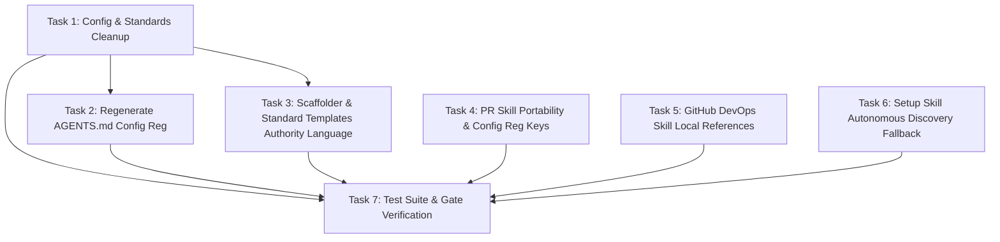

# Council Reviewer Findings Remediation

**Status:** Archived  
**Archive Date:** 2026-08-22  
**Date:** 2026-08-22  
**Outcome / Closeout:** Completed. All five major and one minor council review findings remediated across standards, configuration, scaffolder defaults, and skills. Standards authority policy harvested into [ADR 0001](../../adr/0001-coding-standards-and-configuration-registry.md). All test and validation gates green.  
**Goal:** Remediate all five major and one minor council code reviewer findings across repository coding standards, configuration, scaffolding templates, and canonical Kyber-Squad skills.

---

## 1. Problem / Motivation

The council code reviewer reported five major findings and one minor finding across repository documentation, configuration, scaffolding engines, and canonical skill definitions:

1. **Major Finding 1 (Draft stack templates published as authoritative host standards):** Residual scaffolding from `--kyber-standards` development declared 10 technologies in `.kyber-weave/kyber-weave.yml` and left 8 draft template directories in `docs/standards/` (`azure`, `data-access-layer`, `github-actions`, `maui`, `pulumi`, `python`, `react`, `sql`). Kyber-Weave is a .NET project (C# and xUnit) and does not use these 8 stacks, yet they are published in `AGENTS.md` Config Reg as active host standards.
2. **Major Finding 2 (Draft standards can override portable defaults through Config Reg):** Standard template prose in `DocsScaffolder.TechnologyStandard` and `products/kyber-squad/standards/**/*.md` asserts that `<{tech}-coding-standard>` outranks portable agent defaults unconditionally, even when frontmatter specifies `status: draft`.
3. **Major Finding 3 (PR skill requires nonexistent `pr-gate.yml` and host-foreign jobs):** `products/kyber-squad/skills/create-pull-request/SKILL.md` hardcodes `.github/workflows/pr-gate.yml` and mobile/cloud jobs (`unit-mobile`, `integration`, `e2e`, `iac-scan`) inherited from the origin repository (`motorcycle-rag-system`), failing on hosts using standard workflows such as `.github/workflows/ci.yml`.
4. **Major Finding 4 (GitHub DevOps skill references missing docs and fictional registry keys):** `products/kyber-squad/skills/github-devops/SKILL.md` references a legacy path `6-Docs/DevOps/` and lists 5 nonexistent Config Reg keys (`Build Performance`, `Incremental Build`, `Directory.Build Organization`, `MSBuild Modernization`, `MSBuild Anti-patterns`), while only `ci-build-diagnostics.md` exists under `references/`.
5. **Major Finding 5 (Setup skill requires missing developer setup standard and inventory):** `products/kyber-squad/skills/setup-dev-environment/SKILL.md` and `inventory.md` require `<developer-setup-standard>` in Config Reg as a hard blocker and lack autonomous repo discovery when no custom setup standard is declared.
6. **Minor Finding 6 (README/Config contradiction on declared standards):** `docs/standards/README.md:16` claims only C# and test standards exist, directly contradicting `.kyber-weave/kyber-weave.yml` and `AGENTS.md` which declared ten technologies.

---

## 2. Approved decisions

- **D1 (Repository Technologies Alignment):** Set `ontology.technologies: [csharp, test]` in `.kyber-weave/kyber-weave.yml`. Remove the 8 unused draft directories (`azure/`, `data-access-layer/`, `github-actions/`, `maui/`, `pulumi/`, `python/`, `react/`, `sql/`) from `docs/standards/`. Regenerate root `AGENTS.md` Config Reg via `kyber-weave docs init .` so only `<csharp-coding-standard>` and `<test-coding-standard>` are published in this repository.
- **D2 (Standard Status Lifecycle & Authority Policy):** Clarify in `docs/standards/README.md`, `DocsScaffolder.TechnologyStandard`, and canonical standards templates under `products/kyber-squad/standards/` that only standards with `status: current` represent authoritative host policies that outrank portable agent defaults. Standards with `status: draft` are non-authoritative templates/proposals.
- **D3 (Portable PR CI Gate & Canonical Config Reg Keys):** Update `products/kyber-squad/skills/create-pull-request/SKILL.md` to make CI checks generic and host-portable by directing agents to inspect active workflows in `.github/workflows/` (e.g. `ci.yml` or host PR gate), and standardize all property references to use canonical Config Reg keys (`<component-catalog>`, `<documentation-ontology>`, `<rules-index>`, `<plan-index>`).
- **D4 (Self-Contained GitHub DevOps References):** Refactor `products/kyber-squad/skills/github-devops/SKILL.md` to remove legacy `6-Docs/DevOps/` paths and nonexistent Config Reg keys. Author the 5 missing self-contained reference documents under `products/kyber-squad/skills/github-devops/references/`:
  1. `build-performance.md`
  2. `incremental-build.md`
  3. `directory-build-organization.md`
  4. `msbuild-modernization.md`
  5. `msbuild-anti-patterns.md`
- **D5 (Autonomous Discovery Fallback in Setup Dev Environment Skill):** Update `products/kyber-squad/skills/setup-dev-environment/SKILL.md` and `references/inventory.md` so the skill checks if `<developer-setup-standard>` is defined in Config Reg, and if absent, autonomously discovers prerequisites from repository manifests (`global.json`, package manifests, `.editorconfig`, Dockerfiles, `docs/install.md`, `CONTRIBUTING.md`, `README.md`) against its comprehensive discovery command inventory.

---

## 3. Investigation findings

- **Scaffolding & Templates:** `KyberStandardsTemplates` embeds all 10 canonical templates from `products/kyber-squad/standards/**/*.md` via `KyberWeave.Core.csproj`. Scaffolding into host repos via `--kyber-standards` remains fully functional; removing unused draft standards from Kyber-Weave's own `docs/standards/` does not alter embedded resource availability.
- **Config Reg Validation:** `ConfigRegValidator` validates that every entry in `ConfigRegConfig.Resolve` exists on disk and matches `AGENTS.md`. Reducing `ontology.technologies` to `csharp` and `test` causes `ConfigRegValidator` and `docs validate` to cleanly verify only the two active standards.
- **CI Workflows:** Kyber-Weave CI is defined in `.github/workflows/ci.yml` with jobs `build-test`, `squad-filesystem-contract`, `publish-smoke`, `update-loop`, `codeql`, `trivy`, `semgrep`, `gitleaks`, `skill-docs-gate`. The PR skill's hardcoded reference to `pr-gate.yml` was a copy-paste artifact from the origin repository.

---

## 4. Task list

| # | Phase | Component | Description | Skills |
|---|---|---|---|---|
| 1 | Remediation | Config & Standards | Update `.kyber-weave/kyber-weave.yml` to set `technologies: [csharp, test]`. Remove unused directories `docs/standards/{azure,data-access-layer,github-actions,maui,pulumi,python,react,sql}`. Update `docs/standards/README.md` to state the `status: current` vs `status: draft` authority rule. | `csharp-dev`, `docs-dev` |
| 2 | Remediation | AGENTS.md Config Reg | Run `kyber-weave docs init .` (or regenerate Config Reg) to update root `AGENTS.md` and `CLAUDE.md` Config Reg block to publish only `<csharp-coding-standard>` and `<test-coding-standard>`. | `csharp-dev`, `docs-dev` |
| 3 | Remediation | Scaffolder & Standard Templates | Update `DocsScaffolder.TechnologyStandard` in `src/KyberWeave.Core/Docs/Scaffolding/DocsScaffolder.cs` and all 10 canonical templates under `products/kyber-squad/standards/**/*.md` to explicitly state that only `status: current` outranks portable agent defaults. | `csharp-dev` |
| 4 | Remediation | PR Skill | Refactor `products/kyber-squad/skills/create-pull-request/SKILL.md` Section 5 to be generic and host-portable, inspect `.github/workflows/`, and replace non-standard property names with canonical Config Reg keys. | `csharp-dev`, `docs-dev` |
| 5 | Remediation | GitHub DevOps Skill References | Author the 5 missing reference files under `products/kyber-squad/skills/github-devops/references/` (`build-performance.md`, `incremental-build.md`, `directory-build-organization.md`, `msbuild-modernization.md`, `msbuild-anti-patterns.md`) and update `products/kyber-squad/skills/github-devops/SKILL.md` to reference them locally. | `csharp-dev`, `docs-dev` |
| 6 | Remediation | Setup Skill & Inventory | Refactor `products/kyber-squad/skills/setup-dev-environment/SKILL.md` and `references/inventory.md` to make `<developer-setup-standard>` an optional override, adding autonomous manifest and documentation discovery fallback. | `csharp-dev`, `docs-dev` |
| 7 | Verification | Test Suite & Gates | Run full test suite (`dotnet test KyberWeave.sln -c Release`), `kyber-weave docs validate .`, `kyber-weave docs drift .`, and skill validation (`kyber-weave skill validate / lint / scan`) across all modified skills to verify zero findings. | `csharp-dev`, `test-dev` |

---

## 5. Sequencing / dependency graph

---

## 6. Residual decisions / risks

- **Risk: Downstream tests asserting 10 scaffolded standards**:
  - *Mitigation:* `KyberStandardsTemplatesTests` tests the 10 embedded templates in `products/kyber-squad/standards/`, which are retained. `DocsScaffolderTests` testing `--kyber-standards` creates its own temp directory and is unaffected by this repo's `.kyber-weave.yml` configuration.
- **Risk: Skill validation regressions in CI**:
  - *Mitigation:* Run `dotnet run --project src/KyberWeave.Cli -- skill validate` and `skill scan` on `.apm/skills/` and `products/kyber-squad/skills/` as part of Task 7.

---

## 7. Out of scope

- Adding new runtime programming languages or stacks to Kyber-Weave Core.
- Modifying the CodeGraph index or database schema.
- Adding third-party tool dependencies to `setup-dev-environment`.

---

## 8. Required skills

- `csharp-dev`: C# updates in `KyberWeave.Core`, embedded template management, and CLI execution.
- `docs-dev`: Documentation ontology compliance, frontmatter curation, and Config Reg maintenance.
- `test-dev`: Unit and integration test verification across test suites.

---

## 9. Verification harness

1. **Unit Test Coverage:**
   - `dotnet test tests/KyberWeave.Tests/KyberWeave.Tests.csproj -c Release` passes 100%.
2. **DocGraph Conformance:**
   - `dotnet run --project src/KyberWeave.Cli -- docs validate .` passes with 0 diagnostics.
   - `dotnet run --project src/KyberWeave.Cli -- docs drift .` passes with 0 drift findings.
3. **ContextHygiene Conformance:**
   - `dotnet run --project src/KyberWeave.Cli -- skill validate products/kyber-squad/skills/create-pull-request`
   - `dotnet run --project src/KyberWeave.Cli -- skill validate products/kyber-squad/skills/github-devops`
   - `dotnet run --project src/KyberWeave.Cli -- skill validate products/kyber-squad/skills/setup-dev-environment`
   - All pass with 0 errors and score >= 70 on `skill lint`.
4. **Code & Security Reviews:**
   - Code review verification via `code-reviewer` and security review via `security-review`.

---

## 10. Acceptance evidence

All remediation tasks (Tasks 1 through 7) have been implemented, reviewed, and verified on 2026-08-22:

1. **Tasks 1 & 2 — Repository Configuration & Standards Alignment**:
   - Updated `.kyber-weave/kyber-weave.yml` to declare active technologies `[csharp, test]`.
   - Removed 8 unused draft standards directories (`azure/`, `data-access-layer/`, `github-actions/`, `maui/`, `pulumi/`, `python/`, `react/`, `sql/`) from `docs/standards/`.
   - Updated `docs/standards/README.md` to document the `status: current` authority policy.
   - Regenerated root `AGENTS.md` and `CLAUDE.md` Config Reg blocks to cleanly publish `<csharp-coding-standard>` and `<test-coding-standard>`.
2. **Task 3 — Scaffolder Engine & Standards Template Authority Language**:
   - Updated `DocsScaffolder.TechnologyStandard` in `src/KyberWeave.Core/Docs/Scaffolding/DocsScaffolder.cs` and all 10 canonical standards templates in `products/kyber-squad/standards/**/*.md` to explicitly specify that only standards with `status: current` outrank portable agent defaults.
3. **Task 4 — Portable PR Skill**:
   - Refactored `products/kyber-squad/skills/create-pull-request/SKILL.md` Section 5 to discover active workflows from `.github/workflows/` dynamically and standardized all reference tags to use canonical Config Reg keys (`<component-catalog>`, `<documentation-ontology>`, `<rules-index>`, `<plan-index>`).
4. **Task 5 — GitHub DevOps Skill Reference Documents**:
   - Authored the 5 missing self-contained reference documents under `products/kyber-squad/skills/github-devops/references/`: `build-performance.md`, `incremental-build.md`, `directory-build-organization.md`, `msbuild-modernization.md`, and `msbuild-anti-patterns.md`.
   - Updated `products/kyber-squad/skills/github-devops/SKILL.md` to point directly to these local references and removed legacy paths and fictional Config Reg keys.
5. **Task 6 — Setup Dev Environment Skill & Discovery Inventory**:
   - Refactored `products/kyber-squad/skills/setup-dev-environment/SKILL.md` and `references/inventory.md` to make `<developer-setup-standard>` an optional override, adding automated discovery of development prerequisites from repo manifests (`global.json`, package manifests, `.editorconfig`, Dockerfiles, `docs/install.md`, `CONTRIBUTING.md`, `README.md`).
6. **Task 7 — Verification Gates Results**:
   - **Release Build (`dotnet build KyberWeave.sln -c Release`)**: Passed with 0 warnings, 0 errors.
   - **Test Suite (`dotnet test tests/KyberWeave.Tests/KyberWeave.Tests.csproj -c Release`)**: 1,579 / 1,579 tests passed (100% success rate, 0 failures, 0 skipped).
   - **DocGraph Validation (`dotnet run --project src/KyberWeave.Cli -- docs validate .`)**: Passed with 0 findings (0 critical, 0 error, 0 warning, 0 info).
   - **DocGraph Drift (`dotnet run --project src/KyberWeave.Cli -- docs drift .`)**: Passed with 0 drift findings.
   - **Skill Validation (`dotnet run --project src/KyberWeave.Cli -- skill validate <path>`)**: Passed with 0 findings across `create-pull-request`, `github-devops`, and `setup-dev-environment`.
   - **Skill Linting (`dotnet run --project src/KyberWeave.Cli -- skill lint <path>`)**: Passed with 0 errors and 0 warnings across all modified skills.
