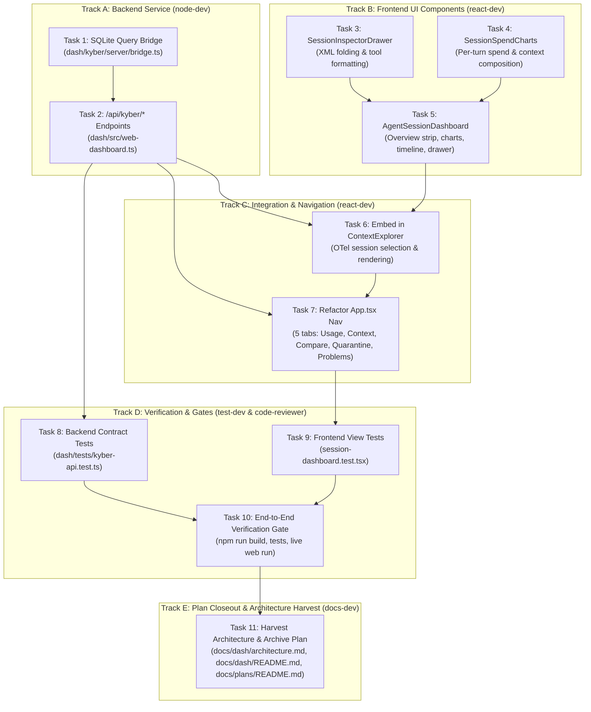

# KyberDash & Agent Session Analysis Integration Plan

**Status:** Complete  
**Archive Date:** 2026-09-03  
**Date:** 2026-09-03  
**Goal:** Complete the integration of KyberDash with `/Users/dave/git/personal/agent-session-analysis-dashboard`: embed deep OpenTelemetry (OTel) context analysis into `ContextExplorer`, implement missing backend `/api/kyber/*` endpoints in `dash/src/web-dashboard.ts`, refactor top navigation to eliminate disconnected blank tabs, and establish dual-database support for live and historical telemetry.

---

## 1. Problem / Motivation

KyberDash was designed to fuse two distinct telemetry systems:
1. **CodeBurn** (vendored in `dash/`): multi-harness token cost and usage tracking from local CLI session logs, terminal UI, menubar/electron apps, and device sharing.
2. **Agent Session Analysis Dashboard** (`/Users/dave/git/personal/agent-session-analysis-dashboard`): deep OpenTelemetry span analysis for AI coding agent sessions (per-turn token spend, context composition by semantic bucket, tool/schema resident cost, execution timeline/tree with attribute inspection, multi-harness comparison).

### Current Broken State & Verified Symptoms
1. **Blank Tabs in Web Dashboard**:
   Navigating to any tab from "Buckets" rightward (`[Buckets] [Schema] [Timeline] [Compare] [Quarantine] [Problems]`) renders a blank screen or an empty fallback skeleton.
   - *Root Cause Link 1 (Verified)*: In `dash/dash/src/App.tsx` (lines 500–582), these tabs trigger React Query fetches to `/api/kyber/schema`, `/api/kyber/timeline`, `/api/kyber/compare`, `/api/kyber/quarantine`, and `/api/kyber/problems`.
   - *Root Cause Link 2 (Verified)*: In `dash/src/web-dashboard.ts`, none of these routes exist. The HTTP request falls through to the SPA catch-all handler (line 550: `serveIndexHtml(res, join(dashDir, 'index.html'))`), returning HTTP 200 with HTML text. React Query's `res.json()` fails with a JSON syntax error, which causes the components to enter permanent error states or render empty data.
2. **Context View Misses Deep Agent Analysis**:
   Navigating to the **Context** tab (`dash/dash/src/components/ContextExplorer.tsx`) and selecting an agent session (such as Copilot, Codex, or Claude) renders only a basic estimated token tree table (`TreeTable`) and 4 metric chips. It fails to expose the rich multi-panel Agent Session Analysis Dashboard (overview strip, per-turn spend chart, context composition heatmap, tool schema ranking, span timeline, and inspector drawer).

### Root-Cause Post-Mortem: Why the Archived Spec Missed It
An audit of `docs/archive/specs/kyberdash/` reveals three structural defects that caused this regression:
1. **Architectural Fragmentation / Inverted Information Architecture**:
   In `agent-session-analysis-dashboard`, Context Composition, Schema Cost, Turn Spend, and Trace Timeline are **facets of a selected agent session**, not global top-level tabs. The archived spec (`requirements.md` R7–R11, `tasks.md` Task 10.2) mistakenly decomposed them as standalone global navigation routes. Consequently, the spec never defined session parameter routing or how session selection in `ContextExplorer` bound to those views.
2. **Phantom Completion of Task 10.2**:
   In `docs/archive/specs/kyberdash/tasks.md`, Task 10.2 ("Wire web dashboard to canonical store") was marked `[x]` complete after only mock React component shells (`dash/dash/src/components/kyber/`) were created with static synthetic props in `kyber-views.test.tsx`. **The backend endpoints in `dash/src/web-dashboard.ts` were never implemented.** Not a single `/api/kyber/*` route was added to the server.
3. **Missing Pipeline & Storage Query Bridge**:
   `dash/kyber/canon/store.ts` was implemented to write raw OTel records to `~/.kyberdash/canon.db`, but KyberDash lacked a query bridge to reconstruct structured session payloads (turns, buckets, timeline hierarchy, schema rankings) from SQLite. Meanwhile, `/Users/dave/git/personal/agent-session-analysis-dashboard/sessions.db` contains 187 pre-analyzed historical sessions across Copilot, Gemini/AGY, and Pi (~37,000 spans) that were completely disconnected from KyberDash.

---

## 2. Approved Decisions

- **D1 (Single Coherent Session View in `Context`)**:
  In `dash/dash/src/components/ContextExplorer.tsx`, selecting an agent session (from live OTel spans or historical sessions) renders the full **Agent Session Analysis Dashboard**:
  - **Overview Strip**: Spans count, turns count, total tokens in/out, cache hit ratio, cost (USD and credits with basis: `published_rates` vs `harness_reported`), reconciliation status (exact root-to-turn token match), subagent parent link, and harness caveats.
  - **Per-Turn Spend Chart**: Stacked token progression across turns (fresh input, cache read, cache creation, output).
  - **Context Composition Heatmap & Chart**: Interactive token distribution across turns by semantic part type (`system_prompt`, `instruction_context`, `tool_definitions`, `conversation_history`, `tool_result_content`, `residual`) with turn/part click handling.
  - **Tool & Schema Cost Table**: Ranked tool schemas, schema size, turns resident, invocation count, and unused schema waste range (floor to ceiling).
  - **Execution Timeline / Call Tree**: Hierarchical span tree with durations, status badges, subagent tags, and auxiliary flags.
  - **Slide-out Inspector Drawer (`SessionInspectorDrawer`)**: Formats harness XML tags (`<instructions>`, `<environment_info>`, `<copilot_instructions>`, `<context>`, etc.) into collapsible `<details>` blocks, and formats tool call parameters and structured results into readable key-value trees.
- **D2 (Top-Level Navigation Refactoring)**:
  Remove disconnected/redundant per-session tabs (`[Buckets] [Schema] [Timeline]`) from the main header navigation since they belong inside the selected session under `Context`. The top nav becomes:
  - `[Usage]`: CodeBurn device overview, top projects, and daily spend trend.
  - `[Context]`: Rich Agent Session Analysis Dashboard with session picker and deep analysis panels.
  - `[Compare]`: Multi-harness cross-comparison matrix (sessions, tokens/turn, tools offered vs invoked, cost basis).
  - `[Quarantine]`: Unclaimed spans and unrecognized namespaces held for triage.
  - `[Problems]`: Validation errors, token reconciliation mismatches, and anomalies.
- **D3 (Backend Endpoints in `dash/src/web-dashboard.ts`)**:
  Implement missing REST endpoints in `dash/src/web-dashboard.ts`:
  - `GET /api/kyber/sessions`: Returns list of available agent sessions with summary metadata.
  - `GET /api/kyber/session/:id`: Returns full session analysis payload (summary, turns, context composition, tools, timeline tree, reconciliation, coverage, notes).
  - `GET /api/kyber/compare`: Returns cross-harness comparison matrix adhering to `ComparisonTable` contract.
  - `GET /api/kyber/quarantine`: Returns quarantined spans and namespaces.
  - `GET /api/kyber/problems`: Returns recorded validation problems and anomalies.
  - `GET /api/kyber/meta`: Returns rate definitions, tokenizer metadata, and ingest source counts.
  - *Backward Compatibility*: Provide optional query parameter support on legacy endpoints (e.g., `GET /api/kyber/context?id=:id`, `GET /api/kyber/schema?id=:id`, `GET /api/kyber/timeline?id=:id`) falling back to the latest active session.
- **D4 (Dual-Database Support & Fallback)**:
  Establish a unified SQLite storage bridge in `dash/kyber/server/bridge.ts` using Node's built-in `node:sqlite` (`DatabaseSync`).
  - Primary path: `~/.kyberdash/canon.db` (live OTel ingested records).
  - Fallback/historical path: `/Users/dave/git/personal/agent-session-analysis-dashboard/sessions.db` (configurable via `AGENTDASH_DB` or `KYBER_DB` environment variables).
  - When `canon.db` contains no sessions or does not exist, seamlessly serve the 187 existing sessions and ~37,000 spans from `sessions.db`. When both exist, aggregate or union available sessions.

---

## 3. Investigation Findings

### Source Analysis: `/Users/dave/git/personal/agent-session-analysis-dashboard`
- **Database Schema (`agentdash/store.py`)**:
  - `session`: `session_id` (PK), `harness`, `adapter_version`, `label`, `is_subagent`, `parent_session`, `agent_name`, `repo`, `branch`, `commit_sha`, `started`, `ended`, `payload` (JSON).
  - `span`: `span_id` (PK), `trace_id`, `parent_span_id`, `source`, `harness`, `name`, `op`, `kind`, `timestamp`, `duration_ms`, `status`, `raw`, `ingested_at`.
  - `quarantine`: `span_id` (PK), `source`, `name`, `namespaces`, `reason`, `seen_at`.
  - `problem`: `id`, `session_id`, `span_id`, `severity`, `code`, `message`, `at`, `harness`.
  - `meta`: `key` (PK), `value`.
  - `token_cache`: `(span_id, attr_key, encoding)` -> `n_tokens`.
- **Precomputed View Payload (`agentdash/views.py`)**:
  The `payload` column in `session` stores the precomputed view JSON containing:
  - `summary`: `turn_count`, `request_count`, `total_input`, `total_output`, `total_cache_read`, `cache_hit_ratio`, `total_cache_creation`, `total_reasoning`, `cost` (`usd`, `credits`, `basis`), `duration_ms`, `models`.
  - `turns`: Array of turn objects with `index`, `tokens` (`fresh_input`, `cache_read`, `cache_creation`, `output`, `reported_input`), `tool_calls`, `cost`.
  - `context`: Context composition per turn: `contextLimit`, `turns` (buckets: `system_prompt`, `tool_definitions`, `instruction_context`, `conversation_history`, `tool_result_content`, `residual`), `headroom`, `pressure`, `accumulationRate`.
  - `tools`: Ranked tool schemas (`name`, `server`, `cost`, `invoked`, `size_tokens`, `turns_resident`, `waste`).
  - `timeline`: Hierarchical tree of span nodes (`spanId`, `traceId`, `name`, `op`, `kind`, `durationMs`, `status`, `content`, `attributes`, `isSubagent`, `isAuxiliary`, `cost`, `children`).
  - `reconciliation`: Request-level input/output token reconciliation between request roots and sum of turn chats.
  - `coverage`: Counts of canonical message parts (`chat_spans`, `tool_spans`, `structured_messages`, `tool_definitions`, etc.).
- **Inspector Drawer & Formatting (`ui/app.js`, `ui/dashboard.html`)**:
  - Tag folding: `XML_FOLD_TAGS = ['environment_info', 'workspace_info', 'instructions', 'copilot_instructions', 'context', 'reminderInstructions', 'editor_context', 'tool_use_instructions', 'notebook_info', 'system_reminder', 'file_contents', 'attachment', 'environment_details']`.
  - `fmtText(raw)`: Extracts matching XML blocks and converts them into collapsible `<details>` elements with `<summary>` previewing the first 90 characters.
  - `fmtPart(p)`: Dispatches message parts by type: `text`, `reasoning`, `tool_call` (wrench icon + JSON parameter table), `tool_result` (return arrow icon + result data).

### Source Analysis: KyberDash (`dash/`)
- **Backend Server (`dash/src/web-dashboard.ts`)**:
  - Contains endpoints: `/api/usage`, `/api/devices`, `/api/identity`, `/api/devices/scan`, `/api/devices/pair`, `/api/share/*`, `/api/context/sessions`, `/api/context/tree`.
  - Zero `/api/kyber/*` endpoints exist.
  - Falls back to `serveIndexHtml` for unrecognized paths, returning HTML instead of JSON.
- **Frontend App (`dash/dash/src/App.tsx`)**:
  - Top navigation at lines 728–737 hardcodes 8 tabs: `usage`, `context`, `kyber-context`, `schema`, `timeline`, `compare`, `quarantine`, `problems`.
  - Panels `KyberSchemaPanel`, `KyberTimelinePanel`, `KyberComparePanel`, `KyberQuarantinePanel`, `KyberProblemsPanel` query non-existent `/api/kyber/*` endpoints.
- **Context Explorer (`dash/dash/src/components/ContextExplorer.tsx`)**:
  - Discovers local CLI transcripts via `/api/context/sessions?provider=...`.
  - On select, renders only `TreeTable` of token rows. Lacks any rendering for OTel agent sessions.
- **Existing React Views (`dash/dash/src/components/kyber/`)**:
  - `ContextView.tsx`, `SchemaView.tsx`, `TimelineView.tsx`, `CompareView.tsx`, `QuarantineView.tsx`, `ProblemsView.tsx` already exist and have defined TypeScript interfaces. They need real data and styling integration.
- **Canonical Store (`dash/kyber/canon/store.ts`)**:
  - Implements `node:sqlite` connection to `~/.kyberdash/canon.db`. Tables: `records`, `token_cache`, `quarantine`, `problems`, `ingest_log`, `metadata`.

---

## 4. Task List

| # | Status | Phase | Component | Agent | Description | Skills | Parallelization & File Scope | Test Contract |
|---|---|---|---|---|---|---|---|---|
| **1** | ✅ Complete | Backend | `KyberDash` | `node-dev` | **Implement SQLite Query Bridge (`dash/kyber/server/bridge.ts`)**: Create query service using `node:sqlite` (`DatabaseSync`). Connect to `~/.kyberdash/canon.db` and fallback to `/Users/dave/git/personal/agent-session-analysis-dashboard/sessions.db` (via env var `AGENTDASH_DB`). Implement: `listSessions()`, `getSessionPayload(id)`, `getComparisonTable()`, `getQuarantine()`, `getProblems()`, `getMeta()`. Handle schema mapping from both `session` table in `sessions.db` and `records` table in `canon.db`. | `app-docs-standard` | **Track A (Backend)**<br>Scope: `dash/kyber/server/bridge.ts` | Unit test in `dash/tests/kyber-bridge.test.ts` asserting queries return expected fixtures from `sessions.db`. |
| **2** | ✅ Complete | Backend | `KyberDash` | `node-dev` | **Implement `/api/kyber/*` Routes in `dash/src/web-dashboard.ts`**: Register HTTP handlers for: `GET /api/kyber/sessions`, `GET /api/kyber/session/:id`, `GET /api/kyber/compare`, `GET /api/kyber/quarantine`, `GET /api/kyber/problems`, `GET /api/kyber/meta`. Wire them to `KyberBridge`. Add backward-compatible handlers for `GET /api/kyber/context`, `/schema`, `/timeline`. Return 404 for missing IDs and 400 for invalid params with application/json errors. | `app-docs-standard` | **Track A (Backend)**<br>Scope: `dash/src/web-dashboard.ts`<br>Depends on: Task 1 | Integration test in `dash/tests/web-dashboard.test.ts` asserting all 6 endpoints return 200 JSON with correct schemas. |
| **3** | ✅ Complete | Frontend | `KyberDash` | `react-dev` | **Implement Slide-out Inspector Drawer (`dash/dash/src/components/SessionInspectorDrawer.tsx`)**: Build drawer component with ESC and backdrop close. Port tag-folding engine for XML tags (`<instructions>`, `<environment_info>`, `<copilot_instructions>`, etc.) into collapsible `<details>` blocks. Format tool calls with input parameters and tool results with structured key-value tables. Support inspecting turns, spans, and context parts. | `modern-web-guidance` | **Track B (Frontend UI)**<br>Scope: `dash/dash/src/components/SessionInspectorDrawer.tsx` | Vitest test verifying tag folding, tool call formatting, and open/close state transitions. |
| **4** | ✅ Complete | Frontend | `KyberDash` | `react-dev` | **Implement Spend & Composition Charts (`dash/dash/src/components/SessionSpendCharts.tsx`)**: Build Per-Turn Spend Chart (stacked bar chart using Recharts: fresh input, cache read, cache creation, output) and Context Composition Heatmap/Bar Chart (token breakdown by bucket: system prompt, instructions, tool definitions, conversation history, tool results, residual). Add interactive turn clicking to trigger drawer inspection. | `modern-web-guidance` | **Track B (Frontend UI)**<br>Scope: `dash/dash/src/components/SessionSpendCharts.tsx` | Vitest test verifying stacked bar calculations and click callback invocations. |
| **5** | ✅ Complete | Frontend | `KyberDash` | `react-dev` | **Implement Full `AgentSessionDashboard.tsx`**: Create composite component `dash/dash/src/components/AgentSessionDashboard.tsx` assembling: (1) Overview Strip with metrics, reconciliation badge, cost basis, and subagent parent link; (2) `SessionSpendCharts`; (3) Tool & Schema Cost ranking table; (4) Execution Timeline call tree (`TimelineView`) with duration and status badges; (5) `SessionInspectorDrawer`. | `modern-web-guidance` | **Track B (Frontend UI)**<br>Scope: `dash/dash/src/components/AgentSessionDashboard.tsx`<br>Depends on: Tasks 3, 4 | Vitest test verifying all subpanels render properly with sample session payload. |
| **6** | ✅ Complete | Frontend | `KyberDash` | `react-dev` | **Integrate `AgentSessionDashboard` into `ContextExplorer.tsx`**: Update `dash/dash/src/components/ContextExplorer.tsx` to support querying agent sessions from `/api/kyber/sessions` when an agent harness (Copilot, Gemini, Pi) is selected. When a session is selected, conditionally render `AgentSessionDashboard` for rich OTel sessions while preserving `TreeTable` for legacy CLI text transcripts. | `modern-web-guidance` | **Track C (Integration)**<br>Scope: `dash/dash/src/components/ContextExplorer.tsx`<br>Depends on: Tasks 2, 5 | Vitest test verifying toggle between OTel session dashboard and CLI TreeTable. |
| **7** | ✅ Complete | Frontend | `KyberDash` | `react-dev` | **Refactor Top Navigation & Fix Global Views in `dash/dash/src/App.tsx`**: In `App.tsx`, update header nav to `[Usage] [Context] [Compare] [Quarantine] [Problems]`. Remove disconnected `[Buckets] [Schema] [Timeline]` buttons. Update `KyberComparePanel`, `KyberQuarantinePanel`, and `KyberProblemsPanel` to consume live data from `/api/kyber/compare`, `/api/kyber/quarantine`, and `/api/kyber/problems`. Ensure error/loading boundaries handle empty data cleanly. | `modern-web-guidance` | **Track C (Integration)**<br>Scope: `dash/dash/src/App.tsx`<br>Depends on: Tasks 2, 6 | Vitest test asserting 5 navigation tabs render and switch views without blank screens. |
| **8** | ✅ Complete | Verification | `KyberDash` | `test-dev` | **Author Comprehensive Backend Contract Tests**: In `dash/tests/kyber-api.test.ts`, spin up `runWebDashboard` with test database and assert that `/api/kyber/sessions`, `/api/kyber/session/:id`, `/api/kyber/compare`, `/api/kyber/quarantine`, `/api/kyber/problems`, and `/api/kyber/meta` return compliant payloads with valid HTTP headers. | `app-docs-standard` | **Track D (Verification)**<br>Scope: `dash/tests/kyber-api.test.ts`<br>Depends on: Task 2 | `npm --prefix dash test tests/kyber-api.test.ts` passes with 100% assertions green. |
| **9** | ✅ Complete | Verification | `KyberDash` | `test-dev` | **Author Frontend View & Component Tests**: Author unit and interaction tests for `AgentSessionDashboard.tsx`, `SessionInspectorDrawer.tsx`, and updated `App.tsx` navigation. Assert that clicking turns and timeline nodes opens the inspector drawer and renders formatted XML tags. | `modern-web-guidance` | **Track D (Verification)**<br>Scope: `dash/dash/src/components/kyber/session-dashboard.test.tsx`<br>Depends on: Tasks 5, 7 | `npm --prefix dash/dash test` or vitest frontend tests pass without regression. |
| **10** | ✅ Complete | Review & Gate | `KyberDash` | `node-dev` | **End-to-End Build & Runbook Verification**: Run full automated verification suite: `npm --prefix dash run build`, `npm --prefix dash test`, `dotnet test tests/KyberWeave.Tests/KyberWeave.Tests.csproj -c Release`. Perform manual live inspection with `node dash/dist/cli.js web --open` verifying real data loads across all 5 tabs. | `app-docs-standard` | **Track D (Verification)**<br>Scope: Entire repository<br>Depends on: All prior tasks | All build commands exit code 0; zero blank tabs; code review approval. |
| **11** | ✅ Complete | Closeout | `KyberDash` | `docs-dev` | **Plan Closeout & Architecture Harvest**: Harvest approved architectural decisions (D1–D4: unified agent session view in `Context`, dual-database SQLite bridge, navigation refactor, and REST API contract) into canonical documentation `docs/dash/architecture.md`, `docs/dash/README.md`, and `docs/dash/runbook.md`. If warranted, record an ADR under `docs/adr/`. Update `docs/plans/README.md` plan inventory, move plan to `docs/archive/plans/`, and ensure `docs validate` and `docs drift` pass with 0 errors. | `kyber-weave-docs`, `app-docs-standard` | **Track E (Closeout)**<br>Scope: `docs/dash/architecture.md`, `docs/dash/README.md`, `docs/plans/README.md`, `docs/archive/plans/`<br>Depends on: Task 10 | `dotnet run --project src/KyberWeave.Cli -- docs validate .` and `dotnet run --project src/KyberWeave.Cli -- docs drift .` pass with 0 findings. |

---

## 5. Sequencing / Dependency Graph

The implementation is structured into two parallel execution tracks (Backend Track A and Frontend Track B) that converge into Integration (Track C) and Verification (Track D):



### Concurrency Guarantees
- **Track A and Track B run concurrently**: `dash/kyber/server/bridge.ts` and `web-dashboard.ts` can be authored simultaneously with `SessionInspectorDrawer.tsx` and `SessionSpendCharts.tsx` without file contention.
- **Track C integrates verified components**: Once Track A endpoints and Track B dashboard components are ready, `ContextExplorer.tsx` and `App.tsx` wire them together.
- **Track D executes testing and validation gates**: Contract tests and visual verifications confirm all approved decisions (D1–D4) are fulfilled.

---

## 6. Residual Decisions & Risks

| Risk / Residual Decision | Impact | Mitigation / Resolution Owner |
|---|---|---|
| **Upstream Subtree Boundary** | `dash/` vendors CodeBurn. Arbitrary edits could create merge conflicts when upstream syncs. | **Mitigation**: All new backend logic is encapsulated in `dash/kyber/server/bridge.ts`. Modifications to `dash/src/web-dashboard.ts` are strictly additive (isolated route blocks under `/api/kyber/*`). Pre-existing routes (`/api/usage`, `/api/devices`, `/api/context/*`) remain untouched. Owner: `node-dev`. |
| **`node:sqlite` Built-in Compatibility** | `node:sqlite` is an experimental built-in in Node 22 (`DatabaseSync`). Behavior must remain consistent across macOS and Linux. | **Mitigation**: `dash/kyber/canon/store.ts` already uses `node:sqlite` in production. We use standard synchronous queries (`prepare().all()`, `prepare().get()`) and wrap with try/catch. Owner: `node-dev`. |
| **Database Path Resolution & Permissions** | In production or dev, `~/.kyberdash/canon.db` or `/Users/dave/git/personal/agent-session-analysis-dashboard/sessions.db` might not exist or may be read-only. | **Mitigation**: `KyberBridge` checks file existence before connecting with `existsSync`. It supports an explicit env override `AGENTDASH_DB` or `KYBER_DB` and falls back gracefully to an empty in-memory store if neither file exists, returning empty arrays (`{ sessions: [] }`) rather than crashing. Owner: `node-dev`. |
| **Payload Size & Truncation** | Some trace payloads contain megabytes of JSON string attributes, which could slow down browser rendering or cause memory pressure. | **Mitigation**: Port the recursive string clipping utility (`_clip(value, maxString=2000)`) from `agentdash/views.py` into `KyberBridge` so oversized leaf strings are safely truncated while preserving structural JSON. Owner: `node-dev`. |

---

## 7. Out of Scope

- **Mutating Live Telemetry / Ingest Changes**: This plan does not alter how `aspire otel spans` exports telemetry or how `kyber-observe` collectors run. Telemetry ingest remains read-only.
- **Modifying C# KyberWeave CLI Core**: Changes are entirely confined to `dash/` (Node.js backend and React web UI). `KyberWeave.sln` C# codebase is untouched except for executing automated test gates (`dotnet test`).
- **New Harness Adapters**: No new harness adapters are introduced in this phase. The existing three harnesses (GitHub Copilot, Gemini/AGY, Pi) in `sessions.db` and `canon.db` are the target corpus.

---

## 8. Required Skills & Specialist Agents

- **React / Frontend Specialist (`react-dev`)**:
  - Skills: `modern-web-guidance`
  - Responsibilities: Authoring `SessionInspectorDrawer.tsx`, `SessionSpendCharts.tsx`, `AgentSessionDashboard.tsx`, refactoring `App.tsx` top navigation, and updating `ContextExplorer.tsx`.
- **Node.js / Backend Specialist (`node-dev`)**:
  - Skills: `app-docs-standard`
  - Responsibilities: Implementing `dash/kyber/server/bridge.ts` (`node:sqlite` query layer) and registering `/api/kyber/*` HTTP routes in `dash/src/web-dashboard.ts`.
- **Test Engineer (`test-dev`)**:
  - Skills: `app-docs-standard`, `modern-web-guidance`
  - Responsibilities: Authoring automated contract tests in `dash/tests/kyber-api.test.ts` and component test suites in `dash/dash/src/components/kyber/`.
- **Code Reviewer & Quality Gate (`code-reviewer`)**:
  - Skills: `app-docs-standard`, `doc-corpus-integrity-review`
  - Responsibilities: Verifying code hygiene, zero regression on upstream CodeBurn features, ontology compliance, and approving final pull request.
- **Technical Documentation Specialist (`docs-dev`)**:
  - Skills: `kyber-weave-docs`, `app-docs-standard`
  - Responsibilities: Harvesting durable architectural decisions (D1–D4) into canonical documentation (`docs/dash/architecture.md`, `docs/dash/README.md`, `docs/dash/runbook.md`), drafting any required ADR, updating the plan inventory in `docs/plans/README.md`, archiving the completed plan, and running `docs validate` and `docs drift`.

---

## 9. Verification Harness

### 1. Automated Verification Commands
All of the following commands must execute with exit code 0:
```bash
# 1. Backend contract tests
npm --prefix dash test tests/web-dashboard.test.ts tests/kyber-api.test.ts

# 2. Frontend typecheck and unit tests
npm --prefix dash/dash run typecheck
npm --prefix dash test tests/kyber-views.test.tsx

# 3. Frontend production build
npm --prefix dash run build

# 4. Repository-wide C# build and test gates
dotnet test tests/KyberWeave.Tests/KyberWeave.Tests.csproj -c Release
```

### 2. Manual End-to-End Verification Runbook
1. **Launch Server**:
   ```bash
   node dash/dist/cli.js web --port 8899 --open
   ```
2. **Verify Navigation (D2)**:
   - Verify header nav displays exactly: `[Usage] [Context] [Compare] [Quarantine] [Problems]`.
   - Verify `[Buckets]`, `[Schema]`, and `[Timeline]` tabs are no longer in the top navigation.
3. **Verify Context Explorer & Agent Session View (D1, D4)**:
   - Click `Context` tab.
   - Under harness options, select an agent harness (e.g. Copilot or Pi).
   - Select one of the 187 sessions:
     - Verify **Overview Strip** displays span count, turn count, token totals, cache hit ratio, cost basis, and reconciliation status.
     - Verify **Per-Turn Spend Chart** renders stacked bars (fresh input, cache read, cache creation, output).
     - Verify **Context Composition Heatmap** displays token distribution across buckets (`system_prompt`, `instruction_context`, `tool_definitions`, `conversation_history`, `tool_result_content`).
     - Verify **Tool & Schema Cost Table** lists ranked tools with turns resident and unused waste.
     - Verify **Execution Timeline** displays the hierarchical span call tree.
4. **Verify Inspector Drawer (D1)**:
   - Click on a turn in the Context Composition chart or a span in the Timeline.
   - Verify `SessionInspectorDrawer` slides out from the right.
   - Verify XML tags like `<instructions>` or `<environment_info>` are folded into collapsible `<details>`.
   - Verify tool calls render parameters and tool results cleanly.
   - Press `Escape` or click backdrop to verify drawer closes cleanly.
5. **Verify Global Views (D3)**:
   - Click `Compare`: Verify cross-harness comparison matrix renders with data from `sessions.db` (not blank).
   - Click `Quarantine`: Verify quarantined spans table renders.
   - Click `Problems`: Verify problems and validation issues table renders.
