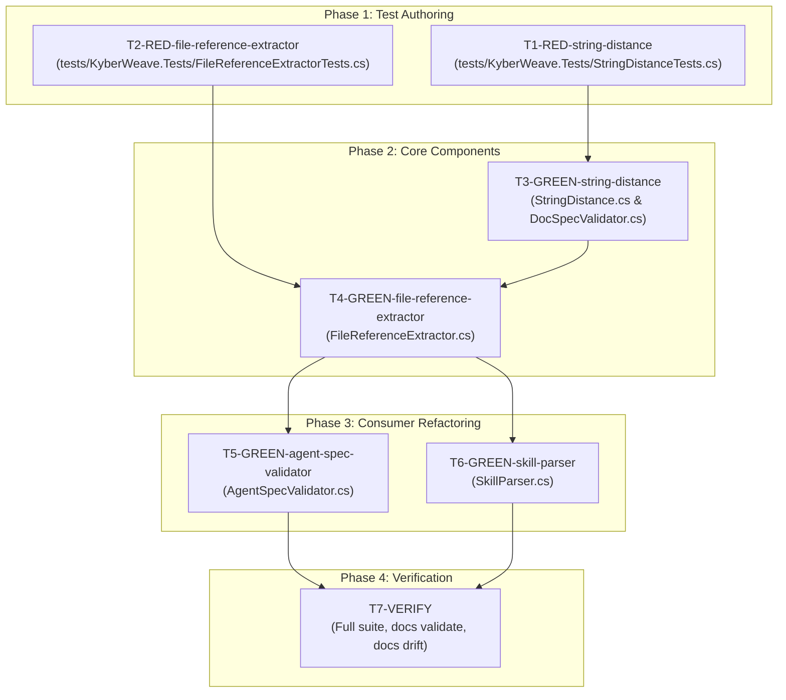

# Share file-reference extraction between SkillParser and AgentSpecValidator

## Status

Complete: council APPROVE, 15/15 gates green, 2026-09-26. All unit tests (2,227) pass.

## Problem and goal

[Issue #134](https://github.com/dpalfery/kyber-weave/issues/134) reports that `AgentSpecValidator` (implementing `KW-AGENT-SPEC-004`, added in PR #120) re-implements file-reference extraction, link parsing, skip rules, path normalization, and resolution logic that `SkillParser` already had, because `SkillParser` members are private. The two copies have drifted:
1. **Inline-path regex**: `SkillParser` (line 34–35) and `AgentSpecValidator` (line 315–316 / 403) both target subdirectories `scripts/`, `references/`, and `assets/`, but `SkillParser` matches globally across body text while `AgentSpecValidator` matches strictly against markdown `CodeInline` spans (`\A...\z`).
2. **Markdown link extraction**: Both iterate Markdig `LinkInline` descendants from the document AST.
3. **Skip rules**: Both skip URLs (`http://`, `https://`), anchors (`#`), and `mailto:`, but `AgentSpecValidator` uses case-insensitive scheme matching, also skips Config Reg `<tokens>` (e.g. `<docs-root>`) and absolute filesystem paths (`C:/`, `\\`, `//`, rooted), and strips `#fragment` suffixes before checking disk resolution.
4. **Resolution relative to owning directory**: Both check path traversal and resolve relative to an owning directory path (`agent.DirectoryPath` vs `skill.DirectoryPath`).
5. **Nearest-match hints & Levenshtein distance**: `AgentSpecValidator` computes nearest-match candidate hints using Levenshtein distance, which is duplicated between `AgentSpecValidator` (line 373) and `DocSpecValidator` (line 450).

The goal is to extract one cohesive, internal reference-extraction and resolution helper in `KyberWeave.Core.Parsing` (`FileReferenceExtractor`), and one shared string distance helper in `KyberWeave.Core.Text` (`StringDistance`), eliminating duplicated regex, parsing, resolution, and edit distance logic across `SkillParser`, `AgentSpecValidator`, and `DocSpecValidator`, while keeping existing diagnostic codes and hint text completely preserved.

## Intake assessment

Recommendation: **PLAN**. This is an architectural consolidation and refactoring within `KyberWeave.Core` without API-breaking external contract changes. It touches core parsing, validation rules (`KW-AGENT-SPEC-004`, `KW-SKILL-SPEC-011`, `KW-SKILL-SPEC-012`), and string distance utilities. The blast radius is internal to `KyberWeave.Core` and exercised by existing governance test suites.

## Development mode

`test-first` — repository default. Every task includes explicit RED test evidence requirements before GREEN implementation.

## Discovery method

Exploration used CodeGraph (`codegraph_explore`), KyberWeave docs tools (`docs_explore`), and direct file inspection of:
- `src/KyberWeave.Core/Skills/Parsing/SkillParser.cs`
- `src/KyberWeave.Core/Agents/Validation/AgentSpecValidator.cs`
- `src/KyberWeave.Core/Docs/Validation/DocSpecValidator.cs`
- `src/KyberWeave.Core/Parsing/MarkdownFrontmatterReader.cs`
- `src/KyberWeave.Core/Text/TextVectorizer.cs`
- `tests/KyberWeave.Tests/AgentGovernanceTests.cs`
- `tests/KyberWeave.Tests/SkillParserTests.cs`
- `tests/KyberWeave.Tests/HotshotGoldenContractTests.cs`
- `tests/KyberWeave.Tests/DocGovernanceTests.cs`

## Approved decisions

| ID | Decision | Approval provenance |
|---|---|---|
| A1 | Use `development-mode: test-first`. | Autonomous user instruction ("use a plan, dont ask me any questions, run autonomously"). |
| A2 | Keep scope strictly bounded to Issue #134 (sharing reference extraction/resolution between `SkillParser` and `AgentSpecValidator`, and Levenshtein distance with `DocSpecValidator`); no production code changes outside plan authoring during planning. | Autonomous user instruction. |
| D1 | **Extract shared `StringDistance.Levenshtein`**: Create `src/KyberWeave.Core/Text/StringDistance.cs` providing `Levenshtein(string a, string b, bool ignoreCase = false)`. Consume it in `DocSpecValidator.Nearest` (`ignoreCase: true`) and `FileReferenceExtractor.FindNearestMatch` (`ignoreCase: false`), removing duplicate private Levenshtein implementations from `DocSpecValidator` and `AgentSpecValidator`. | Autonomous user instruction. Unified edit distance algorithm eliminates duplicated matrix computations across docs and agent validators. |
| D2 | **Extract shared `FileReferenceExtractor`**: Create `src/KyberWeave.Core/Parsing/FileReferenceExtractor.cs` in `KyberWeave.Core.Parsing` (co-located with `MarkdownFrontmatterReader`). Define `ExtractedFileReference` record struct and `FileReferenceOptions`. | Autonomous user instruction. Precedent from `MarkdownFrontmatterReader` confirms `KyberWeave.Core.Parsing` is the canonical home for format/model-agnostic Markdown extraction utilities. |
| D3 | **Configurable inline path scanning mode**: Provide `InlinePathScanMode`: `CodeInlineOnly` (for `AgentSpecValidator`, matching complete inline code spans to prevent prose false positives, honoring `OnlyCompleteInlineCodePathsAreChecked`) and `UnfencedText` (for `SkillParser`, matching `scripts/`, `references/`, `assets/` anywhere in body text, honoring `SkillParserTests.ExtractsReferenceLinks`). | Autonomous user instruction. Preserves caller-specific inline extraction contracts without duplicating the path regex or directory list. |
| D4 | **Path traversal handling**: `FileReferenceOptions.SkipPathTraversal`: `true` for `AgentSpecValidator` (traversal references are excluded from `KW-AGENT-SPEC-004`), and `false` for `SkillParser` (traversal references are retained with `Exists = false, IsPathTraversal = true`, allowing `SpecValidator` to emit `KW-SKILL-SPEC-011`). | Autonomous user instruction. Preserves distinct validator responsibilities: agent specs ignore relative escapes in broken-ref check, while skill specs explicitly flag `KW-SKILL-SPEC-011` for directory escapes. |
| D5 | **Deliberate skill behavior improvements**: (1) Skip `<tokens>` (e.g. `<docs-root>`) in skills; (2) Strip `#fragment` suffixes before checking disk resolution, allowing links with section anchors (e.g. `references/guide.md#heading`) to resolve when the file exists; (3) Skip foreign/absolute filesystem paths (`C:/`, `/`, `\\`, `//`); (4) Keep diagnostic codes and hint texts for each validator unchanged (`KW-AGENT-SPEC-004` keeps nearest-match hints; `KW-SKILL-SPEC-011` and `012` keep existing spec messages). | Autonomous user instruction. Closes subtle drift in skill parsing while maintaining strict backward compatibility for diagnostic assertions. |
| D6 | **Shared filesystem case sensitivity probing**: Move `GetPathComparer(string directoryPath)` into `FileReferenceExtractor` so both agents and skills respect filesystem case sensitivity (e.g. Linux ext4 vs macOS APFS / Windows NTFS) without duplicate probe logic. | Autonomous user instruction. Ensures uniform cross-platform filesystem fidelity across all artifact references. |

## Investigation findings

1. **Current Duplication between `SkillParser` and `AgentSpecValidator`**:
   - Both classes compile regexes targeting `(?:scripts|references|assets)/[A-Za-z0-9._\-/]+`.
   - Both parse Markdown AST looking for `LinkInline` elements.
   - Both implement `ResolvesOnDisk` by resolving `Path.GetFullPath(Path.Combine(directoryPath, relative))` and verifying it stays prefixed with `directoryPath` and exists on disk.
   - `AgentSpecValidator` has 130 lines of code for `GetPathComparer`, `FindNearestMatch`, and `LevenshteinDistance` that were written as private helpers.
2. **Current Duplication between `AgentSpecValidator` and `DocSpecValidator`**:
   - `AgentSpecValidator.LevenshteinDistance` (line 373) implements Wagner-Fischer edit distance case-sensitively.
   - `DocSpecValidator.Levenshtein` (line 450) implements Wagner-Fischer edit distance case-insensitively using `char.ToLowerInvariant`.
   - Both maintain $(N+1)$ row buffers. Unifying into `StringDistance.Levenshtein(a, b, ignoreCase)` in `KyberWeave.Core.Text` cleanly serves both.
3. **Behavioral Distinctions to Reconcile**:
   - `AgentSpecValidator` only matches inline paths when they occupy the entire `CodeInline` span (`\A...\z`). This was explicitly tested in `OnlyCompleteInlineCodePathsAreChecked` to prevent plain text like `Plain references/plain.md` from triggering diagnostics.
   - `SkillParser` matches inline paths across the raw markdown body text, even without backticks (`See scripts/run.py for details.`), tested in `SkillParserTests.ExtractsReferenceLinks`.
   - `AgentSpecValidator` strips `#anchor` fragments before testing disk existence (`references/guide.md#sec` checks if `references/guide.md` exists). `SkillParser` did not, causing anchor links to fail resolution on disk.
   - `AgentSpecValidator` skips `<property-name>` Config Reg tokens and absolute paths (`C:/`, `/`, `\\`). `SkillParser` attempted to resolve them against `directoryPath` which failed.
4. **Assembly Visibility**:
   - `src/KyberWeave.Core/KyberWeave.Core.csproj` already includes `<InternalsVisibleTo Include="KyberWeave.Tests" />`.
   - `FileReferenceExtractor` can be declared `internal static partial class FileReferenceExtractor` in `KyberWeave.Core.Parsing`, fully accessible to tests and internal callers.

## Scope

In scope:
- Create `src/KyberWeave.Core/Text/StringDistance.cs` with unit tests in `tests/KyberWeave.Tests/StringDistanceTests.cs`.
- Refactor `DocSpecValidator.cs` to consume `StringDistance.Levenshtein`.
- Create `src/KyberWeave.Core/Parsing/FileReferenceExtractor.cs` (with models `ExtractedFileReference`, `FileReferenceOptions`, `InlinePathScanMode`).
- Unit tests in `tests/KyberWeave.Tests/FileReferenceExtractorTests.cs` exercising all extraction modes, skip rules, path normalization, anchor stripping, case sensitivity, and nearest-match hints.
- Refactor `AgentSpecValidator.cs` to delegate file-reference extraction and nearest-match calculation to `FileReferenceExtractor`.
- Refactor `SkillParser.cs` to delegate reference extraction to `FileReferenceExtractor`.
- Add test coverage for deliberate skill reference enhancements (fragments, tokens, absolute paths) in `tests/KyberWeave.Tests/SkillParserTests.cs`.
- Regression check of existing test suite (`AgentGovernanceTests`, `SkillParserTests`, `DocGovernanceTests`, `HotshotGoldenContractTests`).

Out of scope:
- Modifying diagnostic rule IDs or default hint texts (`KW-AGENT-SPEC-004`, `KW-SKILL-SPEC-011`, `KW-SKILL-SPEC-012`).
- Changing resource discovery (`DiscoverResources` / `SkillResourceKind`) in `SkillParser.cs`.
- Modifying document loader or link verification in `DocSpecValidator` beyond the shared Levenshtein helper.

## Test contract

| Task | Test project or file | Runner command | Observable behavior | RED evidence required | GREEN acceptance |
|---|---|---|---|---|---|
| T1 | `tests/KyberWeave.Tests/StringDistanceTests.cs` | `dotnet test tests/KyberWeave.Tests/KyberWeave.Tests.csproj -c Release --filter "FullyQualifiedName~StringDistanceTests"` | `StringDistance.Levenshtein` returns exact edit distance for identical strings (0), empty strings, substitutions, insertions, deletions, and supports `ignoreCase: true` vs `ignoreCase: false`. | Author tests before implementing `StringDistance`. Compilation fails or tests fail because `StringDistance` does not exist yet. | `StringDistance` is implemented; all `StringDistanceTests` pass. |
| T2 | `tests/KyberWeave.Tests/FileReferenceExtractorTests.cs` | `dotnet test tests/KyberWeave.Tests/KyberWeave.Tests.csproj -c Release --filter "FullyQualifiedName~FileReferenceExtractorTests"` | `FileReferenceExtractor` extracts links and inline code paths, strips `./` and `#fragment`, skips URLs/mailto/<tokens>/absolute paths, resolves against disk relative to directory, respects case sensitivity, and suggests nearest match within directory. | Author tests before implementing `FileReferenceExtractor`. Compilation fails or tests fail because `FileReferenceExtractor` does not exist yet. | `FileReferenceExtractor` is implemented; all `FileReferenceExtractorTests` pass. |
| T3 | `tests/KyberWeave.Tests/DocGovernanceTests.cs` | `dotnet test tests/KyberWeave.Tests/KyberWeave.Tests.csproj -c Release --filter "FullyQualifiedName~DocGovernanceTests"` | `DocSpecValidator` hints and vocabulary validation continue to work identically when using `StringDistance.Levenshtein`. | Verify baseline before refactor. | All `DocGovernanceTests` continue to pass without regression. |
| T4 | `tests/KyberWeave.Tests/AgentGovernanceTests.cs` | `dotnet test tests/KyberWeave.Tests/KyberWeave.Tests.csproj -c Release --filter "FullyQualifiedName~AgentGovernanceTests"` | `AgentSpecValidator` emits `KW-AGENT-SPEC-004` identically with correct paths and nearest-match hints using `FileReferenceExtractor`. | Tests already exist; after removing private helpers from `AgentSpecValidator` and delegating to `FileReferenceExtractor`, all pass. | All 10+ `KW-AGENT-SPEC-004` tests in `AgentGovernanceTests` pass. |
| T5 | `tests/KyberWeave.Tests/SkillParserTests.cs` | `dotnet test tests/KyberWeave.Tests/KyberWeave.Tests.csproj -c Release --filter "FullyQualifiedName~SkillParserTests"` | `SkillParser` extracts references (including plain text paths in body), correctly resolves files, handles fragments without failing, and ignores `<tokens>` and absolute paths. | Add tests for fragment stripping and token skipping in `SkillParserTests`. | All `SkillParserTests` pass. |
| T6 | Full test suite | `dotnet test -c Release` | All repository unit and integration tests pass across `KyberWeave.Tests`. | - | 2,179+ tests pass with 0 failures. |

## Tasks

### T1-RED-string-distance: Test StringDistance helper (test-dev)
**id**: T1-RED-string-distance  
**specialist**: test-dev  
**scope**: `tests/KyberWeave.Tests/StringDistanceTests.cs`  
**depends-on**: None  
**concurrency**: Can run in parallel with T2-RED.

**Acceptance criteria**:
1. Create `tests/KyberWeave.Tests/StringDistanceTests.cs`.
2. Add facts testing:
   - Identical strings return 0.
   - Empty vs non-empty returns string length.
   - Case sensitivity flag: `"abc"` vs `"ABC"` returns 0 when `ignoreCase: true`, and 3 when `ignoreCase: false`.
   - Single character insert/delete/substitute returns 1.
   - Transposition distance is correct.
   - Edit distance parity with previous `AgentSpecValidator.LevenshteinDistance` and `DocSpecValidator.Levenshtein`.

### T2-RED-file-reference-extractor: Test FileReferenceExtractor helper (test-dev)
**id**: T2-RED-file-reference-extractor  
**specialist**: test-dev  
**scope**: `tests/KyberWeave.Tests/FileReferenceExtractorTests.cs`, `tests/KyberWeave.Tests/SkillParserTests.cs`  
**depends-on**: None  
**concurrency**: Can run in parallel with T1-RED.

**Acceptance criteria**:
1. Create `tests/KyberWeave.Tests/FileReferenceExtractorTests.cs`.
2. Add facts testing:
   - Extraction of Markdown `LinkInline` links (`[text](references/guide.md)`).
   - Extraction of complete `CodeInline` spans in `CodeInlineOnly` mode (`` `references/guide.md` ``).
   - Non-extraction of unfenced text in `CodeInlineOnly` mode (`references/plain.md` ignored).
   - Extraction of unfenced paths in `UnfencedText` mode.
   - Normalization: `./references/guide.md` normalized to `references/guide.md`.
   - Fragment stripping: `references/guide.md#overview` strips `#overview` and resolves `references/guide.md`.
   - Exclusion of URLs (`http://`, `https://`, case-insensitive), `mailto:`, and anchor-only (`#`).
   - Exclusion of Config Reg `<tokens>` (e.g. `<docs-root>`).
   - Exclusion of foreign/absolute paths (`C:/foo`, `/etc/bar`, `\\share\path`, `//unc/path`).
   - Path traversal handling: skipped when `SkipPathTraversal = true`; returned with `IsPathTraversal = true` and `Exists = false` when `false`.
   - Nearest match computation: finds existing file within directory if edit distance <= 3; returns null if directory does not exist or distance > 3; never escapes parent directory.
3. In `tests/KyberWeave.Tests/SkillParserTests.cs`, add tests verifying:
   - Reference with `#fragment` anchor resolves when the target file exists.
   - Config Reg `<token>` references are skipped as non-file references.
   - Foreign absolute paths are skipped.

### T3-GREEN-string-distance: Implement StringDistance & refactor DocSpecValidator (csharp-dev)
**id**: T3-GREEN-string-distance  
**specialist**: csharp-dev  
**scope**: `src/KyberWeave.Core/Text/StringDistance.cs`, `src/KyberWeave.Core/Docs/Validation/DocSpecValidator.cs`  
**depends-on**: T1-RED-string-distance  
**concurrency**: Blocks T4-GREEN (FileReferenceExtractor uses StringDistance).

**Acceptance criteria**:
1. Create `src/KyberWeave.Core/Text/StringDistance.cs` with `public static int Levenshtein(string a, string b, bool ignoreCase = false)`.
2. Implement two-row matrix algorithm with zero unnecessary allocations.
3. In `src/KyberWeave.Core/Docs/Validation/DocSpecValidator.cs`:
   - Replace call to private `Levenshtein` with `StringDistance.Levenshtein(value, candidate, ignoreCase: true)`.
   - Delete private `Levenshtein(string a, string b)` method from `DocSpecValidator.cs`.
4. Run `StringDistanceTests` and `DocGovernanceTests`; all must pass.

### T4-GREEN-file-reference-extractor: Implement FileReferenceExtractor (csharp-dev)
**id**: T4-GREEN-file-reference-extractor  
**specialist**: csharp-dev  
**scope**: `src/KyberWeave.Core/Parsing/FileReferenceExtractor.cs`  
**depends-on**: T2-RED-file-reference-extractor, T3-GREEN-string-distance  
**concurrency**: Blocks T5-GREEN and T6-GREEN.

**Acceptance criteria**:
1. Create `src/KyberWeave.Core/Parsing/FileReferenceExtractor.cs` containing:
   - `ExtractedFileReference` record struct.
   - `InlinePathScanMode` enum (`CodeInlineOnly`, `UnfencedText`).
   - `FileReferenceOptions` class with preconfigured `AgentDefault` and `SkillDefault`.
   - `ExtractFromText`, `ExtractFromTexts`, and `ExtractFromDocument` methods.
   - Single source of truth for inline path regexes (`FullInlineSpanPattern` and `UnfencedPathPattern`).
   - Shared path normalization, fragment stripping, skip rules, and disk resolution.
   - Shared `GetPathComparer` for filesystem case-sensitivity detection.
   - Shared `FindNearestMatch` using `StringDistance.Levenshtein`.
2. Run `FileReferenceExtractorTests`; all must pass.

### T5-GREEN-agent-spec-validator: Refactor AgentSpecValidator (csharp-dev)
**id**: T5-GREEN-agent-spec-validator  
**specialist**: csharp-dev  
**scope**: `src/KyberWeave.Core/Agents/Validation/AgentSpecValidator.cs`  
**depends-on**: T4-GREEN-file-reference-extractor  
**concurrency**: Can run in parallel with T6-GREEN.

**Acceptance criteria**:
1. In `AgentSpecValidator.ValidateBrokenFileReferences`:
   - Delegate extraction to `FileReferenceExtractor.ExtractFromTexts` using `FileReferenceOptions.AgentDefault`.
   - Emit `RuleBrokenFileReference` (`KW-AGENT-SPEC-004`) using `reference.Reference`, `reference.ResolvedFullPath`, and `reference.NearestMatch`.
2. Delete private methods in `AgentSpecValidator.cs`:
   - `InlinePathRegex` / `InlinePathPattern`
   - `ExtractReferencesFromText`
   - `ConsiderReference`
   - `ResolvesOnDisk`
   - `GetPathComparer`
   - `FindNearestMatch`
   - `LevenshteinDistance`
3. Preserve all diagnostic messages, rule codes, and hint texts exactly.
4. Run `AgentGovernanceTests`; all tests must pass.

### T6-GREEN-skill-parser: Refactor SkillParser (csharp-dev)
**id**: T6-GREEN-skill-parser  
**specialist**: csharp-dev  
**scope**: `src/KyberWeave.Core/Skills/Parsing/SkillParser.cs`  
**depends-on**: T4-GREEN-file-reference-extractor  
**concurrency**: Can run in parallel with T5-GREEN.

**Acceptance criteria**:
1. In `SkillParser.cs`:
   - Replace private `ExtractReferenceLinks` implementation with call to `FileReferenceExtractor.ExtractFromDocument` using `FileReferenceOptions.SkillDefault`.
   - Map `ExtractedFileReference` to `SkillReferenceLink(r.Reference, r.Exists)`.
   - Delete private `InlinePathRegex` / `MyRegex` and `ResolvesOnDisk` from `SkillParser.cs`.
2. Run `SkillParserTests`, `SpecValidatorTests`, and `HotshotGoldenContractTests`; all must pass.

### T7-VERIFY: Comprehensive verification and drift audit (qa-specialist)
**id**: T7-VERIFY  
**specialist**: qa-specialist  
**scope**: Solution-wide verification  
**depends-on**: T5-GREEN-agent-spec-validator, T6-GREEN-skill-parser  
**concurrency**: Sequential final gate.

**Acceptance criteria**:
1. Run full unit and integration test suite: `dotnet test -c Release`.
2. Run documentation ontology validation: `dotnet run --project src/KyberWeave.Cli -c Release -- docs validate .`.
3. Run documentation code-ref drift check: `dotnet run --project src/KyberWeave.Cli -c Release -- docs drift .`.
4. Ensure 0 errors, 0 warnings across all gates.

## Dependency graph and concurrency audit

### Concurrency audit
- **Phase 1 (RED)**: T1 and T2 run concurrently (concurrency = 2).
- **Phase 2 (Core GREEN)**: T3 runs first, then T4 consumes `StringDistance` (sequential).
- **Phase 3 (Consumer GREEN)**: T5 and T6 run concurrently against distinct files `AgentSpecValidator.cs` and `SkillParser.cs` (concurrency = 2).
- **Phase 4 (VERIFY)**: T7 runs sequentially after consumers are refactored.
- **Max concurrency**: 2.

## Risks and mitigations

| Risk | Impact | Mitigation |
|---|---|---|
| Subtle behavioral drift in `KW-AGENT-SPEC-004` diagnostics or hints | High (breaks agent governance tests or CI linting) | T5 explicitly preserves the exact diagnostic string and fallback hint wording. Existing tests in `AgentGovernanceTests` (including case sensitivity and complete code span checks) must pass without modification. |
| Inadvertent breaking change for skills (e.g. dropping unfenced paths) | High (skills fail to discover referenced scripts or assets) | `InlinePathScanMode.UnfencedText` ensures regex scanning over raw body text remains available and active for `SkillParser`. `SkillParserTests` and `HotshotGoldenContractTests` verify this behavior. |
| Cross-platform path casing differences | Medium (flaky tests on Linux vs macOS/Windows) | `GetPathComparer` probing logic is preserved and shared in `FileReferenceExtractor`, tested in `AgentGovernanceTests.DifferentlyCasedReferencesAreCheckedAccordingToTheFilesystem`. |
| Performance overhead from repeated Markdig parsing | Low | `SkillParser` already parses Markdig document for YAML; it passes the parsed `MarkdownDocument` directly to `FileReferenceExtractor.ExtractFromDocument` without re-parsing. |

## Verification gates

1. `dotnet test tests/KyberWeave.Tests/KyberWeave.Tests.csproj -c Release --filter "FullyQualifiedName~StringDistanceTests"` -> PASS
2. `dotnet test tests/KyberWeave.Tests/KyberWeave.Tests.csproj -c Release --filter "FullyQualifiedName~FileReferenceExtractorTests"` -> PASS
3. `dotnet test tests/KyberWeave.Tests/KyberWeave.Tests.csproj -c Release --filter "FullyQualifiedName~AgentGovernanceTests"` -> PASS
4. `dotnet test tests/KyberWeave.Tests/KyberWeave.Tests.csproj -c Release --filter "FullyQualifiedName~SkillParserTests"` -> PASS
5. `dotnet test tests/KyberWeave.Tests/KyberWeave.Tests.csproj -c Release --filter "FullyQualifiedName~DocGovernanceTests"` -> PASS
6. `dotnet test tests/KyberWeave.Tests/KyberWeave.Tests.csproj -c Release` -> 2,179+ tests PASS, 0 failed
7. `dotnet run --project src/KyberWeave.Cli -c Release -- docs validate .` -> 0 critical, 0 error, 0 warning
8. `dotnet run --project src/KyberWeave.Cli -c Release -- docs drift .` -> 0 critical, 0 error, 0 warning
