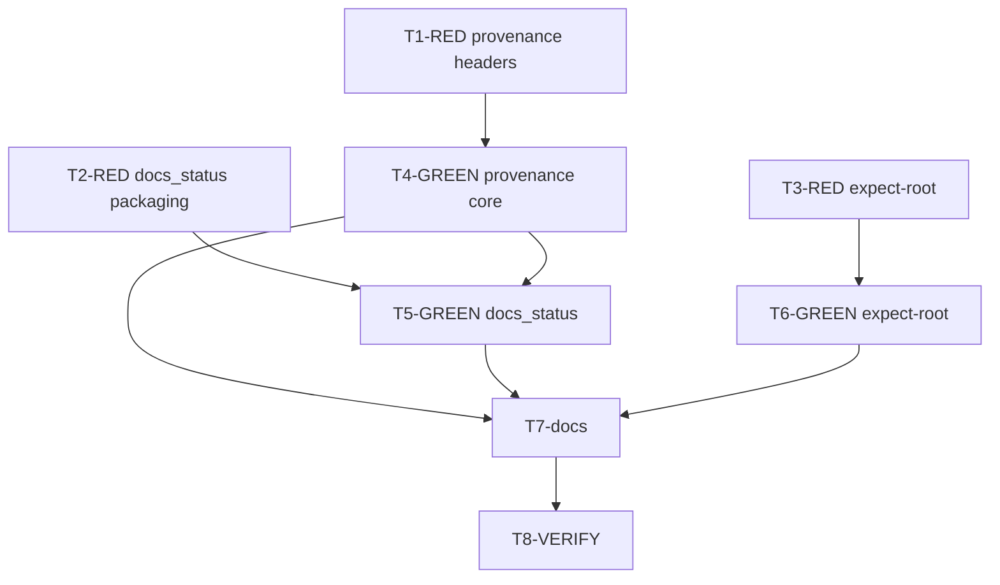

# Disclose MCP docs corpus provenance so a mis-rooted server cannot answer silently
## Status
Complete and archived on 2026-09-29. Delivered provenance headers on every docs MCP tool response, `docs_status`, `--expect-root` / `KYBER_WEAVE_EXPECT_ROOT` refuse-to-serve (`KW-MCP-ROOT-002`), and agent/runbook guidance. Development mode: `test-first`. Fixes [issue #162](https://github.com/dpalfery/kyber-weave/issues/162). Verification: `FullyQualifiedName~Mcp` 80/80 passed; `docs validate .` zero findings; `docs drift .` unavailable without a local CodeGraph index.
## Problem and goal
[Issue #162](https://github.com/dpalfery/kyber-weave/issues/162) reports that the four docs MCP tools (`docs_explore`, `docs_for_symbol`, `docs_glossary`, `docs_analysis_candidates`) never disclose which repository root, commit, or corpus they answered from. When a same-named `kyber-weave` server is bound to a different checkout than the one being edited (user-scope / Desktop config pinned to another `--repo-root`), answers still look authentic. Agents trust them because root `AGENTS.md` Exploration order directs them to MCP `docs_explore` first. Observed evidence: a stale 91-document corpus including a deleted todo outranked a correctly rooted 72-document server; the only tell was document count and a non-existent path.
**Goal:** Every docs tool response carries an unambiguous provenance header (absolute resolved root, HEAD short SHA with dirty flag, document count); the same facts are available once per session via a small `docs_status` tool; optional `--expect-root` / `KYBER_WEAVE_EXPECT_ROOT` refuses to serve when the resolved root differs; and Exploration order tells agents to compare the header to `git rev-parse --show-toplevel` before trusting an answer.
## Intake assessment
Recommendation: **PLAN** (user chose PLAN). Bounded change inside the existing DocGraph MCP surface. Product architecture, tool set, and root resolution are established (`RepositoryRootResolver`, `DocumentIndexHost`, `DocsTools`). Requirements come from the issue acceptance criteria; no new product surface beyond provenance disclosure and a defensive bind check.
## Development mode
`test-first` — conductor default; user has not opted out. Every implementation task has a Test-contract row; RED evidence is required before GREEN.
## Discovery method
No `.codegraph/` on this checkout (CodeGraph skipped). Kyber-Weave MCP docs tools were not used for this planning pass (self-gathered). Direct inspection of:
- `src/KyberWeave.Mcp/DocsTools.cs` — four tools; response lead lines name hit counts only, never root or revision
- `src/KyberWeave.Mcp/Program.cs` — root resolve via `RepositoryRootResolver`; `KW-MCP-ROOT-001` on bind failure; no expect-root; `ServerInfo` used only for transport name
- `src/KyberWeave.Mcp/RepositoryRootResolver.cs` — `--repo-root`, then `KYBER_WEAVE_REPO_ROOT`, then initialized cwd; never walks parent git
- `src/KyberWeave.Core/Docs/Search/DocumentIndexHost.cs` — `_repoRoot` private; `DocumentIndex.DocumentCount` already public
- `src/KyberWeave.Core/Docs/Analysis/Persistence/AnalysisCacheSafety.cs` + `ProcessRunner` — existing git shell-out pattern
- `tests/KyberWeave.Tests/McpRepositoryRootTests.cs`, `McpAnalysisToolsTests.cs`, `McpPackagingTests.cs`
- `docs/docgraph/mcp-runbook.md`, root `AGENTS.md` Exploration order
- `docs/plans/README.md`, `docs/specs/README.md`, `docs/todo/README.md` — no active plan/spec/todo for this issue
## Approved decisions
| ID | Decision | Approval provenance |
|---|---|---|
| A1 | `development-mode: test-first`. | Conductor instruction for this plan (user has not opted out of test-first). Reaffirmed by approve-and-execute 2026-09-29. |
| A2 | Deliver as a **plan**, not a spec. | User chose PLAN for issue 162. |
| A3 | **Approve and execute** this plan as written (D1–D6, Test contract, tasks T1–T8). | User explicitly chose approve and execute on 2026-09-29 via the conductor. |
| D1 | **Provenance header on every docs tool response** (hits, misses, analysis empty/error prose that still returns text). First line is exactly one stable format (see Header contract). Required by issue acceptance criteria. | Issue #162 acceptance criteria + proposed fix item 1; approved with plan 2026-09-29. |
| D2 | **Add `docs_status` tool** returning the same provenance block with no query. Prefer a callable tool over stuffing MCP `ServerInfo` (ServerInfo is name/version oriented and less agent-visible than tool text). | Issue #162 proposed fix item 2; architect choice of tool over ServerInfo; approved with plan 2026-09-29. |
| D3 | **Include `--expect-root <path>` and `KYBER_WEAVE_EXPECT_ROOT`**. After ordinary root resolution, if either is set and `Path.GetFullPath` of the expected value differs from the resolved root, refuse startup with `KW-MCP-ROOT-002` on stderr and exit 1. Does not replace correct project-local wiring; it is a client-asserted safety rail. | Issue #162 proposed fix item 3; included in v1 (bounded, high value against the reported failure mode); approved with plan 2026-09-29. |
| D4 | **Git identity via existing `ProcessRunner`**: `git rev-parse --short HEAD` and dirty detection (`git status --porcelain --untracked-files=no` non-empty ⇒ dirty). When git is missing, not a repo, or the command fails: `rev=unavailable` and `dirty=unknown`. Never invent a SHA. | Architect; matches AnalysisCacheSafety’s conservative git failure handling; approved with plan 2026-09-29. |
| D5 | **Single shared formatter** (`CorpusProvenance` or equivalent) used by all four existing tools and `docs_status`, so the header cannot drift. Cache revision/dirty on the host; refresh when the docs corpus stamp changes (same cadence as `DocumentIndexHost.Current()` corpus rebuild). Document count always comes from the live `DocumentIndex`. | Architect; keeps tool layer free of duplicated git I/O; approved with plan 2026-09-29. |
| D6 | **Documentation in the same change**: root `AGENTS.md` Exploration order; `docs/docgraph/mcp-runbook.md` (tools + troubleshooting + root section); `src/KyberWeave.Mcp/AGENTS.md` composition notes. Packaging/description tests updated for the fifth tool. | Issue #162 AC item 2; Mcp AGENTS.md already requires runbook updates with tool contract changes; approved with plan 2026-09-29. |
## Header contract
First line of every docs tool response (including `docs_status`):
```text
provenance: root=<absolute-path> rev=<shortsha|unavailable> dirty=<yes|no|unknown> documents=<n>
```
Rules:
- `root` is `Path.GetFullPath` of the bound repository root (forward slashes optional; tests compare via `Path.GetFullPath` / ordinal path equality helpers, not string-literal slash shape).
- `rev` is the short HEAD SHA when git succeeds; otherwise the literal `unavailable`.
- `dirty` is `yes` / `no` when git status succeeds; otherwise `unknown`.
- `documents` is `DocumentIndex.DocumentCount` for the live corpus (0 is allowed).
- Exactly one leading provenance line; existing response body follows after a newline. Miss and empty paths still lead with provenance before their explanatory prose.
- Provenance is not subject to the conversational char budget truncation of the body (if a budget would clip the header, emit header first then clip the remainder).
## Investigation findings
1. **Silent authenticity is structural.** `DocsTools.Explore` leads with `Top N of M documents…` using only `index.DocumentCount`. Misses report how many documents were considered and a docs index path, still without root. `ForSymbol`, `Glossary`, and `AnalysisCandidates` likewise omit root/revision.
2. **Root binding already refuses unbound cwd** (`RepositoryRootResolver` + `KW-MCP-ROOT-001`) and does not walk parent git — that closed a different class of wrong-corpus bugs. It does **not** detect a correctly initialized but **wrong** absolute root supplied by a global harness config.
3. **`DocumentIndexHost` holds `_repoRoot` privately** and does not expose provenance. Tests construct hosts with temp roots already (`McpRepositoryRootTests`, `McpAnalysisToolsTests`); two-fixture provenance tests fit that pattern without spawning a full stdio server.
4. **Git is already a process dependency** for analysis cache safety; MCP may call git for provenance. Temp fixtures without `.git` must still render `rev=unavailable dirty=unknown` with a correct root and document count (covers the AC “never renders without its own root”).
5. **`McpPackagingTests` pins four tools** for description scoring, negative-boundary ownership (`docs_explore` only), and read-only annotations. Adding `docs_status` requires extending those theories and writing a routing description that states territory positively (no exclusion; not broader than `docs_explore`).
6. **CLI `docs validate` / `docs drift` are unaffected** (issue impact statement). No Core retrieval ranking change is required.
## Scope
In scope:
- Shared provenance model + formatter; host exposure of absolute root and cached git identity; document count from live index.
- Prefix provenance on `docs_explore`, `docs_for_symbol`, `docs_analysis_candidates`, `docs_glossary` (all return paths that emit user-visible text).
- New `docs_status` MCP tool.
- `--expect-root` CLI arg and `KYBER_WEAVE_EXPECT_ROOT` env; `KW-MCP-ROOT-002` startup failure.
- Unit tests with two fixture roots proving distinct headers; packaging/description tests for the fifth tool; expect-root resolver/startup tests.
- Docs: root `AGENTS.md` Exploration order; `docs/docgraph/mcp-runbook.md`; `src/KyberWeave.Mcp/AGENTS.md`.
Out of scope:
- Changing how clients register MCP servers (user-scope vs project `.mcp.json`) beyond documenting expect-root and the agent check.
- Auto-detecting or killing a competing same-named server.
- Embedding provenance in MCP protocol `ServerInfo` / initialize result (deferred; `docs_status` is the session-start surface).
- Surfacing provenance on non-docs future tools.
- Making git a hard dependency of MCP startup (unavailable markers are success paths for the header).
## Test contract
| Task | Test project or file | Runner command | Observable behavior | RED evidence required | GREEN acceptance |
|---|---|---|---|---|---|
| T1 | `tests/KyberWeave.Tests/McpDocsProvenanceTests.cs` | `dotnet test tests/KyberWeave.Tests/KyberWeave.Tests.csproj -c Release --filter "FullyQualifiedName~McpDocsProvenanceTests"` | Two initialized fixture roots with different corpora: each of the four tools’ responses begins with `provenance: root=…` for **that** root; document counts differ; neither response lacks a root; miss paths also lead with provenance. | Author tests before header implementation; fail because responses lack the provenance line or share a root. | All four tools on both roots pass header assertions. |
| T2 | `tests/KyberWeave.Tests/McpDocsProvenanceTests.cs`, `tests/KyberWeave.Tests/McpPackagingTests.cs` | `dotnet test … --filter "FullyQualifiedName~McpDocsProvenanceTests|FullyQualifiedName~McpPackagingTests"` | `docs_status` exists, is read-only/closed-world, scores routing metadata, returns the same provenance line shape with no query args; only `docs_explore` keeps a negative boundary. | Author status + packaging cases before the tool exists; compile or assert fail. | Status tool and packaging theories green including the fifth tool. |
| T3 | `tests/KyberWeave.Tests/McpRepositoryRootTests.cs` (or dedicated expect-root facts in provenance tests) | `dotnet test … --filter "FullyQualifiedName~McpRepositoryRootTests|FullyQualifiedName~McpDocsProvenanceTests"` | When `--expect-root` or `KYBER_WEAVE_EXPECT_ROOT` names a different absolute path than the resolved root, resolution/startup path throws or returns the refuse contract with `KW-MCP-ROOT-002` semantics; matching expect-root succeeds. | Author refuse/match cases before expect-root exists. | Refuse and match cases pass. |
| T4 | same as T1 | same as T1 | Shared formatter + host-backed provenance wired into all four tools. | T1 RED first. | T1 GREEN. |
| T5 | same as T2 | same as T2 | `docs_status` method on `DocsTools`. | T2 RED first. | T2 GREEN. |
| T6 | same as T3 | same as T3 | Expect-root in resolver and `Program` startup. | T3 RED first. | T3 GREEN. |
| T7 | docs-only / manual | `dotnet run --project src/KyberWeave.Cli -c Release -- docs validate .` and `docs drift .` | Exploration order and runbook state the header contract and agent check; Mcp AGENTS notes expect-root order. | N/A (docs). | validate/drift zero findings for edited docs; prose matches D1–D3. |
| T8 | full MCP-related + suite sample | `dotnet test tests/KyberWeave.Tests/KyberWeave.Tests.csproj -c Release --filter "FullyQualifiedName~Mcp"` then full suite as gate | No regression in existing MCP tests. | N/A. | All `~Mcp` tests pass; full suite run at review gate. |
## Tasks
### T1-RED-provenance-headers: Two-root provenance contract (test-dev)
**id**: T1-RED-provenance-headers
**required-skills**: test-dev
**scope**: `tests/KyberWeave.Tests/McpDocsProvenanceTests.cs`
**depends-on**: none
**concurrency**: parallel with T2-RED, T3-RED
**Acceptance criteria**:
1. Create two temp repos via `DocsScaffolder` (or equivalent), each with a distinct marker document so corpora differ.
2. Build `DocsTools` / hosts bound to each root (pattern from `McpRepositoryRootTests` / `McpAnalysisToolsTests`).
3. For each root, call Explore (hit and miss), ForSymbol (empty ok), Glossary, AnalysisCandidates and assert the first line matches the Header contract with that root’s absolute path and that root’s document count.
4. Assert root A’s header never appears in root B’s responses and vice versa.
5. Leave tests failing until T4 lands.
### T2-RED-docs-status-packaging: Status tool and packaging (test-dev)
**id**: T2-RED-docs-status-packaging
**required-skills**: test-dev
**scope**: `tests/KyberWeave.Tests/McpDocsProvenanceTests.cs`, `tests/KyberWeave.Tests/McpPackagingTests.cs`
**depends-on**: none
**concurrency**: parallel with T1-RED, T3-RED
**Acceptance criteria**:
1. Assert a public `DocsTools` method exposed as MCP name `docs_status` with no parameters, `ReadOnly = true`, `OpenWorld = false`.
2. Assert its return value is exactly the provenance line shape (plus optional trailing newline only).
3. Extend `McpPackagingTests` theories/facts to include `docs_status`; keep “only broadest tool has negative boundary” true for `docs_explore` only.
4. Description must score trigger/opening/keywords components like the other tools.
### T3-RED-expect-root: Refuse mismatched expect-root (test-dev)
**id**: T3-RED-expect-root
**required-skills**: test-dev
**scope**: `tests/KyberWeave.Tests/McpRepositoryRootTests.cs` and/or `McpDocsProvenanceTests.cs`
**depends-on**: none
**concurrency**: parallel with T1-RED, T2-RED
**Acceptance criteria**:
1. Initialized root A; `--expect-root` pointing at a different initialized path B ⇒ failure mentioning expect-root mismatch and suitable for `KW-MCP-ROOT-002` wrapping.
2. `--expect-root` equal to resolved root (including `.` resolved against the bound cwd) succeeds.
3. Env `KYBER_WEAVE_EXPECT_ROOT` honored when flag absent; flag wins if both set (document and test the precedence: CLI flag over env).
### T4-GREEN-provenance-core: Implement shared provenance and headers (csharp-dev)
**id**: T4-GREEN-provenance-core
**required-skills**: csharp-dev
**scope**: `src/KyberWeave.Mcp/` (new provenance helper as needed), `src/KyberWeave.Mcp/DocsTools.cs`, `src/KyberWeave.Core/Docs/Search/DocumentIndexHost.cs` only if a public root accessor is required; prefer keeping git I/O in Mcp unless Core already owns a fit helper
**depends-on**: T1-RED-provenance-headers
**concurrency**: before T5-GREEN; may parallel T6-GREEN after T1 if file scopes do not conflict — default sequential with T5 on `DocsTools.cs`
**Acceptance criteria**:
1. Implement Header contract formatter + git lookup via `ProcessRunner` (D4/D5).
2. Expose absolute repo root to tools (property on host or injected provenance service constructed in `Program.cs`).
3. Every user-visible return from Explore, ForSymbol, AnalysisCandidates, Glossary starts with the provenance line.
4. T1 filter green; existing analysis tool tests updated only if they assert full string prefixes.
### T5-GREEN-docs-status: Implement docs_status (csharp-dev)
**id**: T5-GREEN-docs-status
**required-skills**: csharp-dev
**scope**: `src/KyberWeave.Mcp/DocsTools.cs`
**depends-on**: T2-RED-docs-status-packaging, T4-GREEN-provenance-core
**concurrency**: sequential after T4 on same file
**Acceptance criteria**:
1. Add `[McpServerTool(Name = "docs_status", ReadOnly = true, OpenWorld = false)]` with a routing `[Description]` (capability + when to call at session start / before trusting docs tools; empty/n/a semantics: always returns provenance).
2. T2 filter green.
### T6-GREEN-expect-root: Implement expect-root rail (csharp-dev)
**id**: T6-GREEN-expect-root
**required-skills**: csharp-dev
**scope**: `src/KyberWeave.Mcp/RepositoryRootResolver.cs`, `src/KyberWeave.Mcp/Program.cs`
**depends-on**: T3-RED-expect-root
**concurrency**: parallel with T4 if editors split files; safe parallel with T5 after T4 if only resolver/Program touched
**Acceptance criteria**:
1. Parse `--expect-root` / `--expect-root=`; read `KYBER_WEAVE_EXPECT_ROOT`; flag overrides env.
2. After successful resolve, compare full paths; on mismatch throw `InvalidOperationException` (or dedicated type) with actionable message.
3. `Program` maps it to stderr `KW-MCP-ROOT-002: …` and exit 1 (same pattern as `KW-MCP-ROOT-001`).
4. T3 filter green; existing root tests still pass.
### T7-docs-provenance: Document header, status tool, expect-root, agent check (docs-dev)
**id**: T7-docs-provenance
**required-skills**: docs-dev
**scope**: `AGENTS.md` (Exploration order only; do not hand-edit Config Reg markers), `docs/docgraph/mcp-runbook.md`, `src/KyberWeave.Mcp/AGENTS.md`
**depends-on**: T4-GREEN-provenance-core, T5-GREEN-docs-status, T6-GREEN-expect-root
**concurrency**: sequential after implementation so prose matches shipped behavior
**Acceptance criteria**:
1. Root `AGENTS.md` Exploration order: agents must compare the provenance `root=` to `git rev-parse --show-toplevel` (and may call `docs_status` first) before trusting docs MCP answers; mismatch ⇒ do not treat results as this checkout.
2. Runbook: document header contract; `docs_status`; expect-root / env; troubleshooting row for “answers look right but files do not exist / wrong document count”.
3. Mcp `AGENTS.md`: resolution order notes expect-root check; tools must lead with provenance.
4. `code-refs` on runbook remain accurate (`DocsTools`, add new types if public and claimed).
5. `docs validate .` and `docs drift .` zero findings (drift may no-op without CodeGraph — record outcome).
### T8-VERIFY: MCP regression and gates (csharp-dev / review prep)
**id**: T8-VERIFY
**required-skills**: test-dev
**scope**: verification only (no product code)
**depends-on**: T7-docs-provenance
**concurrency**: final
**Acceptance criteria**:
1. `dotnet test … --filter "FullyQualifiedName~Mcp"` pass.
2. `docs validate .` pass; `docs drift .` recorded.
3. Ready for review council / full `review gates` on the PR branch (not required inside this planning artifact’s write).
## Dependency graph and concurrency audit

**MAX_CONCURRENCY: 3** (T1/T2/T3 RED in parallel; then T4 then T5 on `DocsTools`, T6 parallel with T4 when scoped to resolver/Program only; T7/T8 sequential).
File-scope note: T4 and T5 both edit `DocsTools.cs` — do not run them truly parallel. T6 must not rewrite `DocsTools.cs`.
## Risks
| Risk | Mitigation |
|---|---|
| Git shell-out latency on every tool call | Cache rev/dirty on host; refresh with corpus stamp (D5). |
| Path slash / macOS symlink differences in tests | Compare via `Path.GetFullPath` and root containment helpers, not raw string equality on mixed separators. |
| Existing tests assert entire response prefixes | Update only assertions that break on the new first line; keep semantic asserts. |
| Fifth tool description fails scorer | Follow existing description pattern; T2 locks scores before merge. |
| Expect-root with relative paths | Resolve expect-root against the same base directory rules as `--repo-root`. |
## Out of scope boundaries
Harness config migration, multi-server discovery, ServerInfo embedding, Core ranking changes, CLI docs subcommands emitting the same header.
## Verification gates
- Focused: `FullyQualifiedName~McpDocsProvenanceTests|FullyQualifiedName~McpRepositoryRootTests|FullyQualifiedName~McpPackagingTests|FullyQualifiedName~McpAnalysisToolsTests`
- Broader: `FullyQualifiedName~Mcp`
- Docs: `docs validate .`, `docs drift .`
- PR: repository gate suite / `review gates` as in root `AGENTS.md`
## Review and docs-dev closeout
On completion PR: archive this plan per lifecycle (`docs validate --merge-ready`), harvest any lasting binding rule into runbook (no ADR expected unless expect-root semantics expand beyond this plan). Update plan index Active → Archived row.
## References
- Issue: https://github.com/dpalfery/kyber-weave/issues/162
- Prior related containment work: [archive/plans/2026-09-25-mcp-docs-walk-containment.md](../archive/plans/2026-09-25-mcp-docs-walk-containment.md) (symlink walks; not provenance)
- Runbook: [docgraph/mcp-runbook.md](../docgraph/mcp-runbook.md)
