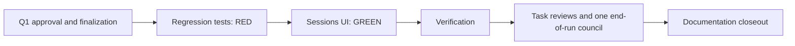

# Fix Sessions harness tabs for GitHub issue 188

Status: Archived on 2026-09-30. The user approved this plan and its Test contract
on 2026-09-30; implementation, task reviews and the end-of-run council are complete.
This is the historical execution record. Current behavior is documented in the
[Sessions harness tabs runbook](../../dash/runbook.md#sessions-harness-tabs).
The ontology status is `superseded`; Archived is the plan's lifecycle outcome.

## Problem and goal

[Issue 188](https://github.com/dpalfery/kyber-weave/issues/188) reports empty
Sessions tabs when provider aliases are used as canonical harness filters, missing
tabs for harnesses with sessions, and static tabs for harnesses without sessions.
Make the tabs represent the actual session inventory and select those canonical
sessions using their exact harness identities.

## Approved decisions

Q1 resolved: approved and authorized for execution. The conductor presented the
complete Draft and combined canonical-harness design/Test-contract approval gate;
the user replied **"approved"** in this chat on 2026-09-30. The conductor supplied
that explicit approval to the architect's FINALIZE invocation. Approval covers
the proposed behavior, default All selection, test-first development mode, every
Test-contract row, exact task scopes, and the execution/verification/closeout plan
below. No material decisions remain open.

## Investigation findings

- The issue was read directly through GitHub CLI and its scope matches existing
  Sessions architecture: a plan is appropriate, with no new subsystem or spec.
- Documentation MCP tools are unavailable in this harness. Discovery necessarily
  used the documentation index fallback, followed by the ontology, catalog, plan
  index, KyberDash architecture, and runbook. No archived document was used as
  current guidance.
- Initial CodeGraph CLI discovery in the original checkout identified
  `ContextExplorer`, `getAgentHarnessFilter`, and `KyberBridge.listSessions`.
  The isolated worktree initially contained no CodeGraph directory and discovery
  followed the repository's no-index fallback. The conductor subsequently made
  the original index available through a read-only symlink for reuse; no index
  was created or rebuilt. Both documentation checks now pass.
- `ContextExplorer` hardcodes provider aliases and defaults to `claude`; it passes
  the result of `getAgentHarnessFilter` to the canonical Sessions request. That
  helper maps Antigravity to `gemini` and both Copilot client tabs to `copilot`.
  The canonical store and bridge expose individual harness identities.

- `fetchKyberSessions` in `dash/web/src/lib/kyberApi.ts` and the Sessions route in
  `dash/src/server/routes.ts` perform exact harness filtering. Their contracts
  should remain unchanged. The unfiltered Sessions response already contains
  the complete derived session inventory needed by this UI.
- `App` renders `<Sessions />` without controlled harness props. The shell's
  harness strip navigates Context Doctor; it is a separate surface. This fix
  needs no `App` or router edit.
- `ContextProvider` in `dash/web/src/lib/api.ts` is a legacy closed provider
  alias union. `ExplorerProvider` can become a canonical harness string within
  `ContextExplorer`, without widening that unrelated legacy API contract.
- Existing tests in `ContextExplorer.test.tsx` and
  `analysis/session-dashboard.test.tsx` seed `['kyber-sessions', 'claude']` and
  legacy Claude fixtures; both must follow the canonical, unfiltered inventory.
- The test standard is current. It requires observable assertions and regression
  evidence. Its .NET runner details do not replace Dash's existing Vitest runner.
  No additional React coding-standard approval gate is imposed by the current
  React specialist role.
- The harness exposes shell execution as its only local read capability. The
  conductor authorized read-only shell/tool substitutions for discovery. This
  did not expand any specialist's write scope.

## Proposed behavior

1. Fetch canonical sessions once without a harness filter and retain the existing
   query freshness/loading/error behavior. Use this same inventory for tabs and
   visible rows; tab discovery must not depend on the currently selected subset.
2. Always show **Agent Sessions (All)**. Add one tab per distinct nonempty harness
   ID present in the response, using that exact ID as the key. Duplicate sessions
   for an ID produce one tab. A harness with no sessions has no tab. An empty
   store offers All and the existing empty-state message.
3. Filter locally by exact harness identity. Claude Code, Claude Desktop, Claude
   CLI, Codex Desktop, Codex CLI, Antigravity CLI/IDE, ZCode, and Cursor Agent
   remain separate when present. Never map Antigravity to Gemini or merge
   Copilot client identities.
4. Default to All. Explicit controlled `activeHarness='all'` selects All rather
   than preserving an earlier local choice; an available canonical controlled ID
   selects that ID. An unavailable selection falls back to All. Tab clicks call
   `onHarnessChange` with the selected canonical ID, or the existing `agent-all`
   sentinel for All, and clear the expanded session as before.
5. Labels are display-only. Use a small local label map for established IDs with
   raw-ID fallback for future/unknown IDs; the map must never decide membership.
   Do not import a whole page or introduce a new shared-label refactor for this
   bug. Session rows and their expansion/parent navigation remain intact.

## Test contract

All rows below were explicitly approved through Q1 on 2026-09-30. The exact
focused runner for R1 and G1 is:

```bash
npm --prefix dash exec -- vitest run web/src/components/ContextExplorer.test.tsx web/src/components/analysis/session-dashboard.test.tsx
```

| Task | Test project or file | Runner command | Observable behavior | RED evidence required | GREEN acceptance |
|---|---|---|---|---|---|
| R1/G1: inventory and exact identity | `dash/web/src/components/ContextExplorer.test.tsx` | Focused runner above | Mixed canonical inventory offers All plus one tab per observed ID, excludes absent static providers, and includes Claude Desktop/CLI, Codex Desktop, Antigravity CLI/IDE, ZCode, Cursor Agent and a future ID. Clicking each tab shows exactly its rows; All restores all rows. A mocked Sessions HTTP response proves discovery uses the unfiltered canonical request and never emits a provider-alias query. | Run newly added assertions against unchanged production code; failures must demonstrate static/missing tabs, wrong filtering or legacy default selection rather than broken mocks/setup. Save command, exit status and named failures. | Same assertions pass without weakening expectations or changing canonical fixture IDs. |
| R1/G1: selection and states | Same test file | Focused runner above | Initial All shows the full inventory; duplicate IDs yield one tab; empty inventory keeps All and the empty message; unknown nonempty IDs remain selectable. Available controlled IDs select the right rows, controlled all selects All, and absent/removed selection falls back to All. Loading and error states stay observable. | Add behavior tests before production edits and capture failures for the intended missing behavior; existing passing states are preservation evidence. | All new tests and existing loading/error coverage pass; callback reports exact IDs and the All sentinel. |
| R1/G1: expansion preservation | `dash/web/src/components/analysis/session-dashboard.test.tsx` and existing row coverage in `ContextExplorer.test.tsx` | Focused runner above | Canonical `claude-code` session appears in All and its canonical tab, opens its Agent Session Dashboard and preserves parent-session navigation. Switching tabs clears expansion. | Canonical fixture/cache setup must fail against the unchanged provider-filtered component when proving the newly supported canonical path; record already-green existing dashboard assertions separately. | Canonical integration plus existing dashboard/parent navigation assertions pass against the same evidence-backed contract. |
| V1 | No new tests; execute existing gates | Commands below | Full Dash and repository checks cover the completed diff. | Not applicable: read-only verification task. | Unmasked exit statuses and gate artifacts support every claimed pass. |
| D1 | No new tests; documentation closeout | `kyber-weave docs validate . --merge-ready` and `kyber-weave docs drift .` | Canonical Sessions behavior is documented, evidence is checked, plan/index are archived before PR. | Not applicable: documentation-only task; compare prose to source and approved acceptance evidence. | Both checks produce zero findings; archived inventory links the canonical update and evidence. |

Use a mocked HTTP boundary or existing React Query fixtures rather than live
`~/.kyberdash/canon.db`. Do not assert source text as proof of tab behavior. Test
artifacts are task-scoped and preserve actual runner output. Contract changes or
weakened assertions return the plan to Draft for explicit reapproval.

## Dispatchable tasks

| Task | Objective and exact scope | Acceptance criteria | Dependencies | Required skills |
|---|---|---|---|---|
| R1 | Add the approved regression tests and update canonical fixtures only in `dash/web/src/components/ContextExplorer.test.tsx` and `dash/web/src/components/analysis/session-dashboard.test.tsx`. | All Test-contract scenarios are represented; intended RED evidence is saved before source changes. Retire alias-helper/source-wiring assertions only when replaced by observable guarantees. | Q1 approval and plan finalization | `test-dev`; Vitest/React Testing Library capability; current test standard |
| G1 | Implement the proposed behavior only in `dash/web/src/components/ContextExplorer.tsx`, including its `ExplorerProvider`, inventory/selection logic, display labels, and obsolete alias helpers. | Every R1 assertion passes; no static membership/alias remapping; one authoritative inventory; unchanged REST contract, session dashboard and surrounding layout. Do not edit formal tests. | R1 RED evidence | React component/state capability; no named React skill is required by the role |
| V1 | Execute focused GREEN tests, full Dash gates and repository gate suite on the quiescent completed tree; record output under task-scoped artifacts. | All required checks pass or the exact blocker is reported. No source/test edits; .NET InspectCode is handled by the declared gate runner, not applied to TypeScript files. | G1 | Test/verification capability; `test-dev` for evidence audit |
| D1 | Harvest the Sessions tab/default behavior into `docs/dash/runbook.md`; touch `docs/dash/architecture.md` only if its existing Sessions behavior claim requires correction. Verify evidence, update this plan/index and archive to `docs/archive/plans/2026-09-30-github-issue-188-sessions-harness-tabs.md`. | All accepted criteria have current evidence, canonical prose describes observed-ID tabs and All default, lifecycle/index agree, docs checks pass. No ADR needed for this bounded repair. | Implementation and task reviews complete; end-of-run council approved | `app-docs-standard`, `kyber-weave-docs` |

Formal source ownership must use `docs_for_symbol` when available. In this harness
the prescribed index fallback applies: KyberDash architecture and runbook are the
canonical documents; no new source symbol or REST contract is introduced.

## Dependencies and concurrency



MAX_CONCURRENCY: **1 write worker**. R1/G1 consume the same test contract and must
retain the RED-before-GREEN sequence. Both test files are one test task because
they share cache/fixture setup. Read-only task review may overlap other eligible
disjoint work, but no additional source task is warranted. The council's own
parallel lenses are governed separately by its skill and harness capacity.

## Scope and risks

Bounded web Sessions fix; preserve the original checkout's unrelated changes.
No ingestion reclassification, canonical-store migration, REST/API contract
change, shell routing change, tray changes, dependency additions, release build
or updater changes, release installation, deployment, or live database mutation
is planned. Future harness labels may fall back to the exact ID; future inventory
membership must remain automatic. The inventory fetch has the same scope as the
existing All view and retains its freshness policy.

## Verification, review, and closeout

The implementation/test specialists collect their required diagnostics and lint
baseline before edits and scoped completion evidence afterward. Where native
language diagnostics are unavailable, report that limitation explicitly; a
typecheck must not be relabeled as a native-diagnostics result.

Run these checks through V1 and the end-of-run council, with final merge-ready
documentation validation after D1 archival:

```bash
npm --prefix dash run typecheck
npm --prefix dash run lint
npm --prefix dash run test
npm --prefix dash run check:reachable
dotnet tool restore
dotnet run --project src/KyberWeave.Cli -- review gates . --out artifacts/gates-issue-188.json
kyber-weave docs validate . --merge-ready
kyber-weave docs drift .
```

During planning/implementation, `docs validate .` checks the active plan without
`--merge-ready`; the merge-ready check is expected to reject an active plan until
D1 archives it. The host-declared `docs-validate` review gate in
`.kyber-weave/kyber-weave.yml` runs `docs validate .` without `--merge-ready`.
Consequently V1 and the end-of-run council can pass while this plan is active:
run V1, finish the task-review ladder, obtain council APPROVE, then execute D1
and the final explicit `docs validate . --merge-ready` and `docs drift .` checks.
Do not move that final explicit merge-ready check into V1 or the council. This
clarifies the approved ordering without changing scopes or Test contracts.

Reuse the existing index read-only for drift; never rebuild it
without the user's indexing decision. No release loop is triggered by this source
scope because build, update and distribution mechanisms are unchanged.

Each completed write task gets the conductor's task-review ladder (at most three
passes), carrying its exact contract and current RED/GREEN evidence. Drain any
unresolved findings through an approved scope before the single end-of-run
`code-review` council over the accumulated change. Its verdict must be APPROVE.
D1 then verifies/harvests/archives; any documentation delta retains required
validation evidence. Do not mark the objective complete before closeout.

## Planning verification

The completed Draft and index row passed installed `kyber-weave docs validate .`
and `kyber-weave docs drift .`, both with zero findings, using the existing root
index read-only. Finalization reruns both checks against this saved Ready plan
and matching index row. Source tests, builds, and review have not been run during
planning or finalization.


## Closeout evidence

D1 checked the implemented behavior against the approved Test contract, the current
[source component](../../../dash/web/src/components/ContextExplorer.tsx), and the
current focused test results on 2026-09-30. Its canonical harvest is the
[Sessions harness tabs runbook](../../dash/runbook.md#sessions-harness-tabs).
The existing Sessions claims in [architecture](../../dash/architecture.md) remain
accurate; no architecture edit, ADR, specification or catalog change is needed.
There are no review findings or authorized deferred todos.

### Acceptance verification

| Accepted behavior | Current evidence | Outcome |
|---|---|---|
| Tabs come from one unfiltered canonical inventory; one tab per distinct nonempty ID; absent harnesses have no tab; exact filtering keeps client variants separate. | `ContextExplorer` uses the same response for tab discovery and exact-ID row filtering. Focused tests cover Claude Code/Desktop/CLI, Codex Desktop/CLI, Antigravity CLI/IDE, each Copilot client, ZCode, Cursor Agent and a future ID, including a mocked HTTP request and duplicate IDs. | PASS |
| Default All, explicit controlled All, available controlled IDs, fallback after an absent or removed selection, empty inventory, raw-ID label fallback and canonical callbacks. | Focused tests exercise each state and the existing `agent-all` callback sentinel. Unknown IDs remain selectable; labels do not determine membership. | PASS |
| Dashboard expansion, parent navigation, loading and error states remain usable; switching tabs clears expansion. | Canonical Claude Code integration passes in All and `claude-code`; row navigation, loading/error and expansion tests pass. `AgentSessionRow` is byte-identical to the pre-change implementation. | PASS |
| R1/G1 are test-first and task-reviewed; V1 checks the completed source; D1 harvests and archives the accepted behavior. | RED/GREEN evidence and gate/review decisions are recorded below. Canonical prose, archive location and the [plan inventory](../../plans/README.md) agree. Final documentation commands and raw-output locations are recorded below. | PASS |

### Test-first and final verification

The trustworthy focused command ran from `dash/` using the locked local runner:

```bash
./node_modules/.bin/vitest run web/src/components/ContextExplorer.test.tsx web/src/components/analysis/session-dashboard.test.tsx --reporter=verbose --reporter=json --outputFile.json=../artifacts/issue-188/v1/focused-green.json
```

R1 used the same runner and files with its own report path before production edits:
**28 failed, 7 passed, exit 1**. Named failures demonstrated missing/static tabs,
wrong canonical filtering and the legacy default. The production Git object hash
was unchanged before/after RED (`0e99ab742c09eda9547934e41a0837b868473fa9`).
The original root-level `npm --prefix dash exec` attempt did not use Dash's working
directory/configuration; it is retained as setup evidence, not the RED result.
G1 and final V1 each passed **35/35, exit 0** with unchanged formal-test hashes.
R1 and G1 each passed their first task review without escalations.

Final V1 ran the following on the frozen completed source:

```bash
npm --prefix dash run typecheck
npm --prefix dash run lint
npm --prefix dash run test
npm --prefix dash run check:reachable
dotnet tool restore
dotnet run --project src/KyberWeave.Cli -- review gates . --out artifacts/gates-issue-188.json
```

All four Dash gates passed; the full Dash run passed **264 files / 3,712 tests**.
The pinned tool restore and the unmodified declared review suite exited **0**;
**all 15 gates passed**: whitespace/style format, build, test, skill
validate/lint/scan, docs validate/drift, InspectCode, duplicates and all four
TypeScript gates. The earlier reachability failure was repaired within G1 by
retaining the checked existing All callback contract; final reachability passed.

The canonical gate report and immutable V1 copy have identical SHA-256:
`09fab93ca45f5c8a665c9743e89636bf34fea699438b9df7a8cc424714caeca1`.
InspectCode contains 20 warnings, all in untouched .NET files; a zero analyzer
exit is not a claim of a clean report. The 53 duplicate clusters name no changed
path. Read-only index reuse has one unreadable indexed-symbol limitation
(`KW-REVIEW-032`); no index was created or rebuilt. Native editor diagnostics are
unavailable; supplementary scoped TypeScript syntactic/semantic diagnostics and
whole-file ESLint checks are clean.

The end-of-run council computed **APPROVE / LOW**, rule **KW-REVIEW-024**, exit **0**:
zero accepted or dropped findings, all nine applicable judgment/triage dimensions
reported no findings, and six dimensions were explicitly skipped. Its final
report was delivered inline; it is not represented as a nonexistent report file.

The audited source SHA-256 is
`5c0c7695ee784e5b3780380dd9d04f072b7d556ca75137436abe50766958a775`.
The frozen test SHA-256 values are:

- [ContextExplorer.test.tsx](../../../dash/web/src/components/ContextExplorer.test.tsx): `54551fa77f88855a15011d850a74a547c94b47f6d9fc7549b9f0a9e9a8f66bfc`
- [session-dashboard.test.tsx](../../../dash/web/src/components/analysis/session-dashboard.test.tsx): `ed5041f4794a8bd63623ccb6cc923b307a5eb90240d6ea284e8e4c049a684286`

### Documentation closeout validation

D1 runs the source-built CLI after archival:

```bash
dotnet run --project src/KyberWeave.Cli --no-build -c Release -- docs validate . --merge-ready
dotnet run --project src/KyberWeave.Cli --no-build -c Release -- docs drift .
```

Both commands exited **0** on 2026-09-30 with **zero findings** (0 critical,
0 error, 0 warning, 0 info). D1 preserved the frozen source and both test hashes.
Canonical documentation is harvested, the active plan is removed, and the
archive inventory links both the canonical update and this evidence.

Raw task evidence remains under ignored `artifacts/issue-188/`: R1
`red.json`, `red.log`, `red.exit`, `red-named-failures.txt` and `commands.txt`;
G1 `green.json`, `green.log`, `green.exit` and `mechanical-review.json`; V1
`gates-final.json`, `review-gates-final.log`, `review-gates-final.exit`,
`focused-green.json`, `commands.txt` and `final-summary.json`; D1 final
`docs-validate.log`, `docs-validate.exit`, `docs-drift.log`, `docs-drift.exit`
and `completion-digest.json`. This durable summary records the commands, counts,
verdict and hashes for a fresh clone; ignored artifacts are supporting local
raw output, not required Markdown link targets.
