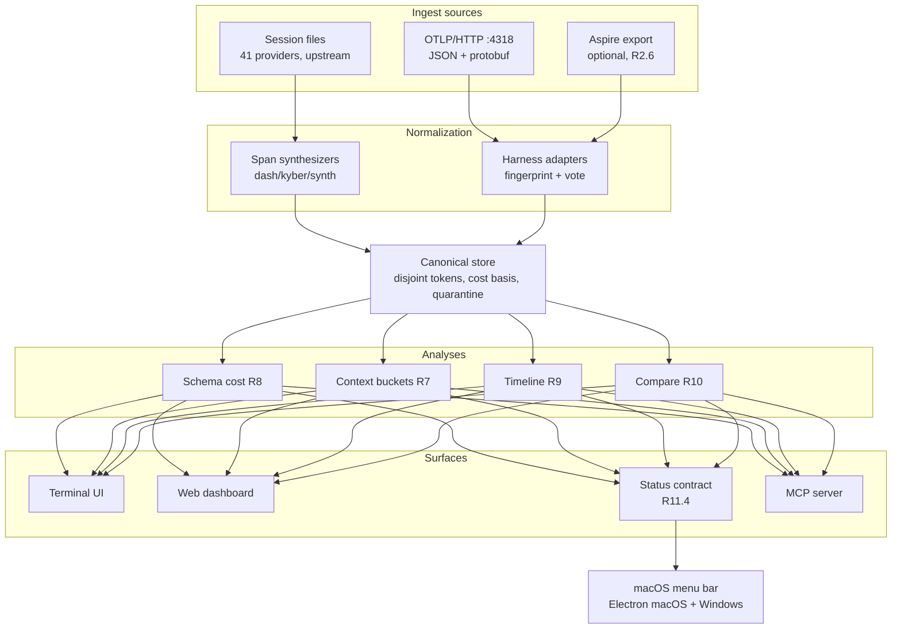
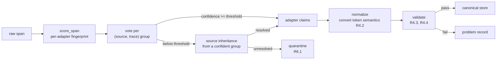

# Design Document

## Overview

KyberDash is built as a **soft fork of `getagentseal/codeburn`**, vendored into this
repository with `git subtree`, extended with an OpenTelemetry ingest path and the analyses
ported from `agent-session-analysis-dashboard`.

The shape of the solution rests on one observation. The two codebases each have a normalized
model, and they are not peers:

- codeburn's `ParsedProviderCall` is a **per-call cost record** — enough to total spend by
  tool, model and project.
- The Python pipeline's `CanonicalSpan` carries **disjoint token classes**, a **cost basis**,
  content mapped onto canonical keys, and a **voted harness attribution**. Every analysis in
  Requirements 7 through 10 is expressed over it, and none of them can be expressed over the
  former.

So the direction of adaptation is settled: **the session-file providers become span
synthesizers.** A Claude Code JSONL turn is converted into canonical records exactly as an
OTLP payload is, and no analysis knows or asks which path its data arrived by. This is what
satisfies Requirement 11.1 with one data path rather than two parallel ones.

The corollary is that a file-based provider cannot supply everything a span can — a Claude
Code JSONL has no tool *definitions*, so Requirement 8 has nothing to rank for it. The rule
that governs this already exists in the Python pipeline and is proven rather than invented:
**absent is not zero, and the reason matters.** Each source declares measurability per metric
(Requirements 7.6, 8.5, 10.1, 10.2). pi degrades in exactly this way today — it invoked 14
distinct tools across 368 calls while reporting zero tools *offered*, because it exports no
definitions.

## Architecture

### Repository layout and the merge zone

Requirement 14 makes mergeability a design constraint, and mergeability is a function of which
files are touched. The tree is therefore partitioned by ownership:

| Path | Ownership | Merge behaviour |
|---|---|---|
| `dash/src/**` | Upstream | The conflict surface. Treated as read-only. |
| `dash/kyber/**` | KyberDash only | Never conflicts — upstream has no such path. |
| `dash/dash/**` | Upstream React dashboard | Extended; conflicts possible and expected. |
| `dash/app/**` | Upstream Electron application | Extended; conflicts possible. |
| `dash/mac/**` | Upstream Swift menu-bar application | Extended; conflicts possible. |
| `dash/windows/**`, `dash/gnome/**` | Upstream | Unmodified and unbuilt (R14.4). |

New code consumes upstream's *output* — the parsed-call array its parser already produces —
rather than reaching into its internals (R14.2). The known unavoidable exception is the status
contract of R11.4, which is what carries new analyses into the native clients; it is recorded
here under R14.3.

#### Deliberate merge-zone edits (R14.3)

Files whose change inside upstream's directories is unavoidable and whose reason is recorded here so a future conflict arrives with rationale attached:

| File | Reason |
|---|---|
| `dash/src/menubar-json.ts` | Status contract (R11.4) extended with optional `kyber` field carrying new analyses — context buckets/pressure (R7), schema ranking (R8), timeline (R9), compare (R10), `quarantineCount` and `problems` (R6). Optional so old payloads still decode; extending this field is sufficient to carry new analyses into native clients without modifying them (R11.5). |
| `dash/src/usage-aggregator.ts` | Wiring of the contract extension: `buildMenubarPayloadForRange` forwards an optional `kyber` payload (when the canonical store has data) into `buildMenubarPayload`; no analysis logic duplicated in the payload builder. |
| `dash/app/electron/cli.ts` | Binary lookup extended to try `kyber-weave` then fallback to `codeburn` so the Electron app spawns the renamed CLI without other changes; no analysis logic moved into the client (R11.5). |
| `dash/mac/Sources/CodeBurnMenubar/Security/CodeburnCLI.swift` | Same binary-name fallback as above for the Swift menu-bar; search order `kyber-weave` → `codeburn` keeps the decode path unchanged (R11.5). |

### Why the receiver is embedded

The Python pipeline treats a user-run Aspire dashboard as its OTLP endpoint and buffer, then
pulls spans back out with a CLI subprocess. That dependency costs more than the setup step it
appears to be. The dashboard is a **ring buffer**, and eviction is a measured data-loss class
(R2.7). The Python pipeline's response was to stop grouping by ancestry and group by attribute
instead — a correct workaround for a problem that owning the receiver removes outright.

Embedding also satisfies R2 without Docker or Aspire, and costs little: the existing
collectors already post OTLP JSON to port 4318, so they work unchanged.

## Components and Interfaces

### Ingest layer

| Component | Path | Contract |
|---|---|---|
| Upstream provider parser | `dash/src/` | Existing. Produces parsed calls plus its deduplication set. Not modified. |
| `SpanSynthesizer` | `dash/kyber/synth/` | Consumes parsed calls; emits canonical records with a declared measurability map. |
| `OtlpReceiver` | `dash/kyber/otel/receiver.ts` | HTTP listener on 4318. Decodes JSON and protobuf to a common span shape. |
| `AspireSource` | `dash/kyber/otel/aspire.ts` | Optional. Reads spans exported from a running Aspire dashboard (R2.6). |
| `IngestWriter` | `dash/kyber/otel/writer.ts` | Batches and persists; owns backpressure (R2.5). |

The synthesizer is where Requirement 3 is satisfied. It extends upstream's existing
cross-provider deduplication key rather than adding a parallel mechanism (R3.2); an OTLP-sourced
session and a file-sourced session that describe the same work collapse to one identity.

### Normalization layer

Every adapter implements the same interface — detect, relevance, normalize, group, resolve a
root, validate, and declare what the harness does not export. That last method is not
optional: it is what turns a blank view into a stated limitation (R7.6, R8.5, R10.2).

Two-pass attribution is retained from the Python pipeline (R6.2): a fingerprint vote per
source-and-trace group, then source inheritance for still-undecided spans belonging to a
source already confidently mapped. It exists because 15 tool-execution spans carried GenAI
attributes with no vendor namespace and sat alone in their traces.

### Analysis layer

Ported from the Python modules, one to one, so the parity gate of Requirement 15 has something
to compare against:

| Analysis | Ported from | Realizes |
|---|---|---|
| Context bucketing, residual, pressure | `views.py` | R7 |
| Schema cost ranking, unused-tool cost | `views.py`, `cost.py` | R8 |
| Timeline, subagent and auxiliary separation | `views.py` | R9 |
| Cross-harness metric table | `compare.py` | R10 |
| Cost blocks, tier resolution, basis | `cost.py` | R5 |
| Tokenization and its cache | `tokens.py` | R4.6 |

### Surface layer

The status contract (R11.4) is the single seam the native clients depend on. They spawn the
CLI on an interval and decode its output; they hold no analysis logic. Extending the contract
is therefore sufficient to carry a new analysis into the menu bar and the Electron window
(R11.5), which is why R14.3 records it as the one deliberate edit inside the merge zone.

## Data Models

### Canonical record

The central entity. Field names follow the Python pipeline's contract so the parity gate can
compare like with like.

| Field | Type | Notes |
|---|---|---|
| `span_id` | string | Primary key. Makes re-ingest idempotent (R2.5). |
| `trace_id`, `parent_span_id` | string, nullable | Structure for R9. |
| `source`, `harness` | string | `harness` is voted, never taken from `source` (R6.2). |
| `name`, `op`, `kind` | string | `op` is the canonical operation, not the harness's verb. |
| `timestamp`, `duration_ms` | timestamp, number | |
| `status` | string | |
| `tokens` | `TokenUsage` | See below. |
| `content` | map of canonical key to string | Addressed only through canonical keys — nothing downstream may name a harness attribute. |
| `cost` | `CostBlock` | Carries its basis (R5.1). |
| `raw` | blob | Compressed. Bounded by R12.4. |

### `TokenUsage`

The type Requirement 4 exists to protect.

| Field | Meaning |
|---|---|
| `fresh_input` | Input neither read from nor written to cache |
| `cache_read` | Input served from cache |
| `cache_creation` | Input written to cache |
| `output` | Generated tokens |
| `reasoning` | Subset of `output` |
| `reported_input`, `reported_output` | What the harness itself claimed |

The invariant is `fresh_input + cache_read + cache_creation == reported_input`, checked on
every record including orphans (R4.3). `reasoning` is a subset of `output`, not an addition to
it. Storing the classes disjointly is what makes the invariant checkable at all; a model that
stored "input" as one number could not detect the pi/Copilot inversion of R4.2.

### `CostBlock`

| Field | Meaning |
|---|---|
| `basis` | Where the figure came from — a published table, or the harness's own arithmetic |
| `status` | Priced, partially priced, no rate, or out of scope for the consulted table |
| `value`, `currency` | The figure |
| `by_model` | Breakdown |

`status` distinguishing "no rate" from "zero" is what satisfies R5.4, and "out of scope" is
what satisfies R5.3 — a harness the table does not name is not priced by it at all.

### `Measurability`

Attached per source and per metric. A metric carries an availability flag independent of its
value (R10.1), so a consumer renders "not measurable" rather than a number that reads as a
result.

### Store

SQLite through the runtime's built-in module — upstream already depends on it for two
providers, so no new dependency is introduced. The schema is version-controlled as code and
executed on construction, following the Python pipeline's approach: any clone builds an empty
store on first use, and the database file stays pure local data.

Tables: raw records keyed by span identifier; a tokenization cache; quarantine; an ingest log;
derived sessions with their computed payload; a session-to-record join; problems; and
metadata carrying the schema version so a store built by an older version is detectable.

Requirement 12.4 changes one thing from the Python store: the raw column is compressed rather
than stored verbatim. The measured cost of not doing so is 2.9 GB for 37,623 records.

## Error Handling

The governing principle, inherited from the Python pipeline and visible throughout the
requirements: **a failure the system cannot interpret is surfaced, never guessed at and never
silently dropped.**

| Failure | Response | Requirement |
|---|---|---|
| Provider store absent | Omit silently | 1.2 |
| Provider store unparseable | Record a problem naming provider and file; continue other providers | 1.3 |
| Port 4318 already bound | Report the conflict and the occupying process where discoverable; do not silently rebind | 2.4 |
| Malformed OTLP payload | Reject with a diagnostic; do not partially ingest | 2 |
| Ingest faster than persistence | Batch and apply backpressure; never drop | 2.5 |
| Span matches no adapter | Quarantine with observed namespaces | 6.1 |
| Attribution below confidence threshold | Attempt source inheritance, then quarantine | 6.1, 6.2 |
| Token decomposition invalid | Reject the record, write a problem | 4.4 |
| Per-turn sum disagrees with request root | Store both, expose the mismatch | 4.5 |
| Model has no published rate | Render "no published rate" | 5.4 |
| Harness outside a table's scope | Do not price from that table | 5.3 |
| Two ingest paths disagree | Prefer the richer source, record the disagreement | 3.3 |
| Pricing fetch fails | Serve cached data | 12.2 |

Two of these are worth stating as anti-requirements, because the natural implementation gets
them backwards. Rendering an unpriced model as `$0.00` produces a total that is plausible and
wrong. Rendering an unreported metric as `0` in a comparison makes the harness that reports
least look most efficient.

## Testing Strategy

### Unit

Table-driven tests over the normalization layer, using synthetic records. The pattern is
established by the Python pipeline's adapter test, and it is the pattern to copy: each test
asserts both that the convention is applied correctly **and** that validation catches the
convention being applied wrongly. A test that only proves the happy path would not have caught
the pi/Copilot inversion.

Specific coverage: token conversion per harness (R4.1, R4.2); validation rejection paths
(R4.4); rate scoping, including the case where two harnesses ran the same model under
different billing (R5.3); unpriced and not-billed rendering (R5.4, R5.5); measurability
propagation (R7.6, R8.5, R10.2); attribution confidence and quarantine (R6.1, R6.2).

### Integration

- Collector output through synthesizer or adapter to canonical content keys, so a change to
  either end is caught (R1, R2).
- A session present in both ingest paths counted once (R3.1).
- Store idempotency: ingesting the same corpus twice changes nothing (R2.5).
- Compression round-trip and the storage ceiling of R12.4.

### End to end

- A live harness exporting OTLP to the receiver, appearing in the status contract output.
- A machine with session files and no telemetry producing a full report (R1.1, R1.4).
- The parity gate of R15: the ported pipeline over the existing span corpus, digest-compared
  against the Python pipeline's content-free digest. This is the acceptance test for
  Requirement 15 and the authorization to retire the Python project.
- A tracked-artifact check asserting no captured content reaches version control (R12.3). The
  Python equivalent caught three real leaks, which is why it is specified rather than assumed.

### Gates

The three new checks — type check, test, lint — join the repository's declared gate suite as
blocking gates, so the same command a reviewer runs is the one a contributor runs.

## Design decisions

| # | Decision | Alternatives considered, and why they lost |
|---|---|---|
| **D1** | TypeScript core, soft fork tracked with `git subtree` | A C# core matching the reserved catalog row. Rejected: tracking upstream *is* a three-way merge and there is no cross-language form of one, so R14.1 would be unsatisfiable and 41 provider parsers would become ours against vendor churn. |
| **D2** | The tree lands at top-level `dash/` | `src/`, where every sibling is a .NET project in the solution, and `products/`, whose established meaning is a governed content tree with no code. Top-level keeps the gate boundary legible. |
| **D3** | Embedded OTLP receiver; Aspire optional | Keeping Aspire as the collector. Rejected: it is a hard prerequisite for every user and its ring buffer is a measured data-loss class (R2.7). |
| **D4** | One canonical model, and it is the span model | Two models with a translation layer. Rejected: every analysis in R7–R10 is expressed over span structure, so the translation layer would have to grow into the span model anyway. |
| **D5** | Providers become span synthesizers | Running analyses only on OTLP data and leaving file data at totals. Rejected: it makes the file path a second-class citizen and violates R11.1. |
| **D6** | Adapt at the boundary, never inside the merge zone | Editing upstream's parser directly, which is simpler today. Rejected: it makes R14.1 unachievable within two upstream releases. |
| **D7** | Distribution through `install.sh`, self-contained per RID | Publishing to npm. Rejected by the maintainer in favour of one install path; the in-tree npm wrapper is removed. |
| **D8** | Retire the Python pipeline after the parity gate, without migrating its store | Migrating the 2.9 GB store. Rejected: the corpus is reconstructible from existing exports, and migration would carry an old schema into the new design for no gain. |
| **D9** | Leave unshipped upstream surfaces in place, unmodified | Deleting them. Rejected: deleting an upstream directory manufactures a conflict on every future merge and buys a directory listing. |

## Requirements coverage

| Requirement | Addressed in |
|---|---|
| 1 — Local session-file ingestion | Ingest layer; synthesizers |
| 2 — OTLP ingestion | Ingest layer; *Why the receiver is embedded* |
| 3 — One session identity | Ingest layer; `SpanSynthesizer` contract |
| 4 — Token accounting | Data Models, `TokenUsage`; Testing, unit |
| 5 — Cost attribution | Data Models, `CostBlock`; Error Handling |
| 6 — Quarantine and problems | Normalization layer |
| 7 — Context composition | Analysis layer |
| 8 — Tool and schema cost | Analysis layer |
| 9 — Execution structure | Analysis layer; canonical record structure fields |
| 10 — Comparison | Analysis layer; `Measurability` |
| 11 — Surfaces | Surface layer |
| 12 — Local-only data | Error Handling; Store; Testing, end to end |
| 13 — Installation | Overview and D7; sequenced in tasks |
| 14 — Mergeability | Repository layout and the merge zone |
| 15 — Migration | Testing, end to end |

## Open questions carried from requirements — ✅ Resolved (2026-08-29)

- **Single-executable packaging for an ESM bundle — ✅ Resolved.** Confirmed: single-executable with a CommonJS entry alongside the existing ESM bundle; Task 1 will validate against the real bundle. Blocks the release path only, not the design above. Fallback remains a pinned-runtime archive with a launcher rather than a different runtime, which would put KyberDash on a foundation upstream does not test against.
- **Does the CodeGraph index cover TypeScript? — ✅ Resolved.** Yes — CodeGraph covers TypeScript. Determines whether KyberDash can carry a governed architecture document with resolvable ownership claims.
- **OTLP over gRPC — ✅ Resolved.** Deferred — HTTP only in this design. HTTP covers the existing collectors and the common SDK configuration.
- **Which technologies the ontology gains — ✅ Resolved.** Both TypeScript and Swift are needed.

## Spike outcomes

### D7 — Single-executable packaging (Task 1 validation)

**Status:** primary path validated by inspection. End-to-end parity run deferred until
Task 2.1 vendoring lands; reopen if the predicted bundle fails to load the TUI chain or
if a native module sneaks into the dependency closure.

**What was inspected.** Upstream `getagentseal/codeburn@main` was fetched on 2026-08-29 to
establish the bin's shape while `dash/` is not yet vendored (`package.json`, `tsup.config.ts`,
`src/cli.ts`, the first 2638 lines of `src/main.ts`, and the cited dependencies' npm-registry
records). Each finding is summarised in `scripts/spike-exe/README.md`; this section records
the design-stage decision the spike authorises.

**Concretely viable.** A CommonJS entry alongside the existing ESM output is achievable with
the current bundler (`tsup`) and target (`node20`). The two items in `tsup`'s `external`
list (`@modelcontextprotocol/sdk`, `zod`) are dual-package on npm today and can be bundled
into the CJS output, which is what makes a self-contained binary possible. No top-level
`await` exists in `src/main.ts`; the 58 occurrences are all inside `async` function bodies
and bounding the CJS legality rule is a non-issue.

**TUI chain.** Ink (`7.x`) and React (`19.x`) are pure JS, ESM-only / dual respectively, and
are static-imports from upstream — bundled fine by esbuild into a CJS output. No discovered
path reaches a runtime `require()` of `ink`, or a `native`-loaded node, or an
`import.meta`-only construct, so the in-process TUI continues to be reachable from a CJS
binary. No code path forces the *pinned-runtime archive + launcher* fallback.

**Zero native modules.** All ten runtime dependencies are pure JS. None of them ship a
node-gyp install or a prebuilt `.node` binary; the only node integration is `undici@7` using
the built-in HTTP module. The KyberDash "no native modules" posture inherits unchanged
from upstream.

**Five supported RIDs.** Node SEA's stable per-platform set is exactly:
`darwin-arm64`, `darwin-x64`, `linux-arm64`, `linux-x64`, `win-x64`. That is the five
artefacts the release workflow will produce. The bundler config delta is RID-agnostic; the
postject + `--build-sea` step is the only RID-dispatched work.

**Caveats recorded for the implementer (Task 12.1).** (a) SEA must be built from the
official prebuilt Node binaries at `nodejs.org/dist/`, not the Homebrew formula, because
Homebrew's `node` formula at the time of writing ships with SEA disabled. (b) macOS
artefacts must be re-signed `ad-hoc` after `postject` replaces the binary's codesignature;
users then need `xattr -d com.apple.quarantine` on first run, which is a non-privileged
operation and so satisfies R13.3.

**Effect on Decision D7.** Confirmed: distribution through `install.sh`, self-contained
per RID, does not require a package manager, a language runtime, or elevated privileges.
The "publishing to npm" alternative remains rejected for the reason already recorded in D7.

**Reopen conditions.** (1) An end-to-end parity run after Task 2.1 must show
single-executable output is byte-identical to the unbundled CLI on a real session corpus.
(2) Any future dependency added upstream that is a `[native]` module, or that touches
`import.meta`, must re-trigger this spike so the design stays correct.

## Related

- [Requirements](requirements.md) — what this design must satisfy
- [Tasks](tasks.md) — how it gets built
- [KyberDash overview](../../dash/README.md) — the product story
