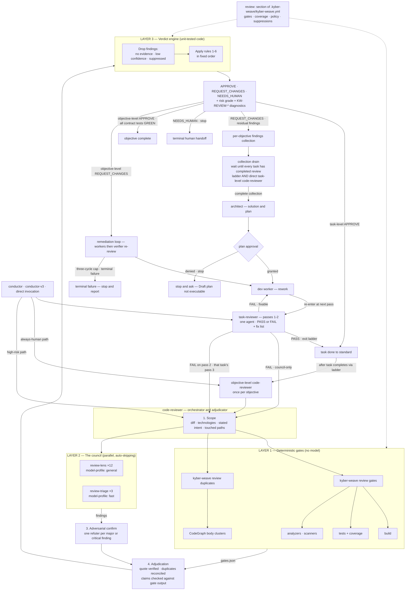
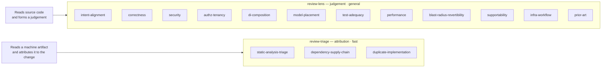
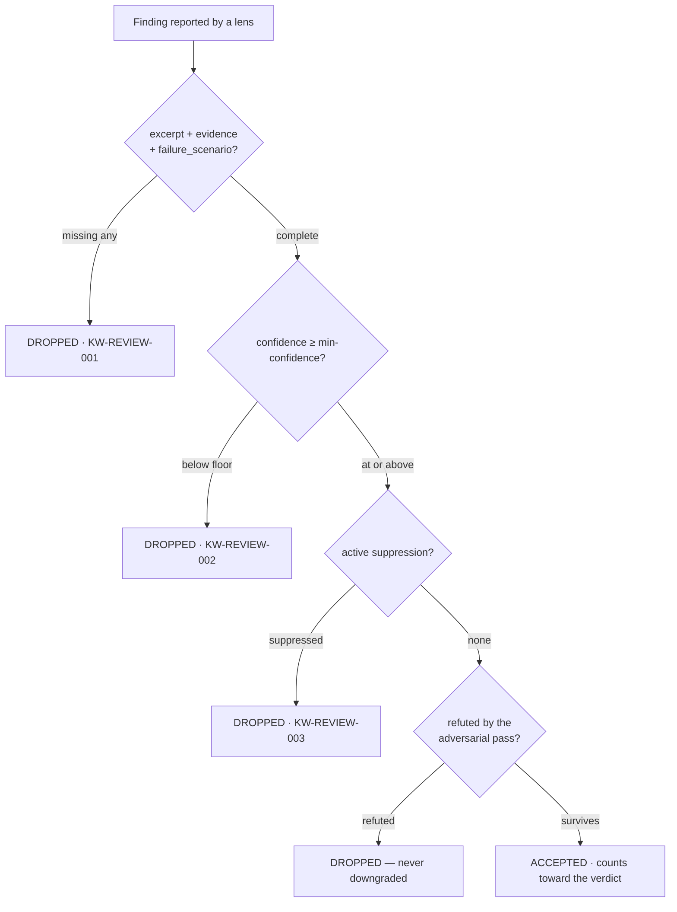
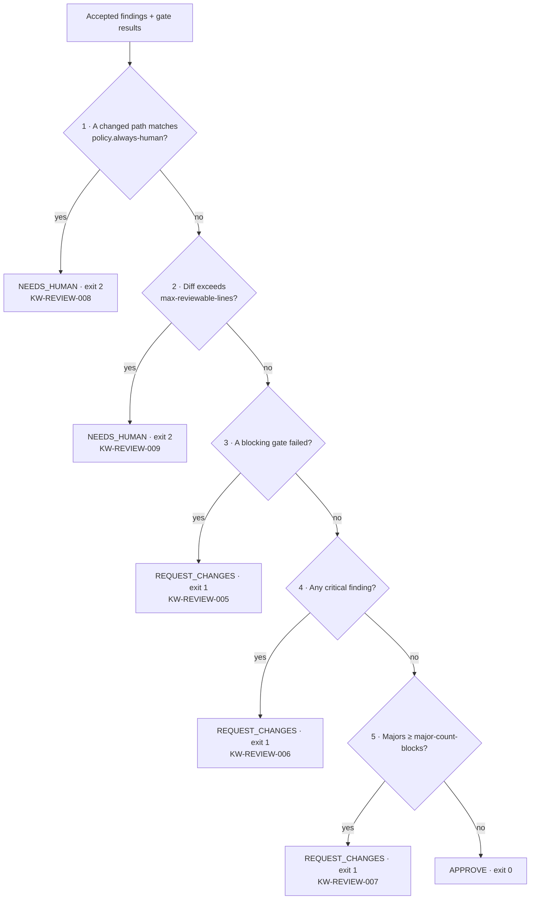

# Review council architecture

Code review here is not one agent reading a diff. It is three layers with different failure
modes, deliberately kept apart:

| Layer | What it is | Who decides | Fails by |
|---|---|---|---|
| **Gates** | Repeatable commands — build, tests, coverage, analyzers | Nobody. They measure. | Not being run |
| **Council** | Specialist lenses reading the diff in parallel | A model, per lens, within its remit | Being confidently wrong |
| **Verdict** | Fixed rules over findings and gate results | Unit-tested code, no model | Being mis-specified |

The separation is the design. The judgement in a review is the council's; **the gate that
judgement passes through is not a model**. A verdict produced by the same model that produced
the findings cannot be audited, cannot be regression-tested, and can legitimately differ
between two runs over one diff. So the last step is arithmetic instead.

## The whole system



Gates and council start **together** — they are independent and neither waits on the other.
Three lenses are the exception: `test-adequacy` consumes the coverage report,
`static-analysis-triage` consumes the analyzer output, and `duplicate-implementation` consumes
the duplicates report, so each is issued when its own gate completes rather than behind a
barrier on all gates.

`review duplicates` is a second command rather than a declared gate entry because its input is
not a host command at all: it reads the repository's CodeGraph index and clusters symbols whose
normalized bodies are identical. Hosts still declare it under `review.gates` so its execution
is recorded like any other evidence, and it exits 0 whether or not it finds anything — what
"blocking" buys there is that it must have *run*.

## The parts, and where they live

| Part | Kind | Location |
|---|---|---|
| `task-reviewer` | Canonical agent — the fast per-task pass, ahead of the council | `products/kyber-squad/agents/task-reviewer.md` |
| `code-reviewer` | Canonical agent — orchestrates, adjudicates, holds the skeptic | `products/kyber-squad/agents/code-reviewer.md` |
| `review-lens` | Canonical agent — one judgement seat, spawned N times | `products/kyber-squad/agents/review-lens.md` |
| `review-triage` | Canonical agent — one triage seat, `fast` model profile | `products/kyber-squad/agents/review-triage.md` |
| `code-review` | Skill — the procedure, the lens catalogue, the report format | `products/kyber-squad/skills/code-review/SKILL.md` |
| Lens files | 15 reference files, one per concern | `products/kyber-squad/skills/code-review/references/lenses/` |
| Technology checklists | 7 reference files, loaded as lens *modifiers* | `products/kyber-squad/skills/code-review/references/` |
| `dp-code-reviewer` | Skill — modes and the re-review loop | `products/kyber-squad/skills/dp-code-reviewer/SKILL.md` |
| `security-review` | Skill — invoked by the security lens, not duplicated | `products/kyber-squad/skills/security-review/SKILL.md` |
| `GateRunner` | Runs declared gates, normalizes results | `src/KyberWeave.Core/Review/GateRunner.cs` |
| `DuplicateDetector` | Clusters symbols by normalized body, from the CodeGraph index | `src/KyberWeave.Core/Review/DuplicateDetector.cs` |
| `ICodeGraphSymbolEnumerator` | Optional CodeGraph port: every indexed symbol of one kind | `src/KyberWeave.Core/CodeGraph/ICodeGraphSymbolEnumerator.cs` |
| `VerdictEngine` | The rules. Pure — no clock, no filesystem, no process | `src/KyberWeave.Core/Review/VerdictEngine.cs` |
| `PathGlob` | Matches changed paths against reserved patterns | `src/KyberWeave.Core/Review/PathGlob.cs` |
| `ReviewConfig` | The `review:` host configuration | `src/KyberWeave.Core/Configuration/ReviewConfig.cs` |

## Why lenses are files, not agents

Fifteen concerns, but only **two** canonical agents carry them. The lens is a reference file;
the agent is the seat that reads it.

Fifteen agents would push the canonical roster from 20 to 35, clutter every harness's agent
picker, and produce fifteen near-identical descriptions that would collide under
`KW-AGENT-LINT-001` and `KW-SKILL-LINT-011`. As files, adding a lens is a Markdown file rather
than a deployment — which is exactly what adding `prior-art` cost.

The two seats exist because they do different work, not because one is cheaper:



A triage seat's input is something a tool already produced. Its job — deciding which of that
output *this change* is responsible for — is bounded and checkable, which is what makes it
safe to run on the `fast` model profile. Twelve lenses are not that, and would produce worse
findings cheaply, which costs more than it saves.

`prior-art` and `duplicate-implementation` sit on opposite sides of that line while holding one
concern between them, and the split is by evidence rather than by topic. A body duplicated
verbatim is a fact a gate established, so attributing it is triage. A *type* that duplicates
another is a judgement about responsibility that needs both types read, so it is not.

**Every lens auto-skips.** Each lens file opens with an applicability predicate and returns
`SKIPPED: <reason>` when the diff holds nothing it owns. That is what makes fifteen lenses
affordable — and the skip is *recorded*, because a dimension that was deliberately skipped and
one that was quietly never looked at must not read the same in a report.

## The skeptic, as a schema

The reviewer's standing demand — *show me the logs or it didn't happen* — is enforced by data
shape rather than by tone. Every finding must carry:

```yaml
excerpt: |
  _client = new HttpClient();      # verbatim source — required
evidence: "src/Foo/Bar.cs:42"      # how the reporter knows — required
failure_scenario: "Socket exhaustion under load; no handler rotation."   # required
```

`VerdictEngine` drops any finding missing one of the three, under `KW-REVIEW-001`, and names
the lens that produced it — because a lens doing this repeatedly is the real defect. A finding
the engine would have to complete on the reporter's behalf is one the engine would be
inventing.

The same rule applies upward. Any claim that something was built, tested, or verified with no
corresponding entry in `gates.json` is itself a `critical` finding. The agent whose purpose is
refusing unverified claims is not permitted to make one.

## How a finding survives



Suppressions carry a **mandatory expiry date**. There is no "never" value: a permanent
suppression is how a review system quietly stops reviewing, the reason ageing out of memory
while the exemption stays. On the day after it lapses the finding returns on its own, and
`KW-REVIEW-004` says why.

## How the verdict is computed

`VerdictEngine.Evaluate` is a pure function of (scope, findings, gates, config, date). Same
inputs, same verdict, every time. The order is the contract:



Three properties of that order are load-bearing:

**The escalation rules run first.** A reserved path and an unreviewable diff both say the same
thing — *this change is not the engine's to settle* — and that is true regardless of how clean
or how filthy the council's report was. Neither can be overridden by the engine; the policy
outranks it.

**`NEEDS_HUMAN` does not share an exit code with `REQUEST_CHANGES`.** Collapsing them would
make a change that merely touches a protected path indistinguishable, to any caller reading
the exit code, from one the review actually rejected.

**Risk is graded from findings, never from diff size.** A twelve-line migration dropping a
column outranks a three-thousand-line regeneration of a generated client. Size appears only as
an attention ceiling, and a large clean diff stays `LOW`.

Coverage is reported (`KW-REVIEW-010`) and **never decisive**. A verdict driven by a coverage
number rewards padding that number — which is precisely the defect the `test-adequacy` lens
exists to catch.

## Permissions

The council's shape is enforced by the capability lattice, not requested by prose. See
[Kyber-Squad architecture](../kyber-squad/architecture.md) for how profiles lower onto each
harness.

| Role | Profile | read | search | write | execute | delegate |
|---|---|---|---|---|---|---|
| `task-reviewer` | `investigator` | allow | allow | deny | **allow** | deny |
| `code-reviewer` | `reviewer` | allow | allow | **ask** | **allow** | **allow** |
| `review-lens` | `read-only` | allow | allow | deny | deny | deny |
| `review-triage` | `read-only` | allow | allow | deny | deny | deny |

`process.execute` is what makes the gate real; before it, the blocking pre-merge gate the
skill declared was unexecutable, and the one agent whose job is refusing unverified claims was
structurally forced to make one. It is exercised through a single declared entry point,
`kyber-weave review gates`.

`filesystem.write` stops at `ask` rather than following execute to `allow`. The reviewer writes
one artifact — its findings — and on harnesses that cannot express `ask` the lattice safely
narrows it to `deny` and the findings come back in the response instead. `network.publish`
stays `deny`. **The role that judges a change never ships it.**

`task-reviewer` holds `investigator`, and the one grant that differs from a lens seat —
`process.execute` — is the whole design. It holds `process.execute` because the conductors do
not — they cannot produce a diff to hand it, so it establishes its own scope with `git diff`;
the grant is for reading the change, not for building it, and the role runs no gate. It holds
`delegate: deny` (same as a lens seat) because one agent is the point: a fan-out here would be
the council with extra steps and none of its evidence.

`delegate` on the reviewer is what lets it fan out the council, and it is also what gives
`delegate: deny` on the other subagent profiles a meaning it previously lacked: delegation is a
per-role grant, not a property of being a subagent. The lens seats hold `deny`, so a council
seat cannot re-enter the council.

## Configuration

Everything host-specific is one section of `.kyber-weave/kyber-weave.yml`:

```yaml
review:
  gates:
    - id: test
      run: [dotnet, test, -c, Release]     # argv, never a command line
      blocking: true
  coverage:
    file-line-percent: 85
  policy:
    always-human: ["**/auth/**", "**/*secret*"]
    max-reviewable-lines: 10000
    major-count-blocks: 3
    min-confidence: 7
    suppressions:
      - id: correctness/generated-nullable
        reason: Regenerated client, tracked separately.
        expires: 2026-11-18                # required
```

`run` is **argv, not a command line**, because `ProcessRunner` refuses a shell and refuses a
concatenated argument string. A host cannot express a pipeline or a redirect here — and neither
can anything that later edits this file, nor any value arriving from a diff, a finding, or a
lens prompt. That is the injection surface closed at the point the value is written.

This repository reserves its own governance artifacts, which is the case worth copying:

```yaml
always-human:
  - "products/kyber-squad/profiles/capabilities.yml"
  - "products/kyber-squad/agents/**"
  - ".kyber-weave/kyber-weave.yml"
```

The artifacts that decide what agents may do are not approvable by an agent, and a change to
the review configuration escalates through the review configuration.

## Modes

Two of these are the council's, and one is not. Ordinary tasks climb a three-pass ladder first —
`task-reviewer` at passes 1 and 2, returning `PASS` or `FAIL` with a fix list. A task that
`PASS`es on pass 1 or 2 exits the ladder; only a task that fails pass 2 proceeds to its own
task-level `code-reviewer` pass 3. A task touching a path `review.policy.always-human`
reserves, or a task with a high-risk concern, skips the ladder and goes straight to
`code-reviewer`. A `council-only` failure (`ESCALATION: council-only`) also goes directly to
`code-reviewer`. Findings surviving pass 3 enter the conductor's per-objective findings
collection, which routes through `architect` before the objective's council review — and that
objective-level review runs once after the task ladder drains, not once per task. See
[ADR 0005](../adr/0005-task-level-fast-review.md).

The council's own modes are owned by the `dp-code-reviewer` skill, which wraps the review
rather than performing it.

| Mode | Behaviour | When |
|---|---|---|
| `shadow` | Full review, verdict recorded, **gates nothing** | First rollout on a repository |
| `enabled` | The verdict gates | Normal operation |
| `verifier` | Re-checks only the prior findings | After a fix push |
| `full` | Forces a complete council re-scan | Escalation, or a stale prior review |

`verifier` is the cost lever: gates re-run every cycle because their result *is* the evidence,
but only lenses owning an outstanding finding re-run. The loop escalates after three cycles
without the surviving-finding count falling — a loop that is not converging is not going to,
and the usual cause needs a person.

## Current limitations

Only `CopilotRenderer` exists. On Copilot these permissions lower to real tool grants and are
enforced; on the other nine targets the council and the narrowing are instruction-only until
those renderers land — see
[renderer coverage](../todo/kyber-squad-renderer-coverage.md).

There is no cost measurement and no per-repository ceiling yet. The adversarial confirmation
pass in particular is unmeasured and may exceed the council itself on a findings-heavy diff.

## Related

- [Rule reference](../ci-pipelines/rule-reference.md) — every `KW-REVIEW-*` id
- [Kyber-Squad architecture](../kyber-squad/architecture.md) — how agents and skills deploy
- [Agent harness governance](../context-hygiene/agents.md) — capability profiles and parity
- [The review council plan](../archive/plans/2026-08-20-code-review-council.md) — why it is shaped this way
- [ADR 0002](../adr/0002-three-layer-review-council-verdict-engine.md) — three-layer review council and verdict engine
- [ADR 0003](../adr/0003-cross-file-duplication-and-prior-art-lenses.md) — cross-file duplication and prior art

