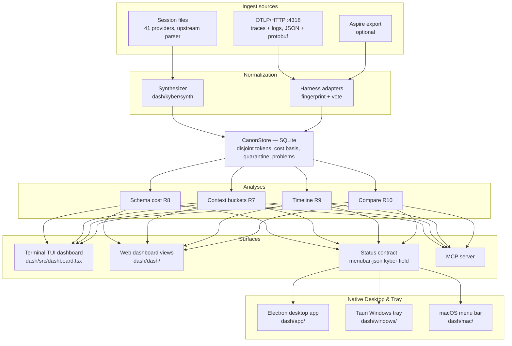
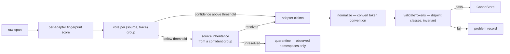

# KyberDash architecture

KyberDash is a locally-run product that answers three questions about coding agents: what
they cost, what filled their context windows, and whether a change to either actually helped.
It reads the session files that 41 agent tools already write to disk **and** receives
OpenTelemetry spans directly, then runs the same normalization and analysis over both.

It is a **soft fork** of [`getagentseal/codeburn`](https://github.com/getagentseal/codeburn)
(MIT, TypeScript), vendored into this repository with `git subtree` under `dash/`. The
session-file breadth and the terminal/menu-bar/desktop surfaces come from upstream; the span
analysis depth — disjoint token accounting, basis-carrying cost, context composition, tool and
schema cost, quarantine — comes from the retired Python pipeline
(`agent-session-analysis-dashboard`), ported into the subtree's merge zone.

The measured failures that shape several requirements — a 5.8× cost understatement, negative
fresh input on 293 of 307 spans, 25 of 1,009 spans losing a parent, 2.9 GB for 37,623 stored
spans — are recorded in [KyberDash measurable rationale](../reference/kyberdash-rationale.md).
They are correctness constraints, not style choices: they document failures that already
occurred in the Python pipeline, and a reimplementation that drops a requirement reproduces the
failure. The foundational architecture decisions — the TypeScript soft fork, the merge zone,
the embedded receiver — are recorded in [ADR 0006](../adr/0006-kyberdash-soft-fork-merge-zone-and-embedded-receiver.md).

## High-level architecture



One canonical model serves both ingest paths: the session-file providers are **span
synthesizers**, converting a parsed provider call into canonical records exactly as an OTLP
payload is decoded and normalized. No analysis knows or asks which path its data arrived by,
which is how Requirement 11.1 — one data path, not two parallel ones — is satisfied.

## Repository layout and the merge zone

Requirement 14 makes mergeability a design constraint, and mergeability is a function of which
files are touched. The tree is partitioned by ownership; the complete rule set lives in
[`dash/kyber/README.md`](../../dash/kyber/README.md):

| Path | Ownership | Merge behaviour |
|---|---|---|
| `dash/src/**` | Upstream | The conflict surface. Read-only. |
| `dash/kyber/**` | KyberDash only | Never conflicts — upstream has no such path. The merge zone. |
| `dash/dash/**` | Upstream React dashboard | Extended at the boundary; conflicts possible and expected. |
| `dash/app/**` | Upstream Electron application | Extended at the boundary; conflicts possible. |
| `dash/mac/**` | Upstream Swift menu-bar application | Extended at the boundary; conflicts possible. |
| `dash/windows/**`, `dash/gnome/**` | Upstream | Unmodified and unbuilt (R14.4). |

KyberDash code lives only under `dash/kyber/**` and consumes upstream's *output* — the parsed
call array its parser already produces and the deduplication set behind it — rather than
reaching into its internals (R14.2). The `tests/KyberWeave.Tests/MergeBoundaryTests.cs` suite
pins the boundary: no KyberDash source under upstream read-only roots, the unshipped surfaces
present and unmodified, and the upstream remote registered.

### Deliberate merge-zone edits

Four files inside upstream's directories are changed on purpose, and each is recorded with its
reason so a future merge conflict arrives with rationale attached (R14.3):

| File | Reason |
|---|---|
| `dash/src/menubar-json.ts` | The status contract (R11.4): optional `kyber` field carrying the new analyses — context buckets and pressure (R7), schema ranking (R8), timeline (R9), comparison (R10), `quarantineCount` and `problems` (R6). Optional so old payloads still decode; extending it carries a new analysis into native clients without modifying them (R11.5). |
| `dash/src/usage-aggregator.ts` | Wiring of the contract extension: `buildMenubarPayloadForRange` forwards the optional `kyber` payload; no analysis logic in the payload builder. |
| `dash/app/electron/cli.ts` | Binary lookup falls back from `kyber-weave` to `codeburn` so the Electron app spawns the renamed CLI. |
| `dash/mac/Sources/CodeBurnMenubar/Security/CodeburnCLI.swift` | Same binary-name fallback for the Swift menu bar; search order `kyber-weave` → `codeburn` keeps the decode path unchanged. |

## Ingest layer

| Component | Path | Contract |
|---|---|---|
| Upstream provider parser | `dash/src/` | Existing. Produces parsed calls plus its deduplication set. Not modified. |
| `Synthesizer` | `dash/kyber/synth/synth.ts` | Consumes parsed calls; emits canonical records with a declared measurability map. Extends upstream's cross-provider deduplication key rather than adding a parallel mechanism (R3). |
| `OtlpReceiver` | `dash/kyber/otel/receiver.ts` | HTTP listener on the OTLP-standard port 4318 at `POST /v1/traces` and `POST /v1/logs`. It decodes JSON and protobuf to span and log shapes. Each decoded log gets a unique `deriveLogId` (correlation identity, timestamp, and payload digest) so duplicate deliveries of the same class do not collide. A log enriches its correlated span-shaped record and is never a parallel canonical record. |
| `AspireSource` | `dash/kyber/otel/aspire.ts` | Optional. Reads spans exported from a running Aspire dashboard (R2.6), supervised with backoff. Records whose parent is missing are grouped by attribute rather than ancestry (R2.7). |
| `IngestWriter` | `dash/kyber/otel/writer.ts` | Batches writes and owns backpressure so no record is dropped under load (R2.5). |

The receiver is embedded rather than relying on an external Aspire dashboard because the
dashboard is a ring buffer — eviction is a measured data-loss class (R2.7) — and because
Requirement 2 must hold without Docker, a container runtime, or a collector. The existing
collectors already post OTLP JSON to port 4318, so they work unchanged. Non-model and
unmatched telemetry is quarantined with an auditable reason instead of becoming a session.

## Normalization layer



Every `HarnessAdapter` (`dash/kyber/canon/adapters/base.ts`) implements the same interface:
detect, relevance, normalize, group, resolve a root, validate, and declare what the harness
does not export. The last method is what turns a blank view into a stated limitation rather
than a zero (R7.6, R8.5, R10.2).

Attribution is a two-pass vote: a fingerprint vote per source-and-trace group, then source
inheritance for still-undecided spans belonging to a source already confidently mapped
(R6.2). `harness` is voted, never read from the telemetry source name — the source carries
per-instance suffixes, does not track content, and is not stable across reconfiguration
(the rationale is in [KyberDash measurable rationale](../reference/kyberdash-rationale.md)). Records no adapter claims with sufficient confidence are
**quarantined** with their observed attribute namespaces and never guessed at (R6.1).

## Canonical model

The canonical record, `TokenUsage`, `CostBlock`, `Measurability`, `Problem` and the canonical
content keys are defined in `dash/kyber/canon/types.ts`. Field names follow the Python
pipeline's contract so the parity gate can compare like with like.

### `TokenUsage` and the disjoint-class invariant

| Field | Meaning |
|---|---|
| `freshInput` | Input neither read from nor written to cache |
| `cacheRead` | Input served from cache |
| `cacheCreation` | Input written to cache |
| `output` | Generated tokens |
| `reasoning` | A subset of `output`, never an addition to it |
| `reportedInput`, `reportedOutput` | What the harness itself claimed |

The invariant is `freshInput + cacheRead + cacheCreation === reportedInput`, checked by
`validateTokens` on **every** record, orphans included (R4.3). Storing the classes disjointly
is what makes the invariant checkable at all; a model that stored "input" as one number could
not detect the pi/Copilot convention inversion of R4.2 — the same `gen_ai.usage.input_tokens`
attribute key with opposite meanings across harnesses. Adapters convert each harness's
convention on the way in; a decomposition that yields negative fresh input, or that does not
reconcile to the reported total, rejects the record and writes a problem rather than storing
it (R4.4).

### `CostBlock` and cost basis

A cost figure travels with its `basis` — a published table, or the harness's own arithmetic —
and figures of different bases are never blended into one total without saying so (R5.1). A
harness-reported figure is carried verbatim in preference to a derived one (R5.2). `status`
separates `no_rate` from `not_billed` from `out_of_scope` (R5.4, R5.5), and tier resolution
selects context tiers by measured input size (R5.6). The scoping failure this prevents — a
table pricing a harness it does not name — is in the [rationale](../reference/kyberdash-rationale.md).

### `Measurability`

Each source declares per-metric availability independent of value (R10.1). A metric a source
cannot report renders as "not measurable", never as zero — rendering an unreported metric as
`0` would make the harness that reports least look most efficient.

### Store

`CanonStore` (`dash/kyber/canon/store.ts`) is SQLite through the runtime's built-in module —
upstream already depends on it for two providers, so no new dependency is introduced. The
schema is a version-controlled constant executed on construction, currently at version 3;
metadata carries the schema version, and a store built by an older version is migrated in
place on open rather than rebuilt. Idempotent upsert is keyed on the
record identifier, which makes re-ingest idempotent (R2.5). The tables are `records`,
`session`, `token_cache`, `quarantine`, `problems`, `ingest_log`, and `metadata`. The raw column is compressed (R12.4); the measured cost of not doing
so is in the [rationale](../reference/kyberdash-rationale.md).

Two `records` columns carry the grouping and content model. `session_id` holds the harness's
own conversation id, promoted out of the raw payload so sessions group with a `GROUP BY`;
where the source names no session it falls back to the trace id. `parts_json` holds
deflate-compressed structured content parts, each with its canonical bucket, its text, an
optional harness-reported token count, and an optional ground-truth MCP server name. Where
parts are present they are the authority: the flat content map is derived from them on read,
so the same text is never stored twice.

The `session` table holds derived sessions, one row per conversation. Each payload is built by
running the analysis layer (`analyzeContext`, `rankSchemas`, `buildTimeline`) over the
records, and the table is a cache: dropping every row and rebuilding loses nothing.

### Canonical Run and AgentExecution Entities (ADR 0012)

Single-session views obscure multi-agent collaboration overhead (tokens and latency spent
handing off tasks to subagents). KyberDash introduces two first-class derived entities in
`canon.db` (`dash/kyber/canon/runs.ts`):

- **`Run` (`RunRow`)**: Represents a single user-initiated task or unit of work. It aggregates
  all executions participating in that task, recording token totals, estimated waste,
  duration, and outcome signals (`exit_code`, `test_status_delta`, `outcome_status`).
- **`AgentExecution` (`ExecutionRow`)**: Represents an individual agent invocation within a
  run, tracking `parent_execution_id` and execution role (`root`, `child`, `delegated`).

#### Derived Run Identity (Decision D13)

When a harness natively emits a run or task identifier, that identity is preserved directly.
Where run identity is absent, KyberDash computes a **derived grouping** based on
working-directory affinity and bounded inter-session time gaps. Derived groupings are
explicitly recorded in `grouping_basis` as `derived` with the specific rule named. Heuristics
are never silently presented as reported fact. Rebuilding via `kyber build` re-projects both
tables deterministically from retained records.

`KyberBridge` (`dash/kyber/server/bridge.ts`) reads `canon.db` and serves the derived sessions,
runs, harness rollups, findings, and unclipped content. That is the single-store end state in
[ADR 0008](../adr/0008-kyberdash-single-canonical-store.md): production code under `dash/kyber`
does not open a Python `sessions.db`, and `AGENTDASH_DB` / `KYBER_DB` cannot expose a legacy session.
Tests under `dash/kyber` prove those environment variables are ignored for session listing and payload.

The session projection emits the ASAD payload directly ([ADR 0011](../adr/0011-asad-only-context-view-and-payload-contract.md)).
It preserves per-bucket measurability and reasons, so a source that cannot supply content, schemas,
structure, or counters produces `not_measurable` rather than a misleading zero.

Derived token counts (R4.6) come from `dash/kyber/canon/tokens.ts`, a tokenizer wrapper with a
store-backed memo cache, and are tagged as derived with the model name so consumers present
them as a lower bound.

## Diagnostic Spine and Progressive Disclosure (ADR 0012)

KyberDash structures agent context analysis into a six-level progressive-disclosure hierarchy:

```
Level 1: All Harnesses (Attention)
   └── Level 2: Harness
          └── Level 3: Run
                 └── Level 4: AgentExecution (Session)
                        └── Level 5: Turn
                               └── Level 6: ContextItem (Block / Part)
```

1. **All Harnesses (`Attention.tsx`)**: Cross-harness landing view ranking attention by
   aggregate context pressure, cache invalidation volume, and top telemetry-grounded findings.
2. **Harness (`HarnessDetail.tsx`)**: Deep dive into a single agent harness (e.g. Claude Code,
   Copilot, Cursor) showing harness rollups, coverage percentages, and run inventory.
3. **Run (`RunDetail.tsx`)**: Task-level view showing the hierarchical execution tree,
   delegation overhead, phase breakdown, run scorecard, and ranked run findings.
4. **AgentExecution (`AgentSessionDashboard.tsx`)**: The full single-session ASAD view,
   visualizing per-turn token spend, context composition, and tool schema cost.
5. **Turn (`SessionSpendCharts`, `ContextPressureStrip`)**: Granular turn breakdown exposing
   composition bands, fresh input spikes (cache invalidation), and schema residency.
6. **ContextItem (`ContextInspector.tsx`)**: Full unclipped plain-text inspection per semantic
   bucket, subdivided by part, with whole-turn and per-block copy out ([ADR 0014](../adr/0014-unclipped-turn-inspection-and-copy-out-protocol.md)).

### Independent Dimension Vectors — No Composite Score (Decision D3)

KyberDash explicitly rejects composite efficiency scores, letter grades, or single-number
indexes. Agent performance is evaluated across six orthogonal dimensions:
- **Context Hygiene**: Proportion of context occupied by active instructions vs redundant history.
- **Cache Efficiency**: Cache read ratio, prefix stability, and cache breakpoint invalidation.
- **Tool Yield**: Ratio of tool invocations producing utilized results vs resident schema weight.
- **Skill Utilisation**: Empirical invocation frequency of declared capabilities.
- **Delegation Overhead**: Tokens and latency dedicated strictly to orchestrating child handoffs.
- **Continuity**: Turn-over-turn context stability and retention across compaction events.

A dimension lacking telemetry renders as a dash (`—`) with an explicit reason, never as zero
and never as a passing grade.

## Analysis Layer

The analysis layer contains pure, hermetic analysis modules that operate over canonical records:

| Analysis | Module | Realizes |
|---|---|---|
| Context bucketing, residual, pressure, cache-invalidation flag | `dash/kyber/analysis/context.ts` (`analyzeContext`) | R7 |
| Schema-cost ranking, never-invoked cost, bounded unused range | `dash/kyber/analysis/schema.ts` (`rankSchemas`) | R8 |
| Hierarchical timeline, subagent and auxiliary separation | `dash/kyber/analysis/timeline.ts` (`buildTimeline`) | R9 |
| Cross-harness metric table with availability | `dash/kyber/analysis/compare.ts` (`compareHarnesses`) | R10 |
| Pure signal engine (8 detectors) | `dash/kyber/analysis/signals.ts` (`computeSignals`) | ADR 0012, ADR 0013 |
| Context-item classification (evidence of use) | `dash/kyber/analysis/classify.ts` (`classifyContextItem`) | ADR 0013 (D15) |
| Telemetry-grounded finding engine & waste ranking | `dash/kyber/analysis/findings.ts` (`detectFindings`) | ADR 0013 (D5, D6, D8) |
| Run & turn comparison by task phase | `dash/kyber/analysis/compare.ts`, `pairing.ts` | ADR 0012 (D11) |
| Prediction logging & calibration curve | `dash/kyber/analysis/calibration.ts` | ADR 0012 (D11) |
| Opt-in LLM context review seam | `dash/kyber/analysis/review.ts` | ADR 0015 (D10) |

### Pure Signals Engine (`dash/kyber/analysis/signals.ts`)

The signal engine computes deterministic diagnostic signals as pure, testable detectors. Each
detector declares its numerator, denominator, measurement class, and explicit unobservability rule:
- `contextReuseRatio`: Turn-over-turn token overlap via whitespace-normalized hashing.
- `cachePrefixStability`: Byte-prefix preservation before cache breakpoints; falls back to counter ratio if prefix bytes are unavailable.
- `toolYield`: Ratio of invoked tool calls to offered tool schemas. Credits on weak evidence, debits only on strong evidence.
- `duplicateCallRate`: Frequency of byte-identical tool invocations within the same turn phase.
- `oversizedResultShare`: Proportion of turn input consumed by large tool output blocks.
- `compactionPressure`: Rate of context window growth relative to model context limits.
- `delegationOverhead`: Percentage of run tokens spent on parent-child coordination.
- `skillUtilisation`: Observed activation frequency of declared skills (ranked last per D16).

### Context-Item Classification (Decision D15)

Context items are classified strictly by empirical observability rather than value judgements:
`evidence of use: strong / weak / none / unobserved`.
- `unobserved` indicates the harness does not emit sufficient telemetry to determine whether the
  block was read, and is never merged with `none`.
- Unattributed residuals (difference between reported usage tokens and reconstructed parts) form
  an isolated block, never distributed across other buckets.

### Telemetry-Grounded Finding Contracts and Waste Ranking (ADR 0013)

Every diagnostic finding satisfies the strict **Finding Contract (Decision D5)**:
1. **Mechanism prose**: Explains the technical cause and impact of the observed pattern.
2. **Evidence rows (≥2)**: Every finding links to at least two concrete telemetry records with IDs.
3. **Measurement class**: Declared as `deterministic`, `inferred`, or `coverage-gap`.
4. **Stated confidence basis**: Written justification for assigned confidence and what would raise it.
5. **Recommendation**: Actionable guidance adhering to **Relocation Over Deletion (Decision D8)**.
6. **Expected improvement & error bar**: Estimated token/latency savings with uncertainty bounds.
7. **Outcome-risk caveat**: Mandatory disclosure of potential execution risks.

Findings are ordered by the **Waste Ranking Formula (Decision D6)**:
$$\text{Rank Score} = \text{Estimated Recoverable Waste} \times \text{Outcome Risk} \times \text{Confidence}$$
An inferred finding can never outrank a deterministic finding of comparable size. Recoverable
waste is an estimate tied to a specific recommended action.

Findings are materialized in `canon.db` at session/run build time with a `detector_version` schema
stamp (Decision D17), forcing automatic recomputation whenever detectors are updated.

### Run Comparison and Phase Alignment (Decision D11)

Comparing runs across prompt revisions or harness configurations requires phase alignment.
`alignByPhase` aligns runs by logical task phase (discovery, editing, verification) rather than
chronological turn index. Comparison verdicts enforce a statistical sufficiency threshold
($n \ge 5$ completed pairs without outcome regression) before promoting observations to advice.
Diagnostic predictions are logged and scored in `dash/kyber/analysis/calibration.ts`.

### Opt-In LLM Context Review Seam (ADR 0015)

When developers request subjective analysis of prompt quality, the LLM review seam provides
an on-demand second opinion:
- **Strictly Opt-In (Decision D10)**: No prompt text leaves the machine without a discrete user action.
- **Configurable Providers**: Supports Anthropic, OpenAI-compatible (including local Ollama / vLLM), and `NullProvider`.
- **System Prompt Guardrails**: Strictly enforces separation of measurement from inference, forbids calling unobserved context waste, enforces relocation over deletion (D8), and requires outcome risk statements.
- **Finding Isolation**: LLM review output is ephemeral and is never written into the canonical `finding` table.

## Surface Layer

`dash/kyber/dashboard/data.ts` (`getDashboardData`) turns the canonical store into the single
payload delivery surfaces consume (R11.1).

### Web Dashboard (dash/dash/)

The React web dashboard provides progressive-disclosure views matching the 6-level spine:
- **`Attention.tsx`**: Cross-harness dashboard and fleet-wide finding leaderboard.
- **`HarnessDetail.tsx`**: Per-harness rollups, coverage indicators, and run browser.
- **`RunDetail.tsx`**: Multi-agent run topology, execution tree, and run scorecard.
- **`FindingDetail.tsx`**: In-depth finding view with evidence table, confidence basis, and risk caveats.
- **`CompareRuns.tsx`**: Phase-aligned run diffing with outcome regression guards.
- **`ContextInspector.tsx`**: Full unclipped context viewer with part tabs and copy-out protocol.
- **`ContextReviewPanel.tsx`**: Opt-in LLM review console with credential safety.

### Backend REST API Contract (dash/kyber/server/routes.ts)

The web dashboard server wires HTTP requests directly to `KyberBridge`:

| Endpoint | Method | Response Schema | Description |
|---|---|---|---|
| `/api/kyber/harnesses` | `GET` | `{ harnesses: HarnessRollupRow[] }` | List harness rollups with 6-dimension availability. |
| `/api/kyber/harness/:id` | `GET` | `HarnessRollupRow` | Detail for a single harness including coverage metrics. |
| `/api/kyber/runs` | `GET` | `{ runs: RunRow[] }` | List runs; supports `?harness=`. |
| `/api/kyber/run/:id` | `GET` | `{ run, executionTree, executions, findings }` | Complete run detail with parent/child execution tree. |
| `/api/kyber/sessions` | `GET` | `{ sessions: SessionSummary[] }` | List sessions; supports `?limit=` and `?harness=`. |
| `/api/kyber/session/:id` | `GET` | `SessionPayload` | Full session payload with turns, context, tools, and timeline. |
| `/api/kyber/session/:id/content` | `GET` | `SessionContent` | Full canonical content for an inspected session part. |
| `/api/kyber/session/:id/turn/:index/content` | `GET` | `TurnContentResult` | Full unclipped assembled context for a specific turn (D4). |
| `/api/kyber/findings` | `GET` | `{ findings: Finding[] }` | Ranked findings; supports `?runId=`, `?sessionId=`. |
| `/api/kyber/finding/:id` | `GET` | `Finding` | Single finding detail with evidence rows and risk caveats. |
| `/api/kyber/predictions` | `GET`, `POST` | `{ predictions: Prediction[] }` | Query or record prediction calibration entries. |
| `/api/kyber/calibration` | `GET` | `CalibrationSummary` | Calibration curve and scoring summary. |
| `/api/kyber/compare` | `GET` | `ComparisonTableResult` | Cross-harness comparison matrix. |
| `/api/kyber/compare/runs` | `GET` | `RunComparisonResult` | Phase-aligned comparison between two runs. |
| `/api/kyber/review` | `POST` | `ReviewResponse` | Opt-in LLM context review invocation (D10). |
| `/api/kyber/review/status` | `GET` | `{ provider, isConfigured }` | Review provider configuration status. |
| `/api/kyber/quarantine` | `GET` | `{ entries: QuarantineRow[] }` | Quarantined spans; supports `?limit=`. |
| `/api/kyber/problems` | `GET` | `{ problems: ProblemRow[] }` | Recorded problems; supports `?limit=`. |
| `/api/kyber/meta` | `GET` | `MetaResult` | Tokenizer configuration, rates, span counts, and sources. |

All `/api/kyber/*` responses return standard headers (`content-type: application/json; charset=utf-8`, `cache-control: no-store`). Unrecognized `/api/kyber/*` routes return HTTP 404 JSON (guaranteed never to fall through to SPA HTML), and non-GET requests return HTTP 405 Method Not Allowed.

### Electron Desktop App (dash/app/)

The Electron desktop application delivers a rich desktop window powered by a TypeScript main process
and a Vite-bundled React renderer. The desktop client spawns the compiled CLI (`dist/cli.js`) to fetch
dashboard state and stream telemetry updates. For development and visual testing without launching the full
Electron runtime, a resident demo bridge (`dash/app/demo-bridge.mjs`) provides an HTTP mock bridge on port 4900.

### Windows Menubar / Tray App (dash/windows/)

The Windows menubar tray application is built with Tauri 2.x and Rust, residing in the taskbar notification
tray to present instant spend statistics and popovers. It binds safely to the local CLI executable via the
`CODEBURN_BIN` environment variable (validated by `CodeburnCli::resolve()` in `dash/windows/src-tauri/src/cli.rs`),
enforcing bounded payloads, strict process timeouts, and version gating against CLIs older than `0.9.9`.

### Status Contract and Native Delivery

The status contract is the one seam the native clients depend on: they spawn the CLI on an
interval and decode its output, holding no analysis logic. Extending the optional `kyber`
field in `dash/src/menubar-json.ts` is therefore sufficient to carry a new analysis into the
menu bar and the Electron window without modifying the clients (R11.5). `tests/status.contract.test.ts`
pins the contract so a change that would break the native clients fails in CI. The MCP server
exposes the same figures (R11.6), and `tests/mcp-kyber-parity.test.ts` asserts the MCP payload
and the status payload agree.

## Parity gate and migration (R15)

`dash/kyber/tools/parity.ts` runs the ported pipeline over a span corpus and emits the same
content-free digest shape as the Python pipeline; the digest test fails when the two differ
and reports which section diverged (R15.1, R15.2). `dash/kyber/tools/reingest.ts` reconstructs
a fresh store from existing span exports, so the corpus is re-ingestible without carrying the
old derived store forward (R15.3). The parity gate is the authorization to retire the Python
project; the measured rationale the retirement would otherwise take with it is preserved in
[`dash/../reference/kyberdash-rationale.md`](../reference/kyberdash-rationale.md) (R15.4).

## Related

- [KyberDash runbook](runbook.md) — local development, execution runners, demo bridge, and test suites across all 4 surfaces.
- [KyberDash measurable rationale](../reference/kyberdash-rationale.md) — the measured
  failures behind Requirements 4, 5, 6 and the other quantified constraints.
- [ADR 0006](../adr/0006-kyberdash-soft-fork-merge-zone-and-embedded-receiver.md) — the
  foundational decisions and their rejected alternatives.
- [ADR 0007](../adr/0007-kyberdash-agent-session-analysis-integration.md) — Agent Session Analysis
  integration and navigation topology; its dual-database decision is superseded by
  [ADR 0008](../adr/0008-kyberdash-single-canonical-store.md), and its dual Context
  rendering path is amended by
  [ADR 0011](../adr/0011-asad-only-context-view-and-payload-contract.md).
- [ADR 0008](../adr/0008-kyberdash-single-canonical-store.md) — single canonical store with derived sessions.
- [ADR 0009](../adr/0009-multi-signal-ingestion-span-shaped-record.md) — logs enrich one
  span-shaped record; non-model spans and unmatched logs are quarantined.
- [ADR 0010](../adr/0010-keywords-prefix-coverage-and-oov-idf.md) — `keywords` on this
  document are retrieval identity, not body mentions.
- [ADR 0011](../adr/0011-asad-only-context-view-and-payload-contract.md) — ASAD-only Context view and payload contract.
- [ADR 0012](../adr/0012-progressive-disclosure-6-level-diagnostic-spine.md) — progressive disclosure 6-level diagnostic spine, first-class runs, and independent dimension vectors.
- [ADR 0013](../adr/0013-telemetry-grounded-finding-contracts-and-waste-ranking.md) — telemetry-grounded finding contracts, waste ranking formula, and relocation discipline.
- [ADR 0014](../adr/0014-unclipped-turn-inspection-and-copy-out-protocol.md) — unclipped turn context inspection, rolling retention window, and copy-out protocol.
- [ADR 0015](../adr/0015-opt-in-llm-context-review-seam.md) — opt-in LLM context review seam and finding isolation.
- [Relocation over context deletion standard](../rules/relocation-over-deletion.md) — diagnostic recommendations prioritize moving and progressive disclosure over context removal (D8).
- [Honest unobservability standard](../rules/honest-unobservability.md) — missing telemetry and coverage gaps are explicit and never coerced to zero.
- [Secondary cost display standard](../rules/secondary-cost-display.md) — cost is strictly a derived secondary metric behind token and latency health (D9).
- [Ban on composite efficiency scores](../rules/composite-efficiency-ban.md) — evaluation strictly preserves independent dimension vectors (D3).
- [KyberDash index](README.md) — the product story.
- [Component catalog](../catalog.md)
