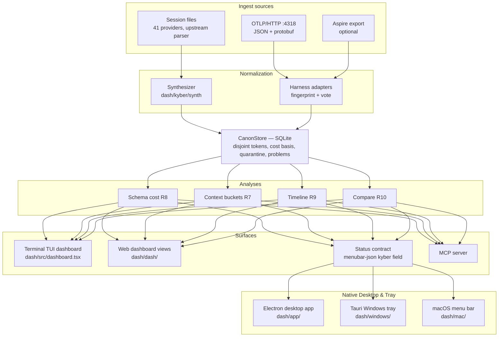
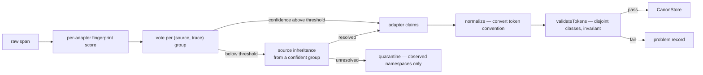

# KyberDash architecture

KyberDash is a locally-run product that answers three questions about coding agents: what
they cost, what filled their context windows, and whether a change to either actually helped.
It reads the session files that 41 agent tools already write to disk **and** receives
OpenTelemetry spans directly, then runs the same normalization and analysis over both.

It is a **soft fork** of [`getagentseal/codeburn`](https://github.com/getagentseal/codeburn)
(MIT, TypeScript), vendored into this repository with `git subtree` under `dash/`. The
session-file breadth and the terminal/menu-bar/desktop surfaces come from upstream; the span
analysis depth — disjoint token accounting, basis-carrying cost, context composition, tool and
schema cost, quarantine — comes from the retired Python pipeline
(`agent-session-analysis-dashboard`), ported into the subtree's merge zone.

The measured failures that shape several requirements — a 5.8× cost understatement, negative
fresh input on 293 of 307 spans, 25 of 1,009 spans losing a parent, 2.9 GB for 37,623 stored
spans — are recorded in [KyberDash measurable rationale](../reference/kyberdash-rationale.md).
They are correctness constraints, not style choices: they document failures that already
occurred in the Python pipeline, and a reimplementation that drops a requirement reproduces the
failure. The foundational architecture decisions — the TypeScript soft fork, the merge zone,
the embedded receiver — are recorded in [ADR 0006](../adr/0006-kyberdash-soft-fork-merge-zone-and-embedded-receiver.md).

## High-level architecture

One canonical model serves both ingest paths: the session-file providers are **span
synthesizers**, converting a parsed provider call into canonical records exactly as an OTLP
payload is decoded and normalized. No analysis knows or asks which path its data arrived by,
which is how Requirement 11.1 — one data path, not two parallel ones — is satisfied.

## Repository layout and the merge zone

Requirement 14 makes mergeability a design constraint, and mergeability is a function of which
files are touched. The tree is partitioned by ownership; the complete rule set lives in
[`dash/kyber/README.md`](../../dash/kyber/README.md):

| Path | Ownership | Merge behaviour |
|---|---|---|
| `dash/src/**` | Upstream | The conflict surface. Read-only. |
| `dash/kyber/**` | KyberDash only | Never conflicts — upstream has no such path. The merge zone. |
| `dash/dash/**` | Upstream React dashboard | Extended at the boundary; conflicts possible and expected. |
| `dash/app/**` | Upstream Electron application | Extended at the boundary; conflicts possible. |
| `dash/mac/**` | Upstream Swift menu-bar application | Extended at the boundary; conflicts possible. |
| `dash/windows/**`, `dash/gnome/**` | Upstream | Unmodified and unbuilt (R14.4). |

KyberDash code lives only under `dash/kyber/**` and consumes upstream's *output* — the parsed
call array its parser already produces and the deduplication set behind it — rather than
reaching into its internals (R14.2). The `tests/KyberWeave.Tests/MergeBoundaryTests.cs` suite
pins the boundary: no KyberDash source under upstream read-only roots, the unshipped surfaces
present and unmodified, and the upstream remote registered.

### Deliberate merge-zone edits

Four files inside upstream's directories are changed on purpose, and each is recorded with its
reason so a future merge conflict arrives with rationale attached (R14.3):

| File | Reason |
|---|---|
| `dash/src/menubar-json.ts` | The status contract (R11.4): optional `kyber` field carrying the new analyses — context buckets and pressure (R7), schema ranking (R8), timeline (R9), comparison (R10), `quarantineCount` and `problems` (R6). Optional so old payloads still decode; extending it carries a new analysis into native clients without modifying them (R11.5). |
| `dash/src/usage-aggregator.ts` | Wiring of the contract extension: `buildMenubarPayloadForRange` forwards the optional `kyber` payload; no analysis logic in the payload builder. |
| `dash/app/electron/cli.ts` | Binary lookup falls back from `kyber-weave` to `codeburn` so the Electron app spawns the renamed CLI. |
| `dash/mac/Sources/CodeBurnMenubar/Security/CodeburnCLI.swift` | Same binary-name fallback for the Swift menu bar; search order `kyber-weave` → `codeburn` keeps the decode path unchanged. |

## Ingest layer

| Component | Path | Contract |
|---|---|---|
| Upstream provider parser | `dash/src/` | Existing. Produces parsed calls plus its deduplication set. Not modified. |
| `Synthesizer` | `dash/kyber/synth/synth.ts` | Consumes parsed calls; emits canonical records with a declared measurability map. Extends upstream's cross-provider deduplication key rather than adding a parallel mechanism (R3). |
| `OtlpReceiver` | `dash/kyber/otel/receiver.ts` | HTTP listener on the OTLP-standard port 4318 at `POST /v1/traces`. Decodes JSON and protobuf to one span shape. Protobuf is decoded by hand — a wire-format reader against the stable OTLP trace schema — because the merge zone carries no protobuf library the subtree could merge cleanly. |
| `AspireSource` | `dash/kyber/otel/aspire.ts` | Optional. Reads spans exported from a running Aspire dashboard (R2.6), supervised with backoff. Records whose parent is missing are grouped by attribute rather than ancestry (R2.7). |
| `IngestWriter` | `dash/kyber/otel/writer.ts` | Batches writes and owns backpressure so no record is dropped under load (R2.5). |

The receiver is embedded rather than relying on an external Aspire dashboard because the
dashboard is a ring buffer — eviction is a measured data-loss class (R2.7) — and because
Requirement 2 must hold without Docker, a container runtime, or a collector. The existing
collectors already post OTLP JSON to port 4318, so they work unchanged.

## Normalization layer

Every `HarnessAdapter` (`dash/kyber/canon/adapters/base.ts`) implements the same interface:
detect, relevance, normalize, group, resolve a root, validate, and declare what the harness
does not export. The last method is what turns a blank view into a stated limitation rather
than a zero (R7.6, R8.5, R10.2).

Attribution is a two-pass vote: a fingerprint vote per source-and-trace group, then source
inheritance for still-undecided spans belonging to a source already confidently mapped
(R6.2). `harness` is voted, never read from the telemetry source name — the source carries
per-instance suffixes, does not track content, and is not stable across reconfiguration
(the rationale is in [KyberDash measurable rationale](../reference/kyberdash-rationale.md)). Records no adapter claims with sufficient confidence are
**quarantined** with their observed attribute namespaces and never guessed at (R6.1).

## Canonical model

The canonical record, `TokenUsage`, `CostBlock`, `Measurability`, `Problem` and the canonical
content keys are defined in `dash/kyber/canon/types.ts`. Field names follow the Python
pipeline's contract so the parity gate can compare like with like.

### `TokenUsage` and the disjoint-class invariant

| Field | Meaning |
|---|---|
| `freshInput` | Input neither read from nor written to cache |
| `cacheRead` | Input served from cache |
| `cacheCreation` | Input written to cache |
| `output` | Generated tokens |
| `reasoning` | A subset of `output`, never an addition to it |
| `reportedInput`, `reportedOutput` | What the harness itself claimed |

The invariant is `freshInput + cacheRead + cacheCreation === reportedInput`, checked by
`validateTokens` on **every** record, orphans included (R4.3). Storing the classes disjointly
is what makes the invariant checkable at all; a model that stored "input" as one number could
not detect the pi/Copilot convention inversion of R4.2 — the same `gen_ai.usage.input_tokens`
attribute key with opposite meanings across harnesses. Adapters convert each harness's
convention on the way in; a decomposition that yields negative fresh input, or that does not
reconcile to the reported total, rejects the record and writes a problem rather than storing
it (R4.4).

### `CostBlock` and cost basis

A cost figure travels with its `basis` — a published table, or the harness's own arithmetic —
and figures of different bases are never blended into one total without saying so (R5.1). A
harness-reported figure is carried verbatim in preference to a derived one (R5.2). `status`
separates `no_rate` from `not_billed` from `out_of_scope` (R5.4, R5.5), and tier resolution
selects context tiers by measured input size (R5.6). The scoping failure this prevents — a
table pricing a harness it does not name — is in the [rationale](../reference/kyberdash-rationale.md).

### `Measurability`

Each source declares per-metric availability independent of value (R10.1). A metric a source
cannot report renders as "not measurable", never as zero — rendering an unreported metric as
`0` would make the harness that reports least look most efficient.

### Store

`CanonStore` (`dash/kyber/canon/store.ts`) is SQLite through the runtime's built-in module —
upstream already depends on it for two providers, so no new dependency is introduced. The
schema is a version-controlled constant executed on construction; metadata carries the schema
version so a store built by an older version is detectable. Idempotent upsert is keyed on the
record identifier, which makes re-ingest idempotent (R2.5). Tables cover raw records, the
tokenization cache, quarantine, the ingest log, derived sessions, problems, and the
schema-version metadata. The raw column is compressed (R12.4); the measured cost of not doing
so is in the [rationale](../reference/kyberdash-rationale.md).

Derived token counts (R4.6) come from `dash/kyber/canon/tokens.ts`, a tokenizer wrapper with a
store-backed memo cache, and are tagged as derived with the model name so consumers present
them as a lower bound.

## Analysis layer

Each analysis is a port of a Python module, one to one, so the parity gate has something to
compare against:

| Analysis | Module | Realizes |
|---|---|---|
| Context bucketing, residual, pressure, cache-invalidation flag | `dash/kyber/analysis/context.ts` (`analyzeContext`) | R7 |
| Schema-cost ranking, never-invoked cost, bounded unused range | `dash/kyber/analysis/schema.ts` | R8 |
| Hierarchical timeline, subagent and auxiliary separation | `dash/kyber/analysis/timeline.ts` | R9 |
| Cross-harness metric table with availability | `dash/kyber/analysis/compare.ts` | R10 |

Context bucketing buckets by part type — system prompt, tool definitions, instruction and
workspace context, conversation history, file contents through tool results — never by message
role (R7.2). The unbucketed residual is exposed explicitly and attributed to tokenizer drift
only where that is the actual cause (R7.3). A sharp fresh-input rise between consecutive turns
flags the turn — the visible signature of cache invalidation (R7.5).

Unused-schema cost is expressed as a range bounded by the cache-read floor and the fresh-input
ceiling, because the true figure depends on cache behaviour the telemetry does not report
(R8.4). Tool definitions are grouped by MCP server against ground-truth names rather than by
splitting a prefixed identifier (R8.3).

## Surface layer

`dash/kyber/dashboard/data.ts` (`getDashboardData`) turns the canonical store into the single
payload the delivery surfaces consume: period reports, breakdown tables, daily activity, and the
analysis payloads of Requirements 7 through 10. The terminal TUI dashboard, the browser-based web
dashboard views under `dash/kyber/web/components/`, the status contract, and the MCP server all derive
from it (R11.1).

For operational instructions, dev runners, and test suites across all four surfaces, see the
[KyberDash runbook](runbook.md).

### Terminal TUI Dashboard (dash/src/dashboard.tsx)

The interactive Terminal User Interface (TUI) dashboard is built with [Ink](https://github.com/vadimdemedes/ink)
(React in the terminal) and runs directly in any modern terminal emulator supporting ANSI and 24-bit TrueColor.
It provides responsive layout breakpoints adapting to terminal width (single column at 89 columns or below,
two columns from 90 to 134 columns, and three columns at 135 columns and above, clamped at 256 columns),
shortened project paths, interactive keyboard navigation, and live session refresh.

### Web Dashboard (dash/dash/)

The standalone browser web dashboard is a React application built with Vite and Tailwind CSS. It visualizes
interactive token accumulation heatmaps, cost breakdowns, and agent turn timelines. In production, it is
served directly by the CLI command `codeburn web` (or `node dash/dist/cli.js web`), which injects session
bootstrapping with XSS protection and handles query filtering without crashing on invalid inputs.

### Electron Desktop App (dash/app/)

The Electron desktop application delivers a rich desktop window powered by a TypeScript main process
and a Vite-bundled React renderer. The desktop client spawns the compiled CLI (`dist/cli.js`) to fetch
dashboard state and stream telemetry updates. For development and visual testing without launching the full
Electron runtime, a resident demo bridge (`dash/app/demo-bridge.mjs`) provides an HTTP mock bridge on port 4900.

### Windows Menubar / Tray App (dash/windows/)

The Windows menubar tray application is built with Tauri 2.x and Rust, residing in the taskbar notification
tray to present instant spend statistics and popovers. It binds safely to the local CLI executable via the
`CODEBURN_BIN` environment variable (validated by `CodeburnCli::resolve()` in `dash/windows/src-tauri/src/cli.rs`),
enforcing bounded payloads, strict process timeouts, and version gating against CLIs older than `0.9.9`.

### Status Contract and Native Delivery

The status contract is the one seam the native clients depend on: they spawn the CLI on an
interval and decode its output, holding no analysis logic. Extending the optional `kyber`
field in `dash/src/menubar-json.ts` is therefore sufficient to carry a new analysis into the
menu bar and the Electron window without modifying the clients (R11.5). `tests/status.contract.test.ts`
pins the contract so a change that would break the native clients fails in CI. The MCP server
exposes the same figures (R11.6), and `tests/mcp-kyber-parity.test.ts` asserts the MCP payload
and the status payload agree.

## Parity gate and migration (R15)

`dash/kyber/tools/parity.ts` runs the ported pipeline over a span corpus and emits the same
content-free digest shape as the Python pipeline; the digest test fails when the two differ
and reports which section diverged (R15.1, R15.2). `dash/kyber/tools/reingest.ts` reconstructs
a fresh store from existing span exports, so the corpus is re-ingestible without carrying the
old derived store forward (R15.3). The parity gate is the authorization to retire the Python
project; the measured rationale the retirement would otherwise take with it is preserved in
[`dash/../reference/kyberdash-rationale.md`](../reference/kyberdash-rationale.md) (R15.4).

## Related

- [KyberDash runbook](runbook.md) — local development, execution runners, demo bridge, and test suites across all 4 surfaces.
- [KyberDash measurable rationale](../reference/kyberdash-rationale.md) — the measured
  failures behind Requirements 4, 5, 6 and the other quantified constraints.
- [ADR 0006](../adr/0006-kyberdash-soft-fork-merge-zone-and-embedded-receiver.md) — the
  foundational decisions and their rejected alternatives.
- [KyberDash index](README.md) — the product story.
- [Component catalog](../catalog.md)