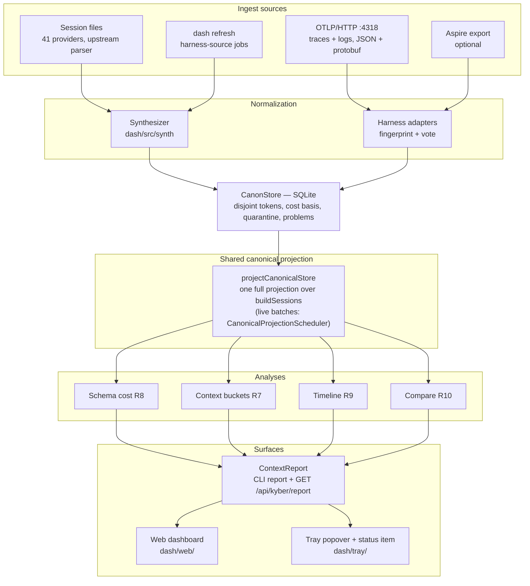
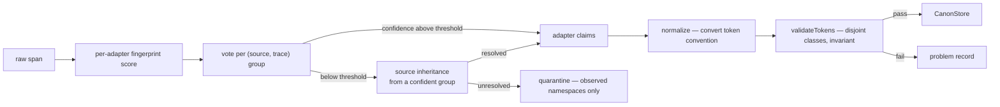

# KyberDash architecture

KyberDash is a locally-run product that answers three questions about coding agents: what
they cost, what filled their context windows, and whether a change to either actually helped.
It reads the session files that 41 agent tools already write to disk **and** receives
OpenTelemetry spans directly, then runs the same normalization and analysis over both.

It began as a soft fork of the MIT-licensed CodeBurn project and is now a **one-time fork**:
first-party code under `dash/`, with no upstream relationship
([ADR 0020](../adr/0020-kyberdash-one-time-fork.md)). The session-file breadth came from
CodeBurn; the span analysis depth — disjoint token accounting, basis-carrying cost, context
composition, tool and schema cost, quarantine — came from the retired Python pipeline
(`agent-session-analysis-dashboard`).

The measured failures that shape several requirements — a 5.8× cost understatement, negative
fresh input on 293 of 307 spans, 25 of 1,009 spans losing a parent, 2.9 GB for 37,623 stored
spans — are recorded in [KyberDash measurable rationale](../reference/kyberdash-rationale.md).
They are correctness constraints, not style choices: they document failures that already
occurred in the Python pipeline, and a reimplementation that drops a requirement reproduces the
failure. The foundational architecture decisions — the one-time fork, the embedded receiver,
the span-shaped canonical model, SEA distribution and the engine language — are recorded in
[ADR 0020](../adr/0020-kyberdash-one-time-fork.md).

## High-level architecture


```mermaid
flowchart TB
    subgraph sources["Ingest sources"]
        FS["Session files<br/>41 providers, upstream parser"]
        RF["dash refresh<br/>harness-source jobs"]
        OT["OTLP/HTTP :4318<br/>traces + logs, JSON + protobuf"]
        AS["Aspire export<br/>optional"]
    end

    subgraph normalize["Normalization"]
        SY["Synthesizer<br/>dash/src/synth"]
        AD["Harness adapters<br/>fingerprint + vote"]
    end

    ST["CanonStore — SQLite<br/>disjoint tokens, cost basis, quarantine, problems"]

    subgraph projection["Shared canonical projection"]
        PR["projectCanonicalStore<br/>one full projection over buildSessions<br/>(live batches: CanonicalProjectionScheduler)"]
    end

    subgraph analyses["Analyses"]
        AN1["Schema cost R8"]
        AN2["Context buckets R7"]
        AN3["Timeline R9"]
        AN4["Compare R10"]
    end

    subgraph surfaces["Surfaces"]
        REPORT["ContextReport<br/>CLI report + GET /api/kyber/report"]
        WEB["Web dashboard<br/>dash/web/"]
        TRAY["Tray popover + status item<br/>dash/tray/"]
    end

    FS --> SY
    RF --> SY
    OT --> AD
    AS --> AD
    SY --> ST
    AD --> ST
    ST --> PR
    PR --> AN1 & AN2 & AN3 & AN4
    AN1 & AN2 & AN3 & AN4 --> REPORT
    REPORT --> WEB & TRAY
```

One canonical model serves both ingest paths: the session-file providers are **span
synthesizers**, converting a parsed provider call into canonical records exactly as an OTLP
payload is decoded and normalized. No analysis knows or asks which path its data arrived by,
which is how Requirement 11.1 — one data path, not two parallel ones — is satisfied.

Both ingest paths also end in **one shared projection** (below): no surface derives sessions
from raw records, and no surface keeps a second derivation of the same figures.

## Repository layout

`dash/` is first-party code ([ADR 0020](../adr/0020-kyberdash-one-time-fork.md)): any file is
edited on its merits, under the repository's gates.

| Path | Contents |
|---|---|
| `dash/src/**` | The CLI engine: provider session parsers, canonical store and projection, analyses, OTLP receiver, harness-source refresh, server, and CLI commands |
| `dash/web/**` | The React web dashboard |
| `dash/tray/**` | The KyberDash tray — a Tauri 2 Rust shell (`src-tauri/`) plus a React popover UI (`ui/`) |

The former `dash/kyber/**` tree was folded into `dash/src/**`, and the Electron desktop app,
the inherited Windows tray, the macOS menu-bar bundle, and the Ink TUI were deleted as the
[context-surfaces specification](../archive/specs/kyberdash-context-surfaces/README.md) delivered;
the table above is the whole layout.

## Ingest layer

| Component | Path | Contract |
|---|---|---|
| Upstream provider parser | `dash/src/` | Existing. Produces parsed calls plus its deduplication set. Not modified. |
| `Synthesizer` | `dash/src/synth/synth.ts` | Consumes parsed calls; emits canonical records with a declared measurability map. Extends upstream's cross-provider deduplication key rather than adding a parallel mechanism (R3). |
| `OtlpReceiver` | `dash/src/otel/receiver.ts` | HTTP listener on the OTLP-standard port 4318 at `POST /v1/traces` and `POST /v1/logs`. It decodes JSON and protobuf to span and log shapes. Each decoded log gets a unique `deriveLogId` (correlation identity, timestamp, and payload digest) so duplicate deliveries of the same class do not collide. A log enriches its correlated span-shaped record and is never a parallel canonical record. |
| `AspireSource` | `dash/src/otel/aspire.ts` | Optional. Reads spans exported from a running Aspire dashboard (R2.6), supervised with backoff. Records whose parent is missing are grouped by attribute rather than ancestry (R2.7). |
| `IngestWriter` | `dash/src/otel/writer.ts` | Batches writes and owns backpressure so no record is dropped under load (R2.5). |

The receiver is embedded rather than relying on an external Aspire dashboard because the
dashboard is a ring buffer — eviction is a measured data-loss class (R2.7) — and because
Requirement 2 must hold without Docker, a container runtime, or a collector. The existing
collectors already post OTLP JSON to port 4318, so they work unchanged. Non-model and
unmatched telemetry is quarantined with an auditable reason instead of becoming a session.

Receiver activity is auditable in `ingest_log`: the span sink writes one row per distinct
span source in each decoded batch (`service.name`, `'otlp'` when unnamed), sized to the
arriving batch so quarantined traffic still counts as received, and the log sink writes
one `otlp:logs` row per log batch so last-received reflects any receiver request. Writes
join the writer's existing store handle after the ingest call returns; there is no schema
change and no second projection. An empty log reads as unknown downstream — "no receiver
activity recorded" — never as stopped or running, because receiver liveness is not
observable from the web server.

## Local harness-source refresh

Session files also enter the store through `kyber-weave dash refresh` (`registerKyberCommands`
in `dash/src/cli/register.ts`, `refreshHarnessSources` in `dash/src/refresh/orchestrator.ts`).
That path is the production local-history ingest; OTLP remains a separate receiver. The
scheduler, source reader, writer queue, and registry live under `dash/src/refresh/**`.

The command opens `~/.kyberdash/canon.db` (or `--db`), audits the harness-source registry
against `getAllProviders()`, and runs **one logical job per harness source type**. Native
files or database records are the units of work. Inclusion uses a UTC record window
`[commandStartedAt − N×7 days, commandStartedAt]`; `--history-weeks` is a positive integer
and defaults to **2**. There is no public `--provider` flag. Invalid `--history-weeks`
exits **2** before the store opens. Failed harness jobs or derivation failure exit **1**.
Success, including absent (`unavailable`) sources, exits **0**.

Each accepted unit is persisted with `CanonStore.commitSourceUnit`: canonical rows,
`record_provenance`, and `source_checkpoint` in one transaction (schema **15**). Every
refresh run additionally records its coverage window in `refresh_run.history_weeks` — the
`--history-weeks` value of that run. Rows predating window tracking read as `null`, which
every surface renders as unknown with the reason "recorded before window tracking", never
coerced to a default or to zero
([honest unobservability](../rules/honest-unobservability.md)). A changed unit that
yields no records persists its reason on the checkpoint's `last_error_code` (status stays
`ok`): `window_filtered` when the parser produced calls that all predate the coverage
window (`sliceCallsToWindow`), `no_recordable_events` when it produced none (for Codex,
no `token_count` or model events). A unit with records, or with problems, carries no such
reason. The Codex OTLP adapter (`canon/adapters/codex.ts`) is the sixth fingerprint voter; see the Codex OTLP note in [telemetry-inventory](telemetry-inventory.md). After jobs
drain, `purgeExpiredContent` empties content older than 14 days without touching
`records.raw` ([ADR 0018](../adr/0018-kyberdash-content-retention-purge.md)), then the store
is projected through `projectCanonicalStore` — the same shared entry the live receiver uses
(see [The shared canonical projection](#the-shared-canonical-projection)). Gemini is never a
stored harness id; split client surfaces stay distinct. A Gemini **selector label** may still
appear in the UI as usage / survey chrome; it is not `harness=gemini` in `canon.db`. There is
no dashboard refresh button.

The contract is [ADR 0016](../adr/0016-kyberdash-harness-source-refresh.md).

## The shared canonical projection

Static dot-folder refresh and live OTLP are two ingress adapters over ONE canonical store,
and both end in the same projection of it
(`dash/src/canon/projection.ts`). `projectCanonicalStore` is the sole full projection: a
thin, awaitable entry over the authoritative `buildSessions()`, which rebuilds every derived
`session`, `run`, `execution`, `harness_rollup`, and `finding` row. Nothing else derives
sessions — a second derivation or a second database is the divergence this seam exists to
prevent, and the manual `kyberdash build` command runs the same derivation.

The live collector does not call the projection inline. Accepted span batches and successful
log enrichment mark a serialized `CanonicalProjectionScheduler` dirty instead:

- The scheduler **debounces**: a pass starts only after the ingest stream has been quiet for
  `DEFAULT_PROJECTION_IDLE_MS` (10s), at the staleness cap `DEFAULT_PROJECTION_MAX_WAIT_MS`
  (10min) if dirt never quiesces, and never sooner than `DEFAULT_PROJECTION_MIN_INTERVAL_MS`
  (10min) after the previous pass started. Sustained traffic therefore costs at most one full
  pass per 10 minutes; `request()` never starts one immediately.
- At most one pass runs at a time; a burst of dirty marks costs one pass plus **one trailing
  (scheduled, not immediate) pass**, never one projection per batch.
- A failed pass rolls nothing back — records the writer already committed stay committed —
  reports the error, and leaves the work dirty; the next request or `drain()` retries it. A
  slow or failing projection can therefore never block, reject, or drop accepted ingestion.
- Shutdown orders receiver stop, writer stop, projection drain, then store close: `drain()`
  and `close()` bypass the debounce/floor schedule, attempt any owed work immediately,
  and resolve once no pass is in flight and no trailing pass is owed — a failed pass
  can still leave work dirty, to be retried by the next request or `drain()`. Those
  knobs limit
  when a projection pass may START, not how fresh derived sessions are: a batch that
  arrives just after a pass started can wait nearly the full minimum interval (the 10s
  idle window plus a floor up to 10min) for the next pass, and slow or failed passes can
  delay visible results further. Under saturation, at most one new pass starts per
  10 minutes, so derived sessions trail the last accepted batch by roughly the idle
  window after the stream quiets, and worst-case by the 10-minute caps.

`KyberBridge.listSessions()` (`dash/src/server/bridge.ts`) reads only the canonical derived
`session` cache. Raw `records` are never synthesized into sessions for reporting: until the
projection has turned accepted spans into derived rows, a record-only group is not a session
and appears on no report surface or selector inventory.

## Normalization layer


```mermaid
flowchart LR
    RAW["raw span"] --> SCORE["per-adapter fingerprint score"]
    SCORE --> VOTE["vote per (source, trace) group"]
    VOTE -->|"confidence above threshold"| CLAIM["adapter claims"]
    VOTE -->|"below threshold"| INHERIT["source inheritance<br/>from a confident group"]
    INHERIT -->|"resolved"| CLAIM
    INHERIT -->|"unresolved"| QUAR["quarantine — observed namespaces only"]
    CLAIM --> NORM["normalize — convert token convention"]
    NORM --> VAL["validateTokens — disjoint classes, invariant"]
    VAL -->|"pass"| STORE["CanonStore"]
    VAL -->|"fail"| PROB["problem record"]
```

Every `HarnessAdapter` (`dash/src/canon/adapters/base.ts`) implements the same interface:
detect, relevance, normalize, group, resolve a root, validate, and declare what the harness
does not export. The last method is what turns a blank view into a stated limitation rather
than a zero (R7.6, R8.5, R10.2).

Attribution is a two-pass vote: a fingerprint vote per source-and-trace group, then source
inheritance for still-undecided spans belonging to a source already confidently mapped
(R6.2). `harness` is voted, never read from the telemetry source name — the source carries
per-instance suffixes, does not track content, and is not stable across reconfiguration
(the rationale is in [KyberDash measurable rationale](../reference/kyberdash-rationale.md)). Records no adapter claims with sufficient confidence are
**quarantined** with their observed attribute namespaces and never guessed at (R6.1).

## Canonical model

The canonical record, `TokenUsage`, `CostBlock`, `Measurability`, `Problem` and the canonical
content keys are defined in `dash/src/canon/types.ts`. Field names follow the Python
pipeline's contract so the parity gate can compare like with like.

### `TokenUsage` and the disjoint-class invariant

| Field | Meaning |
|---|---|
| `freshInput` | Input neither read from nor written to cache |
| `cacheRead` | Input served from cache |
| `cacheCreation` | Input written to cache |
| `output` | Generated tokens |
| `reasoning` | A subset of `output`, never an addition to it |
| `reportedInput`, `reportedOutput` | What the harness itself claimed |

The invariant is `freshInput + cacheRead + cacheCreation === reportedInput`, checked by
`validateTokens` on **every** record, orphans included (R4.3). Storing the classes disjointly
is what makes the invariant checkable at all; a model that stored "input" as one number could
not detect the pi/Copilot convention inversion of R4.2 — the same `gen_ai.usage.input_tokens`
attribute key with opposite meanings across harnesses. Adapters convert each harness's
convention on the way in. When inclusive subtraction is impossible — cache exceeds the
input that supposedly contains it — the counters are exclusive-shaped and convert that
way rather than being stored as negative fresh or clamped to zero. File-side exclusive
reasoning (Antigravity-cli thinking counted separately from response) is folded into
`output` so the subset invariant holds; Copilot rows that carry reasoning with output
absent stay unfolded so that absence stays visible. A decomposition that is still
negative, or that does not reconcile to the reported total, rejects the record and
writes a problem rather than storing it (R4.4).

### `CostBlock` and cost basis

A cost figure travels with its `basis` — a published table, or the harness's own arithmetic —
and figures of different bases are never blended into one total without saying so (R5.1). A
harness-reported figure is carried verbatim in preference to a derived one (R5.2). `status`
separates `no_rate` from `not_billed` from `out_of_scope` (R5.4, R5.5), and tier resolution
selects context tiers by measured input size (R5.6). The scoping failure this prevents — a
table pricing a harness it does not name — is in the [rationale](../reference/kyberdash-rationale.md).

**Repricing at projection time.** Ingest freezes a turn's cost as it arrived, often
`{unknown, no_rate}`. `buildSessions` reprices every turn record whose block is not
`basis:'harness'` and writes changed `cost_json` back in the same pass, so the session list, the
cost tile and the report path (`costContributionsForSessions`) share one answer. There is no
schema bump (`SCHEMA_VERSION` stays 14); existing stores and later `priceOverrides` /
`modelAliases` changes take effect on the next projection.

The write-back is the one exception to "every derived table is a cache over `records`". Each
session's changed blocks go through `CanonStore.setCosts` in **one transaction** (`BEGIN`/`COMMIT`,
rolled back whole on failure; an empty list is a no-op), so a failing session cannot leave a
half-repriced one. `records.cost_json` is the derived, re-derivable cost cache: the report path
reads it, the next projection reprices it, and a re-ingest overwrite self-heals on that next
projection. Reprojecting a correct store writes nothing, and `harness` blocks are never touched.
`isCopilotHarness` (`copilot-rates.ts`) is the single Copilot-family predicate used to route a turn
to the credits table.

**Published-path rules.**

- An absent model is `{published, no_rate}` from `pricePublishedTurn`, not `unknown`: mixing
  `unknown` with `published` turns makes `sumCosts` refuse the total (`COST_BASIS_MISMATCH`).
- Cache writes: an absent cache-write rate is billed at the input rate. `gpt-6-luna` has no
  published cache-write rate, so cache creation is billed as input on both the LiteLLM path and the
  Copilot credits table (base $0.10, long-context $0.20 per 1M).
  `claude-sonnet-5-5` keeps its explicit $2.50/M.
- `gpt-6-luna` long-context tier: one shared `GPT_6_LUNA_PROMPT_TOKEN_THRESHOLD` (272,000,
  `pricing/models.ts`). Both paths choose the tier by measured input (fresh + cacheRead +
  cacheCreation); 272,000 stays on the base tier and 272,001 is long.
- The Copilot reader sets `costHarnessReported` only when `cost_usd` is a finite number. Copilot
  without the marker defaults to `published`, so a parser that forgets the flag is repriced from the
  credits table instead of keeping a LiteLLM-derived figure at API list rates.
- `claude-sonnet-5-5` and `gpt-6-luna` also live in `MANUAL_ENTRIES` of
  `dash/scripts/bundle-litellm.mjs` (guarded by a test), so a regeneration reproduces them. The
  bundler writes both generated snapshots to `dash/src/pricing/data/`, which is what
  `dash/src/pricing/models.ts` imports. `npm --prefix dash run build` runs that networked refresh
  first; `build:cli`, Node SEA packaging, and `npm publish` (`prepublishOnly` → `build:cli`)
  embed the committed files without re-snapshotting. Networked refresh is the explicit
  `npm run bundle-litellm` only. See the [runbook](runbook.md#build-workflow). The gap-fill
  file (`pricing-fallback.json`) shrank from
  ~205 to 52 keys after the 2026-10-01 primary refresh absorbed most former fallback rows; it
  remains a last-resort backstop, not a broad catalog.

| Harness (normalized) | Priced from | Notes |
|---|---|---|
| `claude-code` (`claude-cli`, `claude-desktop`), `codex` (`codex-*`) | The bundled published table: the LiteLLM snapshot plus `pricing-provenance.json`, through `pricePublishedTurn` (`dash/src/canon/published-pricing.ts`) | Cache-aware. `claude-sonnet-5-5` and `gpt-6-luna` (with its >272K tier) were added 2026-09-30 with cited sources. `priceOverrides`, `modelAliases` and `flatRateModels` act on this path. |
| `copilot` (`copilot-*`) | The Copilot credits table (`dash/src/canon/copilot-rates.ts`; 1 credit = $0.01; GitHub models-and-pricing) | Per-class rates (input, cached input, cache write, output) and input-size tiers. Where the table says cache write is "Not applicable" (`gpt-6-luna`), the input rate is used. A model the table omits is `{published, no_rate}`; overrides and aliases do not reach this path. |
| Any harness outside the two above | Unchanged: the upstream parser's figure | Additive scope; a harness the LiteLLM table does not name is `out_of_scope` for it (R5.3). |

A genuine harness-reported figure is never repriced (R5.2). For Copilot, only the genuine
reader's `cost_usd` (marked `costHarnessReported` in `synth/readers/copilot.ts`) is `harness`;
figures the Copilot parser derives through LiteLLM are `published` and are repriced from the
credits table. `costBlockFor` returns `{published, no_rate}` for a zero or non-finite figure from
a published-rate source (`costIsEstimated === true`), and `unknown` only where no pricing was
attempted.

**Session totals.** `buildSessionRow` sums only turn records; a non-turn span makes no cost
claim. A session with some unpriced published turns totals `partial` with the priced share. A
genuine mix of `harness` and `published` turns records `COST_BASIS_MISMATCH` in the payload's
`problems` (where the cost tile reads it) instead of silently becoming `no_rate`.

**Display.** `KyberBridge.listSessions` maps the canonical `CostBlock` (basis, status, value,
currency) onto each row as `cost`; `cost_usd` is the block's value only when `status` is `priced`
and the currency is USD. `AgentSessionRow` renders the cost tile's formatter text ("partially
priced", "no published rate", "not billed", "out of scope", or the formatted figure); `—` appears
only when the server sent no cost.

**Rate metadata.** `getMeta().rates` keeps its flat Copilot-credits fields and adds `tables`
(`published` and `copilot_credits`), each with `source`, `retrieved` and `applies_to`.

### `Measurability` and honest unobservability

Each source declares per-metric availability independent of value (R10.1). A metric a source
cannot report renders as "not measurable" (`null` with a machine- and human-readable `reason`),
never as zero — rendering an unreported metric as `0` would make the harness that reports least look
most efficient. Content readers (such as `copilotVscodeReader` and `cursorReader`) map native evidence
into input-side `ReaderTurn` snapshots without attributing current response text to input context or
inventing unobserved prefix history. Where total tokens and context window are known, pressure is
measured independently from whether individual composition buckets are available.

### Store

`CanonStore` (`dash/src/canon/store.ts`) is SQLite through the runtime's built-in module —
upstream already depends on it for two providers, so no new dependency is introduced. The
schema is a version-controlled constant executed on construction, currently at version 14;
metadata carries the schema version, and a store built by an older version is migrated in
place on open rather than rebuilt. Idempotent upsert is keyed on the
record identifier, which makes re-ingest idempotent (R2.5). The tables are `records`,
`session`, `run`, `execution`, `token_cache`, `quarantine`, `pending_logs`,
`quarantined_logs`, `enriched_logs`, `problems`, `ingest_log`, `metadata`,
`harness_rollup`, `finding`, `prediction`, `source_checkpoint`, `record_provenance`, and `refresh_run`.
Schema 11 added checkpointing and provenance ([ADR 0016](../adr/0016-kyberdash-harness-source-refresh.md)),
schema 12 added `refresh_run`, schema 13 introduced `problem_key` with unique indexing, and schema 14 rekeyed that identity by span, code, and location.
`commitSourceUnit` writes records, provenance, and the unit checkpoint together. The raw
column is compressed (R12.4); the measured cost of not doing
so is in the [rationale](../reference/kyberdash-rationale.md).

Two `records` columns carry the grouping and content model. `session_id` holds the harness's
own conversation id, promoted out of the raw payload so sessions group with a `GROUP BY`;
where the source names no session it falls back to the trace id. `parts_json` holds
deflate-compressed structured content parts, each with its canonical bucket, its text, an
optional harness-reported token count, and an optional ground-truth MCP server name. Where
parts are present they are the authority: the flat content map is derived from them on read,
so the same text is never stored twice.

The `session` table holds derived sessions, one row per conversation. Each payload is built by
running the analysis layer (`analyzeContext`, `rankSchemas`, `buildTimeline`) over the
records, and the table is a cache: dropping every row and rebuilding loses nothing.

### Canonical Run and AgentExecution Entities (ADR 0012)

Single-session views obscure multi-agent collaboration overhead (tokens and latency spent
handing off tasks to subagents). KyberDash introduces two first-class derived entities in
`canon.db` (`dash/src/canon/runs.ts`):

- **`Run` (`RunRow`)**: Represents a single user-initiated task or unit of work. It aggregates
  all executions participating in that task, recording token totals, estimated waste,
  duration, and outcome signals (`exit_code`, `test_status_delta`, `outcome_status`).
- **`AgentExecution` (`ExecutionRow`)**: Represents an individual agent invocation within a
  run, tracking `parent_execution_id` and execution role (`root`, `child`, `delegated`).

#### Derived Run Identity (Decision D13)

When a harness natively emits a run or task identifier, that identity is preserved directly.
Where run identity is absent, KyberDash computes a **derived grouping** based on
working-directory affinity and bounded inter-session time gaps. Derived groupings are
explicitly recorded in `grouping_basis` as `derived` with the specific rule named. Heuristics
are never silently presented as reported fact. Rebuilding via `kyber build` re-projects both
tables deterministically from retained records.

`KyberBridge` (`dash/src/server/bridge.ts`) reads `canon.db` through public, DB-backed
queries (`getProblemCount()`, `getRefreshState()`, `getSessionCostContributions()`, `getQuarantineCount()`) 
and serves the derived sessions, runs, harness rollups, findings, and unclipped content without private-store
casts. That is the single-store end state in
[ADR 0008](../adr/0008-kyberdash-single-canonical-store.md): production code never opens a
Python `sessions.db`, and `AGENTDASH_DB` / `KYBER_DB` cannot expose a legacy session.
`dash/src/server/kyber-bridge.test.ts` proves those environment variables are ignored for
session listing and payload, and that listing serves only derived sessions — record-only
groups are excluded rather than synthesized
(see [The shared canonical projection](#the-shared-canonical-projection)).

The session projection emits the ASAD payload directly ([ADR 0011](../adr/0011-asad-only-context-view-and-payload-contract.md)).
It preserves per-bucket measurability and reasons, so a source that cannot supply content, schemas,
structure, or counters produces `not_measurable` rather than a misleading zero.

Derived token counts (R4.6) come from `dash/src/canon/tokens.ts`, a tokenizer wrapper with a
store-backed memo cache, and are tagged as derived with the model name so consumers present
them as a lower bound.

## Diagnostic Spine and Progressive Disclosure (ADR 0012)

KyberDash structures agent context analysis into a six-level progressive-disclosure hierarchy:

```
Level 1: All Harnesses (Context Doctor)
   └── Level 2: Harness
          └── Level 3: Run
                 └── Level 4: AgentExecution (Session)
                        └── Level 5: Turn
                               └── Level 6: ContextItem (Block / Part)
```

The web app lands on Context Doctor (`App` default `initialPage` / `spineReducer` stack
`{ level: 'context-doctor' }`). Header tabs are `Context Doctor · Usage · Quarantine · Problems`
(`NAV_TABS`). Usage is the CodeBurn spend grid; it does not open the app. There is no
Context tab: session browsing is the **Sessions** rail destination wrapping
`ContextExplorer` / `AgentSessionDashboard` (D17). Compare is not a header peer; it is a
spine-rail destination that mounts `CompareRuns` (D20). The sidebar is the spine rail
(`nav-rail-context-doctor`, `nav-rail-sessions`, `nav-rail-compare`); Share chrome is on Usage
only (D21). Density tokens live in the dashboard `@theme` (D22). A single shell harness
strip (`data-testid="harness-selector"`) is the harness level of the spine; selecting a
canonical id pushes `{ level: 'harness', harnessId }` and loads `runs?harness=`. A second
provider `<select>` exists only on the Usage tab. Gemini may appear as a selector **label**;
canonical rows and rollups do not use harness id `gemini`.

Live gates G1–G7 and G4a have passed on a local host against a real store: drill the six
levels, one diagnostic harness selector, canonical ids (including Claude Code), no
decision-id copy, empty charts marked empty rather than plotted as zero, layout inside the
shell. Findings-first Context Doctor, scorecard matrix, Turn inspector, and live Compare are on
the spine. Derived runs show a labelled grouping basis (`derived run` / `explicit run`,
`data-testid="run-grouping-basis"`) and are never silent clusters (D19). Calibration is
wired on Finding detail (`CalibrationSummary`). Content older than 14 days is purged after
refresh ([ADR 0018](../adr/0018-kyberdash-content-retention-purge.md)). Scorecard cells use
`formatDimensionDisplay`: unmeasurable or absent values render as `—`
with a reason, never as a fabricated `0`. A genuine measured zero is still `0`.

1. **All Harnesses (`ContextDoctor.tsx`)**: Cross-harness landing view ranking harnesses by
   aggregate context pressure, cache invalidation volume, and top telemetry-grounded findings.
2. **Harness (`HarnessDetail.tsx`)**: Deep dive into a single agent harness (e.g. Claude Code,
   Copilot, Cursor) showing harness rollups, coverage percentages, and run inventory.
3. **Run (`RunDetail.tsx`)**: Task-level view showing the hierarchical execution tree,
   delegation overhead, phase breakdown, run scorecard, and ranked run findings.
4. **AgentExecution (`AgentSessionDashboard.tsx`)**: The full single-session ASAD view,
   visualizing per-turn token spend, context composition, and tool schema cost.
5. **Turn (`SessionSpendCharts`, `ContextPressureStrip`)**: Granular turn breakdown exposing
   composition bands, fresh input spikes (cache invalidation), and schema residency.
6. **ContextItem (`ContextInspector.tsx`)**: Full unclipped plain-text inspection per semantic
   bucket, subdivided by part, with whole-turn and per-block copy out ([ADR 0014](../adr/0014-unclipped-turn-inspection-and-copy-out-protocol.md)).
   The inspector is reachable from Turn on the spine.

### Independent Dimension Vectors — No Composite Score (Decision D3)

KyberDash explicitly rejects composite efficiency scores, letter grades, or single-number
indexes. Agent performance is evaluated across six orthogonal dimensions:
- **Context Hygiene**: Proportion of context occupied by active instructions vs redundant history.
- **Cache Efficiency**: Cache read ratio, prefix stability, and cache breakpoint invalidation.
- **Tool Yield**: Ratio of tool invocations producing utilized results vs resident schema weight.
- **Skill Utilisation**: Empirical invocation frequency of declared capabilities.
- **Delegation Overhead**: Tokens and latency dedicated strictly to orchestrating child handoffs.
- **Continuity**: Turn-over-turn context stability and retention across compaction events.

A dimension lacking telemetry renders as a dash (`—`) with an explicit reason, never as zero
and never as a passing grade.

### Display families and source display names

Split client surfaces stay distinct in stored data — and, except for the two
evidenced twin front-ends below, in rollup keys and API filters.
`harnessFamily` (`dash/src/canon/measurability.ts`) is a display-level grouping only:
`claude-cli`, `claude-desktop`, and `claude-code` share the `claude-code` family label
while each canonical id and its per-origin count stays visible beside it, so grouping
never fabricates an aggregate. Twin front-ends fold one step earlier, at the
derived layer (issue #182): `claude-desktop` onto `claude-code` and `cursor-agent`
onto `cursor`, so those two surfaces share one canonical id, one rollup row, and one
API filter namespace. Derived rows persist canonical ids: rolling back the fold
after a rebuild requires rebuilding derived tables again under the reverted code.
Reads normalise too, because
[upgrading the binary does not rebuild derived tables](runbook.md#2-derived-projection-rebuilding-kyber-build):
a rollup row written before the fold still carries its raw front-end id, so the
per-harness checkpoint join on `/api/kyber/harnesses` is canonical on both sides
and such a row still reports its own coverage counts until a rebuild rewrites it.
That normalisation is what makes a miss after it a measured zero — the read
succeeded and this harness recorded no units — rather than an unknown, which is
reserved for an unreadable `source_checkpoint` table
([honest unobservability](../rules/honest-unobservability.md)).
Unmapped ids render verbatim.

Stored source names keep their namespace (`codeburn/<provider>` for file-sourced rows,
OTLP names verbatim, legacy `unattributed` rows retained). Surfaces render them through
`sourceDisplayName`, which strips the `codeburn/` prefix, labels the kind
(`local-file`, `otlp`, `legacy-unattributed` — the last displayed as
"unattributed (legacy)"), and keeps the raw value alongside the display value for
auditability. Raw `codeburn/` names never reach a user-facing surface.

## Analysis Layer

The analysis layer contains pure, hermetic analysis modules that operate over canonical records:

| Analysis | Module | Realizes |
|---|---|---|
| Context bucketing, residual, pressure, cache-invalidation flag | `dash/src/analysis/context.ts` (`analyzeContext`) | R7 |
| Schema-cost ranking, never-invoked cost, bounded unused range | `dash/src/analysis/schema.ts` (`rankSchemas`) | R8 |
| Hierarchical timeline, subagent and auxiliary separation | `dash/src/analysis/timeline.ts` (`buildTimeline`) | R9 |
| Cross-harness metric table with availability | `dash/src/analysis/compare.ts` (`compareHarnesses`) | R10 |
| Pure signal engine (8 detectors) | `dash/src/analysis/signals.ts` (`computeSignals`) | ADR 0012, ADR 0013 |
| Context-item classification (evidence of use) | `dash/src/analysis/classify.ts` (`classifyContextItem`) | ADR 0013 (D15) |
| Telemetry-grounded finding engine & waste ranking | `dash/src/analysis/findings.ts` (`detectFindings`) | ADR 0013 (D5, D6, D8) |
| Run & turn comparison by task phase | `dash/src/analysis/compare.ts`, `pairing.ts` | ADR 0012 (D11) |
| Prediction logging & calibration curve | `dash/src/analysis/calibration.ts` | ADR 0012 (D11) |
| Opt-in LLM context review seam | `dash/src/analysis/review.ts` | ADR 0015 (D10) |

### Pure Signals Engine (`dash/src/analysis/signals.ts`)

The signal engine computes deterministic diagnostic signals as pure, testable detectors. Each
detector declares its numerator, denominator, measurement class, and explicit unobservability rule:
- `contextReuseRatio`: Turn-over-turn token overlap via whitespace-normalized hashing.
- `cachePrefixStability`: Byte-prefix preservation before cache breakpoints; falls back to counter ratio if prefix bytes are unavailable.
- `toolYield`: Ratio of invoked tool calls to offered tool schemas. Credits on weak evidence, debits only on strong evidence.
- `duplicateCallRate`: Frequency of byte-identical tool invocations within the same turn phase.
- `oversizedResultShare`: Proportion of turn input consumed by large tool output blocks.
- `compactionPressure`: Rate of context window growth relative to model context limits.
- `delegationOverhead`: Percentage of run tokens spent on parent-child coordination.
- `skillUtilisation`: Observed activation frequency of declared skills (ranked last per D16).

### Context-Item Classification (Decision D15)

Context items are classified strictly by empirical observability rather than value judgements:
`evidence of use: strong / weak / none / unobserved`.
- `unobserved` indicates the harness does not emit sufficient telemetry to determine whether the
  block was read, and is never merged with `none`.
- Unattributed residuals (difference between reported usage tokens and reconstructed parts) form
  an isolated block, never distributed across other buckets.

### Telemetry-Grounded Finding Contracts and Waste Ranking (ADR 0013)

Every diagnostic finding satisfies the strict **Finding Contract (Decision D5)**:
1. **Mechanism prose**: Explains the technical cause and impact of the observed pattern.
2. **Evidence rows (≥2)**: Every finding links to at least two concrete telemetry records with IDs.
3. **Measurement class**: Declared as `deterministic`, `inferred`, or `coverage-gap`.
4. **Stated confidence basis**: Written justification for assigned confidence and what would raise it.
5. **Recommendation**: Actionable guidance adhering to **Relocation Over Deletion (Decision D8)**.
6. **Expected improvement & error bar**: Estimated token/latency savings with uncertainty bounds.
7. **Outcome-risk caveat**: Mandatory disclosure of potential execution risks.

Findings are ordered by the **Waste Ranking Formula (Decision D6)**:
$$\text{Rank Score} = \text{Estimated Recoverable Waste} \times \text{Outcome Risk} \times \text{Confidence}$$
An inferred finding can never outrank a deterministic finding of comparable size. Recoverable
waste is an estimate tied to a specific recommended action.

Two honest-measurement contracts govern what the engine will not claim. The compaction-hazard
detector fires only against a reported context window: an unreported window suppresses the
finding (pressure surfaces as unmeasurable instead), and a single-turn peak above the reported
window is downgraded to inferred with an aggregate-attribution caveat rather than printed as a
deterministic percentage. Twin front-end collectors (`claude-desktop` onto `claude-code`,
`cursor-agent` onto `cursor`) fold onto one canonical harness id, and same-turn observations
with byte-identical counters collapse per ADR 0009 source precedence (OTLP counters win; values are never
summed across sources for the same turn) instead of double-counting one conversation.
After that fold and exact-counter collapse, overlapping twin observations whose counters
differ but stand in a complementary or subset relation within `TWIN_TURN_MAX_SKEW_MS`
join inside `dedupeTwinTurns` (issue #231): the merge takes the per-dimension max and
prefers the fuller row as keeper, and joined counters are never summed. File+file twin
pairs under the folded `cursor` share are admitted, not only OTel+file. Raw ingest rows
remain provenance; the join applies when derived tables rebuild.

Copilot OTLP sessions are excluded from the `tool_yield` digest deliberately. No Copilot
producer path can yet vouch that tool-call telemetry is complete, so an absent
`tools_invoked` is not a measured zero — the session stays out of the denominator rather than
reporting yield `0` ([honest unobservability](../rules/honest-unobservability.md)).
Re-inclusion requires both of the following; either alone would fabricate a measurement:

1. A Copilot producer path that can vouch for completeness declares `tool_calls: 'measured'`
   on its records. `buildSessionRow` then emits `tools_invoked: []` for span-less sessions and
   the digest counts a measured zero.
2. Tool spans (`execute_tool` / `tool.invoke`) must join the conversation's session key. Today
   those spans lack session-identity attributes, so they key by `trace_id` while chat spans key
   by conversation id — different session rows. Declaring `tool_calls: 'measured'` without
   fixing that attribution would report `toolYield 0` for sessions that invoked tools.

Findings are materialized in `canon.db` at session/run build time with a `detector_version` schema
stamp (Decision D17): an informational mark of which detector semantics built the rows, so
tooling and operators can tell a stale finding table from a fresh one. Recomputation itself
comes from the authoritative rebuild, which rewrites derived rows and prunes what detectors no
longer emit.

### Run Comparison and Phase Alignment (Decision D11)

Comparing runs across prompt revisions or harness configurations requires phase alignment.
`alignByPhase` aligns runs by logical task phase (discovery, editing, verification) rather than
chronological turn index. Comparison verdicts enforce a statistical sufficiency threshold
($n \ge 5$ completed pairs without outcome regression) before promoting observations to advice.
Diagnostic predictions are logged and scored in `dash/src/analysis/calibration.ts`.

### Opt-In LLM Context Review Seam (ADR 0015)

When developers request subjective analysis of prompt quality, the LLM review seam provides
an on-demand second opinion:
- **Strictly Opt-In (Decision D10)**: No prompt text leaves the machine without a discrete user action.
- **Configurable Providers**: Supports Anthropic, OpenAI-compatible (including local Ollama / vLLM), and `NullProvider`.
- **System Prompt Guardrails**: Strictly enforces separation of measurement from inference, forbids calling unobserved context waste, enforces relocation over deletion (D8), and requires outcome risk statements.
- **Finding Isolation**: LLM review output is ephemeral and is never written into the canonical `finding` table.

## Surface Layer

Every reporting surface consumes one versioned `ContextReport` produced by `buildContextReport`
(`dash/src/analysis/report/build.ts`). The CLI prints it (`kyberdash report`), the REST API
serves it at `GET /api/kyber/report`, and the tray renders the same document fetched over
loopback — report, API and tray agree because they share one builder, not because a test
compares three implementations (design D2, Requirement 11.14;
`dash/src/cli/report-api-parity.test.ts` proves CLI and REST equality).

The builder reads only what the shared projection derived. The latest-session section reads
the persisted session payload through `getSessionPayload()`, so a measurable session shows
measured latest-turn context while a truly absent context keeps the honest
"harness exported no message structure" reason rather than a fabricated figure.
`coverage.harnesses` is selector/navigation metadata required by Requirement 8.8: the
canonical harnesses that have a derived session inside the report's active day window, with
unscoped window counts, stable under harness selection. Findings, dimensions, latest session,
and cost remain scoped to the selected harness and window — the inventory is how you
navigate, not a second analytic report.

In a release, the web server (`dash/src/cli/web.ts`) serves the SPA from a `web.json` SEA
asset embedded in the binary at build time, parsed once at server start; in a source
checkout it serves `dash/dist/dash` instead. `KYBERDASH_DASH_DIR` overrides either source.

The `KyberBridge` (`dash/src/server/bridge.ts`) that `kyberdash web` owns follows the file
currently at its store path (`canonPath`) rather than the handle it first opened: it opens
`canon.db` read-only once the file exists, checks its device and inode at most once a second
(`reopenCheckIntervalMs`, default 1000 ms) while serving queries, closes the old handle and
opens the new one when the file is replaced by a different one, and drops the handle —
serving empty results rather than the removed file's data — when the file is removed. A
handle injected by `kyberdash report`, and a `:memory:` store, are never probed or swapped.

### Web Dashboard (dash/web/)

The React web dashboard provides progressive-disclosure views matching the 6-level spine:
- **`ContextDoctor.tsx`**: Cross-harness dashboard and fleet-wide finding leaderboard.
- **`Sessions.tsx`**: Sessions rail wrapping `ContextExplorer` (ASAD + timeline); not a Context tab.
- **`HarnessDetail.tsx`**: Per-harness rollups, coverage indicators, labelled grouping basis, and run browser.
- **`RunDetail.tsx`**: Multi-agent run topology, execution tree, run scorecard, and grouping label.
- **`FindingDetail.tsx`**: In-depth finding view with evidence table, confidence basis, risk caveats, and calibration summary.
- **`CompareRuns.tsx`**: Phase-aligned run diffing with outcome regression guards, reached from the spine rail.
- **`ContextInspector.tsx`**: Full unclipped context viewer with part tabs and copy-out protocol.
- **`ContextReviewPanel.tsx`**: Opt-in LLM review console with credential safety.
- **`ScorecardMatrix.tsx`**: Cross-harness six-dimension matrix on Context Doctor.

The workspace findings browser pages on what the **server** served, not on what is painted:
the next offset is the extent of the contiguous run of the scope's stored pages that starts at
offset 0, walked in offset order, so a page whose first row repeats its predecessor's last row
does not re-request a row already fetched. A page stored beyond a gap is not counted until that
gap is refetched, and a page that serves zero rows ends the run — neither advances the offset, so
paging past them would skip rows the server never served. Each stored page keeps the envelope it
was served under, and a `total` that moves
invalidates the scope's pages and restarts the offset at 0 — a ranking that has been rebuilt
underneath rows already on screen cannot be re-ranked into place. Consequently a failed page
never rewrites a count: the heading, the detector chips and the suppression banner keep the last
successful envelope, the failure renders as an inline retryable banner above the retained rows
rather than the no-rows panel, and while the envelope is unavailable the suppression count is
stated in words as unknown, never as `0` ([honest unobservability](../rules/honest-unobservability.md)).

### Backend REST API Contract (dash/src/server/routes.ts)

The web dashboard server wires HTTP requests directly to `KyberBridge`:

| Endpoint | Method | Response Schema | Description |
|---|---|---|---|
| `/api/kyber/harnesses` | `GET` | `{ harnesses: HarnessRollupRow[] }` | List harness rollups with 6-dimension availability. Each row carries its display-level `family`, the verbatim rollup `noDataReason` for zero-data harnesses, and a `source_checkpoint` summary (`ok` / `partial` / `failed` / `unavailable` counts). |
| `/api/kyber/harness/:id` | `GET` | `HarnessRollupRow` | Detail for a single harness including coverage metrics. |
| `/api/kyber/runs` | `GET` | `{ runs: RunRow[] }` | List runs; supports `?harness=`. |
| `/api/kyber/run/:id` | `GET` | `{ run, executionTree, executions, findings }` | Complete run detail with parent/child execution tree. |
| `/api/kyber/sessions` | `GET` | `{ sessions: SessionSummary[] }` | List sessions; supports `?limit=` and `?harness=`. |
| `/api/kyber/session/:id` | `GET` | `SessionPayload` | Full session payload with turns, context, tools, and timeline. |
| `/api/kyber/session/:id/content` | `GET` | `SessionContent` | Full canonical content for an inspected session part. |
| `/api/kyber/session/:id/turn/:index/content` | `GET` | `TurnContentResult` | Full unclipped assembled context for a specific turn (D4). |
| `/api/kyber/findings` | `GET` | `{ findings: Finding[], total, limit, offset, detectorCounts, unknownWindowSessions }` | Ranked findings; supports `?runId=`, `?sessionId=`, `?harness=`, `?detector=`, `?limit=`, `?offset=`. `total` describes the narrowed set; `detectorCounts` cover the run/session/harness scope ignoring paging and the detector filter so filter chips never evaporate; `unknownWindowSessions` counts sessions with an unreported context window in scope. |
| `/api/kyber/finding/:id` | `GET` | `Finding` | Single finding detail with evidence rows and risk caveats. |
| `/api/kyber/predictions` | `GET`, `POST` | `{ predictions: Prediction[] }` | Query or record prediction calibration entries. |
| `/api/kyber/calibration` | `GET` | `CalibrationSummary` | Calibration curve and scoring summary. |
| `/api/kyber/compare` | `GET` | `ComparisonTableResult` | Cross-harness comparison matrix. |
| `/api/kyber/compare/runs` | `GET` | `RunComparisonResult` | Phase-aligned comparison between two runs. |
| `/api/kyber/review` | `POST` | `ReviewResponse` | Opt-in LLM context review invocation (D10). |
| `/api/kyber/review/status` | `GET` | `{ provider, isConfigured }` | Review provider configuration status. |
| `/api/kyber/quarantine` | `GET` | `{ entries: QuarantineRow[] }` | Quarantined spans; supports `?limit=`. |
| `/api/kyber/problems` | `GET` | `{ problems: ProblemRow[] }` | Recorded problems; supports `?limit=`. |
| `/api/kyber/meta` | `GET` | `MetaResult` | Tokenizer configuration, rates, span counts, and sources. |
| `/api/kyber/coverage` | `GET` | `{ refresh, ingest, quarantineByReason, checkpoints }` | Ingest coverage: persisted refresh window (`history_weeks`, null = unknown), per-source ingest activity (`records` counts joined with `ingest_log` sums and `lastReceivedAt`; `{ status: 'unknown' }` when nothing is recorded), per-reason quarantine counts, and `source_checkpoint` statuses including `partial` and the persisted zero-record reason (`lastErrorCode`). |
| `/api/kyber/report` | `GET` | `ContextReport` | The versioned context report for the query scope (`harness`, `session`, `run`, `days`); the same document `kyberdash report` prints. |

All `/api/kyber/*` responses return standard headers (`content-type: application/json; charset=utf-8`, `cache-control: no-store`). Unrecognized `/api/kyber/*` routes return HTTP 404 JSON (guaranteed never to fall through to SPA HTML), and non-GET requests return HTTP 405 Method Not Allowed.

### The KyberDash Tray (dash/tray/)

The tray is a Tauri 2 app: a Rust shell (`dash/tray/src-tauri/`) plus a React popover UI
(`dash/tray/ui/`). The Rust core owns processes and pixels, not analysis (design D3): it
resolves the `kyberdash` CLI through a validated-path resolution, supervises exactly one
`kyberdash web --no-open` child and — when settings allow — the embedded OTLP receiver child,
polls the bounded loopback report URL on its 15/60-second cadence, and publishes `ViewState`
snapshots to the popover through `get_view_state` and `view-state-changed`. Exactly six
commands are registered and capability-granted (`get_view_state`, `refresh_now`, `open_view`,
`set_settings`, `quit`, `hide_popover`) alongside the narrow
`core:event:allow-listen`/`core:event:allow-unlisten` grants; the webview holds no network
permission and no analysis logic. The macOS status item is the KyberDash lightsaber projected
as a monochrome template image (`icons/tray-template.svg`/`.png`).

On macOS the tray runs as a per-user launchd agent (label `io.github.dpalfery.kyberdash`)
that starts at login and restarts only after an unsuccessful exit
(`KeepAlive { SuccessfulExit = false }`); an intentional **Quit** stops collection and is not
restarted. On Windows the tray ships as an NSIS installer and starts at login through a
per-user `HKCU\Software\Microsoft\Windows\CurrentVersion\Run` value
(`dash/tray/src-tauri/src/autostart.rs`). The [runbook](runbook.md) documents running and
deploying it. [ADR 0023](../adr/0023-kyberdash-report-model-and-tray-ownership.md) records the
report model, Rust-side HTTP, and the tray's ownership of the server, refresh and receiver.

### Report parity

The one seam every surface depends on is the `ContextReport` itself. The tray, the web
dashboard, and the CLI render the same document, so parity is structural; the remaining risk —
the CLI and REST paths drifting apart — is pinned by
`dash/src/cli/report-api-parity.test.ts`, which runs `kyberdash report --format json` and
`GET /api/kyber/report` against the same seeded store and scope and asserts deep equality
(Requirement 11.14). A figure that diverges between surfaces fails CI rather than shipping.

## Parity gate and migration (R15)

`dash/src/tools/parity.ts` runs the ported pipeline over a span corpus and emits the same
content-free digest shape as the Python pipeline; the digest test fails when the two differ
and reports which section diverged (R15.1, R15.2). `dash/src/tools/reingest.ts` reconstructs
a fresh store from existing span exports, so the corpus is re-ingestible without carrying the
old derived store forward (R15.3). The parity gate is the authorization to retire the Python
project; the measured rationale the retirement would otherwise take with it is preserved in
[`dash/../reference/kyberdash-rationale.md`](../reference/kyberdash-rationale.md) (R15.4).

## Related

- [KyberDash runbook](runbook.md) — local development, CLI operations, the tray deployment, and test suites across all surfaces.
- [KyberDash measurable rationale](../reference/kyberdash-rationale.md) — the measured
  failures behind Requirements 4, 5, 6 and the other quantified constraints.
- [ADR 0020](../adr/0020-kyberdash-one-time-fork.md) — the one-time fork and the foundational
  decisions it restates from the archived ADR 0006, with their rejected alternatives.
- [ADR 0007](../adr/0007-kyberdash-agent-session-analysis-integration.md) — Agent Session Analysis
  integration and navigation topology; its dual-database decision is superseded by
  [ADR 0008](../adr/0008-kyberdash-single-canonical-store.md), and its dual Context
  rendering path is amended by
  [ADR 0011](../adr/0011-asad-only-context-view-and-payload-contract.md).
- [ADR 0008](../adr/0008-kyberdash-single-canonical-store.md) — single canonical store with derived sessions.
- [ADR 0009](../adr/0009-multi-signal-ingestion-span-shaped-record.md) — logs enrich one
  span-shaped record; non-model spans and unmatched logs are quarantined.
- [ADR 0010](../adr/0010-keywords-prefix-coverage-and-oov-idf.md) — `keywords` on this
  document are retrieval identity, not body mentions.
- [ADR 0011](../adr/0011-asad-only-context-view-and-payload-contract.md) — ASAD-only Context view and payload contract.
- [ADR 0012](../adr/0012-progressive-disclosure-6-level-diagnostic-spine.md) — progressive disclosure 6-level diagnostic spine, first-class runs, and independent dimension vectors.
- [ADR 0013](../adr/0013-telemetry-grounded-finding-contracts-and-waste-ranking.md) — telemetry-grounded finding contracts, waste ranking formula, and relocation discipline.
- [ADR 0014](../adr/0014-unclipped-turn-inspection-and-copy-out-protocol.md) — unclipped turn context inspection, rolling retention window, and copy-out protocol.
- [ADR 0015](../adr/0015-opt-in-llm-context-review-seam.md) — opt-in LLM context review seam and finding isolation.
- [ADR 0016](../adr/0016-kyberdash-harness-source-refresh.md) — harness-source jobs, split client identity, schema-11 checkpoints, and `dash refresh`.
- [ADR 0018](../adr/0018-kyberdash-content-retention-purge.md) — stored content with a 14-day automatic purge after refresh.
- [Relocation over context deletion standard](../rules/relocation-over-deletion.md) — diagnostic recommendations prioritize moving and progressive disclosure over context removal (D8).
- [Honest unobservability standard](../rules/honest-unobservability.md) — missing telemetry and coverage gaps are explicit and never coerced to zero.
- [Secondary cost display standard](../rules/secondary-cost-display.md) — cost is strictly a derived secondary metric behind token and latency health (D9).
- [Ban on composite efficiency scores](../rules/composite-efficiency-ban.md) — evaluation strictly preserves independent dimension vectors (D3).
- [KyberDash index](README.md) — the product story.
- [Component catalog](../catalog.md)
