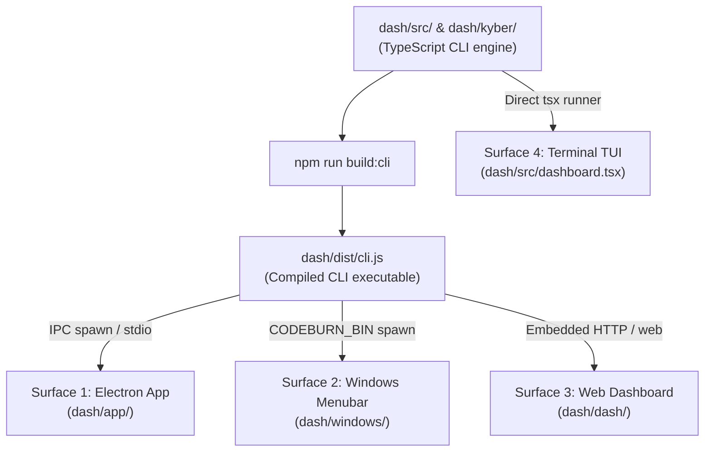

# KyberDash runbook — Local development, execution, and testing

KyberDash provides multi-surface observability and context tuning for agentic coding workflows.
Vendored as a soft fork of [`getagentseal/codeburn`](https://github.com/getagentseal/codeburn)
under the `dash/` subtree, it delivers metrics, span analyses, and token breakdowns across
**four local execution surfaces**:

1. [Electron Desktop App (`dash/app/`)](#surface-1-electron-desktop-app-dashapp) — Full-featured native window fed by CLI child processes.
2. [Windows Menubar Tray App (`dash/windows/`)](#surface-2-windows-menubar-tray-app-dashwindows) — System tray companion built with Tauri 2.x and Rust.
3. [Web Dashboard (`dash/dash/`)](#surface-3-web-dashboard-dashdash) — Standalone React browser interface served over HTTP.
4. [Terminal TUI Dashboard (`dash/src/dashboard.tsx`)](#surface-4-terminal-tui-dashboard-dashsrcdashboardtsx) — High-density interactive terminal interface built with Ink.

This runbook covers the local prerequisites, build workflows, dev runners, CLI operations, and test suites
for each surface.

---

## Installing the released binary

Everything below builds KyberDash from this repository, which is what contributors want. To
*run* a released KyberDash instead, take the `kyberdash` single-executable from the standard
install path — it needs no Node toolchain and no checkout:

```bash
curl -fsSL https://raw.githubusercontent.com/dpalfery/kyber-weave/main/scripts/install.sh \
  | sh -s -- --prerelease
```

`--prerelease` is required until 0.1.7 is promoted to stable: `kyberdash-<rid>` assets first
appear in 0.1.7-rc.9, and the installer skips KyberDash on any release below that floor. See
[Installing Kyber-Weave](../install.md#kyberdash-and-the-version-floor) for the flags, the
Node SEA RID names, and how `kyber-weave update` treats an installed `kyberdash`.

The released binary is the CLI engine — `kyberdash web`, `kyberdash kyber otel`, and the TUI.
The Electron and Tauri surfaces are not packaged by it and are still built from source below.

---

## Architectural overview & execution model

All four surfaces consume telemetry and analyses generated by the KyberDash core CLI engine.
Before launching desktop or browser wrappers, understand the dependency flow:



- **CLI Distribution (`dash/dist/cli.js`)**: The Electron app, Tauri tray app, and HTTP web server
  interact with KyberDash by executing the compiled CLI binary. Building this file is a mandatory
  prerequisite for surfaces 1, 2, and 3.
- **Merge Zone Isolation (`dash/kyber/`)**: Custom Kyber-Weave telemetry analyzers and OTLP receivers
  reside in the merge zone, keeping upstream code cleanly separated.

---

## Telemetry Ingest, Canonical Store, and CLI Operations

KyberDash maintains all normalized data in SQLite at `~/.kyberdash/canon.db` ([ADR 0008](../adr/0008-kyberdash-single-canonical-store.md)).
`KYBER_CANON_DB` overrides the store path. Older database schemas migrate in place on open.

### 1. Starting the OTLP Ingest Receiver

The web dashboard does not start the collector automatically. Ingest is a separate command
that listens for OTLP over HTTP on `127.0.0.1:4318` at `POST /v1/traces` and `POST /v1/logs`,
then persists to `canon.db`. Logs enrich their correlated span-shaped record ([ADR 0009](../adr/0009-multi-signal-ingestion-span-shaped-record.md)):

```bash
# Start receiver via the kyber command group
node dash/dist/cli.js kyber otel --port 4318 --host 127.0.0.1

# Backward-compatible alias
node dash/dist/cli.js otel --port 4318
```

### 2. Derived Projection Rebuilding (`kyber build`)

The `session`, `run`, `execution`, and `finding` tables are derived projections over raw canonical
records. If detector algorithms change or migrations are applied, rebuild projections without re-ingesting:

```bash
node dash/dist/cli.js kyber build --db ~/.kyberdash/canon.db
```

This rebuilds:
- Derived sessions from canonical records.
- First-class `run` tasks and `execution` parent/child delegation trees ([ADR 0012](../adr/0012-progressive-disclosure-6-level-diagnostic-spine.md)).
- Finding materializations stamped with `detector_version` ([ADR 0013](../adr/0013-telemetry-grounded-finding-contracts-and-waste-ranking.md)).

### 3. Raw Content Backfill and Re-normalization

```bash
# Re-derive canonical content parts from raw stored payloads
node dash/dist/cli.js kyber backfill

# Re-evaluate harness attribution voting and token conventions
node dash/dist/cli.js kyber renormalize
```

### 4. Content Retention Policy and Purging (`kyber purge-content`)

Retaining unclipped plaintext of every prompt, tool parameter, and file snippet creates a
standing privacy and storage liability ([ADR 0014](../adr/0014-unclipped-turn-inspection-and-copy-out-protocol.md)):

- **Default 14-day rolling retention**: Full plaintext content blocks in `parts_json` are retained
  for 14 days by default to support the Context Inspector.
- **Explicit Content Purge**: To purge unclipped plaintext content immediately while preserving
  token metrics, span timings, and diagnostic findings:
  ```bash
  node dash/dist/cli.js kyber purge-content --older-than 14d
  node dash/dist/cli.js kyber purge-content --all
  ```

### 5. LLM Review Provider Configuration & Privacy Guardrails

The Context Review Seam ([ADR 0015](../adr/0015-opt-in-llm-context-review-seam.md)) allows developers
to request subjective analysis of prompt quality from an LLM.

- **Strictly Opt-In**: Telemetry never leaves localhost without an intentional click in the UI.
- **Provider Environment Variables**:
  - *Anthropic*: Set `ANTHROPIC_API_KEY` (and optional `ANTHROPIC_MODEL`, default `claude-3-5-sonnet-20241022`).
  - *OpenAI-compatible*: Set `OPENAI_API_KEY` (and optional `OPENAI_BASE_URL` or `OPENAI_MODEL`).
  - *Local Ollama / vLLM*: Set `OPENAI_BASE_URL=http://localhost:11434/v1` and `OPENAI_API_KEY=ollama`.
  - *Unconfigured*: If no provider is configured, KyberDash activates `NullProvider` and the UI explains how to configure one without erroring.
- **Credential Handling**: API keys are read directly from process environment variables and are never stored in `canon.db` or written to log files.

---

## Surface 1: Electron Desktop App (`dash/app/`)

The Electron desktop application provides a dedicated desktop window with animated charts,
detailed session inspections, model comparisons, and real-time refresh.

### Prerequisites

- **Node.js**: `>= 22.13.0`
- **npm**: `>= 10.0.0`

### Step-by-Step Setup and Execution

1. **Build the CLI executable** (mandatory prerequisite):
   ```bash
   npm --prefix dash run build:cli
   ```
   This compiles `dash/src/cli.ts` into executable `dash/dist/cli.js` and sets executable permissions.

2. **Install desktop dependencies** (first run only):
   ```bash
   npm --prefix dash/app install
   ```

3. **Launch the development runner**:
   ```bash
   npm --prefix dash/app run dev
   ```
   Under the hood, this script executes:
   - TypeScript compilation of the Electron main process via `tsc -p tsconfig.electron.json`.
   - Concurrently boots the Vite renderer dev server on `tcp:127.0.0.1:5173`.
   - Waits for the Vite port with `wait-on tcp:127.0.0.1:5173`.
   - Spawns Electron pointing to `VITE_DEV_SERVER_URL=http://127.0.0.1:5173`.

### Running Unit Tests

Execute the Vitest suite configured with `jsdom`:

```bash
npm --prefix dash/app run test
```

### Browser-based UI Testing via Demo Bridge

To test or record UI flows in a standard browser tab without launching Electron:

1. Start the demo bridge:
   ```bash
   node dash/app/demo-bridge.mjs
   ```
2. The bridge launches:
   - A resident `node dist/cli.js serve --stdio` process for instant query responses.
   - An HTTP mock server on `http://127.0.0.1:4900` handling Electron IPC bridge requests.
3. In a separate shell, run Vite in `dash/app/`:
   ```bash
   npm --prefix dash/app run dev
   ```
   Open your browser to `http://127.0.0.1:5173` to test the renderer directly.

---

## Surface 2: Windows Menubar Tray App (`dash/windows/`)

The Windows tray application sits in the taskbar notification area, displaying instant spend
summaries, cache efficiency, and quick navigation popovers.

### Prerequisites

- **Rust Toolchain**: `>= 1.80` (stable `cargo`, `rustc`)
- **Tauri 2.x CLI**: `@tauri-apps/cli` (installed via `npm --prefix dash/windows install`)
- **Node.js**: `>= 22.13.0`
- **Platform Dependencies**:
  - *Windows*: Visual Studio C++ Build Tools or Windows SDK.
  - *Linux (experimental)*: `libgtk-3-dev`, `libwebkit2gtk-4.1-dev`, `libappindicator3-dev`.

### Step-by-Step Setup and Execution

1. **Build the CLI executable**:
   ```bash
   npm --prefix dash run build:cli
   ```

2. **Set the Local CLI Binding (`CODEBURN_BIN`)**:
   By default, the tray application searches the system `PATH` for `codeburn` (or `kyber-weave`).
   For local development against unreleased builds, bind `CODEBURN_BIN` directly to the compiled CLI:

   - **macOS / Linux**:
     ```bash
     export CODEBURN_BIN="node $(pwd)/dash/dist/cli.js"
     ```
   - **Windows (PowerShell)**:
     ```powershell
     $env:CODEBURN_BIN="node $PWD\dash\dist\cli.js"
     ```

   *Security note*: As implemented in `dash/windows/src-tauri/src/cli.rs` (`CodeburnCli::resolve()`),
   the path is validated via `is_safe_arg()` against shell metacharacters and enforces strict
   execution timeouts (60s fetch ceiling, 20s version check, 20 MB max payload).

3. **Launch the Tauri dev runner**:
   ```bash
   npm --prefix dash/windows run tauri dev
   ```
   This compiles the Rust backend in `src-tauri`, launches the Vite dev server for the tray popover UI,
   and creates the native tray icon.

### Running Unit Tests

Run the Rust unit tests verifying path sanitization, version parsing, and minimum version gating (`MIN_CLI_VERSION = (0, 9, 9)`):

```bash
cargo test --manifest-path dash/windows/src-tauri/Cargo.toml
```

---

## Surface 3: Web Dashboard (`dash/dash/`)

The standalone React web dashboard runs in any modern browser, rendering interactive charts
and telemetry summaries directly from the local HTTP server.

### Prerequisites

- **Node.js**: `>= 22.0.0`
- **npm**: `>= 10.0.0`

### Step-by-Step Setup and Execution

#### Option A: Vite Development Runner (Hot Module Replacement)

For rapid frontend styling and component development:

1. Install web dashboard dependencies:
   ```bash
   npm --prefix dash/dash install
   ```
2. Launch Vite dev server:
   ```bash
   npm --prefix dash/dash run dev
   ```
3. Open `http://127.0.0.1:5173` in your browser.

#### Option B: Standalone CLI Web Server

To run the complete production bundle served directly by the KyberDash CLI engine:

1. Build the web dashboard bundle:
   ```bash
   npm --prefix dash run build:dash
   ```
2. Build the CLI binary:
   ```bash
   npm --prefix dash run build:cli
   ```
3. Start the web server via the CLI:
   ```bash
   node dash/dist/cli.js web --port 3000 --period week
   ```
   *(Or run `codeburn web` if linked in your PATH).*

   **Supported CLI Options & Environment Variables**:
   - `--port <number>`: Target HTTP port (default: `4747`, falling back to a free port if taken).
   - `--period <today|week|month|all>`: Pre-filter metrics and cost aggregations.
   - `KYBER_CANON_DB`: Path to the canonical store (default: `~/.kyberdash/canon.db`).

#### Navigating the 5 Web Dashboard Views

The web dashboard provides five top-level tabs:
- **`[Usage]`**: Device spend overview, multi-provider cost rollups, top projects, and daily spend timelines.
- **`[Context]`**: One canonical session explorer for every harness. Expanding a session loads the **Agent Session Analysis Dashboard** (`AgentSessionDashboard`) from `canon.db`:
  - *Overview Strip*: Spans, turns, total tokens, cache hit ratio, cost USD/credits, exact reconciliation status, and subagent links.
  - *Per-Turn Spend Chart (`SessionSpendCharts`)*: Stacked token breakdown per turn (fresh input, cache read, cache creation, output).
  - *Context Composition Heatmap & Chart*: Semantic token distribution by part type (`system_prompt`, `instruction_context`, `tool_definitions`, `conversation_history`, `tool_result_content`, `residual`).
  - *Tool & Schema Cost Table*: Ranked tool schema sizes, resident turns, invocations, and unused schema waste range.
  - *Execution Timeline / Call Tree*: Hierarchical span call tree with duration, status badges, and auxiliary flags.
  - *Inspector Drawer (`SessionInspectorDrawer`)*: Slide-out drawer with XML tag folding (`<instructions>`, `<environment_info>`, `<context>`) and formatted tool call/result trees.
- **`[Compare]`**: Cross-harness comparison matrix across all active agents.
- **`[Quarantine]`**: Quarantined spans holding unrecognized namespaces or malformed attributes for triage.
- **`[Problems]`**: Recorded token reconciliation mismatches, validation anomalies, and parser errors.

#### Querying REST Endpoints Directly

You can inspect the backend JSON endpoints directly via curl or any HTTP client:
```bash
# Harness rollups with 6-dimension availability
curl -s http://127.0.0.1:3000/api/kyber/harnesses | jq .

# List runs and inspect specific run with execution tree
curl -s http://127.0.0.1:3000/api/kyber/runs | jq .
curl -s http://127.0.0.1:3000/api/kyber/run/run-copilot-001 | jq .

# List available sessions and inspect a specific session
curl -s http://127.0.0.1:3000/api/kyber/sessions | jq .
curl -s http://127.0.0.1:3000/api/kyber/session/sess-copilot-001 | jq .

# Inspect unclipped assembled turn context (Task G1 / Decision D14)
curl -s "http://127.0.0.1:3000/api/kyber/session/sess-copilot-001/turn/0/content" | jq .

# Query ranked telemetry findings (Task F3 / Decision D5 / D6)
curl -s http://127.0.0.1:3000/api/kyber/findings | jq .
curl -s http://127.0.0.1:3000/api/kyber/finding/find-001 | jq .

# Query calibration curve and prediction scoring (Task F4 / Decision D11)
curl -s http://127.0.0.1:3000/api/kyber/calibration | jq .

# Check review provider configuration status (Task G5 / Decision D10)
curl -s http://127.0.0.1:3000/api/kyber/review/status | jq .

# Cross-harness comparison matrix
curl -s http://127.0.0.1:3000/api/kyber/compare | jq .

# Quarantine entries and problems
curl -s http://127.0.0.1:3000/api/kyber/quarantine | jq .
curl -s http://127.0.0.1:3000/api/kyber/problems | jq .

# Telemetry metadata and rate definitions
curl -s http://127.0.0.1:3000/api/kyber/meta | jq .
```

### Running Unit & Contract Tests

Execute the backend contract and web dashboard test suites:

```bash
# Comprehensive /api/kyber/* backend contract tests
npx --prefix dash vitest run tests/kyber-api.test.ts

# Web server bootstrap injection and error handling tests
npx --prefix dash vitest run tests/web-dashboard.test.ts

# SQLite query bridge tests
npx --prefix dash vitest run tests/kyber-bridge.test.ts

# Frontend component & navigation tests
npx --prefix dash vitest run dash/src/App.test.tsx dash/src/components/AgentSessionDashboard.test.tsx
```

These suites validate:
- Hermetic SQLite in-memory bridge querying and cross-harness aggregation.
- Standard HTTP 200 responses with `content-type: application/json; charset=utf-8` and `cache-control: no-store`.
- Edge cases: 400 on missing session IDs, 404 on nonexistent sessions/routes, 405 on non-GET methods.
- Safe bootstrap injection (`injectDashboardBootstrap`) preventing XSS attacks when embedding session data.
- Payload script-tag escaping (`\u003c/script>`).
- Resilient error handling (returns HTTP 400 on invalid query params without crashing the long-running server process).

### Optional Cursor hook collection

`codeburn kyber cursor-hook` reads Cursor hook JSONL on standard input and posts one
deterministic OTLP trace per completed turn to the local receiver. It preserves
hook-supplied token counters and tool order; prompt and tool-schema data a hook does not
supply remains explicitly not measurable.

This command is implemented and synthetically verified, but it is not active until the
owner registers it in their Cursor hook configuration and runs a turn. Do not replace or
edit existing hooks as part of this setup.

---

## Surface 4: Terminal TUI Dashboard (`dash/src/dashboard.tsx`)

The interactive Terminal User Interface (TUI) runs directly inside any ANSI/24-bit color terminal emulator,
powered by [Ink](https://github.com/vadimdemedes/ink) (React in the terminal).

### Prerequisites

- **Node.js**: `>= 22.0.0`
- **Terminal Emulator**: Supports 24-bit TrueColor and ANSI escapes (e.g. iTerm2, Kitty, Ghostty, Alacritty, Windows Terminal).

### Step-by-Step Setup and Execution

1. **Launch the interactive TUI runner**:
   ```bash
   npm --prefix dash run dev
   ```
   This executes `NODE_OPTIONS=--no-deprecation tsx src/cli.ts`, reading local session stores and
   rendering the interactive dashboard.

2. **Navigation & Controls**:
   - `Left` / `Right` arrows or `h` / `l`: Switch active views (Daily Activity, Spend, Models, Projects).
   - `Up` / `Down` arrows or `k` / `j`: Scroll through session lists and daily summaries.
   - `q` or `Ctrl+C`: Exit the dashboard.

### Running Unit Tests

Run the dashboard TUI Vitest suite:

```bash
npm --prefix dash run test tests/dashboard.test.ts
```

This suite verifies:
- Responsive terminal layout breakpoints:
  - `<= 89 columns`: 1 single column.
  - `90 – 134 columns`: 2 columns.
  - `>= 135 columns`: 3 equal-width columns.
  - Maximum width clamping at 256 columns.
- Project path shortening and label truncation.
- Scroll pagination and cursor stability across screen redraws.

---

## Common Troubleshooting & Environment Validation

### 1. `Cannot find module 'dist/cli.js'`
- **Symptom**: Spawning Electron (`npm --prefix dash/app run dev`) or running the demo bridge fails with an error indicating `dist/cli.js` is missing.
- **Fix**: Run `npm --prefix dash run build:cli` in the root `dash` directory prior to launching desktop clients.

### 2. Port Collisions (`5173`, `4900`, `4318`)
- **Port 5173**: Used by default for Vite development servers. If occupied, pass `--port <number>` to Vite or kill the stale process.
- **Port 4900**: Used by `dash/app/demo-bridge.mjs`. Ensure previous demo sessions have terminated (`lsof -i :4900`).
- **Port 4318**: Standard OTLP HTTP receiver port. Ensure no conflicting OpenTelemetry collectors or Aspire instances hold this port exclusively.

### 3. Tauri / Rust Build Errors on Windows or macOS
- **Symptom**: `cargo build` fails when compiling `@tauri-apps/cli`.
- **Fix**: Verify your Rust toolchain is up to date:
  ```bash
  rustup update stable
  rustc --version # Must be >= 1.80.0
  ```
- On macOS, ensure Xcode command line tools are installed: `xcode-select --install`.

### 4. TUI Layout Distortion or Visual Artifacts
- **Symptom**: Panel borders wrap or text misaligns in terminal view.
- **Fix**: Check terminal window width (`tput cols`). Ensure the terminal window is at least 90 columns wide for dual-column view or widen past 135 columns for three-column view.

---

## Related Documentation

- [KyberDash Architecture](architecture.md) — Telemetry ingest pipeline, canonical store, and merge zone boundaries.
- [KyberDash Overview](README.md) — Product vision, motivation, and capabilities.
- [Feature Local Run and Test Standard](../rules/feature-runbooks.md) — Standards governing local execution runbooks across all features.
- [Component Catalog](../catalog.md) — Canonical inventory of components and owners.
