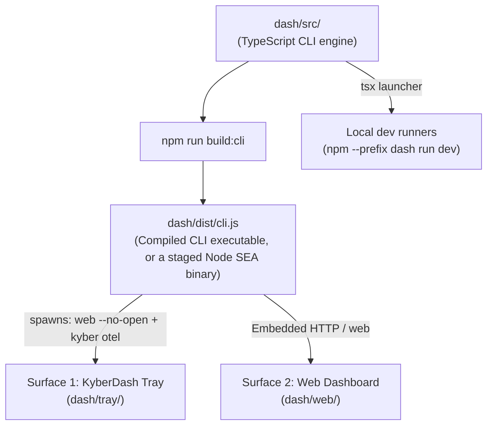

# KyberDash runbook — Local development, execution, and testing

KyberDash provides multi-surface observability and context tuning for agentic coding workflows.
First-party code under `dash/` since a one-time fork of CodeBurn
([ADR 0020](../adr/0020-kyberdash-one-time-fork.md)), it runs as **three local surfaces** today:

1. [KyberDash Tray (`dash/tray/`)](#6-the-kyberdash-tray-dashtray) — the macOS and Windows tray: a Tauri 2 shell whose popover renders the context report and which owns the refresh cadence and the optional OTLP receiver.
2. [Web Dashboard (`dash/web/`)](#web-dashboard-dashweb) — Standalone React browser interface served by the CLI over HTTP.
3. [CLI engine (`dash/src/`)](#telemetry-ingest-canonical-store-and-cli-operations) — `kyberdash report`, `web`, `dash refresh`, `kyber otel`, and the store operations documented below.

This runbook covers the local prerequisites, build workflows, dev runners, CLI operations, and test suites
for each surface.

---

## Installing the released binary

Everything below builds KyberDash from this repository, which is what contributors want. To
*run* a released KyberDash instead, take the `kyberdash` single-executable from the standard
install path — it needs no Node toolchain and no checkout:

```bash
curl -fsSL https://raw.githubusercontent.com/dpalfery/kyber-weave/main/scripts/install.sh \
  | sh -s -- --prerelease
```

`--prerelease` is required until 0.1.7 is promoted to stable: `kyberdash-<rid>` assets first
appear in 0.1.7-rc.9, and the installer skips KyberDash on any release below that floor. See
[Installing Kyber-Weave](../install.md#kyberdash-and-the-version-floor) for the flags, the
Node SEA RID names, and how `kyber-weave update` treats an installed `kyberdash`.

The released binary is the CLI engine — `kyberdash report`, `kyberdash web`, and
`kyberdash kyber otel`. The tray ships as its own release asset from `0.1.7-rc.13`:
`kyberdash menubar` installs it, after checking its SHA-256 and — on macOS — its code
signature, team id and Gatekeeper acceptance (`install.sh --with-menubar` does the same on
macOS). `kyber-weave update` updates an installed tray by delegating to
`kyberdash menubar --update`, which quits the running tray, replaces it and relaunches it,
restoring the previous app if any step fails. On Linux, `kyberdash menubar` exits 1: the tray
ships for macOS and Windows only.

---

## Architectural overview & execution model

All surfaces consume telemetry and analyses generated by the KyberDash core CLI engine.
Before launching the tray or the browser dashboard, understand the dependency flow:



- **CLI Distribution (`dash/dist/cli.js`)**: The tray and the HTTP web server interact with
  KyberDash by executing the compiled CLI. Building this file is a mandatory prerequisite for
  running the tray from source; the deployed tray instead points `kyberdashPath` in
  `~/.kyberdash/tray.json` at a staged self-contained binary (see the tray section below).
- **One shared projection**: whichever entry fills the store — `dash refresh`, live OTLP
  ingest, or a manual `kyber build` — the derived data every surface reads is produced by the
  same `projectCanonicalStore()` projection over `buildSessions()`. There is no second
  derivation and no raw-record reporting path.
- **No upstream remote**: `dash/` no longer tracks CodeBurn. A clone made while it did
  may still carry the `codeburn` git remote; nothing uses it, so remove it with
  `git remote remove codeburn`.

---

## Telemetry Ingest, Canonical Store, and CLI Operations

KyberDash maintains all normalized data in SQLite at `~/.kyberdash/canon.db` ([ADR 0008](../adr/0008-kyberdash-single-canonical-store.md)).
`KYBER_CANON_DB` overrides the store path. Older database schemas migrate in place on open.

### 1. Starting the OTLP Ingest Receiver

The web dashboard does not start the collector automatically. Ingest is a separate command
that listens for OTLP over HTTP on `127.0.0.1:4318` at `POST /v1/traces` and `POST /v1/logs`,
then persists to `canon.db`. Logs enrich their correlated span-shaped record ([ADR 0009](../adr/0009-multi-signal-ingestion-span-shaped-record.md)):

```bash
# Start receiver via the kyber command group
node dash/dist/cli.js kyber otel --port 4318 --host 127.0.0.1

# Backward-compatible alias
node dash/dist/cli.js otel --port 4318
```

### 2. Derived Projection Rebuilding (`kyber build`)

The `session`, `run`, `execution`, and `finding` tables are derived projections over raw canonical
records. If detector algorithms change or migrations are applied, rebuild projections without re-ingesting:

```bash
node dash/dist/cli.js kyber build --db ~/.kyberdash/canon.db
```

This rebuilds:
- Derived sessions from canonical records.
- First-class `run` tasks and `execution` parent/child delegation trees ([ADR 0012](../adr/0012-progressive-disclosure-6-level-diagnostic-spine.md)).
- Finding materializations stamped with `detector_version` ([ADR 0013](../adr/0013-telemetry-grounded-finding-contracts-and-waste-ranking.md)).

`kyber build` calls `buildSessions` directly — the same derivation the shared projection
entry `projectCanonicalStore()` wraps — so a manual rebuild and an automatic projection
produce identical derived rows.

### 2a. Local harness-source refresh (`dash refresh`)

Fill or update `canon.db` from installed native session stores, then purge expired content
and rebuild derived tables:

```bash
node dash/dist/cli.js dash refresh
node dash/dist/cli.js dash refresh --history-weeks 2
node dash/dist/cli.js dash refresh --db /tmp/canon.db
```

`--db` selects the store (default `~/.kyberdash/canon.db`). `--history-weeks <n>` is a
positive integer; omission is **2**. There is no public `--provider` flag. Usage errors
exit **2** before the database is opened. Any failed harness job or derivation failure
exits **1**. Complete success, including sources that are not installed, exits **0**.

The command runs one job per harness-source descriptor ([ADR 0016](../adr/0016-kyberdash-harness-source-refresh.md)),
commits with `commitSourceUnit`, then runs `purgeExpiredContent` (14-day content window;
`records.raw` kept) and projects the store through `projectCanonicalStore` — the shared full
projection over `buildSessions` that the live OTLP receiver also drives. Output is a
per-harness table plus a derived summary; diagnostics for `failed`/`partial` rows go to
stderr without chat content or raw paths. Use a temporary `--db` when experimenting. There is
no dashboard refresh button.

### 3. Raw Content Backfill and Re-normalization

```bash
# Re-derive canonical content parts from raw stored payloads
node dash/dist/cli.js kyber backfill

# Re-evaluate harness attribution voting and token conventions
node dash/dist/cli.js kyber renormalize
```

### 4. Content Retention Policy

Retaining unclipped plaintext of every prompt, tool parameter, and file snippet creates a
standing privacy and storage liability ([ADR 0014](../adr/0014-unclipped-turn-inspection-and-copy-out-protocol.md),
[ADR 0018](../adr/0018-kyberdash-content-retention-purge.md)):

- **Default 14-day rolling retention**: Full plaintext in `content_json` / `parts_json` is
  retained for 14 days to support the Context Inspector.
- **Automatic purge on refresh**: `dash refresh` calls `purgeExpiredContent` after source
  jobs drain. Rows older than 14 days have content emptied in place (`'{}'` / NULL parts).
  Token metrics, timestamps, findings, and `records.raw` stay.
- There is no shipped `kyber purge-content` CLI. Re-run `dash refresh` to apply the window.

### 5. LLM Review Provider Configuration & Privacy Guardrails

The Context Review Seam ([ADR 0015](../adr/0015-opt-in-llm-context-review-seam.md)) allows developers
to request subjective analysis of prompt quality from an LLM.

- **Strictly Opt-In**: Telemetry never leaves localhost without an intentional click in the UI.
- **Provider Environment Variables**:
  - *Anthropic*: Set `ANTHROPIC_API_KEY` (and optional `ANTHROPIC_MODEL`, default `claude-3-5-sonnet-20241022`).
  - *OpenAI-compatible*: Set `OPENAI_API_KEY` (and optional `OPENAI_BASE_URL` or `OPENAI_MODEL`).
  - *Local Ollama / vLLM*: Set `OPENAI_BASE_URL=http://localhost:11434/v1` and `OPENAI_API_KEY=ollama`.
  - *Unconfigured*: If no provider is configured, KyberDash activates `NullProvider` and the UI explains how to configure one without erroring.
- **Credential Handling**: API keys are read directly from process environment variables and are never stored in `canon.db` or written to log files.

### 6. The KyberDash Tray (`dash/tray/`)

The tray is a Tauri 2 Rust shell plus a React popover UI. It resolves the `kyberdash` CLI,
spawns exactly one `web --no-open` child (default loopback port **4747**) and, when settings
allow, the OTLP receiver child (port **4318**), polls the report over loopback, and renders
it. The webview holds no network permission and no analysis logic of its own.

Local gates (after a one-time `npm --prefix dash/tray/ui ci`):

```bash
npm --prefix dash/tray/ui run typecheck
npm --prefix dash/tray/ui run test
cd dash/tray/src-tauri && cargo fmt --check && cargo clippy -- -D warnings && cargo test
```

`npm --prefix dash run lint` also covers the tray UI. To run the shell against a locally
built CLI, build `dash/dist/cli.js` first (`npm --prefix dash run build:cli`) and point
`KYBERDASH_BIN` at it.

Deployed shape (per-user, no administrator rights). On Windows the NSIS installer installs
for the current user and a `HKCU\Software\Microsoft\Windows\CurrentVersion\Run` value starts
the tray at login (`dash/tray/src-tauri/src/autostart.rs`). On macOS:

- The app lives at `~/Applications/KyberDash.app`; launchd owns it as the per-user agent
  `~/Library/LaunchAgents/io.github.dpalfery.kyberdash.plist` (label
  `io.github.dpalfery.kyberdash`) with `RunAtLoad=true` and crash-only
  `KeepAlive { SuccessfulExit = false }`: it starts at login, launchd restarts it after an
  abnormal exit, and an intentional **Quit** stays stopped.
- `~/.kyberdash/tray.json` names the CLI through `kyberdashPath`. The deployed CLI is a
  self-contained Node SEA binary staged at
  `~/Library/Application Support/io.github.dpalfery.kyberdash/local-bin/kyberdash`, so the
  launchd environment needs no `node`, Homebrew, checkout, or `KYBERDASH_BIN`.
- **Quit** through the tray stops it and both children; an abnormal tray exit produces a
  fresh launchd-started tray whose children rebind the same loopback ports.

Automatic reconciliation: `refresh_run` rows left in `running` after their refresh process dies or times out (older than 15 minutes) are automatically reconciled to `failure` with an audit summary before subsequent refreshes start — see
[the todo](../todo/stale-refresh-run-rows.md).

---

## Web Dashboard (`dash/web/`)

The standalone React web dashboard runs in any modern browser, rendering interactive charts
and telemetry summaries directly from the local HTTP server.

### Prerequisites

- **Node.js**: `>= 22.13.0`
- **npm**: `>= 10.0.0`

### Step-by-Step Setup and Execution

#### Option A: Vite Development Runner (Hot Module Replacement)

For rapid frontend styling and component development:

1. Install web dashboard dependencies:
   ```bash
   npm --prefix dash/web install
   ```
2. Launch Vite dev server:
   ```bash
   npm --prefix dash/web run dev
   ```
3. Open `http://127.0.0.1:5173` in your browser.

#### Option B: Standalone CLI Web Server

To run the complete production bundle served directly by the KyberDash CLI engine:

1. Build the web dashboard bundle:
   ```bash
   npm --prefix dash run build:dash
   ```
2. Build the CLI binary:
   ```bash
   npm --prefix dash run build:cli
   ```
3. Start the web server via the CLI:
   ```bash
   node dash/dist/cli.js web --port 3000 --period week
   ```

   **Supported CLI Options & Environment Variables**:
   - `--port <number>`: Target HTTP port (default: `4747`, falling back to a free port if taken).
   - `--period <today|week|month|all>`: Pre-filter metrics and cost aggregations.
   - `KYBER_CANON_DB`: Path to the canonical store (default: `~/.kyberdash/canon.db`).

#### Navigating the web dashboard

Every view has its own URL, so a view can be bookmarked, shared, or opened directly.
`dash/src/server/view-paths.json` lists them — `/`, `/harness/:harnessId`, `/run/:runId`,
`/session/:sessionId`, `/session/:sessionId/turn/:turnIndex`, `/finding/:findingId`,
`/compare?a=:runId&b=:runId`, `/quarantine`, `/problems` — and the web router
(`dash/web/src/lib/router.ts`), `kyberdash web --view`, and the tray's open actions all read
that one list. Browser back and forward restore the spine.

Header tabs (`nav-tabs`) are four: **Context Doctor**, **Usage**, **Quarantine**, **Problems**.
The sidebar is the diagnostic spine rail: **Context Doctor**, **Sessions**, **Compare**. Share
controls appear on Usage only.

- **Context Doctor**: Cross-harness landing (findings, scorecard matrix). Drill harness → run →
  execution → turn → context item.
- **Sessions**: Session explorer (`page-sessions`) wrapping the Agent Session Analysis
  Dashboard from `canon.db` — not a restored Context tab:
  - *Overview Strip*: Spans, turns, total tokens, cache hit ratio, cost USD/credits, exact reconciliation status, and subagent links.
  - *Per-Turn Spend Chart (`SessionSpendCharts`)*: Stacked token breakdown per turn (fresh input, cache read, cache creation, output).
  - *Context Composition Heatmap & Chart*: Semantic token distribution by part type (`system_prompt`, `instruction_context`, `tool_definitions`, `conversation_history`, `tool_result_content`, `residual`).
  - *Tool & Schema Cost Table*: Ranked tool schema sizes, resident turns, invocations, and unused schema waste range.
  - *Execution Timeline / Call Tree*: Hierarchical span call tree with duration, status badges, and auxiliary flags.
  - *Inspector Drawer (`SessionInspectorDrawer`)*: Slide-out drawer with XML tag folding (`<instructions>`, `<environment_info>`, `<context>`) and formatted tool call/result trees.
- **Compare** (rail): Phase-aligned run comparison (`page-compare`), not a fifth header tab.
- **Usage**: Device spend overview, multi-provider cost rollups, top projects, daily spend, Share.
- **Quarantine**: Quarantined spans holding unrecognized namespaces or malformed attributes.
- **Problems**: Recorded token reconciliation mismatches, validation anomalies, and parser errors.

#### Querying REST Endpoints Directly

You can inspect the backend JSON endpoints directly via curl or any HTTP client:
```bash
# Harness rollups with 6-dimension availability
curl -s http://127.0.0.1:3000/api/kyber/harnesses | jq .

# List runs and inspect specific run with execution tree
curl -s http://127.0.0.1:3000/api/kyber/runs | jq .
curl -s http://127.0.0.1:3000/api/kyber/run/run-copilot-001 | jq .

# List available sessions and inspect a specific session
curl -s http://127.0.0.1:3000/api/kyber/sessions | jq .
curl -s http://127.0.0.1:3000/api/kyber/session/sess-copilot-001 | jq .

# Inspect unclipped assembled turn context (Task G1 / Decision D14)
curl -s "http://127.0.0.1:3000/api/kyber/session/sess-copilot-001/turn/0/content" | jq .

# Query ranked telemetry findings (Task F3 / Decision D5 / D6)
curl -s http://127.0.0.1:3000/api/kyber/findings | jq .
curl -s http://127.0.0.1:3000/api/kyber/finding/find-001 | jq .

# Query calibration curve and prediction scoring (Task F4 / Decision D11)
curl -s http://127.0.0.1:3000/api/kyber/calibration | jq .

# Check review provider configuration status (Task G5 / Decision D10)
curl -s http://127.0.0.1:3000/api/kyber/review/status | jq .

# Cross-harness comparison matrix
curl -s http://127.0.0.1:3000/api/kyber/compare | jq .

# Quarantine entries and problems
curl -s http://127.0.0.1:3000/api/kyber/quarantine | jq .
curl -s http://127.0.0.1:3000/api/kyber/problems | jq .

# Telemetry metadata and rate definitions
curl -s http://127.0.0.1:3000/api/kyber/meta | jq .
```

### Running Unit & Contract Tests

The dash suites are co-located with the code they cover. The canonical gates are:

```bash
npm --prefix dash run typecheck
npm --prefix dash run lint
npm --prefix dash run test        # excludes the refresh-lock files; run test:locks for those
npm --prefix dash run test:locks  # refresh lock takeover/heartbeat behaviour, forked pool
npm --prefix dash run check:reachable
```

Focused runs use the same runner:

```bash
# /api/kyber/* backend contract tests
npm --prefix dash exec -- vitest run src/server/kyber-api.test.ts

# SQLite query bridge tests
npm --prefix dash exec -- vitest run src/server/kyber-bridge.test.ts

# CLI/REST report parity (Requirement 11.14)
npm --prefix dash exec -- vitest run src/cli/report-api-parity.test.ts

# Web dashboard component tests
npm --prefix dash exec -- vitest run web/src
```

These suites validate:
- Hermetic SQLite in-memory bridge querying and cross-harness aggregation.
- Standard HTTP 200 responses with `content-type: application/json; charset=utf-8` and `cache-control: no-store`.
- Edge cases: 400 on missing session IDs, 404 on nonexistent sessions/routes, 405 on non-GET methods.
- Resilient error handling (returns HTTP 400 on invalid query params without crashing the long-running server process).
- That the CLI report and the REST report are equal for the same store and scope.

### Optional Cursor hook collection

`kyberdash kyber cursor-hook` reads Cursor hook JSONL on standard input and posts one
deterministic OTLP trace per completed turn to the local receiver. It preserves
hook-supplied token counters and tool order; prompt and tool-schema data a hook does not
supply remains explicitly not measurable.

This command is implemented and synthetically verified, but it is not active until the
owner registers it in their Cursor hook configuration and runs a turn. Do not replace or
edit existing hooks as part of this setup.

---

## Common Troubleshooting & Environment Validation

### 1. `Cannot find module 'dist/cli.js'`
- **Symptom**: Running a surface before the CLI is built — the tray's child exits immediately, or the web server never starts.
- **Fix**: Run `npm --prefix dash run build:cli` in the `dash` directory prior to launching it.

### 2. Port Collisions (`5173`, `4747`, `4318`)
- **Port 5173**: Used by default for the web dashboard's Vite development server. If occupied, pass `--port <number>` to Vite or kill the stale process.
- **Port 4747**: The `kyberdash web` server and the tray's supervised child. Ensure no stale server holds it (`lsof -i :4747`).
- **Port 4318**: Standard OTLP HTTP receiver port. Ensure no conflicting OpenTelemetry collectors or Aspire instances hold this port exclusively.

### 3. Tauri / Rust Build Errors on Windows or macOS
- **Symptom**: `cargo build` fails when compiling `@tauri-apps/cli`.
- **Fix**: Verify your Rust toolchain is up to date:
  ```bash
  rustup update stable
  rustc --version # Must be >= 1.80.0
  ```
- On macOS, ensure Xcode command line tools are installed: `xcode-select --install`.

### 4. Stale Refresh Runs and Dead PID Reconciliation
- **Symptom**: Report footer displays `inProgress: pid X since <timestamp>` indefinitely or a refresh fails to acquire lock.
- **Remediation**: KyberDash automatically reconciles runs whose PID is dead or whose elapsed duration exceeds 15 minutes before starting each refresh. To inspect runs directly:
  ```bash
  sqlite3 ~/.kyberdash/canon.db "SELECT id, status, pid, started_at, completed_at, summary FROM refresh_run ORDER BY started_at DESC LIMIT 5;"
  ```

### 5. Store Schema Migration and Problem Deduplication
- **Details**: Schema v13 enforces stable `problem_key` uniqueness on `problems`, collapsing historical duplicates idempotently on database open.
- **Backup**: Always verify and retain pre-migration backups (e.g. `~/.kyberdash/canon.db.backup-*`).

---

## Related Documentation

- [KyberDash Architecture](architecture.md) — Telemetry ingest pipeline, canonical store, analyses, and surfaces.
- [KyberDash Overview](README.md) — Product vision, motivation, and capabilities.
- [Feature Local Run and Test Standard](../rules/feature-runbooks.md) — Standards governing local execution runbooks across all features.
- [Component Catalog](../catalog.md) — Canonical inventory of components and owners.
