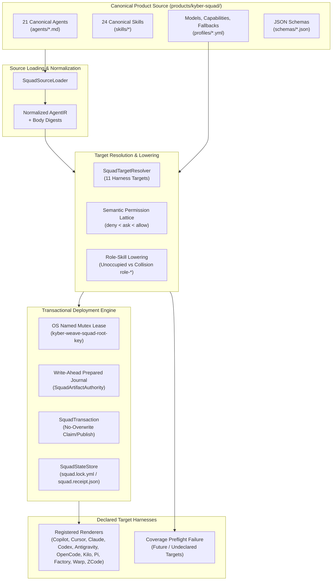
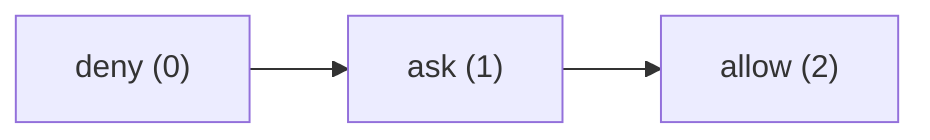
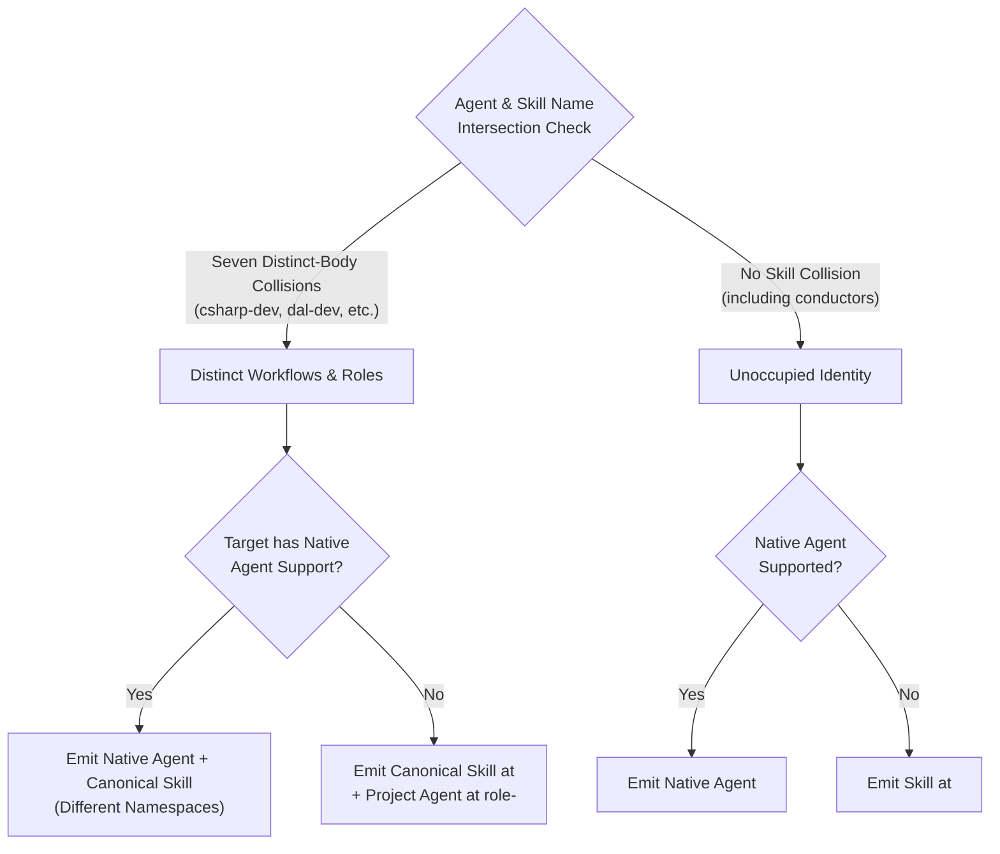
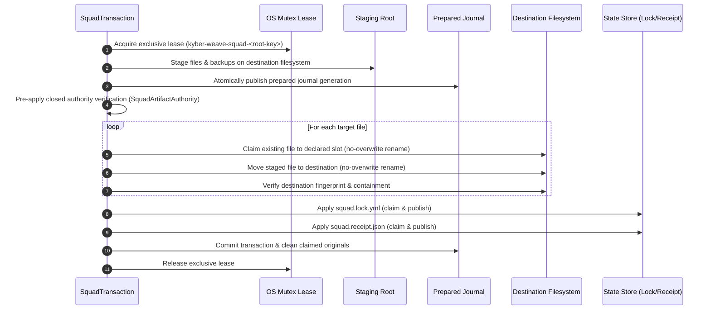

# Kyber-Squad architecture

Kyber-Squad is the multi-harness governance and deployment engine within Kyber-Weave.
It normalizes canonical agent and skill definitions into an intermediate representation (**AgentIR**),
evaluates capability and permission lattices, applies deterministic role-skill lowering, and executes
atomic, recoverable deployments. Its catalog declares eleven target coding harnesses; all eleven have
implemented and registered renderers today.

---

## High-Level Architecture

---

## 1. AgentIR Normalization and Canonical Sources

Kyber-Squad treats agent and skill definitions as strictly typed, immutable source models:

- **Canonical Agent Definitions**: Authored in `products/kyber-squad/agents/<name>.md` with closed YAML frontmatter and LF-normalized UTF-8 bodies.
- **Normalization Pipeline**: `SquadSourceLoader` parses frontmatter against `schemas/agent.schema.json`, validates capability bindings, computes an immutable SHA-256 instruction digest over the normalized body, and emits a structured `AgentIR` model.
- **Strict Invariants**: Loaders reject undeclared profiles, missing capabilities, invalid invocation modes, path traversal attempts, or unrecognized frontmatter keys.
- **Canonical Skills and Resources**: `SquadSourceLoader` loads the 24 top-level `SKILL.md`
  identities. The canonical tree separately retains 64 supplemental files, giving 88 recursive
  skill-tree files; `SquadPacker` carries that complete recursive tree into both package formats.

---

## 2. Semantic Permission Lattice

Permissions are governed by a formal three-state lattice:

### Lattice Evaluation Rules

1. **Ordering**: `deny < ask < allow`.
2. **Safety Narrowing**: If a target harness does not support interactive prompts (`ask`), the permission safely narrows to `deny`.
3. **Non-Broadening Guarantee**: If a harness cannot enforce `ask` or `deny` constraints for a specific capability, the entire agent or skill representation is **omitted** rather than broadened to `allow`.
4. **Structured Degradation**: Every narrowing or omission is recorded in the deployment receipt as an explicit degradation record.

---

## 3. Role-Skill Lowering and Namespace Resolution

Targets without native agent primitives use **agent-to-role-skill lowering**, governed by
`profiles/fallbacks.yml`. Warp is the sole remaining fallback target with an implemented renderer for
this projection; Antigravity was previously classified as fallback and has been reclassified to native
([ADR 0022](../adr/0022-antigravity-native-agents.md)).

The current canonical agent and skill namespaces intersect at exactly seven names. Every
intersection is a distinct-body collision; the product declares no shared identities:

### Resolution Rules

1. **Distinct-Body Collisions (`csharp-dev`, `dal-dev`, `github-devops`, `maui-dev`, `product-owner`, `python-dev`, `test-dev`)**:
   - The canonical skill and agent serve distinct functions.
   - On fallback targets, the canonical skill stays at `<name>`, and the agent instruction body is projected to `role-<name>`.
   - `role-` is reserved exclusively for generated projections; no canonical source file may use the `role-` prefix.
2. **Unoccupied Identities**:
   - Agents with no matching skill name lower directly to `<name>` as a skill on fallback targets.
   - `conductor` follows this rule because it has no canonical skill. The fallback profile's
     `shared-identities` list is empty, and the canonical catalog carries no version aliases.

### Native Branch: Pi with Primary-Agent Lowering

Pi is a native agent target ([ADR 0019](../adr/0019-pi-native-subagents-and-primary-lowering.md))
that projects subagents natively but lowers its one primary-invocation
agent (`conductor`) to a skill, per its fallback profile's `no-primary-agent: skill` value. Pi
core has no primary-agent primitive: `.pi/SYSTEM.md` or `--system-prompt` replaces the whole
session prompt. Rendering `conductor` as a subagent instead would place it at depth 1, pushing its
delegated specialists to depth 2 — where Pi's default `maxSubagentDepth: 2` removes the nested
delegation that `architect` and `code-reviewer` need. Lowering it to a top-level skill keeps it at
depth 0, where the extension's `Agent` tool is available, and its specialists' nested rosters
still work.

### Native Branch: Claude with a Primary-Agent Entry-Point Skill

Claude is a native agent target that projects subagents natively to `.claude/agents/<name>.md` and
has a real primary-agent primitive only through `claude --agent <name>` or the `agent` setting —
the only modes where Claude Code enforces the agent's `tools` allow-list, `Agent(roster)` roster,
and model. A primary-invocation agent rendered as a subagent would run nested, where the roster
is ignored and the Agent tool may be unavailable (spawn depth 1 in cloud sessions).

When a primary agent's fallback profile declares `no-primary-agent: skill`, Claude renders **both**
the subagent at `.claude/agents/<name>.md` (kept for enforced invocation) **and** an entry-point
skill at `.claude/skills/<name>/SKILL.md`, invoked as `/<name>` in the main conversation. The skill
is byte-identical to the subagent body and carries exactly three frontmatter keys: `name`,
`description` (collapsed to one line), and `license: MIT`. Its resources project beside it as with
other skills.

The skill's description stays in Claude's context, so Claude may auto-load `/<name>` into the main
conversation without the user typing it. The degradation records account for this unenforced
entry point: its details state that the session's tools, permission mode, MCP servers and model
apply to the skill, and that `claude --agent <name>` is the enforced alternative. The subagent
file is kept unchanged, and resources project to both principals.

Claude is the first native target where a single agent emits two distinct principals (subagent and
entry-point skill). Under `no-primary-agent: omit`, no entry-point skill is emitted and the agent's
records remain unchanged.

**Fail-closed on canonical skill collision.** If a canonical skill occupies the entry-point
identity, the render fails with a `SquadRenderValidationException` rather than resolving the
collision through role-prefixing. This is a design choice specific to Claude: the subagent and
skill resolve to different values in Claude's own scope-precedence rules (skills: personal over
project; agents: project over user), so collision is theoretically possible and is treated as
exceptional.

**Rejected alternatives:**
- Legacy `.claude/commands/conductor.md` command: Claude Code registers files under
  `.claude/commands/<subdir>/` as `<subdir>:<name>` commands, so resources would become phantom
  commands, requiring ZCode-style relocation and link rewriting ([ADR 0021](../adr/0021-zcode-command-lowering-and-resource-relocation.md)).
  A skill directory takes supporting files natively, and a skill wins over a same-named command.
- Skill with `context: fork` and `agent: conductor`: runs an isolated subagent that does not see
  conversation history, runs in the background by default, and recreates the nested-subagent
  failure (no Agent tool at depth 1).
- Setting `"agent": "conductor"` in `.claude/settings.json`: makes every session a conductor
  session, but Squad does not own settings files.
- Replacing the subagent with the skill: drops the only enforced form (`claude --agent conductor`)
  and breaks existing `@agent-conductor` use.
- Unconditional renderer rule for every primary agent: Claude would become the only target that
  ignores the declared `no-primary-agent` value, with no off switch in source.
- A new dedicated profile key: it is a schema change when the existing key already declares the
  intent.
- Emitting `model`, `allowed-tools` or `disallowed-tools` on the skill: all three last only for
  the invoking turn and cannot hold the orchestration profile.
- Hook-based enforcement from the skill: skill hooks stay registered for the rest of the session,
  which outlives the conductor's use.

---

## 4. State, Identity, and Locking Model

Squad deployments maintain rigorous state and concurrency boundaries:

### Physical Root Identity and Path Semantics

- **Canonical Physical Roots**: Paths are resolved through all symbolic links and reparse points to their physical disk location using `SquadPhysicalRootIdentity.Resolve`.
- **Root Hash Key**: The lowercase SHA-256 hash of the canonical physical path forms `<root-key>`. Lexical or symlink aliases of the same physical root converge onto the same state root and lease.
- **Filesystem Path Semantics**: `SquadFileSystemPathSemantics` enforces case-exact matching against disk segments, preventing accidental case-folding on case-insensitive filesystems while respecting case-distinct directories on case-sensitive filesystems.

### Cross-Process Mutex Lease

- **Named OS Mutex**: Every mutating operation acquires an exclusive OS-named mutex (`kyber-weave-squad-<root-key>`).
- **Scope-Independent Contention**: Project-scoped and global-scoped operations targeting the same physical root contend for the exact same mutex, preventing concurrent corruption.
- **Precondition Reverification**: After acquiring the lease, all preconditions and path containment assertions are re-evaluated immediately before filesystem operations.

### Lock and Receipt Files

- **`squad.lock.yml`**: Contains bundle metadata, versions, target lists, exclusions, translation mode, and bundle digests. Also carries a vestigial upstream-toolchain identity field, kept for schema stability now that rendering no longer depends on an external toolchain; it reads `unverified` on every install.
- **`squad.receipt.json`**: Records scope, installation timestamp, structured degradation records, and an ordered manifest of owned files with relative paths and SHA-256 digests.

---

## 5. Write-Ahead Journal and Transaction Engine

Deployments use an atomic, write-ahead, compare-and-restore transaction engine (`SquadTransaction`):

### Claim and Publish Protocol

1. **No Destructive Overwrites**: Files are never updated with in-place overwrites or unrecorded deletions.
2. **Deterministic Claiming**: Pre-existing target files are atomically moved into unique, manifest-declared backup slots using same-filesystem no-overwrite renames.
3. **Atomic Publication**: Staged artifacts are reverified immediately before being moved into their destination paths.
4. **State Written Last**: Lock and receipt files are published only after all target files have been successfully applied and verified.

---

## 6. Idempotent Recovery and Conflict Preservation

When an interrupted deployment or crash occurs, `SquadTransaction.Recover` restores system consistency:

- **Dual Fingerprint Resolution**: Recovery inspects both the destination path and the claimed backup slot to determine whether a transition completed, failed, or was interrupted mid-flight.
- **External Modification Preservation**: If an external process or operator modified a file during or after the transaction, recovery leaves the modified file intact, preserves the journal and backup evidence, and emits actionable repair guidance.
- **Clean Reversibility**: Uncontended rollbacks restore the pre-transaction state, clean up empty directories created by the transaction, and restore application-data topologies.

---

## 7. Transaction Observers

Squad exposes two observer interfaces for lifecycle monitoring and deterministic test verification:

1. **`ISquadTransactionObserver` (Public Lifecycle Contract)**:
   Receives exactly 6 ordered events:
   - `IntentWritten`
   - `FileStaged`
   - `FileBackedUp`
   - `FileApplied`
   - `LockApplied`
   - `ReceiptApplied`
2. **`ISquadTransactionCheckpointObserver` (Internal Diagnostic Extension)**:
   Opt-in observer used for fine-grained crash simulation across checkpoint states:
   - `Prepared`
   - `ActiveTransitionWritten`
   - `OriginalClaimed`
   - `AfterImagePublished`

---

## 8. Rendering

Lowering AgentIR into a harness's native files is native Kyber-Weave code, not a call to an
external toolchain. `SquadLifecycleService` renders through `ISquadRenderer`, resolved by
`SquadCommandComposition` to a `SquadRendererRegistry` — the composite that gates, dispatches,
and validates.

- **Coverage gate first**: before the release is even downloaded, the registry checks every
  requested target against `ISquadRenderer.SupportedTargets`. Any target with no registered
  renderer fails the whole request — install and update are all-or-nothing across the
  requested target set, never a partial render of the targets that happen to be covered.
- **Dispatch**: each supported target's canonical source goes to the `ISquadRenderer` that
  owns it — `ClaudeRenderer` for `.claude/agents/*.md` and a primary-agent entry-point skill at
  `.claude/skills/conductor/SKILL.md`, `CopilotRenderer` for `.github/agents/*.agent.md` and
  `.github/skills/*/SKILL.md`, `CursorRenderer` for `.cursor/agents/*.md` and `.cursor/skills/*/SKILL.md`,
  `CodexRenderer` for `.codex/agents/*.toml` and `.codex/skills/*/SKILL.md`,
  `AntigravityRenderer` for native per-agent directory emission to `.agents/agents/*/agent.md` and canonical skills to `.agents/skills/*/SKILL.md` ([ADR 0022](../adr/0022-antigravity-native-agents.md)),
  `OpenCodeRenderer` for `.opencode/agents/*.md` and `.opencode/skills/*/SKILL.md`,
  `KiloRenderer` for `.kilo/agents/*.md` and `.kilo/skills/*/SKILL.md`,
  `PiRenderer` for native subagent projection to `.pi/agents/*.md` and `.pi/skills/*/SKILL.md` with primary-agent lowering ([ADR 0019](../adr/0019-pi-native-subagents-and-primary-lowering.md)),
  `FactoryRenderer` for `.factory/droids/*.md` and `.factory/skills/*/SKILL.md`,
  `WarpRenderer` for fallback role-skill lowering to `.warp/skills/*/SKILL.md`,
  and `ZCodeRenderer` for `.zcode/agents/*.md` and `.zcode/skills/*/SKILL.md` with the primary agent lowered to a slash command at `.zcode/commands/*.md` ([ADR 0021](../adr/0021-zcode-command-lowering-and-resource-relocation.md)).

| Target | Renderer | Agent Output | Skill Output | Kind |
|---|---|---|---|---|
| `claude` | `ClaudeRenderer` | `.claude/agents/<name>.md`; primary agent also at `.claude/skills/<name>/SKILL.md` | `.claude/skills/<name>/SKILL.md` | Native |
| `copilot` | `CopilotRenderer` | `.github/agents/<name>.agent.md` | `.github/skills/<name>/SKILL.md` | Native |
| `cursor` | `CursorRenderer` | `.cursor/agents/<name>.md` | `.cursor/skills/<name>/SKILL.md` | Native |
| `codex` | `CodexRenderer` | `.codex/agents/<name>.toml` | `.codex/skills/<name>/SKILL.md` | Native |
| `antigravity` | `AntigravityRenderer` | `.agents/agents/<name>/agent.md` | `.agents/skills/<name>/SKILL.md` | Native |
| `opencode` | `OpenCodeRenderer` | `.opencode/agents/<name>.md` | `.opencode/skills/<name>/SKILL.md` | Native |
| `kilo` | `KiloRenderer` | `.kilo/agents/<name>.md` | `.kilo/skills/<name>/SKILL.md` | Native |
| `pi` | `PiRenderer` | `.pi/agents/<name>.md` | `.pi/skills/<name>/SKILL.md` (conductor lowered here) | Native |
| `factory` | `FactoryRenderer` | `.factory/droids/<name>.md` | `.factory/skills/<name>/SKILL.md` | Native |
| `warp` | `WarpRenderer` | `.warp/skills/role-<name>/SKILL.md` (lowered; see [§3](#3-role-skill-lowering-and-namespace-resolution)) | `.warp/skills/<name>/SKILL.md` | Fallback |
| `zcode` | `ZCodeRenderer` | `.zcode/agents/<name>.md`; the primary agent lowers to `.zcode/commands/<name>.md` | `.zcode/skills/<name>/SKILL.md` | Native |

- **Copilot-only projection inputs**: each canonical agent declares exact `copilot-tools`, and
  may name a target-scoped `copilot-capability-profile`. These fields validate and render the
  Copilot allow-list and safety degradation only. They do not replace or widen the shared
  `capability-profile`, fallback metadata, description, or instruction body consumed by other
  renderers.
- **Copilot tool order ([ADR 0017](../adr/0017-copilot-deterministic-tool-order.md))**:
  `CopilotRenderer` emits `CopilotToolCatalog.Normalize(agent.CopilotTools)` — membership from
  the agent, order from one global catalog sequence (`vscode`, `read`, `todo`, MCP wildcards,
  then search/execute/web/edit/agent and the granular edit tools). Normalization never adds a
  tool the agent omitted and never reorders per agent. Capability bindings are an upper bound
  at load/validation time, not a second membership source. Wildcards remain single-quoted in
  the YAML flow sequence.
- **Resource projection**: after each principal file, the renderer appends the owner's validated
  resource closure beside it — each resource at its artifact-relative path under the principal's
  directory — so authored relative links resolve verbatim in the deployed tree. A resource that
  would alias another principal's output is a validation error, never an overwrite.
- **An omitted permission is not a withheld one on `opencode`.** Agent permissions merge with
  OpenCode's global config, whose documented behaviour is that most permissions default to
  `allow` (`external_directory` and `doom_loop` are the stated exceptions). A renderer that
  emitted only the granted keys would therefore hand back every canonical `deny` and `ask` as
  an ambient allow, inverting the
  [non-broadening guarantee](requirements.md#non-broadening-guarantee). `OpenCodeRenderer`
  consequently pins every key in the taxonomy, writing `deny` wherever the lattice does not
  grant. A target whose permission model is an allow-list — Claude, ZCode, Pi — needs no such
  treatment, because omitting a name there withholds it.
- **MCP grants differ per target, and `zcode` is the one that enumerates.** `ClaudeRenderer`
  grants three MCP server wildcards (`mcp__codegraph__*`, `mcp__kyber-weave__*`,
  `mcp__context7__*`) to any agent allowed to read the filesystem except the pure orchestrator.
  The pure-orchestrator MCP withholding applies to the subagent file only; an entry-point skill
  invoked as `/<name>` in the main conversation inherits the session's MCP servers. ZCode
  registers MCP tools by exact name and expands no wildcard, so `ZCodeRenderer` emits the fully
  qualified `mcp__<server>__<tool>` names declared by `toolchain.yml`'s `required-mcp-tools`.
  Those names are hard requirements in ZCode, so `squad doctor` fails a ZCode install that does
  not declare the servers — see [ADR 0021](../adr/0021-zcode-command-lowering-and-resource-relocation.md).
  The roster lives in canonical source because it is an external contract that drifts, and because
  the renderer and the doctor check must read the same list.
- **The one target-local exception to verbatim links is `zcode`**: ZCode scans both
  `.zcode/agents/` and `.zcode/commands/` recursively, so a closure beside its principal would
  register as phantom agents and commands rather than as resources. `ZCodeRenderer` therefore
  projects an agent's closure under `.zcode/skills/<owner>/` and rewrites that owner's authored
  links to `../skills/…`, recording a `resource-links-rewritten` degradation so the deviation is
  visible in the receipt. Skill closures are unaffected; see
  [ADR 0021](../adr/0021-zcode-command-lowering-and-resource-relocation.md).
- **Validate**: the registry re-checks the merged output — portable paths stay inside the
  extraction root, every file's target was actually requested, the native/fallback
  single-projection rules from [section 3](#3-role-skill-lowering-and-namespace-resolution)
  hold, and every structured degradation record's instruction digest matches the canonical
  agent it names. A violation raises `SquadRenderValidationException` rather than deploying
  output that failed its own contract.
- **Degradation is the honest alternative to guessing**: a renderer with no way to express a
  canonical capability (Copilot's `tools` frontmatter key is a flat, platform-specific
  allow-list with no published mapping to the semantic capability vocabulary) records a
  structured degradation instead of a claimed mapping that might silently broaden or narrow
  what the deployed agent can actually do.
- **Copilot emit today**: `CopilotRenderer` writes each agent's
  `.github/agents/<name>.agent.md` and each skill's `.github/skills/<name>/SKILL.md`, then
  `SquadResourceProjection.Append` places that owner's validated resource closure beside the
  principal. A fresh Copilot render is 113 files — 21 agents, 24 skills, plus projected
  closures — with authored relative links resolving in the output. That count is the current
  contract in [requirements](requirements.md) (KS-001 and the golden-render requirement). The
  Hotshot-era 48-file Copilot tree that omitted resources is historical, not current
  behaviour.
- **Skill golden bytes and retained resources**: every canonical raw `SKILL.md` except the
  two explicitly evolved skills (`product-owner`, `bug-crusher`) still matches Hotshot golden
  bytes. Canonical source and both recursive package formats retain all 64 skill resources
  (88 files under `products/kyber-squad/skills/`) and resolve the retained references. They
  remain until the
  [content-preserving migration (#128)](https://github.com/dpalfery/kyber-weave/issues/128) passes.
- **Generated-output boundary**: target-rendered `.github` files are deployment output, not
  canonical product or package source, and this synchronization does not add a generated target
  tree to `products/kyber-squad/`.
- **Coverage today**: `claude` (native subagents with primary-agent entry-point skill), `copilot` (native), `cursor` (native), `codex` (native: `.codex/agents/*.toml` + `.codex/skills/*/SKILL.md`), `antigravity` (native: `.agents/agents/*/agent.md` + `.agents/skills/*/SKILL.md`, [ADR 0022](../adr/0022-antigravity-native-agents.md)), `opencode` (native: `.opencode/agents/*.md` + `.opencode/skills/*/SKILL.md`), `kilo` (native: `.kilo/agents/*.md` + `.kilo/skills/*/SKILL.md`), `pi` (native subagents with primary-agent lowering to `.pi/agents/*.md` and `.pi/skills/*/SKILL.md`), `factory` (native: `.factory/droids/*.md` + `.factory/skills/*/SKILL.md`), `warp` (fallback role-skill lowering to `.warp/skills/`), and `zcode` (native: `.zcode/agents/*.md` + `.zcode/skills/*/SKILL.md`, with the primary agent lowered to `.zcode/commands/*.md`) are implemented and registered. All eleven declared targets are covered. `kyber-weave squad doctor` reports which
  targets are covered.
- **Authority and self-deployment boundary**: `products/kyber-squad/` is canonical and package
  authority. Root `.github/agents/`, `.github/skills/`, `.kyber-weave/squad.lock.yml`, and
  `.kyber-weave/squad.receipt.json` are an intentional stale self-deployment, not inputs to source
  loading or packaging. They remain untouched until a human refreshes them after a fresh release
  candidate.

---

## Related

- [ADR 0017](../adr/0017-copilot-deterministic-tool-order.md) — Copilot tool membership and global emission order
- [ADR 0021](../adr/0021-zcode-command-lowering-and-resource-relocation.md) — ZCode command lowering and resource relocation
- [ADR 0022](../adr/0022-antigravity-native-agents.md) — Native per-agent Antigravity rendering and cross-target capability-not-isolable degradation
- [Kyber-Squad adoption guide](onboarding.md) — CLI commands, flags, and workflows
- [Requirements and degradation contract](requirements.md) — KS-001 through KS-008 specifications
- [Configuration](../configuration.md) — repository configuration options
- [The documentation ontology](../documentation-ontology.md) — governance framework
