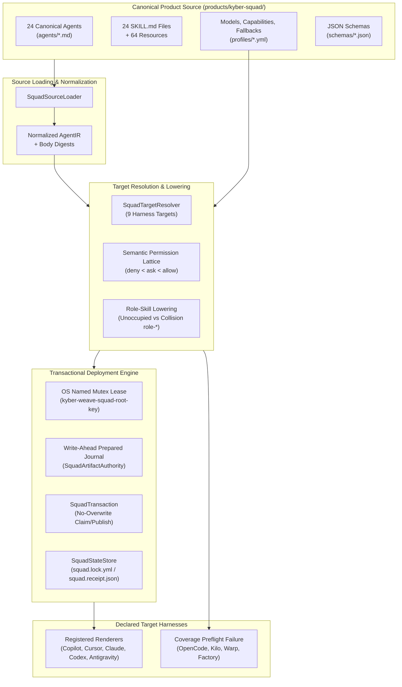
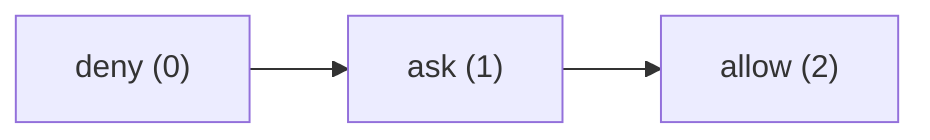
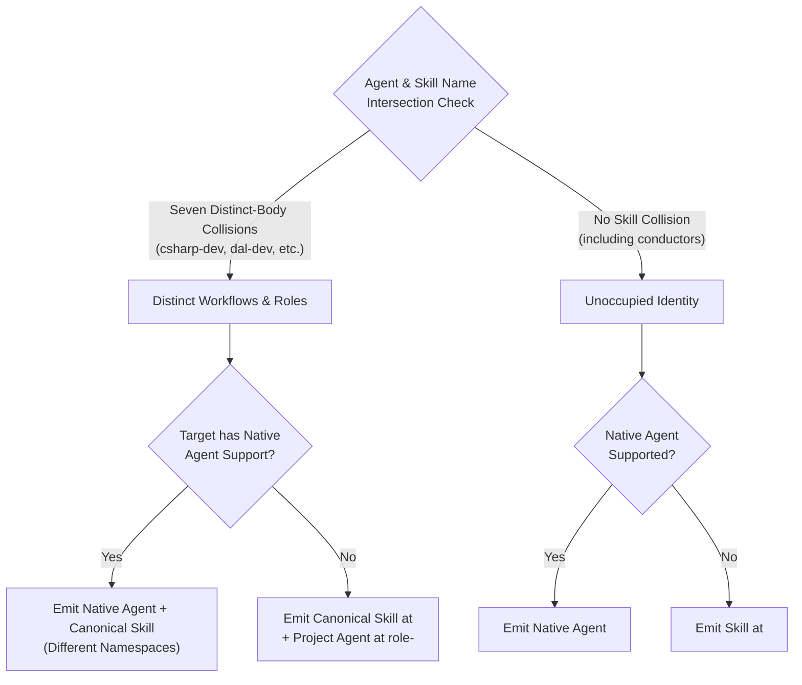
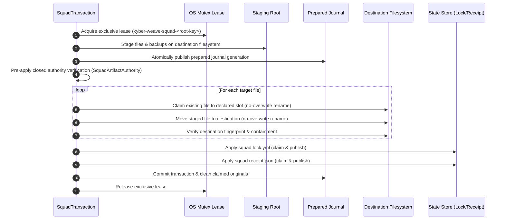

# Kyber-Squad architecture

Kyber-Squad is the multi-harness governance and deployment engine within Kyber-Weave.
It normalizes canonical agent and skill definitions into an intermediate representation (**AgentIR**),
evaluates capability and permission lattices, applies deterministic role-skill lowering, and executes
atomic, recoverable deployments. Its catalog declares nine target coding harnesses; five have
implemented and registered renderers today.

---

## High-Level Architecture

---

## 1. AgentIR Normalization and Canonical Sources

Kyber-Squad treats agent and skill definitions as strictly typed, immutable source models:

- **Canonical Agent Definitions**: Authored in `products/kyber-squad/agents/<name>.md` with closed YAML frontmatter and LF-normalized UTF-8 bodies.
- **Normalization Pipeline**: `SquadSourceLoader` parses frontmatter against `schemas/agent.schema.json`, validates capability bindings, computes an immutable SHA-256 instruction digest over the normalized body, and emits a structured `AgentIR` model.
- **Strict Invariants**: Loaders reject undeclared profiles, missing capabilities, invalid invocation modes, path traversal attempts, or unrecognized frontmatter keys.
- **Canonical Skills and Resources**: `SquadSourceLoader` loads the 24 top-level `SKILL.md`
  identities. The canonical tree separately retains 64 supplemental files, giving 88 recursive
  skill-tree files; `SquadPacker` carries that complete recursive tree into both package formats.

---

## 2. Semantic Permission Lattice

Permissions are governed by a formal three-state lattice:

### Lattice Evaluation Rules

1. **Ordering**: `deny < ask < allow`.
2. **Safety Narrowing**: If a target harness does not support interactive prompts (`ask`), the permission safely narrows to `deny`.
3. **Non-Broadening Guarantee**: If a harness cannot enforce `ask` or `deny` constraints for a specific capability, the entire agent or skill representation is **omitted** rather than broadened to `allow`.
4. **Structured Degradation**: Every narrowing or omission is recorded in the deployment receipt as an explicit degradation record.

---

## 3. Role-Skill Lowering and Namespace Resolution

Targets without native agent primitives use **agent-to-role-skill lowering**, governed by
`profiles/fallbacks.yml`. Antigravity has an implemented renderer for this projection. Warp is
declared with the same projection model but remains unsupported until its renderer is implemented.

The current canonical agent and skill namespaces intersect at exactly seven names. Every
intersection is a distinct-body collision; the product declares no shared identities:

### Resolution Rules

1. **Distinct-Body Collisions (`csharp-dev`, `dal-dev`, `github-devops`, `maui-dev`, `product-owner`, `python-dev`, `test-dev`)**:
   - The canonical skill and agent serve distinct functions.
   - On fallback targets, the canonical skill stays at `<name>`, and the agent instruction body is projected to `role-<name>`.
   - `role-` is reserved exclusively for generated projections; no canonical source file may use the `role-` prefix.
2. **Unoccupied Identities**:
   - Agents with no matching skill name lower directly to `<name>` as a skill on fallback targets.
   - `conductor` and `conductor-v3` follow this rule because neither has a canonical skill.
     The fallback profile's `shared-identities` list is empty; `conductor-v2` exists only as an
     input migration alias for `conductor`.

---

## 4. State, Identity, and Locking Model

Squad deployments maintain rigorous state and concurrency boundaries:

### Physical Root Identity and Path Semantics

- **Canonical Physical Roots**: Paths are resolved through all symbolic links and reparse points to their physical disk location using `SquadPhysicalRootIdentity.Resolve`.
- **Root Hash Key**: The lowercase SHA-256 hash of the canonical physical path forms `<root-key>`. Lexical or symlink aliases of the same physical root converge onto the same state root and lease.
- **Filesystem Path Semantics**: `SquadFileSystemPathSemantics` enforces case-exact matching against disk segments, preventing accidental case-folding on case-insensitive filesystems while respecting case-distinct directories on case-sensitive filesystems.

### Cross-Process Mutex Lease

- **Named OS Mutex**: Every mutating operation acquires an exclusive OS-named mutex (`kyber-weave-squad-<root-key>`).
- **Scope-Independent Contention**: Project-scoped and global-scoped operations targeting the same physical root contend for the exact same mutex, preventing concurrent corruption.
- **Precondition Reverification**: After acquiring the lease, all preconditions and path containment assertions are re-evaluated immediately before filesystem operations.

### Lock and Receipt Files

- **`squad.lock.yml`**: Contains bundle metadata, versions, target lists, exclusions, translation mode, and bundle digests. Also carries a vestigial upstream-toolchain identity field, kept for schema stability now that rendering no longer depends on an external toolchain; it reads `unverified` on every install.
- **`squad.receipt.json`**: Records scope, installation timestamp, structured degradation records, and an ordered manifest of owned files with relative paths and SHA-256 digests.

---

## 5. Write-Ahead Journal and Transaction Engine

Deployments use an atomic, write-ahead, compare-and-restore transaction engine (`SquadTransaction`):

### Claim and Publish Protocol

1. **No Destructive Overwrites**: Files are never updated with in-place overwrites or unrecorded deletions.
2. **Deterministic Claiming**: Pre-existing target files are atomically moved into unique, manifest-declared backup slots using same-filesystem no-overwrite renames.
3. **Atomic Publication**: Staged artifacts are reverified immediately before being moved into their destination paths.
4. **State Written Last**: Lock and receipt files are published only after all target files have been successfully applied and verified.

---

## 6. Idempotent Recovery and Conflict Preservation

When an interrupted deployment or crash occurs, `SquadTransaction.Recover` restores system consistency:

- **Dual Fingerprint Resolution**: Recovery inspects both the destination path and the claimed backup slot to determine whether a transition completed, failed, or was interrupted mid-flight.
- **External Modification Preservation**: If an external process or operator modified a file during or after the transaction, recovery leaves the modified file intact, preserves the journal and backup evidence, and emits actionable repair guidance.
- **Clean Reversibility**: Uncontended rollbacks restore the pre-transaction state, clean up empty directories created by the transaction, and restore application-data topologies.

---

## 7. Transaction Observers

Squad exposes two observer interfaces for lifecycle monitoring and deterministic test verification:

1. **`ISquadTransactionObserver` (Public Lifecycle Contract)**:
   Receives exactly 6 ordered events:
   - `IntentWritten`
   - `FileStaged`
   - `FileBackedUp`
   - `FileApplied`
   - `LockApplied`
   - `ReceiptApplied`
2. **`ISquadTransactionCheckpointObserver` (Internal Diagnostic Extension)**:
   Opt-in observer used for fine-grained crash simulation across checkpoint states:
   - `Prepared`
   - `ActiveTransitionWritten`
   - `OriginalClaimed`
   - `AfterImagePublished`

---

## 8. Rendering

Lowering AgentIR into a harness's native files is native Kyber-Weave code, not a call to an
external toolchain. `SquadLifecycleService` renders through `ISquadRenderer`, resolved by
`SquadCommandComposition` to a `SquadRendererRegistry` — the composite that gates, dispatches,
and validates.

- **Coverage gate first**: before the release is even downloaded, the registry checks every
  requested target against `ISquadRenderer.SupportedTargets`. Any target with no registered
  renderer fails the whole request — install and update are all-or-nothing across the
  requested target set, never a partial render of the targets that happen to be covered.
- **Dispatch**: each supported target's canonical source goes to the `ISquadRenderer` that
  owns it — `ClaudeRenderer` for `.claude/agents/*.md` and `.claude/skills/*/SKILL.md`,
  `CopilotRenderer` for `.github/agents/*.agent.md` and `.github/skills/*/SKILL.md`,
  `CursorRenderer` for `.cursor/agents/*.md` and `.cursor/skills/*/SKILL.md`,
  `CodexRenderer` for `.codex/agents/*.toml` and `.codex/skills/*/SKILL.md`,
  and `AntigravityRenderer` for fallback role-skill lowering to `.agents/skills/*/SKILL.md`.
- **Copilot-only projection inputs**: each canonical agent declares exact `copilot-tools`, and
  may name a target-scoped `copilot-capability-profile`. These fields validate and render the
  Copilot allow-list and safety degradation only. They do not replace or widen the shared
  `capability-profile`, fallback metadata, description, or instruction body consumed by other
  renderers.
- **Validate**: the registry re-checks the merged output — portable paths stay inside the
  extraction root, every file's target was actually requested, the native/fallback
  single-projection rules from [section 3](#3-role-skill-lowering-and-namespace-resolution)
  hold, and every structured degradation record's instruction digest matches the canonical
  agent it names. A violation raises `SquadRenderValidationException` rather than deploying
  output that failed its own contract.
- **Degradation is the honest alternative to guessing**: a renderer with no way to express a
  canonical capability (Copilot's `tools` frontmatter key is a flat, platform-specific
  allow-list with no published mapping to the semantic capability vocabulary) records a
  structured degradation instead of a claimed mapping that might silently broaden or narrow
  what the deployed agent can actually do.
- **Tools flow sequence & MCP allow-listing**: Copilot agent manifests serialize `tools` as an
  inline YAML flow sequence (e.g. `tools: [vscode, execute, read, 'codegraph/*', 'kyber-weave/*', 'context7/*', edit, search, todo]`).
  Base tools (`vscode`, `todo`) are granted unconditionally, while capability-governed built-ins
  and single-quoted MCP server wildcards (`'codegraph/*'`, `'kyber-weave/*'`, `'context7/*'`) are
  capability-gated (`filesystem.read` for non-orchestrator roles).
- **Copilot golden boundary**: Copilot emits exactly 48 files: 24
  `.github/agents/<name>.agent.md` files and 24 `.github/skills/<name>/SKILL.md` files. All 24
  raw canonical `SKILL.md` files are Hotshot golden bytes. Supplemental resources are not
  rendered, even though the Hotshot tree consequently has 61 dangling local references.
  Canonical source and both recursive package formats retain all 64 resources and resolve the
  retained references. They remain until the
  [content-preserving migration todo](../todo/migrate-skill-resources-into-standards.md) passes.
- **Generated-output boundary**: target-rendered `.github` files are deployment output, not
  canonical product or package source, and this synchronization does not add a generated target
  tree to `products/kyber-squad/`.
- **Coverage today**: `claude` (native), `copilot` (native), `cursor` (native), `codex` (native: `.codex/agents/*.toml` + `.codex/skills/*/SKILL.md`), and `antigravity` (fallback role-skill lowering to
  `.agents/skills/`) are implemented and registered. The remaining declared targets—`opencode`,
  `kilo`, `warp`, and `factory`—fail coverage preflight. `kyber-weave squad doctor` reports which
  targets are covered; `docs/todo/<target>.md` has what implementing the rest needs.
- **Authority and self-deployment boundary**: `products/kyber-squad/` is canonical and package
  authority. Root `.github/agents/`, `.github/skills/`, `.kyber-weave/squad.lock.yml`, and
  `.kyber-weave/squad.receipt.json` are an intentional stale self-deployment, not inputs to source
  loading or packaging. They remain untouched until a human refreshes them after a fresh release
  candidate.

---

## Related

- [Kyber-Squad adoption guide](onboarding.md) — CLI commands, flags, and workflows
- [Requirements and degradation contract](requirements.md) — KS-001 through KS-008 specifications
- [Configuration](../configuration.md) — repository configuration options
- [The documentation ontology](../documentation-ontology.md) — governance framework
