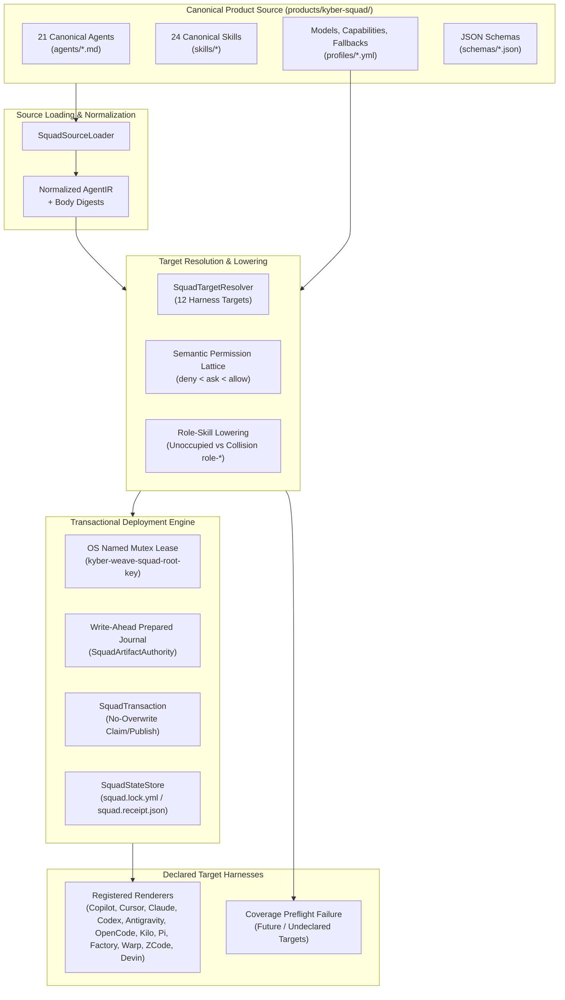
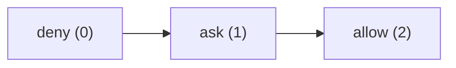
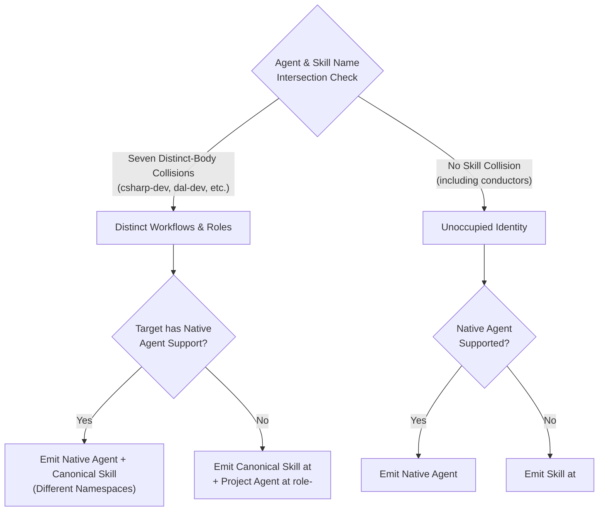
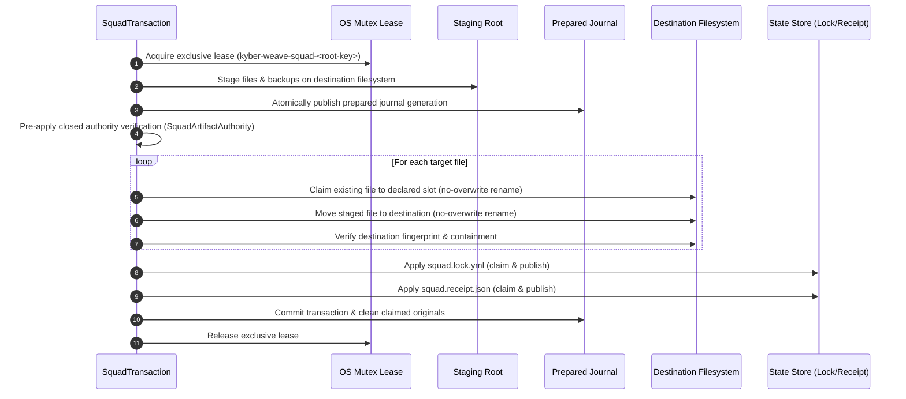
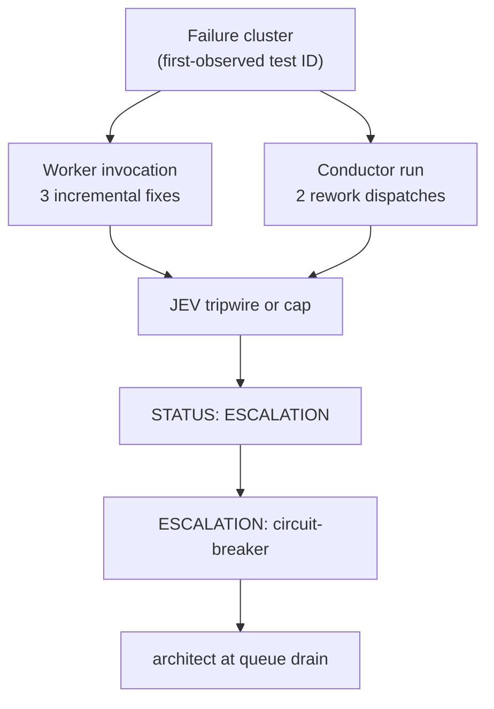

# Kyber-Squad architecture

Kyber-Squad is the multi-harness governance and deployment engine within Kyber-Weave.
It normalizes canonical agent and skill definitions into an intermediate representation (**AgentIR**),
evaluates capability and permission lattices, applies deterministic role-skill lowering, and executes
atomic, recoverable deployments. Its catalog declares twelve target coding harnesses; all twelve have
implemented and registered renderers today.

---

## High-Level Architecture

```mermaid
flowchart TD
    subgraph CanonicalSource["Canonical Product Source (products/kyber-squad/)"]
        Agents["21 Canonical Agents\n(agents/*.md)"]
        Skills["24 Canonical Skills\n(skills/*)"]
        Profiles["Models, Capabilities, Fallbacks\n(profiles/*.yml)"]
        Schemas["JSON Schemas\n(schemas/*.json)"]
    end

    subgraph Loader["Source Loading & Normalization"]
        SquadSourceLoader["SquadSourceLoader"]
        AgentIR["Normalized AgentIR\n+ Body Digests"]
    end

    subgraph Compiler["Target Resolution & Lowering"]
        SquadTargetResolver["SquadTargetResolver\n(12 Harness Targets)"]
        Lattice["Semantic Permission Lattice\n(deny < ask < allow)"]
        Lowering["Role-Skill Lowering\n(Unoccupied vs Collision role-*)"]
    end

    subgraph DeploymentEngine["Transactional Deployment Engine"]
        Mutex["OS Named Mutex Lease\n(kyber-weave-squad-root-key)"]
        Journal["Write-Ahead Prepared Journal\n(SquadArtifactAuthority)"]
        Transaction["SquadTransaction\n(No-Overwrite Claim/Publish)"]
        StateStore["SquadStateStore\n(squad.lock.yml / squad.receipt.json)"]
    end

    subgraph TargetHarnesses["Declared Target Harnesses"]
        RegisteredTargets["Registered Renderers\n(Copilot, Cursor, Claude, Codex, Antigravity, OpenCode, Kilo, Pi, Factory, Warp, ZCode, Devin)"]
        UnsupportedTargets["Coverage Preflight Failure\n(Future / Undeclared Targets)"]
    end

    CanonicalSource --> SquadSourceLoader
    SquadSourceLoader --> AgentIR
    AgentIR --> Compiler
    Profiles --> Compiler
    Compiler --> DeploymentEngine
    DeploymentEngine --> RegisteredTargets
    Compiler --> UnsupportedTargets
```

---

## 1. AgentIR Normalization and Canonical Sources

Kyber-Squad treats agent and skill definitions as strictly typed, immutable source models:

- **Canonical Agent Definitions**: Authored in `products/kyber-squad/agents/<name>.md` with closed YAML frontmatter and LF-normalized UTF-8 bodies.
- **Normalization Pipeline**: `SquadSourceLoader` parses frontmatter against `schemas/agent.schema.json`, validates capability bindings, computes an immutable SHA-256 instruction digest over the normalized body, and emits a structured `AgentIR` model.
- **Strict Invariants**: Loaders reject undeclared profiles, missing capabilities, invalid invocation modes, path traversal attempts, or unrecognized frontmatter keys.
- **Canonical Skills and Resources**: `SquadSourceLoader` loads the 24 top-level `SKILL.md`
  identities. The canonical tree separately retains 68 supplemental files, giving 92 recursive
  skill-tree files; `SquadPacker` carries that complete recursive tree into both package formats.

---

## 2. Semantic Permission Lattice

Permissions are governed by a formal three-state lattice:

```mermaid
graph LR
    Deny["deny (0)"] --> Ask["ask (1)"] --> Allow["allow (2)"]
```

### Lattice Evaluation Rules

1. **Ordering**: `deny < ask < allow`.
2. **Safety Narrowing**: If a target harness does not support interactive prompts (`ask`), the permission safely narrows to `deny`.
3. **Non-Broadening Guarantee**: If a harness cannot enforce `ask` or `deny` constraints for a specific capability, the entire agent or skill representation is **omitted** rather than broadened to `allow`.
4. **Structured Degradation**: Every narrowing or omission is recorded in the deployment receipt as an explicit degradation record.

---

## 3. Role-Skill Lowering and Namespace Resolution

Targets without native agent primitives use **agent-to-role-skill lowering**, governed by
`profiles/fallbacks.yml`. Warp is the sole remaining fallback target with an implemented renderer for
this projection; Antigravity was previously classified as fallback and has been reclassified to native
([ADR 0022](../adr/0022-antigravity-native-agents.md)).

The current canonical agent and skill namespaces intersect at exactly seven names. Every
intersection is a distinct-body collision; the product declares no shared identities:

```mermaid
flowchart TD
    Intersection{"Agent & Skill Name\nIntersection Check"}
    
    Intersection -->|"Seven Distinct-Body Collisions\n(csharp-dev, dal-dev, etc.)"| CollisionPath["Distinct Workflows & Roles"]
    Intersection -->|"No Skill Collision\n(including conductors)"| UnoccupiedPath["Unoccupied Identity"]

    CollisionPath --> FallbackCheck{"Target has Native\nAgent Support?"}
    FallbackCheck -->|"Yes"| NativeBoth["Emit Native Agent + Canonical Skill\n(Different Namespaces)"]
    FallbackCheck -->|"No"| LowerPrefixed["Emit Canonical Skill at <name>\n+ Project Agent at role-<name>"]

    UnoccupiedPath --> UnoccupiedCheck{"Native Agent\nSupported?"}
    UnoccupiedCheck -->|"Yes"| NativeAgent["Emit Native Agent"]
    UnoccupiedCheck -->|"No"| LowerDirect["Emit Skill at <name>"]
```

### Resolution Rules

1. **Distinct-Body Collisions (`csharp-dev`, `dal-dev`, `github-devops`, `maui-dev`, `product-owner`, `python-dev`, `test-dev`)**:
   - The canonical skill and agent serve distinct functions.
   - On fallback targets, the canonical skill stays at `<name>`, and the agent instruction body is projected to `role-<name>`.
   - `role-` is reserved exclusively for generated projections; no canonical source file may use the `role-` prefix.
2. **Unoccupied Identities**:
   - Agents with no matching skill name lower directly to `<name>` as a skill on fallback targets.
   - `conductor` follows this rule because it has no canonical skill. The fallback profile's
     `shared-identities` list is empty, and the canonical catalog carries no version aliases.

### Native Branch: Pi with Primary-Agent Lowering

Pi is a native agent target ([ADR 0019](../adr/0019-pi-native-subagents-and-primary-lowering.md))
that projects subagents natively but lowers its one primary-invocation
agent (`conductor`) to a skill, per its fallback profile's `no-primary-agent: skill` value. Pi
core has no primary-agent primitive: `.pi/SYSTEM.md` or `--system-prompt` replaces the whole
session prompt. Rendering `conductor` as a subagent instead would place it at depth 1, pushing its
delegated specialists to depth 2 — where Pi's default `maxSubagentDepth: 2` removes the nested
delegation that `architect` and `code-reviewer` need. Lowering it to a top-level skill keeps it at
depth 0, where the extension's `Agent` tool is available, and its specialists' nested rosters
still work.

### Native Branch: Claude with a Primary-Agent Entry-Point Skill

Claude is a native agent target that projects subagents natively to `.claude/agents/<name>.md` and
has a real primary-agent primitive only through `claude --agent <name>` or the `agent` setting —
the only modes where Claude Code enforces the agent's `tools` allow-list, `Agent(roster)` roster,
and model. A primary-invocation agent rendered as a subagent would run nested, where the roster
is ignored and the Agent tool may be unavailable (spawn depth 1 in cloud sessions).

When a primary agent's fallback profile declares `no-primary-agent: skill`, Claude renders **both**
the subagent at `.claude/agents/<name>.md` (kept for enforced invocation) **and** an entry-point
skill at `.claude/skills/<name>/SKILL.md`, invoked as `/<name>` in the main conversation. The skill
is byte-identical to the subagent body and carries exactly three frontmatter keys: `name`,
`description` (collapsed to one line), and `license: MIT`. Its resources project beside it as with
other skills.

The skill's description stays in Claude's context, so Claude may auto-load `/<name>` into the main
conversation without the user typing it. The degradation records account for this unenforced
entry point: its details state that the session's tools, permission mode, MCP servers and model
apply to the skill, and that `claude --agent <name>` is the enforced alternative. The subagent
file is kept unchanged, and resources project to both principals.

Claude is the first native target where a single agent emits two distinct principals (subagent and
entry-point skill). Under `no-primary-agent: omit`, no entry-point skill is emitted and the agent's
records remain unchanged.

**Fail-closed on canonical skill collision.** If a canonical skill occupies the entry-point
identity, the render fails with a `SquadRenderValidationException` rather than resolving the
collision through role-prefixing. The canonical skill and entry-point skill would both claim
`.claude/skills/<name>/SKILL.md`. Separately, Claude resolves personal skills before project
skills but project agents before user agents, so mixed-scope installs can expose `/<name>` and
`@agent-<name>` from different versions.

**Rejected alternatives:**
- Legacy `.claude/commands/conductor.md` command: Claude Code registers files under
  `.claude/commands/<subdir>/` as `<subdir>:<name>` commands, so resources would become phantom
  commands, requiring ZCode-style relocation and link rewriting ([ADR 0021](../adr/0021-zcode-command-lowering-and-resource-relocation.md)).
  A skill directory takes supporting files natively, and a skill wins over a same-named command.
- Skill with `context: fork` and `agent: conductor`: runs an isolated subagent that does not see
  conversation history, runs in the background by default, and recreates the nested-subagent
  failure (no Agent tool at depth 1).
- Setting `"agent": "conductor"` in `.claude/settings.json`: makes every session a conductor
  session, but Squad does not own settings files.
- Replacing the subagent with the skill: drops the only enforced form (`claude --agent conductor`)
  and breaks existing `@agent-conductor` use.
- Unconditional renderer rule for every primary agent: Claude would become the only target that
  ignores the declared `no-primary-agent` value, with no off switch in source.
- A new dedicated profile key: it is a schema change when the existing key already declares the
  intent.
- Emitting `model`, `allowed-tools` or `disallowed-tools` on the skill: all three last only for
  the invoking turn and cannot hold the orchestration profile.
- Hook-based enforcement from the skill: skill hooks stay registered for the rest of the session,
  which outlives the conductor's use.

---

## 4. State, Identity, and Locking Model

Squad deployments maintain rigorous state and concurrency boundaries:

### Physical Root Identity and Path Semantics

- **Canonical Physical Roots**: Paths are resolved through all symbolic links and reparse points to their physical disk location using `SquadPhysicalRootIdentity.Resolve`.
- **Root Hash Key**: The lowercase SHA-256 hash of the canonical physical path forms `<root-key>`. Lexical or symlink aliases of the same physical root converge onto the same state root and lease.
- **Filesystem Path Semantics**: `SquadFileSystemPathSemantics` enforces case-exact matching against disk segments, preventing accidental case-folding on case-insensitive filesystems while respecting case-distinct directories on case-sensitive filesystems.

### Cross-Process Mutex Lease

- **Named OS Mutex**: Every mutating operation acquires an exclusive OS-named mutex (`kyber-weave-squad-<root-key>`).
- **Scope-Independent Contention**: Project-scoped and global-scoped operations targeting the same physical root contend for the exact same mutex, preventing concurrent corruption.
- **Precondition Reverification**: After acquiring the lease, all preconditions and path containment assertions are re-evaluated immediately before filesystem operations.

### Lock and Receipt Files

- **`squad.lock.yml`**: Contains bundle metadata, versions, target lists, exclusions, translation mode, and bundle digests. Also carries a vestigial upstream-toolchain identity field, kept for schema stability now that rendering no longer depends on an external toolchain; it reads `unverified` on every install.
- **`squad.receipt.json`**: Records scope, installation timestamp, structured degradation records, and an ordered manifest of owned files with relative paths and SHA-256 digests.

#### Receipt version and layout contract

- **Global scope**: receipts serialize as `kyber-squad.receipt/v2` and carry a required `layout` field specifying `single-root` (all paths target-prefixed, legacy rc.9/rc.10 format) or `per-target-roots` (bare paths, rc.11+). Project-scope receipts remain v1 with no layout field.
- **Legacy v1 global receipts** (pre-#91): classified by examining paths in the receipt. If every entry is target-prefixed (e.g., `.codex/agents/x.toml`), it is treated as `single-root` layout. If no entry is prefixed, it is `per-target-roots`. A receipt mixing both patterns is invalid. A v2 receipt whose declared `layout` contradicts its paths is rejected the same way.
- **Compatibility**: CLI versions before the v2 layout marker refuse a v2 global receipt with exit code 1 and do not modify any files. Upgrade the CLI to proceed.
- **Legacy recovery**: for an rc.9/rc.10 single-root install, `status` and `uninstall` operate against the recorded deployment root; `update` and same-target `install` refuse with guidance to run `kyber-weave squad uninstall --global` followed by `kyber-weave squad install --global`.
- **Blocks in shared hook files (`kyber-squad.receipt/v3`)**: a project-scope receipt
  that owns entries inside a shared hook file serializes as `kyber-squad.receipt/v3` —
  the v1 project field set plus `blocks`, each with `relativePath`, `target`,
  `createdFile`, and `entries` of `container` (an RFC 6901 JSON pointer to the entry)
  and `sha256` (over the entry's compact JSON). A v3 receipt is written only at
  project scope and only when a block exists; receipts without blocks stay byte-identical
  v1 or v2. An older CLI refuses a v3 receipt with exit code 1. See
  [owned blocks](#owned-blocks-in-shared-hook-files) below and
  [ADR 0034](../adr/0034-squad-owned-blocks-in-shared-hook-files.md).

#### Owned blocks in shared hook files

Some harnesses keep hooks in a file the user also owns, and JSON has no comments to
mark a block with — so Squad owns marked *entries*, never the file
([ADR 0034](../adr/0034-squad-owned-blocks-in-shared-hook-files.md), an exception to
the rule that Squad does not own settings files). The deployment plan splices Squad's
rendered entries into the file, replacing Squad's previous entries while the user's
entries keep their order and values; a missing file starts from the format's minimal
document, and an existing user file at a block path is not an unmanaged collision.

| Target | File | Owned containers | An entry is Squad's when | Written fields |
|---|---|---|---|---|
| `cursor` | `.cursor/hooks.json` | `/hooks/preToolUse`, `/hooks/postToolUse` (a new file starts `{"version":1,"hooks":{}}`) | its `command` starts with `kyber-weave-arbiter hook --harness cursor` | `command`, `matcher`, `timeout`, `failClosed` |
| `codex` | `.codex/hooks.json` | `/hooks/PreToolUse`, `/hooks/PostToolUse` | every `hooks[].command` in the matcher group starts with `kyber-weave-arbiter hook --harness codex` — a group mixing Squad and user hooks stays user content | `matcher`, `hooks:[{type, command, timeout}]` |

The splice covers three further shapes for Phase 3 (`.factory/hooks.json`,
`.devin/hooks.v1.json`, and the Antigravity `.agents/hooks.json`, where Squad owns
the whole top-level `kyber-arbiter` group by key); Phase 2 renders only the Cursor
and Codex blocks, plus Pi's owned extension file (a whole owned file, not a block).
Only documented fields are written, never a sentinel key, and shared-file hook
commands carry no `--caller` because they gate project-wide. The plan-side splice
is the file splice: it calls the content-level `SquadHookJsonBlock.SpliceContent`
that the file-level splice also uses — same containers, same ownership test, same
digests — so a dry run and an install cannot diverge. Planning stays side-effect
free because it never calls the file-level `SpliceFile`, which is what writes.

A hand-edited or missing owned entry is drift, reported by `squad status` and
`squad doctor` naming the file and the container. `squad update` rewrites the block
but preserves a drifted entry, reporting it, unless `--replace-managed` is given.
`squad uninstall` removes only the owned entries and deletes the file only when
Squad created it and no hook remains.

---

## 5. Write-Ahead Journal and Transaction Engine

Deployments use an atomic, write-ahead, compare-and-restore transaction engine (`SquadTransaction`):

```mermaid
sequenceDiagram
    autonumber
    participant App as SquadTransaction
    participant Mutex as OS Mutex Lease
    participant Stage as Staging Root
    participant Journal as Prepared Journal
    participant Target as Destination Filesystem
    participant State as State Store (Lock/Receipt)

    App->>Mutex: Acquire exclusive lease (kyber-weave-squad-<root-key>)
    App->>Stage: Stage files & backups on destination filesystem
    App->>Journal: Atomically publish prepared journal generation
    App->>App: Pre-apply closed authority verification (SquadArtifactAuthority)
    
    loop For each target file
        App->>Target: Claim existing file to declared slot (no-overwrite rename)
        App->>Target: Move staged file to destination (no-overwrite rename)
        App->>Target: Verify destination fingerprint & containment
    end

    App->>State: Apply squad.lock.yml (claim & publish)
    App->>State: Apply squad.receipt.json (claim & publish)
    App->>Journal: Commit transaction & clean claimed originals
    App->>Mutex: Release exclusive lease
```

### Claim and Publish Protocol

1. **No Destructive Overwrites**: Files are never updated with in-place overwrites or unrecorded deletions.
2. **Deterministic Claiming**: Pre-existing target files are atomically moved into unique, manifest-declared backup slots using same-filesystem no-overwrite renames.
3. **Atomic Publication**: Staged artifacts are reverified immediately before being moved into their destination paths.
4. **State Written Last**: Lock and receipt files are published only after all target files have been successfully applied and verified.

---

## 6. Idempotent Recovery and Conflict Preservation

When an interrupted deployment or crash occurs, `SquadTransaction.Recover` restores system consistency:

- **Dual Fingerprint Resolution**: Recovery inspects both the destination path and the claimed backup slot to determine whether a transition completed, failed, or was interrupted mid-flight.
- **External Modification Preservation**: If an external process or operator modified a file during or after the transaction, recovery leaves the modified file intact, preserves the journal and backup evidence, and emits actionable repair guidance.
- **Clean Reversibility**: Uncontended rollbacks restore the pre-transaction state, clean up empty directories created by the transaction, and restore application-data topologies.

---

## 7. Transaction Observers

Squad exposes two observer interfaces for lifecycle monitoring and deterministic test verification:

1. **`ISquadTransactionObserver` (Public Lifecycle Contract)**:
   Receives exactly 6 ordered events:
   - `IntentWritten`
   - `FileStaged`
   - `FileBackedUp`
   - `FileApplied`
   - `LockApplied`
   - `ReceiptApplied`
2. **`ISquadTransactionCheckpointObserver` (Internal Diagnostic Extension)**:
   Opt-in observer used for fine-grained crash simulation across checkpoint states:
   - `Prepared`
   - `ActiveTransitionWritten`
   - `OriginalClaimed`
   - `AfterImagePublished`

---

## 8. Rendering

Lowering AgentIR into a harness's native files is native Kyber-Weave code, not a call to an
external toolchain. `SquadLifecycleService` renders through `ISquadRenderer`, resolved by
`SquadCommandComposition` to a `SquadRendererRegistry` — the composite that gates, dispatches,
and validates.

- **Coverage gate first**: before the release is even downloaded, the registry checks every
  requested target against `ISquadRenderer.SupportedTargets`. Any target with no registered
  renderer fails the whole request — install and update are all-or-nothing across the
  requested target set, never a partial render of the targets that happen to be covered.
- **Dispatch**: each supported target's canonical source goes to the `ISquadRenderer` that
  owns it — `ClaudeRenderer` for `.claude/agents/*.md` and a primary-agent entry-point skill at
  `.claude/skills/conductor/SKILL.md`, `CopilotRenderer` for `.github/agents/*.agent.md` and
  `.github/skills/*/SKILL.md`, `CursorRenderer` for `.cursor/agents/*.md` and `.cursor/skills/*/SKILL.md`,
  `CodexRenderer` for `.codex/agents/*.toml` and `.codex/skills/*/SKILL.md`,
  `AntigravityRenderer` for native per-agent directory emission to `.agents/agents/*/agent.md` and canonical skills to `.agents/skills/*/SKILL.md` ([ADR 0022](../adr/0022-antigravity-native-agents.md)),
  `OpenCodeRenderer` for `.opencode/agents/*.md` and `.opencode/skills/*/SKILL.md`,
  `KiloRenderer` for `.kilo/agents/*.md` and `.kilo/skills/*/SKILL.md`,
  `PiRenderer` for native subagent projection to `.pi/agents/*.md` and `.pi/skills/*/SKILL.md` with primary-agent lowering ([ADR 0019](../adr/0019-pi-native-subagents-and-primary-lowering.md)),
  `FactoryRenderer` for `.factory/droids/*.md` and `.factory/skills/*/SKILL.md`,
  `WarpRenderer` for fallback role-skill lowering to `.warp/skills/*/SKILL.md`,
  `ZCodeRenderer` for `.zcode/agents/*.md` and `.zcode/skills/*/SKILL.md` with the primary agent lowered to a slash command at `.zcode/commands/*.md` ([ADR 0021](../adr/0021-zcode-command-lowering-and-resource-relocation.md)),
  and `DevinRenderer` for Devin Desktop's local agent: per-agent directories at `.devin/agents/*/AGENT.md` and skills at `.devin/skills/*/SKILL.md`, with the primary agent lowered to a skill ([ADR 0025](../adr/0025-devin-native-agents-and-skill-lowering.md)).

| Target | Renderer | Agent Output | Skill Output | Kind |
|---|---|---|---|---|
| `claude` | `ClaudeRenderer` | `.claude/agents/<name>.md`; primary agent also at `.claude/skills/<name>/SKILL.md` | `.claude/skills/<name>/SKILL.md` | Native |
| `copilot` | `CopilotRenderer` | `.github/agents/<name>.agent.md` | `.github/skills/<name>/SKILL.md` | Native |
| `cursor` | `CursorRenderer` | `.cursor/agents/<name>.md` | `.cursor/skills/<name>/SKILL.md` | Native |
| `codex` | `CodexRenderer` | `.codex/agents/<name>.toml` | `.codex/skills/<name>/SKILL.md` | Native |
| `antigravity` | `AntigravityRenderer` | `.agents/agents/<name>/agent.md` | `.agents/skills/<name>/SKILL.md` | Native |
| `opencode` | `OpenCodeRenderer` | `.opencode/agents/<name>.md` | `.opencode/skills/<name>/SKILL.md` | Native |
| `kilo` | `KiloRenderer` | `.kilo/agents/<name>.md` | `.kilo/skills/<name>/SKILL.md` | Native |
| `pi` | `PiRenderer` | `.pi/agents/<name>.md` | `.pi/skills/<name>/SKILL.md` (conductor lowered here) | Native |
| `factory` | `FactoryRenderer` | `.factory/droids/<name>.md` | `.factory/skills/<name>/SKILL.md` | Native |
| `warp` | `WarpRenderer` | `.warp/skills/role-<name>/SKILL.md` (lowered; see [§3](#3-role-skill-lowering-and-namespace-resolution)) | `.warp/skills/<name>/SKILL.md` | Fallback |
| `zcode` | `ZCodeRenderer` | `.zcode/agents/<name>.md`; the primary agent lowers to `.zcode/commands/<name>.md` | `.zcode/skills/<name>/SKILL.md` | Native |
| `devin` | `DevinRenderer` | `.devin/agents/<name>/AGENT.md` | `.devin/skills/<name>/SKILL.md` (conductor lowered here) | Native |

- **Target-scoped projection inputs**: each canonical agent declares exact `copilot-tools`, and may
  name a target-scoped `copilot-capability-profile` or `devin-capability-profile`. These fields
  validate and render that one target's allow-list and safety degradation only. They do not replace
  or widen the shared `capability-profile`, fallback metadata, description, or instruction body
  consumed by other renderers. `DevinRenderer` resolves `agent.DevinCapabilityProfile ??
  agent.CapabilityProfile` for every permission lookup it performs — granted tools, degradation
  records, MCP entitlement, and the pure-orchestrator exclusion — so an agent that names none
  renders exactly as before. Validation is what keeps the envelope scoped: a profile marked
  `target: devin` is rejected as an agent's shared `capability-profile`, a
  `devin-capability-profile` naming a profile without that marker is rejected,
  and a primary agent naming one is rejected because Devin lowers primaries to
  skills with no tool allow-list
  ([ADR 0028](../adr/0028-devin-target-scoped-authoring-capability-profiles.md)).
- **Copilot tool order ([ADR 0017](../adr/0017-copilot-deterministic-tool-order.md))**:
  `CopilotRenderer` emits `CopilotToolCatalog.Normalize(agent.CopilotTools)` — membership from
  the agent, order from one global catalog sequence (`vscode`, `read`, `todo`, MCP wildcards,
  then search/execute/web/edit/agent and the granular edit tools). Normalization never adds a
  tool the agent omitted and never reorders per agent. Capability bindings are an upper bound
  at load/validation time, not a second membership source. Wildcards remain single-quoted in
  the YAML flow sequence.
- **Resource projection**: after each principal file, the renderer appends the owner's validated
  resource closure beside it — each resource at its artifact-relative path under the principal's
  directory — so authored relative links resolve verbatim in the deployed tree. A resource that
  would alias another principal's output is a validation error, never an overwrite.
- **An omitted permission is not a withheld one on `opencode`.** Agent permissions merge with
  OpenCode's global config, whose documented behaviour is that most permissions default to
  `allow` (`external_directory` and `doom_loop` are the stated exceptions). A renderer that
  emitted only the granted keys would therefore hand back every canonical `deny` and `ask` as
  an ambient allow, inverting the
  [non-broadening guarantee](requirements.md#non-broadening-guarantee). `OpenCodeRenderer`
  consequently pins every key in the taxonomy, writing `deny` wherever the lattice does not
  grant. A target whose permission model is an allow-list — Claude, ZCode, Pi — needs no such
  treatment, because omitting a name there withholds it.
- **MCP grants differ per target, and `zcode` and `devin` enumerate.** `ClaudeRenderer`
  grants three MCP server wildcards (`mcp__codegraph__*`, `mcp__kyber-weave__*`,
  `mcp__context7__*`) to any agent allowed to read the filesystem except the pure orchestrator.
  The pure-orchestrator MCP withholding applies to the subagent file only; an entry-point skill
  invoked as `/<name>` in the main conversation inherits the session's MCP servers. ZCode
  registers MCP tools by exact name and expands no wildcard, so `ZCodeRenderer` emits the fully
  qualified `mcp__<server>__<tool>` names declared by `toolchain.yml`'s `required-mcp-tools`.
  Those names are hard requirements in ZCode, so `squad doctor` fails a ZCode install that does
  not declare the servers — see [ADR 0021](../adr/0021-zcode-command-lowering-and-resource-relocation.md).
  `DevinRenderer` appends the same fully qualified names to each subagent's `allowed-tools`,
  because that is the form Devin's permission rules name MCP tools in, and never grants Devin's
  generic MCP tools (`mcp_list_tools`, `mcp_call_tool`), which would reach every configured
  server; the servers themselves stay the operator's to configure in Devin's `mcp_config.json`.
  The roster lives in canonical source because it is an external contract that drifts, and because
  the renderer and the doctor check must read the same list.
- **`devin` withholds delegation from subagents.** Devin Local dispatches a named profile
  through `run_subagent`, and a profile reaches further subagents only through its
  `max-nesting` setting. Devin has no `allowed_subagents` equivalent, so granting nested
  delegation would reach every profile rather than the canonical `delegates-to` roster.
  `DevinRenderer` emits neither and records `permission-not-expressible` naming the roster.
  The lowered conductor is unaffected, because it runs in the main session. The delegating roles
  carry their own fallback: `code-reviewer` applies each lens itself, in turn, and says in its
  report that the council ran in-process; `architect` gathers its own sweeps and returns a live
  Azure question as `STATUS: BLOCKED`, which the conductor puts to `azure-reader` and answers.
  Agents use Devin's directory layout so each resource closure stays inside its own agent's
  directory and authored links resolve verbatim; see the `DevinRenderer` class remarks for the
  full evidence.
- **`devin` grants every tool that performs a capability.**
  Devin chooses tools per model — a GPT model edits through `apply_patch` when
  `agent.codex_tools` is on — so `filesystem.write` lowers to `edit`, `write`, `apply_patch`,
  and `notebook_edit`, and `process.execute` to `exec` with `get_output`, `write_to_process`,
  and `kill_shell`. `todo_write` and `skill` are the ungoverned base. A subagent without
  `model` runs on Devin's router-chosen default subagent model rather than the parent's, so
  every non-orchestration model profile pins an exact Devin model id. On a Devin skill,
  `allowed-tools` and `permissions.allow` pre-approve rather than restrict, so no skill carries
  either. `permissions.deny` could narrow the lowered conductor, but Devin does not document
  whether it reaches the subagents the conductor dispatches — which need exactly the tools the
  conductor is denied — so it is withheld pending a real-install check. The lowered conductor
  does carry `triggers: [user]`: Devin Cloud discovers the same skills but loads no custom
  subagents, so it must never start the conductor by description match. Devin also loads
  `.agents/` natively and imports `.claude/`, `.github/skills/`, and `.windsurf/skills/` by
  default, so `squad doctor` warns when a workspace would load a Squad identity twice.
- **`devin` cannot create a file with its write tools, so the authoring roles are granted a
  target-scoped shell** ([ADR 0028](../adr/0028-devin-target-scoped-authoring-capability-profiles.md)).
  The grant above is an upper bound on `allowed-tools`, not a statement about the tools the harness
  hands the model: on the Devin CLI the tool exposed for file changes is `edit`, `apply_patch`
  requires `agent.codex_tools`, and `edit` fails when the destination does not exist. A role whose
  only write path is that tool can edit an artifact but not create one, so `architect` stopped at
  `STATUS: PLAN_WRITE_ERROR` on a plan it had already drafted. Two grants produce that failure
  together — `ask` narrows to withheld on subagents, and the shared profiles hold `process.execute:
  ask` (`architect`) or `deny` (`product-planning`). `architect-devin` and
  `product-planning-devin` mirror their shared profiles with `process.execute: allow`. Both roles
  carry the matching initialise-before-edit instruction: `architect` in its plan-authoring
  reference, and `product-owner` in its agent body and the skill's spec-authoring reference
  (it cannot own an agent sidecar: a same-named skill already occupies the ZCode skills
  directory that sidecar would need). Each tells the role to initialise a destination that
  does not exist before editing. `architect`'s `PLAN_READY`
  contract and `product-owner`'s `SPEC_FINALIZED` contract require `docs validate` and
  `docs drift` to pass. `docs-dev` and `task-reviewer` deliberately name no
  Devin profile and keep narrowing: neither has an execution-dependent completion contract, and a
  grant with no reader is not made. With `filesystem.write: allow` beside the shell, these two roles
  also no longer raise `capability-not-isolable` on Devin. The conductor's `intake-path`, `plan-path`,
  and `spec-path` references pre-create an empty destination before dispatching, and again before
  redispatching a role that reported a write error on a nonexistent file — the harness-neutral
  fallback for any harness that withholds file creation from subagents.
- **The one target-local exception to verbatim links is `zcode`**: ZCode scans both
  `.zcode/agents/` and `.zcode/commands/` recursively, so a closure beside its principal would
  register as phantom agents and commands rather than as resources. `ZCodeRenderer` therefore
  projects an agent's closure under `.zcode/skills/<owner>/` and rewrites that owner's authored
  links to `../skills/…`, recording a `resource-links-rewritten` degradation so the deviation is
  visible in the receipt. Skill closures are unaffected; see
  [ADR 0021](../adr/0021-zcode-command-lowering-and-resource-relocation.md).
- **Validate**: the registry re-checks the merged output — portable paths stay inside the
  extraction root, every file's target was actually requested, the native/fallback
  single-projection rules from [section 3](#3-role-skill-lowering-and-namespace-resolution)
  hold, and every structured degradation record's instruction digest matches the canonical
  agent it names. A violation raises `SquadRenderValidationException` rather than deploying
  output that failed its own contract.
- **Degradation is the honest alternative to guessing**: a renderer with no way to express a
  canonical capability (Copilot's `tools` frontmatter key is a flat, platform-specific
  allow-list with no published mapping to the semantic capability vocabulary) records a
  structured degradation instead of a claimed mapping that might silently broaden or narrow
  what the deployed agent can actually do.
- **Copilot emit today**: `CopilotRenderer` writes each agent's
  `.github/agents/<name>.agent.md` and each skill's `.github/skills/<name>/SKILL.md`, then
  `SquadResourceProjection.Append` places every file that owner's Markdown links reach beside
  the principal. A fresh Copilot render is 122 files — 21 agents, 24 skills, plus projected
  closures — with authored relative links resolving in the output; every skill resource
  reaches this render except `skills/setup-dev-environment/agents/openai.yaml`, which stays
  packaged-only Codex skill-UI metadata. That count is the current
  contract in [requirements](requirements.md) (KS-001 and the golden-render requirement). The
  Hotshot-era 48-file Copilot tree that omitted resources is historical, not current
  behaviour.
- **Skill golden bytes and retained resources**: `code-review-loop` is authored in Kyber-Squad
  and has no Hotshot baseline. Every imported canonical raw `SKILL.md` except the
  six explicitly evolved skills (`bug-crusher`, `code-review`, `product-owner`, `second-brain`,
  `create-pull-request`, and `pr-review-fix-comments`) still matches Hotshot golden bytes;
  `create-pull-request-github` is retired into `create-pull-request`. Canonical source and both
  recursive package formats retain all 68 skill resources (92 files under
  `products/kyber-squad/skills/`) and resolve the retained references. Every retained resource
  now has a reviewed disposition in the
  [skill-resource dispositions audit](skill-resource-dispositions.md): non-policy content stays
  in its skill directory as its durable home, portable policy lives in the
  `products/kyber-squad/standards/` templates, and nothing was deleted.
- **Generated-output boundary**: target-rendered `.github` files are deployment output, not
  canonical product or package source, and this synchronization does not add a generated target
  tree to `products/kyber-squad/`.
- **Coverage today**: `claude` (native subagents with primary-agent entry-point skill), `copilot` (native), `cursor` (native), `codex` (native: `.codex/agents/*.toml` + `.codex/skills/*/SKILL.md`), `antigravity` (native: `.agents/agents/*/agent.md` + `.agents/skills/*/SKILL.md`, [ADR 0022](../adr/0022-antigravity-native-agents.md)), `opencode` (native: `.opencode/agents/*.md` + `.opencode/skills/*/SKILL.md`), `kilo` (native: `.kilo/agents/*.md` + `.kilo/skills/*/SKILL.md`), `pi` (native subagents with primary-agent lowering to `.pi/agents/*.md` and `.pi/skills/*/SKILL.md`), `factory` (native: `.factory/droids/*.md` + `.factory/skills/*/SKILL.md`), `warp` (fallback role-skill lowering to `.warp/skills/`), `zcode` (native: `.zcode/agents/*.md` + `.zcode/skills/*/SKILL.md`, with the primary agent lowered to `.zcode/commands/*.md`), and `devin` (native: `.devin/agents/*/AGENT.md` + `.devin/skills/*/SKILL.md`, with the primary agent lowered to a skill) are implemented and registered. All twelve declared targets are covered. `kyber-weave squad doctor` reports which
  targets are covered.
- **Authority and self-deployment boundary**: `products/kyber-squad/` is canonical and package
  authority. Root `.github/agents/`, `.github/skills/`, `.kyber-weave/squad.lock.yml`, and
  `.kyber-weave/squad.receipt.json` are an intentional stale self-deployment, not inputs to source
  loading or packaging. They remain untouched until a human refreshes them after a fresh release
  candidate.
- **Arbiter hook wiring ([ADR 0033](../adr/0033-kyber-arbiter-three-step-decision-gates.md),
  [ADR 0034](../adr/0034-squad-owned-blocks-in-shared-hook-files.md))**:
  `ArbiterHookWiring` renders decision-gate hooks for the
  [Kyber Arbiter](../kyber-arbiter/architecture.md) beside the agent deployment, in project
  scope only and only when the project's `arbiter.enabled` is true. Six targets are
  hooked: per-agent frontmatter hooks on `claude` (each dispatching agent plus the
  `/conductor` entry-point skill, with `--caller <agent>`), per-agent `.agent.md` hooks on
  `copilot` plus the project-level `.github/hooks/kyber-arbiter.json`, the
  `.opencode/plugins/kyber-arbiter.ts` shim on `opencode`, the owned extension file
  `.pi/extensions/kyber-arbiter.ts` on `pi`, and owned blocks spliced into the shared
  `.codex/hooks.json` and `.cursor/hooks.json` on `codex` and `cursor` (no `--caller`:
  shared-file hooks gate project-wide). Only agents with a non-empty
  `delegates-to` roster get dispatch-gating hooks, so the caller is trusted without a new
  agent field; implementation specialists in the worker profiles get the planning-path Read
  guard instead. Whole-file outputs (frontmatter hooks, the Copilot CLI hook file, the
  plugin shims, the Pi extension) need no receipt change; owned blocks are carried in
  `kyber-squad.receipt/v3` (see [owned blocks](#owned-blocks-in-shared-hook-files)).
  A global install renders no hooks and records `arbiter-not-enforced`
  (`global-scope`), as does any target the Arbiter does not hook yet.

---

## 9. Conductor execution circuit-breaker

The deployment engine in §1–§8 ships canonical agent bodies. Those bodies include a
two-level iteration circuit-breaker that stops thrashing test-fix loops during delivery.
The contract lives in `conductor`, `csharp-dev`, `test-dev`, and `github-devops`. No ADR
records it: the caps, tripwires, and escalation key constrain those four instruction
bodies, not the C# render or transaction engine, and they remain cheap to revise in the
agent specs. The durable product claim is here.

```mermaid
flowchart TD
    Cluster["Failure cluster\n(first-observed test ID)"]
    Worker["Worker invocation\n3 incremental fixes"]
    Conductor["Conductor run\n2 rework dispatches"]
    JEV["JEV tripwire or cap"]
    Escalation["STATUS: ESCALATION"]
    Finding["ESCALATION: circuit-breaker"]
    Architect["architect at queue drain"]

    Cluster --> Worker
    Cluster --> Conductor
    Worker --> JEV
    Conductor --> JEV
    JEV --> Escalation
    Escalation --> Finding
    Finding --> Architect
```

### Failure-cluster identity and dispatch tally

A **failure cluster** is keyed by the failing test ID first observed for that cluster,
recorded on the execution artifact when the cluster is created (when no test IDs exist,
the failing subsystem, job, or step label). A newly failing test joins the recorded
cluster whose key it most recently co-failed with; if it co-fails with none, or with more
than one, it forms a new cluster keyed by itself. A cold invocation reads the recorded
key; it does not re-derive one from whatever is failing now. Distinct keys remain
distinct clusters for A/B oscillation detection.

Every worker invocation is cold. The per-cluster **dispatch tally** therefore lives on
the run's persisted execution artifact (or the task artifact until the run writes one).
The conductor increments that tally only when it dispatches a rework worker for the
cluster. Re-evaluating the queue reads the tally and never increments it. A tally at or
above the cluster limit trips the breaker before the dispatch. The worker's inner
3-iteration cap is per invocation and does not persist.

### Two-level caps (Q1)

| Level | Cap | Scope |
|---|---|---|
| Worker inner loop | 3 incremental test-fix-verify attempts | Same failing fixture or cluster, one invocation |
| Conductor rework | 2 rework dispatches | Same cluster, entire delivery run |

A third unresolved worker attempt, or a third conductor dispatch of the same cluster,
trips `CIRCUIT_BREAKER_TRIGGER: ITERATION_CAP_EXCEEDED`.

### Oscillation (Q2)

The shipped rule is A→B→A, not a first one-way regression. A first one-way change
(fixing Failure Cluster A causes Failure Cluster B to fail) consumes one of the worker's
3 incremental iterations. The worker trips `THRASH_OSCILLATION_DETECTED` only when a
subsequent fix for B re-breaks A, or a failure signature repeats. The conductor trips
the same token when rework alternates between two cluster signatures. The original plan
wording ("A causes B to fail, **or** A → B → A") is historical; it would have burned the
breaker on the first one-way regression.

### Invariant contradiction (Q3)

Workers must not twist production code or weaken tests to satisfy contradictory
invariants. When a fixture asserts obsolete implementation details that conflict with
the approved task design, the worker halts production-code churn and trips
`INVARIANT_CONTRADICTION`.

### JEV checkpoints (Q4)

Every developer subagent (`csharp-dev`, `test-dev`, `github-devops`) runs these checks
before and after each fix attempt:

1. **Blast radius** — touched files stay inside authorized task scope. Out-of-scope work
   trips `BLAST_RADIUS_EXCEEDED`.
2. **Oscillation** — see Q2. Trips `THRASH_OSCILLATION_DETECTED`.
3. **Invariant consistency** — see Q3. Trips `INVARIANT_CONTRADICTION`.
4. **Iteration cap** — three attempts on this cluster in this invocation. Trips
   `ITERATION_CAP_EXCEEDED`.

Any tripwire emits `STATUS: ESCALATION` with the trigger, failure cluster, contradictory
invariants, blast radius, and `RECOMMENDED_ACTION`.

The closed trigger set is `ITERATION_CAP_EXCEEDED`, `THRASH_OSCILLATION_DETECTED`,
`INVARIANT_CONTRADICTION`, and `BLAST_RADIUS_EXCEEDED`. Reject any other token; do not
invent a reason. `KS-001`–`KS-008` are unchanged; this contract does not add a `KS-009`.

### Escalation (Q5)

When the breaker trips — or a worker returns `STATUS: ESCALATION` — the conductor
immediately halts rework for that task, does not dispatch further workers for that
cluster, and records the finding with `ESCALATION: circuit-breaker` (same `ESCALATION:`
prefix as `ESCALATION: end-of-run`). Non-dependent queue tasks may continue. The run
cannot complete while an unresolved circuit-breaker finding exists. At queue drain,
`architect` investigates the cluster and authors an intake recommendation or Draft plan.

Operational contracts remain in
`products/kyber-squad/agents/conductor.md`,
`products/kyber-squad/agents/conductor/references/execution-and-review.md`,
`products/kyber-squad/agents/csharp-dev.md`,
`products/kyber-squad/agents/test-dev.md`, and
`products/kyber-squad/agents/github-devops.md`.
Regression pins live in `tests/KyberWeave.Tests/SquadCanonicalContentTests.cs` and
`HotshotGoldenContractTests.cs`.

---

## Related

- [ADR 0017](../adr/0017-copilot-deterministic-tool-order.md) — Copilot tool membership and global emission order
- [ADR 0021](../adr/0021-zcode-command-lowering-and-resource-relocation.md) — ZCode command lowering and resource relocation
- [ADR 0022](../adr/0022-antigravity-native-agents.md) — Native per-agent Antigravity rendering and cross-target capability-not-isolable degradation
- [ADR 0028](../adr/0028-devin-target-scoped-authoring-capability-profiles.md) — Devin target-scoped authoring profiles and the conductor pre-creation fallback
- [Kyber-Squad adoption guide](onboarding.md) — CLI commands, flags, and workflows
- [Requirements and degradation contract](requirements.md) — KS-001 through KS-008 specifications and the conductor execution circuit-breaker
- [Configuration](../configuration.md) — repository configuration options
- [The documentation ontology](../documentation-ontology.md) — governance framework
- [Issue #249 plan](../archive/plans/2026-10-02-issue-249-subagent-iteration-circuit-breaker.md) — archived harvest source; Q1–Q5 resolved; no ADR
