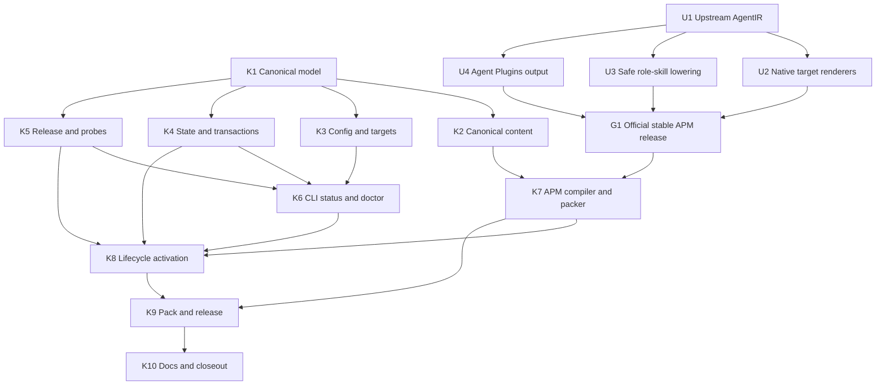

# Kyber-Squad: unified agent and skill deployment

**Approval:** Approved by the user on 2026-08-14
**Execution model:** Test-first; every Kyber-Weave implementation task follows RED -> GREEN -> review
**Goal:** Add `kyber-weave squad` as the one control plane for a canonical set of 20 agents
and 25 skills across Codex, Cursor, Claude, GitHub Copilot, OpenCode, Kilo, Gemini CLI,
Antigravity, Warp, and Factory Droids.

The ontology uses `status` for document currency and does not admit `approved`; the separate
`approval-status` key records the implementation gate without widening that closed vocabulary.

## 1. Grounded state and product boundary

### Repository state

- The CLI is a Spectre.Console composition root with `skill`, `agent`, and `docs` branches in
  `src/KyberWeave.Cli/Program.cs`; business behavior belongs in `KyberWeave.Core`.
- `KyberWeaveConfigLoader` currently merges `ontology`, `harness`, and `docs-analysis` only.
- `ProcessRunner` is the required child-process path. New APM calls must use `ArgumentList`,
  redirect both output streams, and never invoke a shell string.
- The release already publishes version-matched CLI and MCP archives plus `SHA256SUMS.txt` for
  five RIDs. The Squad asset extends that release; it is not a second release train.
- The 25 requested skills are tracked in the migration-source repository. `kyber-weave-docs`
  remains owned by the separate Kyber-Docs/APM path and is not part of Squad.

### Migration source locked for the initial canonicalization

The one-time import source is `dpalfery/motorcycle-rag-system` commit
`d7547f46ab6bb8e447096345abbe5d4c7840bfc0`. At planning time, every relevant tracked path
under `.agents/skills/`, `.claude/agents/`, `.cursor/agents/`, `.github/agents/`,
`.opencode/agents/`, and `.codex/agents/` was clean relative to that commit.

Canonical instruction-body selection is fixed as follows:

- `architect` and `architect-v3`: start from the fuller Claude bodies.
- `conductor`: start from OpenCode `conductor-v2`, rename it to `conductor`, and retain
  `conductor-v2` only as a migration alias.
- `conductor-v3`: start from the OpenCode `conductor-v3` body.
- The other 16 agents: start from the Claude body. These match the other Markdown harnesses in
  nearly every case and retain behavior that several Codex copies currently truncate.

Migration may remove harness-specific invocation syntax from those bodies, but it may not add a
second harness-specific body. Each `migration/<agent>.md` report records all source hashes, the
selected baseline, retained harness-independent additions, excluded harness mechanics, the
resolved permission policy, and the final normalized-body SHA-256.

### Upstream truth and hard release gate

The current official stable Agent Package Manager release inspected for this plan is **v0.28.0**,
tag commit `e041462f4a48086dbee3da145c07d71b8a3b84fd` (released 2026-08-06). The locally installed
APM is older, v0.23.1. v0.28.0 is a useful baseline but is **not a qualifying Squad runtime**:

- It deploys agents for Copilot, Claude, Cursor, Codex, OpenCode, and Kiro. Kiro is not Kilo.
- It has no Kilo, Warp, or Factory Droids target.
- Gemini and Antigravity do not receive agents or an agent-to-role-skill lowering.
- `AgentIntegrator` largely copies Markdown frontmatter and has no normalized AgentIR, semantic
  permission lattice, invocation/delegation model, or structured degradation contract.
- `apm pack --format plugin` emits the existing Claude/plugin-host format, not a package that
  claims conformance with the Agent Plugins v1.0.0 Working Draft.

The official [APM target matrix](https://microsoft.github.io/apm/reference/targets-matrix/),
[APM agent workflow](https://microsoft.github.io/apm/guides/agent-workflows/), and
[Agent Plugins specification](https://agent-plugins.org/specification) are the external sources
of truth. Agent Plugins v1 standardizes exactly skills and MCP servers; agents remain outside its
portable component set.

No Kyber-only target renderer or supported private APM fork may cross this boundary. Until a
stable upstream release satisfies every gate in section 8, install/update/pack must fail before
target writes with the missing capabilities named. Source governance, configuration, detection,
state inspection, and the transaction engine may be implemented and tested before that release.

## 2. Requirements contract

| ID | Required behavior |
|---|---|
| KS-001 | Maintain exactly 20 canonical agent bodies and 25 canonical skill source directories under `products/kyber-squad/`; generated role-skill projections do not change that source inventory, and generated APM, plugin, and harness trees are never tracked. |
| KS-002 | Resolve canonical identity, invocation, model profile, capabilities, permissions, delegation, fallback, aliases, and body digest deterministically. Permission translation uses `deny < ask < allow`; unsupported `ask` may narrow to `deny`, and an unenforceable `ask` or `deny` omits that representation rather than broadening it. |
| KS-003 | Resolve targets from explicit flags, saved configuration, a receipt for update/uninstall, then strong filesystem markers. `all` is the approved ten-target roster, never APM's independently evolving `all`. |
| KS-004 | Install, update, and uninstall from an isolated APM render plan with fail-before-write preflight, exact-match adoption, managed-edit preservation, an exclusive per-deployment lease, execution-time precondition checks, full-tree transactional recovery, portable-path alias rejection, and lock/receipt state written last. |
| KS-005 | Require exact CLI/Squad/MCP version equality and the exact qualifying APM version. Verify Squad and APM release assets against recorded SHA-256 values; never install APM as a side effect. |
| KS-006 | Pack an APM distribution with all agents, skills, and MCP configuration, plus an adjunct Agent Plugins v1 artifact that exposes only its portable skills and MCP surface. Every rendered role carries the canonical instruction digest. |
| KS-007 | Publish `kyber-squad-X.Y.Z.zip` and the adjunct plugin artifact in the matching GitHub Release, validated with the release-pinned official APM. |
| KS-008 | Document the shipped architecture, configuration, target/degradation matrix, lifecycle behavior, and release process, then archive this plan only after every test contract and review is green. |

## 3. Public contract and canonical layout

### CLI surface

The approved commands are registered under a new `squad` branch:

```text
kyber-weave squad install [path] [--target <targets>] [--exclude <targets>] [--global] [--dry-run] [--adopt]
kyber-weave squad update [path] [--global] [--dry-run] [--replace-managed]
kyber-weave squad uninstall [path] [--global] [--dry-run]
kyber-weave squad status [path] [--global]
kyber-weave squad doctor [path] [--global]
kyber-weave squad pack --format <apm|plugins|all> --out <directory>
```

`--global` is intentionally symmetric across lifecycle/status commands. Limiting it to install,
as in the original shorthand, would create state that the CLI could not unambiguously update,
inspect, or remove.

Target tokens are `codex`, `cursor`, `claude`, `copilot`, `opencode`, `kilo`, `gemini`,
`antigravity`, `warp`, and `factory`; `github-copilot` and `factory-droids` are input aliases only.
Comma-separated and repeated target/exclude options normalize into the same ordered distinct set.

Exit codes are fixed:

- `0`: success, healthy/no-op status, or a successful dry run.
- `1`: configuration, prerequisite, integrity, collision, drift, transaction, pack, or operational
  failure. `status` returns 1 when absent, partial, or locally edited.
- `2`: invalid target/format usage or no resolvable target in a non-interactive terminal.

Install is idempotent only when an existing receipt already matches the requested version, bundle,
targets, and file hashes. Otherwise it exits 1 and directs the operator to `squad update`.
Update without a receipt exits 1 and directs the operator to install. Uninstall without a receipt
is a successful no-op.

### Configuration

`KyberWeaveConfig` gains `SquadConfig Squad`. YAML binds this shape:

```yaml
squad:
  bundle: full
  version: 1.2.3
  targets: [codex, cursor]
  exclusions: [warp]
  translation: best-effort
```

- `bundle` defaults to `full`; it is the only v1 bundle.
- `version` is optional, but when present must equal the running CLI's normalized semantic version.
  When absent, install uses the CLI version.
- `targets` replaces auto-detection. CLI `--target` replaces configured targets.
- CLI and configured exclusions are unioned after `all` expansion; exclusion can only narrow.
- `translation` accepts only `best-effort` in v1.
- Invalid values flow through the existing `KW-CONFIG-001` path before network or filesystem writes.

### Target detection

Strong project markers are directory-only for Claude, Cursor, Codex, Gemini, and the other
dot-directory harnesses. Generic instruction files do not activate a target.

| Target | Strong marker |
|---|---|
| Codex | `.codex/` |
| Cursor | `.cursor/` |
| Claude | `.claude/` |
| Copilot | `.github/copilot-instructions.md`, or `.github/instructions/`, `.github/agents/`, `.github/prompts/`, `.github/hooks/` |
| OpenCode | `.opencode/` |
| Kilo | `.kilo/` |
| Gemini | `.gemini/` |
| Antigravity | Explicit/config only until upstream publishes a unique marker; `.agents/` never activates it |
| Warp | `.warp/` |
| Factory Droids | `.factory/` |

`AGENTS.md`, `CLAUDE.md`, `GEMINI.md`, generic `.github/`, and `.agents/skills/` are negative
fixtures and must never activate a Squad target. When install resolves no target, an interactive
terminal presents the ten-target chooser; a non-interactive terminal exits 2 with the exact
`--target` recovery command. Update and uninstall always use their receipt and never re-detect.

### Canonical product source

Only this tree is maintained:

```text
products/kyber-squad/
  README.md
  squad.yml
  toolchain.yml
  bundles/full.yml
  schemas/squad.schema.json
  schemas/bundle.schema.json
  schemas/agent.schema.json
  schemas/model-profiles.schema.json
  schemas/capability-profiles.schema.json
  profiles/models.yml
  profiles/capabilities.yml
  profiles/fallbacks.yml
  agents/<20 canonical names>.md
  skills/<25 canonical skill directories>/...
  mcp.json
  migration/<20 canonical names>.md
```

`squad.yml` uses `version-source: kyber-weave-assembly`; release/pack stamps the exact version
instead of maintaining a second hand-edited version. `toolchain.yml` declares the required APM
features and has `validated-release: null` until section 8 passes. Once qualified, it records the
APM version, tag, peeled tag commit, and SHA-256 for each official platform archive.

Each agent is Markdown with one LF-normalized body and this closed semantic frontmatter:

```yaml
schema: kyber-squad.agent/v1
name: architect
description: Use when ...
invocation: subagent             # primary | subagent
model-profile: deep-planning
capability-profile: architect
delegates-to: []
fallback: role-skill
aliases: []
```

The capability profile resolves permissions per semantic capability to `deny`, `ask`, or `allow`.
Loaders reject unknown profile names, capabilities, decisions, agents, skills, aliases, duplicate
identities, traversal/symlink escapes, or a bundle that does not contain exactly its declared set.
The body digest is computed after UTF-8/LF normalization; it is not author-edited metadata.

The full bundle contains these skills and no `kyber-weave-docs` skill:

`app-docs-standard`, `architecture-decision-record`, `azure-cli`, `azure-naming`, `bug-crusher`,
`code-review`, `conductor`, `conductor-v3`, `create-pull-request`,
`create-pull-request-github`, `csp-security`, `dal-dev`, `dotnet-dev`, `dp-code-reviewer`,
`github-cli`, `github-devops`, `lm-studio-cli`, `maui-dev`, `pr-review-fix-comments`,
`product-owner`, `python-dev`, `second-brain`, `security-review`, `setup-dev-environment`, and
`test-dev`.

### Agent/skill identity and role-skill lowering

Agent and skill namespaces intentionally intersect at exactly these nine canonical names:

`conductor`, `conductor-v3`, `dal-dev`, `dotnet-dev`, `github-devops`, `maui-dev`,
`product-owner`, `python-dev`, and `test-dev`.

This is governed by the single global `role-skill` profile, not by per-agent output-name fields.
`profiles/fallbacks.yml` has this closed v1 shape:

```yaml
schema: kyber-squad.fallback-profiles/v1
profiles:
  role-skill:
    no-primary-agent: skill
    no-agent-primitive: skill
    body-source: agent
    output-identity:
      unoccupied: agent-name
      shared: reuse-skill
      collision: role-prefixed-agent-name
      prefix: role-
    shared-identities: [conductor, conductor-v3]
```

The loader admits only those three output-identity decisions in v1. `fallback: role-skill` in an
agent selects this profile; agents do not acquire a fallback name, body, or collision override.
`role-` is reserved for generated output, so canonical agent names, aliases, and skill directory
names beginning with that prefix are invalid.

The normalized body after the second frontmatter delimiter in `agents/<name>.md` is the sole
authoritative role instruction body. Native agent output and generated role-skill output both use
that body and carry its digest. A canonical skill body never overrides an agent body.

Output identity is resolved before target rendering:

1. If no canonical skill has the agent name, the fallback skill uses the agent name.
2. If the name is in `shared-identities`, the canonical agent and skill must have the same name and
   byte-identical UTF-8/LF-normalized instruction body. The compiler emits one representation for
   that identity: the native agent where the required native invocation role exists, otherwise the
   existing same-name skill. A mismatch is a source-validation error, not a prefixed fallback.
3. Any other same-name canonical skill remains a separate workflow/reference skill. A target that
   lacks the agent primitive keeps that skill at `<name>` and receives the agent-body projection at
   `role-<name>`. A native target may contain the native agent and the different-body canonical
   skill because they occupy different native namespaces.

Consequently, `conductor` and its fallback skill are one identity and one body, as are
`conductor-v3` and its fallback skill. `conductor` is the default unqualified orchestration entry
point. `conductor-v3` is installed but selected only by its explicit name; lowering never upgrades
the default to v3. `conductor-v2` resolves to `conductor` as an input migration alias and is never
an emitted identity. On a native-primary target each conductor identity is emitted only as an
agent; on a target without a native primary role it is emitted only as its same-name skill.

The other seven intersecting names are deliberately distinct-body collisions. On fallback-only
targets they therefore produce `role-dal-dev`, `role-dotnet-dev`, `role-github-devops`,
`role-maui-dev`, `role-product-owner`, `role-python-dev`, and `role-test-dev` in addition to the
seven canonical same-name skills. These generated projections do not add canonical source skill
directories and do not change the approved 25-skill inventory. Structured degradation output
records both the canonical agent identity and its resolved fallback output identity.

### State and ownership

Project state is written to `.kyber-weave/squad.lock.yml` and
`.kyber-weave/squad.receipt.json`. Global state uses the OS application-data directory returned
by a testable `ISquadUserPaths` port. Each existing deployment directory is resolved through every
symlink/reparse point to its platform-canonical physical root and bound to a separate
`KyberWeave/squad/roots/<root-key>/` state directory, where `root-key` is the lowercase SHA-256 of
that physical-root identity. Lexical aliases of the same directory therefore bind to the same
state. The key prevents two physical global roots from sharing a lock, receipt, or journal and does
not serialize the operator's path. Tests never read or write the real home directory. A plan
captures one immutable physical-root/state-root binding, and execution re-resolves it before
writes. Recovery rejects a root that does not reproduce the journal's physical-root identity.
`SquadPhysicalRootIdentity.Resolve` is the one implementation: require an existing directory,
apply `Path.GetFullPath`, resolve all existing ancestor/root links to their final targets, trim the
ending separator, and normalize the resulting string to Form C. Segment resolution always prefers
an ordinal exact on-disk name. Only when no exact sibling exists and the candidate resolves on a
case-insensitive filesystem may it select the unique case-insensitive on-disk spelling. It never
uses a first case-insensitive sibling match and never blanket-folds by operating-system name:
case-distinct sibling directories on a filesystem that supports them retain different physical
paths, keys, state roots, and leases, while case aliases on an insensitive filesystem converge on
the actual on-disk spelling. State, lease, plan, execution, and recovery all consume that result.
`SquadFileSystemPathSemantics` centralizes this behavior for root keys, `PathsEqual`, and
containment: canonicalize every existing directory segment to its actual on-disk entry, then use
ordinal comparison of those canonical physical paths. Non-existing leaf names are compared under
their canonical existing parent. Every lexical or physical equality, prefix, containment, and
resolved-link containment helper under `Core/Squad/Deployment/` delegates to this abstraction;
`SquadPathPolicy`, transaction, state, release-path, and recovery code may not retain private
OS-selected `PathComparison`/`StartsWith` logic. No call site selects `OrdinalIgnoreCase` merely
because the OS is Windows (or macOS); this also supports Windows directories with per-directory
case sensitivity.

The lock contains schema, Squad/CLI/MCP version, bundle, ordered targets/exclusions, translation
mode, canonical bundle digest, Squad asset digest, and the complete qualifying APM identity. The
receipt contains schema, scope, target root, install time from an injected clock, degradation
records, and one ordered entry per owned path: relative path, SHA-256, target, and whether it was
adopted. Absolute paths and secrets are never serialized.

Every mutating operation atomically acquires and holds an exclusive lease keyed only by the
physical-root identity before it trusts preflight state. Lease identity and coordination are
scope-independent: project and global operations aimed at the same physical root contend for the
same cross-process lease. Recovery acquires that same lease and refuses to interleave with an
active operation. The v1 coordinator is an OS-named mutex whose name is
`kyber-weave-squad-<root-key>`; its lifecycle is OS-managed and creates no Squad state-tree entry.
An in-process guard may supplement it but cannot replace it. Scope-specific journal paths or lease
files must not define lease identity. The plan records each path's preflight node kind and
digest/link target. After acquiring the lease, execution re-resolves the physical root, revalidates
all preconditions before the first write, and revalidates the individual path plus resolved-root
containment immediately before each leaf claim/publication. The final check and its filesystem
operation are adjacent: no observer callback, asynchronous boundary, journal write, or unrelated
filesystem call may occur between them. A path created, deleted, edited, replaced by a directory,
or redirected through a link after preflight is a conflict handled by the claim protocol below.

The durable intent journal lives under the bound state directory; the scope-independent lease may
not rely on that scope-specific directory. Replacement staging and backups live in transaction
directories on each destination filesystem; global state storage is never used as the staging
filesystem. Every staged file, backup, link-metadata record, and journal generation is written to a
unique same-filesystem temporary path, flushed, atomically renamed, and verified by recorded node
kind, byte length, and SHA-256 before it is trusted. A fully self-contained `prepared` journal
generation naming the exact closed artifact/path set is atomically published and flushed before the
first target mutation. Authority records include area/root id, canonical relative path, semantic
role, node kind, byte length/digest or link target, owning transaction id, and allowed lifecycle
state. Before each claim/publication, an atomically published write-ahead journal generation names
that one active transition and permits exactly its pre- or post-operation fingerprint; after-image
verification publishes the completed generation. Enumeration under the journal/work roots must
contain every artifact required by that generation, no unlisted artifact, and only the declared
pre/post alternative for an active transition, excluding the current journal generation itself.
Missing required, duplicate, mutable, wrongly transitioned, or unlisted files/links/directories
invalidate authority. A missing,
truncated, unparseable, duplicate-field, or digest-mismatched journal or artifact is not recovery
authority: recovery leaves target/state paths untouched, retains or quarantines the transaction
artifacts, and reports repair guidance. Orphan preparation artifacts with no valid prepared
journal may be removed only when their path and transaction id prove ownership.

The artifact list is evidence, not its own specification. A pure
`SquadArtifactAuthority.Derive(intent)` independently computes the semantic required/allowed set
from the intent's file mutations, original/after node records, state mutations, and active
transition. A file after-image requires `staging/<relative-path>`; an original file requires
`backups/<relative-path>`; an original link requires its declared link metadata; lock/receipt writes
and originals require their corresponding state-stage/state-original records; and every existing-
leaf mutation requires its deterministic claimed-original slot. Node kinds that need no byte/link
artifact contribute no such record. Paths, roles, areas, and lifecycle alternatives are fixed by
those rules, not supplied freely by `IntentArtifact`.

Immediately after publishing the prepared journal and before publishing any active transition or
performing the first target/state claim, `Execute` derives that set, enumerates both artifact roots,
and runs the same closed verification used by recovery. Removing a semantic record together with
its file, or adding a self-consistent record and file that no mutation requires, therefore fails.
At-use verification remains required after this closed pre-apply verification.

All destinations are preflighted, staged, and durably prepared before the first target mutation.
Each target and state stage is reverified against the exact prepared record inside the helper that
consumes it, immediately before its same-filesystem no-overwrite rename; verification performed
before a claim callback is not sufficient. No callback, asynchronous boundary, journal write, or
unrelated filesystem call separates that final fingerprint from the rename. The destination is
then verified against the same record before `AfterImagePublished` or any public apply callback. A
stage mismatch is non-authoritative and cannot be moved into a destination.

Leaf mutations use a same-filesystem, no-overwrite claim/publish protocol; no live destination is
updated with `overwrite: true` or directly deleted:

1. For an expected existing leaf, atomically rename it to a unique, manifest-declared claimed-
   original path with no overwrite, then verify the claimed node against the precondition. A
   mismatch is restored with a no-overwrite rename when the destination is still absent; otherwise
   both nodes are preserved under the unresolved journal. For an expected missing leaf, skip the
   claim.
2. For a write, reverify the staged artifact, atomically rename it to the now-absent destination
   with no overwrite, then verify containment and the after-image. For a delete, keep the verified
   claimed original quarantined until commit rather than deleting it during apply.
3. Apply the same protocol to lock and receipt, in that order after target files. Only after every
   after-image is verified is the transaction committed and its claimed originals removed.

Recovery interprets an active transition from both destination and claimed-original fingerprints;
destination absence alone is not a conflict:

- Original still at destination and claim absent means the claim did not occur; recovery leaves or
  restores the original state.
- Destination absent and a matching claimed original present means the claim completed but publish
  did not; recovery no-overwrite renames the claim back to the destination.
- Matching after-image at destination and matching claimed original present means publish completed;
  recovery first no-overwrite claims the transaction-authored after-image into its declared discard
  slot, then no-overwrite restores the original.
- For an originally missing leaf, destination absent is already restored; a matching after-image is
  claimed into its declared discard slot. Any unknown destination/claim combination is concurrent
  divergence and both nodes plus the journal are preserved.

The same table applies to writes, deletes, lock, and receipt. Recovery consumes a claimed or
discarded node only through `VerifyAndMoveArtifactNoOverwrite`: resolve its one semantic authority
record, recompute node kind plus length/digest or link target immediately before the same-filesystem
rename, perform no callback/asynchronous/journal/unrelated filesystem operation between them, and
verify the destination against that record before checkpointing the resolved transition. A claim
modified by an `OriginalClaimed` checkpoint callback is therefore never moved back live. A second
crash/recovery remains idempotent.

Closed verification does not authorize a later restore read. Backups, original-state files, and
link-metadata files that must remain available as recovery evidence use a different consumption
protocol because restoration cannot consume their source node. `CaptureVerifiedRestorePayload`
reads each required source exactly once into a private, owned byte buffer, requires the node kind
before and after that read to match the authority record, derives length, digest, and decoded link
target from the captured material, and returns only after all values match. The buffer is never
exposed mutably. Every original/after-image comparison and restoration for that entry consumes this
captured payload;
`CompareAndRestoreEntry` and `RestoreEntry` never reread the source path. Immediately before
removing a matching transaction after-image, the live node is revalidated with no callback,
asynchronous boundary, journal write, source read, or unrelated filesystem call before the removal;
file restoration uses create-new/no-overwrite semantics and link restoration uses the captured link
target and fails if the destination reappears. Directory claims are restored by the verified-move
protocol rather than reconstructed from bytes. A capture or adjacent fingerprint mismatch leaves
the destination/current state and artifact untouched, retains the unresolved journal and evidence,
and reports a non-authoritative recovery conflict; corrupted bytes or link targets are never
restored merely because an earlier verification passed.

### Transaction observer compatibility

`ISquadTransactionObserver.AfterStep` is a stable public lifecycle contract and receives exactly
these six events, once each and in order for the corresponding successful path:
`IntentWritten`, `FileStaged`, `FileBackedUp`, `FileApplied`, `LockApplied`, and `ReceiptApplied`.
Its `Sequence` remains the one-based position in that six-event stream. Preparation and leaf
transition instrumentation must not add enum members or callbacks to this public stream.

Fine-grained crash injection uses an internal, explicit opt-in
`ISquadTransactionCheckpointObserver : ISquadTransactionObserver` with a separate
`AfterCheckpoint(SquadTransactionCheckpoint)` callback and checkpoint sequence. Its closed v1
checkpoint kinds are `Prepared`, `ActiveTransitionWritten`, `OriginalClaimed`, and
`AfterImagePublished`. `SquadTransaction` calls it only when the supplied observer implements the
extension; a plain public observer receives no checkpoint callbacks. Exceptions from either
callback still enter the same rollback/recovery path. This seam is test/diagnostic instrumentation,
not a new CLI or public lifecycle feature.

The atomic guarantee is deliberately leaf-level: the lease excludes cooperating Squad processes,
and no-overwrite rename couples leaf ownership with mutation. Portable pathname APIs cannot make
ancestor containment checks and a later rename one indivisible operation against an unrelated
process that can rename/write ancestor directories. V1 therefore detects such divergence with the
adjacent pre/post containment checks and preserves claimed nodes, but does not claim protection
from a hostile process already authorized to mutate the destination's ancestor directories.
Multi-file commit is recoverable and all-or-restored absent divergence; it is not one filesystem
transaction.

Created-directory cleanup is also closed-set authority. The journal stores explicit records with
`target|state` area and canonical relative path rooted at the already bound target or injected
application-data boundary. Counts, repeated parent traversal, absolute paths, and inferred
ancestors are forbidden. Parsing proves every record is inside its area, is a strict ancestor of a
declared transaction artifact, forms no duplicate/escaping chain, and was absent at preparation.
Cleanup considers only those records, deepest first, and removes one only when it is still an empty
directory. A corrupt count/list/area/path invalidates cleanup authority and cannot cause traversal
or deletion outside either bound root.

The prepared journal records each original node kind, file length/digest, backup digest, link
target, intended transaction after-image, and the parent directories that did not exist before the
transaction. Rollback is compare-and-restore, not unconditional replacement: it restores an entry
only when the current node still equals either its recorded original state or the exact after-image
written by this transaction. A post-intent operator/process change matches neither and must be
preserved. The unresolved entry and its verified backup remain journaled, recovery exits with the
conflicting path and repair guidance, and later recovery is idempotent. This rule also protects
newly created parents: remove only transaction-created entries that still match their after-image,
then remove recorded parents only when empty.

Without such concurrent divergence, rollback and interrupted recovery restore the complete
pre-transaction target/state tree for planned paths: files, directories, symbolic links, state
files, and absence of newly created parents and transaction artifacts. They never recursively
remove unrelated operator content. Failed first-time global operations also restore the complete
pre-operation application-data topology, including removal of empty `roots/<root-key>` and parent
directories created by the transaction; pre-existing/shared directories remain. Tests inject
failure after every filesystem step and compare the full entry inventory, node kinds, contents,
link targets, and both target and state roots.

Rendered, receipt, and journal-relative paths must already be canonical portable relative paths:
valid UTF-8 normalized to Unicode Form C and forward-slash separated, with no empty, `.`, or `..`
segments. Rooted, drive, UNC, backslash, Unicode control, Windows-forbidden `< > : " | ? *`,
alternate-stream, or trailing-dot/space forms are rejected rather than rewritten. A segment's base
name, compared case-insensitively before its first dot and after Windows trailing-dot/space
equivalence, may not be `CON`, `PRN`, `AUX`, `NUL`, `CONIN$`, `CONOUT$`, `COM1`-`COM9`, or
`LPT1`-`LPT9`; the documented superscript-digit `COM`/`LPT` aliases are rejected too.

A portability collision key applies Form-C normalization, per-segment Windows trailing-dot/space
equivalence, and ordinal case-insensitive comparison. Distinct paths with the same key—including
composed/decomposed Unicode and case-only pairs—are rejected before filesystem access, even on a
case-sensitive host. Every path must also equal its own canonical form, so a decomposed spelling is
invalid even when it appears alone. Lexical validation is followed by resolved-link containment
during preflight and again at execution. State temp/journal coordination paths are ignored, while
lock and receipt remain trackable project state.

Lock, receipt, and prepared-journal readers are strict authority parsers. They reject unknown,
missing, duplicate, case-misspelled, or null fields; YAML aliases/merge keys/custom tags; numeric or
unknown enum tokens; invalid timestamps/digests; noncanonical paths; and semantic duplicates under
the portability collision key. Deserialization runs the same model invariants as serialization and
returns an actionable `InvalidDataException` before path resolution or filesystem mutation.
Every authority enum is emitted and accepted only as its exact canonical string token; JSON/YAML
integers are rejected even when they map to a defined numeric value. Writers and readers share one
field/token schema per version. For every valid state/journal model—including every enum member and
empty/non-empty collection form—the bytes emitted by the canonical serializer must pass the strict
shape reader and round-trip to an equal model. A writer is invalid if its own strict reader rejects
its output.
Lock writers reject null, empty, or whitespace-only required strings before emitting bytes,
including Squad/CLI/MCP/APM versions, bundle, translation, tag commit, and every target/exclusion
token; fixed v1 values and target tokens must also be canonical. Strict enum/token readers compare
case-sensitively and reject otherwise valid case variants such as `Project`, `PREPARED`, or
`File`; serializer output uses only the documented lowercase/camel-case token.
Receipt writers apply the same invariant recursively before emitting bytes: every file and
degradation entry is non-null; `SquadOwnedFile.Target` and `SquadDegradation.Target` are exact
canonical `SquadTargetCatalog.GetToken` values rather than aliases or case variants; and each
degradation `Subject` and `Code` is non-null and non-whitespace. Reader and writer invoke the same
semantic validators, so no receipt value accepted by the writer can be rejected by the strict
reader.

### Packaging and plugin behavior

`squad pack` is maintainer/release-CI-only. It does not embed or copy the canonical product tree
into `KyberWeave.Core`, `KyberWeave.Cli`, `dotnet publish` output, or CLI RID archives. The command
requires its current working directory to be the Kyber-Weave repository root containing both
`KyberWeave.sln` and `products/kyber-squad/squad.yml`; it does not walk parent directories, search
other checkouts, download source, or fall back to assembly resources. There is no v1 `--source`
override.

Outside that exact repository-root context, `squad pack` exits 1 before creating `--out`, invoking
APM, accessing the network, or reading/writing a deployment target. Its diagnostic says that pack
is maintainer-only, names the two required markers, and directs operators seeking installation to
`kyber-weave squad install` or `update` instead. From the repository root:

- `--format apm` produces `<out>/kyber-squad-X.Y.Z.zip`.
- `--format plugins` produces `<out>/kyber-squad-plugin-X.Y.Z.zip`.
- `--format all` produces both, failing the whole command if either artifact fails validation.

Release CI checks out the repository, sets its working directory to the checkout root, and is the
only supported producer of those assets. Installed lifecycle commands are intentionally separate:
install/update never call pack or read `products/kyber-squad`; they download the matching
`kyber-squad-X.Y.Z.zip`, verify it through `SHA256SUMS.txt`, validate the package's internal
toolchain/version metadata, and render from that temporary verified asset. Status/uninstall use
the lock/receipt. Doctor treats local canonical source as an optional maintainer check only when
both repository markers are present; its absence in an installed distribution is healthy and is
never reported as a partial installation.

Kyber-Weave writes only a temporary, target-neutral APM source tree. The exact pinned official APM
performs AgentIR parsing, lowering, target rendering, and both bundle exports. Kyber-Weave parses
its structured plan/degradation result, rejects any broadened permission or missing digest, and
deletes staging on completion. No generated tree is committed.

The portable Agent Plugins artifact exposes the 25 skills and `kyber-weave-mcp` only. Agents may
exist solely in client extension namespaces and must not be described as portable v1 components.
Because Agent Plugins v1 has no portable consumer-workspace placeholder for an MCP process,
client output profiles must bind the MCP working repository. A client that cannot supply that
binding reports MCP as degraded while continuing to load the skills; the CLI/APM install path
remains the complete Squad path.

## 4. Test contract

Every implementation row begins with the named test(s), proves RED for the absent behavior, and
only then moves to implementation. Tests use `TempDirectory`, fake ports, and a fake APM executable
unless the row explicitly names the pinned upstream contract run.

| Task | Test file / runner | RED -> GREEN contract |
|---|---|---|
| K1 | `SquadSourceTests.cs`; `dotnet test tests/KyberWeave.Tests/KyberWeave.Tests.csproj -c Release --filter FullyQualifiedName~SquadSourceTests` | Valid manifests and the closed global fallback profile load deterministically; every invalid schema/profile/fallback/path/permission/alias case fails with an actionable location before output. LF-normalized bodies produce stable SHA-256 values; reserved `role-` identities and undeclared per-agent fallback fields are rejected. |
| K2 | `SquadCanonicalContentTests.cs`; filter `SquadCanonicalContentTests` | The product tree contains exactly the approved 20 agents and 25 canonical skill directories, excludes `kyber-weave-docs`, and its agent/skill name intersection is exactly the nine names above. `conductor` and `conductor-v3` agent/skill normalized bodies are identical and are the only required shared identities; the other seven collisions resolve to the exact `role-<name>` outputs without adding source skill directories. Non-collision fallbacks retain the agent name, `conductor-v2` resolves only as an alias, all other body duplicates are rejected, and every migration report's source hashes/final digest agree. |
| K3 | `SquadConfigurationTests.cs` and `SquadTargetResolutionTests.cs`; `dotnet test tests/KyberWeave.Tests/KyberWeave.Tests.csproj -c Release --filter "FullyQualifiedName~SquadConfigurationTests|FullyQualifiedName~SquadTargetResolutionTests"` | YAML merge/replacement semantics, aliases, `all`, exclusion narrowing, precedence, every positive marker, every false-positive marker, interactive-needed result, and noninteractive exit-2 decision are deterministic. Invalid config is `KW-CONFIG-001`. |
| K4 | `SquadDeploymentStateTests.cs`; filter `SquadDeploymentStateTests` | Canonical writers round-trip through stable, strict readers; blank or invalid nested receipt values and integer/noncanonical-case enums are rejected. Ownership rules preserve unmanaged/edited files. Scope aliases share a lease; physical aliases converge while case-distinct siblings remain distinct according to actual directory semantics, with every containment helper free of OS-wide case folding. Execute independently derives and closed-verifies authority before mutation and reverifies target/state stages inside their consuming rename. Claims are adjacent-reverified before every live move; reconstructive restore reads each source once into a verified private payload and never rereads its path. Adjacent no-overwrite claim/publish handles leaf races; recovery resolves active transitions. Corrupt authority cannot mutate or escape cleanup roots. The public observer retains its exact six lifecycle callbacks; prepared/transition crash points require the separate opt-in checkpoint observer. Uncontended failures restore the full tree idempotently within the stated boundary. |
| K5 | `SquadReleaseClientTests.cs`; filter `SquadReleaseClientTests` | HTTPS-only release fetch follows only HTTPS redirects, accepts the exact asset digest, rejects missing/duplicate/mismatched checksum rows and Zip Slip/symlink escapes, and leaves destination/state byte-for-byte unchanged on failure. |
| K6 | `SquadCliCommandTests.cs`; filter `SquadCliCommandTests` | Program registers the exact command/options/examples; status/doctor/global routing and exit codes are pinned; missing/mismatched CLI, MCP, APM, Squad, or unqualified toolchain fails before network/target writes with a repair command. Pack accepts only the current Kyber-Weave repository root, never embedded/downloaded source, and a source-less installed invocation fails with maintainer/install guidance before output, network, process, or target effects. Doctor does not treat the expected absence of repository source as broken. |
| K7 (gated) | `SquadApmContractTests.cs`; filter `SquadApmContractTests`, with the locked APM binary on `PATH` | All 20 agent identities and all 25 canonical skills are accounted for on each of the ten explicit targets under the projection rules above. Shared conductor identities render exactly once per target; the seven different-body collisions preserve their canonical skill and use exact `role-<name>` fallbacks when needed. Every role output contains the agent-body digest; no permission is broadened; omissions/degradations include canonical and output identities; strict Agent Plugins schemas validate all 25 skills. |
| K8 (gated) | `SquadLifecycleTests.cs`; filter `SquadLifecycleTests` | Install/update/uninstall/dry-run/adopt/replace-managed operate from a downloaded verified Squad asset and fake structured APM plan with no local `products/kyber-squad` tree, pass exact explicit targets, write state last, preserve edits, enforce plan preconditions/lease/root binding, recover interrupted operations, and never touch the real home. Project and multiple isolated-global-root matrices both pass, including destination-local staging. |
| K9 (gated) | `SquadPackAndReleaseTests.cs`; filter `SquadPackAndReleaseTests` | From the checkout root, pack emits deterministic correctly named archives and `all` is all-or-nothing; archives contain the expected manifest/digests and no tracked render tree. Release metadata/checksums include both Squad artifacts with CLI/MCP lockstep, while published CLI/MCP archives contain no canonical Squad source tree. |

### K4 re-review RED matrix

All rows remain inside Test Contract K4 and the existing
`SquadDeploymentStateTests.cs`/`Core/Squad/Deployment/` scope. They add no CLI surface, package, or
upstream dependency. Each named test must be observed RED for the stated safety reason before its
implementation rework begins.

| ID | Required RED test and assertion |
|---|---|
| K4a | `Execute_PostIntentExternalReplacement_PreservesRaceAndRetainsRecoverableConflict`: inject an external file/link/state replacement after each applicable apply checkpoint and then fail the transaction. Rollback and repeated recovery preserve the divergent node byte-for-byte, name the path, retain a valid journal/backup for that unresolved entry, and restore only entries still equal to their original or transaction after-image. A transaction-created parent containing an external child is retained. |
| K4b | `Execute_PreparedArtifacts_AreAtomicAndDurableBeforeFirstTargetMutation` and `Recover_TruncatedOrDigestMismatchedPreparedArtifact_RefusesAuthority`: through the opt-in checkpoint observer, prove every stage/backup/link record and the complete prepared journal has a published length/digest at `Prepared`, before the first target apply. Fixtures with a truncated/duplicate-field journal, partial backup, wrong digest, or abandoned temporary file cause no target/state mutation; only proven transaction-owned orphan preparation may be cleaned. |
| K4c | `Execute_ProjectAndGlobalSamePhysicalRoot_ContendForOneLease`: block a project transaction after lease acquisition, then prove global execute and global recover through the same root both report the active operation; repeat with project/global reversed and through a symlink alias. No contender creates a second journal or work tree. |
| K4d | `Recover_FailedFirstGlobalInstall_RestoresApplicationDataTopology`: snapshot both destination and injected application-data trees, fail after every journal/stage/backup/apply/state step, and exercise both caught rollback and rehydrated interrupted recovery. The snapshots are identical afterward, including absence of an initially absent `KyberWeave/squad/roots/<root-key>` chain and preservation of every pre-existing/shared directory. |
| K4e | `ResolveGlobalState_LexicalAliasesSharePhysicalRootBinding` and `Execute_RetargetedRootAliasFailsBeforeWrites`: a real root and symlink/reparse alias resolve the same root key, state paths, and lease identity. Retargeting the alias after plan creation changes the physical identity and fails before journal, destination, or durable-state writes. |
| K4f | `DeserializeState_UnknownDuplicateMissingNullOrMisspelledFieldsAreRejected` plus `Recover_InvalidPreparedJournal_IsNonAuthoritative`: table-drive both YAML lock and JSON receipt through unknown, duplicate, missing, null, wrong-case, wrong-type/enum, YAML alias/merge/tag, invalid timestamp/digest, and portability-duplicate cases. Each throws actionable `InvalidDataException`; an invalid journal cannot authorize target/state restoration or deletion. |
| K4g | `CreateLifecyclePlan_WindowsForbiddenDeviceControlAndUnicodeAliasesAreRejected`: table-drive install/update/uninstall receipt paths containing every portable forbidden character, Unicode control values, trailing dot/space, `CON`/`PRN`/`AUX`/`NUL`/`CONIN$`/`CONOUT$`, `COM1`-`COM9`, `LPT1`-`LPT9`, extensions/case variants, and superscript-digit device aliases. Also cover lone non-NFC spelling plus composed/decomposed and case-only pairs. All fail before filesystem writes on every host. |
| K4h | `ResolvePhysicalRoot_CaseDistinctSiblingsRemainDistinctWhenSupported` and `ResolvePhysicalRoot_CaseAliasesConvergeWhenFilesystemIsInsensitive`: probe the temporary volume's actual case behavior. On a sensitive volume, create exact siblings such as `Root` and `root` and assert distinct physical paths, keys, global state paths, and simultaneously acquirable leases. On an insensitive volume, assert a case alias converges to the actual on-disk spelling and same key/state/lease. Symlink aliases still converge in both cases; no test infers behavior from OS name alone. |
| K4i | `Execute_StagedArtifactChangedAfterPreparedBeforeApply_IsRejected`: from `ISquadTransactionCheckpointObserver.AfterCheckpoint(Prepared)`, replace or edit each target-file and state-file stage while leaving manifest metadata unchanged. Apply re-verifies before claim/publication, reports the artifact, never commits its bytes, preserves or compare-and-restores the original target/state, and retains non-authoritative evidence. The assertion also requires a verified after-image before any public apply step or successful commit. |
| K4j | `LeafClaim_ChangedPreconditionIsNeverOverwrittenOrDeleted` and `Execute_ClaimPublicationUsesNoOverwrite`: exercise expected-missing and expected-existing write/delete with a file, directory, and link raced at the last leaf boundary. Unknown nodes are either rejected before claim or atomically moved to a claimed-original path and verified; a mismatch is no-overwrite restored when possible, otherwise both nodes remain journaled. Assert production never calls an overwrite move or direct live delete, and no callback/checkpoint separates final containment from claim/publication. |
| K4k | `Recover_PreparedArtifactAuthorityMustExactlyDescribeTransactionTree`: for each semantic artifact role, remove one generation-required artifact, add one undeclared file/link/directory, duplicate an identity, swap area/role/lifecycle state, violate the active transition's declared pre/post alternative, and add a well-digested but unexpected artifact. Enumeration must equal the generation-required set plus only its declared active-transition alternative; every mismatch is non-authoritative and causes no target/state restore or recursive cleanup. |
| K4l | `Recover_CorruptCreatedDirectoryAuthorityCannotEscapeBoundRoots`: replace explicit created-directory records with wrong-area, non-ancestor, duplicate, unordered, absolute, traversal, sibling, and outside-root values, and add legacy/negative/`int.MaxValue` count fields. Strict parsing rejects all before cleanup; canary trees above/beside target and application-data boundaries remain byte-for-byte unchanged. Valid records remove only declared empty directories deepest first. |
| K4m | `DeserializeAuthority_IntegerEnumTokensAreRejected`: replace every serialized receipt/journal enum field—including scope, phase, original/after node kind, artifact area/role, and any future versioned enum—with each defined numeric value and an out-of-range integer. Strict readers reject all as `InvalidDataException` before recovery authority or filesystem access. |
| K4n | `SerializeAuthority_StrictReaderRoundTripsEverySupportedShape`: table-drive lock/receipt and preparing/prepared journal writers through every enum member, both scopes, every node/artifact role, and empty/non-empty collections. For each model, strict-read the exact emitted bytes and assert model equality plus canonical string enum/field tokens; the serializer may not emit any form its strict reader rejects. |
| K4o | `Execute_ClosedArtifactVerificationOccursBeforeFirstLeafMutation`: use the opt-in `Prepared` checkpoint plus a verifier/order spy and corruption fixture to prove `SquadArtifactAuthority.Derive` plus closed enumeration runs after prepared publication and before any active transition, leaf claim, public `FileApplied`, lock, or receipt mutation. A missing/mutated/extra artifact at that boundary produces zero target/state mutations and retains diagnostic evidence. |
| K4p | `Execute_SemanticArtifactSetCannotBeChangedByEditingManifestAndTreeTogether`: remove both one required artifact record and its matching file, then separately add a syntactically valid, correctly digested record/file pair with a plausible role. Because the expected set is derived from file/state mutation semantics, both fixtures fail before the first claim. Cover stage, backup, link metadata, state stage/original, and deterministic claim/discard slots. |
| K4q | `Recover_ActiveClaimTransitionRestoresOriginalWithoutConflict`: an observer explicitly implementing `ISquadTransactionCheckpointObserver` crashes from `AfterCheckpoint` at `ActiveTransitionWritten`, `OriginalClaimed`, and `AfterImagePublished`; these are never public `AfterStep` values. Recovery recognizes destination-missing plus matching claim as the transition post-state and no-overwrite restores it. After publication it claims the transaction after-image into discard then restores the original. Cover write/delete, file/link, lock, and receipt; repeated recovery is clean and idempotent. |
| K4r | `ResolvePhysicalRoot_WindowsCaseSensitiveSiblingsRemainDistinct`: on Windows, enable per-directory case sensitivity when the runner supports it, create `Root`/`root`, and assert distinct canonical paths, keys, containment decisions, global state, and leases. Pair it with the insensitive-volume alias branch and Linux/macOS capability probes. No root key or path helper may use OS-wide case folding; an unsupported Windows capability reports that branch explicitly while the insensitive branch still runs. |
| K4s | `SerializeLock_BlankRequiredValuesAreRejected` and `DeserializeAuthority_NoncanonicalEnumCaseIsRejected`: table-drive every required lock string and target/exclusion element with empty/ASCII-whitespace/Unicode-whitespace values and assert no bytes are emitted. Replace each canonical receipt/journal enum token with lower/upper/title/mixed-case alternatives; only the exact writer-emitted token is accepted, and canonical output still satisfies K4n round trips. |
| K4t | Keep `Execute_StagesBacksUpAndJournalsBeforeApplyingStateLast` unchanged as the six-event compatibility test. Add `Execute_PlainObserverReceivesOnlyLegacyLifecycleSteps` to assert a non-opt-in observer receives exactly those six callbacks and enum values, and `Execute_CheckpointObserverOptsIntoPreparedAndTransitionEvents` to assert the extended callback separately receives ordered `Prepared`, `ActiveTransitionWritten`, `OriginalClaimed`, and `AfterImagePublished` checkpoints while its inherited `AfterStep` stream remains the same six. Update K4b/K4i/K4o/K4q crash observers to implement the extension and switch only their fine-grained conditions to `AfterCheckpoint`; no legacy assertion becomes a subset/filter assertion. |
| K4u | `ResolveFile_WindowsCaseSensitiveSiblingSymlinkEscape_IsRejected` and `AllContainmentHelpers_UseCanonicalFileSystemSemantics`: on a capability-supported Windows per-directory case-sensitive parent, create sibling roots `Root` and `root`, place a link below `Root` that resolves into `root`, and prove `SquadPathPolicy.ResolveFile(Root, ...)` rejects it while preserving an outside canary. Exercise the same alias through plan, transaction, state, and recovery containment entry points. The case-sensitive Linux/macOS counterpart always runs; the Windows branch reports capability. A source-contract assertion covers every equality/prefix/containment helper under `Core/Squad/Deployment/` and fails for private OS-selected `OrdinalIgnoreCase`, `PathComparison`, or equivalent logic rather than delegation to `SquadFileSystemPathSemantics`. |
| K4v | `RestoreIntent_BackupChangedAfterObserverBoundary_IsNeverConsumed`: table-drive target-file backup, link metadata, lock original, and receipt original. From the applicable public lifecycle callback, mutate the prepared restore artifact and throw to enter rollback; repeat by mutating immediately before rehydrated recovery consumption. `RestoreIntent` must reverify the recorded kind, length/digest or link target at the adjacent use boundary. A mismatch throws actionable `InvalidDataException`, writes none of the corrupted artifact to target/state, consumes or deletes neither artifact nor current node, and retains the unresolved journal/evidence; repeated recovery stays non-authoritative and idempotent. The unchanged-control cases still restore exactly. |
| K4w | `SerializeReceipt_NullBlankOrNoncanonicalNestedValuesAreRejected` and `SerializeReceipt_StrictReaderAcceptsEveryWriterOutput`: table-drive null file/degradation entries; null, empty, ASCII-whitespace, and Unicode-whitespace degradation `Target`, `Subject`, and `Code`; and null/blank owned-file `Target`. Also use every canonical target, each case variant, the `github-copilot`/`factory-droids` input aliases, and an unknown token for both target fields. Only the exact ten `SquadTargetCatalog.GetToken` values serialize. Every invalid model throws `InvalidDataException` before bytes are emitted, while each valid emitted receipt strict-reads to an equal model under K4n. |
| K4x | `Execute_TargetAndStateStageChangedAtOriginalClaimedCheckpoint_IsRejectedBeforePublish` and `PublishStageNoOverwrite_VerifiesAuthorityAtAdjacentMoveBoundary`: table-drive target file, lock stage, and receipt stage with byte edit, replacement link, and replacement directory. An existing destination forces the current `OriginalClaimed` checkpoint; its observer mutates the stage and returns so execution attempts to continue. The consuming helper must resolve the exact `TargetStage`/`StateStage` record, recompute kind, length, and digest after the callback and immediately before no-overwrite rename, with no intervening callback/asynchronous/journal/unrelated filesystem action, then verify the destination before `AfterImagePublished`. Every mutation fails as `InvalidDataException`, publishes none of the changed bytes/nodes, restores the original target/state, retains evidence, and emits no affected after-image/public apply event. Include unchanged controls and the expected-missing branch to prove the same helper performs the adjacent check even when no `OriginalClaimed` checkpoint occurs. |
| K4y | `Recover_ClaimChangedAtOriginalClaimedCheckpoint_IsNeverMovedLive` and `RestoreIntent_UsesSingleVerifiedImmutablePayload`: first table-drive target, lock, and receipt claims whose node is a file, file link, directory link, or directory where valid. At the existing `OriginalClaimed` checkpoint, edit file bytes, retarget the link, or replace the node kind and throw. Both caught rollback and rehydrated recovery must call `VerifyAndMoveArtifactNoOverwrite`; mismatch leaves the live destination absent/current, keeps the changed claim and journal, and never publishes it, while unchanged claims restore and post-move-verify exactly. Then table-drive target backup, target link metadata, state original, and state link metadata through the existing `AfterImagePublished` failure path. `CaptureVerifiedRestorePayload` performs one source read into private owned bytes, validates pre/post node kind plus captured length/digest, and decodes link text once; after capture, `CompareAndRestoreEntry`/`RestoreEntry` accept the payload rather than source paths. A source-contract/read-count assertion proves those methods never reread the artifact and that live-node revalidation is adjacent to removal; file recreation is create-new and link recreation fails on a reappearing destination. Files, links, lock, and receipt restore exactly in unchanged controls, while every mismatch retains source evidence and is idempotently non-authoritative. No checkpoint kind, callback, or public lifecycle event is added. |

K4h-K4y run in a focused `squad-filesystem-contract` CI matrix on `ubuntu-latest`,
`macos-latest`, and `windows-latest`, using the same
`FullyQualifiedName~SquadDeploymentStateTests` filter. Capability-sensitive assertions report the
observed volume semantics and run the matching branch; they do not skip the entire test class or
substitute `OperatingSystem.Is*` for a filesystem probe. The workflow change is part of K4 and must
pass `actionlint`.

### K6 distribution RED matrix

These tests close the pack/runtime boundary without moving canonical content into a project file or
adding a public option:

| ID | Required RED test and assertion |
|---|---|
| K6a | `Pack_OutsideRepositoryRoot_FailsWithMaintainerGuidanceBeforeSideEffects`: execute every format from a temporary directory containing neither marker. Assert exit 1; escaped output names `KyberWeave.sln`, `products/kyber-squad/squad.yml`, and `squad install`; `--out` remains absent/unchanged; network and process fakes receive zero calls; target/state snapshots are unchanged. |
| K6b | `Pack_DoesNotSearchParentDownloadOrUseEmbeddedSource`: run from a child directory beneath a valid fake checkout and prove it fails identically to K6a without a release request. Also assert the CLI/Core manifest-resource names and publish-layout fixture contain no `products/kyber-squad` corpus, so there is no assembly or adjacent-content fallback. |
| K6c | `Pack_RepositoryRoot_UsesTrackedCanonicalSourceThenAppliesToolchainGate`: run at a fake/current root containing both markers and valid canonical source. Prove source resolution succeeds and the Wave-A unqualified-toolchain diagnostic is reached; no output is created and APM is not invoked. This test becomes the K7/K9 happy-path fixture after Gate G1. |
| K6d | `Doctor_SourceLessInstalledLayout_DoesNotReportMissingCanonicalSource`: run doctor beside a publish-layout fixture with no repository markers. It may report genuine release/state/tool failures, but it does not report missing `products/kyber-squad` as an installation defect and never attempts pack/source discovery. |

The gated APM contract is also run once per target in release CI against the exact binary and asset
checksum recorded in `toolchain.yml`; a fake cannot satisfy that acceptance gate.

## 5. Kyber-Weave task list

- [ ] **K1. Add the canonical Squad domain and source validation** — implementable now
  - **RED:** author Test Contract K1.
  - **GREEN scope:** add `src/KyberWeave.Core/Squad/Model/`,
    `src/KyberWeave.Core/Squad/Parsing/SquadSourceLoader.cs`, and
    `src/KyberWeave.Core/Squad/Validation/SquadSourceValidator.cs`; create the schema, manifest,
    bundle, profile, toolchain, and MCP source files under `products/kyber-squad/`.
  - `SquadFallbackProfile` and `ParseFallbackProfiles` implement the exact global profile shape in
    section 3. `SquadSourceValidator` resolves shared, conflicting, and unoccupied identities and
    rejects reserved prefixes; `SquadAgent` remains unchanged with one scalar profile reference.
  - Use YamlDotNet and `System.Text.Json`; add no dependency. Diagnostics include the failing
    source-relative path and correction hint.
  - **Skills:** `test-dev`, then `dotnet-dev`.
  - **Requirements:** KS-001, KS-002, KS-005.

- [ ] **K2. Canonicalize the 20 agents and snapshot the 25 skills** — implementable now; depends on K1
  - **RED:** author Test Contract K2, including the exact inventories above.
  - **GREEN scope:** write only `products/kyber-squad/agents/`, `skills/`, `profiles/`,
    `bundles/full.yml`, and `migration/`. Import once from the locked source commit; after import,
    the sibling repository is not a runtime/build dependency.
  - Replace both canonical conductor skill instruction bodies with the normalized bodies from their
    same-name agent sources and keep the test as the drift guard. Do not copy skill bodies into
    agents for the other seven collisions; their distinct skill purposes are preserved and the
    global profile assigns their generated `role-<name>` identities.
  - Normalize effective native permissions through the semantic lattice. A missing field is first
    resolved through that harness's documented default; an unsupported capability is `unavailable`,
    not implicitly allowed. The most restrictive effective result wins.
  - **Skills:** `test-dev`, `dotnet-dev`; `security-review` during review.
  - **Requirements:** KS-001, KS-002.

- [ ] **K3. Add Squad configuration and target resolution** — implementable now; depends on K1
  - **RED:** author Test Contract K3.
  - **GREEN scope:** extend `KyberWeaveConfig`, `KyberWeaveYamlDocument`, and new
    `SquadConfig`/YAML loader types under `src/KyberWeave.Core/Configuration/`; add
    `SquadTarget`, `SquadTargetCatalog`, and `SquadTargetResolver` under `Core/Squad/Deployment/`.
  - Preserve existing list-replacement semantics. The resolver returns a decision object; it does
    not prompt or read global console state.
  - **Skills:** `test-dev`, then `dotnet-dev`.
  - **Requirements:** KS-003.

- [ ] **K4. Implement state, ownership, and the recoverable transaction engine** — implementable now; depends on K1
  - **RED:** author Test Contract K4 with failure injection after every filesystem action.
  - **GREEN scope:** add `SquadLock`, `SquadReceipt`, `SquadOwnedFile`, `SquadDeploymentPlan`,
    `SquadStateStore`, and `SquadTransaction` under `Core/Squad/Deployment/`; add an injectable
    clock and `ISquadUserPaths`.
  - Path containment is checked after filesystem resolution. Adopt only byte-identical files.
    `replace-managed` applies only to receipt-owned paths; it never authorizes an unmanaged
    collision.
  - `SquadDeploymentPlan` records node/digest/link preconditions and rejects canonical portable-path
    aliases. `SquadStateStore` derives the opaque global root key. `SquadTransaction` owns the
    exclusive lease, destination-local staging/backups, per-mutation revalidation, node-aware
    intent, compare-and-restore rollback, and idempotent recovery described in section 3.
  - **Re-review implementation symbols:** `SquadPathPolicy.NormalizeRelativePath` and its collision
    key enforce the complete K4g portable set; physical-root resolution is shared by
    `SquadDeploymentPlan`, `SquadStateStore` root-key derivation, and the scope-independent lease
    identity. `SquadStateStore.DeserializeLock`/`DeserializeReceipt` use strict field-aware readers
    followed by existing model validation. `SquadTransaction` atomically publishes and verifies a
    prepared manifest and every recovery artifact before apply, records original/after-image
    fingerprints, refuses corrupt recovery authority, preserves post-intent divergence, and removes
    transaction-created global state parents only when empty. Add no dependency and do not change
    lifecycle ownership semantics.
  - **Filesystem re-review symbols/protocol:** update
    `SquadPhysicalRootIdentity.ResolvePhysicalPath` to select an ordinal exact sibling before any
    filesystem-supported case alias and remove OS-wide case folding. Split `SquadTransaction`
    apply into internal leaf operations equivalent to
    `ClaimExistingNoOverwrite`, `PublishStageNoOverwrite`, and `VerifyAfterImage`; stage verification
    occurs inside that operation immediately before use and containment/after-image verification
    occurs before notification. `IntentArtifact` gains transaction id, area, role, and node-kind
    authority, and verification compares it with a complete enumeration. Replace
    `MissingJournalDirectoryCount` and inferred parent climbing with explicit area-relative
    `CreatedDirectoryAuthority` records. Configure every persisted enum converter with integer
    values disabled, require string token kinds in the strict shape reader, and share canonical
    field/token descriptors between state/journal serializers and readers. Keep platform-native
    filesystem behavior behind these Core methods; add no package and make no cross-file atomicity
    claim beyond section 3.
  - **Authority/recovery closeout symbols:** add pure `SquadArtifactAuthority.Derive` and call its
    closed verifier from `Execute` after prepared-journal publication and before the first active
    transition. The derivation consumes semantic file/state mutation records, not the submitted
    artifact list. Persist one active claim/publish transition with deterministic claimed/discard
    slots; `RestoreIntent` classifies its pre/post fingerprints according to section 3 and restores
    a matching claimed original when the destination is expectedly absent. Replace path-only stage
    publication with `PublishVerifiedArtifactNoOverwrite(intent, area, role, relativePath, ...)`,
    whose final `VerifyArtifactAtUse` and no-overwrite rename are adjacent and whose destination
    verification precedes `AfterImagePublished`. `ResolveActiveClaims` and every claim/discard
    restoration use `VerifyAndMoveArtifactNoOverwrite` with the same adjacent source fingerprint,
    rename, and destination verification. Add a private `CapturedRestorePayload` (or equivalently
    encapsulated type) returned by `CaptureVerifiedRestorePayload`; it owns the one-read bytes,
    exposes no mutable buffer, and validates pre/post node kind plus length/digest before use.
    `CompareAndRestoreEntry` and `RestoreEntry` receive captured content/link values rather than
    backup or metadata paths, revalidate the live after-image immediately before removal, and use
    create-new/link-create semantics so a reappearing destination is never overwritten. Route
    physical-root keys, `PathsEqual`, and every
    lexical/physical/resolved-link containment or prefix helper—including `SquadPathPolicy.IsWithin`
    and transaction/state recovery variants—through `SquadFileSystemPathSemantics` using canonical
    on-disk segment spelling and ordinal canonical-path comparison, with no private OS-wide case
    fold. `ValidateLock` rejects blank required strings/tokens, while `ValidateReceipt` delegates
    each non-null `SquadOwnedFile` and `SquadDegradation` to shared nested validators that require
    exact canonical target tokens and nonblank degradation subject/code. Strict state/journal token
    readers use exact case-sensitive maps rather than the permissive default enum converter.
  - **Observer compatibility:** keep `SquadTransactionStepKind`, `SquadTransactionStep`, and
    `ISquadTransactionObserver.AfterStep` limited to the six established lifecycle events. Add the
    internal `SquadTransactionCheckpointKind`, `SquadTransactionCheckpoint`, and
    `ISquadTransactionCheckpointObserver` extension for `Prepared` and the three K4q transition
    points. Lifecycle notification and checkpoint notification use separate methods/sequences;
    transaction code checks the extension before emitting a checkpoint. K4x mutates and returns
    from the existing `OriginalClaimed` callback; K4y mutates and throws from that same callback.
    Do not add a checkpoint kind, weaken the legacy exact-sequence test, or expose the checkpoint
    seam as a new public API.
  - Add only the focused `squad-filesystem-contract` operating-system matrix to
    `.github/workflows/ci.yml`; do not widen unrelated jobs. Run `actionlint` for that change.
  - **Skills:** `test-dev`, then `dotnet-dev`, plus `github-devops` for the focused matrix;
    `security-review` during review.
  - **Requirements:** KS-004.

- [ ] **K5. Implement the verified Squad release client and prerequisite probes** — implementable now; depends on K1
  - **RED:** author Test Contract K5 plus version-probe cases from K6.
  - **GREEN scope:** define `ISquadReleaseSource` and release/checksum/archive models in Core;
    implement `GitHubSquadReleaseSource`, `ApmProcessProbe`, and `McpProcessProbe` in
    `src/KyberWeave.Cli/Commands/Squad/Infrastructure/` using the shared `ProcessRunner`.
  - The HTTP handler accepts only HTTPS origins/redirects. Logs and exceptions never print
    response authorization headers or environment values.
  - **Skills:** `test-dev`, then `dotnet-dev`; `security-review` during review.
  - **Requirements:** KS-005.

- [ ] **K6. Register the CLI and ship status/doctor plus fail-closed gated verbs** — implementable now; depends on K3, K4, K5
  - **RED:** complete Test Contract K6.
  - **GREEN scope:** add settings and commands under `src/KyberWeave.Cli/Commands/Squad/`,
    `SquadCommandComposition`, and the one `Program.cs` branch. Use Spectre output with
    `Markup.Escape` for every external path/message.
  - Add a pure `SquadPackSourceLocator.Resolve(string workingDirectory)` under the Squad CLI
    command scope. It returns `workingDirectory/products/kyber-squad` only when the working
    directory itself contains both repository markers; it never searches, downloads, or reads an
    embedded resource. `SquadPackCommand` runs this check after argument validation and before
    constructing output, release, or process infrastructure. Do not change either project file to
    include `products/kyber-squad` as `Content` or `EmbeddedResource`.
  - `status` reads receipt hashes; `doctor` checks source/state/tool versions and displays every
    unmet upstream feature. It invokes local source validation only when the locator succeeds.
    Until the checkout's `toolchain.yml` records a qualifying release, pack exits 1 before
    network/output/target writes. Runtime install/update remain release-asset consumers rather than
    local-source consumers and fail before target writes when the matching qualified asset is
    unavailable or invalid. Uninstall of an existing receipt remains available because it needs no
    renderer.
  - **Skills:** `test-dev`, then `dotnet-dev`.
  - **Requirements:** KS-003, KS-004, KS-005.

- [ ] **K7. Integrate the qualifying official APM compiler and packer** — externally gated; depends on K1, K2 and Gate G1
  - **RED:** author Test Contract K7 before implementing the adapter.
  - **GREEN scope:** add `SquadApmSourceWriter`, `IApmRunner`, structured result models in
    `Core/Squad/Packaging/`, and `ApmProcessRunner` in CLI infrastructure. Write APM source only
    beneath a temporary staging root and pass all resolved targets explicitly.
  - Map `plugins` to the new upstream Agent Plugins output profile, not v0.28.0's Claude-plugin
    meaning. Reject unknown warnings, unstructured degradation, digest loss, or permission
    widening.
  - **Skills:** `test-dev`, then `dotnet-dev`.
  - **Requirements:** KS-002, KS-005, KS-006.

- [ ] **K8. Activate install/update/uninstall orchestration** — externally gated; depends on K4, K5, K6, K7
  - **RED:** author Test Contract K8.
  - **GREEN scope:** add `SquadLifecycleService` in Core and wire the existing Squad commands.
    Install/update downloads and verifies `kyber-squad-X.Y.Z.zip`, asks APM for an isolated
    structured render, preflights the complete plan, then hands it to `SquadTransaction`.
    The service has no local-source locator and behaves identically when no checkout/product tree
    exists beside the installed CLI or working repository.
  - Dry-run may download and render in temporary storage but never writes target/state. Global
    rendering uses the upstream isolated-user-root capability required by Gate G1, never the real
    home during preflight.
  - **Skills:** `test-dev`, then `dotnet-dev`; `security-review` during review.
  - **Requirements:** KS-003, KS-004, KS-005.

- [ ] **K9. Add deterministic pack and release integration** — externally gated; depends on K7, K8
  - **RED:** author Test Contract K9.
  - **GREEN scope:** finish `SquadPackCommand`; update `.github/workflows/release.yml` to install
    the locked APM by verified checksum, run both pack formats and all target contracts, upload the
    two Squad assets, and include them in the single release `SHA256SUMS.txt` and release notes.
    The workflow runs pack with `${{ github.workspace }}` as its working directory after checkout.
    CLI/MCP archive assertions reject `products/kyber-squad` or an equivalent embedded corpus; the
    separately checksummed Squad assets are the only runtime distribution of that content.
  - `actionlint` must pass. Do not publish npm/Homebrew artifacts or a separate Squad version.
  - **Skills:** `test-dev`, `dotnet-dev`, `github-devops`.
  - **Requirements:** KS-006, KS-007.

- [ ] **K10. Documentation and plan closeout** — depends on K1-K9 all GREEN and APPROVED
  - Assign to the documentation specialist using `app-docs-standard`. Add the Kyber-Squad catalog
    row and source-root README; publish `docs/kyber-squad/onboarding.md`, `architecture.md`, and
    `requirements.md`; update `docs/README.md`, `configuration.md`, `distribution.md`, and the
    relevant context-hygiene page without duplicating topics.
  - Verify every requirement against implementation/test evidence, update the plan index, set the
    durable docs current, move this plan to `docs/archive/plans/`, and mark it archived there.
  - **Skills:** `app-docs-standard`.
  - **Requirements:** KS-008 and all.

## 6. Task graph and execution waves



- **Wave A (now):** K1, then K2/K3/K4/K5 in disjoint scopes, then K6. This produces canonical
  governed source, deterministic detection/state machinery, and an honest doctor without shipping
  unsupported rendering.
- **Wave U (external, parallel):** U1, then U2/U3/U4. These changes belong in `microsoft/apm` and
  must pass its review; a fork may prove a PR but is never a supported Kyber runtime.
- **Gate G1:** a stable official release containing every required capability.
- **Wave B:** K7, K8, K9, then K10. No Wave B implementation starts from an unreleased commit.

## 7. External upstream APM work

These are not Kyber-Weave implementation tasks and do not authorize a hidden renderer in this
repository. They define the upstream contribution needed to unblock G1.

### U1. Versioned AgentIR and safety semantics

- Add a versioned AgentIR beside `src/apm_cli/integration/agent_integrator.py` and replace raw-copy
  decisions with parse -> normalize -> render.
- Model identity, description, body, invocation (`primary|subagent`), model profile, semantic
  capabilities, `deny|ask|allow`, delegation, aliases, the global fallback profile including
  shared/collision output identity, and source digest. Do not add per-agent fallback names or
  fallback bodies.
- Emit a structured render plan containing output path/digest, source digest, applied mappings,
  omissions, and degradations. Add an isolated user-scope render root so global plans never touch
  the real home.
- Tests belong in `tests/unit/integration/test_agent_integrator.py`, new AgentIR unit tests,
  `tests/integration/test_primitive_target_covering_array.py`, and install transaction/root tests.

### U2. Schema-aware renderers and missing native targets

- Complete safe renderers for Codex, Claude, Copilot, Cursor, and OpenCode; preserve current Kiro
  behavior but do not substitute Kiro for Kilo.
- Add first-class Kilo, Warp, and Factory Droids entries to
  `src/apm_cli/core/target_catalog.py` and `src/apm_cli/integration/targets.py`, with documented
  project/user roots, native formats, detection policy, and target-specific validation.
- Add target catalog/detection/coverage tests plus one unit and one install integration test per
  target. A target qualifies only if all 20 Squad agents render without unsafe widening.

### U3. Conditional agent-to-role-skill lowering

- For Gemini and Antigravity, lower the same AgentIR body to a top-level role skill only when the
  target can enforce or safely narrow its permissions. Primary agents (`conductor`,
  `conductor-v3`) use this path on any target without a native primary role.
- Apply the section 3 identity algorithm before rendering: reuse the two shared conductor skills,
  reserve `role-`, and prefix the seven distinct-body collisions. Native-primary targets suppress
  the corresponding conductor skill projection; fallback targets suppress the native conductor
  projection. `conductor` remains default and `conductor-v3` remains explicit.
- Embed the canonical agent-body digest and emit canonical identity, output identity, and explicit
  `lowered`, `safety-narrowed`, or `omitted` degradation records. Never silently strip
  permission/delegation policy or let a same-name canonical skill replace an agent body.
- Cover Gemini, Antigravity, every primary/subagent branch, all nine collision branches, and both
  conductor selection modes in agent/skill integration tests.

### U4. Agent Plugins v1 output profile

- Add a pack output that writes a conformant `$schema` v1.0.0 `plugin.json`, fixed `skills/`, and
  conformant `mcp.json`; keep agents outside the portable component claim and place optional native
  material only under reverse-domain client extensions.
- Preserve APM lock/integrity attestation without adding unknown core manifest fields.
- Validate against the official Agent Plugins schemas in plugin exporter/pack tests. Document the
  workspace-binding degradation for repository-scoped MCP servers.

## 8. Gate G1: qualifying official APM release

G1 is satisfied only when all of the following are true in one non-prerelease official APM release:

1. U1-U4 are merged upstream and documented in the official target/pack references.
2. The accepted target roster contains the exact ten Squad targets; Kiro does not satisfy Kilo.
3. The released binary's structured render plan proves all 20 roles and 25 canonical skills for
   every target, implements the shared/prefixed identity rules and default-versus-explicit
   conductor selection without duplicate projections, and reports safe fallback/degradation with
   canonical agent-body digests.
4. Agent Plugins output validates as v1.0.0 and does not claim agents as portable components.
5. Project and isolated-global renders are preflightable without writes to the destination or real
   user home.
6. Kyber-Weave records the exact version, tag, peeled commit, and official archive SHA-256 values in
   `products/kyber-squad/toolchain.yml` and reproduces them in CI.

If upstream rejects a required semantic primitive or target, stop and reopen the product boundary.
Do not fill the gap with a private fork, bundled Python package, direct native-file writer, or a
renamed near-match target.

## 9. Verification and completion

After every task's focused test is green, run the complete repository gates:

```bash
dotnet build KyberWeave.sln -c Release
dotnet test tests/KyberWeave.Tests/KyberWeave.Tests.csproj -c Release
dotnet run --project src/KyberWeave.Cli -- docs validate .
dotnet run --project src/KyberWeave.Cli -- docs drift .
dotnet run --project src/KyberWeave.Cli -- skill validate .apm/skills/kyber-weave-docs
dotnet run --project src/KyberWeave.Cli -- skill scan .apm/skills/kyber-weave-docs
actionlint .github/workflows/ci.yml .github/workflows/release.yml
```

Completion additionally requires a pinned official-APM contract run for all ten targets, security
review of release/archive/path/transaction code, no tracked generated harness/APM/plugin tree, all
K1-K9 review verdicts APPROVED, and K10 closeout. Wave A completion alone is useful progress but is
not Kyber-Squad v1 completion.

## 10. Explicit non-goals and defaults

- Project-scoped installation is default; global scope is always explicit.
- Squad does not install or self-update APM, the CLI, MCP, or a coding harness.
- Installed CLI archives do not embed the canonical Squad source and do not support pack outside
  the Kyber-Weave repository root; installed lifecycle uses the verified Squad release asset.
- No arbitrary/custom bundle, remote registry, partial agent selection, `--force`, or target-native
  authoring is added in v1.
- `kyber-weave-docs` stays in Kyber-Docs distribution.
- Direct Agent Plugins installation is an adjunct skills+MCP channel, not the 20-agent deployment
  contract.
- Locally edited managed files survive update/uninstall unless the operator supplies the narrowly
  scoped `--replace-managed` update flag; unmanaged files are never overwritten.
