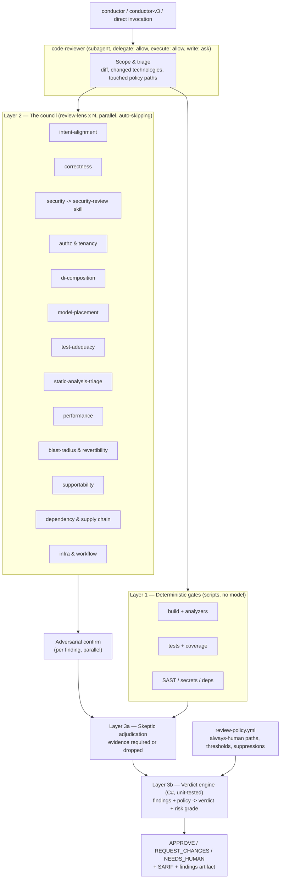

# The Review Council

**Status:** In progress — Phases 0-4 delivered 2026-08-20; Phase 5 partially done
**Date:** 2026-08-20
**Goal:** Rebuild `code-reviewer` from a single serial prompt into a three-layer review
system: a **deterministic gate layer** that runs repeatable scripts (tests, coverage,
static analysis, security scanners), an **agentic council** of specialist lenses that fan
out in parallel over the diff, and a **deterministic verdict engine** — unit-tested code,
not a model — that converts findings into `APPROVE` / `REQUEST_CHANGES` / `NEEDS_HUMAN`.
The skeptic survives as the layer that adjudicates evidence, not as a paragraph of shouting.

---

## 1. Problem

The current reviewer is one agent, one pass, one prompt. Four things are concretely wrong
with it, and three of them are provable from the source rather than a matter of taste.

**1.1 — The reviewer is forbidden from doing what it is instructed to do.**
`products/kyber-squad/agents/code-reviewer.md` binds `capability-profile: reviewer`.
`profiles/capabilities.yml` resolves that profile to `process.execute: deny` and
`delegate: deny`, and `migration/code-reviewer.md` records that as a deliberate
"conservative intersection of effective live permissions". Meanwhile the agent body demands
`dotnet build --no-incremental`, demands to see test output, and its motto is *"Show me the
logs or it didn't happen."* The `code-review` skill goes further and declares a **blocking**
Pre-Merge Test & Coverage Gate at step 7.

On Copilot — the one harness with a real renderer — `CopilotRenderer` lowers
`process.execute: deny` by withholding the `execute` tool from the rendered `tools` flow
sequence. The reviewer cannot run a command. The mandatory gate is unexecutable by
construction, so in practice it is either skipped or, worse, *claimed*. The agent whose
entire purpose is refusing unverified claims is structurally forced to make one.

**1.2 — Every check is serial and every check always runs.**
Thirteen distinct concerns (DI/IoC, STRIDE, analyzer triage, model placement, test padding,
seven per-technology checklists…) are evaluated in one context, in sequence, at one
attention budget. A README typo change pays the same cost as a migration touching auth.

**1.3 — The verdict is a vibe.**
`Verdict: (Approve / Needs Changes)` is produced by the same model that produced the
findings. There is no rule, no threshold, no policy, and nothing to unit-test. Two runs over
the same diff can legitimately disagree and neither is auditable.

**1.4 — Dangling registry references.**
`code-review/SKILL.md` resolves **Test Coverage Config** from the root `AGENTS.md` registry
in four places, and `references/python.md`, `test-dev/references/unit-test-patterns.md`, and
`standards/test/README.md` do the same. That property does not exist — `ConfigRegConfig`
publishes `docs-root`, `documentation-index`, `documentation-ontology`, `component-catalog`,
`standards-root`, `<tech>-coding-standard`, and six folder indexes, and nothing else. The
skill also names a `run-comprehensive-tests` script seven times. No such script exists in
this repository or in the Squad tree. The gate cites a config that is absent and a runner
that was never written.

## 2. What we borrow, and what stays ours

Two published systems solve most of this, and their lessons are directly transferable.

**Rewind's Diff Vader** ([rewind.com](https://rewind.com/blog/ai-approve-pull-requests-safely/))
runs a **council** of a dozen-plus specialist reviewers over each diff simultaneously, each
one *auto-skipping when the diff has nothing for it to look at*. Its load-bearing sentence
is **"The judgment is AI; the gate is not a vibe"** — council members emit findings with
severity and confidence, and a separate unit-tested verdict engine turns those into a
decision. Risk grades come from *what the review found*, not from diff size; a 12-line index
migration outranks a 3,000-line generated client. A CODEOWNERS-protected policy file names
paths that always require a human, and the engine cannot override it. False positives are
suppressed through expiring, re-justified suppressions rather than prompt tinkering. It ships
in stages: shadow → enabled, with a cheap **verifier mode** that re-checks only prior
findings after a fix push.

**Intercom's PR review agent**
([intercom.com](https://www.intercom.com/blog/ai-is-approving-our-pull-requests-heres-how-we-made-it-safe/))
decomposes review into sub-agents and contributes two lenses this repository does not have:
**problem-statement quality** and **diff-to-intent alignment** — does the change actually do
what its author says it does. It also gates on size and scope, refusing to approve a PR that
should have been three PRs.

**What stays ours.** The skeptic. Neither published system has anything like it, and it is
the reason this reviewer is worth keeping. But it gets *operationalized* rather than
recited: the demand for proof becomes a required `evidence` field in a finding schema and a
drop rule in the verdict engine, in the same way `DescriptionScorer` turned "write a good
description" into an auditable 0–100 rubric. Kyber-Weave already ships deterministic,
unit-tested rule engines with permanent `KW-*` ids, severity gating, and SARIF output. A
deterministic verdict engine is not a new kind of thing here — it is the thing this
product already is, applied to review.

## 3. Approved decisions

- **D1 — Widen `reviewer` in place; do not add a review orchestrator.**
  `profiles/capabilities.yml` gains `delegate: allow` and `process.execute: allow` for the
  `reviewer` profile. `code-reviewer` keeps `invocation: subagent` and fans out its own
  council. *(User decision, 2026-08-20.)*
- **D2 — `filesystem.write` for `reviewer` becomes `ask`, not `allow`.**
  The reviewer may write one thing: the findings artifact. The lattice has no path scoping,
  so the restriction is `ask` at the permission layer plus an instruction-only scope to the
  findings path — precisely the pattern `orchestrator` already uses for its folder
  restriction. On harnesses that cannot express `ask`, the lattice safely narrows to `deny`
  and the reviewer returns findings in its response instead of writing a file. That is
  Diff Vader's separation of duties: **the bot never both writes and ships.**
- **D3 — The blanket "subagents may not spawn other agents" rule is removed, and the
  prohibition moves from prose into the permission lattice.** `conductor-v3` currently
  asserts *"none of them can, under the current design"* — that becomes false under D1, and
  a false invariant in an instruction body is worse than no invariant. The replacement rule:
  *a subagent may delegate only to the agents named in its own `delegates-to`, and only when
  its capability profile grants `delegate`.* `architect` keeps `delegate: deny` in the
  `architect` profile, so the architect request/fulfill loop in §2 of both conductors is
  unaffected and stays true — it is now enforced by the profile rather than asserted by
  prose. *(User decision, 2026-08-20.)*
- **D4 — Lenses are content, not canonical agents.** One new canonical agent, `review-lens`,
  is spawned N times with a different lens reference file each time. Thirteen separate
  canonical agents would push the roster from 20 to 33, clutter every harness's agent picker,
  and produce thirteen near-identical descriptions that would collide under
  `KW-AGENT-LINT-001/002` and `KW-SKILL-LINT-011`. As reference files, adding a lens is a
  markdown file, not a deployment.
- **D5 — `code-reviewer` evolves in place; the skill versions to 4.0.0.** No
  `code-reviewer-v2`. The `conductor` / `conductor-v3` pair exists because they are competing
  *philosophies* a user chooses between; this is a capability upgrade with no reason to keep
  the old one selectable. A second review role would guarantee routing collisions across
  `code-review`, `dp-code-reviewer`, and `security-review`. `migration/code-reviewer.md` and
  the body digest are the audit trail.
- **D6 — Gate commands are host-declared, never hardcoded.** The gate layer reads a
  `review:` section in the host's existing `.kyber-weave/kyber-weave.yml`. Hardcoding
  `dotnet test` into a portable artifact is the exact defect
  [2026-08-16-coding-standards-and-config-reg.md](2026-08-16-coding-standards-and-config-reg.md)
  exists to remove, and [portable-artifacts-carry-project-standards](../todo/portable-artifacts-carry-project-standards.md)
  records as open.
- **D7 — Coverage thresholds fold into `review.coverage`.** This retires the dangling
  **Test Coverage Config** name without introducing a replacement name beside it.

> **Revision, 2026-08-20 (during Phase 0).** D6 and D7 originally added two Config Reg
> properties pointing at `.kyber-weave/review-gates.yml` and `review-policy.yml`, and put
> the gate runner in `scripts/run-gates.{sh,ps1}`. Both were wrong, for reasons that only
> surfaced against the code:
>
> 1. `ConfigRegTests.MovingTheDocsRootMovesEveryDerivedEntry` asserts that **every** derived
>    registry entry sits under the documentation root. A built-in pointing into
>    `.kyber-weave/` breaks it, and relaxing that assertion to fit is precisely the "do not
>    widen the ontology to make a failure disappear" prohibition in [`AGENTS.md`](../../AGENTS.md).
> 2. The registry exists for **paths a portable skill must open**. A skill does not need to
>    open the gate config — it needs to *run the gates*. The registry was the wrong
>    instrument for the job.
> 3. A gate runner duplicated across `.sh` and `.ps1` is two implementations of one
>    contract, kept in sync by hope. That is the drift class this product exists to prevent,
>    and the CLI that deploys the Squad is present in every host by construction.
>
> **Revised:** no new registry properties. Review configuration is a `review:` section in
> `.kyber-weave/kyber-weave.yml`, and the runner is a CLI verb, `kyber-weave review gates`,
> alongside `docs validate` and `skill scan`. Portable artifacts reach the gates by running
> them, never by resolving a path.

- **D8 — Triage is a role, not a discount.** A second lens agent, `review-triage`, carries
  `model-profile: fast` — Luna on Codex and Copilot, Haiku on Claude. It takes the lenses
  whose input is a machine artifact and whose work is *attributing* that artifact to the
  change: `static-analysis-triage` and `dependency-supply-chain`. Everything else stays on
  `review-lens`.

  Three things make this a role split rather than a cost hack. The task is genuinely
  different in kind — attribution against a tool's output is bounded and checkable, where
  judging code is neither — so the two bodies say different things rather than one being a
  cheaper copy of the other. The agent is named for what it does, not what it costs, because
  a model tier is an implementation detail and roles outlive it. And the split is deliberately
  *small*: only two of thirteen lenses qualify, and the eleven that do not would produce worse
  findings on a fast model, which costs far more than it saves.

  `static-analysis-triage` alone justifies the role. It applies to nearly every change that
  builds, and it carries the largest input of any lens — a full analyzer run — so it is
  simultaneously the most mechanical seat on the council and the most frequently expensive
  one. *(User decision, 2026-08-20.)*

## 4. Architecture



Gates and council start together — the gates are I/O-bound and the council does not wait on
them. Two lenses are downstream: `test-adequacy` consumes the coverage report and
`static-analysis-triage` consumes the analyzer output, so those two run in a second wave as
their gate completes rather than behind a barrier on all gates.

## 5. Permission changes

`products/kyber-squad/profiles/capabilities.yml`, `reviewer` profile:

| Capability | Today | New | Why |
|---|---|---|---|
| `filesystem.read` | allow | allow | — |
| `filesystem.search` | allow | allow | — |
| `filesystem.write` | deny | **ask** | D2 — findings artifact only, scoped by instruction |
| `process.execute` | deny | **allow** | Layer 1 gates; makes the existing blocking gate real |
| `network.read` | allow | allow | — |
| `network.publish` | deny | deny | The reviewer posts nothing; a human or CI ships |
| `delegate` | deny | **allow** | Layer 2 council fan-out |

`migration/code-reviewer.md` must record this as a deliberate widening away from the locked
source-commit intersection, with the reason, or the migration record becomes a lie about
what the permissions mean.

**Honest limitation.** Only `CopilotRenderer` exists today; the other nine targets fail in
preflight ([kyber-squad-renderer-coverage](../todo/kyber-squad-renderer-coverage.md)). On
Copilot these three changes lower to real tools (`execute`, `edit`, `agent`) and are
enforced. Everywhere else the council is instruction-only until that target's renderer lands,
and it must be described that way rather than claimed as deployed.

## 6. The council

Thirteen lenses, one reference file each, under
`products/kyber-squad/skills/code-review/references/lenses/`. Every lens file declares an
**applicability predicate** as its first section — the lens returns `SKIPPED` with a
one-line reason when the diff contains nothing it owns. Auto-skip is what makes thirteen
lenses affordable.

| Lens | Owns | Source |
|---|---|---|
| `intent-alignment` | Does the diff do what the PR/commit/plan says? Is the problem statement adequate? Should this be three PRs? | New — Intercom |
| `correctness` | Logic, control flow, edge cases, error paths | Existing universal dimension |
| `security` | Invokes the `security-review` skill; does not restate its methodology | Existing skill, unchanged |
| `authz-tenancy` | STRIDE per endpoint, IDOR, per-access authorization, tenant isolation | Existing agent §10 |
| `di-composition` | No `new` on injectable types, constructor injection, DI registration verified, service-locator anti-patterns | Existing agent §6b — a genuine differentiator, preserved verbatim |
| `model-placement` | Type classification against `<csharp-coding-standard>`; DTO in Domain, entity with no invariant, persistence row across the adapter boundary | Existing agent §6a |
| `test-adequacy` | Behavior vs implementation testing, coverage ROI, getter/setter tests padding coverage | Existing agent §6a + skill step 7 |
| `static-analysis-triage` | Every analyzer/linter finding in changed files, by rule id | Existing agent §9, now fed by real gate output |
| `performance` | N+1, hot paths, blocking I/O, allocation in loops, missing indexes | Existing universal dimension |
| `blast-radius-revertibility` | What else breaks, is it revertible, migrations, feature flags, breaking API changes | New — Diff Vader |
| `supportability` | Structured logging, correlation ids, errors that do not leak internals | Existing agent §10 incident readiness |
| `dependency-supply-chain` | New dependencies justified, pins, advisories | New — Diff Vader, and this repository's own "new dependencies need justification" rule |
| `infra-workflow` | Pulumi, Azure, GitHub Actions, SQL migrations | Existing `references/{pulumi,azure,github-actions,sql}.md` |

The seven existing per-technology reference files stay where they are and become **lens
modifiers**: a lens loads the checklists for the technologies actually present in the diff.

Every lens returns findings in one schema, `review-finding/v1`:

```yaml
id: <lens>/<slug>
lens: di-composition
severity: critical | major | minor
confidence: 1-10
file: src/Foo/Bar.cs
line: 42
excerpt: "_client = new HttpClient();"      # verbatim, required
claim: "HttpClient is constructed inside the class rather than injected."
evidence: "src/Foo/Bar.cs:42" | "gate:dotnet-test#3" | "cmd:<digest>"   # required
failure_scenario: "Socket exhaustion under load; no handler rotation."
suggestion: "Inject IHttpClientFactory via the constructor and register it in Program.cs."
```

`excerpt` and `evidence` are **required**. A finding without them never reaches the verdict
engine. That single constraint is the skeptic, expressed as a schema.

## 7. Layer 1 — the deterministic gate layer

New CLI verb `kyber-weave review gates`, reading the `review:` section of the host's
`.kyber-weave/kyber-weave.yml` (D6) and executing each declared gate, normalizing every
result to one `gates.json`:

```yaml
review:
  coverage:
    fileLinePercent: 85
    classLinePercent: 85
  gates:
  - id: build
    command: dotnet build KyberWeave.sln -c Release
    blocking: true
  - id: test-coverage
    command: dotnet test -c Release --collect:"XPlat Code Coverage"
    blocking: true
    parser: cobertura
  - id: docs-validate
    command: dotnet run --project src/KyberWeave.Cli -- docs validate .
    blocking: true
  - id: skill-scan
    command: dotnet run --project src/KyberWeave.Cli -- skill scan .apm/skills/kyber-weave-docs
    blocking: true
  applies-when:
    azure-integration: paths matching src/**/Azure/**
```

Two properties of this design matter more than the file format. Gates are **repeatable** —
the same diff produces the same `gates.json`, which is what makes them safe to cite as
evidence. And gates are **the host's**, so this repository's own four-command gate set from
[`AGENTS.md`](../../AGENTS.md) is expressible without the skill knowing anything about
Kyber-Weave.

`kyber-weave review gates` is the single declared entry point through which the reviewer
exercises `process.execute`. That is the instruction-only scope on the widened permission —
the lattice grants the capability, and the instruction narrows what it is used for.

## 8. Layer 3 — the verdict engine

New CLI verb, backed by `KyberWeave.Core`, reporting through the existing Diagnostics engine
(stable ids, severity gating, SARIF — the CI Pipelines component):

```bash
kyber-weave review verdict --findings findings.json --gates gates.json --policy .kyber-weave/review-policy.yml
```

Deterministic rules, unit-tested, in evaluation order. New `KW-REVIEW-*` ids — permanent,
never renumbered, per the non-negotiable in [`AGENTS.md`](../../AGENTS.md):

1. Any touched path matching `always-human` in the policy → **`NEEDS_HUMAN`**, unconditionally,
   before findings are even considered. The engine cannot override the policy file.
2. Diff exceeds `max-reviewable-lines` → **`NEEDS_HUMAN`**. An attention limit, not a risk
   signal — Diff Vader is explicit that size is not risk.
3. Any blocking gate failed → **`REQUEST_CHANGES`**, citing the gate id and the exact failure.
4. Any confirmed `critical` finding → **`REQUEST_CHANGES`**.
5. `major` count ≥ policy threshold → **`REQUEST_CHANGES`**.
6. Otherwise → **`APPROVE`**, with a risk grade.

**Risk grade** (`LOW` / `MEDIUM` / `HIGH`) derives from what the lenses found and which paths
were touched — never from line count.

`review-policy.yml`, the file the engine may not override:

```yaml
schema: kyber-weave.review-policy/v1
always-human:
  - "**/auth/**"
  - "**/*secret*"
  - "**/*crypto*"
  - ".kyber-weave/review-policy.yml"          # changes to the gate need a human
  - "products/kyber-squad/profiles/capabilities.yml"   # permission changes need a human
  - "products/kyber-squad/agents/**"                   # instruction surfaces need a human
max-reviewable-lines: 10000
thresholds:
  major-count-blocks: 3
  min-confidence: 7
suppressions:
  - id: correctness/nullable-warning-in-generated
    reason: "Generated client, tracked in docs/todo/..."
    expires: 2026-11-18                        # 90 days, re-justify or it returns
```

The three Kyber-Weave-specific `always-human` entries are the important ones: the artifacts
that govern what agents may do must not be approvable by an agent.

**Suppressions expire after 90 days** unless re-justified. A permanent suppression is how a
review system quietly stops reviewing.

## 9. The skeptic, operationalized

The current body's demands become mechanisms:

| Today (prose) | New (mechanism) |
|---|---|
| "If the Agent says it builds, demand to see the build logs" | Gate layer runs the build; a claim without a matching `gates.json` entry is a `critical` finding, `evidence: absent` |
| "Show me the exact output that proves this is fixed" | `evidence` is a required schema field; findings without it are dropped before the verdict engine |
| "Call out when the Agent hasn't run commands they claim to have run" | `intent-alignment` lens diffs the stated claims against `gates.json` and the actual diff |
| "That's a workaround, not a proper implementation" | `di-composition`, `model-placement`, and `blast-radius` lenses, each with a concrete predicate |
| "Never let the Agent skip the hard parts" | Auto-skip is *declared per lens with a reason*, not silent; the report lists every skipped lens and why |

Additionally, the adversarial false-positive pass that `security-review` already runs
(parallel sub-tasks per finding, hard exclusion list, confidence ≥ 8) is **generalized to
every lens**. That skill's exclusion list and precedents are the reference implementation and
are not re-derived per lens.

## 10. Modes

Borrowed wholesale from Diff Vader, and they are the rollout plan as much as a feature:

| Mode | Behavior |
|---|---|
| `shadow` | Full run, verdict emitted, gates nothing. The calibration phase. |
| `enabled` | The verdict gates. |
| `verifier` | After a fix push, re-checks only the prior findings. ~10× cheaper than a full council. |
| `full` | Forces a complete council re-scan regardless of prior state. |

`dp-code-reviewer` is rewritten as the **verifier-mode loop** and keeps its name and its
place in the bundle. Its current body is a five-iteration loop whose description
(*"Orchestrates the code review cycle between development agents and the code-reviewer
agent."*) is a pure action summary with no trigger clause and no negative boundary — it
scores near zero on the `DescriptionScorer` rubric and would fail `KW-SKILL-LINT-007`. The
rewrite fixes that as a side effect.

## 11. Artifact inventory

**Changed**

| Path | Change |
|---|---|
| `products/kyber-squad/profiles/capabilities.yml` | `reviewer`: write→ask, execute→allow, delegate→allow (§5) |
| `products/kyber-squad/agents/code-reviewer.md` | Body becomes orchestration + skeptic adjudication; the thirteen concern blocks move out to lens files; `delegates-to` gains `review-lens` |
| `products/kyber-squad/migration/code-reviewer.md` | Record the permission widening and the new body digest |
| `products/kyber-squad/agents/conductor.md` + `skills/conductor/SKILL.md` | D3 rule replacement — **bodies are byte-identical (verified `4ec2cb1b…`); both files must receive the identical edit or the shared-identity invariant breaks** |
| `products/kyber-squad/agents/conductor-v3.md` + `skills/conductor-v3/SKILL.md` | Same, digest `452b2726…`. Lines 32, 38, 62 of the agent and 29, 35, 59 of the skill |
| `products/kyber-squad/agents/architect.md`, `architect-v3.md` | Line 18 reworded: cannot delegate *because the `architect` profile denies it*, not because subagents categorically cannot |
| `products/kyber-squad/skills/code-review/SKILL.md` | v3.2.0 → 4.0.0; step 7 rewritten against the real gate runner; `Test Coverage Config` → `<review-gates-config>` |
| `products/kyber-squad/skills/dp-code-reviewer/SKILL.md` | Rewritten as verifier mode; description gains trigger clause + negative boundary |
| `products/kyber-squad/skills/code-review/references/python.md` | Retire `Test Coverage Config` reference |
| `products/kyber-squad/skills/test-dev/references/unit-test-patterns.md` | Same, two occurrences |
| `products/kyber-squad/standards/test/README.md` | Same |
| `products/kyber-squad/bundles/full.yml` | `+ review-lens` |
| `REVIEW.md` | Currently a stray duplicate of agent §9–10 with a broken bullet; fold into the lens files or delete |

**Added**

| Path | Contents |
|---|---|
| `products/kyber-squad/agents/review-lens.md` | The judgement lens agent (D4), `model-profile: general` |
| `products/kyber-squad/agents/review-triage.md` | The triage lens agent (D8), `model-profile: fast` |
| `…/skills/code-review/references/lenses/*.md` | Thirteen lens files (§6) |
| `src/KyberWeave.Core/Review/**` | Gate runner, finding schema, policy model, verdict engine, `KW-REVIEW-*` rules |
| `src/KyberWeave.Cli/Commands/Review/**` | `kyber-weave review gates`, `kyber-weave review verdict` |
| `tests/KyberWeave.Tests/ReviewVerdictTests.cs` | The engine is testable *because* it is not a model — table-driven over findings × policy → verdict |

**Count sweep.** 20 agents → 22 (`review-lens`, `review-triage`). Hardcoded in prose at `README.md:146,147,149,210`,
`products/kyber-squad/README.md:4,34`, `docs/README.md:119`, `docs/distribution.md:68`, and
in the "20 agents + 23 non-conductor skills = 43" verification line of all nine renderer
todo pages. Mechanical, but it must be one sweep or `docs drift` will find the stragglers.

## 11a. Delivered, and where the code disagreed with the plan

Phases 0 through 4 landed on 2026-08-20. Four things came out differently from §1-§11, each
because building it surfaced something the plan could not see:

- **Gate commands are argv, not command lines.** `ProcessRunner` refuses a shell and refuses
  a concatenated argument string, deliberately. So `review.gates[].run` is a list —
  `[dotnet, test, -c, Release]` — and a host cannot express a pipeline or a redirect. That is
  a real loss of expressiveness bought for a real gain: there is no path by which a value in
  a diff, a finding, or a lens prompt becomes part of a command line. The plan's
  `command: dotnet test -c Release` string would have quietly reopened that.
- **The policy is a section, not a second file.** `review-policy.yml` became `review.policy`
  inside the same `review:` block, for the same reason the registry properties were dropped:
  one configuration home beats three, and the CODEOWNERS protection the plan wanted from a
  separate file is a repository concern rather than a code one — this repository instead
  reserves the config path in its own `always-human` list, so a change to the gate escalates
  through the gate.
- **Coverage never blocks.** §8 left this ambiguous. It resolved to reported-only: a verdict
  driven by a coverage number rewards padding the number, which is precisely the defect the
  `test-adequacy` lens exists to catch. `KW-REVIEW-010` is a warning and cannot change a
  verdict.
- **The lens tier split needed a second agent, not a schema change.** §14 left open whether
  mechanical lenses could run cheaper. They can, but `model-profile` is per-agent, so the
  answer was `review-triage` (D8) rather than an `agent.schema.json` change or the thirteen
  agents D4 rejected. Two lenses moved; eleven did not.
- **A net-new agent carries no migration record.** `review-lens` is the first canonical agent
  authored after the migration, and the migration machinery assumed every agent was
  reconciled from live harness copies at a locked commit. Fabricating a `selected-baseline`
  for it would have put a false provenance claim in the one place provenance has to be
  trustworthy, so `SquadCanonicalContentTests` now distinguishes `ExpectedMigratedAgents`
  from `ExpectedNewAgents` and asserts that a net-new agent has **no** migration record.

## 12. Phases

Each phase is independently shippable, and the ordering front-loads the parts that need no
C#.

- **Phase 0 — Unblock and de-lie. ✅ Done.** §5 permission change, D3 rule replacement across the six
  instruction files, retire the `Test Coverage Config` and `run-comprehensive-tests`
  references. After this the artifacts stop claiming things that are not true. *No new
  capability yet.*
- **Phase 1 — The council. ✅ Done.** `review-lens` agent, thirteen lens files, `code-review` v4.0.0
  rewritten as orchestration + fan-out, adversarial confirm generalized from
  `security-review`. **Markdown only — no code, no CLI.** This is where most of the review
  quality gain lands, and it is deliverable on its own.
- **Phase 2 — The gate layer. ✅ Done.** `kyber-weave review gates`, the `review:` config section,
  this repository's own four-command gate set declared in its config. The blocking gate
  becomes real for the first time.
- **Phase 3 — The verdict engine. ✅ Done.** `KyberWeave.Core/Review`, `KW-REVIEW-*` ids, the CLI
  verb, SARIF output, table-driven tests. "The gate is not a vibe."
- **Phase 4 — Policy and modes. ✅ Done** (measurement and cost ceilings excepted — see §14). `review-policy.yml` with the three Kyber-Weave
  `always-human` entries, expiring suppressions, shadow/enabled/verifier/full.
- **Phase 5 — Sweep and gates. ◐ Partial** — count sweep, rule reference, and all repository gates are green; the renderer-side verification below is still open. Count sweep, `docs validate`, `docs drift`,
  `agent validate`, `agent scan`, `skill validate`, `skill lint`, `skill scan`, full test run.

## 13. Verification

Beyond the standard gates in [`AGENTS.md`](../../AGENTS.md):

- `skill lint` over the changed skills must not regress `KW-SKILL-LINT-011` (description
  overlap). `code-review` v4, `security-review`, and `dp-code-reviewer` now sit closer
  together in vocabulary; if overlap fires, the fix is sharper negative boundaries, not
  merging the skills.
- `review-lens` and `code-reviewer` descriptions must clear `KW-AGENT-LINT-001` (≥ 50) and
  `KW-AGENT-LINT-002` (trigger phrasing). Use the `writing-trigger-descriptions` skill.
- `agent scan` over the new bodies — the lens files are instruction surfaces and are in scope
  for [instruction-surface scanning](../context-hygiene/security-scanning.md).
- Byte-identity of `conductor` / `conductor-v3` agent and skill bodies must hold after the D3
  edit. Assert it, do not eyeball it:
  `awk 'f{print} /^---$/{c++; if(c==2) f=1}' <file> | shasum -a 256` over both, compared.
- A real end-to-end run in `shadow` mode against a branch with a known-bad diff, confirming
  the verdict engine returns `REQUEST_CHANGES` for the right reason and `NEEDS_HUMAN` for a
  diff touching `profiles/capabilities.yml`.

## 14. Risks and open questions

- **Cost.** Diff Vader reports ~$0.73/PR with a dozen-plus reviewers. Thirteen lenses plus a
  per-finding adversarial pass is not free. Auto-skip, verifier mode, and a per-repo ceiling
  in `review-policy.yml` are the mitigations; the measurement to confirm them does not exist
  yet and is not in this plan.
- **The widened `process.execute` is real everywhere.** The lattice grants the capability;
  the "only through `run-gates`" scope is instruction-only, exactly like the conductor's
  folder restriction. Accepted as a deliberate trade under D1, and it is the reason
  `filesystem.write` stays at `ask` rather than following it to `allow`.
- **Nine of ten harnesses cannot enforce any of this yet.** Only `CopilotRenderer` exists.
  Everywhere else the council and the permission narrowing are aspirational until the
  renderers in [kyber-squad-renderer-coverage](../todo/kyber-squad-renderer-coverage.md)
  land. This plan does not fix that and should not claim to.
- **Resolved 2026-08-20 — mechanical lenses run on the `fast` profile.** `model-profile` is
  per-agent and there is one `review-lens`, so the tier split needed a second role rather
  than a schema change or thirteen agents. See D8.
- **Open — is `REVIEW.md` at the repository root dead?** It duplicates agent §9–10, contains
  a duplicated bullet and a stray `*`, and nothing references it. Confirm before deleting.
