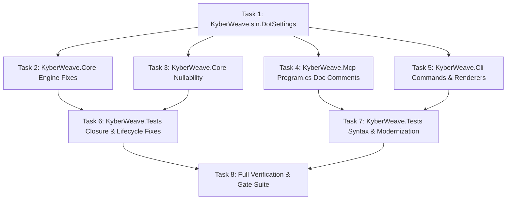

# Fix InspectCode Warnings and Triage Suggestions

**Status:** Complete  
**Date:** 2026-08-21  
**Goal:** Resolve all actionable JetBrains InspectCode warnings and high-value code suggestions across `KyberWeave.sln`, establish `KyberWeave.sln.DotSettings` to cleanly filter framework reflection, DTO, and test naming noise, and verify zero regressions across all build, test, and documentation gates.

---

## 1. Problem / Motivation

Running JetBrains InspectCode CLI (`dotnet jb inspectcode KyberWeave.sln --output=artifacts/inspectcode.xml --format=Xml`) produces ~500+ findings across 34 inspection types. 

These findings fall into three distinct classes:
1. **Actionable Code Quality Deficiencies & Bugs**:
   - Syntax/doc errors (e.g. 24 invalid XML doc comments on lambda statements in `KyberWeave.Mcp`).
   - Namespace-to-directory misalignment in `KyberWeave.Tests/Squad/CopilotRendererTests.cs`.
   - Test closure lifecycle hazards (`AccessToDisposedClosure`, `AccessToModifiedClosure`) where test delegates capture disposable temp directories or contexts across execution boundaries.
   - Resource disposal hazards (`UsingStatementResourceInitialization`) where property initializers execute outside `using` exception protection.
   - Performance & pattern issues (`PossibleMultipleEnumeration`, `ConvertTypeCheckPatternToNullCheck` `is object` -> `is not null`).
   - Dead code and redundancies (`UnusedVariable`, `UnusedMember.Local`, `NotAccessedField.Local`, `RedundantAssignment`, `RedundantUsingDirective`, `RedundantNameQualifier`, `RedundantSuppressNullableWarningExpression`, `RedundantArgumentDefaultValue`, `RedundantTypeArgumentsOfMethod`, `RedundantSwitchExpressionArms`, `RedundantEnumerableCastCall`, `PartialTypeWithSinglePart`).
2. **Type Safety & Nullability Tightening Opportunities**:
   - `VariableCanBeNotNullable` & `ReturnTypeCanBeNotNullable` where variables or returns declared nullable `T?` are proven non-null in all paths.
   - `ConditionIsAlwaysTrueOrFalseAccordingToNullableAPIContract`, `ConditionalAccessQualifierIsNonNullableAccordingToAPIContract`, `NullCoalescingConditionIsAlwaysNotNullAccordingToAPIContract` where defensive null checks conflict with verified non-nullable contracts.
3. **Framework Reflection & Domain DTO False Positives (Noise)**:
   - Spectre.Console CLI settings (`*Settings.cs`) and YamlDotNet model classes (`*YamlSection.cs`) have properties and collection setters populated dynamically via reflection at runtime, which static analyzers flag as unused.
   - Positional record properties on DTO and exchange schema types (e.g. `AgentLoadResult.Path`, `ReviewRubricLabel.Label`, `CodeGraphNode.Language`) declared for API completeness and serialization round-tripping.
   - Test method naming standards that embed uppercase rule identifiers (e.g. `MissingFrontmatterIsSPEC001`, `WithoutOverrideMissingHarnessRoleEmitsKWAGENTSYNC001`), which is mandatory per `<test-coding-standard>`.

Without a solution-level DotSettings configuration and targeted code fixes, static analysis noise obscures real regressions and prevents InspectCode from serving as an automated quality gate in the review council.

---

## 2. Approved decisions

- **D1:** Introduce a solution-level `KyberWeave.sln.DotSettings` file committed to the repository root. This file suppresses framework-induced reflection false positives (`UnusedAutoPropertyAccessor.Global` on CLI settings, `CollectionNeverUpdated.Global` on YAML sections), schema DTO positional property warnings (`NotAccessedPositionalProperty.Global`), uppercase rule identifiers in test method names (`InconsistentNaming`), and defensive precondition inspections (`ParameterOnlyUsedForPreconditionCheck.Local`, `EntityNameCapturedOnly.Local`).
- **D2:** Categorize and triage all InspectCode findings into:
  - **Actionable Warnings / Code Fixes (High Value)**: Fix directly in source files across `KyberWeave.Core`, `KyberWeave.Cli`, `KyberWeave.Mcp`, and `KyberWeave.Tests`.
  - **Type Safety & Nullability Tightening (Recommended to Do)**: Narrow nullable annotations (`T?` to `T`), eliminate redundant null checks, and align test null assignments.
  - **Noise / False Positives**: Filtered via `KyberWeave.sln.DotSettings` so no source-code `#pragma` or `[SuppressMessage]` clutter is introduced.
- **D3:** Strict compliance with repository coding standards (`AGENTS.md`, `docs/standards/csharp/README.md`, `docs/standards/test/README.md`):
  - `TreatWarningsAsErrors` remains enabled with `AnalysisMode=all` in `Directory.Build.props`.
  - No suppression added to `NoWarn` in `Directory.Build.props`.
  - Explicit types (never `var`), file-scoped namespaces, and Allman braces are preserved.
  - Test naming asserting observable guarantees is preserved.
- **D4:** Verification contract: Full clean build under Release configuration, 100% test suite pass rate, zero actionable warnings/errors in InspectCode XML output, clean `dotnet format`, and zero documentation validation findings (`docs validate .`).

---

## 3. Investigation findings

1. **Solution & Tools Inventory**:
   - Pinned tool: `jetbrains.resharper.globaltools` version `2026.2.1` in `.config/dotnet-tools.json`.
   - Solution: `KyberWeave.sln` containing `KyberWeave.Core`, `KyberWeave.Cli`, `KyberWeave.Mcp`, `KyberWeave.Tests`.
   - Report baseline: `artifacts/inspectcode.xml` contains 557 lines of XML detailing 34 issue types.
2. **Issue Type Categorization Matrix**:

| Issue Type | InspectCode Category | Triage Category | Resolution Strategy |
|---|---|---|---|
| `CheckNamespace` | Constraints Violations | Actionable Fix | Update namespace in `CopilotRendererTests.cs` to match directory structure. |
| `InvalidXmlDocComment` | Potential Code Quality | Actionable Fix | Convert invalid `///` doc comments on lambda statements in `Program.cs` to standard `//` comments. |
| `AccessToDisposedClosure` | Potential Code Quality | Actionable Fix | In test closures, capture `tempDir.Path` into local string variables before entering lambda/action delegates. |
| `AccessToModifiedClosure` | Potential Code Quality | Actionable Fix | Isolate captured variables in test loops/delegates. |
| `UsingStatementResourceInitialization` | Potential Code Quality | Actionable Fix | Assign properties inside `using` block rather than in object initializer. |
| `PossibleMultipleEnumeration` | Potential Code Quality | Actionable Fix | Materialize enumerables with `.ToArray()` / `.ToList()` prior to multiple enumerations. |
| `ConvertTypeCheckPatternToNullCheck` | Potential Code Quality | Actionable Fix | Replace `is object` / `is T` with modern `is not null` pattern. |
| `RedundantSwitchExpressionArms` | Redundancies in Code | Actionable Fix | Remove unreachable/redundant switch expression arms in `SquadTransaction.cs`. |
| `RedundantEnumerableCastCall` | Redundancies in Code | Actionable Fix | Remove redundant `.Cast<T>()` calls in `IgnoreMarkupReader.cs`. |
| `RedundantNameQualifier` | Redundancies in Code | Actionable Fix | Remove redundant namespace qualifications across CLI, Core, and Tests. |
| `RedundantSuppressNullableWarningExpression` | Redundancies in Code | Actionable Fix | Remove unnecessary `!` operators where compiler knows target is not null. |
| `RedundantArgumentDefaultValue` | Redundancies in Code | Actionable Fix | Remove arguments that match default parameter values. |
| `RedundantTypeArgumentsOfMethod` | Redundancies in Code | Actionable Fix | Remove explicit generic arguments where compiler infers them. |
| `RedundantUsingDirective` | Redundancies in Code | Actionable Fix | Remove unused usings. |
| `RedundantAssignment` | Redundancies in Code | Actionable Fix | Remove dead variable assignments in `KyberStandardsTemplates.cs` and `SquadDeploymentStateTests.cs`. |
| `UnusedVariable` | Redundancies in Symbols | Actionable Fix | Remove unused local variables in `HostConfigYaml.cs`, `SquadSourceLoader.cs`, `AgentGovernanceTests.cs`. |
| `UnusedMember.Local` | Redundancies in Symbols | Actionable Fix | Remove unused private methods/constructors in `ManagedGlossaryService.cs`, `SquadTransaction.cs`, `SquadDeploymentStateTests.cs`. |
| `NotAccessedField.Local` | Potential Code Quality | Actionable Fix | Remove unused private fields `_userPaths` in `SquadDoctorCommand`, `_executor` in `SquadPackCommand`. |
| `PartialTypeWithSinglePart` | Redundancies in Symbols | Actionable Fix | Remove `partial` modifier on types that do not have generated regexes or multiple parts. |
| `VariableCanBeNotNullable` | Potential Code Quality | Recommended to Do | Declare local variables as non-nullable `T` instead of `T?`. |
| `ReturnTypeCanBeNotNullable` | Potential Code Quality | Recommended to Do | Declare method return types as non-nullable `T` where return is never null. |
| `ConditionIsAlwaysTrueOrFalse...` | Redundancies in Code | Recommended to Do | Clean up redundant null checks and impossible conditions. |
| `ConditionalAccessQualifierIs...` | Redundancies in Code | Recommended to Do | Replace `x?.Prop` with `x.Prop` where `x` is proven non-null. |
| `NullCoalescingConditionIsAlways...` | Redundancies in Code | Recommended to Do | Replace `x ?? fallback` with `x` where `x` is proven non-null. |
| `AssignNullToNotNullAttribute` | Constraints Violations | Recommended to Do | Use explicit dummy values or `#pragma` / `null!` specifically on test cases asserting argument null checks. |
| `UnusedAutoPropertyAccessor.Global` | Potential Code Quality | Noise (Configure) | Suppress via DotSettings: Spectre CLI settings and YamlDotNet properties set via reflection. |
| `CollectionNeverUpdated.Global` / `.Local` | Potential Code Quality | Noise (Configure) | Suppress via DotSettings: YamlDotNet collections and fake test collections populated dynamically. |
| `NotAccessedPositionalProperty.Global` | Potential Code Quality | Noise (Configure) | Suppress via DotSettings: Positional record properties representing complete schema contracts. |
| `InconsistentNaming` | Constraints Violations | Noise (Configure) | Suppress via DotSettings for test methods matching uppercase rule IDs and local constants. |
| `ParameterOnlyUsedForPreconditionCheck.Local` | Redundancies in Symbols | Noise (Configure) | Suppress via DotSettings: Defensive guard clauses are deliberate architecture. |
| `EntityNameCapturedOnly.Local` | Redundancies in Symbols | Noise (Configure) | Suppress via DotSettings: `nameof()` captures for validation messages. |
| `MemberHidesStaticFromOuterClass` | Potential Code Quality | Noise (Configure) | Suppress via DotSettings where nested record properties match outer helper names. |

---

## 4. Task list

| # | Phase | Component | Description | Skills |
|---|---|---|---|---|
| 1 | Phase 1 | Tooling & Solution Settings | Create `KyberWeave.sln.DotSettings` configuring inspection severities to `DO_NOT_SHOW` or `HINT` for reflection-bound properties, schema DTO properties, test naming rules, and defensive precondition checks. | `csharp`, `resharper` |
| 2 | Phase 2 | `KyberWeave.Core` (Engine Fixes) | Fix redundant casts (`IgnoreMarkupReader.cs`), unreachable switch arms (`SquadTransaction.cs`), modernize `is object` to `is not null` (`SqliteAnalysisPersistence.cs`), remove unused variables (`HostConfigYaml.cs`, `SquadSourceLoader.cs`), remove dead private members (`ManagedGlossaryService.cs`, `SquadTransaction.cs`), and remove redundant `partial` modifiers (`AgentSyncLinter.cs`, `SkillReviewExchange.cs`). | `csharp` |
| 3 | Phase 2 | `KyberWeave.Core` (Nullability & Redundancies) | Tighten `VariableCanBeNotNullable` and `ReturnTypeCanBeNotNullable` across `DocumentationAnalyzer.cs`, `DocGraphProjection.cs`, `EmbeddingCandidateBuilder.cs`, `CopilotRenderer.cs`, and `ManagedGlossaryGraphContributor.cs`. Eliminate redundant null checks (`ConditionIsAlwaysTrueOrFalse...`, `NullCoalescingConditionIsAlways...`, `ConditionalAccessQualifierIs...`). | `csharp` |
| 4 | Phase 3 | `KyberWeave.Mcp` | Convert 24 invalid XML doc comments on lambda statements in `src/KyberWeave.Mcp/Program.cs` to standard `//` comments. | `csharp` |
| 5 | Phase 3 | `KyberWeave.Cli` | Remove unused fields `_userPaths` in `SquadDoctorCommand.cs` and `_executor` in `SquadPackCommand.cs`. Clean up redundant name qualifiers in `CatalogCommand.cs`, `PackCommand.cs`, `RouteCommand.cs`, `SquadPackCommand.cs`, `ReportRenderer.cs`. Tighten `VariableCanBeNotNullable` and `ReturnTypeCanBeNotNullable`. | `csharp` |
| 6 | Phase 4 | `KyberWeave.Tests` (Closures & Lifecycles) | Fix `AccessToDisposedClosure` and `AccessToModifiedClosure` in `SquadDeploymentStateTests.cs`, `DocumentationAnalysisScaleTests.cs`, `SquadCliCommandTests.cs`, and `SquadReleaseClientTests.cs` by extracting local value copies (e.g. `string path = tempDir.Path;`) before lambda scopes. | `csharp`, `xunit` |
| 7 | Phase 4 | `KyberWeave.Tests` (Syntax, Modernization & Nulls) | Align namespace in `Squad/CopilotRendererTests.cs` to `KyberWeave.Tests.Squad`. Fix `UsingStatementResourceInitialization` in `EmbeddingClientTests.cs` and `SquadReleaseClientTests.cs`. Materialize `PossibleMultipleEnumeration` in `CopilotRendererTests.cs`. Resolve `AssignNullToNotNullAttribute` in test assertions. Remove dead code, redundant qualifiers, and redundant type arguments. | `csharp`, `xunit` |
| 8 | Phase 5 | Verification & Gate Validation | Run `dotnet build KyberWeave.sln -c Release`, `dotnet test tests/KyberWeave.Tests/KyberWeave.Tests.csproj -c Release`, `dotnet jb inspectcode KyberWeave.sln --output=artifacts/inspectcode.xml --format=Xml`, `dotnet format KyberWeave.sln whitespace --verify-no-changes`, `dotnet format KyberWeave.sln style --verify-no-changes`, and `dotnet run --project src/KyberWeave.Cli -- docs validate .`. | `csharp`, `cli-testing` |

---

## 5. Sequencing / dependency graph



### Dependency Rules:
1. **Task 1 (`DotSettings`)** must be established first so that test runs and InspectCode passes can be evaluated against the stable, noise-filtered inspection profile.
2. **Tasks 2 & 3 (`KyberWeave.Core`)** must precede test updates in case signature tightenings affect test call sites.
3. **Tasks 4 & 5 (`KyberWeave.Mcp` & `KyberWeave.Cli`)** run independently and concurrently with Core fixes.
4. **Tasks 6 & 7 (`KyberWeave.Tests`)** run after Core/CLI/MCP changes to ensure test contracts reflect updated non-nullable signatures and clean closures.
5. **Task 8 (Verification)** runs as the final quality gate after all edits are completed.

---

## 6. Residual decisions / risks

- **Risk 1: Breaking reflection binding in Spectre.Console or YamlDotNet.**
  - *Mitigation*: The DotSettings configuration suppresses analyzer warnings on property setters rather than removing or making properties private. No property modifiers or accessors on CLI settings or YAML sections are removed.
- **Risk 2: Breaking null checks on external boundaries.**
  - *Mitigation*: Nullability tightening is applied strictly where callers and implementations are internal and verified non-null. External input boundaries (CLI arguments, file loaders, YAML deserializers) retain defensive guards.
- **Risk 3: Test closure refactoring masking assertion behavior.**
  - *Mitigation*: Extracting `string path = tempDir.Path;` preserves exact string values while preventing delegates from capturing the `IDisposable` container itself. All test assertions remain functionally identical.

---

## 7. Out of scope

- Modifying existing compiler `NoWarn` entries in `Directory.Build.props`.
- Modifying Sonar analyzer rules in `.editorconfig` (handled via DotSettings for InspectCode).
- Refactoring architecture or runtime behavior of `SquadTransaction` or `DocumentationAnalyzer` beyond static analysis warning fixes.
- Modifying governed documentation ontology or rule IDs.

---

## 8. Required skills

- `csharp`: Expert knowledge of C# 12/13, nullable reference types, pattern matching, XML documentation standards, and MSBuild.
- `resharper`: Understanding of JetBrains ReSharper / InspectCode inspection IDs, DotSettings XML format, and severity management.
- `xunit`: Knowledge of xUnit test lifecycle, assertion models, and closure capture semantics.
- `cli-testing`: Execution of .NET CLI tools (`dotnet test`, `dotnet format`, `dotnet jb inspectcode`, `docs validate`).

---

## 9. Verification harness

Before this work is accepted as complete, the following gates must execute and pass with zero errors:

1. **Build Gate (`TreatWarningsAsErrors`)**:
   ```bash
   dotnet build KyberWeave.sln -c Release
   ```
   *Expectation*: Zero warnings, zero errors.
2. **Test Suite Gate**:
   ```bash
   dotnet test tests/KyberWeave.Tests/KyberWeave.Tests.csproj -c Release --no-build
   ```
   *Expectation*: All test suites pass (100% success rate).
3. **InspectCode Analysis Gate**:
   ```bash
   dotnet jb inspectcode KyberWeave.sln --output=artifacts/inspectcode.xml --format=Xml
   ```
   *Expectation*: Generates report with zero actionable `WARNING` or `ERROR` findings.
4. **Format Gates**:
   ```bash
   dotnet format KyberWeave.sln whitespace --verify-no-changes --no-restore -v minimal
   dotnet format KyberWeave.sln style --verify-no-changes --severity warn --no-restore -v minimal
   ```
   *Expectation*: Zero formatting or style changes required.
5. **Documentation Gate**:
   ```bash
   dotnet run --project src/KyberWeave.Cli --no-build -c Release -- docs validate .
   ```
   *Expectation*: Zero documentation validation findings.

---

## 10. Acceptance evidence

All tasks (1 through 8) have been implemented, reviewed, and verified against all quality gates on 2026-08-21:

1. **Task 1 — Solution Configuration (`KyberWeave.sln.DotSettings`)**:
   - Solution-level DotSettings configured to filter framework reflection noise (`UnusedAutoPropertyAccessor.Global`, `CollectionNeverUpdated.Global`), schema DTO properties (`NotAccessedPositionalProperty.Global`), uppercase rule identifiers in test method names (`InconsistentNaming`), and defensive precondition inspections (`ParameterOnlyUsedForPreconditionCheck.Local`, `EntityNameCapturedOnly.Local`).
2. **Tasks 2 & 3 — `KyberWeave.Core` Fixes & Nullability Tightening**:
   - Resolved redundant casts (`IgnoreMarkupReader.cs`), unreachable switch arms (`SquadTransaction.cs`), modernized `is object` to `is not null` (`SqliteAnalysisPersistence.cs`), removed dead variables and members (`HostConfigYaml.cs`, `SquadSourceLoader.cs`, `ManagedGlossaryService.cs`), and removed redundant `partial` modifiers (`AgentSyncLinter.cs`, `SkillReviewExchange.cs`).
   - Tightened `VariableCanBeNotNullable` and `ReturnTypeCanBeNotNullable` across `DocumentationAnalyzer.cs`, `DocGraphProjection.cs`, `EmbeddingCandidateBuilder.cs`, `CopilotRenderer.cs`, and `ManagedGlossaryGraphContributor.cs`. Removed redundant null checks.
3. **Task 4 — `KyberWeave.Mcp` Doc Comment Normalization**:
   - Converted 24 invalid XML doc comments on lambda statements in `src/KyberWeave.Mcp/Program.cs` to standard `//` comments.
4. **Task 5 — `KyberWeave.Cli` Cleanup**:
   - Removed unused fields (`_userPaths` in `SquadDoctorCommand.cs`, `_executor` in `SquadPackCommand.cs`). Cleaned redundant name qualifiers and tightened nullability across CLI commands and renderers.
5. **Tasks 6 & 7 — `KyberWeave.Tests` Closures, Syntax & Lifecycles**:
   - Resolved `AccessToDisposedClosure` and `AccessToModifiedClosure` hazards across `SquadDeploymentStateTests.cs`, `DocumentationAnalysisScaleTests.cs`, `SquadCliCommandTests.cs`, and `SquadReleaseClientTests.cs` by extracting local value copies before delegates.
   - Aligned namespace in `Squad/CopilotRendererTests.cs` to `KyberWeave.Tests.Squad`. Fixed `UsingStatementResourceInitialization` in `EmbeddingClientTests.cs` and `SquadReleaseClientTests.cs`. Materialized `PossibleMultipleEnumeration` in `CopilotRendererTests.cs`. Resolved `AssignNullToNotNullAttribute` assertions.
6. **Task 8 — Gate Verification Results**:
   - **Release Build (`TreatWarningsAsErrors=true`)**: Passed with 0 warnings, 0 errors (`dotnet build KyberWeave.sln -c Release`).
   - **Test Suite**: 1,527 / 1,527 tests passed (100% success rate, 0 failures, 0 skipped).
   - **InspectCode Static Analysis**: 0 actionable source warnings or errors (`dotnet jb inspectcode KyberWeave.sln --output=artifacts/inspectcode.xml --format=Xml`).
   - **Code Formatting**: Clean (`dotnet format KyberWeave.sln whitespace --verify-no-changes` and `dotnet format KyberWeave.sln style --verify-no-changes`).
   - **Documentation Governance**: Clean (`dotnet run --project src/KyberWeave.Cli -- docs validate .` and `dotnet run --project src/KyberWeave.Cli -- docs drift .` returned 0 findings).

