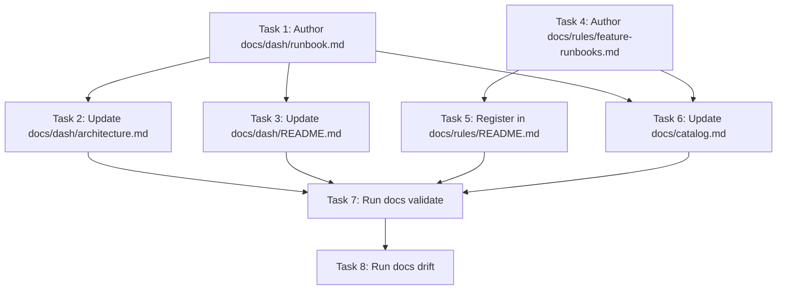

# KyberDash Operational Runbooks & Feature Local Execution Standards

**Status:** Complete  
**Date:** 2026-09-03  
**Goal:** Author KyberDash operational runbooks across four surfaces, improve search discoverability in architecture docs, establish a repository-wide local run/test standard for all catalog features, and ensure ontology compliance.

---

## 1. Problem / Motivation

1. **KyberDash Runbook Gap**: KyberDash vendors upstream `getagentseal/codeburn` and provides four distinct UI surfaces:
   - Electron Desktop App (`dash/app/`)
   - Windows Menubar Tray App (`dash/windows/`)
   - Web Dashboard (`dash/dash/`)
   - Terminal TUI Dashboard (`dash/src/dashboard.tsx`)  
   Currently, developers and automated agents have no consolidated operational runbook detailing how to build CLI prerequisites, launch dev servers, execute component tests, or test via the demo bridge.
2. **Architecture & Search Discoverability**: While `docs/dash/architecture.md` covers the soft fork and canonical models, headings and introductory text do not explicitly feature key search terms: `"dashboard"`, `"desktop"`, `"electron"`, `"tauri"`, and `"tui"`. As a result, DocGraph vector/lexical retrieval (`docs_explore`) and fused token matching underperform when querying for specific surface run commands or surface architectures.
3. **Repository-Wide Feature Execution Standard**: Features declared in `docs/catalog.md` vary widely in whether and how they can be tested or executed locally. There is currently no governing rule mandating that features document their local run/test instructions (or explicitly state non-local applicability for pure libraries or CI components).
4. **Catalog Integrity Discrepancy**: In `docs/catalog.md`, KyberDash is listed with Source root `src/KyberWeave.Dash`, which does not exist on disk (the subtree resides at `dash/`).

## 2. Approved decisions

- **D1 (KyberDash Runbook Target & Identity):** Create `docs/dash/runbook.md` with frontmatter:
  ```yaml
  ---
  id: dash/runbook
  title: KyberDash runbook — Local development, execution, and testing
  doc-type: runbook
  status: draft
  component: KyberDash
  owner: dpalfery
  last-reviewed: 2026-09-03
  ---
  ```
  Omit `source-root` and `code-refs` so it serves as a pure process/operational runbook, avoiding drift breaks when internal symbols are refactored (conforms to `KW-DOC-SPEC-003` and the pairing invariant in `DocSpecValidator.cs`).
- **D2 (Surface Coverage in Runbook):** Document all four surfaces with prerequisites, dev commands, tests, and debugging harnesses:
  - **Surface 1: Electron Desktop App (`dash/app/`)**:
    - Prerequisite: Node.js >= 22.13.0.
    - Mandatory build prerequisite: `npm --prefix dash run build:cli` (builds `dist/cli.js`).
    - Dev runner: `npm --prefix dash/app run dev` (compiles electron via `tsc -p tsconfig.electron.json`, launches Vite dev server on `tcp:127.0.0.1:5173`, and spawns Electron).
    - Unit tests: `npm --prefix dash/app run test` (Vitest with jsdom).
    - Demo bridge: `node dash/app/demo-bridge.mjs` (spawns resident `node dist/cli.js serve --stdio` and HTTP mock server on `http://127.0.0.1:4900`, enabling browser-based UI testing without Electron).
  - **Surface 2: Windows Menubar Tray App (`dash/windows/`)**:
    - Prerequisites: Rust >= 1.80 toolchain, Cargo, Tauri 2.x CLI (`@tauri-apps/cli`).
    - Dev runner: `npm --prefix dash/windows run tauri dev`.
    - Local CLI binding: Set `CODEBURN_BIN` env var (e.g. `export CODEBURN_BIN="node $(pwd)/dash/dist/cli.js"` on macOS/Linux or `$env:CODEBURN_BIN="node C:\...\dash\dist\cli.js"` on Windows). Handled safely by `CodeburnCli::resolve()` in `dash/windows/src-tauri/src/cli.rs`.
    - Unit tests: `cargo test --manifest-path dash/windows/src-tauri/Cargo.toml` (tests path security, version parsing, and version gating).
  - **Surface 3: Web Dashboard (`dash/dash/`)**:
    - Prerequisite: Node.js >= 22.
    - Vite dev runner: `npm --prefix dash/dash run dev`.
    - CLI server command: `node dash/dist/cli.js web` (or `codeburn web`) supporting options `--port <number>` and `--period <today|week|month|all>`.
    - Vitest tests: `npm --prefix dash run test tests/web-dashboard.test.ts` (tests bootstrap injection, XSS escaping, and error handling).
  - **Surface 4: Terminal TUI Dashboard (`dash/src/dashboard.tsx`)**:
    - Prerequisites: ANSI/24-bit color terminal emulator, Node.js >= 22.
    - Ink dev runner: `npm --prefix dash run dev` (`NODE_OPTIONS=--no-deprecation tsx src/cli.ts`).
    - Vitest tests: `npm --prefix dash run test tests/dashboard.test.ts` (tests Ink layout breakpoints at 89, 90, 134, 135 columns, project path shortening, and scroll history).
- **D3 (Surface Discoverability in Architecture & Index):**
  - In `docs/dash/architecture.md`:
    - Add explicit section headings under "Surface layer": "Terminal TUI Dashboard (`dash/src/dashboard.tsx`)", "Web Dashboard (`dash/dash/`)", "Electron Desktop App (`dash/app/`)", "Windows Menubar / Tray App (`dash/windows/`)".
    - Update overview text and mermaid diagrams to feature keywords: `"dashboard"`, `"desktop"`, `"electron"`, `"tauri"`, `"tui"`.
    - Add cross-link to `docs/dash/runbook.md` in "Surface layer" and "Related".
  - In `docs/dash/README.md`:
    - Update "Key Capabilities" and "Why KyberDash?" to reference the four UI delivery surfaces.
    - Update "Documentation Roadmap" to include a link to `runbook.md` (Operational Runbook).
- **D4 (Repository-Wide Local Execution Rule):**
  - Create `docs/rules/feature-runbooks.md` with frontmatter:
    ```yaml
    ---
    id: rules/feature-runbooks
    title: Feature local run and test documentation standard
    doc-type: rule
    status: current
    owner: dpalfery
    last-reviewed: 2026-09-03
    ---
    ```
  - Rule Mandate: Every `Component` declared with `Type: Feature` in `docs/catalog.md` must either:
    1. Reference a companion `runbook.md` or `onboarding.md` detailing step-by-step local prerequisites, dev execution, and test commands; OR
    2. Contain an explicit declaration explaining why local execution is inapplicable (e.g., pure domain model/class library, CI gate diagnostic engine, or build-time script).
  - Register `rules/feature-runbooks.md` in `docs/rules/README.md` inventory.
- **D5 (Catalog Audit & Correction):**
  - In `docs/catalog.md`, fix the `KyberDash` row Source root from `src/KyberWeave.Dash` to `dash`.
  - Audit all catalog rows to ensure each feature links to its operational runbook / onboarding or documents its execution nature:
    - `DocGraph`: `[docgraph/architecture.md](docgraph/architecture.md) · [docgraph/analysis.md](docgraph/analysis.md) · [docgraph/mcp-runbook.md](docgraph/mcp-runbook.md)`
    - `ContextHygiene`: `[context-hygiene/skills.md](context-hygiene/skills.md) · [context-hygiene/agents.md](context-hygiene/agents.md)` (Governance library; tested via `dotnet test`)
    - `KyberSquad`: `[kyber-squad/architecture.md](kyber-squad/architecture.md) · [kyber-squad/onboarding.md](kyber-squad/onboarding.md)` (CLI control plane; executed via `squad`)
    - `ReviewCouncil`: `[code-review/architecture.md](code-review/architecture.md) · [code-review/README.md](code-review/README.md)` (Review engine; executed via `review`)
    - `KyberDash`: `[dash/README.md](dash/README.md) · [dash/runbook.md](dash/runbook.md)` (Interactive multi-surface dashboard)
    - `CI Pipelines`: `[ci-pipelines/architecture.md](ci-pipelines/architecture.md) · [ci-pipelines/workflows-runbook.md](ci-pipelines/workflows-runbook.md)`
    - `Distribution`: `[install.md](install.md) · [distribution.md](distribution.md)`
- **D6 (Validation Integrity):** All new and modified documentation must strictly pass:
  - `dotnet run --project src/KyberWeave.Cli -- docs validate .` (zero errors: KW-DOC-SPEC-001 through 007)
  - `dotnet run --project src/KyberWeave.Cli -- docs drift .` (zero errors: KW-DOC-DRIFT-001 through 003)

## 3. Investigation findings

- **Upstream Subtree Architecture (`dash/`)**:
  - `dash/package.json` specifies Node `>=22.13.0`, scripts `build:cli`, `dev` (runs `tsx src/cli.ts`), `test` (`vitest run tests`).
  - `dash/app/package.json` specifies Electron app with scripts `dev` (runs `tsc -p tsconfig.electron.json` then concurrently starts `vite` and `electron .`), `test` (`vitest run`).
  - `dash/app/demo-bridge.mjs` spins up an HTTP server on `127.0.0.1:4900` connected to a resident `node dist/cli.js serve --stdio` process to mock Electron IPC for browser-based testing.
  - `dash/windows/package.json` and `dash/windows/src-tauri/Cargo.toml` specify Tauri 2.x tray app; `dash/windows/src-tauri/src/cli.rs` resolves `CODEBURN_BIN` safely to bind to local CLI builds.
  - `dash/dash/package.json` specifies Vite React app; standalone CLI `node dash/dist/cli.js web` hosts the production web dashboard.
  - `dash/src/dashboard.tsx` implements the Ink terminal UI dashboard, verified with test suite `dash/tests/dashboard.test.ts`.
- **Documentation Ontology Requirements (`docs/documentation-ontology.md`)**:
  - `runbook` requires `id`, `title`, `owner`, `last-reviewed`, `doc-type: runbook`, `status`, `component`.
  - The pairing invariant: an architecture or runbook document with `source-root` must specify `code-refs`. A runbook without `source-root` is process-only and requires no `code-refs`.
  - `rule` requires base keys (`id`, `title`, `owner`, `last-reviewed`, `doc-type: rule`, `status`).

## 4. Task list

| # | Phase | Component | Description | Skills |
|---|-------|-----------|-------------|--------|
| 1 | Execution | KyberDash | Author `docs/dash/runbook.md` with complete local execution and test instructions for Electron, Tauri, Web, and TUI. | `kyber-weave-docs` |
| 2 | Execution | KyberDash | Update `docs/dash/architecture.md` with dedicated surface subheadings and terms ("dashboard", "desktop", "electron", "tauri", "tui") and cross-link runbook. | `kyber-weave-docs` |
| 3 | Execution | KyberDash | Update `docs/dash/README.md` key capabilities, multi-surface overview, and documentation roadmap. | `kyber-weave-docs` |
| 4 | Governance | Rules | Author `docs/rules/feature-runbooks.md` defining the local run/test documentation standard for all catalog features. | `kyber-weave-docs` |
| 5 | Governance | Rules | Register `rules/feature-runbooks.md` in `docs/rules/README.md` inventory. | `kyber-weave-docs` |
| 6 | Governance | Catalog | Update `docs/catalog.md`: correct KyberDash source root to `dash`, and audit all feature entries to reference runbook / onboarding / non-local status. | `kyber-weave-docs` |
| 7 | Verification | DocGraph | Run `dotnet run --project src/KyberWeave.Cli -- docs validate .` and verify 0 errors. | `conductor` |
| 8 | Verification | DocGraph | Run `dotnet run --project src/KyberWeave.Cli -- docs drift .` and verify 0 drift errors. | `conductor` |

## 5. Sequencing / dependency graph



## 6. Residual decisions / risks

- **Risk: Upstream Merge Boundary (`tests/KyberWeave.Tests/MergeBoundaryTests.cs`)**:
  - *Mitigation:* No source files inside `dash/` are modified in this plan. All edits are restricted to `docs/` Markdown files.
- **Risk: CodeGraph Drift Warning (`KW-DOC-DRIFT-001`)**:
  - *Mitigation:* `docs/dash/runbook.md` is authored as a process-only runbook (no `source-root` or `code-refs`), avoiding any coupling to volatile internal symbol names.

## 7. Out of scope

- Source code modifications or build script refactors inside `dash/` or `src/`.
- Creating new native UI surfaces (e.g. GNOME/Linux tray).
- Modifying C# CLI code or adding new automated CLI validators for the runbook rule (the rule is governed via policy and review).

## 8. Required skills

- `kyber-weave-docs`: Conforming Markdown frontmatter authoring and cross-reference linking under Kyber-Weave documentation ontology.
- `conductor`: Orchestrating sequential tasks and executing CLI verification commands (`docs validate`, `docs drift`).

## 9. Verification harness

1. Conformance gate:
   ```bash
   dotnet run --project src/KyberWeave.Cli -- docs validate .
   ```
   Must pass with 0 errors across all 60+ documents.
2. Drift gate:
   ```bash
   dotnet run --project src/KyberWeave.Cli -- docs drift .
   ```
   Must pass with 0 entity drift errors.
3. Review gates:
   - Code review by `code-reviewer` ensuring frontmatter and cross-references are exact.
