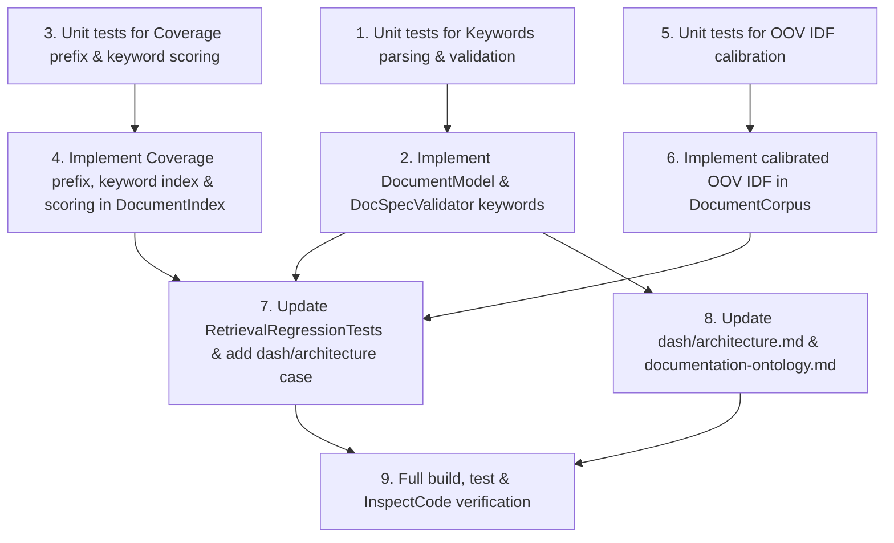

# Track 2: Ontology & Retrieval Engine Enhancements (KyberWeave.Core)

**Status:** Complete
**Date:** 2026-09-03
**Goal:** Enhance KyberWeave.Core document ontology and retrieval engine with optional keywords metadata, compound prefix/sub-token identity coverage, and calibrated Out-of-Vocabulary (OOV) scoring so technical queries with novel terms reliably retrieve matching documents.

---

## 1. Problem / Motivation

When natural language or spoken queries containing unfamiliar or specialized technical terms are evaluated against the documentation corpus (for example, `"dashboard dev environment tauri"` targeting `dash/architecture`), the retrieval engine currently fails to return the expected document. The root cause spans three distinct layers:

1. **Absence of Keyword / Alias Metadata in the Ontology:**
   The document frontmatter ontology (`DocumentModel.cs`, `documentation-ontology.md`) only models `id`, `title`, `component`, and code/endpoint references. There is no mechanism for document authors to register domain synonyms, acronyms, or query aliases (such as "dashboard" or "tauri" for the `KyberDash` architecture document). Documents discussing specialized subsystems cannot be matched on terms not explicitly in their slug or body prose.

2. **Rigid Identity Matching in `Coverage`:**
   In `DocumentIndex.cs`, `ScorePartialIdentity` delegates to `Coverage(string? identity, IReadOnlyDictionary<string, double> queryVector)`. `Coverage` only considers exact token equality and adjacent pairwise fusions. It does not split camelCase names (e.g. `KyberDash` remains a single opaque token `"kyberdash"`) and does not recognize sub-token or prefix matches (e.g. query term `"dashboard"` fails to match slug token `"dash"`).

3. **Out-of-Vocabulary (OOV) Inflation Crushing Coverage in `DocumentCorpus.ScoreBody`:**
   In `DocumentCorpus.cs`, Okapi BM25 scoring squashes body relevance and scales it by the coverage ratio `answered / askedFor`. Robertson–Sparck Jones IDF is computed as $\ln(1 + \frac{N - n + 0.5}{n + 0.5})$. When a query term is completely absent from the corpus ($n = 0$), IDF evaluates to $\ln(2N + 2)$ ($\approx 5.05$ for $N = 77$), the theoretical maximum. If a query contains an unfamiliar term (such as `"tauri"`), that single missing term injects massive artificial demand into `askedFor`, dropping `answered / askedFor` below the relevance floor (`MinRelevanceScore = 0.25`) and causing false-negative retrieval drops.

4. **Regression Harness Root Mismatch:**
   In `tests/KyberWeave.Tests/RetrievalRegressionTests.cs`, the test fixture looks for a legacy `6-Docs` directory and skips silently when run against this repository (where documentation lives under `docs/` as configured in `.kyber-weave/kyber-weave.yml`).

---

## 2. Approved decisions

- **D1 (Ontology Model, Parser, and Validation):**
  - Add `public Collection<string>? Keywords { get; init; }` and `public Collection<string>? Aliases { get; init; }` to `DocumentFrontmatter` in `src/KyberWeave.Core/Docs/Model/DocumentModel.cs`.
  - In `DocumentModel.cs`, expose unified `public IReadOnlyList<string> Keywords => (Frontmatter.Keywords ?? Frontmatter.Aliases) ?? [];`.
  - In `DocSpecValidator.cs`, validate that every entry in `Keywords` is a non-empty, non-whitespace string, emitting diagnostic `KW-DOC-SPEC-002` (`InvalidVocabulary`) with hint `"Each keyword must be a non-empty string."` on violation.
  - Document `keywords` as the canonical frontmatter field in `docs/documentation-ontology.md` (with `aliases` accepted as an internal synonym).

- **D2 (Keywords Indexing & Search Scoring):**
  - In `DocumentIndex.Build`, index document keywords into an inverted dictionary `_byKeyword` (`Dictionary<string, List<DocumentModel>>`, ordinal case-insensitive) mapping individual keywords to declaring documents.
  - In `DocumentIndex.ScoreExact`, add `KeywordWeight = 4.0`: if the query matches any keyword verbatim (case-insensitive), add 4.0 to the exact score.
  - In `DocumentIndex.ScorePartialIdentity`, add `KeywordPartialWeight = 3.0`: calculate keyword coverage across the document's keywords, scaled by `KeywordPartialWeight` and capped at a 1.5 multiplier (maximum 4.5 points) so multiple matching keywords reward relevance without score runaway.

- **D3 (Compound Prefix and Sub-Token Coverage in `Coverage`):**
  - In `DocumentIndex.Coverage(string? identity, IReadOnlyDictionary<string, double> queryVector)`:
    - Split camelCase boundaries on `identity` (e.g. `"KyberDash"` $\rightarrow$ `"Kyber Dash"`) prior to vectorization so compound component tokens are separated cleanly.
    - Add symmetric prefix matching for tokens with $\min(|p|, |q|) \ge 3$: for an identity token $p$ and query token $q$, if $p.\text{StartsWith}(q, \text{Ordinal})$ or $q.\text{StartsWith}(p, \text{Ordinal})$, count as a token match (e.g. query "dashboard" matches token "dash").

- **D4 (Calibrating Out-of-Vocabulary Terms in BM25):**
  - In `DocumentCorpus.InverseDocumentFrequency(string term)`, calibrate terms where $n = 0$ to an informative baseline representing $\sim 20\%$ corpus share:
    $$IDF_{\text{oov}} = \ln\left(1 + \frac{N - \max(1, \lfloor 0.2N \rfloor) + 0.5}{\max(1, \lfloor 0.2N \rfloor) + 0.5}\right)$$
    ($\approx 1.60$ for $N = 77$) rather than the raw uncalibrated $\ln(2N + 2)$ ($\approx 5.05$).
  - In `ScoreBody`, OOV query terms contribute a reasonable penalty to `askedFor` without obliterating the coverage ratio, keeping unanswerable queries (e.g. off-topic queries) safely below the 0.25 floor while enabling partially matching technical queries with novel terms (e.g. `"dashboard dev environment tauri"`) to retrieve the relevant architecture document.

- **D5 (Comprehensive Test Contracts & Harness Alignment):**
  - Update `RetrievalRegressionTests.cs` to locate `docs/` using `KyberWeaveConfigLoader.Load(root).Ontology`.
  - Add regression case `{ "dashboard dev environment tauri", "dash/architecture" }` in `RetrievalRegressionTests.cs`.
  - Add `keywords: [dashboard, tauri]` to `docs/dash/architecture.md`.
  - Pin all unit behaviors in `DocumentIndexTests.cs` and `DocumentCorpusTests.cs`.
  - Ensure zero compiler warnings under `TreatWarningsAsErrors`.

---

## 3. Investigation findings

1. **Frontmatter Deserialization (`MarkdownFrontmatterReader.cs` & `DocumentModel.cs`):**
   - YamlDotNet deserialization is configured with `HyphenatedNamingConvention.Instance` and `IgnoreUnmatchedProperties()`.
   - Collections in `DocumentFrontmatter` are typed as `Collection<string>?`. Properties in `DocumentModel` provide null-coalesced `IReadOnlyList<string>` views.
   - Adding `Keywords` and `Aliases` collections to `DocumentFrontmatter` requires zero custom parser logic; YamlDotNet maps `keywords:` and `aliases:` automatically.

2. **Validation Engine (`DocSpecValidator.cs`):**
   - Diagnostic reporting uses stable codes: `KW-DOC-SPEC-001` (missing/unparseable), `KW-DOC-SPEC-002` (vocabulary/format), `KW-DOC-SPEC-003` (required keys), `KW-DOC-SPEC-004` (catalog values), `KW-DOC-SPEC-005` (source roots), `KW-DOC-SPEC-006` (id references), `KW-DOC-SPEC-007` (technology).
   - Validating non-empty string entries in `Keywords` belongs in `ValidateDocument` under `KW-DOC-SPEC-002` (`InvalidVocabulary`).

3. **Current Scoring Architecture (`DocumentIndex.cs`):**
   - Scoring constants: `IdWeight = 6.0`, `CodeRefWeight = 5.0`, `EndpointWeight = 5.0`, `ComponentWeight = 3.0`, `TitleWeight = 2.0`, `BodyWeight = 1.0`.
   - Partial weights: `IdPartialWeight = 4.5`, `ComponentPartialWeight = 2.5`.
   - Total score cutoff: `MinRelevanceScore = 0.25`.
   - Authority multipliers: `Plan/Spec = 0.55`, `Adr = 0.9`, `Draft/NeedsReview = 0.85`, `Current = 1.0`. For `dash/architecture` (`architecture`, `draft`), authority is $1.0 \times 0.85 = 0.85$.

4. **OOV Dynamics in BM25 (`DocumentCorpus.cs`):**
   - `DocumentCorpus.Build` vectorizes only `doc.Body`. Words in frontmatter keywords, title, or id that do not appear in body text have $n = 0$ in `_documentFrequency`.
   - When $n = 0$, $IDF = \ln(2N + 2)$. In `ScoreBody`, `askedFor` sums $IDF$ across all informative `coverageTerms`. For $N = 77$, an OOV term adds $5.05$ to `askedFor`. A 4-term query with one OOV term has $askedFor \approx 11.5$, capping `answered / askedFor` at $\sim 0.56$ even when all 3 other terms match. Multiplied by BM25 saturation, the score collapses to $\sim 0.20$, below the $0.25$ cutoff.
   - Calibrating OOV IDF to $\sim 1.60$ lowers the OOV demand so 3 matching terms yield coverage $\sim 0.83$ and a body score of $\sim 0.46$, well above the cutoff.
   - For an unanswerable query with 3 OOV terms and 1 incidental corpus match (e.g. off-topic travel queries), $askedFor \approx 2.0 + 3(1.6) = 6.8$, $answered \approx 2.0$, and raw BM25 score $\approx 0.3$. The resulting score is $\frac{2.0}{6.8} \times \frac{0.3}{6.3} \approx 0.014$, safely rejected far below 0.25.

5. **Test Harness Findings (`RetrievalRegressionTests.cs`):**
   - `RepositoryRoot()` searched for `6-Docs`. In this repository, the docs root is `docs/`.
   - Using `KyberWeaveConfigLoader.Load(root).Ontology` cleanly provides the configured docs root (`docs/`).

---

## 4. Task list

| # | Phase | Component | Description | Skills |
|---|-------|-----------|-------------|--------|
| 1 | Test | `KyberWeave.Tests` | Add unit tests in `DocGovernanceTests.cs` (or `DocSpecValidatorTests.cs`) asserting that `keywords` and `aliases` frontmatter fields deserialize into `DocumentModel.Keywords`, and asserting that empty or whitespace-only keyword items trigger `KW-DOC-SPEC-002`. | C# / Testing |
| 2 | Implementation | `KyberWeave.Core` | Add `Keywords` and `Aliases` properties to `DocumentFrontmatter` in `DocumentModel.cs`, expose unified `Keywords` on `DocumentModel`, and implement validation for non-empty keyword entries in `DocSpecValidator.cs`. | C# / Modeling |
| 3 | Test | `KyberWeave.Tests` | Add unit tests in `DocumentIndexTests.cs` asserting: (a) `Coverage` matches compound prefix terms (query "dashboard" matching "dash", "kyberdash" matching "dash"), (b) camelCase identity strings split before vectorization, (c) exact keyword match scores `KeywordWeight = 4.0`, and (d) partial keyword match scores via `KeywordPartialWeight = 3.0` up to 1.5 multiplier. | C# / Testing |
| 4 | Implementation | `KyberWeave.Core` | Update `DocumentIndex.cs`: (a) implement camelCase splitting and symmetric prefix matching ($\ge 3$ chars) in `Coverage`, (b) index keywords in `_byKeyword` in `Build`, (c) add `KeywordWeight = 4.0` in `ScoreExact`, and (d) add `KeywordPartialWeight = 3.0` in `ScorePartialIdentity`. | C# / Search |
| 5 | Test | `KyberWeave.Tests` | Add unit tests in `DocumentCorpusTests.cs` asserting: (a) an OOV term has softened IDF equal to the 20% corpus share baseline, (b) a query with 3 matching terms and 1 OOV term retains strong coverage above 0.25, and (c) an unanswerable query with 3 OOV terms still collapses below 0.25. | C# / Information Retrieval |
| 6 | Implementation | `KyberWeave.Core` | Update `DocumentCorpus.cs`: calibrate OOV term IDF in `InverseDocumentFrequency` to the 20% corpus share baseline ($IDF_{\text{oov}}$). Verify `ScoreBody` coverage calculation uses this calibrated value. | C# / BM25 Scoring |
| 7 | Harness & Regression | `KyberWeave.Tests` | Update `RetrievalRegressionTests.cs` to locate `docs/` using `KyberWeaveConfigLoader.Load(root).Ontology`. Add test case `{ "dashboard dev environment tauri", "dash/architecture" }` to `Cases()`. | C# / Testing |
| 8 | Docs & Metadata | Docs | (a) Add `keywords: [dashboard, tauri]` to frontmatter in `docs/dash/architecture.md`. (b) Document `keywords` in `docs/documentation-ontology.md` in the Frontmatter table. | Documentation |
| 9 | Verification | Verification Harness | Run `dotnet test`, `dotnet build` with `TreatWarningsAsErrors`, InspectCode static analysis, and verify all regression cases pass. | Build / CI |

---

## 5. Sequencing / dependency graph

---

## 6. Residual decisions / risks

| Risk / Decision | Mitigation / Resolution Condition |
|---|---|
| **Prefix match false positives:** Short prefix matches (e.g. 2-character stems) could cause spurious hits (e.g. "it" matching "iteration"). | Mitigated by strictly enforcing $\min(\|p\|, \|q\|) \ge 3$ characters for prefix checks. In addition, `Coverage` divides by total identity token count, preventing a single prefix hit from over-scoring a multi-token identity. |
| **Unanswerable query regression:** Softening OOV terms could conceivably allow unanswerable queries (e.g. off-topic travel queries) to leak past `MinRelevanceScore = 0.25`. | Mitigated by testing against the existing `AnUnanswerableQuestionReturnsNothing` theory suite. Because multiple OOV terms still accumulate in `askedFor` while `answered` and BM25 term frequency remain near zero, the score remains $\le 0.02$, well below the 0.25 threshold. |
| **Warning elevation:** `Directory.Build.props` enforces `TreatWarningsAsErrors=true`. Any unused parameter or nullability mismatch will break the build. | All new methods will strictly adhere to nullability annotations (`Collection<string>?`, `string?`) and repository coding standards. |

---

## 7. Out of scope

- **Semantic Embedding Models:** No external neural, vector, or API-dependent embeddings. Offline deterministic lexical ranking is a foundational repository constraint.
- **Full Stemming Library:** Full English stemmers (e.g. Porter/Snowball) remain out of scope. Lightweight prefix matching and conservative `Normalize` in `TextVectorizer` satisfy the requirements without adding dependencies.
- **Altering `TextVectorizer.Tokenize` stop words:** `TextVectorizer` is shared with agent drift detection and skill routing; stop word changes would alter linter baselines and are explicitly out of scope.

---

## 8. Required skills

- **C# / .NET 10 Development:** Core object modeling, nullability, collection handling, regex compilation.
- **Information Retrieval & BM25 Mathematics:** Robertson–Sparck Jones IDF calibration, tokenization, cosine similarity, coverage heuristics.
- **Test-Driven Development (TDD):** xUnit theories, fixture lifecycle, regression assertions.
- **Documentation Governance:** Kyber-Weave YAML frontmatter ontology and specification conformance.

---

## 9. Verification harness

Before the plan is marked complete, all of the following verification gates must pass:

1. **Unit Test Coverage:**
   - `tests/KyberWeave.Tests/DocumentIndexTests.cs`: All new tests for prefix coverage, camelCase splitting, exact keyword scoring, and partial keyword scoring must pass.
   - `tests/KyberWeave.Tests/DocumentCorpusTests.cs`: Calibrated OOV IDF tests and `ScoreBody` coverage stability tests must pass.
   - `tests/KyberWeave.Tests/RetrievalRegressionTests.cs`: All existing unanswerable queries must return 0 hits; `"dashboard dev environment tauri"` must successfully retrieve `dash/architecture`.
2. **Deterministic Quality Gates:**
   - `dotnet build KyberWeave.sln -c Release` passes with zero warnings (`TreatWarningsAsErrors=true`).
   - `dotnet test tests/KyberWeave.Tests/KyberWeave.Tests.csproj -c Release` passes with 100% test success.
   - `dotnet run --project src/KyberWeave.Cli -- docs validate .` passes with zero diagnostics (`KW-DOC-SPEC-001` through `007`).
   - `dotnet run --project src/KyberWeave.Cli -- docs drift .` passes with zero drift violations.
