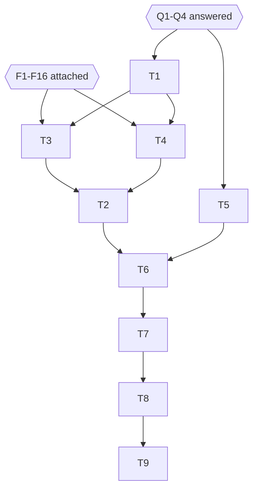

# Provider-aware create-pull-request skill and host-fact cleanup

## Status

Ready, 2026-09-28. Approved for execution by the user; Q1–Q4 answered.
[Verified external facts](#verified-external-facts) F1–F16 were attached on 2026-09-28. This
plan runs before the [#128 draft](2026-09-28-skill-resource-dispositions.md).

## Problem and goal

Two canonical Kyber-Squad skills create pull requests, and both support GitHub only:

- `create-pull-request` is the process layer. It delegates the mechanics to
  `create-pull-request-github` in four places.
- `create-pull-request-github` carries its own scripts.

The two skills contradict each other on the target branch, the title, issue linking, and the
description sections. Both also carry one host project's facts: the Denver airport example,
`.kilo/kilo.json`, the `GITHUB_READ_ONLY` configuration, example component names, and a
Clean Architecture rule. There is a delivery defect too. The GitHub skill names its scripts
in code spans, so `squad install` deploys it without them.

The goal is one `create-pull-request` skill with the following properties:

- **Provider choice.** It selects GitHub or Azure DevOps with the same resolution order as
  `pr-review-fix-comments`, and keeps each host's mechanics in its own provider file.
- **One set of conventions.** It resolves each of the four conventions once, and takes policy
  from the host rather than stating it.
- **Full delivery.** Every provider file and script reaches every rendered target.

`create-pull-request-github` is retired. Existing deployments drop it through receipt
reconciliation. No host-specific fact remains in the canonical skills, agents, or standards
this plan scopes in. A test pins each of these outcomes.

## Intake assessment

This is a plan (D1): the user asked for one explicitly. The change is bounded: canonical
skill content, test contracts, and documentation. There is no production C# change except
one count in a code comment.

## Development mode

`test-first` (M1). This is the repository default, and the user did not opt out.

## Discovery method

- **CodeGraph:** `ResourceClosureBuilder`, `SquadSourceLoader.ReadSourceFile`,
  `SquadResourceProjection.Append`, `SquadDeploymentPlan.CreateUpdate`, and the renderer
  registry.
- **Kyber-Weave documentation tools:** `docs_explore` and `docs_for_symbol` over the
  Kyber-Squad docs and documentation governance.
- **Direct reads:** both PR skills and the scripts, `pr-review-fix-comments` and its two
  provider files, and these test files: `HotshotGoldenContractTests`,
  `SquadCanonicalContentTests`, `SquadPackAndReleaseTests`, `OpenCodeRendererContractTests`,
  `SquadResourceClosureTests`, `SquadDeploymentStateTests`, `SquadHotshotLifecycleTests`,
  and `FakeSquadRenderer`.
- **Text sweeps (self-gathered, using Grep):** Markdown under
  `products/kyber-squad/{skills,agents,standards}`, `docs/`, `src/`, `tests/`, and `.github/`.
  CodeGraph does not index prose, so these were searched as text.
- **External facts:** gathered by a research pass, then re-checked against source by the
  conductor and attached as F1–F16. Two research claims were corrected (F7, F9).

## Approved decisions

| ID | Decision | Approval provenance |
|---|---|---|
| M1 | `development-mode: test-first`. | Default; the user did not opt out (conductor relay, 2026-09-28). |
| D1 | The artifact is a plan, not a spec. | The user chose PLAN explicitly (conductor relay, 2026-09-28). |
| D2 | Scope: create one combined `create-pull-request` skill, and remove the project-specific information and DEN references. | The user's request, verbatim: "create a new plan now to create the combined skill and clean up the project specific info and references to DEN" (2026-09-28). |
| D3 (Q1) | The #128 draft stays in `docs/plans`. This branch finishes both plans before it merges; the #128 draft is re-baselined against this plan's merged state before it executes. | User answer "Finish both first", 2026-09-28. |
| D4 (Q2) | R1–R7 are approved as written. | User approved the plan, 2026-09-28. |
| D5 (Q3) | Option (a): the scripts move to `create-pull-request/scripts/github-create-pr.{sh,ps1}`, are linked so they deploy, and are reduced to mechanics. | User answer, 2026-09-28. |
| D6 (Q4) | Option (b), extended: link the two `pr-review-fix-comments` provider files so they deploy, **and** replace the host-specific `mcp_azuredevops_m_` tool-name prefix in `pr-review-fix-comments/providers/azure-devops.md` with the bare `microsoft/azure-devops-mcp` tool names (F8). `csp-security`, `architecture-decision-record`, and the #128-owned `IMotorcycleApiClient` examples stay out of scope. | User answer "PR skills + pr-review-fix", whose description included the prefix fix, 2026-09-28. |

## Decision ledger (Draft only)

| ID | Question | Options | Recommendation | Blocks | Status |
|---|---|---|---|---|---|
| Q1 | Merging this branch runs `docs validate --merge-ready`, which fails on any plan left in `docs/plans` (KW-DOC-LIFECYCLE-003). The #128 draft is not approved. What happens to it? | (a) **Park it.** Delete the file and its index row, and add a note to the plan index that it is recoverable at commit ea4c971 and must be re-baselined against this plan before reuse. (b) Move it to `docs/archive/plans/` marked "Parked". (c) Finish both plans before merging. | (a). It keeps this PR mergeable, keeps #128's approved decisions D1–D5 recoverable, and avoids an archive entry that looks finished. | T8 | ANSWERED |
| Q2 | Approve the proposed resolutions R1–R7 below as written? | (a) approve; (b) amend (name the R-id and the change) | (a). Each resolution picks the portable choice and gives its reason. | T1, T2, T3, T4, T5 | ANSWERED |
| Q3 | What happens to the GitHub helper scripts? | (a) Move them to `create-pull-request/scripts/github-create-pr.{sh,ps1}` and reduce them to mechanics: the caller supplies the title and the body file, and the scripts hold no convention logic. Link them so they deploy. (b) Move them unchanged. They keep branch-name title-casing and the default-branch-only `Closes`, which contradict R2 and R3. (c) Delete them; the GitHub provider documents the MCP and `gh` steps only. | (a). The scripts keep their value, and the conventions live in one place. No Azure DevOps script is added under any option, because the provider's MCP and `az repos` steps are enough. | T1 (expected closure), T3 | ANSWERED |
| Q4 | Scope beyond the two PR skills? | (a) The PR skills only. (b) Also link the two `pr-review-fix-comments` provider files so they deploy. This is the same defect, in the pattern this plan copies, and it makes that skill evolved. (c) Option (b), plus the host facts in `csp-security/SKILL.md` (:51 Pigment CSS; :82 and :95 `Motorcycle*` types) and `architecture-decision-record/SKILL.md:21` ("this repository's retrieval"). Those become two more evolved golden skills. | (b). The combined skill copies a selection pattern whose own provider files never deploy today; fixing that costs one table edit, and the same tests cover it. Leave the (c) items as a GAP, with a todo only if the user accepts one. | T1, T2, T5 | ANSWERED |

## Proposed resolutions (awaiting Q2)

Each resolution is stated once, in the combined `SKILL.md`. Mechanics that depend on the
platform go in the provider file and cite the F-ids.

- **R1 — Target branch.** The order is:
  1. The explicit input.
  2. Conclusive evidence: the user named the branch; a branching rule the host declares (root
     `AGENTS.md`, a contributing guide, or a rule under **<rules-index>**); the branch's
     upstream or tracking configuration; or an existing PR for the same branch.
  3. Otherwise, list the long-lived branches through the provider and ask the user.

  Never assume the default branch, and never assume `develop`. Rationale: the branching
  model is host policy, and a wrong base fails silently. This drops create-pull-request's
  `develop`/`main` model and keeps the GitHub skill's evidence-or-ask rule.
- **R2 — Title.** Use the explicit input first. Otherwise, a host convention wins when
  present: PR template guidance, a contributing guide, or a rule under **<rules-index>**.
  Default: a concise imperative summary of the change, first word capitalized, no trailing
  period, about 72 characters at most, and no component prefix unless the host uses one.
  Do not title-case the branch name: a branch stem is an identifier, not a summary
  (`feature/42-audit-error-service` would become "42 Audit Error Service").
- **R3 — Linked work.** A host convention wins. Default: when the PR completes the item, use
  the provider's closing mechanism: `Closes #<n>` on GitHub (F12: GitHub acts on it only when
  the PR targets the default branch), or a linked work item on Azure DevOps (F7). When it is
  one step of a larger item, use a non-closing reference such as `Part of #<n>`. Keep an
  alphanumeric key such as `ABC-123` as `Ticket: ABC-123`, and omit the section when there is
  no item. Only detection comes from the branch name: a leading number, or a `KEY-123` token.
  Rationale: whether to close is a matter of intent, while the syntax and its effect are
  platform facts.
- **R4 — Description.** If the host has a PR template, fill every section of it. The provider
  file says where templates live (F9, F13). Otherwise use one default set: Summary (why more
  than how), Type of change, Linked work, Changes, Validation, Documentation impact, and
  Notes. Do not list commits or files, because the provider shows those. Write the body to a
  UTF-8 file, and pass it as a file wherever the CLI allows.
- **R5 — Host policy by reference (the #126 pattern).** The skill names no tools and no
  branch prefixes:
  - no `markdownlint-cli2`, `ruff`, `lychee`, Trivy, CodeQL, Semgrep, Gitleaks, or Checkov;
  - no fixed `dotnet` commands and no `.github/workflows` path.

  Instead it runs the gates the host declares: the root `AGENTS.md` commands, and the declared
  **<technology>-coding-standard** for each technology touched. It checks the architectural
  rules under **<rules-index>**, and the documentation at **<documentation-ontology>** and
  **<component-catalog>**. The skill reads the host's branch-naming convention, if one exists,
  for work-item detection only. This adds no new registry property and does not widen the
  ontology.
- **R6 — Host facts.** Remove all of the following, with no replacement product names:
  - the Denver example and `.kilo/kilo.json`;
  - `GITHUB_READ_ONLY` and the other "in this repo" MCP notes;
  - the Docker server note;
  - the `[API]`, `[Admin Desktop]`, and `[Local Processor]` examples;
  - the docling, Azure AI Search, and x86 examples;
  - the `Contracts`/`Contracts.Models` rule.

  Examples use placeholders. A read-only or missing MCP create tool becomes a condition the
  agent detects, and then it uses the CLI fallback.
- **R7 — Retirement.** Add no redirect stub. The claims behind this are in Finding 7: a
  receipt diff removes unchanged deployed copies, and skills route by their description. An
  operator-edited copy stays in place, and onboarding documents that.

## Investigation findings

1. **Contradictions.** Line references for the old texts:

   | Convention | `create-pull-request/SKILL.md` | `create-pull-request-github/SKILL.md` |
   |---|---|---|
   | Base branch | :17 (branch from `develop`) | :42-53 and :99-102 (evidence or ask) |
   | Title | :44-57 (`[Component]`) | :36-40 (title-cased branch) |
   | Issue link | :40 and :86 (`Closes` always) | :70-74 (`Closes` only for the default branch) |
   | Description | :59-65 (`.github/PULL_REQUEST_TEMPLATE.md`) | :61-80 (its own sections) |

   The GitHub skill calls itself "the GitHub-specific replacement" at :7.

2. **Host facts.**
   - In `create-pull-request-github/SKILL.md`: :14 (`.kilo/kilo.json`, `ghcr.io/…`), :15, :89,
     :304 and :308 (`GITHUB_READ_ONLY`, "in this repo"), :64 (Denver, the only DEN match under
     `products/kyber-squad/`), and :79 (VNet).
   - In `create-pull-request/SKILL.md`: :24 (`Contracts.Models`), :53-55 (example titles),
     :71 (Azure AI Search), :86 (x86), and the tool names at :20, :128-137, :146 and :190-193.
3. **Render closure delivers non-Markdown files if they are linked.**
   - `ResourceClosureBuilder.VisitLinks` (`SquadSourceLoader.cs:1377-1388`) visits every
     Markdig `LinkInline`.
   - `Visit` (:1390-1464) adds any existing in-owner file through `ReadSourceFile` (:763-836),
     which reads strict UTF-8, strips a BOM, and normalizes line endings to LF.
   - It recurses only into `.md` and `.markdown` files (:1455, `IsMarkdown` :1539-1544).
   - So a linked `.sh` or `.ps1` is delivered as leaf content, and a code span is not.
     `SquadResourceClosureTests` pins leaf `.txt` delivery and `../shared.txt` resolution
     inside the owner.
   - All 12 renderers project skill closures through `SquadResourceProjection.Append`
     (`SquadRendererRegistry.cs:486-512`).
   - `SquadDeploymentFile` carries bytes only, so deployed scripts are not executable.
4. **The same defect in `pr-review-fix-comments`.** `pr-review-fix-comments/SKILL.md:28-29`
   names its provider files in code spans, so they are packaged but never rendered. #128 Q1
   lists them among its six packaged-only files.
5. **Golden contract** (`HotshotGoldenContractTests`):
   - Constants :29-33 describe the fixture only (24/24/64/88/48), and
     `CheckedInManifestPinsExactHotshotGoldenInventory` is unaffected.
   - `EvolvedSkillIdentities` (:73-78) is bug-crusher, product-owner, and second-brain.
     `RetiredAgentIdentities` (:80-85) is the precedent for a retired identity.
   - These tests assume every golden skill is still canonical:
     `CanonicalSourcePreservesGoldenContractOutsideReviewedEvolution` (:227-339, with the path
     set at :292-304 and the bytes at :306-328),
     `RecursivePackagesRetainEveryCanonicalSkillResourceAndResolveLocalReferences` (:342-361),
     and `RenderMismatchesAsync` (:430-516).
   - The fixture JSON (lines 54-55 and 497) stays untouched.
6. **Other pins and counts:**
   - `SquadCanonicalContentTests.ExpectedSkills` (:58-84).
   - `SquadPackAndReleaseTests.CanonicalSkills` (:53-79), the assertion `Assert.Equal(24, …)`
     (:155), and comments at :154, :288, and :615.
   - `OpenCodeRendererContractTests` :176-200 (24/45/113).
   - `Fakes/FakeSquadRenderer.cs:40-66`.
   - Comments: `ZCodeRendererContractTests.cs:816` and `ZCodeRenderer.cs:91`.
   - `bundles/full.yml:33`, and `products/kyber-squad/README.md:60` and :67-68.
7. **Upgrade path.** `SquadDeploymentPlan.CreateUpdate` (:353-531) checks each file the
   previous receipt owns that is no longer rendered:
   - If its bytes on disk match the receipt, the update deletes it (:483-491).
   - If it was edited, it is kept and stays owned (:492-493), with or without
     `--replace-managed`.

   Tests that already pin this with synthetic renders:
   - `SquadDeploymentStateTests.ResourceUpdateAndRemovalPreserveLocallyEditedReceiptOwnedFiles`
   - `…CreateUpdateReceiptDiffRetiresFallbackSkillPathsOnNativeAntigravityUpdateAndRetainsLocallyEdited`
   - `SquadHotshotLifecycleTests.UpdateToGoldenRosterRemovesOnlyUnchangedObsoleteOwnedFileAndWritesExactReceipt`

   Nothing yet pins it against the real canonical render; that is P7.
8. **Every reference to `create-pull-request-github`:**
   - `src/`: none.
   - `tests/`: the three lists in Finding 6, plus the fixture.
   - `docs/`: only #128:80.
   - `products/`: the bundle, the README, and the two skills.
   - Root self-deployment: `.github/skills/create-pull-request{,-github}/SKILL.md` and
     `.kyber-weave/squad.receipt.json:379,385`.
9. **Stale counts in documentation:**
   - Count "24 skills": `README.md:150,152,247`; `docs/README.md:120`;
     `docs/context-hygiene/agents.md:58`; `docs/kyber-squad/onboarding.md:22`.
   - Counts 24/64/88/113: `docs/context-hygiene/skills.md:150-158`;
     `docs/kyber-squad/README.md:28,42,52-59`; `docs/kyber-squad/architecture.md:56,102-103,459-467`;
     `docs/kyber-squad/onboarding.md:498-503`; `docs/kyber-squad/requirements.md:24` (KS-001)
     and :92-100; `docs/distribution.md:100-101,120-123`.
   - `products/kyber-squad/README.md:4,60,118-129`.
   - Four passages still name only two evolved skills: products README:122, requirements:92,
     architecture:465, and skills.md:156. This is #128 Finding 9.

## Host-fact sweep of `products/kyber-squad/{skills,agents,standards}`

| Location | Finding | Disposition |
|---|---|---|
| `skills/create-pull-request{,-github}` | Finding 2 | **In** (R6). |
| `skills/pr-review-fix-comments/SKILL.md:28-29` | Provider files not delivered | **In** under Q4 (b) or (c). |
| `skills/csp-security/SKILL.md:51,82,95` | Pigment CSS; `MotorcycleController` and `MotorcycleQueryRequest` | Q4 (c) only. Otherwise a GAP, because this is a different golden skill that the request did not name. |
| `skills/architecture-decision-record/SKILL.md:21` | "this repository's retrieval" | Q4 (c) only; otherwise a GAP. |
| `skills/csharp-dev/references/bff-yarp.md:121,138`; `azure-ai-rag.md` | Host facts | **Out**. Owned by #128 D4 (T4b). |
| `skills/test-dev/references/{mock-usage-analysis,test-maintainability}.md`; `skills/maui-dev/references/dependency-injection.md` | `IMotorcycleApiClient` examples | **Out**. Owned by #128, which keeps examples verbatim under its D2. Flagged for #128 re-baselining. |
| `standards/csharp/README.md:92-104` | `<Solution>.Contracts.Models` | **Out**. This is a template placeholder, and standards are the intended home for host policy (#126). |
| `skills/pr-review-fix-comments/providers/azure-devops.md` | Tool names `mcp_azuredevops_m_*` are one host's server naming (confirmed against F8) | **In** (D6): replace with the bare tool names. |
| `**/references/*.md` frontmatter `source: https://github.com/dotnet/skills/tree/main/…` | Upstream provenance | **Out**. Not a host fact. |
| `migration/*.md`, `profiles/capabilities.yml:41` ("Hotshot"), and the golden tests | Provenance records | **Out**, per the brief. Also outside the swept folders. |

## Design

File layout. The recommended answers (Q3 a, Q4 b) assumed below are marked \*.

```text
products/kyber-squad/skills/create-pull-request/
  SKILL.md                         rewritten (evolved)
  providers/github.md              new
  providers/azure-devops.md        new
  scripts/github-create-pr.sh      moved from create-pull-request-github/scripts/create-pr.sh *
  scripts/github-create-pr.ps1     moved from create-pull-request-github/scripts/create-pr.ps1 *
products/kyber-squad/skills/create-pull-request-github/   deleted
```

`SKILL.md` is the neutral layer. It contains no `gh` or `az` commands and no template paths.
Its sections, with headings fixed for P5a:

1. Frontmatter: `name: create-pull-request`, and a description of at most 1024 characters.
   The description routes "create", "submit", "open", and "update" a PR on GitHub or Azure
   DevOps. It excludes addressing review comments (`pr-review-fix-comments`) and writing the
   implementation.
2. `## Provider Selection`. Uses the same order as `pr-review-fix-comments`: explicit
   `github`/`gh`/`azdo`/`ado`/`azure-devops`, then a remote URL containing `dev.azure.com` or
   `visualstudio.com`, then `github.com`, then the only connected provider MCP server,
   otherwise ask and stop. It contains a table with **Markdown links** to both provider files.
   Rules:
   - Read exactly one provider file.
   - Never mix tools from different providers.
   - Use the provider's MCP tool when it is connected and write-capable; otherwise use the CLI
     fallback that the provider file names.
   - Use local `git` for local work only.
3. `## Inputs`: provider, source branch, target branch, title, draft, linked work, extra
   notes, and repository identity overrides (GitHub owner and repo; Azure DevOps organization,
   project, and repository).
4. `## Before opening`: the R5 checklist, secrets, scoped `AGENTS.md`, documentation and
   catalog, and dev-environment setup (the `setup-dev-environment` skill).
5. `## Target branch` (R1). Anchor phrases: "Never assume the default branch" and "ask the
   user".
6. `## Title` (R2). Anchor phrases: "A host convention wins" and "Default:".
7. `## Linked work` (R3). Anchor phrases: "A host convention wins" and "closing".
8. `## Description` (R4). Anchor phrase: "host's pull request template".
9. `## Create or update`. Find an open PR from source to target, then update it or create it
   (as a draft if asked), then read it back and confirm the title and body. Never create a
   test PR unless asked.
10. `## CI checks`: host-declared checks, and the provider's "Check CI status" step.
11. `## Review`: the `code-review` skill or a human; respond to every comment, and do not
    merge with open threads.
12. `## After merge`: plan closeout through `docs-dev` and **<plan-index>**, and the
    provider's branch-deletion step.
13. `## Common pitfalls`: neutral wording only.
14. `## Resources`: Markdown links to all four resource files.

**Provider file contract** (P5b; each provider file carries at least these `##` headings):

| Heading | Content |
|---|---|
| `## Identity` | How the remote maps to the repository identity, with URL forms (F14) and a discovery tool. |
| `## Tool map` | A table of Step, MCP tool, and CLI fallback, with one row for each fixed step: `List long-lived branches`, `Read default branch`, `Find an open PR for source and target`, `Create the PR`, `Update the PR`, `Read the PR back`, `Check CI status`, and `Link work items`. |
| `## Templates` | Where PR templates live (F9, F13). |
| `## Linking work` | Closing and reference syntax, and its effect (F7, F12). |
| `## Multi-line descriptions` | Passing a body file to the CLI (F5, F10). GitHub keeps the PowerShell here-string technique. |
| `## Read-only or missing MCP` | How to detect it, and falling back to the CLI (F8, F11). |
| `## After merge` | Deleting the source branch (F16). |
| `## Link formats` | PR and commit URL forms. |
| `## Sources` | At least one `https://` link. Every command, flag, or tool name in the file comes from an F-row and is cited here. |

`providers/github.md` also carries `## Helper scripts`. It holds links
`../scripts/github-create-pr.sh` and `.ps1` (Q3 a). Scripts are invoked as
`bash <skill-dir>/scripts/github-create-pr.sh` and
`pwsh -NoProfile -File <skill-dir>/scripts/github-create-pr.ps1`, because deployed files are
not executable.

**Scripts under Q3 (a).** They take `--head`, `--base`, `--title`, `--body-file`, and
optionally `--repo owner/name` and `--draft` (PowerShell: `-Head -Base -Title -BodyFile
[-Repo] [-Draft]`), with flag names checked against F10. Behaviour:

1. Fail fast when the base, title, or body file is missing.
2. Detect the repository from a `github.com` origin.
3. Find an open PR from head to base; `gh pr edit` it if one exists, otherwise `gh pr create`
   it.
4. Read the title and body back; exit non-zero on a mismatch.

The scripts hold no title, ticket, or section logic.

**Counts** (canonical; the golden fixture stays 24/64/88/48):

| Q3 | Q4 | Skills | Skill-tree resources | Skill-tree files | Copilot/OpenCode render |
|---|---|---|---|---|---|
| a or b | a | 23 | 66 | 89 | 116 |
| a or b | b or c | 23 | 66 | 89 | 118 |
| c | a | 23 | 64 | 87 | 114 |
| c | b or c | 23 | 64 | 87 | 116 |

Derivation: 113 = 21 agents + 10 agent resources + 24 skills + 58 closed skill resources.
Under the recommended answers, it becomes 21 + 10 + 23 + (58 + 2 providers + 2 scripts + 2
`pr-review-fix-comments` providers) = 118.

## Verified external facts

Attached by the conductor, 2026-09-28. `learn.microsoft.com` is blocked from the authoring
environment. Microsoft Learn facts were therefore checked against their Markdown source in
`MicrosoftDocs/azure-devops-docs`, and CLI and MCP facts against each tool's own source
repository. **Source** means the fact was read from that source; **research** means it came
from a search-based research pass and was not re-read from source. T3 and T4 may use either
kind, but must cite the URL given. The research pass got two facts wrong, and both are
corrected below: Azure Repos template lookup (F9) and work-item resolution syntax (F7).

| Id | Needed by | Verified fact | Source (retrieved 2026-09-28) |
|---|---|---|---|
| F1 | T4 | `az repos pr create` parameters: `project`, `repository`, `source_branch`, `target_branch`, `title`, `description`, `auto_complete`, `squash`, `delete_source_branch`, `bypass_policy`, `bypass_policy_reason`, `merge_commit_message`, `optional_reviewers`, `required_reviewers`, `work_items`, `draft`, `open`, `organization`, `detect`, `transition_work_items`, `labels`. CLI flags are the kebab-case forms (`--source-branch`, `--target-branch`, `--draft`, `--work-items`, ...). Install with `az extension add --name azure-devops` (research). | Source: [pull_request.py](https://github.com/Azure/azure-devops-cli-extension/blob/master/azure-devops/azext_devops/dev/repos/pull_request.py); reference page <https://learn.microsoft.com/cli/azure/repos/pr> |
| F2 | T4 | Every `az repos pr` command takes `--organization` and `--detect`. `--detect` infers organization, project and repository from the git remote, and is on by default (research). Defaults are set with `az devops configure --defaults organization=<org-url> project=<name>`, which accepts only those two keys; clear one with `project=''` (source). Auth is `az login`, or `az devops login` with a PAT, or the `AZURE_DEVOPS_EXT_PAT` variable (research). | Source: [configure.py](https://github.com/Azure/azure-devops-cli-extension/blob/master/azure-devops/azext_devops/dev/team/configure.py); research: <https://learn.microsoft.com/azure/devops/cli/> |
| F3 | T4 | `az repos pr list` filters: `repository`, `creator`, `reviewer`, `source_branch`, `target_branch`, `status`, `project`, `skip`, `top`, `organization`, `detect`. | Source: pull_request.py (F1) |
| F4 | T4 | `az repos pr update --id <n>` takes `title`, `description`, `auto_complete`, `squash`, `delete_source_branch`, `bypass_policy`, `draft`, `bypass_policy_reason`, `merge_commit_message`, `transition_work_items`, `status`; it has **no** `work_items`. `az repos pr show --id <n>` reads the PR back. | Source: pull_request.py (F1) |
| F5 | T4 | `description` is a list of strings, one per line, on both create and update. Treat the exact shell form of multi-line input as unverified: prefer the MCP `description` string, and otherwise check `az repos pr create --help`. | Source: pull_request.py (F1) |
| F6 | T4 | Drafts: `--draft` exists on both create and update, so a draft is published with `az repos pr update --id <n> --draft false`. The MCP `create` action takes `isDraft`. | Source: pull_request.py (F1); repositories.ts (F8) |
| F7 | T4, R3 | Linking: `--work-items <ids>` on create; `az repos pr work-item add/list/remove`; `--transition-work-items`. Resolution mentions are `fix`, `fixes` or `fixed` followed by `#<id>`, e.g. `Fixes #123`. A work item resolves on a push to the default branch, or when a PR into the default branch completes with "Complete associated work items after merging" selected. The per-repo setting "Commit mention work item resolution" is on by default. **Correction:** `AB#123` is the GitHub ↔ Azure Boards syntax, not the Azure Repos one. | Source: [commands.py](https://github.com/Azure/azure-devops-cli-extension/blob/master/azure-devops/azext_devops/dev/repos/commands.py); [resolution-mentions.md](https://github.com/MicrosoftDocs/azure-devops-docs/blob/main/docs/repos/git/resolution-mentions.md) (page <https://learn.microsoft.com/azure/devops/repos/git/resolution-mentions>) |
| F8 | T4, D6 | The `microsoft/azure-devops-mcp` server provides `repo_pull_request_write` (actions `create`, `update`, `update_reviewers`, `vote`), `repo_pull_request` (actions `get`, `list`, `list_by_commits`), `repo_pull_request_org`, `repo_pull_request_thread` and `repo_pull_request_thread_write`. `create` parameters: `repositoryId`, `sourceRefName`, `targetRefName` (full `refs/heads/<branch>` refs), `title`, `description`, `isDraft`, `workItems`, `forkSourceRepositoryId`, `labels`. The toolset is "being aligned with the Azure DevOps remote MCP server", so names may change. A harness may prefix tools with the host's server name, so portable text names the bare tool. `pr-review-fix-comments/providers/azure-devops.md` hard-codes one host's prefix, `mcp_azuredevops_m_`. | Source: [docs/TOOLSET.md](https://github.com/microsoft/azure-devops-mcp/blob/main/docs/TOOLSET.md); [src/tools/repositories.ts](https://github.com/microsoft/azure-devops-mcp/blob/main/src/tools/repositories.ts) |
| F9 | T4, R4 | Azure Repos searches for a default template in `.azuredevops/`, then `.vsts/`, then `docs/`, then the repository root. Branch-specific templates are `pull_request_template/branches/<branch>.md` under the same base folders; additional templates live in `<base>/pull_request_template/`. **Correction:** the lookup is not `.azuredevops/` only. | Source: [pull-request-templates.md](https://github.com/MicrosoftDocs/azure-devops-docs/blob/main/docs/repos/git/pull-request-templates.md) (page <https://learn.microsoft.com/azure/devops/repos/git/pull-request-templates>) |
| F10 | T3 | `gh pr create` flags: `--base/-B`, `--head/-H`, `--title/-t`, `--body/-b`, `--body-file/-F` (`-` reads stdin), `--draft/-d`, `--fill/-f`, `--fill-first`, `--fill-verbose`, `--reviewer/-r`, `--assignee/-a`, `--label/-l`, `--template/-T`, `--dry-run`, `--no-maintainer-edit`. `--repo` is inherited, not registered on the command. `gh pr list --head --base --state --json`, `gh pr edit --title --body-file`, and `gh pr view --json title,body` come from the research pass. | Source: [pr/create/create.go](https://github.com/cli/cli/blob/trunk/pkg/cmd/pr/create/create.go); research: <https://cli.github.com/manual/gh_pr_create> |
| F11 | T3 | The `github/github-mcp-server` provides `create_pull_request` (`owner`, `repo`, `title`, `head`, `base`, `body`, `draft`, `maintainer_can_modify`), `list_pull_requests`, `pull_request_read` and `update_pull_request`. `list_branches` was observed in a live github-mcp-server tool list. Read-only mode (`--read-only` or `GITHUB_READ_ONLY`) disables every write tool, even ones explicitly requested; detect missing create/update tools and fall back to `gh`. | Source: [README.md](https://github.com/github/github-mcp-server/blob/main/README.md); [docs/server-configuration.md](https://github.com/github/github-mcp-server/blob/main/docs/server-configuration.md) |
| F12 | T3, R3 | Closing keywords `close[s|d]`, `fix[es|ed]` and `resolve[s|d]`, followed by `#n`, close the issue only when the PR merges into the default branch. | Research: <https://docs.github.com/en/get-started/writing-on-github/working-with-advanced-formatting/using-keywords-in-issues-and-pull-requests> |
| F13 | T3, R4 | `pull_request_template.md` in the repository root, `docs/`, or `.github/`; multiple templates go in `.github/PULL_REQUEST_TEMPLATE/` and are chosen with `?template=`. | Research: <https://docs.github.com/en/communities/using-templates-to-encourage-useful-issues-and-pull-requests> |
| F14 | T2, P4 | GitHub remotes: `https://github.com/OWNER/REPO[.git]` and `git@github.com:OWNER/REPO[.git]`. Azure DevOps remotes: `https://dev.azure.com/ORG/PROJECT/_git/REPO`, `https://ORG.visualstudio.com/[DefaultCollection/]PROJECT/_git/REPO`, `git@ssh.dev.azure.com:v3/ORG/PROJECT/REPO`, and legacy `vs-ssh.visualstudio.com`. The `pr-review-fix-comments` selection rule matches on `dev.azure.com` / `visualstudio.com` / `github.com`. | Research: <https://learn.microsoft.com/azure/devops/repos/git/use-ssh-keys-to-authenticate>, <https://docs.github.com/en/get-started/git-basics/managing-remote-repositories> |
| F15 | T3, T4 | GitHub: `gh pr checks` has `--watch`, `--fail-fast`, `--interval/-i`, `--required`, `--json`, and `--web`; it exits 8 while checks are pending and errors when a check fails (source). The MCP route is `pull_request_read` with method `get_status` / `get_check_runs` (research). Azure DevOps: `az repos pr policy list` / `policy queue` (source); no Azure DevOps MCP policy tool is documented, so use the CLI. | Source: [pr/checks/checks.go](https://github.com/cli/cli/blob/trunk/pkg/cmd/pr/checks/checks.go); commands.py (F7) |
| F16 | T3, T4 | GitHub: `gh pr merge --delete-branch/-d` deletes the local and remote branch after merge, and is refused when a merge queue is enabled. Azure DevOps: `--delete-source-branch` on `az repos pr create` / `update` deletes the source branch on completion. | Source: [pr/merge/merge.go](https://github.com/cli/cli/blob/trunk/pkg/cmd/pr/merge/merge.go); pull_request.py (F1) |
| F17 | T4 | Azure DevOps MCP repository and branch tools: `repo_repository` has actions `get` and `list` (parameters `action`, `project`, `repositoryNameOrId`, `top`, `skip`, `repoNameFilter`); `get` returns the full repository object, whose `defaultBranch` is a full `refs/heads/<branch>` ref, while `list` returns a trimmed object without it. `repo_branch` has actions `get`, `list`, and `list_mine` (parameters `action`, `repositoryId`, `project`, `branchName`, `top`, `filterContains`); `list` returns branch names with `refs/heads/` removed. | Source: [src/tools/repositories.ts](https://github.com/microsoft/azure-devops-mcp/blob/main/src/tools/repositories.ts); [GitInterfaces.ts `GitRepository.defaultBranch`](https://github.com/microsoft/azure-devops-node-api/blob/master/api/interfaces/GitInterfaces.ts) |
| F18 | T4 | Azure DevOps CLI repository and ref commands: the `repos` group registers `create`, `delete`, `list`, `show`, `update`; `repos ref` registers `create`, `delete`, `list`, `lock`, `unlock`. `list_refs(filter, repository, organization, project, detect)` treats `filter` as a prefix, e.g. `heads/` for branches. `az repos show --query defaultBranch` uses the CLI's global JMESPath `--query`. | Source: [commands.py](https://github.com/Azure/azure-devops-cli-extension/blob/master/azure-devops/azext_devops/dev/repos/commands.py); [ref.py](https://github.com/Azure/azure-devops-cli-extension/blob/master/azure-devops/azext_devops/dev/repos/ref.py) |
| F19 | T3 | `gh repo view` registers `--json`/`--jq` through `cmdutil.AddJSONFlags` over `api.RepositoryFields`, which includes `defaultBranchRef`, so `gh repo view <owner>/<repo> --json defaultBranchRef --jq .defaultBranchRef.name` reads the default branch. The GitHub MCP server documents no default-branch tool, so that row has no MCP entry. Listing branches without MCP uses `git ls-remote --heads origin`. | Source: [pkg/cmd/repo/view/view.go](https://github.com/cli/cli/blob/trunk/pkg/cmd/repo/view/view.go); [api/query_builder.go](https://github.com/cli/cli/blob/trunk/api/query_builder.go) |
| F20 | T4 | Signatures behind the F7 and F15 commands: `add_pull_request_work_items(id, work_items, organization, detect)` backs `az repos pr work-item add --id <id> --work-items <ids>`, and `list_pr_policies(id, organization, detect, top, skip)` backs `az repos pr policy list --id <id>`. | Source: [pull_request.py](https://github.com/Azure/azure-devops-cli-extension/blob/master/azure-devops/azext_devops/dev/repos/pull_request.py) |

## Test contract

Build first with `dotnet build KyberWeave.sln -c Release`. Unless a row says otherwise, the
runner is:

```bash
dotnet test tests/KyberWeave.Tests/KyberWeave.Tests.csproj -c Release --no-build --filter "FullyQualifiedName~PullRequestSkillConsolidationTests|FullyQualifiedName~HotshotGoldenContractTests|FullyQualifiedName~SquadCanonicalContentTests|FullyQualifiedName~SquadPackAndReleaseTests|FullyQualifiedName~OpenCodeRendererContractTests|FullyQualifiedName~SquadDeploymentStateTests|FullyQualifiedName~SquadResourceClosureTests|FullyQualifiedName~SquadHotshotLifecycleTests|FullyQualifiedName~ZCodeRendererContractTests"
```

New tests. P1–P6 are in the new `tests/KyberWeave.Tests/PullRequestSkillConsolidationTests.cs`;
P7 is in `SquadDeploymentStateTests.cs`, where the receipt helpers already live.

| Id | Test | Asserts |
|---|---|---|
| P1 | `CreatePullRequestGithubIsNotCanonicalAndShipsInNoPackage` | Not in `source.Skills` or the bundle, and no directory on disk. `SquadPacker.PackApm` and `PackPlugins` produce no `skills/create-pull-request-github/` entry. |
| P2 | `ProviderSkillsDeliverEveryFileOnDiskThroughTheirClosure` (Theory: `create-pull-request`; plus `pr-review-fix-comments` under Q4 b or c) | Files on disk (excluding `SKILL.md`) equal `skill.Resources`. For `create-pull-request` that set is exactly the expected one (4 files under Q3 a or b; 2 under c). |
| P3 | `EveryTargetDeploysProviderFilesAndScriptsBesideTheSkill` (Theory: the 12 `SquadTargetCatalog.All` at Project scope, plus `claude` at Global scope with a scratch `UserScopeDirectory`) | There is exactly one rendered `…/create-pull-request/SKILL.md`, and each expected resource sits beside it, byte-equal to the LF-normalized source. No rendered path contains `create-pull-request-github`. Under Q4 b or c, the same holds for `pr-review-fix-comments/providers/*`. Use parameterless renderers, as `SquadCommandComposition` does. |
| P4 | `ProviderSelectionMatchesPrReviewFixCommentsAndLinksBothProviders` | Both `SKILL.md` files have `## Provider Selection`, and the detection tokens (explicit tokens, `dev.azure.com`, `visualstudio.com`, `github.com`, the MCP rule, ask) appear in the same order in both. The `create-pull-request` section has Markdig `LinkInline` targets to both provider files, and both files exist. The same link check applies to `pr-review-fix-comments` under Q4 b or c. |
| P5a | `CreatePullRequestResolvesEachConventionOnceInTheNeutralLayer` | The four convention headings each appear exactly once, with their anchor phrases. There is no `create-pull-request-github`, no "branch from `develop`", no `.github/PULL_REQUEST_TEMPLATE.md`, and no code span or fenced line starting with `gh ` or `az `. |
| P5b | `ProviderFileMeetsTheSharedContractAndCitesSources` (Theory: `github`, `azure-devops`) | The contract headings are present; each fixed step has a Tool map row; `## Sources` has at least one `https://` `LinkInline`. |
| P6 | `CanonicalSquadSourceCarriesNoRetiredHostFacts` | The scan covers `skills/**`, `agents/**`, and `standards/**`, using an extensible table of pattern, scope, and reason. Each failure names file:line. The table is listed after this one. |
| P7 | `CreateUpdateRetiresCreatePullRequestGithubFromAPriorReleaseUnlessLocallyEdited` | Render the canonical source with `ClaudeRenderer` and build a prior receipt that also owns `.claude/skills/create-pull-request-github/SKILL.md`. After `CreateUpdate` and `SquadTransaction.Execute`: the unchanged copy is deleted and absent from the persisted receipt. In the edited-copy case, with `replaceManaged` both false and true, the copy is kept byte-for-byte and still owned. |

P6 denylist (the table rows):

| Pattern | Scope | Reason |
|---|---|---|
| `Denver` (ignore case) | skills, agents, standards | host example |
| `\bDEN\b` (match case) | skills, agents, standards | same reference, airport code |
| `.kilo/kilo.json` | skills, agents, standards | one host's MCP configuration path |
| `GITHUB_READ_ONLY` | skills, agents, standards | one host's MCP mode |
| `\bin this repo\b` (ignore case) | skills, agents | describes one host's configuration |
| `mcp_azuredevops_m_` | skills, agents | one host's MCP server-name prefix (D6, F8) |
| `[Admin Desktop]`, `[Local Processor]`, `docling`, `x86 deployment`, `Azure AI Search indexer` | skills, agents, standards | one host's component examples |
| `Contracts.Models` | skills, agents | one host's layout; the csharp template keeps its placeholder by design |

Changes to existing tests (they are part of T1):

- **G1 — `HotshotGoldenContractTests`.**
  - Add `create-pull-request` to `EvolvedSkillIdentities`, and `pr-review-fix-comments` under
    Q4 b or c. Each entry gets a comment giving its reason.
  - Add `RetiredSkillIdentities = ["create-pull-request-github"]`, mirroring
    `RetiredAgentIdentities`.
  - `CanonicalSourcePreservesGoldenContractOutsideReviewedEvolution`: exclude retired skills
    from the expected skills, the path set, and the byte checks. Add the mismatch "retired
    golden skill '{name}' remains canonical" if a retired skill is still in the source or the
    bundle, or its directory still exists.
  - `RecursivePackagesRetain…`: skip retired skills' resources and `VerifyLocalSkillReferences`,
    and add a mismatch if an archive holds a retired skill's entry.
  - `RenderMismatchesAsync`: exclude retired paths from the expected paths, and add a "retired
    rendered skill paths" check.
  - Fixture JSON, `ExpectedManifestSha256`, and constants :29-33 are unchanged.
- **G2 — counts.**
  - `SquadCanonicalContentTests.ExpectedSkills` loses `create-pull-request-github`.
  - `SquadPackAndReleaseTests.CanonicalSkills` loses it too: 24 becomes 23 at :155, and the
    comments at :154, :288, and :615 change.
  - `OpenCodeRendererContractTests`: 24 becomes 23, 45 becomes 44, and 113 becomes the
    count-table value.
  - `FakeSquadRenderer.CanonicalSkills` loses the name.
  - The `ZCodeRendererContractTests.cs:816` comment loses its count.

**Regression evidence** (existing tests, not duplicated here):

- Non-Markdown leaves and `..` inside the owner:
  `SquadResourceClosureTests.LoadSkillResourcesResolvesMarkdownAndLeafContentRelativeToSkillDirectory`
  and `…LoadAgentResourcesResolvesRecursiveMarkdownAndLeafContentInOrdinalOrder`.
- Receipt diff: the three tests in Finding 7.
- Resource projection:
  `SquadRenderingContractTests.RenderAsync_Copilot_ProjectsLinkedAgentAndSkillResourcesWithoutRewritingLinks`
  and `OpenCodeRendererContractTests.RenderAsync_OpenCode_ProjectsLinkedAgentAndSkillResourcesDeterministically`.
- The fixture pin: `HotshotGoldenContractTests.CheckedInManifestPinsExactHotshotGoldenInventory`.
- The ZCode description-length cap tests.

| Task | Test project or file | Runner command | Observable behavior | RED evidence required | GREEN acceptance |
|---|---|---|---|---|---|
| T1 | New class (P1–P6), `SquadDeploymentStateTests.cs` (P7), and the G1/G2 edits | The filter above | The contract exists | Each test fails for the reason named here. P1: the skill exists. P2: an empty closure lists the missing files. P3: the rendered skill has no siblings on every target. P4: no section. P5a: missing headings and a `create-pull-request-github` reference. P5b: missing files. P6: hits in both PR skills, by file:line. P7: no Delete is planned because the retired skill is still rendered. G1 fails only on retired-identity mismatches. G2 fails 24≠23 and 113≠N. Every other test in the filter passes at base. | n/a (RED task) |
| T3 | P5b (`github`) | Filter | The GitHub provider meets the contract and cites sources | P5b `github` fails (T1 run) | P5b `github` passes; `bash -n` passes on the script |
| T4 | P5b (`azure-devops`) | Filter | The Azure DevOps provider meets the contract and cites F-sources | P5b `azure-devops` fails (T1 run) | P5b `azure-devops` passes |
| T2 | P1–P7, G1, G2 | Filter, then the full suite | The combined skill is wired in, and the old skill is retired | T1 run | Everything in the filter passes with no assertion changed; the full suite is green |
| T5 | No test (prose, plus one comment) | `docs validate .`, `docs drift .` | Documentation states the new counts, evolved and retired identities, and upgrade behaviour | n/a | Zero findings. A grep of the Finding 9 files finds no canonical "24 canonical skills", "24 `SKILL.md`", "64 supplemental", "88", "113", or two-name evolved list. The fixture-describing "24-file golden" wording is allowed. |
| T6 | Whole suite and CLI | See T6 | Consumer paths are demonstrated | n/a | Evidence recorded |
| T7 | No test (review) | The `code-review` skill | A verdict | n/a | APPROVE, or findings resolved |
| T8 | No test (closeout) | `docs validate . --merge-ready` | This plan is archived, and #128 is handled per Q1 | n/a | Zero findings |
| T9 | Gate suite | The AGENTS.md list | Everything is green | n/a | All 10 commands pass |

## Tasks

### T1-RED-contract

Specialist: test-dev. Skills: `test-dev`.
Scope: `tests/KyberWeave.Tests/PullRequestSkillConsolidationTests.cs` (new); edits to
`HotshotGoldenContractTests.cs`, `SquadCanonicalContentTests.cs`, `SquadPackAndReleaseTests.cs`,
`OpenCodeRendererContractTests.cs`, `SquadDeploymentStateTests.cs`, `ZCodeRendererContractTests.cs`
(a comment only), and `Fakes/FakeSquadRenderer.cs`.
Depends on: plan Ready (Q1–Q4 answered).

1. Implement P1–P7, G1, and G2 as specified. Locate paths with `KyberWeaveTestPaths` and use
   `TempDirectory`.
2. Follow **<test-coding-standard>** and `tests/KyberWeave.Tests/AGENTS.md`: test names are
   assertions, and each `<summary>` names the regression the test prevents. Parse Markdown
   with Markdig, not regex.
3. Record the RED run described in the Test contract. Do not touch the fixture JSON.

### T3-GREEN-github-provider-and-scripts

Specialist: github-devops. Skills: `github-cli`, `github-devops`.
Scope: `products/kyber-squad/skills/create-pull-request/providers/github.md` (new), plus
`git mv` of `products/kyber-squad/skills/create-pull-request-github/scripts/create-pr.{sh,ps1}`
to `products/kyber-squad/skills/create-pull-request/scripts/github-create-pr.{sh,ps1}`. The
scripts are then rewritten per Q3 (a); under (c) they are deleted instead.
Depends on: T1, and F10–F16 attached.

Write the provider file to the contract, citing F-ids in `## Sources`. Keep the portable
technique from the old skill: the MCP health check with a lightweight read, the fallback on
read-only, body files, PowerShell here-strings, and detecting owner and repo from the
remote. Carry none of the Finding 2 facts. Pass P5b `github`, and run `bash -n` on the shell
script.

### T4-GREEN-azure-devops-provider

Specialist: docs-dev. Skills: `azure-cli`.
Scope: `products/kyber-squad/skills/create-pull-request/providers/azure-devops.md` (new).
Depends on: T1, and F1–F9 and F14–F16 attached.

Write the provider file to the contract. Every command, flag, and tool name must come from a
filled F-row and be cited in `## Sources`. If an F-row is missing or ambiguous, stop and
return the question; do not guess. Pass P5b `azure-devops`.

### T2-GREEN-combined-skill-and-retirement

Specialist: docs-dev. Skills: `github-cli`, `azure-cli`.
Scope:
- `products/kyber-squad/skills/create-pull-request/SKILL.md` (rewritten);
- delete `products/kyber-squad/skills/create-pull-request-github/SKILL.md`, which leaves that
  directory empty after T3;
- `products/kyber-squad/bundles/full.yml` (remove :33);
- `products/kyber-squad/skills/pr-review-fix-comments/SKILL.md:28-29`, where the two code
  spans become Markdown links (D6);
- `products/kyber-squad/skills/pr-review-fix-comments/providers/azure-devops.md`, where every
  `mcp_azuredevops_m_<tool>` becomes the bare `<tool>` name, checked against F8, with one
  sentence saying a harness may prefix the name with the host's server name (D6).

Depends on: T3 and T4. `SKILL.md` links to both provider files, and the loader fails the
whole Squad on a missing target, so T2 lands last.

Write the `SKILL.md` described in Design, applying R1–R7 with the fixed headings and anchor
phrases. Make every provider file and script a Markdown link. Pass the full Test contract
filter without changing any assertion, and then the full suite.

### T5-docs-counts-and-upgrade-note

Specialist: docs-dev. Skills: `kyber-weave-docs`, and `csharp-dev` for the one comment line.
Scope: every file listed in Finding 9, plus `products/kyber-squad/README.md:60,67-68`,
`docs/kyber-squad/onboarding.md` § Updating Deployments, and `src/KyberWeave.Core/Squad/Rendering/ZCodeRenderer.cs:91`
(the comment becomes count-free).
Depends on: plan Ready. The file scope does not overlap T1–T4.

1. Use the canonical counts from the count table. Keep the fixture-describing golden counts,
   and label them as describing the fixture.
2. Where a passage names evolved skills, list them all, and name `create-pull-request-github`
   as retired into `create-pull-request`.
3. Where a passage claims that deployed skill references resolve, say instead that
   link-reached files render and code-span-only files are packaged only (#128).
4. Onboarding § Updating Deployments: an update deletes a file the new release no longer
   renders if the file is unchanged. An operator-edited copy stays owned even with
   `--replace-managed`; delete it by hand.
5. Leave the #128 retention clauses, ADR 0021, and archived documents unchanged. Bump
   `last-reviewed` on each governed page edited.

### T6-VERIFY

Specialist: test-dev. Skills: `test-dev`. Scope: read-only, with scratch directories outside
the repository.
Depends on: T2 and T5.

1. Run the build, the filter, and the full suite.
2. Run `dotnet run --project src/KyberWeave.Cli -c Release --no-build -- squad pack --format all --out <scratch>/pack`.
   Both archives must hold the table's skill-tree count, and neither may contain
   `skills/create-pull-request-github/`.
3. Run `skill validate`, `skill lint --min-desc-score 70`, and `skill scan --fail-on critical`
   on `products/kyber-squad/skills/create-pull-request`.
4. Run `bash -n` on the shell script, and a PowerShell parse check if `pwsh` exists. Record
   it if `pwsh` is absent.
5. Search for leftover `create-pull-request-github` references in `src tests docs products`,
   excluding archives. The only allowed hits are the retired-identity lists, P1/P3/P7, the
   fixture, and plan text.
6. Record the evidence. Note whether an empty `…/create-pull-request-github/` directory
   remains in the P7 scratch tree; record it, do not assert it.

### T7-REVIEW

Invoke the `code-review` skill over the branch diff. `review.policy.always-human` should not
fire, because no `products/kyber-squad/agents/**` path changes. Resolve the findings, or
return them to the conductor.

### T8-CLOSEOUT

Specialist: docs-dev. Skills: `kyber-weave-docs`.
Scope: this plan (moved to `docs/archive/plans/`), `docs/plans/README.md`, and, per Q1, the
#128 draft.
Depends on: T7.

1. Archive this plan under the latest archived plan's frontmatter convention, and add a
   Closeout section: RED and GREEN counts, suite totals, gates, the verdict, and T6 evidence.
2. Add an Archived index row. Canonical docs:
   [requirements](../kyber-squad/requirements.md) and
   [onboarding](../kyber-squad/onboarding.md). No ADR: R1–R7 are recorded in the skill and
   this plan.
3. Carry out D3: leave the #128 draft and its index row in place. This branch merges only
   after #128 closes, so `docs validate . --merge-ready` is expected to report the #128 draft
   (KW-DOC-LIFECYCLE-003) until then, and must report nothing else.
4. `docs validate .` and `docs drift .` report zero findings.

### T9-FINAL-GATES

Specialist: test-dev. Scope: read-only. Depends on: T8. Run the verification gates below.
Any failure returns to the task that owns it.

## Dependency graph and MAX_CONCURRENCY



The file scopes of T1, T3, T4, and T5 do not overlap. T2 waits for T3 and T4, because its
links must resolve. At most three tasks run at once: T3, T4, and T5, or T1 and T5.
MAX_CONCURRENCY: 3.

## Impact on the #128 draft

| #128 item | Change caused by this plan |
|---|---|
| Goal, and D2's "no resource is deleted, moved, or renamed; create-PR scripts stay in place" | The two scripts move and are rewritten (Q3 a) or deleted (Q3 c). The D2 row for them is superseded. |
| Finding 1 inventory, and 64/88/113 | Becomes `create-pull-request` with 2 providers and 2 scripts, and the count-table values. |
| Finding 3, `EvolvedSkillIdentities` | Adds `create-pull-request` (and `pr-review-fix-comments`), plus the new `RetiredSkillIdentities`. |
| Q1's six packaged-only files | Only `second-brain/references/templates.md` and `setup-dev-environment/agents/openai.yaml` remain under Q4 (b) or (c). |
| Audit contract: A1 "exactly 64 rows", base commit 1768d28 | Re-baseline on this plan's merge commit. |
| Findings 8 and 9, and T5 scope | This plan edits the same passages for counts and evolved lists, which resolves Finding 9. #128 T5 must rebase. |

Merge readiness: T8 archives this plan, and Q1 decides #128. Only Q1 (c) blocks the merge
until #128 is finished.

## Risks

| Risk | Mitigation |
|---|---|
| Evolving golden skills weakens the golden net. | Retired-identity absence checks, plus P2, P3, and P5; the fixture stays unchanged. |
| Provider facts are wrong or stale. | Only F-rows with sources; P5b requires `## Sources`; review checks the F-ids. |
| A link target is missing, which fails every Squad load. | T2 lands last, after T3 and T4. |
| Deployed scripts are not executable. | The provider invokes them through `bash` and `pwsh -File`. |
| An edited retired copy stays on hosts. | P7 pins it, and onboarding documents it. |
| The description exceeds ZCode's 1024-character cap. | ZCode renders fail closed; T6 lint. |
| Edits collide with #128. | Q1. |

## Out of scope

- Renderer or closure-builder code: the builder already delivers linked files.
- The Hotshot fixture JSON.
- ADR 0021's count, and archived plans and todos.
- The root `.github/` self-deployment and `.kyber-weave/squad.{lock.yml,receipt.json}`. They
  are an intentional stale self-deployment that a human refreshes only after a release
  candidate (requirements.md:102-105; architecture.md:475-479). Regenerating them would
  rewrite over 100 unrelated files. The next refresh removes the retired skill through P7's
  receipt diff.
- The items the host-fact sweep marks Out.
- An Azure DevOps helper script.

## Verification gates

```bash
dotnet restore KyberWeave.sln
dotnet format KyberWeave.sln whitespace --verify-no-changes --no-restore -v minimal
dotnet format KyberWeave.sln style --verify-no-changes --severity warn --no-restore -v minimal
dotnet build KyberWeave.sln -c Release --no-restore
dotnet test tests/KyberWeave.Tests/KyberWeave.Tests.csproj -c Release --no-build
dotnet run --project src/KyberWeave.Cli --no-build -c Release -- skill validate .apm/skills/kyber-weave-docs
dotnet run --project src/KyberWeave.Cli --no-build -c Release -- skill lint .apm/skills/kyber-weave-docs --min-desc-score 70
dotnet run --project src/KyberWeave.Cli --no-build -c Release -- skill scan .apm/skills/kyber-weave-docs --fail-on critical
dotnet run --project src/KyberWeave.Cli --no-build -c Release -- docs validate . --merge-ready
dotnet run --project src/KyberWeave.Cli --no-build -c Release -- docs drift .
```
