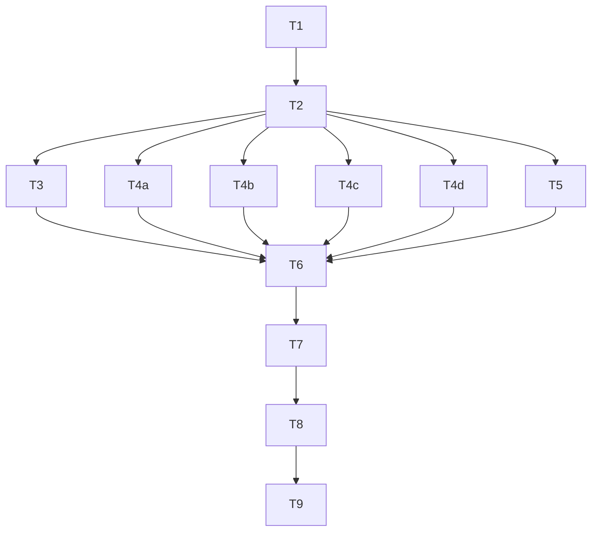

# Skill-resource dispositions and content-preserving migration

## Status

Draft, 2026-09-28; re-baselined 2026-09-28 on commit 611862e, after the
[provider-aware create-pull-request plan](../archive/plans/2026-09-28-provider-aware-create-pull-request.md)
was archived. Q1 answered (D6). Ready: approved for execution by the user on 2026-09-28. For
[issue 128](https://github.com/dpalfery/kyber-weave/issues/128).

## Problem and goal

Sixty-six supplemental files sit beside the 23 canonical `SKILL.md` files under
`products/kyber-squad/skills/`. Seven pages say they are retained "until #128 is accepted".
Nothing records what each file is for, which of its lines are policy a host should own, or
where that policy lives. A few references still state rules that duplicate the
`products/kyber-squad/standards/` templates, go beyond them, or contradict them (D3).

Goal: every resource gets a reviewed disposition and a line-level preservation record in a
CURRENT reference,
[`docs/kyber-squad/skill-resource-dispositions.md`](../kyber-squad/skill-resource-dispositions.md)
(D5). Portable policy the templates lack moves into them (D4). Duplicated normative lines
become pointers to the declared `<technology>-coding-standard`. One host's facts and taste are
removed and recorded as superseded. The retention wording in the docs is replaced by the
settled disposition. No resource is deleted, moved, or renamed. The only `SKILL.md` change links
`second-brain`'s templates so they deploy (D6); the 66/89 counts hold and the rendered count
moves from 118 to 119.

## Intake assessment

PLAN (D1). A bounded content migration with a test-backed audit; no new product capability.

## Development mode

`test-first` — repository default; the user did not opt out. The RED contract is a new
audit test class that fails until the audit, the template sections, and the reference
pointers exist.

## Discovery method

CodeGraph (`ResourceClosureBuilder`, `SquadSourceLoader.LoadResources`,
`SkillParser.DiscoverResources`), `docs_explore` (Kyber-Squad docs, documentation governance),
and direct reads of the dal-dev, csharp-dev, test-dev, and maui-dev references; the `sql`,
`data-access-layer`, `csharp`, `test`, and `maui` templates and the standards README;
`HotshotGoldenContractTests`, `OpenCodeRendererContractTests`, `KyberStandardsTemplatesTests`,
`DocsScaffolderTests`, `SquadPackAndReleaseTests`; and the seven docs that cite #128.
`docs_explore` reported code joins unresolved; no finding here depends on one.

## Approved decisions

| ID | Decision | Approval provenance |
|---|---|---|
| M1 | `development-mode: test-first`. | Default; the user did not opt out (conductor, 2026-09-28). |
| D1 | The artifact is a plan, not a spec. | User decision relayed by conductor, 2026-09-28. |
| D2 | A skill's own directory is an acceptable durable home for non-policy content: the 15 review lenses, MSBuild/CI technique, MAUI technique, Pylance/python procedure, product-owner phase references, PR provider files, the `create-pull-request` GitHub scripts, second-brain templates, setup inventory, and `setup-dev-environment/agents/openai.yaml` (kept; the audit records why it sits outside the reference closure). They stay in place with a recorded rationale. Policy-bearing references keep their path; their normative lines become a pointer to the declared `<technology>-coding-standard` (the #126 pattern) while technique and examples stay. SKILL.md routing, file paths, and the 64/88 counts do not change. Retiring any resource is out of scope; no follow-up todo is created. | User decision relayed by conductor, 2026-09-28. |
| D3 | `standards/sql` keeps its forward-only rule. `standards/data-access-layer` states that `Down()` is a host decision (optional) and stops mandating it. `dal-dev/references/migration-scripts.md:51` is superseded accordingly, and the template's `fluentmigrator rollback` line is reconciled with this. | User decision relayed by conductor, 2026-09-28. |
| D4 | Portable rules the templates lack are added to the matching template (sql, data-access-layer, csharp, test, maui as applicable). One host's preferences (e.g. "do not add Scalar") and host project facts (e.g. azure-ai-rag's Agent Framework / no-Semantic-Kernel statement, wrapper classes, agent names) are recorded as intentionally superseded, not added. `azure-ai-rag.md` loses its project facts and keeps its portable Azure OpenAI / AI Search technique as skill-owned procedure. | User decision relayed by conductor, 2026-09-28. |
| D5 | The content-preservation audit is a governed CURRENT `reference` document, `docs/kyber-squad/skill-resource-dispositions.md`, with one row per resource (all 66): path, content class, disposition (`retain-in-place` / `policy-migrated-to-template` / `superseded-intentionally` / `pointer-already-#126`), destination, and verification evidence. Every moved or superseded policy line names its destination section or supersession reason. It outlives this plan. | User decision relayed by conductor, 2026-09-28. |
| D6 (Q1) | Option (b): `second-brain/SKILL.md` turns its `references/templates.md` mentions into Markdown links so the file reaches every render (`second-brain` is already an evolved golden skill). `setup-dev-environment/agents/openai.yaml` stays packaged-only and is recorded as Codex skill-UI metadata: it sets `allow_implicit_invocation: true`, which is Codex's default, so leaving it out changes no behaviour. No renderer change. D6 amends D2's "SKILL.md routing does not change" for this one skill. | User answer "Link templates, record yaml", 2026-09-28. |

Applied, not new: under D4, `bff-yarp.md`'s host facts (`MotorcycleRag.WebUI.BFF.csproj`,
`Yarp.ReverseProxy` 2.3.0, .NET 10.0, "Pigment CSS") are superseded the same way.

## Decision ledger (Draft only)

| ID | Question | Options | Recommendation | Blocks | Status |
|---|---|---|---|---|---|
| D1–D5 | See Approved decisions. | — | — | — | ANSWERED |
| Q1 | Two resources never reach a `squad install` render, because the render closure follows Markdown links only: `second-brain/references/templates.md` (named in code spans in `second-brain/SKILL.md`, which tells the agent to read it) and `setup-dev-environment/agents/openai.yaml` (Codex skill-UI metadata nothing references). Both ship in both packages. The provider-aware plan already made the other four earlier cases (the PR provider files and scripts) link-reached. How should #128 treat these two? | (a) Record both as `packaged-only` in the audit, with reasons; second-brain's templates stay undeployed. (b) Turn second-brain's `references/templates.md` mentions into Markdown links so it deploys; `second-brain` is already an evolved golden skill, so no pinned bytes break. Record `openai.yaml` as `packaged-only` metadata. (c) Extend `ResourceClosureBuilder` to follow code-span resource paths (production C#, renderer tests change). | (b) — it fixes the last skill that points at a file it does not deploy, with a one-skill edit the golden contract already allows. | T2 Delivery column; T5 wording; a T4d task under (b) | ANSWERED (D6) |

## Investigation findings

1. **Inventory** (re-baselined at 611862e). 89 files = 23 `SKILL.md` + 66 resources:
   code-review lenses 15 and technology references 7, create-pull-request providers 2 and
   scripts 2, csharp-dev 6, dal-dev 3, github-devops 6, maui-dev 8, pr-review-fix-comments
   providers 2, product-owner 4, python-dev 3, second-brain 1, setup-dev-environment 2,
   test-dev 5. The provider-aware plan retired `create-pull-request-github`; its two scripts
   became the linked `create-pull-request/scripts/github-create-pr.{sh,ps1}`.
2. **Render closure.** `ResourceClosureBuilder` (`SquadSourceLoader.cs:1346-1561`) follows
   Markdown `LinkInline` targets transitively through Markdown resources and throws on a
   missing or escaping target. Fenced code is not parsed. 64 skill resources are in a
   closure; 21 agents + 10 agent resources + 23 skills + 64 = 118
   (`OpenCodeRendererContractTests`). The two outside every closure are listed in Q1.
3. **Golden contract.** `HotshotGoldenContractTests:31-32` pins the fixture's 64/88; the
   canonical tree now holds 66/89. Lines 292-304 pin the
   non-evolved skill-file path set, and 306-328 pin the bytes of non-evolved `SKILL.md` files.
   Resource content is not hashed. `EvolvedSkillIdentities` = bug-crusher, create-pull-request,
   pr-review-fix-comments, product-owner, second-brain; `RetiredSkillIdentities` =
   create-pull-request-github. `RecursivePackagesRetainEveryCanonicalSkillResourceAndResolveLocalReferences`
   (342-361) checks that the resources are present in both archives, and that SKILL.md links
   and inline paths under `scripts|references|assets|providers|agents` resolve in canonical
   source and the extracted plugin package. It checks neither resource-to-resource links nor
   resource content. The fixture JSON is SHA-pinned and is not edited.
4. **Templates reach consumers** through embedding in Core. `docs init --kyber-standards`
   seeds them, and `DocsScaffolderTests.ScaffoldWithKyberStandardsOnFreshRepoScaffoldsAllRichStandardsAndUpdatesConfig`
   asserts that the seeded bytes equal `KyberStandardsTemplates.Render` and pass
   `DocSpecValidator`.
5. **Policy-bearing references.**
   - `dal-dev/adonet-repository.md` mostly duplicates `data-access-layer`.
   - `schema-design.md` roughly 85% duplicates `sql`. Gaps: `xp_cmdshell` :17, Entra/Kerberos :19,
     `SCOPE_IDENTITY` :30, sargable predicates :33, deprecated `text`/`ntext`/`image` :41.
     Keep the Prime Directive :8-10 and the boundary section :70-78 as procedure.
   - `migration-scripts.md`: gaps at :58, :59 and :61. The D3 conflict is at :51, and the
     rollback command at :18.
   - `csharp-dev/aspnetcore-webapi.md`: gaps at :120 (empty collection returns `200 []`),
     :124 (no direct `HttpContext`) and :144 (route constraints); :87 (Scalar) is D4.
   - `bff-yarp.md`: its BFF rules at :32, :117-134 and :173-188 are gaps; its host facts are
     at :121 and :138-141.
   - `azure-ai-rag.md`: D4.
   - `test-dev/integration-test-patterns.md` and `unit-test-patterns.md` duplicate `test`.
     Gaps: cleanup in `DisposeAsync` or transaction-per-test (:116), and unique record ids
     (:117).
   - maui-dev has a few lines that duplicate the maui template: `data-binding.md:11`,
     `collectionview.md:25/199`, and `dependency-injection.md:50/120`.
6. **D3 conflict.** `sql` § Migrations says forward-only. `data-access-layer` § Commands lists
   `fluentmigrator rollback` (:75), and `migration-scripts.md:51` mandates `Down()`.
7. **The seven code-review technology references** have been pointer-only since #126 (verified
   on `sql.md`). Every `<x-coding-standard>` token in skills today names an existing template.
8. **Docs still citing #128 as pending** (re-checked at 611862e): the "retained until #128"
   clauses in `products/kyber-squad/README.md`, `docs/kyber-squad/README.md`,
   `docs/kyber-squad/architecture.md`, `docs/kyber-squad/requirements.md` (KS-001 and the
   golden-render requirement), `docs/kyber-squad/onboarding.md`, `docs/context-hygiene/skills.md`,
   and `docs/distribution.md`. The provider-aware plan already reworded their delivery claims:
   link-reached files render and code-span-only files are packaged only.
9. **Resolved by the provider-aware plan.** Its T5 made those passages list all five evolved
   skills and name `create-pull-request-github` as retired.

## Classification rule (binding on T2–T4)

- **Policy.** A decision a host could reasonably reverse: stack, library, pattern, naming,
  layout, or required practice. It goes into a template: `migrated` if the template lacks it,
  `duplicate` if the template already states it. The source keeps a pointer.
- **Technique.** A framework-correctness fact, how-to, example, platform fact, or security
  floor whose violation is a defect whatever the host prefers. It stays in the skill, as the
  #126 precedent kept platform facts and security floors.
- **Host fact or one host's taste.** Project names, versions, ports, wrapper classes, agent
  names, tuning constants, or a preference such as "no Scalar". It is `superseded`: removed
  and recorded with a reason (D4).
- **Tie-breaker.** A line that is both keeps its technique explanation and points to the
  standard for the rule.
- **Scope guard.** Only the dal-dev, csharp-dev, test-dev, and maui-dev references may carry
  `migrated`, `duplicate`, or `superseded` rows. A policy line found elsewhere is recorded as
  `retained` with its reason and reported to the architect as a scope change. It is not edited.
- **Pointer wording.** Use the registry property name in prose, as `adonet-repository.md:8-9`
  does. Never use a relative link out of the skill directory, because the closure builder
  rejects one.

## Audit document contract (`docs/kyber-squad/skill-resource-dispositions.md`)

Frontmatter: `id: squad/skill-resource-dispositions`, `doc-type: reference`,
`status: current`, `component: KyberSquad`, `owner: dpalfery`, `last-reviewed`.

The intro states D2, D4, D5, the classification rule, and the closure explanation (Q1). It
also says that quoted excerpts are records, not guidance.

`## Resource dispositions` has exactly 66 rows:

| Column | Content |
|---|---|
| Resource | The path relative to `products/kyber-squad/`, in a code span, e.g. `skills/dal-dev/references/migration-scripts.md`. |
| Content class | One of `policy-bearing`, `technique`, `procedure`, `lens-criteria`, `review-pointer`, `provider-guidance`, `script`, `template`, `inventory`, `metadata`. |
| Disposition | One of the four D5 values. |
| Delivery | `rendered` or `packaged-only`. |
| Destination | Human-readable. |
| Verification | Non-empty; for `packaged-only` rows it states the reason. |

`## Policy-line ledger` has the columns `Source | Line | Excerpt | Disposition | Destination | Anchor | Reason`:

| Column | Rule |
|---|---|
| Source | A resource path from the table above. |
| Line | The line number at base commit 611862e. |
| Excerpt | A code-span substring of that line, copied verbatim. It is at least 12 characters and contains no backtick or pipe. |
| Disposition | One of `migrated`, `duplicate`, `superseded`, `retained`. |
| Destination | `<technology> § <exact ## or ### heading>`. Required for `migrated` and `duplicate`; optional for `superseded` (D3 uses it). Otherwise `—`. |
| Anchor | A backtick-free, verbatim substring of that template section. Required whenever Destination is set. |
| Reason | Required for `superseded` and `retained`; it cites D2, D3, or D4 where one applies. |

How a resource's disposition follows from its ledger rows:

| Resource's ledger rows | Disposition |
|---|---|
| At least one `migrated` or `duplicate` | `policy-migrated-to-template` |
| At least one `superseded`, and no `migrated` or `duplicate` | `superseded-intentionally` |
| None of the above, and the file is one of the seven non-lens `skills/code-review/references/*.md` | `pointer-already-#126` |
| None of the above, any other file | `retain-in-place` |

## Test contract

The runner for every row is
`dotnet test tests/KyberWeave.Tests/KyberWeave.Tests.csproj -c Release --filter "FullyQualifiedName~SkillResourceDispositionAuditTests"`.
Rows that name regression classes add `|FullyQualifiedName~<Class>` terms to that filter.

Test ids (in the new class):

| Id | Test | What it asserts |
|---|---|---|
| A1 | `EveryCanonicalSkillResourceHasExactlyOneDispositionRow` | The files enumerated from disk equal the table's set, 66 of them, with no duplicates. |
| A2 | `DispositionsUseClosedVocabulariesAndAgreeWithTheLedger` | The closed values and the disposition mapping hold. |
| A3 | `DeliveryColumnMatchesTheRenderedResourceClosure` | Delivery agrees with the resources `SquadSourceLoader.Load` returns for each skill. |
| A4 | `LedgerDestinationsNameExistingTemplateSectionsContainingTheirAnchor` | Each destination section exists and contains its anchor. |
| A5 | `MovedAndSupersededExcerptsAreGoneAndRetainedExcerptsRemain` | `migrated`, `duplicate` and `superseded` excerpts are gone from their source; `retained` excerpts are still there. |
| A6 | `PolicyBearingResourcesPointAtEveryDestinationStandard` | Each such resource contains a token for every technology in its destinations, and every `<x-coding-standard>` token under `skills/**` names an existing template. |
| A7 | `EveryMarkdownSkillResourceResolvesItsLocalLinks` | Markdig `LinkInline` only, ignoring code blocks and `<tokens>`. Includes the fixture case `ADanglingLocalLinkInASkillResourceIsReported`. |
| A8 | `DocsInitSeedsEveryLedgerTemplateAnchor` | `KyberStandardsTemplates.Render` contains every anchor. |

The tests assert through Markdig-parsed tables and name the offending row in each failure message.

| Task | Test project or file | Runner command | Observable behavior | RED evidence required | GREEN acceptance |
|---|---|---|---|---|---|
| T1 | `tests/KyberWeave.Tests/SkillResourceDispositionAuditTests.cs` | the class filter | The contract A1–A8 exists, and A7 reports a dangling link in a fixture resource. | A1–A6 and A8 fail and name the missing audit doc; A1 also lists all 66 paths. A7's fixture case fails against a stub checker. A7's real-tree case passes at 611862e (a baseline, not RED). | A7 passes in both cases. The others still fail only because the doc is missing. |
| T2 | same (unedited) | same | The audit exists and is consistent. | Before: A1–A3 fail (the T1 run). After T2, record A4, A5, A6 and A8 failing. A5 must list every non-`retained` ledger row as still present, which proves the excerpts are verbatim. | A1–A3 pass, with no assertion changed. |
| T3 | same, plus `KyberStandardsTemplatesTests`, `DocsScaffolderTests`, `DocsInitCommandTests`, `SquadPackAndReleaseTests` | the class filter plus those classes | Template sections carry the anchors, and `docs init` seeds them. | A4 and A8 failing (T2 evidence). | A4 and A8 pass; the regression classes pass. |
| T4a, T4b, T4c | same, plus `HotshotGoldenContractTests`, `SquadResourceClosureTests`, `OpenCodeRendererContractTests`, `ZCodeRendererContractTests` | the class filter plus those classes | For each task's files: excerpts are gone (or retained), pointers are present, links resolve. | A5 and A6 failures that name the task's files (T2 evidence). | No A5 or A6 failure names the task's files; after all three, A5 and A6 pass. The regression classes pass (64/88, 113, golden path set and bytes). |
| T4d | same, plus `OpenCodeRendererContractTests`, `HotshotGoldenContractTests`, `SquadResourceClosureTests`, `SquadPackAndReleaseTests` | the class filter plus those classes | `second-brain` deploys its templates. | A3 fails on the `second-brain/references/templates.md` row, and the OpenCode count test expects 118 (T2 evidence). | A3 passes; the regression classes pass with the count at 119. |
| T5 | No test (prose only) | `docs validate .`, `docs drift .` | The seven passages state the settled disposition and delivery. | n/a | Zero findings. A grep of the seven files finds no "until … #128" retention clause. |
| T6 | Whole suite and CLI | see T6 | Everything is green, and the consumer paths are demonstrated. | n/a | All pass, with the evidence recorded. |
| T7 | No test (review) | `code-review` skill | A verdict. | n/a | APPROVE, or findings resolved. |
| T8 | No test (closeout) | `docs validate . --merge-ready` | The plan is archived. | n/a | Zero findings. |
| T9 | Gate suite | the AGENTS.md list | — | n/a | All 10 commands pass. |

## Tasks

### T1-RED-audit-contract

Specialist: test-dev. Skills: `test-dev`.
Scope: `tests/KyberWeave.Tests/SkillResourceDispositionAuditTests.cs` (new).
Depends on: none.

1. Implement A1–A8 per the audit contract. Locate the repository with `KyberWeaveTestPaths`
   and use `TempDirectory` for the A7 fixture. Follow `<test-coding-standard>` and
   `tests/KyberWeave.Tests/AGENTS.md`: names are assertions, and a `<summary>` gives the
   regression each test prevents.
2. Record the RED run described in the Test contract.

### T2-GREEN-audit-document

Specialist: docs-dev. Skills: `kyber-weave-docs`, `dal-dev`, `csharp-dev`, `test-dev`, `maui-dev`.
Scope: `docs/kyber-squad/skill-resource-dispositions.md` (new).
Depends on: T1.

1. Author the 66-row table and the ledger against base 611862e, using the classification rule.
   Every `packaged-only` row gives its reason. For `openai.yaml`, that reason is: Codex
   skill-UI metadata, referenced by no instruction, so no closure reaches it (D2, D6).
   Record `second-brain/references/templates.md` as `rendered`, its state after T4d.
2. Ledger every normative line in the policy-bearing references (Finding 5), with a planned
   destination and anchor that T3 will make real.
3. Pass A1–A3 without editing the tests, and record the A4/A5/A6/A8 RED run.

### T3-GREEN-template-additions

Specialist: docs-dev. Skills: `kyber-weave-docs`, `dal-dev`, `csharp-dev`, `test-dev`, `maui-dev`.
Scope: `products/kyber-squad/standards/{sql,data-access-layer,csharp,test,maui}/README.md` and
`products/kyber-squad/standards/README.md`.
Depends on: T2.

1. **sql.** Add, in the existing sections: `SCOPE_IDENTITY()` rather than `@@IDENTITY`; sargable
   predicates; no deprecated `text`/`ntext`/`image`; no `xp_cmdshell`; prefer Entra ID or
   Kerberos authentication. Leave § Migrations forward-only (D3).
2. **data-access-layer.** Add a `## Migrations` section:
   - one migration per schema change;
   - never edit an applied migration, add a new one instead;
   - the non-nullable-column pattern;
   - `Down()` is a host decision and optional; production correction is a forward migration,
     per `<sql-coding-standard>`.

   Reconcile `fluentmigrator rollback` in § Commands with D3: either annotate it as applying
   only where the host implements `Down()`, or remove it.
3. **csharp.** Add route constraints, the empty collection returning `200 []`, and "no direct
   `HttpContext` in actions". Add a conditional `## Backend-for-frontend` section with the
   portable rules from the `bff-yarp` ledger rows.
4. **test.** § Isolation gains per-test cleanup (`DisposeAsync` or transaction-per-test) and
   unique record ids.
5. **maui.** Change it only if the ledger records a gap.
6. **Standards README.** Record the #128 additions and link the audit.
7. Leave template frontmatter unchanged, add no host facts, and pass A4 and A8.

### T4a-GREEN-dal-dev-references

Specialist: docs-dev. Skills: `dal-dev`.
Scope: `products/kyber-squad/skills/dal-dev/references/{adonet-repository,schema-design,migration-scripts}.md`.
Depends on: T2.

Replace the `migrated` and `duplicate` lines with pointers to **<sql-coding-standard>** and
**<data-access-layer-coding-standard>**, and remove the `superseded` lines.

In `migration-scripts.md`, :51 becomes "`Down()` is a host decision". The `Down()` example stays
and is labelled optional, and the rollback command is annotated. The Prime Directive, the
boundary section, the Microsoft Learn index, and all examples stay. Resource `name` values do
not change.

### T4b-GREEN-csharp-dev-references

Specialist: docs-dev. Skills: `csharp-dev`.
Scope: `products/kyber-squad/skills/csharp-dev/references/*.md` (only the files that have
ledger rows).
Depends on: T2.

- `aspnetcore-webapi.md` loses "Do not add Scalar" (D4). Its duplicated rules point to
  **<csharp-coding-standard>**, and its code stays.
- `bff-yarp.md`: its BFF rules point to csharp § Backend-for-frontend, and its host facts are
  removed (D4). The overview, structure, config example, auth flow, pipeline order, and
  add-route procedure stay.
- `azure-ai-rag.md` is stripped of its project facts, agent tables, wrappers, and host tuning
  constants. It keeps the portable Azure OpenAI / AI Search technique (batching, hybrid search
  plus semantic ranking, chunk overlap, citations, transient retries, de-duplication,
  structured logging). Its secrets line points to csharp § Safety.

### T4c-GREEN-test-and-maui-references

Specialist: docs-dev. Skills: `test-dev`, `maui-dev`.
Scope: `products/kyber-squad/skills/test-dev/references/*.md` and
`products/kyber-squad/skills/maui-dev/references/*.md` (only the files that have ledger rows).
Depends on: T2.

Duplicated rules point to **<test-coding-standard>** or **<maui-coding-standard>**. Technique
and examples stay verbatim, including the `var` usages.

### T4d-GREEN-second-brain-templates-link

Specialist: docs-dev. Skills: `kyber-weave-docs`.
Scope: `products/kyber-squad/skills/second-brain/SKILL.md` and
`tests/KyberWeave.Tests/OpenCodeRendererContractTests.cs` (the literal rendered count only).
Depends on: T2.

1. Turn each `references/templates.md` code span in `second-brain/SKILL.md` (lines 15, 42, 58,
   and 72 at 611862e) into the Markdown link `[references/templates.md](references/templates.md)`.
   Change no other wording.
2. Update the literal `Assert.Equal(118, result.Files.Count)` in
   `OpenCodeRendererContractTests` to 119, with its comment.
3. RED: A3 fails on the `second-brain/references/templates.md` row (the audit says `rendered`;
   the closure lacks it), and the OpenCode count test still expects 118. GREEN: A3 passes, and
   the Hotshot, closure, renderer-count, and pack tests pass.

### T5-docs-retention-wording

Specialist: docs-dev. Skills: `kyber-weave-docs`.
Scope: `products/kyber-squad/README.md`, `docs/kyber-squad/README.md`,
`docs/kyber-squad/architecture.md`, `docs/kyber-squad/requirements.md`,
`docs/kyber-squad/onboarding.md`, `docs/context-hygiene/skills.md`, and `docs/distribution.md`.
Depends on: T2, Q1.

1. Replace each "retained until #128" clause with the D2 disposition and a link to the audit.
2. In KS-001, drop "all retained until … accepted".
3. State render delivery per D6: every skill resource reaches every render except
   `setup-dev-environment/agents/openai.yaml`, which is packaged-only Codex metadata.
4. Add the audit to "Jump In" in `docs/kyber-squad/README.md`.
5. Keep the counts 66/89, move the rendered count from 118 to 119 wherever it is stated, and
   bump `last-reviewed` on each governed page edited.

### T6-VERIFY-tests-and-consumer-paths

Specialist: test-dev. Skills: `test-dev`.
Scope: read-only; scratch directories outside the repository.
Depends on: T3, T4a, T4b, T4c, T5.

1. Build with `dotnet build KyberWeave.sln -c Release`. Then run the class filter, the
   regression-class filter, and the full suite.
2. Run `dotnet run --project src/KyberWeave.Cli -c Release --no-build -- docs init <scratch>/host --kyber-standards --no-skill`.
   Confirm that every ledger anchor appears in the seeded `standards/<tech>/README.md` under
   the scaffolded docs root.
3. From the repository root, run
   `dotnet run --project src/KyberWeave.Cli -c Release --no-build -- squad pack --format all --out <scratch>/pack`.
   Both archives must hold 89 skill-tree files, and every edited resource must be byte-equal
   to canonical.
4. Record the evidence for closeout.

### T7-REVIEW

Invoke the `code-review` skill over the branch diff. `review.policy.always-human` should not
fire, because no path under `products/kyber-squad/agents/**` changes. Resolve the findings,
or return them to the conductor.

### T8-CLOSEOUT

Specialist: docs-dev. Skills: `kyber-weave-docs`.
Scope: this plan, moved to `docs/archive/plans/2026-09-28-skill-resource-dispositions.md`,
and `docs/plans/README.md`.
Depends on: T7.

1. Use the frontmatter convention of the most recent archived plan (id prefix
   `archive/plans/`, archive status, `archive-date`).
2. Add a Closeout section with the RED and GREEN counts, suite totals, gates, the review
   verdict, and the demonstration evidence.
3. Re-point relative links; the audit link becomes `../../kyber-squad/...`.
4. In the index, restore "No active plans." and add the Archived row. Canonical docs: the
   audit and the standards README. No ADR: D1–D5 are recorded in the plan and the audit.
   The row says it fixes #128.
5. Harvest: D2, D4 and D5 are stated in the audit; D3 is in the data-access-layer template.
   Create no todo (D2).

### T9-FINAL-GATES

Specialist: test-dev. Scope: read-only. Depends on: T8.
Run the verification gates below. Any failure returns to the owning task.

## Dependency graph and MAX_CONCURRENCY



T3, T4a, T4b, T4c, T4d, and T5 have disjoint file scopes. MAX_CONCURRENCY: 6.

## Risks

| Risk | Mitigation |
|---|---|
| Ledger excerpts are not verbatim, which would make A5 vacuous. | T2's RED run must show every non-retained excerpt present at base. |
| A pointer adds a relative link out of the skill directory. | The pointer rule, plus the loader's own escape check and A7. |
| An accidental `SKILL.md` edit breaks the golden bytes. | `SKILL.md` is outside every scope; the Hotshot tests run as regression. |
| The DAL and sql templates disagree on migrations. | The D3 wording defers to sql's forward-only rule; the reviewer checks it. |
| Quoted superseded rules are retrieved as guidance. | The audit intro marks the excerpts as records, each with its reason. |
| Retained examples use `var`, against the csharp template default. | Accepted under D2: examples are not policy. |
| `docs drift` needs a CodeGraph index. | Run it where one exists; report it if not. |

## Out of scope

- Deleting, moving, or renaming a resource (D2), and any follow-up todo.
- `SKILL.md` edits other than T4d's `second-brain` link (D6).
- Renderer or closure changes (D6 chose a link, not code).
- The golden fixture.
- The root `.github/` self-deployment.

## Verification gates

```bash
dotnet restore KyberWeave.sln
dotnet format KyberWeave.sln whitespace --verify-no-changes --no-restore -v minimal
dotnet format KyberWeave.sln style --verify-no-changes --severity warn --no-restore -v minimal
dotnet build KyberWeave.sln -c Release --no-restore
dotnet test tests/KyberWeave.Tests/KyberWeave.Tests.csproj -c Release --no-build
dotnet run --project src/KyberWeave.Cli --no-build -c Release -- skill validate .apm/skills/kyber-weave-docs
dotnet run --project src/KyberWeave.Cli --no-build -c Release -- skill lint .apm/skills/kyber-weave-docs --min-desc-score 70
dotnet run --project src/KyberWeave.Cli --no-build -c Release -- skill scan .apm/skills/kyber-weave-docs --fail-on critical
dotnet run --project src/KyberWeave.Cli --no-build -c Release -- docs validate . --merge-ready
dotnet run --project src/KyberWeave.Cli --no-build -c Release -- docs drift .
```
