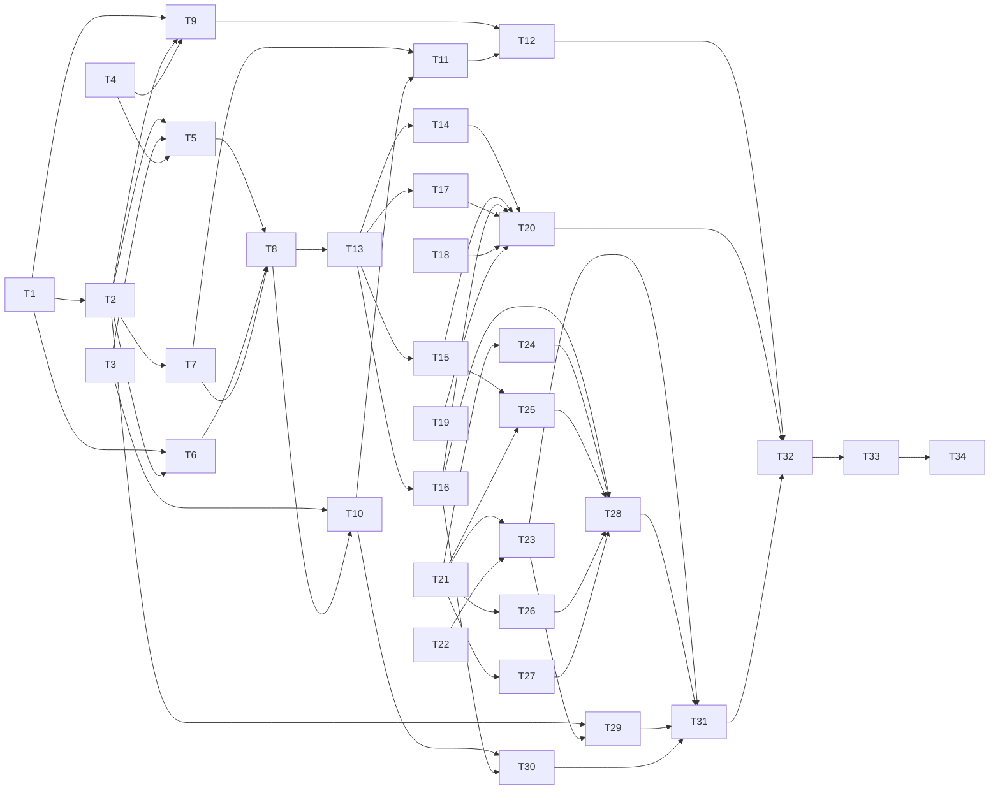

# Kyber Arbiter — three-step decision gates for Kyber-Squad delegation and review

## Status

**Draft — not executable.** The owner approved design decisions D1–D23 in conversation on
2026-10-01 and 2026-10-02. On 2026-10-02 `architect` did four things:

- finished discovery against `rev=13dcb73`;
- corrected two harness facts from vendor documentation;
- replaced the outline Test contract with runnable rows;
- rewrote the task list against exact files and symbols, then audited the dependency graph.

Two things must happen before this plan can be Ready:

- the owner answers the open questions in the [decision ledger](#decision-ledger-draft-only)
  (Q9, Q10 and Q11);
- the owner gives **approve and execute**.

Development mode: `test-first`. This is the default; the owner has not opted out.

## Problem and goal

**Problem.** The squad's in-flight decisions are made by the model being governed:

- **Delegation scope.** The conductor decides whether a delegation is inside the approved
  plan. Only its own instructions enforce that ("An approved Ready artifact is execution
  authority"). Nothing compares the delegation with the plan task it claims to execute.
- **Ready queue.** The rule in
  [execution-and-review.md](../../products/kyber-squad/agents/conductor/references/execution-and-review.md)
  is held only by the conductor's attention: dependencies must be complete, and file scope
  must not overlap work in flight.
- **Delegation rosters.** Claude ignores `Agent(roster)` for nested sub-agents, and
  Antigravity cannot enforce a roster at all. Both are recorded today as
  `permission-not-expressible` degradations.
- **Review fan-out.** `code-reviewer` spawns one seat per lens, and every seat decides its own
  applicability, so most of the fifteen spawns on a narrow diff exist only to return
  `SKIPPED`.
  - Every `major`-or-above finding pays for a refutation spawn, even when its evidence is
    plainly sufficient.
  - "Verify the quote" is done by reading files.
  - Every gate runs whichever stacks the change touched.

The end-of-run verdict is already computed by the
[`VerdictEngine`](../../src/KyberWeave.Core/Review/VerdictEngine.cs). Everything upstream of
it is still judgement.

**Goal.** Kyber Arbiter is a rule engine, configured in `.kyber-weave/kyber-weave.yml` and
invoked by harness hooks at the squad's decision points, not by the agents it gates. Each
rule's question is answered in up to three steps, the escalation pattern TypeSafe documents
for its JEV model:

| Step | What answers | Answers |
|---|---|---|
| 0 | Plain code | Exact facts: paths, task ids, dependencies, rosters, string matches |
| 1 | A decision model: TypeSafe's JEV in the cloud, or `nimble` / `tev1` on a local Ollama, through the same `/v1/systemone` API | Judgements about meaning, every question for a trigger batched in one parallel call |
| 2 | A reasoning agent | Anything step 1 flags or is unsure about: `architect` for delegations, the refutation lens for review |

## Approved decisions

| ID | Decision | Approval provenance |
|---|---|---|
| D1 | **Three steps.** Plain code answers every exact fact. A decision model answers judgements about meaning. A reasoning agent answers what the model flags or is unsure about. One confident red flag is enough to escalate; signals are not averaged. Thresholds are per rule and scale with the cost of a wrong answer. | The owner first chose "rules only" (2026-10-01). Revised by the owner the same day after reviewing TypeSafe's skill, its confidence guidance and its escalation cookbook ([sources](#sources)). |
| D2 | **A separate binary, `kyber-weave-arbiter`, carries the machine surfaces**: `hook` (harness hook adapter) and `serve` (stdio MCP server). The human surfaces are `kyber-weave arbiter …` in the existing CLI. The engine lives in Core. | Owner, 2026-10-01, chose a separate binary. The CLI split follows [the MCP project's stdout rule](../../src/KyberWeave.Mcp/AGENTS.md): no Spectre.Console in a binary whose stdout is a protocol. |
| D3 | **Harness hooks enforce; agents do not trigger the Arbiter.** | Owner, 2026-10-01: "agents should not be causing the triggers … hooks (deterministic)". |
| D4 | **Fallback where a harness cannot hook the decision point.** The conductor calls the Arbiter MCP server before dispatching. `code-reviewer` calls it once before fan-out on harnesses whose hooks do not fire inside sub-agents. | Owner, 2026-10-01 (answers on harness gaps and on the review gap). |
| D5 | **Fail-closed command hooks.** Any internal error produces an explicit block with a reason, never a silent pass. On conductor triggers it escalates (D15) with `ANSWER: error`. | Owner, 2026-10-01. |
| D6 | **Hooks on every harness that supports them.** Two Copilot surfaces are priority: VS Code and Copilot CLI. | Owner, 2026-10-01. |
| D7 | **Support is claimed from vendor documentation.** Misbehaviour is fixed as a defect, not pre-verified with live probes. | Owner, 2026-10-01: "trust the docs, fix as bugs appear". |
| D8 | **Squad owns a marked block in shared hook files.** Where a harness keeps hooks in one shared file, Squad writes a marked, receipt-tracked block into it, like the Config Reg block. This needs an ADR, because it crosses the "Squad does not own settings files" boundary in [the Squad architecture](../kyber-squad/architecture.md) and ADR 0026's owned-files rule. | Owner, 2026-10-01. |
| D9 | **Plans are parsed as authored**, using C#, Markdig and regex at evaluation time. No generated artifacts. | Owner, 2026-10-01: "not crazy about creating a bunch of assets". |
| D10 | **`undecidable` never allows** on conductor triggers. The dispatch is blocked and escalated (D15). A plan with no parseable tasks is itself escalated (`KW-ARB-PLAN-001`), because its tasks are what tell the conductor which agents to dispatch. | Owner, 2026-10-01. |
| D11 | **Code review uses hooks, with the refutation lens as step 2.** A lens spawn the Arbiter is confident does not apply is denied with a reason the reviewer records as `SKIPPED`. A finding the Arbiter verifies with high confidence skips its refutation spawn. Everything else goes to the lens or refutation pass as today. The Arbiter never drops a finding on a model's answer alone. | Owner, 2026-10-01 (hooks only; refutation lens as review's step 2, replacing open question Q5). |
| D12 | **Gates may declare `applies-when: paths`.** The Arbiter evaluates the predicate. The gate report lists a gate that does not apply with its reason, rather than omitting it. | Owner, 2026-10-01. |
| D13 | **The council still runs on reserved (`always-human`) paths**, so the human reviewer receives the findings. | Owner, 2026-10-01. |
| D14 | **Kyber-Squad ships default rules with permanent ids** under the `KW-ARB-*` prefix. Hosts tune or disable them by id, and add their own, in `.kyber-weave/kyber-weave.yml`. | Owner, 2026-10-01 (shipped defaults; prefix chosen with the name). |
| D15 | **Every non-allow outcome on the conductor's triggers escalates to `architect`.** The harness blocks the dispatch, and the reason it shows the conductor is an escalation envelope (see [Escalation](#escalation)). The conductor dispatches `architect` with that envelope and does not retry the blocked delegation unchanged. `architect` decides whether to resolve the escalation itself or return `NEEDS_DECISION` for the conductor to relay to the user. There is therefore no effect that asks the user directly. | Owner, 2026-10-01: "all non allow effects should go to architect. the architect can decide to ask the user or not". |
| D16 | **The feature is named Kyber Arbiter.** JEV is TypeSafe's model, named after William Stanley Jevons, so it is one provider behind the Arbiter, not the feature's name. Commands are `kyber-weave arbiter …`, the binary is `kyber-weave-arbiter`, rule ids are `KW-ARB-*`, and the configuration section is `arbiter:`. | Owner, 2026-10-01. |
| D17 | **One `systemone` client serves two endpoints, or the provider is `none`.**<br>• TypeSafe's cloud: `https://api.typesafe.ai/v1`, running `jev-*`.<br>• Local Ollama 0.35 or later: `http://localhost:11434/v1`, running `nimble` or `tev1`. Ollama serves the same `/v1/systemone` request and response shape, probabilities and confidence included.<br>The client is hand-written on the BCL `HttpClient`, because TypeSafe ships no .NET SDK; the CLI's `GitHubReleaseClient` is the precedent. The model is pinned in configuration, and the decision log records the model that answered. | Owner, 2026-10-01, asked for JEV and Ollama. Revised 2026-10-02, when the owner pointed out Ollama's JEV-style decision models: the earlier OpenAI-compatible adapter for general chat models and its confidence workaround (former Q7) are dropped. |
| D18 | **The API key is read from the `TYPESAFE_API_KEY` environment variable, then from the OS credential store** (macOS Keychain, Windows Credential Manager, Linux Secret Service), where `kyber-weave arbiter setup` writes it. It never appears in `kyber-weave.yml`, in any MCP or hook configuration file, or in a log. Both the hook processes and the MCP server resolve it the same way. A local Ollama endpoint needs no key. | Owner, 2026-10-01. |
| D19 | **With no provider configured, model rules are off and reported.** Steps 0 and 2 still run. Each skipped model rule is logged, and `doctor` warns. A configured provider that errors or times out is `undecidable`, which escalates on conductor triggers. The default provider is `none`, so no repository content leaves the machine until a provider is configured. | Owner, 2026-10-01. |
| D20 | **TypeSafe's skill is reference only.** It is not installed or vendored by this plan. The Arbiter documentation links to it, and whoever implements the provider client or writes model rules installs it then. | Owner, 2026-10-01. |
| D21 | **Delegation identity and the conductor's contract.**<br>• The conductor writes `PLAN_FILE:` and `TASK:` header lines in every delegation. Inferring them from the plan index and the prompt is used for diagnosis only, never to decide.<br>• Hook timeouts are covered by a latency budget and by an audit: `code-reviewer` flags any delegation with no matching Arbiter decision. | Owner, 2026-10-01 (former open questions Q3 and Q4, "follow your recommendation" and "do both"). |
| D22 | **Install and update come in three parts:**<br>• **The binary** ships through `install.sh` and `kyber-weave update`, like `kyber-weave-mcp`, with a `--no-arbiter` opt-out.<br>• **Hook wiring** is rendered by `squad install` / `squad update` when `arbiter:` is enabled. Hooks are rendered per agent, and that is how the caller's identity is trusted.<br>• **Each user's provider choice and key** go through `kyber-weave arbiter setup \| status \| doctor`, with an optional user-level override at `~/.config/kyber-weave/arbiter.yml`. | Owner, 2026-10-02 (former open question Q6, "go with recommended"). |
| D23 | **`setup` suggests `nimble` as the local model** when Ollama 0.35 or later is present: 9B, 9.3 GB, about 8k tokens per question, and 74.8% against JEV's 76.0%. `tev1` stays selectable, but its usable input of about 2,000 tokens is too small for most of the shipped delegation and claim checks. | Owner, 2026-10-02 (former open question Q8, "go with nimble"). |

## Decision ledger (Draft only)

Every owner decision is recorded under Approved decisions. Questions found during
`architect`'s discovery on 2026-10-02 are listed here. Ids continue after the former open
questions Q1–Q8 so that no id is reused.

| ID | Question | Options | Recommendation | Depends on | Status |
|---|---|---|---|---|---|
| Q9 | How is this change delivered, given its size (finding 25)? | (a) One plan and one PR. (b) Three sequential plans and PRs, by phase. (c) Raise the review size ceiling. | (b) | — | OPEN |
| Q10 | How is Squad's owned block marked inside a JSON hook file (finding 26)? | (a) By command signature, plus a named hook group on Antigravity. (b) By a sentinel key on each entry. (c) No shared files. | (a) | Q11 is (b) or (c) | OPEN |
| Q11 | How are harnesses with project-wide hooks and no caller identity gated (findings 32 and 33)? | (a) Trusted callers only. (b) Infer the caller from the target. (c) Identify the caller from headers. | (c) | — | OPEN |

### Q9 — Delivery shape

**Evidence.** The accumulated change is estimated at about 18,000 changed lines including
tests (finding 25). That is above this repository's `review.policy.max-reviewable-lines:
10000`, so `review verdict` returns `NEEDS_HUMAN` on size (`KW-REVIEW-009`) as well as on
reserved paths (`KW-REVIEW-008`). `code-reviewer` is told that "a change too large to review is
too large to ship in one piece". `docs validate --merge-ready` fails on any plan still in
`docs/plans/` (`KW-DOC-LIFECYCLE-003`), so one plan cannot ship through several PRs.

**Options.**

- **(a) One plan, one PR.** Accept the size escalation, with one human review of the whole
  change.
- **(b) Three sequential plans, each with its own PR and council pass.**
  - This plan delivers Phase A: the engine, the CLI, `applies-when`, ADR 0033 and the
    Arbiter documentation, which harvest D1–D23.
  - Phases B (the binary and distribution) and C (Squad wiring and the agent contracts)
    become todos when Phase A closes. Each is re-planned from its task section below.
  - Phase A is estimated at 9,000 to 10,000 lines, so it may still reach the ceiling.
- **(c) Raise `max-reviewable-lines`.** Not recommended. It widens a reserved policy to make a
  failure disappear, which the repository's rules forbid in spirit.

**Recommended: (b).** Each PR stays near the ceiling and gets a council pass of its own.
Phase A delivers a usable `kyber-weave arbiter` CLI and gate scoping before anything renders
hooks into a host.

### Q10 — Marking the owned block in a JSON file

This question applies only if Q11 is (b) or (c). Under Q11 (a), Squad writes no shared hook
file.

**Evidence.**

- D8 asks for a block "like the Config Reg block". Config Reg uses HTML comment markers.
- Cursor, Factory and Devin show plain JSON with no comments. None of them documents whether
  an unknown key on a hook entry is accepted (research, 2026-10-02).
- Antigravity's top-level keys are hook-group names. An unknown top-level key would therefore
  be read as another hook group, and a named group is that harness's own "block".

**Options.**

- **(a) Identify Squad's entries by their command**, `kyber-weave-arbiter hook --harness <h>
  --caller <agent>`. On Antigravity, use a top-level hook group named `kyber-arbiter`. The
  receipt records each owned entry's JSON location and canonical digest. Nothing that is not
  a documented field is written into the harness file.
- **(b) Add a sentinel key to each entry**, such as `"kyberSquad": "owned"`. No vendor
  documents that unknown keys are tolerated.
- **(c) Write no shared files.** Those harnesses fall back to D4.

**Recommended: (a).** It uses only documented fields. It survives a harness that validates
strictly. It keeps D8's receipt tracking, and the ADR records that a JSON block is "marked" by
its command rather than by a comment.

### Q11 — Harnesses without a trusted caller

**Evidence (research, 2026-10-02).**

- D22 trusts the caller because hooks are rendered per agent. Per-agent hooks are documented
  only for Claude (agent and skill frontmatter) and Copilot in VS Code (`.agent.md`
  frontmatter, Local harness, Preview).
- A caller field in the hook payload is documented only for Claude (`agent_type`).
- On Copilot CLI, Cursor, Codex, OpenCode, Kilo, Antigravity, Factory, Pi and Devin, hooks are
  project-wide and the payload does not say which agent made the call.
- Those hooks also fire in sessions that never use Squad. A user's ad hoc session that
  dispatches `csharp-dev`, and the `bug-crusher` skill dispatching a specialist, both look
  like any other dispatch.

**Options.**

- **(a) Trusted callers only.**
  - Hooks are rendered on Claude and on Copilot in VS Code.
  - Every other harness uses the D4 MCP fallback and records `arbiter-not-enforced`.
  - No shared files are written, so D8's owned blocks and Q10 are dropped, along with tasks
    T22, T23 and ADR 0034.
  - Copilot CLI, a D6 priority surface, becomes fallback-only.
- **(b) Infer the caller from the target.**
  - Project-wide hooks treat any dispatch of an agent on the conductor's roster as a
    conductor delegation.
  - This enforces on every hooked harness. It also blocks every Squad agent used outside the
    conductor, `bug-crusher` included.
  - `KW-ARB-ROSTER-001` cannot run, because it needs the caller.
- **(c) Identify the caller from headers.**
  - Project-wide hooks apply conductor rules only to dispatches that carry D21's
    `PLAN_FILE:` / `TASK:` headers. They apply review rules only to dispatches that carry
    `LENS:` or `REFUTE:` headers (see [Trigger classification](#trigger-classification-and-facts)).
  - Any other dispatch passes and is logged with `caller: unidentified`.
  - `KW-ARB-ROSTER-001` runs only where the caller is trusted.
  - `kyber-weave arbiter audit` flags header-less dispatches to conductor-roster agents.

**Recommended: (c).** It keeps D6's hooks on Copilot CLI and the other harnesses, and D8's
owned blocks. Sessions that never use Squad are not gated. A conductor that omits the headers
D21 already requires is caught by the audit rather than silently trusted. On Claude and
Copilot in VS Code the caller stays trusted, so a header-less conductor delegation is
escalated there (D10, D21).

## Investigation findings

1. **The conductor is denied MCP access on purpose.**
   [`ClaudeRenderer.ResolveTools`](../../src/KyberWeave.Core/Squad/Rendering/ClaudeRenderer.cs)
   withholds every MCP server from the pure orchestrator. The `orchestrator` profile in
   [capabilities.yml](../../products/kyber-squad/profiles/capabilities.yml) also denies search,
   write and execute. The D4 fallback therefore needs:
   - a new capability (working name `decision.query`) granted to `orchestrator` and `reviewer`;
   - renderers that lower that capability to the Arbiter server alone.

   `capabilities.yml` is an `always-human` path.
2. **MCP servers are granted as whole-server wildcards** (`mcp__kyber-weave__*` on Claude,
   `kyber-weave/*` on Copilot). A separate server name is the only portable way to grant the
   Arbiter without also granting the docs tools, which is consistent with D2.
3. **`VerdictEngine` already evaluates reserved paths and size ahead of findings.** The
   Arbiter's review rules reuse `PathGlob` and the loaded `ReviewConfig` rather than re-parsing
   policy.
4. **`ProcessRunner` is argv-only and refuses a shell.** Git facts and the credential-store
   CLIs (`security`, `secret-tool`) go through it. Windows Credential Manager is reached by
   P/Invoke, with no package.
5. **Plans follow a regular enough format to parse.** This finding was corrected on
   2026-10-02. The archived plans use three label families, so the parser must accept all of
   them:
   - Headings are `### T<n>[a-z]` with optional `-SUFFIX` parts and an optional `: title`
     (`### T1: …`, `### T1-RED-audit-contract`, `### T4a-GREEN-…`).
   - Files are given by `**Files:**`, `**scope**:` or `Scope:`, either inline or as bullets of
     backticked paths.
   - Dependencies are given by `**Depends on:**`, `**depends-on**:` or `Depends on:`.

   Test-contract rows are `| T1 | <files> | …`. Out-of-scope boundaries have their own
   section.

   Two of the eight most recent archived plans, `2026-09-29-pr-158-defects` and
   `2026-09-29-glib-variant-str-iter-backport`, have no `## Tasks` section. Under D10, such a
   plan is escalated at its first delegation.
6. **A new agent field would be a schema change, and none is needed.**
   [agent.schema.json](../../products/kyber-squad/schemas/agent.schema.json) declares
   `additionalProperties: false`. Finding 18 shows that hook rendering derives from
   `delegates-to`, so neither the schema nor `SquadSourceLoader.ParseAgent` changes.
7. **Release lists its assets explicitly.** Release publishes two .NET binaries
   ([release-local.sh](../../scripts/release-local.sh)), and the checksum verifier enumerates
   every asset ([ADR 0027](../adr/0027-release-integrity-checksums-signing-deferred.md)). A
   third binary adds five platform archives to each list.
8. **Prior art.** [Squad architecture §3](../kyber-squad/architecture.md) rejected skill-scoped
   Claude hooks for holding the conductor's profile, because skill hooks stay registered for
   the rest of the session. The same lifetime applies to an Arbiter hook declared on the
   `/conductor` entry-point skill; see risk R5.
9. **Claude Code hook facts** (read 2026-10-01, confirmed 2026-10-02):
   - `PreToolUse` on the `Agent` tool can deny, and the reason is shown to the model.
   - `PreToolUse` and `PostToolUse` share `tool_use_id`, so one delegation's Pre and Post can
     be paired.
   - Hooks fire inside sub-agents with `agent_id` and `agent_type`. On the main thread,
     `agent_type` is present only under `--agent` or the `agent` setting.
   - Hooks can be declared in agent and skill frontmatter. Project subagent frontmatter hooks
     run only after the workspace trust dialog is accepted. Plugin subagents ignore `hooks`.
   - `SubagentStart` carries no parent `tool_use_id`, so per-edit enforcement inside a worker
     is out of scope.
10. **TypeSafe JEV facts** (read 2026-10-01).
    - **API:** `POST https://api.typesafe.ai/v1/systemone` with `Authorization: Bearer <key>`.
      The body is `state` (a string, object or array), `model`, and `questions`, a map of
      named questions.
    - **Question types:**
      - `choice` returns the chosen option, the probabilities and a confidence;
      - `score` returns 2–10 levels, the probabilities and a confidence;
      - `noul` returns a probability of yes, with no separate confidence.
    - **Errors:** 401, 422, 429 and 529. Retry 429 and 529 with backoff.
    - **Published figures:** about 70–500 ms latency and $0.042 per million input tokens;
      output is free. The context window is 32k tokens for the state plus the longest question.
    - **Weaknesses it documents:** counting, dates and negation. It "can still emit a completely
      wrong valid value".
    - **Data:** it does not train on customer data. Zero data retention is enterprise-only.
11. **TypeSafe's own guidance** (skill and cookbooks):
    - Keep rules, calculations and exact lookups in code.
    - Ask one narrow judgement per question, with named state fields.
    - Batch independent questions over the same state.
    - Scale thresholds with the cost of a wrong action, start conservative, and validate on
      your own data.
    - For a decision that depends on several judgements, use the least certain one.
    - Escalate on one confident red flag rather than an average.
    - The citation-check cookbook classifies a quoted claim as fabricated (absent, which plain
      code catches), contradicted, unsupported, or verified.
12. **Ollama decision models** (read 2026-10-02).
    - **API:** Ollama 0.35 (released 2026-09-28) serves `/v1/systemone`, "based on TypeSafe's
      Jev API". It takes the same `state`, `model` and `questions`, and returns the same
      answers, probabilities and confidence.
    - **Key:** none required. Ollama's guide sets `TYPESAFE_API_KEY=ollama` only so TypeSafe's
      SDKs run unchanged.
    - **Models:**
      - `nimble`: Bespoke Labs, 9B, Apache 2.0, fine-tuned from Qwen3.5-9B, about 8k tokens
        per question.
      - `tev1`: Together AI, experimental, 4B and 0.8B. It runs "with a context of about 2,000
        tokens", and Together says "keep inputs short".
    - **Request bodies:** up to 64 KiB for both.
    - **Accuracy:** on Ollama's 13-dataset comparison (3,880 decisions), `nimble` scored 74.8%,
      JEV 1.13.0 76.0%, `tev1` 4B 73.3% and `tev1` 0.8B 63.5%.
    - **Caveats:** Ollama warns that "a probability of 0.9 doesn't mean the answer is right 90%
      of the time on your data". Together AI has not fully tested `tev1` for prompt injection
      or calibration.

Findings 13 to 35 come from discovery on 2026-10-02. Code facts were read through CodeGraph
and the governed docs tools at `rev=13dcb73`. Harness facts were gathered by `research-agent`
from the vendor pages listed under [Sources](#sources).

13. **Configuration.** `KyberWeaveYamlDocument` (internal) holds one property per section.
    `KyberWeaveConfigLoader.FromDocument` merges each section through a `*ConfigLoader.Merge`
    into `KyberWeaveConfig`, whose `Clone` must learn every new section. Lists replace rather
    than append ([Core AGENTS.md](../../src/KyberWeave.Core/AGENTS.md)). The `arbiter:` section
    follows the same pattern: `ArbiterYamlSection`, `ArbiterConfigLoader.Merge` and
    `KyberWeaveConfig.Arbiter`.
14. **Gates have no notion of "not applicable".**
    - `ReviewGateYaml` declares only `Id`, `Run`, `Blocking` and `TimeoutSeconds`.
    - `GateRunner.Run(config, workingDirectory, stopOnBlockingFailure)` takes no changed paths.
    - `GateResult.Passed` is `ExitCode == 0`.
    - `VerdictEngine.EvaluateGates` and `GradeRisk` treat every blocking gate that did not pass
      as failed.

    D12 therefore needs four things: a not-applicable state that is neither passed nor failed,
    a changed-path source for `review gates` (a new `--base <ref>`), a new outcome id, and
    tolerant reading of older gate reports. The ids in use are `KW-REVIEW-001`…`-012`,
    `-020`…`-025` and `-030`…`-032`, so the next free gate id is `KW-REVIEW-026`.
15. **Nothing in the codebase computes a diff.** The only git call is `git rev-parse` in
    `CorpusProvenance` (Mcp). Arbiter git facts are new code over `ProcessRunner`.
16. **HTTP in Core has a precedent.** `OpenAiCompatibleEmbeddingGenerator` takes an injected
    `HttpMessageHandler`. Core does not construct its own collaborators
    ([Core AGENTS.md](../../src/KyberWeave.Core/AGENTS.md)), so the handler, the credential
    store and the user-home path are injected by the composition roots: the CLI and the
    Arbiter binary.
17. **Squad source.** `SquadAgent` carries `DelegatesTo` and `CapabilityProfile`, and
    `SquadSourceLoader.ParseCapabilityProfiles` throws when a profile omits any vocabulary
    capability. `decision.query` therefore needs an explicit decision in all ten profiles.
18. **Hook rendering derives from `delegates-to`.** The agents that dispatch are exactly
    those with a non-empty `delegates-to`: `conductor`, `architect`, `product-owner` and
    `code-reviewer`. A hook needs only `--harness <token>` and, where the harness hooks per
    agent, `--caller <name>`. The trigger is classified from the caller and target pair.
19. **MCP grants differ per renderer.**
    - Claude hard-codes `StandardMcpTools`.
    - ZCode and Devin enumerate `toolchain.yml` `required-mcp-tools` by exact name in
      `QualifiedMcpToolNames`.
    - Factory emits `mcpServers: []`.

    Adding the Arbiter server to `toolchain.yml` would widen the ZCode and Devin grants unless
    the renderers filter it first. So the renderer changes land before the canonical data
    (T28 depends on T24–T27). The Arbiter server is granted only on fallback targets, and
    only to agents whose profile allows `decision.query`. Holding `arbiter_evaluate` is
    therefore the agent's signal to use the D4 fallback, and canonical bodies need no target
    knowledge.
20. **Receipts own whole files only.**
    - A file is owned as `SquadOwnedFile(RelativePath, Sha256, Target, Adopted)`.
    - `SquadDeploymentPlan.CreateInstall` and `CreateUpdate` throw `UnmanagedCollision` on an
      existing unowned file.
    - `SquadStateStore` deserializes with `UnmappedMemberHandling.Disallow` and checks the
      exact set of fields.
    - Project receipts are `kyber-squad.receipt/v1` and Global receipts `v2`
      ([ADR 0024](../adr/0024-squad-global-receipt-layout-marker.md)).

    D8's owned block therefore needs a new receipt member and schema id, block-aware
    install, update and uninstall plans, and drift reporting in `status` and `doctor`. The new
    schema is written only when a receipt carries a block, so receipts without blocks stay
    byte-identical, following ADR 0024.
21. **Render plumbing.** `SquadRenderRequest` (37 callers) and `SquadRenderResult` are
    positional records, so optional trailing parameters keep every caller compiling.
    `SquadLifecycleService` builds the request from `SquadInstallRequest` and
    `SquadUpdateRequest`.
22. **Golden and content tests pin the canonical agents.**
    - `HotshotGoldenContractTests` pins every agent body except the `EvolvedAgentIdentities`
      (architect, code-reviewer, conductor, product-owner and task-reviewer). It pins every
      skill file except the `EvolvedSkillIdentities`.
    - Editing `review-lens` and the `code-review` skill therefore means adding both to those
      lists.
    - `SquadCanonicalContentTests` already asserts conductor body content, and is where the
      new contract assertions belong.
23. **Embedded resources have a precedent.** Core embeds
    `products/kyber-squad/standards/*/README.md`. Inside a host repository the canonical
    source is absent, but the Arbiter still needs three things: each agent's `delegates-to`
    and description (`KW-ARB-ROSTER-001`, `KW-ARB-OWNER-002`), and each lens's Applicability
    section (`KW-ARB-LENS-001`). Embedding `products/kyber-squad/agents/*.md` and
    `skills/code-review/references/lenses/*.md` in Core keeps one source of truth. It is
    version-locked with Squad by KS-005.
24. **Distribution footprint of a third binary.**
    - **Workflows and scripts:** `.github/workflows/release.yml` and `ci.yml`;
      `scripts/release-local.sh`, `install.sh` (the `NO_MCP` pattern),
      `verify-release-checksums.sh` (20 assets become 25) and `update-loop.sh`.
    - **Packaging:** `homebrew/kyber-weave.rb`; under `npm/`, `package.json`,
      `lib/platform.js`, `lib/download.js`, `scripts/postinstall.js`, `bin/` and `README.md`.
    - **CLI code:** `SelfUpdater` (the `KyberDashMinVersion` floor pattern),
      `SelfUpdateOptions` in `SelfUpdateHost.cs`, `UpdateSettings`, `UpdateCommand`,
      `ProcessProbes` and `SquadDoctorCommand`.
    - **Tests that pin it:** `ReleaseTests` and `UpdateCommandTests`. Homebrew and npm have no
      tests today.
25. **Size.** This is architect's estimate:

    | Area | Approximate changed lines |
    |---|---|
    | Core engine and providers | 5,000 |
    | Binary | 1,800 |
    | CLI | 1,000 |
    | Squad integration | 1,800 |
    | Review | 300 |
    | Agent text | 400 |
    | Distribution | 500 |
    | Documentation | 1,500 |
    | Tests | 6,000 |

    That totals about 18,000 lines, above `max-reviewable-lines: 10000` (→ Q9).
26. **JSON hook files carry no comments**, so Config-Reg-style markers cannot be written into
    them (→ Q10).
27. **`artifacts/` is git-ignored here, but not necessarily in a host.** `arbiter doctor`
    checks `git check-ignore artifacts/arbiter` and warns (`KW-ARB-LOG-001`).
28. **Global scope.** `arbiter:` lives in a project's `.kyber-weave/kyber-weave.yml`, and
    D22 renders hooks "when `arbiter:` is enabled". A `--global` install has no project
    configuration to read. It therefore renders no hooks and records `arbiter-not-enforced`
    per target, with the details "global scope".
29. **No managed glossary exists in this repository.** The default `docs/glossary.md` is
    absent. *Arbiter* and *JEV* are defined in the Arbiter architecture document's
    terminology section instead. Creating the repository's first managed glossary is out of
    scope.
30. **KS-001 pins "10 progressive-disclosure references"** for agents. The new architect
    escalation reference makes 11, so [requirements.md](../kyber-squad/requirements.md)
    changes with it.
31. **Reserved paths.** Files named `*Credential*` match the `always-human` pattern
    `**/*credential*`, as do `products/kyber-squad/agents/**`, `capabilities.yml` and
    `.kyber-weave/kyber-weave.yml`. `NEEDS_HUMAN` is expected (D13).
32. **Caller identity per harness** (research, 2026-10-02; see the matrix).
    - A payload field is documented only on Claude.
    - Per-agent hooks are documented only on Claude and on Copilot in VS Code (Local harness).
    - Every other hook-capable harness has project-wide hooks with no caller (→ Q11).
33. **Project-wide hooks fire in every session in the repository**, including sessions that
    never use Squad. Whatever Q11 decides, an event with no recognised caller and no Squad
    header never matches a conductor trigger.
34. **Corrections to the 2026-10-01 matrix** (research, 2026-10-02).
    - **Codex** documents that `PreToolUse` matches `spawn_agent` (also matched as `Agent`)
      and can deny it. Under D6 and D7, Codex moves from the MCP fallback to a hooked
      harness. R7 now covers only Warp and ZCode.
    - **Copilot in VS Code** documents `permissionDecision: deny`, not only `ask`. Its Local
      harness ignores hook matchers, so the adapter must filter on `tool_name` itself. Its
      dispatch tool is `runSubagent`.
    - **Copilot CLI's** maintainer states on copilot-cli#3013 (2026-08-05) that pre- and
      post-tool hooks now apply to sub-agent tool calls. The reference page is still silent,
      so the cell stays `?`.
    - **Pi** has no built-in dispatch tool. The Squad renderer targets
      `@tintinweb/pi-subagents`, whose tool the Pi hook must match.
    - **Devin's** dispatch tool is `run_subagent`. That `PreToolUse` fires for it is inferred,
      not stated.
    - **Cursor** hooks fail open by default. A per-hook `failClosed: true` exists, and D5
      requires it.
35. **Project hook locations** (research follow-up, 2026-10-02).
    - **Hooks-only directories** that Squad can add its own file to:
      - Copilot CLI: `.github/hooks/*.json`, all run in alphabetical order. VS Code's Local
        harness also discovers these files.
      - OpenCode: `.opencode/plugins/`.
      - Kilo: `.kilo/plugin/` or `.kilo/plugins/`.
      - Pi: `.pi/extensions/`.
    - **Single hooks-only files** that need an owned block:
      - Cursor: `.cursor/hooks.json`.
      - Antigravity: `.agents/hooks.json`, with named groups.
      - Factory: `.factory/hooks.json`.
      - Devin: `.devin/hooks.v1.json`.
      - Codex: `.codex/hooks.json`.
    - **Two hazards follow.**
      - **Factory** reads the `hooks` key of `.factory/settings.json` only when
        `.factory/hooks.json` is absent. So creating `hooks.json` would silently disable hooks
        a user keeps in `settings.json`. T26 must not create the file in that case.
      - **Codex** loads project hooks only for a trusted `.codex/` layer, and skips each new
        or changed hook "until trusted" through `/hooks` (R17).
    - **Pi** requires project trust for `.pi/extensions/`.
    - **Spawn tools:** `task` on OpenCode and Kilo, inferred from their docs; `Agent` on the
      `@tintinweb/pi-subagents` extension; `run_subagent` on Devin.

### Harness support matrix

Read from vendor documentation on 2026-10-01 and corrected on 2026-10-02 (finding 34).
Legend:

- ✅ documented yes
- ❌ documented no
- ? not documented

Under D7, `?` is treated as supported until a defect says otherwise, and `❌` routes the
trigger to the D4 fallback. The **Caller** column shows whether the hook knows which agent
made the call (Q11).

| Harness | Mechanism | Deny a dispatch | Hooks inside sub-agents | Post-dispatch context | Caller | Location Squad writes |
|---|---|---|---|---|---|---|
| Claude | command | ✅ `Agent` | ✅ | ✅ | ✅ `agent_type`; per-agent hooks | agent and skill frontmatter |
| Copilot CLI | command | ✅ `task` | ? (fixed per copilot-cli#3013 comment) | ? | ❌ | `.github/hooks/kyber-arbiter.json` (own file) |
| Copilot in VS Code | command (Preview) | ✅ `runSubagent` (corrected) | ? | ✅ | ✅ per-agent `.agent.md` hooks (Local harness) | `.agent.md` frontmatter |
| Cursor | command | ✅ `Task` | ? | ✅ | ❌ | `.cursor/hooks.json` (owned block) |
| Codex | command | ✅ `spawn_agent` (corrected) | ? | ✅ | ❌ | `.codex/hooks.json` (owned block; each new or changed hook is skipped until the user trusts it) |
| OpenCode | TS plugin | ✅ `tool.execute.before` | ? | ? | ❌ | `.opencode/plugins/kyber-arbiter.ts` (own file) |
| Kilo | TS plugin (OpenCode fork) | ✅ `tool.execute.before` | ? | ? | ❌ | `.kilo/plugin/kyber-arbiter.ts` (own file) |
| Antigravity | command | ✅ `invoke_subagent` | ? | ❌ `PostToolUse` returns `{}` | ❌ | `.agents/hooks.json` (owned hook group) |
| Warp | none | ❌ | ❌ | ❌ | — | MCP fallback |
| Factory | command | ✅ `Task` | ? | ✅ | ❌ | `.factory/hooks.json` (owned block) |
| Pi | TS extension | ✅ `tool_call` returns `{block}` (pi-subagents tool) | ? | ✅ | ❌ | `.pi/extensions/kyber-arbiter.ts` (own file) |
| ZCode | command / process | ❌ project hooks ignored | ? | context only | ❌ | MCP fallback: project-level hooks are not executed in the current version |
| Devin | command | ✅ `decision: block` (`run_subagent`, inferred) | ? | ✅ | ❌ | `.devin/hooks.v1.json` (owned block) |

Deny output differs per harness, so each target gets its own adapter in
`kyber-weave-arbiter hook --harness <target>`. The shapes are:

- `hookSpecificOutput.permissionDecision: deny` with `permissionDecisionReason` on Claude and
  Copilot in VS Code;
- `permissionDecision: deny` with the reason (required) on Copilot CLI, Codex and Factory;
- `{permission: deny, agent_message}` on Cursor;
- `decision: block` with `reason` on Devin;
- `decision: deny` with `reason` on Antigravity;
- `{block: true, reason}` returned in Pi;
- a thrown error in the OpenCode and Kilo plugins.

## Design

### Rule model

```yaml
arbiter:
  enabled: false                   # squad install/update renders hooks only when true (D22)
  provider:                        # non-secret settings; the key never appears here (D18)
    kind: systemone                # systemone | none (default: none, D19)
    endpoint: https://api.typesafe.ai/v1   # or http://localhost:11434/v1 for local Ollama
    model: jev-1.13.0              # pinned; jev-latest drifts. Locally: nimble or tev1
    timeout-ms: 3000               # inside the hook latency budget (D21)
  rules:
    - id: KW-ARB-SCOPE-001         # step 0: plain code
      trigger: delegate
      question: Are the delegation's paths inside the plan task's files?
      answers: [in-scope, out-of-scope, not-in-plan]
      decide:                      # first match wins; no match answers `undecidable`
        - when: { fact: plan.task, exists: false }
          answer: not-in-plan
        - when: { fact: delegation.paths, intersects: plan.out-of-scope }
          answer: out-of-scope
        - when: { fact: delegation.paths, subset-of: plan.task.files }
          answer: in-scope
      effects: { in-scope: allow, out-of-scope: escalate, not-in-plan: escalate, undecidable: escalate }

    - id: KW-ARB-SCOPE-002         # step 1: a judgement about meaning
      trigger: delegate
      question: Does the delegation ask for work the plan task does not describe?
      ask:
        type: choice
        state: { task: plan.task.text, delegation: delegation.prompt }
        criteria:
          within-task: Every piece of work the delegation asks for is described by the task.
          adds-work: The delegation asks for work the task does not describe.
          unrelated: The delegation does not concern this task.
        confidence-at-least: 0.8   # below it, the answer is `undecidable`
      effects: { within-task: allow, adds-work: escalate, unrelated: escalate, undecidable: escalate }
```

- **Step 0 predicates are a closed set**: `all`, `any`, `not`, `exists`, `equals`, `in`,
  `matches` (glob, through `PathGlob`), `subset-of`, `intersects`, `count`. There is no
  expression language and no new dependency.
- **Step 1 maps one-to-one onto the provider's question types**: `choice`, `score`, `noul`.
  - `state` names facts only, so a rule declares exactly what leaves the machine.
  - `instructions-from` may point at existing prose, such as a lens file's Applicability
    section, so a question has one source of truth. `lens:<name>` resolves to the lens text
    embedded in Core (finding 23). A repository-relative path serves host rules.
  - `noul` rules declare `probability-below` instead of `confidence-at-least`.
- **Effects on conductor triggers are `allow` or `escalate`** (D15). On review triggers they
  are `allow`, `skip` or `verify` (D11). On review triggers, `undecidable` always maps to
  `allow`: the lens or refutation runs as it does today.
- **One call per trigger.** All the step-1 questions bound to one trigger go to the provider in
  a single call. The call is made only when no step-0 rule of that trigger has already
  escalated, so step 1 can add a red flag but never overturn plain code (R11). If any rule
  escalates, the trigger escalates, and one envelope lists every rule that fired.
- **Each fact is labelled `derived` or `asserted`.** The Arbiter reads the plan, `git` and the
  gate reports itself, and labels those facts `derived`. What the delegation prompt claims is
  labelled `asserted`.
- **Host overrides by id (D14).** A host entry whose id matches a shipped rule may set only
  `enabled`, `confidence-at-least` / `probability-below` and `effects`. Changing anything
  else is reported with a hint to add a host rule under the host's own id. Host rule ids may
  not use the reserved `KW-ARB-` prefix.
- **User override (D22).** `~/.config/kyber-weave/arbiter.yml` may hold only `provider:`. Its
  fields take precedence over the repository's `arbiter.provider`.
- **Validation.** `kyber-weave arbiter validate` reports each of these with a nearest-match
  hint:
  - a fact the trigger does not supply;
  - an unknown lens name;
  - a `choice` answer with no matching effect;
  - a duplicate or retired id.

### Identifiers (permanent)

**Shipped rules (D14).** Each rule id is `KW-ARB-` followed by one of these names:

| Name | Trigger | Step |
|---|---|---|
| `PLAN-001` | `delegate` | 0 |
| `SCOPE-001` | `delegate` | 0 |
| `SCOPE-002` | `delegate` | 1 |
| `READY-001` | `delegate` | 0 |
| `OWNER-001` | `delegate` | 0 |
| `OWNER-002` | `delegate` | 1 |
| `MODE-001` | `delegate` | 0 |
| `ROSTER-001` | `delegate`, `investigate` | 0 |
| `DIFF-001` | `delegate.returned` | 0 |
| `PLANNER-001` | `delegate.planner` | 0 |
| `PLANNER-DIFF-001` | `delegate.planner.returned` | 0 |
| `READONLY-001` | `investigate.returned` | 0 |
| `LENS-001` | `lens.spawn` | 0, then 1 (`noul`) |
| `QUOTE-001` | `lens.returned` | 0 |
| `PREEX-001` | `lens.returned` | 0 |
| `CLAIM-001` | `refute.spawn` | 1 (`choice`) |
| `GATE-CORROBORATED-001` | `refute.spawn` | 0 |
| `GATE-001` | `gate.select` | 0 |

**Diagnostics.**

| Id | Severity | Meaning | Raised by |
|---|---|---|---|
| `KW-ARB-CONFIG-001` | Error | The `arbiter:` section or the user override file is malformed | T2, T7 |
| `KW-ARB-CONFIG-002` | Error | A rule names a fact its trigger does not supply (hint) | T2 |
| `KW-ARB-CONFIG-003` | Error | An unknown lens in `instructions-from` (hint) | T2 |
| `KW-ARB-CONFIG-004` | Error | A `choice` answer with no effect | T2 |
| `KW-ARB-CONFIG-005` | Error | A duplicate, retired or reserved-prefix id, or a non-overridable field on a shipped rule | T2 |
| `KW-ARB-CONFIG-006` | Warning | Model rules are switched off because the provider is `none` (D19) | T2 |
| `KW-ARB-CONFIG-007` | Warning | The thresholds were not set for the configured model | T11 |
| `KW-ARB-KEY-001` | Warning | A remote provider is configured and no key resolves | T11 |
| `KW-ARB-LOG-001` | Warning | `artifacts/arbiter/` is not ignored by git | T11 |
| `KW-ARB-BIN-001` | Warning | `kyber-weave-arbiter` is missing from `PATH`, or its version differs from the CLI's | T11 |
| `KW-ARB-AUDIT-001` | Warning | A delegation has no matching Arbiter decision, or a conductor-roster dispatch carries no Squad header (D21) | T10 |
| `KW-ARB-HOOK-001` | Error | An internal hook error produced a fail-closed block (D5) | T13 |
| `KW-REVIEW-026` | Info | A gate does not apply to this change (D12) | T9 |

**Degradation code.** `arbiter-not-enforced` is recorded per agent and target where a trigger
falls back to D4, for a global install, or where Q11's answer leaves a caller unidentified.

### Trigger classification and facts

**Callers.** The caller is resolved in this order:

1. the harness-reported agent identity (`agent_type` on Claude);
2. the `--caller` value fixed in a per-agent hook command;
3. unidentified.

Neither of the first two comes from the prompt.

**Headers.** Each header is a line at the start of the dispatch prompt.

| Header | Written by | Purpose |
|---|---|---|
| `PLAN_FILE:` and `TASK:` | The conductor, in every delegation (D21) | Identify the plan task |
| `LENS: <name>` | `code-reviewer`, in each lens spawn | Identify a lens spawn |
| `REFUTE: <finding id>` | `code-reviewer`, in each refutation spawn | Identify a refutation; the finding YAML follows intact |

**Classification.**

- Planner and investigator targets are recognised by name.
- Every review spawn goes to `review-lens` or `review-triage`, so lens spawns and refutations
  are told apart by their header.
- An event that classifies as no trigger is allowed and logged (finding 33).
- Under Q11 (c), an unidentified caller's dispatch is classified by its headers alone.

**Facts each trigger supplies.** `ArbiterTriggerCatalog` declares these, and the validator
checks rules against it.

| Trigger | Facts |
|---|---|
| `delegate`, `delegate.returned` | `caller`, `delegation.target`, `delegation.prompt`, `delegation.plan-file`, `delegation.task`, `delegation.paths`, `plan.exists`, `plan.status`, `plan.development-mode`, `plan.tasks.count`, `plan.task`, `plan.task.text`, `plan.task.files`, `plan.task.depends-on`, `plan.task.skills`, `plan.out-of-scope`, `plan.test-contract.row`, `ledger.in-flight.paths`, `ledger.completed-tasks`, `ledger.red-evidence`, `roster.caller.delegates-to`, `roster.target.description`. Returned only: `git.changed-paths.since-dispatch`. |
| `delegate.planner`, `delegate.planner.returned` | `caller`, `delegation.target`, `delegation.prompt`, `delegation.markers`. Returned only: `git.changed-paths.since-dispatch`. |
| `investigate`, `investigate.returned` | `caller`, `delegation.target`, `roster.caller.delegates-to`. Returned only: `git.changed-paths.since-dispatch`. |
| `lens.spawn` | `lens.name`, `lens.applicability`, `review.changed-paths`, `review.diff` |
| `lens.returned` | `finding.file`, `finding.line`, `finding.excerpt`, `file.text-at-line`, `review.changed-hunks` |
| `refute.spawn` | `finding.claim`, `finding.excerpt`, `file.surroundings`, `gates.report` |
| `gate.select` | `gate.id`, `gate.applies-when.paths`, `review.changed-paths` |

**Completion and RED evidence come from the ledger.**

- `READY-001` treats a dependency as complete when the ledger holds a returned `task-reviewer`
  delegation for that `TASK:` whose output carries `RESULT:   PASS`.
- `MODE-001` looks for RED evidence in a returned `test-dev` delegation for the same task.

### Callers and triggers

The caller is the harness-reported agent identity (`agent_type` on Claude) when one is
present. Otherwise it is the `--caller` value fixed in the rendered hook command, which is
how the conductor is identified on the main thread. Neither comes from the prompt, so the
agent being gated cannot change it. Where neither exists, Q11 decides.

| Caller → target | Trigger | Rules | Non-allow goes to |
|---|---|---|---|
| conductor → specialist | `delegate` / `delegate.returned` | `PLAN-001`, `SCOPE-001`, `SCOPE-002`, `READY-001`, `OWNER-001`, `OWNER-002`, `MODE-001`, `ROSTER-001`; post: `DIFF-001` | `architect` (D15) |
| conductor → `architect` / `product-owner` | `delegate.planner` / `delegate.planner.returned` | `PLANNER-001`: the dispatch is a recognised planner invocation (intake, `PLAN_FILE:` authoring or resume, `FINALIZE`, findings drain, `ARBITER_ESCALATION`); post: `PLANNER-DIFF-001`: writes stay inside the plan, spec and todo folders | Back to the conductor for `PLANNER-001` (re-sending a malformed planner dispatch to the planner is the same call); `architect` for `PLANNER-DIFF-001` |
| `architect` / `product-owner` / `code-reviewer` → read-only investigator (`azure-reader`, `research-agent`) | `investigate` / `investigate.returned` | `ROSTER-001`; post: `READONLY-001`: no files changed | Back to the caller, which already holds step-2 authority |
| code-reviewer → lens | `lens.spawn` | `LENS-001`: plain-code path predicates, then a `noul` on the lens's own Applicability text; skipped only when P(applies) < 0.1 | Recorded as `SKIPPED` with the reason (D11) |
| code-reviewer ← lens result | `lens.returned` | `QUOTE-001`: the excerpt is at `file:line` (plain code, so a fabricated quote is caught here); `PREEX-001`: inside a changed hunk | Annotation to `code-reviewer`, which drops fabricated quotes as it does today |
| code-reviewer → refutation | `refute.spawn` | `CLAIM-001`: a citation-check `choice` (`supports` / `contradicts` / `says_nothing`) on the finding's claim against the quoted code and its surroundings; `GATE-CORROBORATED-001` | `supports` at ≥ 0.9 confidence, or a gate already corroborates it: refutation skipped and recorded. Otherwise the refutation lens runs (step 2) |
| `review gates` | `gate.select` | `GATE-001`: `applies-when` paths | Reported as not applicable, with the reason (D12) |

Notes on these rules:

- `OWNER-001` maps file kinds to a specialist in plain code (`.tsx` → `react-dev`,
  `src-tauri/**` → `tauri-dev`, …). `OWNER-002` asks a `choice` over the specialists, using
  each agent's description as its option text, only when `OWNER-001` cannot decide.
- `ROSTER-001` enforces the caller's `delegates-to` list wherever the caller is trusted,
  closing the roster degradations the renderers record today.
- No rule short-circuits the council on reserved paths (D13).
- On harnesses whose hooks do not fire inside sub-agents, the investigator and review rows
  do not run. Review then uses the D4 fallback. The investigator checks are left to
  instructions, which is accepted because those targets are read-only.

### Escalation

When a conductor trigger's effect is `escalate`, the harness blocks the dispatch. The reason
it shows the conductor is an envelope in the same marker style as the squad's existing status
handoffs:

```text
STATUS: ARBITER_ESCALATION
RULES: KW-ARB-SCOPE-002
QUESTION: Does the delegation ask for work the plan task does not describe?
ANSWER: adds-work (p=0.86, step 1, jev-1.13.0)
PLAN_FILE: docs/plans/<plan>.md
TASK: T3
DELEGATION: csharp-dev
EVIDENCE: delegation asks to "also refactor GateRunner"; T3 describes only the plan parser
DECISION_ID: <id in artifacts/arbiter/decisions.jsonl>
NEXT: dispatch architect with this envelope; do not retry this delegation unchanged.
```

The conductor dispatches `architect` with the envelope as a cold, self-contained invocation.
`architect` returns one of three outcomes:

- **`ESCALATION_RESOLVED`**, with corrected dispatch guidance inside the approved plan, such as
  a narrower scope, the right specialist, or a dependency to wait for. The user is not asked.
- **`NEEDS_DECISION`**, in its existing format, which the conductor relays to the user.
- **A Draft amendment** to the plan, which goes through the normal approval gate.

`architect` makes that choice. The Arbiter and the conductor do not.

A post-dispatch outcome that is not allowed escalates the same way: the harness returns
its block shape with the envelope as its reason. On the D4 fallback harnesses,
`arbiter_evaluate` returns the identical envelope to the conductor's own call.

### Providers and keys

- **`systemone`.** Calls `POST <endpoint>/systemone` with the batched questions.
  - Retries 429 and 529 with backoff, inside `timeout-ms`.
  - Records `model` and `usage` from the response.
  - Works the same against TypeSafe's cloud and a local Ollama.
  - Sends `Authorization` only when a key resolved, so a loopback endpoint sends none.
- **State budget per model.** The Arbiter measures each trigger's state against the
  configured model's usable input before calling:
  - JEV: 32k tokens for the state plus the longest question;
  - `nimble`: about 8k tokens per question;
  - `tev1`: about 2,000 tokens;
  - all three: a 64 KiB request body.

  The estimate is conservative (UTF-8 bytes ÷ 3), because over-estimating only produces
  `undecidable`. An unknown model gets the smallest known budget, and `doctor` warns.

  Over budget, the affected rules answer `undecidable` without a call. Truncating would let
  the model judge evidence it never saw.
- **`none`.** The default. Model rules are reported as not evaluated (D19).
- **Key resolution, per process.** `TYPESAFE_API_KEY` first, then the credential-store entry
  that `kyber-weave arbiter setup` writes. A local endpoint needs no key. The key is never
  read from, or written to, any file Squad renders. Store writes pass the key on stdin, never
  in argv: `security -i` on macOS, `secret-tool store` on Linux, and `CredWriteW` on Windows.
- **Thresholds belong to a rule and model pair.** The shipped thresholds are tuned for JEV,
  and the decision log records which model answered. `doctor` warns when a configured model
  is running on thresholds that were not set for it.

### Hook rendering (architect, 2026-10-02)

- **Who gets a hook.** Hooks are rendered when the project's `arbiter.enabled` is `true`.
  Under Q11 (c), every agent with a non-empty `delegates-to` gets one (finding 18). On Claude
  the `/conductor` entry-point skill gets one too. Global installs render none (finding 28).
- **The command.** `kyber-weave-arbiter hook --harness <token>`, plus `--caller <agent>`
  where the hook is per agent. The command matches only that harness's dispatch tool.
  Copilot in VS Code ignores matchers, so its adapter filters on `tool_name` itself.
- **Latency budget (D21).** Where the harness accepts a per-hook timeout, it is
  `provider.timeout-ms` plus 2 seconds. Cursor hooks set `failClosed: true` (D5).
- **Copilot in VS Code** loads both `.agent.md` hooks and the project's `.github/hooks/*.json`.
  The ledger therefore deduplicates by `tool_use_id`, and an evaluation with a trusted caller
  is never replaced by one without.
- **Plugin harnesses** (OpenCode, Kilo and Pi) get a thin TypeScript shim. It spawns
  `kyber-weave-arbiter hook --harness <token>` with a Kyber-defined envelope,
  `kyber-arbiter.plugin-event/v1`, on stdin. It reads `{decision, reason}` back, and blocks
  by throwing (OpenCode, Kilo) or by returning `{block: true, reason}` (Pi).

### Owned blocks in shared hook files (D8; marking per Q10)

- **Rendering.** Renderers emit a block fragment, not a file: target, path, format and owned
  entries. `SquadDeploymentPlan` splices the fragment into the current file at plan time. It
  adds an `Exact` precondition on the current digest, and the receipt records the block. A
  file that does not exist is created.
- **Uninstall.** Uninstall removes only the owned entries. A file that would be left empty
  of hooks is deleted only when Squad created it.
- **Receipt schema.** A receipt carrying any block is written as `kyber-squad.receipt/v3`.
  Receipts without blocks keep their v1 or v2 bytes (finding 20). Older CLIs refuse a v3
  receipt with exit 1, as ADR 0024 does for v2.
- **Drift.** An owned entry edited by hand is reported by `status` and `doctor`. It is
  preserved on update unless `--replace-managed` is given, as owned files are today.

### Surfaces

- **`kyber-weave-arbiter hook --harness <target> [--caller <agent>]`.**
  - Reads the harness event on stdin.
  - Runs step 0, then one batched step-1 call when any model rule is bound to the trigger.
  - Writes that harness's decision shape on stdout, and nothing else.
  - Catches every exception and turns it into a block (D5), escalated on conductor triggers.
- **`kyber-weave-arbiter serve`** is a stdio MCP server with three tools, for the D4 fallback:
  - `arbiter_evaluate(trigger, facts)` evaluates all rules bound to a trigger in one call.
  - `arbiter_rules(trigger?)` lists the rules and the facts each trigger needs.
  - `arbiter_status()` reports the root, the rule-set hash, the rule count and the provider
    state (never the key).

  Every response leads with the provenance line, as the docs tools do.
- **`kyber-weave arbiter validate | rules | plan <file> | eval | audit | setup | status |
  doctor`** in the CLI.
  - `plan` prints what the parser understood from a plan, so its author can see it.
  - `audit` is the D21 audit. It lists ledger pairs with no decision, and header-less
    dispatches to conductor-roster agents.
  - `doctor` reports four things:
    - the provider;
    - key resolution (found or missing, never the value);
    - any model rules that are switched off;
    - whether the binary and git-ignore are in place.
- **Decision log.** Every evaluation is appended to `artifacts/arbiter/decisions.jsonl`
  (gitignored), and the in-flight ledger lives in the same folder (`ledger.jsonl`). Each entry
  records:
  - the step that decided;
  - the raw answers and probabilities;
  - the threshold;
  - the provider and model version;
  - the caller and how it was identified.

  These are the reusable judgements TypeSafe's guidance asks for, and the data future
  threshold tuning needs. A reviewer can cite a decision the way it cites a gate.

### Code layout

| Area | Location |
|---|---|
| Engine, rules, configuration, facts, providers, credentials, plan parser | `src/KyberWeave.Core/Arbiter/` (`Rules/`, `Plans/`, `Facts/`, `Providers/`, `Credentials/`, `Squad/`) and `src/KyberWeave.Core/Configuration/ArbiterYamlSection.cs` |
| Hook host, adapters, MCP server | `src/KyberWeave.Arbiter/` (new project, assembly `kyber-weave-arbiter`) |
| Human CLI | `src/KyberWeave.Cli/Commands/Arbiter/` |
| Squad wiring | `src/KyberWeave.Core/Squad/Rendering/ArbiterHookWiring.cs`, each renderer, `src/KyberWeave.Core/Squad/Deployment/` |
| Tests | `tests/KyberWeave.Tests/Arbiter/` and named files below; fixtures under `tests/KyberWeave.Tests/Fixtures/arbiter-*/` |

`src/KyberWeave.Arbiter` references the same `ModelContextProtocol` (2.2.0) and
`Microsoft.Extensions.Hosting` (10.0.12) packages that `KyberWeave.Mcp` already pins. Nothing
new is added to Core: it keeps only Markdig and YamlDotNet, the BCL `HttpClient`, and
P/Invoke.

## Test contract

Every row runs from the repository root. `<filter>` stands for the row's filter in this
command:

```bash
dotnet test tests/KyberWeave.Tests/KyberWeave.Tests.csproj -c Release --filter "<filter>"
```

RED is recorded by `test-dev` before the implementation step. A compile failure that names the
missing type is valid RED only for a type that does not exist yet. GREEN is the same filter
passing, with no assertion weakened. Every task's GREEN also keeps its pre-existing neighbours
green, and the broader filter in [Verification gates](#verification-gates) proves that.

| Task | Test project or file | Runner filter | Observable behaviour | RED evidence required | GREEN acceptance |
|---|---|---|---|---|---|
| T1 | `tests/KyberWeave.Tests/Arbiter/ArbiterRuleEngineTests.cs`, `ArbiterEscalationEnvelopeTests.cs` | `FullyQualifiedName~ArbiterRuleEngineTests\|FullyQualifiedName~ArbiterEscalationEnvelopeTests` | Covers every step-0 predicate (with `matches` through `PathGlob`). The first matching clause wins; no match gives `undecidable`. Conductor effects are only `allow`/`escalate` and review effects only `allow`/`skip`/`verify`. `undecidable` never maps to `allow` on a conductor trigger, and maps to `allow` on a review trigger. Any escalating rule escalates the trigger. The envelope lists every fired rule in id order, with fields in the order shown under Escalation. | Run fails: `RuleEngine` / `ArbiterEscalationEnvelope` do not exist | Filter passes |
| T2 | `tests/KyberWeave.Tests/Arbiter/ArbiterConfigTests.cs`, `ArbiterDefaultRulesTests.cs`, `ArbiterSquadCatalogTests.cs` | `FullyQualifiedName~ArbiterConfigTests\|FullyQualifiedName~ArbiterDefaultRulesTests\|FullyQualifiedName~ArbiterSquadCatalogTests` | With no section: disabled, provider `none`, all 18 shipped rules. Host overrides by id are limited to the tunable fields. A reserved prefix, a duplicate id or an unknown fact or lens raises `KW-ARB-CONFIG-00x` with a hint. Lists replace. The shipped rules validate with zero errors and their id set equals the table in [Identifiers](#identifiers-permanent). The catalog equals the canonical agents' `delegates-to` and descriptions, and every lens's Applicability text. | Run fails: `KyberWeaveConfig.Arbiter`, `ArbiterConfigLoader` and the embedded resources are missing | Filter passes; `KyberWeaveConfig`'s existing tests still pass |
| T3 | `tests/KyberWeave.Tests/Arbiter/ArbiterPlanParserTests.cs`, fixtures `tests/KyberWeave.Tests/Fixtures/arbiter-plans/` | `FullyQualifiedName~ArbiterPlanParserTests` | Over byte copies of the eight archived plans named in T3, it reads frontmatter status and mode, task ids, files, dependencies, test-contract rows and out-of-scope paths, accepting all three label families (finding 5). A plan without `## Tasks` reports `HasTasks == false`. A synthetic fixture in this plan's own format parses. | Run fails: `PlanDocumentParser` does not exist | Filter passes |
| T4 | `tests/KyberWeave.Tests/Arbiter/ArbiterReadersTests.cs` | `FullyQualifiedName~ArbiterReadersTests` | In temporary git repositories, it reports changed paths since a base: committed, staged, unstaged, untracked and renamed (as the new path). It reports per-file hunk ranges. Outside a repository, or without git, facts are absent and nothing throws. The harness identity wins over `--caller`, and neither gives unidentified. A missing gate report gives an absent fact. | Run fails: `GitFacts`, `CallerResolver` and `GateReportFacts` do not exist | Filter passes |
| T5 | `tests/KyberWeave.Tests/Arbiter/ArbiterLedgerTests.cs`, `ArbiterFactBuilderTests.cs` | `FullyQualifiedName~ArbiterLedgerTests\|FullyQualifiedName~ArbiterFactBuilderTests` | Every fact in `ArbiterTriggerCatalog` is produced for its trigger. Headers are `asserted`; plan, git and ledger facts are `derived`. Pre and post pair by `tool_use_id`, with a digest fallback. An unmatched post is kept for the audit. A completed task is one whose `task-reviewer` return carries `RESULT:   PASS`. Two concurrent appenders never interleave a line. No entry contains a sentinel key. | Run fails: the ledger, the decision log and `TriggerFactBuilder` do not exist | Filter passes |
| T6 | `tests/KyberWeave.Tests/Arbiter/ArbiterSystemOneClientTests.cs` (stub `HttpMessageHandler`) | `FullyQualifiedName~ArbiterSystemOneClientTests` | The request shape is checked per question type (`choice`, `score`, `noul`). 401 and 422 give `undecidable`. 429 and 529 are retried within `timeout-ms`. A threshold is applied. An over-budget state gives `undecidable` with zero requests sent. The answering model and usage are recorded. A loopback endpoint sends no `Authorization`. The key appears in no output, exception or log. | Run fails: `SystemOneClient` does not exist | Filter passes |
| T7 | `tests/KyberWeave.Tests/Arbiter/ArbiterKeyResolutionTests.cs` | `FullyQualifiedName~ArbiterKeyResolutionTests` | `TYPESAFE_API_KEY` takes precedence over the store; a local endpoint needs no key. The macOS and Linux store adapters build exact argv and pass the key on stdin only. The Windows adapter compiles on every OS and is gated by `OperatingSystem.IsWindows()`. The user override replaces the repository's `provider` field by field, and a malformed override gives `KW-ARB-CONFIG-001` naming the file. A sentinel key appears in no `ToString`, exception or diagnostic. | Run fails: `ArbiterKeyResolver` and the credential stores do not exist | Filter passes |
| T8 | `tests/KyberWeave.Tests/Arbiter/ArbiterEvaluatorTests.cs` (fake provider) | `FullyQualifiedName~ArbiterEvaluatorTests` | One provider call per trigger, whatever the rule count, and none when step 0 already escalated. Thresholds and `noul` `probability-below` are applied, and the least-certain answer decides. Provider `none` reports the model rules as not evaluated. A provider error gives `undecidable`, which escalates on a conductor trigger and allows on a review trigger. One decision-log entry per evaluation. An exception surfaces as an error result, never as `allow`. | Run fails: `ArbiterEvaluator` does not exist | Filter passes |
| T9 | `tests/KyberWeave.Tests/ReviewGateApplicabilityTests.cs` | `FullyQualifiedName~ReviewGateApplicabilityTests\|FullyQualifiedName~ReviewVerdictTests\|FullyQualifiedName~ReviewConfigTests\|FullyQualifiedName~ReviewJsonTests` | Without `--base`, every gate runs and the report says `applies-when` was not evaluated. With `--base`, a non-matching gate is not executed and is reported with `KW-REVIEW-026` and its reason. `VerdictEngine` never counts it as passed or failed. Older `review-gates/v1` reports still read. The verdict with not-applicable gates equals the verdict without them. | Run fails: `applies-when` is not parsed and `GateResult` has no not-applicable state | Filter passes, including the pre-existing review classes |
| T10 | `tests/KyberWeave.Tests/ArbiterCliCommandTests.cs` | `FullyQualifiedName~ArbiterCliCommandTests` | `validate .` exits 0 on this repository and on a host with no section, and 1 with hinted diagnostics on an invalid one. `rules` lists ids, triggers, steps and facts. `plan` prints the parse, and reports `KW-ARB-PLAN-001` for a plan without tasks. `eval --trigger --event` prints the outcome or envelope offline with `--provider none`. `audit` reports `KW-ARB-AUDIT-001`. | Run fails: the `arbiter` branch is not registered | Filter passes |
| T11 | `tests/KyberWeave.Tests/ArbiterSetupCommandTests.cs` (injected home, fake store, stub Ollama handler) | `FullyQualifiedName~ArbiterSetupCommandTests` | `setup` writes the provider to `<home>/.config/kyber-weave/arbiter.yml` and the key to the store from `--key-stdin` or a masked prompt, never echoing it. With Ollama 0.35 or later at `/api/version`, it suggests `nimble` and warns on `tev1`. `status` shows key found or missing, never the value. `doctor` raises `KW-ARB-CONFIG-006`/`-007`, `KW-ARB-KEY-001`, `KW-ARB-LOG-001` and `KW-ARB-BIN-001`. | Run fails: `setup`, `status` and `doctor` are not registered | Filter passes |
| T12 | Docs only | `dotnet run --project src/KyberWeave.Cli -c Release -- docs validate .` and `… docs drift .` | ADR 0033 and the Arbiter docs state D1–D23 and the identifiers as shipped by T1–T11 | Not applicable (documentation) | Both checks report zero findings |
| T13 | `tests/KyberWeave.Tests/Arbiter/ArbiterHookHostTests.cs`, `ClaudeHookAdapterTests.cs`, fixtures `tests/KyberWeave.Tests/Fixtures/arbiter-hooks/claude/` | `FullyQualifiedName~ArbiterHookHostTests\|FullyQualifiedName~ClaudeHookAdapterTests` | A Claude `PreToolUse(Agent)` fixture gives a deny with the envelope on escalate, and the allow shape on allow. A `PostToolUse` non-allow gives `decision: block`. Malformed stdin, missing configuration or a provider crash gives a `KW-ARB-HOOK-001` block, never a pass. Stdout holds only the decision document. An unidentified caller is allowed and logged. `--version` prints `kyber-weave-arbiter <semver>`. | Run fails: the project and the hook host do not exist | Filter passes; `dotnet build KyberWeave.sln -c Release` is clean |
| T14 | `tests/KyberWeave.Tests/Arbiter/CommandHookAdapterTests.cs`, fixtures `tests/KyberWeave.Tests/Fixtures/arbiter-hooks/<harness>/` | `FullyQualifiedName~CommandHookAdapterTests` | For Copilot CLI, Copilot in VS Code, Cursor, Antigravity, Factory, Devin and Codex, each input fixture gives exactly that harness's decision shape from the matrix. An internal error gives that harness's block. Copilot in VS Code ignores non-dispatch tools. | Run fails: the adapters do not exist | Filter passes |
| T15 | `tests/KyberWeave.Tests/Arbiter/PluginHookAdapterTests.cs` | `FullyQualifiedName~PluginHookAdapterTests` | A `kyber-arbiter.plugin-event/v1` envelope for OpenCode, Kilo or Pi gives `{decision, reason}`. A malformed envelope gives a block. The harness token is recorded. | Run fails: the plugin adapter does not exist | Filter passes |
| T16 | `tests/KyberWeave.Tests/Arbiter/ArbiterMcpPackagingTests.cs` | `FullyQualifiedName~ArbiterMcpPackagingTests` | Three tools with routing descriptions that score like `McpPackagingTests`. `arbiter_rules` and `arbiter_status` are read-only and closed-world. Every response leads with the provenance line. `arbiter_evaluate` returns the envelope the hook host returns for the same event. The key never appears. | Run fails: `ArbiterTools` does not exist | Filter passes |
| T17 | `tests/KyberWeave.Tests/ReleaseTests.cs` (new `*Arbiter*` facts) | `FullyQualifiedName~ReleaseTests` | Release and CI publish five `kyber-weave-arbiter-<rid>` archives. The checksum list has 25 assets. `install.sh` installs the arbiter, accepts `--no-arbiter`, and honours `ARBITER_MIN_VERSION`. `update-loop.sh` asserts `kyber-weave-arbiter --version`. | Run fails on the new assertions | Filter passes; `./scripts/update-loop.sh` succeeds |
| T18 | `tests/KyberWeave.Tests/UpdateCommandTests.cs` (new `*Arbiter*` facts) | `FullyQualifiedName~UpdateCommandTests` | `update` replaces an installed arbiter. An absent one is reported, not created. `--no-arbiter` leaves it alone. A release older than `ArbiterMinVersion` is skipped with a log line. Rollback restores it with the others. | Run fails on the new assertions | Filter passes |
| T19 | `tests/KyberWeave.Tests/DistributionManifestTests.cs` | `FullyQualifiedName~DistributionManifestTests` | The Homebrew formula declares an `arbiter` resource per platform and installs `kyber-weave-arbiter`. npm declares the bin, maps the `arbiter` tool in `platform.js`, and downloads it in `download.js`. | Run fails: the manifests lack the arbiter | Filter passes |
| T20 | Docs only | `docs validate .` and `docs drift .` (as T12) | The runbook, distribution and install docs and the rule reference describe the binary, hooks and MCP wiring as shipped | Not applicable | Both checks report zero findings |
| T21 | `tests/KyberWeave.Tests/ArbiterHookWiringTests.cs`, fixture `tests/KyberWeave.Tests/Fixtures/ArbiterSquadFixture.cs` | `FullyQualifiedName~ArbiterHookWiringTests` | Hook callers equal the agents with a non-empty `delegates-to`. The command line is built per harness. `arbiter-not-enforced` records carry their reason. The Arbiter server is granted only to `decision.query: allow` agents on fallback targets. A request without `Arbiter` renders exactly as today. | Run fails: `ArbiterHookWiring` and the new request and result members do not exist | Filter passes; every existing `*RendererContractTests` class still passes |
| T22 | `tests/KyberWeave.Tests/SquadHookJsonBlockTests.cs` | `FullyQualifiedName~SquadHookJsonBlockTests` | For each of the Cursor, Factory, Devin, Codex and Antigravity shapes: splicing into an absent, empty or user-populated file keeps the user's entries byte-stable. Removing the block restores the user's content. Owned entries are identified per Q10. A hand-edited owned entry is reported as drift. | Run fails: `SquadHookJsonBlock` does not exist | Filter passes |
| T23 | `tests/KyberWeave.Tests/SquadOwnedBlockLifecycleTests.cs` | `FullyQualifiedName~SquadOwnedBlockLifecycleTests\|FullyQualifiedName~SquadDeploymentStateTests` | Install into a user's existing hook file claims only the block and records it in a v3 receipt. Receipts without blocks stay byte-identical v1 or v2. Update rewrites the block, and preserves a hand-edited block unless `--replace-managed` is given. Uninstall removes only the block. An older reader refuses v3. | Run fails: receipts have no blocks | Filter passes, including `SquadDeploymentStateTests` |
| T24 | `tests/KyberWeave.Tests/ArbiterClaudeCopilotRenderingTests.cs` | `FullyQualifiedName~ArbiterClaudeCopilotRenderingTests` | Claude: each caller's frontmatter carries `PreToolUse`/`PostToolUse` hooks on `Agent` with `--caller`, and so does the `/conductor` skill. Copilot: `.agent.md` frontmatter hooks with `--caller`, plus `.github/hooks/kyber-arbiter.json` for Copilot CLI (under Q11 (c)). Disabled: no change. | Run fails: renderers emit no hooks | Filter passes |
| T25 | `tests/KyberWeave.Tests/ArbiterPluginRenderingTests.cs` | `FullyQualifiedName~ArbiterPluginRenderingTests` | OpenCode, Kilo and Pi render their shim files. Each spawns the binary with the T15 envelope and blocks in the harness's documented way. Under Q11 (a) they instead record `arbiter-not-enforced`. | Run fails | Filter passes |
| T26 | `tests/KyberWeave.Tests/ArbiterSharedFileRenderingTests.cs` | `FullyQualifiedName~ArbiterSharedFileRenderingTests` | Cursor, Antigravity, Factory, Devin and Codex emit block fragments (not files) at the matrix location. Cursor sets `failClosed: true` and a timeout. Under Q11 (a) they instead record `arbiter-not-enforced`. | Run fails | Filter passes |
| T27 | `tests/KyberWeave.Tests/ArbiterFallbackRenderingTests.cs` | `FullyQualifiedName~ArbiterFallbackRenderingTests` | Warp and ZCode record `arbiter-not-enforced`. They grant the Arbiter MCP server only to `decision.query: allow` agents (conductor and code-reviewer), and never widen other agents' MCP. | Run fails | Filter passes |
| T28 | `tests/KyberWeave.Tests/ArbiterCanonicalSquadTests.cs`, plus the pinned classes it updates | `FullyQualifiedName~ArbiterCanonicalSquadTests\|FullyQualifiedName~Squad\|FullyQualifiedName~RendererContractTests\|FullyQualifiedName~McpPackagingTests` | The real canonical tree declares `decision.query` (allow for `orchestrator` and `reviewer`, deny elsewhere), the `kyber-weave-arbiter` server in `mcp.json`, and its three tools in `toolchain.yml`. No hooked target grants the Arbiter server. | Run fails on the new assertions | Filter passes |
| T29 | `tests/KyberWeave.Tests/SquadArbiterCliTests.cs` | `FullyQualifiedName~SquadArbiterCliTests\|FullyQualifiedName~SquadCliCommandTests` | `squad install/update` pass `arbiter.enabled` into the render request. `--global` renders no hooks and records `arbiter-not-enforced`. `squad doctor` probes `kyber-weave-arbiter --version` and reports owned-block drift. `squad status` lists blocks. | Run fails | Filter passes |
| T30 | `tests/KyberWeave.Tests/SquadCanonicalContentTests.cs`, `HotshotGoldenContractTests.cs` | `FullyQualifiedName~SquadCanonicalContentTests\|FullyQualifiedName~HotshotGoldenContractTests` | The conductor writes `PLAN_FILE:`/`TASK:` in every delegation. It dispatches `architect` on `ARBITER_ESCALATION` and never retries unchanged. It stops after a repeat escalation on the same rule and task (R8). It calls `arbiter_evaluate` only when holding it. `architect` routes escalations to its new reference and emits `ESCALATION_RESOLVED`. `code-reviewer` and the `code-review` skill record Arbiter skips as `SKIPPED`, pass `--base`, write `LENS:`/`REFUTE:` headers, and run `kyber-weave arbiter audit`. `review-lens` carries the refutation framing. `review-lens` and `code-review` are in the evolved lists. | Run fails on the new content assertions | Filter passes |
| T31 | Docs only | `docs validate .` and `docs drift .` | ADR 0034 (owned blocks; omitted under Q11 (a)) and the Squad architecture, requirements and onboarding match T21–T30 | Not applicable | Both checks report zero findings |
| T32 | Verification only | See [Verification gates](#verification-gates) | Every contract above still passes on the integrated tree | Not applicable | All gates pass, except those listed as expected escalations |

## Tasks

The draft task ids T1–T14 of 2026-10-01 were replaced. The new task list keeps every draft
scope:

| Draft task | New tasks |
|---|---|
| T1 | T1, T2 |
| T2 | T3 |
| T3 | T4, T5 |
| T4 | T6, T7 |
| T5 | T8, T13–T16 |
| T6 | T10, T11 |
| T7 | T21–T29 |
| T8 | T9, T30 |
| T9 | T30 |
| T10 | T17–T19 |
| T11 | T12, T20, T31 |
| T12–T14 | T32–T34 |

T8 (the evaluator) is new: it is the shared core the hook, the MCP server and `eval` all
call.

**Phases.** If Q9 is (b), this plan keeps Phase A plus its own verification, review and
closeout. When Phase A closes, Phases B and C become todos.

| Phase | Tasks | Delivers |
|---|---|---|
| A | T1–T12 | Engine, CLI, `applies-when`, ADR 0033 |
| B | T13–T20 | `kyber-weave-arbiter` and its distribution |
| C | T21–T31 | Squad wiring and agent contracts |
| — | T32–T34 | Verification, review and closeout of whatever this plan delivers |

**Skills.** Implementation tasks use `test-dev` for RED and the named implementation skill
for GREEN. Every C# task also follows the path declared as **<csharp-coding-standard>**, and
every test follows **<test-coding-standard>**.

**Q11 (a) changes the task list.** T22, T23 and ADR 0034 drop out. T25 and T26 shrink to
degradation records. T24 keeps only Claude and the `.agent.md` hooks.

### T1: Rule model and step-0 engine

**Skills:** `test-dev`, `csharp-dev`.

**Files:**

- `src/KyberWeave.Core/Arbiter/Rules/ArbiterRule.cs` (new): `ArbiterRule`, `RuleDecideClause`, `RuleAsk`, `RuleEffects`
- `src/KyberWeave.Core/Arbiter/Rules/RulePredicate.cs` (new)
- `src/KyberWeave.Core/Arbiter/Rules/RuleEngine.cs` (new)
- `src/KyberWeave.Core/Arbiter/ArbiterFactSet.cs` (new)
- `src/KyberWeave.Core/Arbiter/ArbiterOutcome.cs` (new)
- `src/KyberWeave.Core/Arbiter/ArbiterEscalationEnvelope.cs` (new)
- `tests/KyberWeave.Tests/Arbiter/ArbiterRuleEngineTests.cs`
- `tests/KyberWeave.Tests/Arbiter/ArbiterEscalationEnvelopeTests.cs`

**Acceptance:**

1. Implement the closed predicate set from [Rule model](#rule-model). `matches` uses
   `PathGlob.IsMatch`.
2. First match wins, and no match is `undecidable`.
3. Apply the effect constraints per trigger family, and the combination rule.
4. The envelope text matches [Escalation](#escalation) byte for byte for a given input.
5. The T1 Test-contract row is GREEN. No package is added.

**Depends on:** none.

### T2: Configuration section, shipped rules, validation and embedded Squad catalog

**Skills:** `test-dev`, `csharp-dev`.

**Files:**

- `src/KyberWeave.Core/Configuration/ArbiterYamlSection.cs` (new, internal, hyphenated keys)
- `src/KyberWeave.Core/Configuration/KyberWeaveYamlDocument.cs`
- `src/KyberWeave.Core/Configuration/KyberWeaveConfig.cs` (`Arbiter`, `Clone`)
- `src/KyberWeave.Core/Configuration/KyberWeaveConfigLoader.cs` (`FromDocument`)
- `src/KyberWeave.Core/Arbiter/ArbiterConfig.cs`, `ArbiterConfigLoader.cs`, `ArbiterTriggerCatalog.cs` (new)
- `src/KyberWeave.Core/Arbiter/Rules/RuleValidator.cs`, `default-rules.yml` (new)
- `src/KyberWeave.Core/Arbiter/Squad/ArbiterSquadCatalog.cs` (new)
- `src/KyberWeave.Core/KyberWeave.Core.csproj`, which gains three `EmbeddedResource` entries: `default-rules.yml`, `products/kyber-squad/agents/*.md`, and `products/kyber-squad/skills/code-review/references/lenses/*.md`
- `tests/KyberWeave.Tests/Arbiter/ArbiterConfigTests.cs`, `ArbiterDefaultRulesTests.cs`, `ArbiterSquadCatalogTests.cs`

**Acceptance:**

1. Implement the configuration semantics in [Rule model](#rule-model) and the diagnostics
   `KW-ARB-CONFIG-001` to `-006`. Hints come from the existing edit-distance helper that
   `DocSpecValidator.Nearest` uses.
2. `default-rules.yml` declares the 18 shipped rules with JEV-tuned, conservative thresholds.
   `LENS-001` skips only below P(applies) 0.1, and `CLAIM-001` verifies only at confidence
   0.9 or above. `OWNER-001`'s file-kind map is data in this file.
3. The T2 row is GREEN.

**Depends on:** T1, for the rule model.

### T3: Plan parser

**Skills:** `test-dev`, `csharp-dev`.

**Files:**

- `src/KyberWeave.Core/Arbiter/Plans/PlanDocument.cs` and `PlanDocumentParser.cs` (new)
- `tests/KyberWeave.Tests/Arbiter/ArbiterPlanParserTests.cs`
- `tests/KyberWeave.Tests/Fixtures/arbiter-plans/` holds byte copies of eight archived plans
  and one synthetic file in this plan's own task format. The eight are:
  - `2026-09-29-release-checksums-unsigned-windows`
  - `2026-09-29-glib-variant-str-iter-backport`
  - `2026-09-29-mcp-docs-corpus-provenance`
  - `2026-09-29-pr-158-defects`
  - `2026-09-28-kyber-utilities-status-line-slice`
  - `2026-09-28-kyberdash-sea-release-integrity`
  - `2026-09-28-skill-resource-dispositions`
  - `2026-09-28-provider-aware-create-pull-request`

**Acceptance:**

1. The parser uses Markdig and regex only (D9). It is a pure function of the text and writes
   nothing.
2. It accepts the three label families in finding 5, case-insensitively, with or without
   bold.
3. The T3 row is GREEN.

**Depends on:** none.

### T4: Git, gate-report and caller readers

**Skills:** `test-dev`, `csharp-dev`.

**Files:**

- `src/KyberWeave.Core/Arbiter/Facts/GitFacts.cs` (new). Its git commands are:
  - `git diff --name-only <base>...HEAD`
  - `git status --porcelain=v1 -z`
  - `git diff --unified=0` for hunks
  - a working-tree snapshot
- `src/KyberWeave.Core/Arbiter/Facts/GateReportFacts.cs` (new). It reads through
  `ReviewJson.ReadGates`.
- `src/KyberWeave.Core/Arbiter/Facts/CallerResolver.cs` (new)
- `tests/KyberWeave.Tests/Arbiter/ArbiterReadersTests.cs`

**Acceptance:**

1. Every git call goes through `ProcessRunner` with argv.
2. Readers return plain records. Fact naming belongs to T5.
3. The T4 row is GREEN.

**Depends on:** none.

### T5: Event model, ledger, decision log and trigger fact builder

**Skills:** `test-dev`, `csharp-dev`.

**Files:**

- `src/KyberWeave.Core/Arbiter/Facts/ArbiterEvent.cs`. It is harness-neutral and carries:
  - the harness and phase;
  - the caller and how it was identified;
  - the target and prompt;
  - the tool-use id and the tool response.
- `src/KyberWeave.Core/Arbiter/Facts/InFlightLedger.cs` (`artifacts/arbiter/ledger.jsonl`)
- `src/KyberWeave.Core/Arbiter/Facts/DecisionLog.cs` (`artifacts/arbiter/decisions.jsonl`)
- `src/KyberWeave.Core/Arbiter/Facts/TriggerFactBuilder.cs`, which parses headers, classifies
  triggers and labels facts
- `tests/KyberWeave.Tests/Arbiter/ArbiterLedgerTests.cs`, `ArbiterFactBuilderTests.cs`

**Acceptance:**

1. Implement [Trigger classification and facts](#trigger-classification-and-facts). Under Q11
   (c), classify an unidentified caller by its headers alone.
2. Each append is one write of one line.
3. The T5 row is GREEN.

**Depends on:** T2, for the catalog. T3, for the plan model. T4, for the readers.

### T6: `systemone` provider and state budgets

**Skills:** `test-dev`, `csharp-dev`.

**Files:**

- `src/KyberWeave.Core/Arbiter/Providers/IArbiterProvider.cs`, `NoneProvider.cs` (new)
- `src/KyberWeave.Core/Arbiter/Providers/SystemOneClient.cs` (new), on the BCL `HttpClient`
  over an injected `HttpMessageHandler`. `OpenAiCompatibleEmbeddingGenerator` is the precedent.
- `src/KyberWeave.Core/Arbiter/Providers/SystemOneContracts.cs`, `StateBudget.cs` (new)
- `tests/KyberWeave.Tests/Arbiter/ArbiterSystemOneClientTests.cs`

**Acceptance:**

1. Implement [Providers and keys](#providers-and-keys), apart from key resolution.
2. The installed TypeSafe skill is reference material only (D20). It is not vendored.
3. The T6 row is GREEN.

**Depends on:** T1, for the ask model. T2, for the provider settings.

### T7: Key resolution, credential stores and user override

**Skills:** `test-dev`, `csharp-dev`.

**Files:**

- `src/KyberWeave.Core/Arbiter/Credentials/ICredentialStore.cs` (new)
- `src/KyberWeave.Core/Arbiter/Credentials/MacKeychainCredentialStore.cs` (new): `security`,
  service `kyber-weave-arbiter`, account `typesafe`
- `src/KyberWeave.Core/Arbiter/Credentials/SecretServiceCredentialStore.cs` (new):
  `secret-tool`
- `src/KyberWeave.Core/Arbiter/Credentials/WindowsCredentialStore.cs` (new): `advapi32`
  `CredReadW`, `CredWriteW` and `CredFree`
- `src/KyberWeave.Core/Arbiter/Credentials/ArbiterKeyResolver.cs` (new)
- `src/KyberWeave.Core/Arbiter/ArbiterUserSettings.cs` (new): `~/.config/kyber-weave/arbiter.yml`
- `src/KyberWeave.Core/KyberWeave.Core.csproj`, only if `LibraryImport` requires
  `AllowUnsafeBlocks`. The property then gets a comment that states why.
- `tests/KyberWeave.Tests/Arbiter/ArbiterKeyResolutionTests.cs`

**Acceptance:**

1. Store adapters take an injected process seam, so tests assert the argv.
2. No `NoWarn` additions.
3. The T7 row is GREEN.

**Depends on:** T2, for the provider settings. It also shares the Core project file.

### T8: Evaluator

**Skills:** `test-dev`, `csharp-dev`.

**Files:**

- `src/KyberWeave.Core/Arbiter/ArbiterEvaluator.cs`, `ArbiterEvaluationResult.cs` (new)
- `tests/KyberWeave.Tests/Arbiter/ArbiterEvaluatorTests.cs`

**Acceptance:**

1. The evaluator is the only entry point that the hook, the MCP server and `eval` use.
2. It takes its provider, key resolver, ledger, log and clock as constructor arguments.
3. The T8 row is GREEN.

**Depends on:** T5, T6, T7.

### T9: Gate `applies-when` and this repository's dashboard gates

**Skills:** `test-dev`, `csharp-dev`.

**Files:**

- `src/KyberWeave.Core/Configuration/ReviewYamlSection.cs` (`ReviewGateYaml.AppliesWhen`)
- `src/KyberWeave.Core/Configuration/ReviewConfig.cs`, where `ReviewGate` gains an optional
  trailing `AppliesWhen`
- `src/KyberWeave.Core/Configuration/ReviewConfigLoader.cs` (`ParseGates`)
- `src/KyberWeave.Core/Review/GateRunner.cs`. `Run` gains an optional `changedPaths`
  parameter and evaluates `KW-ARB-GATE-001` through `RuleEngine`.
- `src/KyberWeave.Core/Review/ReviewModel.cs` (`GateResult` gains its not-applicable reason)
- `src/KyberWeave.Core/Review/VerdictEngine.cs` (`EvaluateGates`, `GradeRisk`)
- `src/KyberWeave.Cli/Commands/Review/ReviewGatesCommand.cs`
  (`ReviewGateOutcome.NotApplicable` = `KW-REVIEW-026`)
- `src/KyberWeave.Cli/Commands/Review/ReviewSettings.cs` (`ReviewGatesSettings.Base`,
  `--base <REF>`)
- `.kyber-weave/kyber-weave.yml`, where `applies-when: { paths: ["dash/**"] }` is added to
  `ts-typecheck`, `ts-test`, `ts-lint` and `ts-reachable` only
- `tests/KyberWeave.Tests/ReviewGateApplicabilityTests.cs`

**Acceptance:**

1. Satisfy D12 as shown in the T9 row.
2. The .NET gates stay unconditional.
3. The YAML edit is the only host-policy change in this task, on an `always-human` path.

**Depends on:** T1, for the engine. T2, for `GATE-001`. T4, for the changed paths.

### T10: CLI read surfaces — `arbiter validate | rules | plan | eval | audit`

**Skills:** `test-dev`, `csharp-dev`.

**Files:**

- `src/KyberWeave.Cli/Commands/Arbiter/ArbiterSettings.cs` (new)
- `src/KyberWeave.Cli/Commands/Arbiter/ArbiterValidateCommand.cs`, `ArbiterRulesCommand.cs`,
  `ArbiterPlanCommand.cs`, `ArbiterEvalCommand.cs` and `ArbiterAuditCommand.cs` (new)
- `src/KyberWeave.Cli/Commands/Arbiter/ArbiterCommandComposition.cs` (new), the composition
  root that supplies the HTTP handler, credential store, home path and clock
- `src/KyberWeave.Cli/Program.cs`, which gains the `arbiter` branch
- `tests/KyberWeave.Tests/ArbiterCliCommandTests.cs`

**Acceptance:**

1. Output and exit codes follow [the CLI AGENTS.md](../../src/KyberWeave.Cli/AGENTS.md) and
   `CommandHelpers.Finish`.
2. The T10 row is GREEN.

**Depends on:** T3, T8.

### T11: CLI provider surfaces — `arbiter setup | status | doctor`

**Skills:** `test-dev`, `csharp-dev`.

**Files:**

- `src/KyberWeave.Cli/Commands/Arbiter/ArbiterSetupCommand.cs`, `ArbiterStatusCommand.cs` and
  `ArbiterDoctorCommand.cs` (new)
- `src/KyberWeave.Cli/Commands/Arbiter/ArbiterSettings.cs`
- `src/KyberWeave.Cli/Program.cs`
- `tests/KyberWeave.Tests/ArbiterSetupCommandTests.cs`

**Acceptance:**

1. Ollama is detected through `GET <endpoint-host>/api/version`.
2. `KW-ARB-CONFIG-007`, `KW-ARB-KEY-001`, `KW-ARB-LOG-001` and `KW-ARB-BIN-001` are
   implemented.
3. The T11 row is GREEN.

**Depends on:** T7. T10, because both edit `Program.cs` and `ArbiterSettings.cs`.

### T12: Phase A documentation

**Skills:** `docs-dev`.

**Files:**

- `docs/adr/0033-kyber-arbiter-three-step-decision-gates.md` (new). It records D1–D23, the
  egress rules (R9) and the identifiers.
- `docs/adr/README.md`
- `docs/kyber-arbiter/README.md`, `architecture.md` and `runbook.md` (new). The architecture
  document holds the terminology for *Arbiter* and *JEV* and links TypeSafe's skill (D20).
- `docs/catalog.md` (`KyberArbiter` row)
- `docs/README.md`
- `docs/ci-pipelines/rule-reference.md` (`KW-ARB-*` and `KW-REVIEW-026`)
- `docs/code-review/architecture.md` (`applies-when`)
- `docs/configuration.md` (`arbiter:`)

**Acceptance:**

1. Prose matches the shipped T1–T11 behaviour.
2. Every new rule id appears in the rule reference.
3. The T12 row is GREEN.

**Depends on:** T9, T11.

### T13: `kyber-weave-arbiter` project, hook host and Claude adapter

**Skills:** `test-dev`, `csharp-dev`.

**Files:**

- `src/KyberWeave.Arbiter/KyberWeave.Arbiter.csproj` (new): assembly `kyber-weave-arbiter`,
  packages as in [Code layout](#code-layout), `InternalsVisibleTo KyberWeave.Tests`
- `src/KyberWeave.Arbiter/Program.cs` (new): `hook` and `--version`
- `src/KyberWeave.Arbiter/AGENTS.md` (new): the stdout rule
- `src/KyberWeave.Arbiter/CLAUDE.md` (new): a pointer to `AGENTS.md`
- `src/KyberWeave.Arbiter/Composition.cs` (new)
- `src/KyberWeave.Arbiter/Hooks/HookCommand.cs`, `IHarnessHookAdapter.cs` and
  `CommandHookAdapters.cs` (new). `CommandHookAdapters.cs` starts with Claude.
- `src/KyberWeave.Arbiter/Hooks/PluginHookAdapters.cs` (new, empty)
- `src/KyberWeave.Arbiter/Hooks/Adapters/ClaudeHookAdapter.cs` (new)
- `KyberWeave.sln`
- `tests/KyberWeave.Tests/KyberWeave.Tests.csproj` (`ProjectReference`)
- `tests/KyberWeave.Tests/Arbiter/ArbiterHookHostTests.cs`, `ClaudeHookAdapterTests.cs`
- `tests/KyberWeave.Tests/Fixtures/arbiter-hooks/claude/`

**Acceptance:**

1. Fail closed (D5).
2. Write nothing to stdout except the decision document.
3. Pin logging to stderr, as `KyberWeave.Mcp`'s `Program.cs` does.
4. The T13 row is GREEN.

**Depends on:** T8.

### T14: Command-hook adapters

**Skills:** `test-dev`, `csharp-dev`.

**Files:**

- `src/KyberWeave.Arbiter/Hooks/Adapters/`, one new file per harness:
  - `CopilotCliHookAdapter.cs`
  - `CopilotVsCodeHookAdapter.cs`
  - `CursorHookAdapter.cs`
  - `AntigravityHookAdapter.cs`
  - `FactoryHookAdapter.cs`
  - `DevinHookAdapter.cs`
  - `CodexHookAdapter.cs`
- `src/KyberWeave.Arbiter/Hooks/CommandHookAdapters.cs`
- `tests/KyberWeave.Tests/Arbiter/CommandHookAdapterTests.cs`
- `tests/KyberWeave.Tests/Fixtures/arbiter-hooks/<harness>/`

**Acceptance:**

1. Output shapes follow the matrix.
2. Fixtures are built from the vendor pages under [Sources](#sources) and cite the page in a
   comment field of the fixture's companion test.
3. The T14 row is GREEN.

**Depends on:** T13.

### T15: Plugin-hook adapter

**Skills:** `test-dev`, `csharp-dev`.

**Files:**

- `src/KyberWeave.Arbiter/Hooks/PluginEnvelope.cs` (new): `kyber-arbiter.plugin-event/v1`
- `src/KyberWeave.Arbiter/Hooks/Adapters/PluginHookAdapter.cs` (new)
- `src/KyberWeave.Arbiter/Hooks/PluginHookAdapters.cs`
- `tests/KyberWeave.Tests/Arbiter/PluginHookAdapterTests.cs`

**Acceptance:** the T15 row is GREEN.

**Depends on:** T13.

### T16: `serve` MCP server

**Skills:** `test-dev`, `csharp-dev`.

**Files:**

- `src/KyberWeave.Arbiter/Mcp/ArbiterTools.cs` and `ArbiterProvenance.cs` (new)
- `src/KyberWeave.Arbiter/Mcp/ArbiterRootResolver.cs` (new): `--repo-root`, then
  `KYBER_WEAVE_REPO_ROOT`, then the working directory
- `src/KyberWeave.Arbiter/Program.cs` (`serve`)
- `tests/KyberWeave.Tests/Arbiter/ArbiterMcpPackagingTests.cs`

**Acceptance:**

1. Tool descriptions follow the routing-metadata rule in
   [the MCP AGENTS.md](../../src/KyberWeave.Mcp/AGENTS.md).
2. `arbiter_evaluate` is annotated as not read-only, because it appends to the decision log.
3. The T16 row is GREEN.

**Depends on:** T13, because both edit `Program.cs`.

### T17: Release workflows and scripts

**Skills:** `github-devops`, `test-dev`.

**Files:**

- `.github/workflows/release.yml`, `.github/workflows/ci.yml`
- `scripts/release-local.sh`, `scripts/verify-release-checksums.sh`, `scripts/install.sh`
  (`--no-arbiter`, `ARBITER_MIN_VERSION`), `scripts/update-loop.sh`
- `tests/KyberWeave.Tests/ReleaseTests.cs`

**Acceptance:**

1. `ARBITER_MIN_VERSION` is the version `scripts/next-release-version.sh` prints at
   implementation time.
2. Run the local release loop as [AGENTS.md](../../AGENTS.md) requires.
3. The T17 row is GREEN.

**Depends on:** T13.

### T18: Self-updater

**Skills:** `test-dev`, `csharp-dev`.

**Files:**

- `src/KyberWeave.Cli/Update/SelfUpdater.cs` (`ArbiterBaseName`, `ArbiterMinVersion`)
- `src/KyberWeave.Cli/Update/SelfUpdateHost.cs` (`SelfUpdateOptions.NoArbiter`)
- `src/KyberWeave.Cli/Commands/Update/UpdateSettings.cs`, `UpdateCommand.cs`
- `tests/KyberWeave.Tests/UpdateCommandTests.cs`

**Acceptance:**

1. Mirror the KyberDash rules in `ShouldUpdateKyberDash`.
2. `ArbiterMinVersion` equals T17's `ARBITER_MIN_VERSION`.
3. The T18 row is GREEN.

**Depends on:** none.

### T19: Homebrew and npm packaging

**Skills:** `github-devops`, `test-dev`.

**Files:**

- `homebrew/kyber-weave.rb`
- `npm/package.json`, `npm/bin/kyber-weave-arbiter.js` (new)
- `npm/lib/platform.js`, `npm/lib/download.js`, `npm/scripts/postinstall.js`, `npm/README.md`
- `tests/KyberWeave.Tests/DistributionManifestTests.cs` (new)

**Acceptance:** the T19 row is GREEN.

**Depends on:** none.

### T20: Phase B documentation

**Skills:** `docs-dev`.

**Files:**

- `docs/kyber-arbiter/runbook.md`: hooks, `serve` wiring, fail-closed behaviour and
  troubleshooting
- `docs/distribution.md`, `docs/install.md`: assets, `--no-arbiter` and the 25-asset list
- `docs/ci-pipelines/rule-reference.md` (`KW-ARB-HOOK-001`)

**Acceptance:**

1. ADR 0027's decision is not rewritten. Its asset count is superseded in
   `docs/distribution.md`, which ADR 0033 references.
2. The T20 row is GREEN.

**Depends on:** T14, T15, T16, T17, T18, T19.

### T21: Render model, wiring helper and Arbiter Squad fixture

**Skills:** `test-dev`, `csharp-dev`.

**Files:**

- `src/KyberWeave.Core/Squad/Rendering/SquadRenderModels.cs`:
  - `SquadRenderRequest` gains an optional trailing `Arbiter` (`SquadArbiterWiring?`: enabled
    and scope).
  - `SquadRenderResult` gains an optional trailing `Blocks` (`SquadRenderedBlock`).
- `src/KyberWeave.Core/Squad/Rendering/ArbiterHookWiring.cs` (new)
- `tests/KyberWeave.Tests/Fixtures/ArbiterSquadFixture.cs` (new): a product tree with
  `decision.query` and the Arbiter server
- `tests/KyberWeave.Tests/ArbiterHookWiringTests.cs`

**Acceptance:** the T21 row is GREEN, and so is every existing renderer contract class.

**Depends on:** none.

### T22: JSON hook-block splice

Dropped under Q11 (a).

**Skills:** `test-dev`, `csharp-dev`.

**Files:**

- `src/KyberWeave.Core/Squad/Deployment/SquadHookJsonBlock.cs` (new): splice, remove,
  identify and drift, per Q10
- `tests/KyberWeave.Tests/SquadHookJsonBlockTests.cs`

**Acceptance:**

1. Use `System.Text.Json` only.
2. User entries keep their order and values.
3. The T22 row is GREEN.

**Depends on:** none (Q10 answered).

### T23: Owned blocks in receipt, plan and lifecycle

Dropped under Q11 (a).

**Skills:** `test-dev`, `csharp-dev`.

**Files:**

- `src/KyberWeave.Core/Squad/Deployment/SquadDeploymentModels.cs`: `SquadOwnedBlock`, and
  `SquadReceipt.Blocks` as an additive init property
- `src/KyberWeave.Core/Squad/Deployment/SquadStateStore.cs` (`kyber-squad.receipt/v3`)
- `src/KyberWeave.Core/Squad/Deployment/SquadDeploymentPlan.cs` (`CreateInstall`,
  `CreateUpdate` and `CreateUninstall`)
- `src/KyberWeave.Core/Squad/Deployment/SquadLifecycleService.cs` (pass the blocks through)
- `tests/KyberWeave.Tests/SquadOwnedBlockLifecycleTests.cs`

**Acceptance:**

1. Implement [Owned blocks](#owned-blocks-in-shared-hook-files-d8-marking-per-q10).
2. `SquadTransaction`'s claim and publish protocol is unchanged: a block is a `Write` with an
   `Exact` precondition.
3. The T23 row is GREEN.

**Depends on:** T21, T22.

### T24: Claude and Copilot renderers

**Skills:** `test-dev`, `csharp-dev`.

**Files:**

- `src/KyberWeave.Core/Squad/Rendering/ClaudeRenderer.cs` (`RenderAgent`,
  `RenderPrimaryAgentEntryPointSkill`)
- `src/KyberWeave.Core/Squad/Rendering/CopilotRenderer.cs` (`RenderAgent`, and the
  `.github/hooks/kyber-arbiter.json` own file under Q11 (c))
- `tests/KyberWeave.Tests/ArbiterClaudeCopilotRenderingTests.cs`

**Acceptance:** the T24 row is GREEN.

**Depends on:** T21.

### T25: Plugin renderers — OpenCode, Kilo and Pi

**Skills:** `test-dev`, `csharp-dev`.

**Files:**

- `src/KyberWeave.Core/Squad/Rendering/OpenCodeRenderer.cs`, `KiloRenderer.cs`, `PiRenderer.cs`
- `tests/KyberWeave.Tests/ArbiterPluginRenderingTests.cs`

**Acceptance:**

1. Shim paths follow the matrix, as confirmed by the follow-up recorded under
   [Sources](#sources).
2. The Pi shim matches the `@tintinweb/pi-subagents` dispatch tool.
3. The T25 row is GREEN.

**Depends on:** T21, and T15 for the envelope contract.

### T26: Shared-file renderers — Cursor, Antigravity, Factory, Devin and Codex

**Skills:** `test-dev`, `csharp-dev`.

**Files:**

- `src/KyberWeave.Core/Squad/Rendering/CursorRenderer.cs`, `AntigravityRenderer.cs`,
  `FactoryRenderer.cs`, `DevinRenderer.cs`, `CodexRenderer.cs`
- `tests/KyberWeave.Tests/ArbiterSharedFileRenderingTests.cs`

**Acceptance:**

1. Each renderer emits block fragments at the matrix location.
2. `DevinRenderer`'s `QualifiedMcpToolNames` excludes the Arbiter server.
3. Factory checks for a `hooks` key in `.factory/settings.json`. If one is present and
   `.factory/hooks.json` is absent, it renders no block and records `arbiter-not-enforced`,
   with details naming the shadowing hazard (finding 35).
4. Codex records that its hooks need user trust through `/hooks`. The degradation details
   say so.
5. The T26 row is GREEN.

**Depends on:** T21.

### T27: Fallback renderers — Warp and ZCode

**Skills:** `test-dev`, `csharp-dev`.

**Files:**

- `src/KyberWeave.Core/Squad/Rendering/WarpRenderer.cs`, `ZCodeRenderer.cs`
  (`QualifiedMcpToolNames` and `ResolveTools`)
- `tests/KyberWeave.Tests/ArbiterFallbackRenderingTests.cs`

**Acceptance:** the T27 row is GREEN.

**Depends on:** T21.

### T28: Canonical Squad data

**Skills:** `test-dev`, `csharp-dev`.

**Files:**

- `products/kyber-squad/profiles/capabilities.yml`. `decision.query` is added to the
  vocabulary and to all ten profiles: `allow` for `orchestrator` and `reviewer`, `deny`
  elsewhere.
- `products/kyber-squad/mcp.json`. It gains the `kyber-weave-arbiter` server:
  `kyber-weave-arbiter serve --repo-root .`.
- `products/kyber-squad/toolchain.yml`. `required-mcp-tools.kyber-weave-arbiter` lists
  `arbiter_evaluate`, `arbiter_rules` and `arbiter_status`.
- `tests/KyberWeave.Tests/ArbiterCanonicalSquadTests.cs` (new).
- Existing tests, edited only where an assertion pins the old roster or vocabulary:
  - `McpPackagingTests`
  - `SquadPackAndReleaseTests`
  - `SquadSourceTests`
  - `ZCodeRendererContractTests`, `ZCodeMcpConfigurationTests`
  - `DevinRendererContractTests`, `CodexRendererContractTests`, `KiloRendererContractTests`,
    `FactoryRendererContractTests`
  - `tests/KyberWeave.Tests/Squad/CopilotRendererTests.cs`

**Acceptance:**

1. All three product files are `always-human` paths.
2. No test assertion is weakened. A pinned list is extended, not loosened.
3. The T28 row is GREEN.

**Depends on:** T16, for the tool names. T24, T25, T26 and T27, because the renderers filter
before the data lands (finding 19).

### T29: Squad CLI plumbing

**Skills:** `test-dev`, `csharp-dev`.

**Files:**

- `src/KyberWeave.Core/Squad/Deployment/SquadLifecycleService.cs` (`SquadInstallRequest`,
  `SquadUpdateRequest`, the render request)
- `src/KyberWeave.Cli/Commands/Squad/SquadInstallCommand.cs`, `SquadUpdateCommand.cs`,
  `SquadStatusCommand.cs`, `SquadDoctorCommand.cs`
- `src/KyberWeave.Cli/Commands/Squad/Infrastructure/ProcessProbes.cs` (`kyber-weave-arbiter`
  version probe)
- `tests/KyberWeave.Tests/SquadArbiterCliTests.cs`

**Acceptance:** the T29 row is GREEN.

**Depends on:** T2, for `arbiter.enabled`. T23, for blocks and because both edit
`SquadLifecycleService`. Under Q11 (a), T21 replaces T23.

### T30: Agent and skill contracts

**Skills:** `docs-dev`, `test-dev`.

**Files:**

- `products/kyber-squad/agents/conductor.md`
- `products/kyber-squad/agents/conductor/references/execution-and-review.md`, `plan-path.md`
- `products/kyber-squad/agents/architect.md`: a route and the `ESCALATION_RESOLVED` marker
- `products/kyber-squad/agents/architect/references/arbiter-escalation.md` (new)
- `products/kyber-squad/agents/code-reviewer.md`, `review-lens.md`
- `products/kyber-squad/skills/code-review/SKILL.md`
- `tests/KyberWeave.Tests/SquadCanonicalContentTests.cs`
- `tests/KyberWeave.Tests/HotshotGoldenContractTests.cs` (`EvolvedAgentIdentities` gains
  `review-lens`; `EvolvedSkillIdentities` gains `code-review`)

**Acceptance:**

1. Implement the contract text in the T30 row.
2. Every agent body stays target-neutral.
3. All these paths are `always-human`.
4. The T30 row is GREEN.

**Depends on:** T10, for the `audit` command name. T16, for the tool names.

### T31: Phase C documentation

**Skills:** `docs-dev`.

**Files:**

- `docs/adr/0034-squad-owned-blocks-in-shared-hook-files.md` (new; omitted under Q11 (a))
- `docs/adr/README.md`
- `docs/kyber-squad/architecture.md`: the owned blocks, the receipt v3, the
  `arbiter-not-enforced` degradation, and the amendment to "Squad does not own settings files"
- `docs/kyber-squad/requirements.md` (KS-001 has 11 references; the degradation contract)
- `docs/kyber-squad/onboarding.md` (enabling `arbiter:`)
- `docs/kyber-arbiter/runbook.md` (the harness matrix as shipped)

**Acceptance:** the T31 row is GREEN.

**Depends on:** T23 (or T21 under Q11 (a)), T28, T29, T30.

### T32: Verification

**Skills:** `test-dev`.

**Files:** none. This task verifies only.

**Acceptance:** every gate in [Verification gates](#verification-gates) passes. The two
escalations listed there are expected.

**Depends on:** T12, T20, T31, or only the documentation task of the phase this plan
delivers.

### T33: Review

The owning agent is `code-reviewer`, which uses the `code-review` skill.

**Files:** none.

**Acceptance:** run once over the accumulated change, as described in
[Review and closeout](#review-and-closeout).

**Depends on:** T32.

### T34: Closeout

**Skills:** `docs-dev`.

**Files:**

- `docs/plans/README.md`
- this plan, which moves to `docs/archive/plans/`
- `docs/todo/` entries for Phases B and C, if Q9 is (b)

**Acceptance:**

1. Harvest durable facts into ADR 0033, ADR 0034 and the Arbiter docs.
2. `docs validate --merge-ready` passes.

**Depends on:** T33.

## Dependency graph and concurrency audit



**Every edge is a consumed output or a shared file.** The shared files are:

| Shared file | Tasks |
|---|---|
| `KyberWeave.Core.csproj` | T2, T7 |
| CLI `Program.cs` and `ArbiterSettings.cs` | T10, T11 |
| Arbiter `Program.cs` | T13, T16 |
| `SquadLifecycleService.cs` | T23, T29 |

No other two tasks share a file. The renderer tasks T24–T27 each own their renderer files and
a new test file. T28 alone edits the existing renderer contract tests.

**MAX_CONCURRENCY: 4.**

- The widest dependency-free set is 7 tasks at the start of a single-plan run: T1, T3, T4,
  T18, T19, T21 and T22. Under Q9 (b), Phase A's widest set is 3: T1, T3 and T4.
- Every .NET task runs RED and GREEN against the same `tests/KyberWeave.Tests` project in one
  checkout, and parallel `dotnet build`s contend for `obj/` and `bin/`. Four in flight
  matches the throughput the conductor's three-pass task audit can absorb.
- Under Q9 (b), the Phase A plan uses `MAX_CONCURRENCY: 3`.

**Critical path:** T1 → T2 → T5 → T8 → T13 → T16 → T28 → T31 → T32 → T33 → T34.

## Risks

- **R1 — Fail-open paths.** Copilot fails open on any hook timeout, and on Claude a hook that
  crashes without exit code 2 is non-blocking. Cursor fails open unless `failClosed: true`
  is set. Mitigation: D5, the provider `timeout-ms` inside the latency budget, Cursor's
  `failClosed`, and the D21 audit.
- **R2 — Support claimed from docs alone (D7).** A `?` cell may misfire. Mitigation: record a
  degradation when one is found, and route that trigger to the D4 fallback.
- **R3 — Model answers can be confidently wrong.** JEV documents that it "can still emit a
  completely wrong valid value". Mitigations:
  - step 1 only ever allows, skips or verifies at high confidence;
  - it never drops a finding on its own (D11);
  - thresholds start conservative and are tuned from the decision log.
- **R4 — Owned blocks in shared files can be broken by users.** A user may edit inside the
  block, or the file may change format between harness versions. Mitigation: receipt digest
  and `squad doctor` reporting, as Squad already does for its owned files.
- **R5 — Skill-scoped hooks outlive the conductor's use** (prior art in finding 8). Later
  delegations in the same session are gated as conductor delegations.
- **R6 — Parallel workers.** `DIFF-001` attributes a change to the union of in-flight scopes,
  not to one worker, so it proves that a file was touched without authorization, not who
  touched it.
- **R7 — The Warp and ZCode fallbacks are advisory.** The agent being gated makes the
  call there, which is exactly what D3 avoids elsewhere. (Codex left this list on
  2026-10-02; finding 34.)
- **R8 — Escalation cost and churn.** Every escalation is a cold `architect` invocation.
  `ESCALATION_RESOLVED` guidance that still fails the same rule would bounce between the two.
  Mitigations: `architect` is told which rule fired and why, and the conductor stops after a
  repeat escalation on the same rule and task, treating it as a finding for the run.
- **R9 — Egress.** A remote provider receives each step-1 rule's declared `state`: delegation
  prompts, plan task text, and quoted code. Zero data retention is enterprise-only.
  Mitigations: `none` by default (D19), per-rule `state` declarations, and a local provider as
  the alternative.
- **R10 — Model drift.** `jev-latest` changes underneath its thresholds. Mitigation: the model
  is pinned in configuration, and the answering version is recorded per decision.
- **R11 — Prompt injection through state.** A step-1 state includes text the gated agent wrote
  (the delegation prompt) and repository text (quoted code). Either could tell the model which
  answer to give. Together AI says it has not fully tested `tev1` for prompt injection.
  Mitigations:
  - step 1 only runs after step 0 passed, so it can add a red flag but never overturn a
    plain-code result;
  - state fields are named and kept separate;
  - thresholds are conservative.
- **R12 — Local model limits.** `tev1`'s roughly 2,000-token input makes most delegation and
  claim checks over budget, so on `tev1` they would answer `undecidable` and escalate.
  Mitigation: the state budget (see Providers and keys), and `setup` recommending `nimble`, a model sized
  for the shipped rules (D23).
- **R13 — Header-identified enforcement is weaker** (if Q11 is (c)). On harnesses without a
  trusted caller, a conductor that omits `PLAN_FILE:` / `TASK:` passes ungated. Mitigation:
  the audit reports header-less dispatches to conductor-roster agents, and `code-reviewer`
  cites it.
- **R14 — Project-wide hooks run in every session in the repository** (finding 33). Every hook
  invocation costs a process start even when nothing applies. Mitigation: unclassified events
  return before any configuration load or provider call. The hook host test asserts this.
- **R15 — `code-review` run on the main thread** (not through `code-reviewer`) carries no
  per-agent hook on Claude, so lens spawns are not gated there. Accepted: the lenses still
  self-skip as today.
- **R16 — Review size** (finding 25, Q9).
- **R17 — Trust gates leave some hooks inert.**
  - Codex skips a new or changed project hook until the user trusts it through `/hooks`, so
    every `squad update` that changes the hook needs another review.
  - Pi needs project trust for `.pi/extensions/`.
  - Claude runs project subagent frontmatter hooks only after the workspace trust dialog.

  Until trust is given, the trigger is unenforced. Mitigations:
  - `squad install` and `squad update` print the trust step for these targets;
  - the onboarding document states it;
  - `kyber-weave arbiter audit` reports delegations with no matching decision.
- **R18 — Factory hook shadowing.** A user's own hooks in `.factory/settings.json` would stop
  running if Squad created `.factory/hooks.json`. Mitigation: T26 refuses to create the file
  in that case and records the degradation (finding 35).

## Out of scope

- Per-edit enforcement inside worker sub-agents, because harnesses do not carry the parent
  dispatch id into the sub-agent (finding 9).
- Live probe verification of the matrix (D7).
- Automated threshold calibration. The decision log is its input; the tooling is a later plan.
- Installing or vendoring TypeSafe's skill (D20).
- KyberDash ingestion of Arbiter decisions.
- Hooks for `--global` Squad installs (finding 28).
- Creating the repository's first managed glossary (finding 29).
- Gating the `code-review` skill or the `bug-crusher` skill when run on the main thread
  (R15).

## Verification gates

Run the gate list in the root [AGENTS.md](../../AGENTS.md), plus
`dotnet run --project src/KyberWeave.Cli -- review gates . --base main --out artifacts/gates.json`.
Then run these:

- Every Test-contract row's filter, then the broad filter
  `FullyQualifiedName~Arbiter|FullyQualifiedName~Review|FullyQualifiedName~Squad|FullyQualifiedName~Renderer|FullyQualifiedName~Mcp|FullyQualifiedName~Release|FullyQualifiedName~Update`.
- `dotnet run --project src/KyberWeave.Cli -c Release -- arbiter validate .` against this
  repository's own configuration.
- `kyber-weave arbiter plan` over every file in `docs/archive/plans/`, as a parser smoke test.
  It must not throw. The two plans without tasks report `KW-ARB-PLAN-001`.
- `kyber-weave arbiter doctor` twice: with the `none` provider, and with a scratch host whose
  `arbiter.provider.endpoint` points at a loopback stub `/v1/systemone`.
- Phase B onward: `./scripts/update-loop.sh`.
- Phase C onward: `kyber-weave squad install --target claude,cursor --dry-run` in a scratch
  repository with `arbiter.enabled: true`. Check that hooks and blocks appear in the plan
  output and that the receipt preview is v3.
- `dotnet run --project src/KyberWeave.Cli -c Release -- docs validate . --merge-ready` at
  closeout, and `docs drift .`, with zero findings.

**Expected escalations, not failures:**

- `KW-REVIEW-008` (reserved paths, D13).
- `KW-REVIEW-009`, if Q9 is (a).

## Review and closeout

`code-reviewer` runs once over the accumulated change of whatever this plan delivers.

- The change touches `always-human` paths: `products/kyber-squad/agents/**`,
  `capabilities.yml`, `.kyber-weave/kyber-weave.yml` and `*credential*` files. `NEEDS_HUMAN`
  is therefore the expected verdict (D13: the council still runs).
- `code-reviewer` passes `--base` to `review gates` once T9 has landed.

`docs-dev` then does the T34 closeout:

- migrates durable facts into ADR 0033, ADR 0034 (if Q11 is not (a)) and the
  `docs/kyber-arbiter/` documents;
- synchronizes the plan index;
- archives this plan;
- under Q9 (b), records Phases B and C as todos that cite this plan's archived task sections.

## Sources

TypeSafe JEV, read 2026-10-01:

- [API reference](https://docs.typesafe.ai/api.md)
- [Confidence](https://docs.typesafe.ai/confidence.md)
- [Escalation cookbook](https://docs.typesafe.ai/cookbooks/sde_cascade.md)
- [Citation check](https://docs.typesafe.ai/cookbooks/citation_check.md)
- [Function calling](https://docs.typesafe.ai/cookbooks/function_calling.md)
- [Legal](https://docs.typesafe.ai/legal.md)
- [TypeSafe skill](https://github.com/typesafe-ai/skills/blob/main/skills/typesafe-ai/SKILL.md)
- [InfoQ](https://www.infoq.com/news/2026/10/typesafe-ai-jev-released/)

Ollama decision models, read 2026-10-02:

- [Ollama blog: Jev-style decision models](https://ollama.com/blog/ollama-now-supports-jev-style-decision-models)
- [Ollama v0.35.0 release](https://github.com/ollama/ollama/releases/tag/v0.35.0)
- [nimble](https://ollama.com/library/nimble)
- [tev1](https://ollama.com/library/tev1)

Harness hook documentation, read 2026-10-01:

- [Claude Code hooks](https://code.claude.com/docs/en/hooks)
- [Copilot hooks reference](https://docs.github.com/en/copilot/reference/hooks-configuration)
- [VS Code agent hooks](https://code.visualstudio.com/docs/agent-customization/hooks)
- [copilot-cli#2392](https://github.com/github/copilot-cli/issues/2392)
- [copilot-cli#3013](https://github.com/github/copilot-cli/issues/3013)
- [Cursor hooks](https://cursor.com/docs/agent/hooks)
- [Codex hooks](https://learn.chatgpt.com/docs/hooks)
- [OpenCode plugins](https://opencode.ai/docs/plugins/)
- [Kilo plugins](https://kilo.ai/docs/automate/extending/plugins)
- [Antigravity hooks](https://antigravity.google/docs/hooks/)
- [Warp feature request #7834](https://github.com/warpdotdev/Warp/issues/7834)
- [Factory hooks](https://docs.factory.com/reference/hooks-reference)
- [Pi extensions](https://github.com/badlogic/pi-mono/blob/main/packages/coding-agent/docs/extensions.md)
- [ZCode hooks](https://zcode.z.ai/en/docs/hooks)
- [zai-org/feedback#32](https://github.com/zai-org/feedback/issues/32)
- [Devin hooks](https://docs.devin.ai/cli/extensibility/hooks/overview)

Corrections and additions, read 2026-10-02 by `research-agent` (findings 32 to 34). The fetch
tool summarises pages. Load-bearing items were re-fetched and agreed: Codex `spawn_agent`
(three fetches), Claude `agent_id`/`agent_type`, VS Code `deny` and ignored matchers, and the
Copilot CLI payload.

- [Claude Code sub-agents](https://code.claude.com/docs/en/sub-agents) — frontmatter hooks, trust, and the identity fields
- [Codex hooks](https://learn.chatgpt.com/docs/hooks) — `PreToolUse` matches `spawn_agent` / `Agent`, deny by `permissionDecision`; corrects the 2026-10-01 Codex row
- [VS Code hooks reference](https://code.visualstudio.com/docs/agents/reference/hooks-reference) — `permissionDecision` `allow | deny | ask`; corrects the "only `ask`" cell
- [VS Code custom agents](https://code.visualstudio.com/docs/agent-customization/custom-agents) — `.agent.md` frontmatter `hooks` (Preview, Local harness)
- [VS Code subagents](https://code.visualstudio.com/docs/agents/subagents) — `runSubagent`
- [Copilot hooks reference](https://docs.github.com/en/copilot/reference/hooks-reference) and [custom agents configuration](https://docs.github.com/en/copilot/reference/custom-agents-configuration) — no caller field, no per-agent hooks
- [copilot-cli#3013 maintainer comment, 2026-08-05](https://github.com/github/copilot-cli/issues/3013) — sub-agent tool calls now hooked
- [Cursor subagents](https://cursor.com/docs/agent/subagents) — no per-agent hooks; `failClosed`
- [Antigravity subagents](https://antigravity.google/docs/subagents/) — no per-agent hooks; hook groups keyed by name
- [Factory hooks guide](https://docs.factory.com/cli/configuration/hooks-guide) and [custom droids](https://docs.factory.com/cli/configuration/custom-droids) — `permissionDecision`, no per-droid hooks
- [Devin subagents](https://docs.devin.ai/cli/subagents) and [changelog](https://docs.devin.ai/cli/changelog/stable) — `run_subagent`; `hooks.v1.json` uses the Claude Code format
- [Pi extensions (pi.dev)](https://pi.dev/docs/latest/extensions) — `tool_call` `{block}`; failures block
- [OpenCode plugin types](https://raw.githubusercontent.com/anomalyco/opencode/dev/packages/plugin/src/index.ts) — `tool.execute.before` input has no agent (source, not docs)

Hook locations and trust, read 2026-10-02 by `research-agent` (finding 35):

- [Codex hooks](https://learn.chatgpt.com/docs/hooks) — `.codex/hooks.json` or `[hooks]` in `.codex/config.toml`; trusted layer and per-hook trust by hash
- [Factory hooks reference](https://docs.factory.com/reference/hooks-reference) — `.factory/hooks.json`; the `settings.json` `hooks` key is read only when that file is absent
- [Cursor hooks](https://cursor.com/docs/agent/hooks) — `.cursor/hooks.json`, one file per level
- [Antigravity hooks](https://antigravity.google/docs/hooks/) — `.agents/hooks.json`, top-level named hook groups
- [Devin lifecycle hooks](https://docs.devin.ai/cli/extensibility/hooks/lifecycle-hooks) — `.devin/hooks.v1.json` standalone; `run_subagent` matcher
- [Copilot hooks configuration](https://docs.github.com/en/copilot/reference/hooks-configuration) — any `.github/hooks/*.json`, alphabetical, all run
- [Kilo custom subagents](https://kilo.ai/docs/customize/custom-subagents) — Task tool and `permission.task`
- [Pi configuration](https://github.com/badlogic/pi-mono/blob/main/packages/coding-agent/docs/configuration.md) and [security](https://github.com/badlogic/pi-mono/blob/main/packages/coding-agent/docs/security.md) — `.pi/extensions/` requires project trust
- [pi-subagents](https://github.com/tintinweb/pi-subagents) — `Agent` tool
