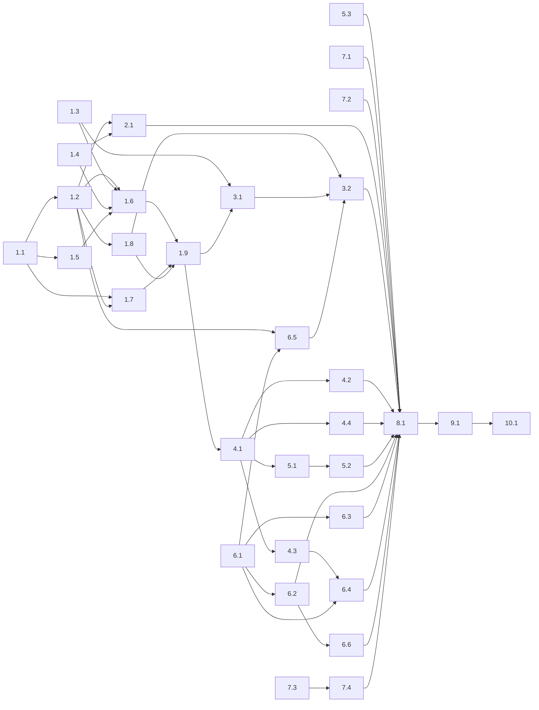

# Kyber Arbiter tasks

**Phase status:** Draft

**Development mode:** test-first

These tasks deliver Phase 1 only (D32): the harness-neutral core, plus the Claude, Copilot in VS Code, Copilot CLI and OpenCode targets, as the design's phase mapping assigns them. Phase 2 (Pi, Codex, Cursor) and Phase 3 (Kilo, Antigravity, Factory, Devin, Warp, ZCode) are not tasked here. The closeout (task 10.1) records them as todos.

## How these tasks are dispatched

- **One task, one cold invocation.** The conductor builds each packet from four parts:
  - the task item;
  - its row in the [Test contract](#test-contract);
  - the design sections named under **Packet attachments**, copied verbatim;
  - the reference facts it names, from [Reference facts](#reference-facts).

  A worker never opens this specification, the design, or a plan (Req 25.2, issue #278).
- **Test-first.** `test-dev` writes the contract test and records a failing run first (RED). The named implementation skill then makes the same filter pass without weakening it (GREEN). Neighbouring tests must stay green.
- **Standards.** C# follows the path declared as **<csharp-coding-standard>**, and tests follow **<test-coding-standard>**. `TreatWarningsAsErrors` is on, so nothing is added to `NoWarn`.
- **Dependencies.** A task depends on another only when it consumes that task's output or edits one of its files (see the [audit](#dependency-graph-and-concurrency-audit)).
- **Reserved paths.** Tasks 1.8, 2.1 and 7.1–7.4 touch `always-human` paths. The final verdict is therefore `NEEDS_HUMAN` by design (D13).

## Pending decision

**Q15: how Claude dispatches report their return (design gap).** Tasks 4.4 and 6.6 wait on this answer. Every other task can run without it.

**Evidence, read 2026-10-04:**
- Claude's `Agent` tool runs a sub-agent in the background when `run_in_background` is omitted. This is the default since v2.1.198. Its `PostToolUse` fires at launch, with `tool_response.status: "async_launched"` and an `agentId`, not at completion [F1].
- A sub-agent that hands back through `SubagentHandback` (v2.1.271 and later) leaves only a short note in the parent's `tool_response.content`. The vendor says to "match a `PreToolUse` or `PostToolUse` hook on `SubagentHandback` and read `tool_input.message`" [F1].

**Impact.** Design §9.2 and §10.2 observe Claude returns through the dispatcher's `PostToolUse(Agent)`, which sees neither of these. On Claude, every rule that reads a return would go blind:
- `DIFF-001`, `PLANNER-DIFF-001` and `READONLY-001`;
- `QUOTE-001` and `PREEX-001` on lens results;
- the ledger's completion and RED evidence. `READY-001` would then escalate every dependent task.

| Option | Effect |
|---|---|
| **(a) Recommended.** Every agent a governed dispatcher can target gets a frontmatter `PreToolUse` hook on `^SubagentHandback$`. It records the return under the payload's `agent_id`, joined to the dispatch through the `agentId` that `PostToolUse(Agent)` reports at a background launch. It then evaluates the post-dispatch rules. On a non-allow outcome it returns `allow` with `updatedInput`: the complete input, with the envelope or note appended to `message`, so the dispatcher receives it inside the hand-back. It never denies a hand-back. Foreground calls keep the `PostToolUse` path. A return observed by neither path is reported by `KW-ARB-AUDIT-003` | Post-dispatch enforcement on Claude works in its default mode. This amends design §9.2 and §10.2 (frontmatter hooks on the dispatch targets) |
| (b) Post-dispatch rules are unenforced on Claude, recorded as `arbiter-not-enforced` (`no-post-dispatch-feedback`) | `READY-001` never sees completion on Claude, so every dependent task escalates |
| (c) The conductor and `code-reviewer` dispatch in the foreground | Parallel workers are lost, and canonical bodies would need Claude-specific text |

## Tasks

- [ ] 1. Arbiter core (`src/KyberWeave.Core/Arbiter/`)
- [ ] 1.1 Rule model, step-0 engine, trigger families, envelope and review notes
  - **Objective:** Build the harness-neutral rule model. It covers:
    - the step-0 predicates and first-match `decide` clauses;
    - the effect sets and combination rule of each trigger family;
    - the exact text of the escalation envelope and of the three review notes.
  - **Files:**
    - `src/KyberWeave.Core/Arbiter/Rules/ArbiterRule.cs` (new): `ArbiterRule`, `RuleDecideClause`, `RuleAsk`, `RuleEffects`
    - `src/KyberWeave.Core/Arbiter/Rules/RulePredicate.cs` (new)
    - `src/KyberWeave.Core/Arbiter/Rules/RuleEngine.cs` (new)
    - `src/KyberWeave.Core/Arbiter/ArbiterTriggerFamily.cs` (new)
    - `src/KyberWeave.Core/Arbiter/ArbiterFactSet.cs` (new)
    - `src/KyberWeave.Core/Arbiter/ArbiterOutcome.cs` (new)
    - `src/KyberWeave.Core/Arbiter/ArbiterEscalationEnvelope.cs` (new)
    - `tests/KyberWeave.Tests/Arbiter/ArbiterRuleEngineTests.cs` (new)
    - `tests/KyberWeave.Tests/Arbiter/ArbiterEscalationEnvelopeTests.cs` (new)
  - **Acceptance:**
    1. **The predicate set is closed:** `all`, `any`, `not`, `exists`, `equals`, `in`, `matches`, `subset-of`, `intersects`, `count`. Each `when` names one fact and one operator, whose operand is either a literal or another fact's name. On path lists, `matches`, `subset-of` and `intersects` use `KyberWeave.Core.Review.PathGlob.IsMatch`. There is no expression language (Req 1.1).
    2. **First match wins.** The first matching `decide` clause answers, and no match answers `undecidable` (Req 1.5).
    3. **Trigger families.** Each trigger belongs to exactly one family, and the family fixes three things:
       - its effect set;
       - the effect `undecidable` maps to;
       - its combination rule.

       All three are as the attached family table gives them. Any escalating rule escalates the trigger; answers are never averaged (Req 1.4, 10.1, 10.3, 15.1, 15.6).
    4. **Step-1 short-circuit.**
       - A rule with both `decide` and `ask` asks only when `decide` answers `undecidable`.
       - The engine reports whether step 0 has already produced the family's strongest effect (`escalate`, `skip` or `verify`), so that its caller can skip step 1 (Req 1.2).
    5. **Fact labels.** Every fact carries a `derived` or `asserted` label. An absent fact satisfies `exists: false`, and fails every other operator.
    6. **Exact text.** The envelope and the notes `ARBITER_SKIP`, `ARBITER_VERIFIED` and `ARBITER_ANNOTATION` render byte for byte as attached:
       - fields in the fixed order;
       - rules in id order, with `QUESTION`, `ANSWER` and `EVIDENCE` repeated once per rule;
       - all four `ANSWER` forms;
       - the `NEXT` table;
       - `REPEAT` (Req 15.5).
    7. **No new package.** Core keeps only Markdig and YamlDotNet.
  - **Skills:** `test-dev`, `csharp-dev`
  - **Depends on:** none
  - **Packet attachments:** design §1.4, §1.10, §3
  - _Requirements: 1.1, 1.2, 1.4, 1.5, 10.1, 10.3, 15.1, 15.5, 15.6_
- [ ] 1.2 Configuration section, shipped rules, validation and embedded Squad catalog
  - **Objective:** Add four things:
    - the `arbiter:` configuration section;
    - the 18 shipped rules, as embedded data;
    - the validator and its permanent diagnostics;
    - the embedded Squad catalog, which the rules read inside a host repository that has no canonical tree.
  - **Files:**
    - `src/KyberWeave.Core/Configuration/ArbiterYamlSection.cs` (new, internal, hyphenated keys)
    - `src/KyberWeave.Core/Configuration/KyberWeaveYamlDocument.cs` (`Arbiter` property)
    - `src/KyberWeave.Core/Configuration/KyberWeaveConfig.cs` (`Arbiter` property; `Clone` learns it)
    - `src/KyberWeave.Core/Configuration/KyberWeaveConfigLoader.cs` (`FromDocument` merges it)
    - `src/KyberWeave.Core/Arbiter/ArbiterConfig.cs` (new)
    - `src/KyberWeave.Core/Arbiter/ArbiterConfigLoader.cs` (new, `Merge`)
    - `src/KyberWeave.Core/Arbiter/ArbiterTriggerCatalog.cs` (new)
    - `src/KyberWeave.Core/Arbiter/Rules/RuleValidator.cs` (new)
    - `src/KyberWeave.Core/Arbiter/Rules/default-rules.yml` (new)
    - `src/KyberWeave.Core/Arbiter/Squad/ArbiterSquadCatalog.cs` (new)
    - `src/KyberWeave.Core/KyberWeave.Core.csproj`: `EmbeddedResource` entries for `default-rules.yml`, `..\..\products\kyber-squad\agents\*.md` and `..\..\products\kyber-squad\skills\code-review\references\lenses\*.md`, with logical names, following the existing `Standards.*` entries
    - `tests/KyberWeave.Tests/Arbiter/ArbiterConfigTests.cs` (new)
    - `tests/KyberWeave.Tests/Arbiter/ArbiterDefaultRulesTests.cs` (new)
    - `tests/KyberWeave.Tests/Arbiter/ArbiterSquadCatalogTests.cs` (new)
  - **Acceptance:**
    1. **Schema and defaults.** The `arbiter:` section follows the attached schema. With no section, the Arbiter is disabled, the provider is `none`, and all 18 shipped rules are enabled. The section merges through `ArbiterConfigLoader.Merge` into `KyberWeaveConfig.Arbiter`, and lists replace rather than append (Req 16.1, 19.1, 22.2).
    2. **Host overrides.**
       - A host may tune a shipped rule by id through `enabled`, `confidence-at-least` / `probability-below`, and `effects`. Effects merge per answer.
       - Any other field on a shipped rule raises `KW-ARB-CONFIG-005`, with a hint to add a host rule.
       - Host rule ids may not start with `KW-ARB-` (Req 14.2, 14.3).
    3. **Diagnostics.**
       - The validator implements `KW-ARB-CONFIG-001` to `-010` exactly as the attached diagnostics table gives them. `-007` is a function that `doctor` calls (task 3.2).
       - Hints come from `KyberWeave.Core.Text.StringDistance.Levenshtein`, using the nearest-match rule of `DocSpecValidator.Nearest`.
       - `ArbiterTriggerCatalog` declares the facts each trigger supplies, as in the attached trigger table. A rule that reads an undeclared fact raises `KW-ARB-CONFIG-002`.
    4. **The shipped rules.**
       - `default-rules.yml` declares the 18 rules of the attached catalogue: ids, triggers, steps, questions, answers, effects and thresholds.
       - The catalogue already includes D30's `no-task-files` answer on `SCOPE-001` and `DIFF-001`, and has no `missing-contract` answer on `MODE-001`.
       - Every step-1 threshold declares `tuned-for: [jev-1.13.0]`.
       - The shipped rules validate with zero errors, and their id set equals the catalogue (Req 14.1, 14.4).
    5. **`OWNER-001` data.** The file-kind map is data in `default-rules.yml`, evaluated first match wins:

       | Patterns | Owner |
       |---|---|
       | `**/*.tsx`, `**/*.jsx` | `react-dev` |
       | `**/src-tauri/**`, `**/*.rs` | `tauri-dev` |
       | `**/*.py`, `**/pyproject.toml`, `**/requirements*.txt` | `python-dev` |
       | `.github/workflows/**`, `**/Dockerfile` | `github-devops` |
       | `**/*.sql`, `**/*.sqlproj` | `sql-database-architect` |
       | `**/Migrations/**`, `**/*Repository.cs` | `dal-dev` |
       | `**/*.xaml` | `maui-dev` |
       | `**/Pulumi.yaml`, `**/Pulumi.*.yaml` | `pulumi-dev` |
       | `tests/**`, `**/*.test.*`, `**/*.spec.*`, `**/*Tests.cs` | `test-dev` |
       | `**/*.md` | `docs-dev` |
       | `**/*.cs` | `csharp-dev` |

       Its answers are decided in this order:
       - **`owner`** when the task's Skills label names the target;
       - **`not-owner`** when the label names other Squad agents but not the target;
       - **`owner`** when the target is `test-dev` and the mode is `test-first`, which is the RED step;
       - otherwise from the map: **`owner`** when every task file maps to the target, **`not-owner`** when every task file maps to one other agent, and **`no-mapping`** when the files are mixed, unmapped or absent.
    6. **`LENS-001` data.** The per-lens step-0 path table holds only path conditions that the lens's own Applicability section states. Every other lens defers to step 1, which uses `instructions-from: lens:<name>`.
    7. **The embedded catalog.** `ArbiterSquadCatalog` reads the embedded copies:
       - each agent's `delegates-to`, description and capability profile, and its target class from the attached table;
       - each lens's Applicability section.

       A test loads `products/kyber-squad` through `SquadSourceLoader.Load` and asserts that the catalog equals it.
  - **Skills:** `test-dev`, `csharp-dev`
  - **Depends on:** 1.1
  - **Packet attachments:** design §1.3, §1.4, §1.5 (the thresholds paragraph), §2, §3, §4.1, §7
  - _Requirements: 11.1, 11.2, 13.2, 14.1, 14.2, 14.3, 14.4, 16.1, 19.1, 22.2_
- [ ] 1.3 Plan parser
  - **Objective:** Parse a plan or a spec task artifact as authored, with no generated artifacts. The parse yields its mode, tasks, files, dependencies, contract rows and out-of-scope paths.
  - **Files:**
    - `src/KyberWeave.Core/Arbiter/Plans/PlanDocument.cs` (new): `PlanDocument`, `PlanTask`
    - `src/KyberWeave.Core/Arbiter/Plans/PlanDocumentParser.cs` (new)
    - `tests/KyberWeave.Tests/Arbiter/ArbiterPlanParserTests.cs` (new)
    - `tests/KyberWeave.Tests/Fixtures/arbiter-plans/` (new): synthetic fixtures only
  - **Acceptance:**
    1. **A pure function.** `PlanDocumentParser` is a pure function of the file text. It uses Markdig (CommonMark, pipe tables, YAML front matter) and regex, and writes nothing (Req 9.1, 9.2).
    2. **The attached contract, in full.** That covers both task grammars (the plan headings, and D30's spec checkbox items), the three label families with their older variants, the path rule, dependency tokens, the Test or verification contract table, `## Out of scope`, the output records, `KW-ARB-PARSE-001` and `KW-ARB-PARSE-002` (Req 9.3).
    3. **Conformance set.** These files are read in place from the repository and are never copied:
       - the eight archived plans: `2026-09-29-release-checksums-unsigned-windows`, `2026-09-29-glib-variant-str-iter-backport`, `2026-09-29-mcp-docs-corpus-provenance`, `2026-09-29-pr-158-defects`, `2026-09-28-kyber-utilities-status-line-slice`, `2026-09-28-kyberdash-sea-release-integrity`, `2026-09-28-skill-resource-dispositions` and `2026-09-28-provider-aware-create-pull-request`, all under `docs/archive/plans/`;
       - the spec task artifact `docs/archive/specs/kyberdash-context-surfaces/tasks.md`.
    4. **Expected results.**
       - The plans with no Tasks section, `2026-09-29-pr-158-defects` and `2026-09-29-glib-variant-str-iter-backport`, report `HasTasks == false`.
       - Every other file under `docs/archive/plans/` parses without throwing.
       - Synthetic fixtures cover each label variant, both title separators (`:` and ` — `), and a spec task that lists no files, which gets an empty `Files` and `KW-ARB-PARSE-002`.
    5. **The path rule is reusable.** It is exposed as an internal helper, because task 1.6 applies it to delegation prompts.
  - **Skills:** `test-dev`, `csharp-dev`
  - **Depends on:** none
  - **Packet attachments:** design §6
  - _Requirements: 9.1, 9.2, 9.3, 10.2_
- [ ] 1.4 Git, gate-report and caller readers
  - **Objective:** Read the facts the Arbiter derives itself, from git, the gate report and the caller's identity, without throwing when any source is absent.
  - **Files:**
    - `src/KyberWeave.Core/Arbiter/Facts/GitFacts.cs` (new)
    - `src/KyberWeave.Core/Arbiter/Facts/GateReportFacts.cs` (new)
    - `src/KyberWeave.Core/Arbiter/Facts/CallerResolver.cs` (new)
    - `src/KyberWeave.Core/Review/ReviewJson.cs`: `GateReport` gains an optional trailing `string? Base = null`. The schema id stays `kyber-weave.review-gates/v1`.
    - `tests/KyberWeave.Tests/Arbiter/ArbiterReadersTests.cs` (new)
  - **Acceptance:**
    1. **`GitFacts`** runs every git call through `KyberWeave.Core.Processes.ProcessRunner.Run`, with argv only:
       - root: `git rev-parse --show-toplevel`, from a given working directory;
       - head: `git rev-parse HEAD`;
       - dirty set: `git status --porcelain=v1 -z --untracked-files=all`;
       - blob ids: `git hash-object --stdin-paths`, with the paths on stdin;
       - changes since a base: `git diff --name-only -z <base>...HEAD` together with the dirty set; a rename reports its new path;
       - hunk ranges: the new-side ranges from `git diff --unified=0 <base>`.
    2. **Snapshot and diff.** A snapshot holds `HEAD` and the blob id of every dirty or untracked path. The since-snapshot change set contains:
       - every path whose status or blob id differs;
       - plus `git diff --name-only -z <snapshot HEAD> HEAD` when `HEAD` has moved;
       - minus `artifacts/**`.
    3. **Absent sources.** Outside a repository, or without git, every git fact is absent and nothing throws. A missing or unreadable `artifacts/gates.json` is likewise an absent fact.
    4. **Gate report.** `GateReportFacts` reads `artifacts/gates.json` through `ReviewJson.ReadGates`, including the new `Base`. Older reports without it still read (Req 12.4).
    5. **Caller resolution.** `CallerResolver` returns the caller and its source. Sources rank: the harness payload (`harness`), then the rendered `--caller` (`rendered`), then header inference (`header`, by the attached rules), then `none`. `serve` passes `asserted` (Req 21.2).
  - **Skills:** `test-dev`, `csharp-dev`
  - **Depends on:** none
  - **Packet attachments:** design §1.3 (the fact definitions), §4.2
  - _Requirements: 6.4, 12.4, 21.2_
- [ ] 1.5 Ledger and decision log
  - **Objective:** Persist pre-dispatch, post-dispatch and return events, and every decision, as append-only JSON lines. Expose the queries the rules read.
  - **Files:**
    - `src/KyberWeave.Core/Arbiter/Facts/ArbiterLedgerEvent.cs` (new)
    - `src/KyberWeave.Core/Arbiter/Facts/ArbiterDecisionRecord.cs` (new)
    - `src/KyberWeave.Core/Arbiter/Facts/InFlightLedger.cs` (new)
    - `src/KyberWeave.Core/Arbiter/Facts/DecisionLog.cs` (new)
    - `tests/KyberWeave.Tests/Arbiter/ArbiterLedgerTests.cs` (new)
  - **Acceptance:**
    1. **Schemas.** The ledger is `kyber-arbiter.ledger/v1` (`artifacts/arbiter/ledger.jsonl`), and the log is `kyber-arbiter.decision/v1` (`artifacts/arbiter/decisions.jsonl`). Both live under the repository root, and their fields are exactly as attached.
    2. **Appends.** Each append writes one complete line under an exclusive lock on `artifacts/arbiter/.lock`, opened with `FileShare.None` and retried with backoff for up to 500 ms. A lock that is not acquired throws, and the hook turns that into a fail-closed block (`KW-ARB-HOOK-001`).
    3. **Reads.** Readers take no lock, and ignore a final line that has no newline.
    4. **Pairing.** A post event pairs with its pre event by `call-id`. Without one, it pairs by `pair-digest`, oldest unpaired pre event first.
    5. **Queries.**
       - **In-flight paths:** the task files of other unpaired `delegate` pre events.
       - **Concurrent paths:** the task files of dispatches in flight at any moment between a pre event and its return.
       - **Completed tasks:** a returned `task-reviewer` output matching `^RESULT:\s+(PASS|FAIL)\b` with `PASS`, or an attestation `ATTESTED: <task>=complete` (D31).
       - **RED evidence:** a returned `test-dev` output carrying `RED_EVIDENCE:` with any value but `none`, or an attestation `=red`.
       - **`REPEAT`:** one plus the number of earlier escalations with the same plan file, plan digest and task that share a rule id.
    6. **Concurrency.** Two concurrent appending processes never interleave a line.
    7. **No secrets.** Fact values are logged only as paths, ids and the one-line evidence. Prompts and code appear only as digests, and a sentinel secret never appears in either file (Req 18.4).
  - **Skills:** `test-dev`, `csharp-dev`
  - **Depends on:** 1.1
  - **Packet attachments:** design §1.6, §1.10 (`REPEAT`), §8.3
  - _Requirements: 3.1, 5.3, 17.4, 18.4, 21.3_
- [ ] 1.6 Header block, trigger classification and fact builder
  - **Objective:** Turn a harness-neutral event into a classified trigger with its labelled facts. The step that decides an event needs no Arbiter work must load no host configuration.
  - **Files:**
    - `src/KyberWeave.Core/Arbiter/Facts/ArbiterEvent.cs` (new)
    - `src/KyberWeave.Core/Arbiter/Facts/HeaderBlock.cs` (new)
    - `src/KyberWeave.Core/Arbiter/Facts/TriggerClassifier.cs` (new)
    - `src/KyberWeave.Core/Arbiter/Facts/TriggerFactBuilder.cs` (new)
    - `tests/KyberWeave.Tests/Arbiter/ArbiterClassificationTests.cs` (new)
    - `tests/KyberWeave.Tests/Arbiter/ArbiterFactBuilderTests.cs` (new)
  - **Acceptance:**
    1. **`ArbiterEvent`** carries the harness token, phase (`pre`, `post` or `return`), caller and caller source, target, prompt, tool-call id, session, `cwd`, and tool output.
    2. **`HeaderBlock`** implements the attached grammar.
       - The set is closed. There is no `FILES:` header (D33).
       - A strip function returns the prompt without the header block and the one blank line after it (Req 25.1).
    3. **`TriggerClassifier`** implements the attached target classes, caller resolution, classification table and planner markers, all from the embedded catalog (task 1.2).
       - On a project-wide-hook harness, an unmarked dispatch with an unidentified caller passes and is recorded as `unmarked` (Req 6.4).
       - An event that is not a dispatch, and an unmarked unidentified dispatch, are classified without loading `.kyber-weave/kyber-weave.yml`.
    4. **`TriggerFactBuilder`** produces every fact `ArbiterTriggerCatalog` declares for the trigger, with its label.
       - `delegation.prompt` is the prompt without its header block.
       - `delegation.paths` applies task 1.3's path rule to that prompt.
       - `config.planning-dirs` holds the directories of the `plan-index`, `specification-index` and `todo-index` entries that `KyberWeaveConfig.ConfigReg.Resolve(config.Ontology)` returns (`ConfigRegConfig.PlanIndexProperty`, `SpecificationIndexProperty`, `TodoIndexProperty`).
    5. **No inference from the index.** Plan and task identity come from `PLAN_FILE` and `TASK` only. Nothing infers them from the plan index (Req 21.1, 21.2).
  - **Skills:** `test-dev`, `csharp-dev`
  - **Depends on:** 1.2, 1.3, 1.4, 1.5
  - **Packet attachments:** design §1.3, §4, §5
  - _Requirements: 6.4, 21.1, 21.2, 25.1, 25.4_
- [ ] 1.7 `systemone` provider and state budgets
  - **Objective:** Send one batched step-1 call per trigger to TypeSafe or a local Ollama, or skip it under provider `none`. Never send more than the model's budget.
  - **Files:**
    - `src/KyberWeave.Core/Arbiter/Providers/IArbiterProvider.cs` (new)
    - `src/KyberWeave.Core/Arbiter/Providers/NoneProvider.cs` (new)
    - `src/KyberWeave.Core/Arbiter/Providers/SystemOneClient.cs` (new)
    - `src/KyberWeave.Core/Arbiter/Providers/SystemOneContracts.cs` (new)
    - `src/KyberWeave.Core/Arbiter/Providers/StateBudget.cs` (new)
    - `tests/KyberWeave.Tests/Arbiter/ArbiterSystemOneClientTests.cs` (new): uses a stub `HttpMessageHandler`
  - **Acceptance:**
    1. **The request.** `POST <endpoint>/systemone` uses the wire format in [F5]. Each question is keyed by its rule id, and `instructions` is always a non-empty string.
       - Every question can be traced to its rule's declared `state` fields.
       - No fact outside the declared states is sent (R9).
       - How the batched state object is laid out is the implementer's choice.
    2. **Transport.** The client is built on the BCL `HttpClient` over an injected `HttpMessageHandler`; `OpenAiCompatibleEmbeddingGenerator` is the precedent. `Authorization: Bearer <key>` is sent only when the resolver returns a key for the endpoint's origin (Req 17.1–17.3).
    3. **Errors.**
       - 429 and 529 are retried with exponential backoff, honouring `Retry-After` when present, inside `timeout-ms`.
       - Any other error status (400, 401, 404, 413, 422 or 5xx), a timeout, or an unreadable body answers `undecidable` (Req 19.4).
    4. **Budgets.**
       - The estimate is ⌈UTF-8 bytes ÷ 3⌉ tokens. Limits per model:
         - `jev-*`: 32,000 for the state plus the longest question, and 64,000 for the whole request;
         - `nimble`: 8,000 per question;
         - `tev1`: 2,000;
         - every model: a body of at most 65,536 bytes and at most 64 questions.
       - An unknown model gets the smallest budget.
       - Over budget, every step-1 rule on the trigger answers `undecidable` and no request is sent.
    5. **Responses.**
       - Answers are parsed by `type`. `confidence` is optional, because `noul` never carries it. `usage` is optional. `probabilities` is an unordered dictionary.
       - The model that answered and the usage are recorded (Req 17.4).
       - `choice` and `score` answers below `confidence-at-least`, and `noul` answers by `probability-below`, are applied as the attached rule model says.
    6. **Provider `none`** marks step-1 rules *not evaluated*, which is not `undecidable` (Req 19.2).
    7. **No leaks or vendoring.** A sentinel key appears in no output, exception message or `ToString`. TypeSafe's skill is not vendored (Req 20.2).
  - **Skills:** `test-dev`, `csharp-dev`
  - **Depends on:** 1.1, 1.2
  - **Packet attachments:** design §1.4 (the `ask` fields), §1.5 (the client and the state budget); [F5]
  - _Requirements: 1.2, 17.1, 17.2, 17.3, 17.4, 19.2, 19.4, 20.2_
- [ ] 1.8 Key resolution, credential stores and user override
  - **Objective:** Resolve the TypeSafe key the same way in every process, bound to the endpoint's origin. Store it per OS without putting it in argv, and read the per-user provider override.
  - **Files:**
    - `src/KyberWeave.Core/Arbiter/Credentials/ICredentialStore.cs` (new)
    - `src/KyberWeave.Core/Arbiter/Credentials/MacKeychainCredentialStore.cs` (new)
    - `src/KyberWeave.Core/Arbiter/Credentials/SecretServiceCredentialStore.cs` (new)
    - `src/KyberWeave.Core/Arbiter/Credentials/WindowsCredentialStore.cs` (new)
    - `src/KyberWeave.Core/Arbiter/Credentials/ArbiterKeyResolver.cs` (new)
    - `src/KyberWeave.Core/Arbiter/ArbiterUserSettings.cs` (new): reads `~/.config/kyber-weave/arbiter.yml` under an injected home
    - `src/KyberWeave.Core/KyberWeave.Core.csproj`: only if `LibraryImport` requires `AllowUnsafeBlocks`, and then with a comment that says why
    - `tests/KyberWeave.Tests/Arbiter/ArbiterKeyResolutionTests.cs` (new)
  - **Acceptance:**
    1. **Resolution order.**
       1. `TYPESAFE_API_KEY`, used only for the TypeSafe origin or an origin named in the user override;
       2. the store entry for the endpoint's origin;
       3. no key.

       A loopback endpoint needs no key (Req 18.1, 18.2, R21).
    2. **macOS and Linux stores** run through an injected process seam, with the attached argv. The key travels on stdin only, so tests assert both the argv and the stdin (Req 18.5).
    3. **Windows store.** `WindowsCredentialStore` calls `advapi32` `CredWriteW`, `CredReadW` and `CredFree` by P/Invoke, with no package. It compiles on every OS and is gated by `OperatingSystem.IsWindows()`.
    4. **User override.** The override may hold `provider:` only, and replaces the repository's `arbiter.provider` field by field.
       - Any other key raises `KW-ARB-CONFIG-009`.
       - A malformed file raises `KW-ARB-CONFIG-001`, naming the file (Req 22.3).
    5. **No leaks.** A sentinel key appears in no `ToString`, exception message or diagnostic (Req 18.4). Nothing is added to `NoWarn`.
  - **Skills:** `test-dev`, `csharp-dev`
  - **Depends on:** 1.2
  - **Packet attachments:** design §1.5 (key resolution and the store table), §7 (user override)
  - _Requirements: 18.1, 18.2, 18.3, 18.4, 18.5, 22.3_
- [ ] 1.9 Evaluator
  - **Objective:** Provide the single entry point that the hook host and `eval` call, running the evaluation flow end to end.
  - **Files:**
    - `src/KyberWeave.Core/Arbiter/ArbiterEvaluator.cs` (new)
    - `src/KyberWeave.Core/Arbiter/ArbiterEvaluationResult.cs` (new)
    - `tests/KyberWeave.Tests/Arbiter/ArbiterEvaluatorTests.cs` (new): uses a fake provider
  - **Acceptance:**
    1. **Construction.** Every collaborator is a constructor argument: the provider, key resolver, ledger, decision log, git facts, plan reader and clock (Core constructs none of its collaborators).
    2. **Flow.** The evaluator implements the attached flow:
       - the ledger event is appended before evaluation;
       - step 0 runs, then at most one provider call per trigger, whatever the rule count, and none once step 0 has produced the family's strongest effect;
       - answers combine, and one decision record is appended (Req 1.2, 1.4).
    3. **Failure outcomes.**
       - A provider error gives `undecidable`, which escalates on conductor and investigate triggers and allows on review triggers (Req 10.1, 10.3, 19.4).
       - An exception produces an error result carrying `KW-ARB-HOOK-001`, never `allow` (Req 5.1).
    4. **Dry run.** A dry-run mode, which `eval` uses, reads the ledger and writes nothing.
  - **Skills:** `test-dev`, `csharp-dev`
  - **Depends on:** 1.6, 1.7, 1.8
  - **Packet attachments:** design §1.2, §3, §8.4
  - _Requirements: 1.2, 1.3, 1.4, 5.1, 10.1, 10.3, 19.2, 19.4_
- [ ] 2. Gate applicability
- [ ] 2.1 Gate `applies-when`, `KW-REVIEW-026` and `review gates --base`
  - **Objective:** Let a gate declare the paths it applies to, and report a gate that does not apply as not applicable. Such a gate is neither passed nor failed.
  - **Files:**
    - `src/KyberWeave.Core/Configuration/ReviewYamlSection.cs` (`ReviewGateYaml.AppliesWhen`)
    - `src/KyberWeave.Core/Configuration/ReviewConfig.cs` (`ReviewGate` gains an optional trailing `AppliesWhen`)
    - `src/KyberWeave.Core/Configuration/ReviewConfigLoader.cs` (`ParseGates`)
    - `src/KyberWeave.Core/Review/GateRunner.cs` (`Run` gains an optional `changedPaths`, and evaluates `KW-ARB-GATE-001` through `RuleEngine`)
    - `src/KyberWeave.Core/Review/ReviewModel.cs` (`GateResult` gains an optional trailing not-applicable reason)
    - `src/KyberWeave.Core/Review/ReviewJson.cs` (`GateRunner.Run` sets `GateReport.Base`)
    - `src/KyberWeave.Core/Review/VerdictEngine.cs` (`EvaluateGates`, `GradeRisk`)
    - `src/KyberWeave.Cli/Commands/Review/ReviewGatesCommand.cs` (`ReviewGateOutcome.NotApplicable = "KW-REVIEW-026"`)
    - `src/KyberWeave.Cli/Commands/Review/ReviewSettings.cs` (`ReviewGatesSettings.Base`, option `--base <REF>`)
    - `.kyber-weave/kyber-weave.yml`: `applies-when: { paths: ["dash/**"] }` on `ts-typecheck`, `ts-test`, `ts-lint` and `ts-reachable` only
    - `tests/KyberWeave.Tests/ReviewGateApplicabilityTests.cs` (new)
  - **Acceptance:**
    1. **Schema.** The schema follows the attached section, with `run` kept as argv.
    2. **Not applicable.** With `--base`, the changed paths come from task 1.4's `GitFacts`. A gate whose patterns match no changed path is not executed; it is reported with `KW-REVIEW-026` (Info) and its reason, not omitted (Req 12.1, 12.2).
    3. **Without `--base`,** every gate runs, and the report says that `applies-when` was not evaluated.
    4. **Verdict.** `VerdictEngine` never counts a not-applicable gate as passed or failed. A verdict with not-applicable gates equals the verdict without them (Req 12.3).
    5. **Compatibility and scope.** Older `review-gates/v1` reports still read (Req 12.4). The .NET gates stay unconditional, and the YAML edit is the only change to host policy.
  - **Skills:** `test-dev`, `csharp-dev`
  - **Depends on:** 1.2, 1.4
  - **Packet attachments:** design §11
  - _Requirements: 12.1, 12.2, 12.3, 12.4_
- [ ] 3. CLI (`kyber-weave arbiter`)
- [ ] 3.1 `arbiter validate | rules | plan | eval | audit`
  - **Objective:** Add the read-only human surfaces of the Arbiter to the existing CLI.
  - **Files:**
    - `src/KyberWeave.Cli/Commands/Arbiter/ArbiterSettings.cs` (new, deriving from `AnalysisSettings`)
    - `src/KyberWeave.Cli/Commands/Arbiter/ArbiterValidateCommand.cs` (new)
    - `src/KyberWeave.Cli/Commands/Arbiter/ArbiterRulesCommand.cs` (new)
    - `src/KyberWeave.Cli/Commands/Arbiter/ArbiterPlanCommand.cs` (new)
    - `src/KyberWeave.Cli/Commands/Arbiter/ArbiterEvalCommand.cs` (new)
    - `src/KyberWeave.Cli/Commands/Arbiter/ArbiterAuditCommand.cs` (new)
    - `src/KyberWeave.Cli/Commands/Arbiter/ArbiterCommandComposition.cs` (new): the composition root that supplies the HTTP handler, credential store, home path, process runner and clock
    - `src/KyberWeave.Cli/Program.cs`: a new `config.AddBranch("arbiter", …)`
    - `tests/KyberWeave.Tests/ArbiterCliCommandTests.cs` (new)
  - **Acceptance:**
    1. **`validate [path]`** exits 0 on this repository and on a host with no `arbiter:` section. It exits 1 with hinted `KW-ARB-CONFIG-*` diagnostics on an invalid section.
    2. **`rules [--trigger <t>]`** lists each rule's id, trigger, step, question, answers, effects and facts.
    3. **`plan <file>`** prints what the parser understood, with `KW-ARB-PLAN-001` for a plan without tasks and `KW-ARB-PARSE-00x` diagnostics.
    4. **`eval --trigger <t> --event <file> [--provider none]`** evaluates an `ArbiterEvent` JSON file through the evaluator's dry run. It prints the outcome or envelope and writes nothing.
    5. **`audit [--plan <file>] [--session <id>] [--since <ISO-8601>]`** reports `KW-ARB-AUDIT-001` to `-004` as attached, and lists attestations as information (Req 5.3, 21.3, 25).
    6. **Output and exit codes** follow `src/KyberWeave.Cli/AGENTS.md` and `CommandHelpers.Finish` (Req 2.2).
  - **Skills:** `test-dev`, `csharp-dev`
  - **Depends on:** 1.3, 1.9
  - **Packet attachments:** design §1.6 (audit), §1.8, §7 (diagnostics)
  - _Requirements: 2.2, 5.3, 16.1, 21.3_
- [ ] 3.2 `arbiter setup | status | doctor`
  - **Objective:** Manage each user's provider choice and key, and diagnose a host's Arbiter installation.
  - **Files:**
    - `src/KyberWeave.Cli/Commands/Arbiter/ArbiterSetupCommand.cs` (new)
    - `src/KyberWeave.Cli/Commands/Arbiter/ArbiterStatusCommand.cs` (new)
    - `src/KyberWeave.Cli/Commands/Arbiter/ArbiterDoctorCommand.cs` (new)
    - `src/KyberWeave.Cli/Commands/Arbiter/ArbiterSettings.cs`
    - `src/KyberWeave.Cli/Commands/Arbiter/ArbiterCommandComposition.cs`
    - `src/KyberWeave.Cli/Program.cs`
    - `tests/KyberWeave.Tests/ArbiterSetupCommandTests.cs` (new): an injected home, a fake store and a stub Ollama handler
  - **Acceptance:**
    1. **`setup`.**
       - It writes the chosen provider (`none`, TypeSafe cloud or local Ollama) to `<home>/.config/kyber-weave/arbiter.yml`.
       - It stores a TypeSafe key for the endpoint origin, read from `--key-stdin` or a masked prompt, and never echoes it.
       - It detects Ollama 0.35 or later through `GET <scheme://host:port>/api/version`, which returns `{"version":"x.y.z"}`. When found, it suggests `nimble` and warns that `tev1`'s usable input of about 2,000 tokens is too small for most shipped rules (Req 22.3, 23.1, 23.2).
    2. **`status`** shows the provider, model, endpoint origin, and whether a key was found, never the value.
    3. **`doctor`** raises these:
       - `KW-ARB-CONFIG-006`, `-007`, `-009` and `-010`;
       - `KW-ARB-KEY-001`;
       - `KW-ARB-LOG-001`, through `git check-ignore -q artifacts/arbiter`;
       - `KW-ARB-BIN-001`, through `ArbiterProcessProbe` from task 6.5;
       - `KW-ARB-GUARD-001`, when none of the three index properties resolves (Req 19.3).
  - **Skills:** `test-dev`, `csharp-dev`
  - **Depends on:** 1.8, 3.1, 6.5
  - **Packet attachments:** design §1.5, §1.8, §7
  - _Requirements: 19.3, 22.3, 23.1, 23.2, 23.3_
- [ ] 4. Hook host (`src/KyberWeave.Arbiter/`)
- [ ] 4.1 `kyber-weave-arbiter` project, hook host, Read guard and Claude adapter
  - **Objective:** Ship the separate binary that harness hooks call. It fails closed, writes nothing to stdout but the decision, guards planning paths, strips routing headers, and starts with the Claude adapter.
  - **Files:**
    - `src/KyberWeave.Arbiter/KyberWeave.Arbiter.csproj` (new): mirrors `src/KyberWeave.Mcp/KyberWeave.Mcp.csproj`'s property group, with `kyber-weave-arbiter` names. It references Core only; the MCP packages arrive with `serve` in delivery Phase 3. It adds `InternalsVisibleTo KyberWeave.Tests`.
    - `src/KyberWeave.Arbiter/Program.cs` (new): `hook` and `--version`
    - `src/KyberWeave.Arbiter/Composition.cs` (new)
    - `src/KyberWeave.Arbiter/AGENTS.md` (new): the stdout rule
    - `src/KyberWeave.Arbiter/CLAUDE.md` (new): a pointer to `AGENTS.md`
    - `src/KyberWeave.Arbiter/Hooks/HookCommand.cs` (new)
    - `src/KyberWeave.Arbiter/Hooks/IHarnessHookAdapter.cs` (new)
    - `src/KyberWeave.Arbiter/Hooks/HarnessAdapterRegistry.cs` (new): composes the two lists below
    - `src/KyberWeave.Arbiter/Hooks/CommandHookAdapters.cs` (new; holds the Claude entry)
    - `src/KyberWeave.Arbiter/Hooks/PluginHookAdapters.cs` (new; empty)
    - `src/KyberWeave.Arbiter/Hooks/ReadGuard.cs` (new)
    - `src/KyberWeave.Arbiter/Hooks/Adapters/ClaudeHookAdapter.cs` (new)
    - `KyberWeave.sln`
    - `tests/KyberWeave.Tests/KyberWeave.Tests.csproj` (`ProjectReference` to the new project)
    - `tests/KyberWeave.Tests/Arbiter/ArbiterHookHostTests.cs` (new)
    - `tests/KyberWeave.Tests/Arbiter/ClaudeHookAdapterTests.cs` (new)
    - `tests/KyberWeave.Tests/Arbiter/ArbiterReadGuardTests.cs` (new)
    - `tests/KyberWeave.Tests/Fixtures/arbiter-hooks/claude/` (new): payload fixtures built from [F1], each test citing its source URL
  - **Acceptance:**
    1. **The command line** is `kyber-weave-arbiter hook --harness <token> [--caller <agent>]`. The host reads the event on stdin, and writes the harness's decision document on stdout and nothing else. Logging goes to stderr, as in `src/KyberWeave.Mcp/Program.cs`. The exit code is 0 (Req 2.1, 3.1).
    2. **Fail closed.** One top-level catch turns any exception into that harness's block, carrying `KW-ARB-HOOK-001`. On conductor triggers the reason is an envelope with `ANSWER: error`. Malformed stdin, missing or malformed configuration on a classified event, and a provider crash all block, never pass (Req 5.1, 5.2).
    3. **Fast path and pass-through.**
       - An event that is not a dispatch or a guarded read, and an `Agent` input without `subagent_type`, pass through untouched: empty stdout, exit 0 [F1].
       - These return before `.kyber-weave/kyber-weave.yml` is loaded, and a test asserts it (R14).
    4. **Claude `PreToolUse` on `Agent` (or `Task`).**
       - Deny writes the `hookSpecificOutput` deny shape, with the envelope as `permissionDecisionReason`.
       - Allow writes nothing, unless the target is an implementation specialist. For those it returns `permissionDecision: "allow"` with `updatedInput`, which is the **complete** `tool_input` with `prompt` stripped of its header block (Req 25.1) [F1].
    5. **Claude `PostToolUse` on `Agent`.**
       - `status: "completed"` is a return event. A non-allow outcome writes top-level `decision: "block"` with the envelope as `reason`, or `hookSpecificOutput.additionalContext` for a review annotation.
       - `status: "async_launched"` records the link between `tool_use_id` and `agentId` and writes nothing [F1].
    6. **Caller.** The payload's `agent_type` outranks `--caller` (task 1.4).
    7. **The Read guard** applies only when `--caller` names an implementation specialist.
       - It denies a call whose `Read.file_path`, `Grep.path`, `Glob.path` or `Glob.pattern` resolves inside a protected directory, or whose `Bash.command` contains one as a substring (best effort, R24).
       - The protected directories are the folders of the three index properties.
       - The reason names Req 25 (Req 25.2, 25.4).
    8. **`--version`** prints `kyber-weave-arbiter <semver>` and nothing else.
  - **Skills:** `test-dev`, `csharp-dev`
  - **Depends on:** 1.9
  - **Packet attachments:** design §1.2, §1.7, §1.10, §4.2, §5, §8.4, §12; [F1]
  - _Requirements: 2.1, 3.1, 3.2, 5.1, 5.2, 5.3, 16.1, 25.1, 25.2, 25.4_
- [ ] 4.2 Copilot adapter: VS Code Local schema and Copilot CLI schema
  - **Objective:** Gate Copilot dispatches under both tokens. Answer in the schema of the payload received, because VS Code also loads the Copilot CLI hook file.
  - **Files:**
    - `src/KyberWeave.Arbiter/Hooks/Adapters/CopilotHookAdapter.cs` (new)
    - `src/KyberWeave.Arbiter/Hooks/CommandHookAdapters.cs` (register `copilot-vscode` and `copilot-cli`)
    - `tests/KyberWeave.Tests/Arbiter/CopilotHookAdapterTests.cs` (new)
    - `tests/KyberWeave.Tests/Fixtures/arbiter-hooks/copilot-vscode/` (new)
    - `tests/KyberWeave.Tests/Fixtures/arbiter-hooks/copilot-cli/` (new)
  - **Acceptance:**
    1. **Local schema** (`hook_event_name`, `tool_name`, `tool_input`, `tool_use_id`) [F2]:
       - The dispatch tool is `tool_name == "runSubagent"`. The target is `tool_input.agentName`, and an absent `agentName` means the calling agent.
       - Answers use `hookSpecificOutput` (`permissionDecision`, `permissionDecisionReason`, `updatedInput` as the complete input, `additionalContext`). On `PostToolUse` they use top-level `decision: "block"` with `reason`.
       - The Read guard keys on input content, not on the tool's name, because VS Code ignores matchers.
    2. **Copilot CLI schema** (`toolName`, `toolArgs`) [F3]:
       - The dispatch tool is `toolName == "task"`. `toolArgs` is accepted as a JSON string or as an object.
       - The target is `agent_type`. On a marked dispatch with no target, the target fact is absent and the rules answer `undecidable`.
       - Answers use `permissionDecision` with `permissionDecisionReason`, or `allow` with `modifiedArgs` as the complete arguments. Post-dispatch answers use `additionalContext`.
       - Pairing uses `pair-digest`, because the payload carries no call id.
    3. **Schema detection.** The adapter answers in the schema it received.
       - A Local-schema payload arriving under `--harness copilot-cli` is logged as harness `copilot-vscode`.
       - It reuses a trusted-caller decision already logged for the same `tool_use_id` (Req 6.1, 6.4).
    4. **Errors.** An internal error writes that schema's block.
  - **Skills:** `test-dev`, `csharp-dev`
  - **Depends on:** 4.1
  - **Packet attachments:** design §1.7, §4.2, §9.1 (the Copilot rows), §12; [F2], [F3]
  - _Requirements: 3.1, 5.1, 6.1, 6.4, 25.1, 25.2_
- [ ] 4.3 OpenCode plugin-envelope adapter
  - **Objective:** Accept the Kyber-defined envelope that the OpenCode shim sends, and answer allow or block, optionally with stripped arguments.
  - **Files:**
    - `src/KyberWeave.Arbiter/Hooks/PluginEnvelope.cs` (new): `kyber-arbiter.plugin-event/v1`
    - `src/KyberWeave.Arbiter/Hooks/Adapters/OpenCodeHookAdapter.cs` (new)
    - `src/KyberWeave.Arbiter/Hooks/PluginHookAdapters.cs` (register `opencode`)
    - `tests/KyberWeave.Tests/Arbiter/PluginHookAdapterTests.cs` (new)
  - **Acceptance:**
    1. **The envelope.**
       - In: `{schema, harness, phase, tool, call-id, session, cwd, args, result}`, where `phase` is `before` or `after`.
       - Out: `{decision: "allow"|"block", reason, args}`.
       - `args` is present only when the header block was stripped, as the complete arguments.
    2. **The dispatch** is `tool == "task"`, and the target is `args.subagent_type` [F4].
    3. **After the call,** a non-allow outcome returns `block` with the envelope or note as `reason`. The shim appends it to the tool's output.
    4. **A malformed envelope** gives `block` with `KW-ARB-HOOK-001`. The harness token is recorded.
  - **Skills:** `test-dev`, `csharp-dev`
  - **Depends on:** 4.1
  - **Packet attachments:** design §1.7 (the plugin input); [F4]
  - _Requirements: 3.1, 5.1, 6.1, 25.1_
- [ ] 4.4 Claude return observation through the hand-back hook (blocked until Q15 is answered; written to option (a))
  - **Objective:** Observe the return of a background Claude dispatch, and deliver post-dispatch outcomes inside the hand-back.
  - **Files:**
    - `src/KyberWeave.Arbiter/Hooks/Adapters/ClaudeHookAdapter.cs`
    - `tests/KyberWeave.Tests/Arbiter/ClaudeHandbackTests.cs` (new)
    - `tests/KyberWeave.Tests/Fixtures/arbiter-hooks/claude/` (hand-back fixtures)
  - **Acceptance:**
    1. **Recording the return.** `PreToolUse` on `SubagentHandback`, with `--caller <agent>`, records a return event. It is keyed by the payload's `agent_id`, joined to its dispatch through task 4.1's `agentId` link, and carries `tool_input.message` as the output [F1].
    2. **Delivering an outcome.** The post-dispatch rules run on the join. A non-allow outcome returns `permissionDecision: "allow"` with `updatedInput` set to the complete input, with the envelope or note appended to `message` after one blank line. The hand-back is never denied.
    3. **No join.** A return with no join is recorded unpaired, allowed, and later reported by `KW-ARB-AUDIT-003`.
    4. **No double recording.** A foreground `PostToolUse(Agent)` that arrives with `status: "completed"` for the same `agentId` is not recorded twice.
  - **Skills:** `test-dev`, `csharp-dev`
  - **Depends on:** 4.1
  - **Packet attachments:** design §1.6, §1.10; [F1]; the Q15 decision text
  - _Requirements: 5.3, 15.1, 21.3_
- [ ] 5. Distribution
- [ ] 5.1 Release workflows and scripts
  - **Objective:** Publish `kyber-weave-arbiter` alongside the CLI and the MCP server, and let `install.sh` install or skip it.
  - **Files:**
    - `.github/workflows/release.yml`
    - `.github/workflows/ci.yml`
    - `scripts/release-local.sh`
    - `scripts/verify-release-checksums.sh`
    - `scripts/install.sh`
    - `scripts/update-loop.sh`
    - `tests/KyberWeave.Tests/ReleaseTests.cs` (new `*Arbiter*` facts)
  - **Acceptance:**
    1. **Assets.** Release and CI publish five `kyber-weave-arbiter-<rid>` archives: `linux-x64`, `linux-arm64` and `osx-x64` / `osx-arm64` as `.tar.gz`, and `win-x64` as `.zip`, named the way `kyber-weave-mcp`'s are. The checksum verifier's list grows from 20 to 25 assets (Req 22.1).
    2. **Installer.**
       - `install.sh` installs the binary by default.
       - It accepts `--no-arbiter` and `KYBER_WEAVE_NO_ARBITER=1`, following the `NO_MCP` pattern.
       - It skips a release older than `ARBITER_MIN_VERSION`, following the `KYBERDASH_MIN_VERSION` pattern. `ARBITER_MIN_VERSION` is whatever `scripts/next-release-version.sh` prints at implementation time.
    3. **Update loop.** `update-loop.sh` asserts `kyber-weave-arbiter --version`. `./scripts/update-loop.sh` succeeds, which needs `node` and `npm` on `PATH`.
  - **Skills:** `github-devops`, `test-dev`
  - **Depends on:** 4.1
  - **Packet attachments:** design §1.11
  - _Requirements: 22.1_
- [ ] 5.2 Self-updater
  - **Objective:** Make `kyber-weave update` replace an installed arbiter the way it replaces KyberDash.
  - **Files:**
    - `src/KyberWeave.Cli/Update/SelfUpdater.cs` (`ArbiterBaseName`, `ArbiterMinVersion`, `ShouldUpdateArbiter`)
    - `src/KyberWeave.Cli/Update/SelfUpdateHost.cs` (`SelfUpdateOptions.NoArbiter`)
    - `src/KyberWeave.Cli/Commands/Update/UpdateSettings.cs` (`--no-arbiter`)
    - `src/KyberWeave.Cli/Commands/Update/UpdateCommand.cs`
    - `tests/KyberWeave.Tests/UpdateCommandTests.cs` (new `*Arbiter*` facts)
  - **Acceptance:**
    1. **Same rules as KyberDash.** `ShouldUpdateArbiter` mirrors `ShouldUpdateKyberDash`:
       - `update` replaces an installed arbiter;
       - an absent arbiter is reported, not created;
       - `--no-arbiter` leaves it alone;
       - a release older than `ArbiterMinVersion` is skipped with a log line;
       - rollback restores it along with the other binaries.
    2. **Version floor.** `ArbiterMinVersion` equals task 5.1's `ARBITER_MIN_VERSION` (Req 22.1).
  - **Skills:** `test-dev`, `csharp-dev`
  - **Depends on:** 5.1
  - **Packet attachments:** design §1.11
  - _Requirements: 22.1_
- [ ] 5.3 Homebrew and npm packaging
  - **Objective:** Ship the third binary through Homebrew and npm.
  - **Files:**
    - `homebrew/kyber-weave.rb`
    - `npm/package.json`
    - `npm/bin/kyber-weave-arbiter.js` (new)
    - `npm/lib/platform.js`
    - `npm/lib/download.js`
    - `npm/scripts/postinstall.js`
    - `npm/README.md`
    - `tests/KyberWeave.Tests/DistributionManifestTests.cs` (new)
  - **Acceptance:**
    1. **Homebrew.** The formula declares an `arbiter` resource per platform and installs `kyber-weave-arbiter`.
    2. **npm.** The package declares the bin, maps the `arbiter` tool in `platform.js`, and downloads it in `download.js`, each the way `kyber-weave-mcp` is handled (Req 22.1).
  - **Skills:** `github-devops`, `test-dev`
  - **Depends on:** none
  - **Packet attachments:** design §1.11
  - _Requirements: 22.1_
- [ ] 6. Squad wiring
- [ ] 6.1 Render request member and hook-wiring helper
  - **Objective:** Carry the host's Arbiter settings into rendering, and decide in one place which agents get which hooks, with which command line.
  - **Files:**
    - `src/KyberWeave.Core/Squad/Rendering/SquadRenderModels.cs`: `SquadRenderRequest` gains an optional trailing `SquadArbiterWiring? Arbiter = null`, where `SquadArbiterWiring(bool Enabled, int HookTimeoutSeconds)` is new
    - `src/KyberWeave.Core/Squad/Rendering/ArbiterHookWiring.cs` (new)
    - `tests/KyberWeave.Tests/Fixtures/ArbiterSquadFixture.cs` (new)
    - `tests/KyberWeave.Tests/ArbiterHookWiringTests.cs` (new)
  - **Acceptance:**
    1. **Which agents get hooks.** `ArbiterHookWiring` returns two sets for a loaded `SquadSource`:
       - the **dispatchers:** agents with a non-empty `DelegatesTo` (conductor, architect, product-owner, code-reviewer);
       - the **guarded** agents: those in the `worker` and `publishing-worker` profiles.

       docs-dev is never guarded (Req 25.3).
    2. **The command line** is `kyber-weave-arbiter hook --harness <token> --caller <agent>`, and the timeout is `HookTimeoutSeconds`.
    3. **Scope.** Hooks are produced only when `Enabled` is true and the scope is `Project`. Under `Global` scope, the helper instead returns `SquadDegradationRecord`s with code `arbiter-not-enforced` and `Details` `global-scope`, one per target and dispatcher (Req 22.4).
    4. **Unchanged rendering.** A request whose `Arbiter` is null or disabled renders byte for byte as today, and every existing `*RendererContractTests` class passes.
  - **Skills:** `test-dev`, `csharp-dev`
  - **Depends on:** none
  - **Packet attachments:** design §10.1, §10.5
  - _Requirements: 6.1, 22.2, 22.4, 25.3_
- [ ] 6.2 Claude renderer hooks
  - **Objective:** Render the Claude hooks into agent and entry-point skill frontmatter.
  - **Files:**
    - `src/KyberWeave.Core/Squad/Rendering/ClaudeRenderer.cs` (`RenderAgent`, `RenderPrimaryAgentEntryPointSkill`)
    - `tests/KyberWeave.Tests/ArbiterClaudeRenderingTests.cs` (new)
  - **Acceptance:**
    1. **Dispatcher agents** get `hooks` with `PreToolUse` and `PostToolUse` entries, each with `matcher: "^(Agent|Task)$"` and a `type: command` hook carrying the wiring command and `timeout` [F1]. So does the conductor's `/conductor` entry-point skill.
    2. **Guarded agents** get a `PreToolUse` entry with `matcher: "^(Read|Grep|Glob|Bash)$"` (Req 25.2).
    3. **When not rendered.** Nothing is rendered when the request's `Arbiter` is null or disabled, or when the scope is `Global`. Every existing `ClaudeRendererContractTests` assertion still passes (Req 6.1, 22.2).
  - **Skills:** `test-dev`, `csharp-dev`
  - **Depends on:** 6.1
  - **Packet attachments:** design §10.1, §10.2 (the Claude row); [F1]
  - _Requirements: 6.1, 22.2, 25.2_
- [ ] 6.3 Copilot renderer hooks
  - **Objective:** Render the Copilot in VS Code agent hooks, and Copilot CLI's own hook file.
  - **Files:**
    - `src/KyberWeave.Core/Squad/Rendering/CopilotRenderer.cs` (`RenderAgent`, `RenderAsync`)
    - `tests/KyberWeave.Tests/ArbiterCopilotRenderingTests.cs` (new)
  - **Acceptance:**
    1. **VS Code agents.** Dispatcher `.agent.md` files get frontmatter `hooks` with flat `PreToolUse` and `PostToolUse` command lists, `--harness copilot-vscode` and `timeout` [F2]. Guarded agents get a `PreToolUse` list.
    2. **Copilot CLI file.** A new owned file, `.github/hooks/kyber-arbiter.json`, holds `version: 1` with `preToolUse` and `postToolUse` entries: `type: "command"`, `matcher: "task"`, `bash` and `powershell` both set to `kyber-weave-arbiter hook --harness copilot-cli`, and `timeoutSec` [F3].
    3. **When not rendered.** Nothing is rendered when the Arbiter is disabled or the scope is `Global`. Every existing `tests/KyberWeave.Tests/Squad/CopilotRendererTests.cs` assertion still passes (Req 6.1, 22.2).
  - **Skills:** `test-dev`, `csharp-dev`
  - **Depends on:** 6.1
  - **Packet attachments:** design §10.2 (the Copilot row); [F2], [F3]
  - _Requirements: 6.1, 22.2, 25.2_
- [ ] 6.4 OpenCode renderer shim
  - **Objective:** Render the OpenCode plugin that bridges to the binary through task 4.3's envelope.
  - **Files:**
    - `src/KyberWeave.Core/Squad/Rendering/OpenCodeRenderer.cs`
    - `tests/KyberWeave.Tests/ArbiterOpenCodeRenderingTests.cs` (new)
  - **Acceptance:**
    1. **The file.** When enabled at project scope, the renderer emits the owned file `.opencode/plugins/kyber-arbiter.ts`, exporting a `Plugin` with two hooks [F4]:
       - `tool.execute.before` spawns `kyber-weave-arbiter hook --harness opencode` by argv with `Bun.spawn`. It writes the `before` envelope on stdin and reads `{decision, reason, args}`. It throws `Error(reason)` on `block`, and assigns `output.args` when `args` is returned.
       - `tool.execute.after` sends the `after` envelope, and appends `reason` to `output.output` on `block`.
    2. **Failure.** If the binary cannot be spawned, the shim throws, so the call is blocked.
    3. **When not rendered.** Nothing is rendered when the Arbiter is disabled or the scope is `Global`. `OpenCodeRendererContractTests` keeps passing (Req 6.1, 22.2).
  - **Skills:** `test-dev`, `csharp-dev`
  - **Depends on:** 4.3, 6.1
  - **Packet attachments:** design §1.7 (the plugin input), §10.2 (the OpenCode row); [F4]
  - _Requirements: 6.1, 22.2, 25.1_
- [ ] 6.5 Squad CLI plumbing and arbiter probe
  - **Objective:** Pass the host's Arbiter settings from `squad install` and `squad update` into rendering. Record what stays unenforced, print the trust steps, and probe the binary.
  - **Files:**
    - `src/KyberWeave.Core/Squad/Deployment/SquadLifecycleService.cs`: `SquadInstallRequest` and `SquadUpdateRequest` gain an optional trailing `SquadArbiterWiring? Arbiter = null`, passed into both `SquadRenderRequest` constructions
    - `src/KyberWeave.Cli/Commands/Squad/SquadInstallCommand.cs`
    - `src/KyberWeave.Cli/Commands/Squad/SquadUpdateCommand.cs`
    - `src/KyberWeave.Cli/Commands/Squad/SquadDoctorCommand.cs`
    - `src/KyberWeave.Cli/Commands/Squad/Infrastructure/ProcessProbes.cs` (`ArbiterProcessProbe`, following `McpProcessProbe`)
    - `src/KyberWeave.Cli/Commands/Squad/SquadCommandComposition.cs` (`ResolveArbiterProbe`)
    - `tests/KyberWeave.Tests/SquadArbiterCliTests.cs` (new)
  - **Acceptance:**
    1. **Settings into rendering.** `squad install` and `squad update` read `configResult.Config.Arbiter`, which the commands already load through `KyberWeaveConfigLoader.TryLoad`. They pass `SquadArbiterWiring(enabled, ⌈timeout-ms ÷ 1000⌉ + 2)` (Req 22.2, 5.3).
    2. **Unenforced targets.** With the Arbiter enabled, every selected target outside Claude, Copilot and OpenCode gets an `arbiter-not-enforced` degradation, with `Details` `no-hook-support` naming that its hooks ship in a later release. `--global` records `global-scope` (Req 22.4).
    3. **Trust steps.** Install and update print the trust step for each enabled hooked target:
       - Claude: accept the workspace trust dialog; `claude -p` runs no project sub-agent frontmatter hooks.
       - Copilot in VS Code: a trusted workspace, with `chat.useHooks` on.
    4. **The probe.** `ArbiterProcessProbe` runs `kyber-weave-arbiter --version` and parses `kyber-weave-arbiter <semver>`. `squad doctor` reports `KW-ARB-BIN-001` when the Arbiter is enabled and the probe fails or the version differs from the CLI's.
  - **Skills:** `test-dev`, `csharp-dev`
  - **Depends on:** 1.2, 6.1
  - **Packet attachments:** design §10.5, §10.7
  - _Requirements: 5.3, 22.2, 22.4_
- [ ] 6.6 Claude hand-back hooks on dispatch targets (blocked until Q15 is answered; written to option (a))
  - **Objective:** Render the hand-back hook that task 4.4 consumes.
  - **Files:**
    - `src/KyberWeave.Core/Squad/Rendering/ClaudeRenderer.cs`
    - `tests/KyberWeave.Tests/ArbiterClaudeHandbackRenderingTests.cs` (new)
  - **Acceptance:**
    1. **Which agents.** Every agent named in any dispatcher's `DelegatesTo` gets a `PreToolUse` entry with `matcher: "^SubagentHandback$"` and `--caller <agent>`, alongside any guard entry it already has.
    2. **When not rendered.** Nothing is rendered when the Arbiter is disabled or the scope is `Global`.
  - **Skills:** `test-dev`, `csharp-dev`
  - **Depends on:** 6.2
  - **Packet attachments:** [F1]; the Q15 decision text
  - _Requirements: 21.3_
- [ ] 7. Agent and skill contracts (all `always-human` except the skill and test files)
- [ ] 7.1 Conductor contract
  - **Objective:** Make the conductor write the routing headers and planner markers, keep workers to their packets, and follow escalation envelopes exactly.
  - **Files:**
    - `products/kyber-squad/agents/conductor.md`
    - `products/kyber-squad/agents/conductor/references/execution-and-review.md`
    - `products/kyber-squad/agents/conductor/references/plan-path.md`
    - `products/kyber-squad/agents/conductor/references/spec-path.md`
    - `products/kyber-squad/agents/conductor/references/intake-path.md`
    - `tests/KyberWeave.Tests/ArbiterConductorContractTests.cs` (new)
  - **Acceptance:**
    1. **The header block.** Every dispatch starts with `KYBER-ARBITER: true`.
       - Dispatches that execute or audit a task (implementation specialists, `task-reviewer`, the review task, and the `docs-dev` closeout) also carry `PLAN_FILE:` and `TASK:`.
       - Planner dispatches carry their marker and never `TASK:`. The markers are `INTAKE:`, a `PLAN_FILE:` header (plus `FINALIZE` for finalization), `FINDINGS:`, the `ARBITER_ESCALATION` envelope itself, and `FEATURE:` with `PHASE:` (Req 21.1).
    2. **Worker packets.** A packet to an implementation specialist says that the packet is its whole context, and that it does not open plan, spec or todo files (Req 25.2).
    3. **Escalations.** On `STATUS: ARBITER_ESCALATION`, the conductor follows `NEXT` and never retries a blocked dispatch unchanged:
       - `REPEAT: 1`: dispatch `architect` with the envelope;
       - `REPEAT` ≥ 2: record a run finding and stop that task;
       - `PLANNER-001` `malformed`: re-issue the dispatch with a recognised marker (Req 15.1, 15.2, 15.4).
    4. **Target-neutral.** The text names no harness.
  - **Skills:** `test-dev`, `app-docs-standard`
  - **Depends on:** none
  - **Packet attachments:** design §1.10, §4.3, §4.4, §5, §8.1, §8.2
  - _Requirements: 15.1, 15.2, 15.4, 21.1, 21.2, 25.2_
- [ ] 7.2 Architect and product-owner contracts
  - **Objective:** Give `architect` its escalation route, its three outcomes and the D31 attestation, and have both planners mark their investigator dispatches.
  - **Files:**
    - `products/kyber-squad/agents/architect.md`
    - `products/kyber-squad/agents/architect/references/arbiter-escalation.md` (new)
    - `products/kyber-squad/agents/product-owner.md`
    - `tests/KyberWeave.Tests/ArbiterPlannerContractTests.cs` (new)
    - `tests/KyberWeave.Tests/OpenCodeRendererContractTests.cs`: the pinned file count 121 becomes 122, because the new reference is one more architect resource
  - **Acceptance:**
    1. **Routing.** `architect.md` routes `STATUS: ARBITER_ESCALATION` to the new reference, and adds `STATUS: ESCALATION_RESOLVED` to its markers.
    2. **The three outcomes.** The reference defines them:
       - `ESCALATION_RESOLVED`, with corrected guidance inside the approved plan, which cannot authorise a dispatch the rules block;
       - `NEEDS_DECISION`;
       - a Draft amendment (Req 15.3).
    3. **Attestation after ledger loss (D31).** `architect` asks the user through `NEEDS_DECISION` first, and only then returns `ATTESTED: <task>=complete|red, …`.
    4. **The marker.** Both planners write `KYBER-ARBITER: true` on their investigator dispatches (D24).
    5. **Neighbouring tests.** Every Squad test passes with the extra reference.
  - **Skills:** `test-dev`, `app-docs-standard`
  - **Depends on:** none
  - **Packet attachments:** design §8.1, §8.2, §8.3
  - _Requirements: 15.2, 15.3, 15.4_
- [ ] 7.3 Code-review contracts
  - **Objective:** Make the review council write `LENS:` and `REFUTE:` headers, act on the Arbiter's review notes, pass `--base`, and cite the audit.
  - **Files:**
    - `products/kyber-squad/agents/code-reviewer.md`
    - `products/kyber-squad/skills/code-review/SKILL.md`
    - `products/kyber-squad/agents/review-lens.md`
    - `tests/KyberWeave.Tests/HotshotGoldenContractTests.cs` (`EvolvedAgentIdentities` gains `review-lens`)
    - `tests/KyberWeave.Tests/ArbiterReviewContractTests.cs` (new)
  - **Acceptance:**
    1. **Headers.** Lens spawns carry `KYBER-ARBITER: true` and `LENS: <lens>`. Refutation spawns carry `KYBER-ARBITER: true` and `REFUTE: <lens>/<slug>`, with the finding YAML after the header block. `azure-reader` dispatches carry the marker (Req 11, D27).
    2. **Review notes.**
       - `ARBITER_SKIP` records the lens as `SKIPPED`, with the reason.
       - `ARBITER_VERIFIED` keeps the finding and records its refutation as skipped.
       - `ARBITER_ANNOTATION` feeds the existing quote check.
       - A spawn blocked by an internal error is reported as not run, never as `SKIPPED` (Req 11.2, 11.5, 11.6).
    3. **Commands.** The gates run as `kyber-weave review gates . --base <ref> --out artifacts/gates.json`. Findings are written to `artifacts/findings.json`, and the verdict command reads them there. `kyber-weave arbiter audit --plan <PLAN_FILE>` runs and is cited (Req 21.3).
    4. **Refutation framing.** `review-lens` argues that a finding is wrong, defaulting to refuted, when its header block carries `REFUTE:`.
    5. **Golden tests.** The pinned lists are extended, never loosened. `code-review` is already evolved.
  - **Skills:** `test-dev`, `app-docs-standard`
  - **Depends on:** none
  - **Packet attachments:** design §1.10 (review notes), §5, §11
  - _Requirements: 11.1, 11.2, 11.5, 11.6, 12.1, 13.1, 21.3_
- [ ] 7.4 test-dev RED evidence line
  - **Objective:** Make RED evidence a line the hook can read.
  - **Files:**
    - `products/kyber-squad/agents/test-dev.md`
    - `tests/KyberWeave.Tests/HotshotGoldenContractTests.cs` (`EvolvedAgentIdentities` gains `test-dev`)
    - `tests/KyberWeave.Tests/ArbiterTestDevContractTests.cs` (new)
  - **Acceptance:**
    1. **The line.** The completion digest gains `RED_EVIDENCE: <runner filter> — <failing tests> — <reason>`, or `RED_EVIDENCE: none` when the work recorded no RED run.
    2. **Golden tests.** The pinned lists are extended, never loosened.
  - **Skills:** `test-dev`, `app-docs-standard`
  - **Depends on:** 7.3
  - **Packet attachments:** design §2 (`MODE-001`)
  - _Requirements: 14.1_
- [ ] 8. Verification
- [ ] 8.1 Integrated verification
  - **Objective:** Prove the integrated tree against every gate the repository requires, before review.
  - **Files:** none. This task verifies only.
  - **Acceptance:**
    1. **The gate list in the root `AGENTS.md`** passes, in its order:
       - `dotnet restore`;
       - both `dotnet format` checks;
       - `dotnet build -c Release`;
       - `dotnet test`;
       - `skill validate`, `skill lint` and `skill scan` on `.apm/skills/kyber-weave-docs`;
       - `docs validate . --merge-ready`;
       - `docs drift .`.
    2. **The gate suite.** `dotnet run --project src/KyberWeave.Cli -- review gates . --base main --out artifacts/gates.json` runs, and its report lists the four `ts-*` gates as not applicable whenever `dash/` is untouched.
    3. **The release loop.** `./scripts/update-loop.sh` succeeds.
    4. **Arbiter commands.**
       - `kyber-weave arbiter validate .` passes on this repository.
       - `kyber-weave arbiter plan` runs over every file in `docs/archive/plans/` without throwing.
       - `kyber-weave arbiter doctor` runs twice: with provider `none`, and against a loopback stub of `/v1/systemone`.
    5. **A dry run.** `kyber-weave squad install --target claude,copilot,opencode --dry-run`, in a scratch repository with `arbiter.enabled: true`, shows the hooks, the Copilot hook file and the OpenCode shim.
    6. **Expected escalations, not failures:** `KW-REVIEW-008` (reserved paths) and `KW-REVIEW-009` (size, D26).
  - **Skills:** `test-dev`
  - **Depends on:** 1.1, 1.2, 1.3, 1.4, 1.5, 1.6, 1.7, 1.8, 1.9, 2.1, 3.1, 3.2, 4.1, 4.2, 4.3, 4.4, 5.1, 5.2, 5.3, 6.1, 6.2, 6.3, 6.4, 6.5, 6.6, 7.1, 7.2, 7.3, 7.4
  - **Packet attachments:** none
  - _Requirements: 7.1, 13.1_
- [ ] 9. Review
- [ ] 9.1 Code review
  - **Objective:** One council pass over the accumulated Phase 1 change.
  - **Files:** none.
  - **Acceptance:**
    1. `code-reviewer` runs once over the whole change, passing `--base main` to `review gates`.
    2. `NEEDS_HUMAN` is the expected verdict: the change touches `products/kyber-squad/agents/**`, `.kyber-weave/kyber-weave.yml` and `*credential*` files, and exceeds `max-reviewable-lines`. The council still runs (D13, D26).
  - **Skills:** `code-review`
  - **Depends on:** 8.1
  - **Packet attachments:** none
  - _Requirements: 13.1, 13.2_
- [ ] 10. Closeout
- [ ] 10.1 `docs-dev` closeout
  - **Objective:** Verify what was delivered, move durable facts into canonical documentation, record Phases 2 and 3 as todos, and archive this specification.
  - **Files:**
    - `docs/adr/0028-kyber-arbiter-three-step-decision-gates.md` (new)
    - `docs/adr/README.md`
    - `docs/kyber-arbiter/README.md`, `docs/kyber-arbiter/architecture.md` and `docs/kyber-arbiter/runbook.md` (new)
    - `docs/catalog.md` (a `KyberArbiter` row)
    - `docs/README.md`
    - `docs/ci-pipelines/rule-reference.md`
    - `docs/configuration.md`
    - `docs/code-review/architecture.md`
    - `docs/distribution.md`
    - `docs/install.md`
    - `docs/kyber-squad/architecture.md`
    - `docs/kyber-squad/requirements.md`
    - `docs/kyber-squad/onboarding.md`
    - `docs/todo/kyber-arbiter-phase-2.md` and `docs/todo/kyber-arbiter-phase-3.md` (new)
    - `docs/todo/README.md`
    - `docs/specs/README.md`
    - `docs/specs/kyber-arbiter/`, which moves to `docs/archive/specs/kyber-arbiter/`
    - `docs/plans/2026-10-01-kyber-arbiter.md` and `docs/plans/README.md`: the superseded Draft plan this specification replaced is removed, with its index row, as the main session directed when the specification was opened
  - **Acceptance:**
    1. **Verify delivery.** Check every requirement (Req 1–25 and D30–D33) against delivered evidence: test classes, the gate report and the review. Record anything unmet as a todo before archiving.
    2. **ADR 0028** records D1–D33, the egress rules (R9) and the permanent identifiers.
    3. **The Arbiter documents.**
       - The architecture document carries the terminology for *Arbiter* and *JEV*, which stands in for a glossary because this repository has no managed one. It links TypeSafe's skill (Req 20.1), and carries the per-harness facts.
       - It also has a "Not yet delivered" section holding the Phase 2 and Phase 3 design: owned blocks and receipt v3, the MCP fallback and `decision.query`, and the Factory shadowing check.
       - The runbook covers hooks, trust steps, fail-closed behaviour, `setup`, `doctor` and `audit`.
    4. **Updated references.**
       - The rule reference lists every `KW-ARB-*` id and `KW-REVIEW-026`.
       - `docs/configuration.md` documents `arbiter:` and `applies-when`.
       - The distribution and install documents record the third binary, the 25-asset list and `--no-arbiter`. ADR 0027's decision is left unchanged.
       - KS-001 counts 11 agent references, and the Squad documents describe `arbiter-not-enforced`.
    5. **Two todos,** for Phase 2 (Pi, Codex, Cursor) and Phase 3 (Kilo, Antigravity, Factory, Devin, Warp, ZCode). Each links the canonical documents above and ADR 0028, never this specification (D32).
    6. **The index.** The specification index marks this specification Archived, with links to its canonical documents.
    7. **Final checks.** `docs validate . --merge-ready` and `docs drift .` report zero findings.
  - **Skills:** `app-docs-standard`, `architecture-decision-record`, `kyber-weave-docs`
  - **Depends on:** 9.1
  - **Packet attachments:** the whole design, `requirements.md` and this task list. The closeout is the one task whose job is to read the specification.
  - _Requirements: 7.3, 20.1, 20.3, 24.1_

## Test contract

Every row runs from the repository root. RED is a failing run of the row's filter, recorded by `test-dev` before the implementation step. A compile failure naming the missing type is valid RED only for a type that does not exist yet. GREEN is the same filter passing with no assertion weakened, while neighbouring tests stay green.

| Task | Test project or file | Runner command | Observable behaviour | RED evidence required | GREEN acceptance |
|---|---|---|---|---|---|
| 1.1 | `tests/KyberWeave.Tests/Arbiter/ArbiterRuleEngineTests.cs`, `ArbiterEscalationEnvelopeTests.cs` | `dotnet test tests/KyberWeave.Tests/KyberWeave.Tests.csproj -c Release --filter "FullyQualifiedName~ArbiterRuleEngineTests\|FullyQualifiedName~ArbiterEscalationEnvelopeTests"` | Every predicate; first match and `undecidable`; family effects, mapping and combination; the short-circuit signal; byte-exact envelope and notes | Run fails: `RuleEngine` and `ArbiterEscalationEnvelope` do not exist | Filter passes |
| 1.2 | `tests/KyberWeave.Tests/Arbiter/ArbiterConfigTests.cs`, `ArbiterDefaultRulesTests.cs`, `ArbiterSquadCatalogTests.cs` | `dotnet test tests/KyberWeave.Tests/KyberWeave.Tests.csproj -c Release --filter "FullyQualifiedName~ArbiterConfigTests\|FullyQualifiedName~ArbiterDefaultRulesTests\|FullyQualifiedName~ArbiterSquadCatalogTests"` | Defaults; override limits; `KW-ARB-CONFIG-001`–`-010` with hints; 18 rules validate; the `OWNER-001` map and order; catalog equals the canonical tree | Run fails: `KyberWeaveConfig.Arbiter`, `ArbiterConfigLoader` and the embedded resources do not exist | Filter passes; the existing configuration tests (`OntologyConfigTests`, `HarnessProfileConfigTests`, `DocsAnalysisConfigTests`) still pass |
| 1.3 | `tests/KyberWeave.Tests/Arbiter/ArbiterPlanParserTests.cs` | `dotnet test tests/KyberWeave.Tests/KyberWeave.Tests.csproj -c Release --filter "FullyQualifiedName~ArbiterPlanParserTests"` | Both grammars; three label families with variants; deps; contract rows; out-of-scope; in-place conformance set; no-files spec task | Run fails: `PlanDocumentParser` does not exist | Filter passes |
| 1.4 | `tests/KyberWeave.Tests/Arbiter/ArbiterReadersTests.cs` | `dotnet test tests/KyberWeave.Tests/KyberWeave.Tests.csproj -c Release --filter "FullyQualifiedName~ArbiterReadersTests\|FullyQualifiedName~ReviewJsonTests"` | In temporary repositories: committed, staged, unstaged, untracked and renamed paths; snapshot diff; hunks; no git means absent facts; caller ranking; `GateReport.Base` round-trips and old reports read | Run fails: `GitFacts`, `GateReportFacts` and `CallerResolver` do not exist | Filter passes, including `ReviewJsonTests` |
| 1.5 | `tests/KyberWeave.Tests/Arbiter/ArbiterLedgerTests.cs` | `dotnet test tests/KyberWeave.Tests/KyberWeave.Tests.csproj -c Release --filter "FullyQualifiedName~ArbiterLedgerTests"` | Schemas; locked appends never interleave across processes; partial line ignored; pairing by id and digest; queries including `REPEAT` and attestations; no sentinel secret | Run fails: `InFlightLedger` and `DecisionLog` do not exist | Filter passes |
| 1.6 | `tests/KyberWeave.Tests/Arbiter/ArbiterClassificationTests.cs`, `ArbiterFactBuilderTests.cs` | `dotnet test tests/KyberWeave.Tests/KyberWeave.Tests.csproj -c Release --filter "FullyQualifiedName~ArbiterClassificationTests\|FullyQualifiedName~ArbiterFactBuilderTests"` | Header grammar and strip; target classes; caller inference; every classification row and planner marker; unmarked pass-through without config; every catalogue fact produced and labelled | Run fails: `HeaderBlock`, `TriggerClassifier` and `TriggerFactBuilder` do not exist | Filter passes |
| 1.7 | `tests/KyberWeave.Tests/Arbiter/ArbiterSystemOneClientTests.cs` | `dotnet test tests/KyberWeave.Tests/KyberWeave.Tests.csproj -c Release --filter "FullyQualifiedName~ArbiterSystemOneClientTests"` | Request shape per question type; retries; error statuses; budgets with zero requests over budget; parsing without `confidence` or `usage`; thresholds; no `Authorization` on loopback; no key leaks | Run fails: `SystemOneClient` does not exist | Filter passes |
| 1.8 | `tests/KyberWeave.Tests/Arbiter/ArbiterKeyResolutionTests.cs` | `dotnet test tests/KyberWeave.Tests/KyberWeave.Tests.csproj -c Release --filter "FullyQualifiedName~ArbiterKeyResolutionTests"` | Resolution order with origin binding; exact argv with the key on stdin only; Windows store gated; user override and its diagnostics; no key leaks | Run fails: `ArbiterKeyResolver` and the stores do not exist | Filter passes |
| 1.9 | `tests/KyberWeave.Tests/Arbiter/ArbiterEvaluatorTests.cs` | `dotnet test tests/KyberWeave.Tests/KyberWeave.Tests.csproj -c Release --filter "FullyQualifiedName~ArbiterEvaluatorTests"` | One provider call per trigger and none after a step-0 short-circuit; `none` reports not evaluated; error is `undecidable`; exception is never `allow`; ledger before, decision after; dry run writes nothing | Run fails: `ArbiterEvaluator` does not exist | Filter passes |
| 2.1 | `tests/KyberWeave.Tests/ReviewGateApplicabilityTests.cs` | `dotnet test tests/KyberWeave.Tests/KyberWeave.Tests.csproj -c Release --filter "FullyQualifiedName~ReviewGateApplicabilityTests\|FullyQualifiedName~ReviewVerdictTests\|FullyQualifiedName~ReviewConfigTests\|FullyQualifiedName~ReviewJsonTests"` | Without `--base` every gate runs; with it a non-matching gate is not executed and reports `KW-REVIEW-026`; verdict unchanged by not-applicable gates; old reports read | Run fails: `applies-when` is not parsed and `GateResult` has no not-applicable state | Filter passes, including the existing review classes |
| 3.1 | `tests/KyberWeave.Tests/ArbiterCliCommandTests.cs` | `dotnet test tests/KyberWeave.Tests/KyberWeave.Tests.csproj -c Release --filter "FullyQualifiedName~ArbiterCliCommandTests"` | `validate`, `rules`, `plan`, `eval` and `audit` outputs and exit codes; `eval` writes nothing | Run fails: the `arbiter` branch is not registered | Filter passes |
| 3.2 | `tests/KyberWeave.Tests/ArbiterSetupCommandTests.cs` | `dotnet test tests/KyberWeave.Tests/KyberWeave.Tests.csproj -c Release --filter "FullyQualifiedName~ArbiterSetupCommandTests"` | `setup` writes override and store, never echoing; Ollama detection suggests `nimble`, warns on `tev1`; `status` never shows the key; `doctor` raises each listed id | Run fails: `setup`, `status` and `doctor` are not registered | Filter passes |
| 4.1 | `tests/KyberWeave.Tests/Arbiter/ArbiterHookHostTests.cs`, `ClaudeHookAdapterTests.cs`, `ArbiterReadGuardTests.cs` | `dotnet test tests/KyberWeave.Tests/KyberWeave.Tests.csproj -c Release --filter "FullyQualifiedName~ArbiterHookHostTests\|FullyQualifiedName~ClaudeHookAdapterTests\|FullyQualifiedName~ArbiterReadGuardTests"` | Claude fixtures give deny, allow, strip, post block, annotation and launch-link shapes; pass-through; fail-closed blocks; stdout holds only the decision; fast path loads no config; Read guard denies planning paths; `--version` | Run fails: the project and the hook host do not exist | Filter passes; `dotnet build KyberWeave.sln -c Release` is clean |
| 4.2 | `tests/KyberWeave.Tests/Arbiter/CopilotHookAdapterTests.cs` | `dotnet test tests/KyberWeave.Tests/KyberWeave.Tests.csproj -c Release --filter "FullyQualifiedName~CopilotHookAdapterTests"` | Local-schema and CLI-schema fixtures each give their own decision shape; `toolArgs` as string or object; missing CLI target gives `undecidable`; schema detection and trusted-decision reuse; internal error blocks | Run fails: `CopilotHookAdapter` does not exist | Filter passes |
| 4.3 | `tests/KyberWeave.Tests/Arbiter/PluginHookAdapterTests.cs` | `dotnet test tests/KyberWeave.Tests/KyberWeave.Tests.csproj -c Release --filter "FullyQualifiedName~PluginHookAdapterTests"` | `before` and `after` envelopes give `{decision, reason, args}`; strip returns complete args; malformed envelope blocks | Run fails: `PluginEnvelope` and `OpenCodeHookAdapter` do not exist | Filter passes |
| 4.4 | `tests/KyberWeave.Tests/Arbiter/ClaudeHandbackTests.cs` | `dotnet test tests/KyberWeave.Tests/KyberWeave.Tests.csproj -c Release --filter "FullyQualifiedName~ClaudeHandbackTests"` | Hand-back fixture records a joined return; non-allow appends the envelope via complete `updatedInput`; never denies; unjoined return recorded unpaired; no double recording | Run fails: the hand-back path does not exist | Filter passes |
| 5.1 | `tests/KyberWeave.Tests/ReleaseTests.cs` | `dotnet test tests/KyberWeave.Tests/KyberWeave.Tests.csproj -c Release --filter "FullyQualifiedName~ReleaseTests"` | Five arbiter archives in release and CI; 25 checksummed assets; `install.sh` installs, honours `--no-arbiter` and `ARBITER_MIN_VERSION`; update loop asserts `--version` | Run fails on the new `*Arbiter*` assertions | Filter passes; `./scripts/update-loop.sh` succeeds |
| 5.2 | `tests/KyberWeave.Tests/UpdateCommandTests.cs` | `dotnet test tests/KyberWeave.Tests/KyberWeave.Tests.csproj -c Release --filter "FullyQualifiedName~UpdateCommandTests"` | Replace when installed; report when absent; `--no-arbiter`; skip below the floor; rollback restores it | Run fails on the new `*Arbiter*` assertions | Filter passes |
| 5.3 | `tests/KyberWeave.Tests/DistributionManifestTests.cs` | `dotnet test tests/KyberWeave.Tests/KyberWeave.Tests.csproj -c Release --filter "FullyQualifiedName~DistributionManifestTests"` | The formula declares and installs the arbiter; npm declares the bin, maps and downloads it | Run fails: the manifests lack the arbiter | Filter passes |
| 6.1 | `tests/KyberWeave.Tests/ArbiterHookWiringTests.cs` | `dotnet test tests/KyberWeave.Tests/KyberWeave.Tests.csproj -c Release --filter "FullyQualifiedName~ArbiterHookWiringTests\|FullyQualifiedName~RendererContractTests"` | Dispatchers equal agents with a non-empty `DelegatesTo`; guarded set by profile, without docs-dev; command lines; global-scope records; disabled renders byte-identically | Run fails: `ArbiterHookWiring` and `SquadArbiterWiring` do not exist | Filter passes, including every `*RendererContractTests` class |
| 6.2 | `tests/KyberWeave.Tests/ArbiterClaudeRenderingTests.cs` | `dotnet test tests/KyberWeave.Tests/KyberWeave.Tests.csproj -c Release --filter "FullyQualifiedName~ArbiterClaudeRenderingTests\|FullyQualifiedName~ClaudeRendererContractTests"` | Dispatcher and `/conductor` frontmatter hooks with the anchored matcher; guarded agents' Read guard hook; nothing when disabled or global | Run fails: the renderer emits no hooks | Filter passes |
| 6.3 | `tests/KyberWeave.Tests/ArbiterCopilotRenderingTests.cs` | `dotnet test tests/KyberWeave.Tests/KyberWeave.Tests.csproj -c Release --filter "FullyQualifiedName~ArbiterCopilotRenderingTests\|FullyQualifiedName~CopilotRendererTests"` | `.agent.md` hook lists; `.github/hooks/kyber-arbiter.json` content; nothing when disabled or global | Run fails: the renderer emits no hooks | Filter passes |
| 6.4 | `tests/KyberWeave.Tests/ArbiterOpenCodeRenderingTests.cs` | `dotnet test tests/KyberWeave.Tests/KyberWeave.Tests.csproj -c Release --filter "FullyQualifiedName~ArbiterOpenCodeRenderingTests\|FullyQualifiedName~OpenCodeRendererContractTests"` | Shim content: spawn by argv, envelope, throw on block, args assignment, output append, throw when the spawn fails; nothing when disabled or global | Run fails: the renderer emits no shim | Filter passes |
| 6.5 | `tests/KyberWeave.Tests/SquadArbiterCliTests.cs` | `dotnet test tests/KyberWeave.Tests/KyberWeave.Tests.csproj -c Release --filter "FullyQualifiedName~SquadArbiterCliTests\|FullyQualifiedName~SquadCliCommandTests"` | Settings reach the render request; unenforced and global-scope records; trust steps printed; probe and `KW-ARB-BIN-001` in `squad doctor` | Run fails: the requests carry no Arbiter settings | Filter passes, including `SquadCliCommandTests` |
| 6.6 | `tests/KyberWeave.Tests/ArbiterClaudeHandbackRenderingTests.cs` | `dotnet test tests/KyberWeave.Tests/KyberWeave.Tests.csproj -c Release --filter "FullyQualifiedName~ArbiterClaudeHandbackRenderingTests\|FullyQualifiedName~ClaudeRendererContractTests"` | Every dispatch target carries the hand-back hook; nothing when disabled or global | Run fails: no hand-back hook is rendered | Filter passes |
| 7.1 | `tests/KyberWeave.Tests/ArbiterConductorContractTests.cs` | `dotnet test tests/KyberWeave.Tests/KyberWeave.Tests.csproj -c Release --filter "FullyQualifiedName~ArbiterConductorContractTests\|FullyQualifiedName~SquadCanonicalContentTests"` | Header block and planner markers; worker packet instruction; escalation handling by `NEXT` and `REPEAT`; no harness names | Run fails on the new content assertions | Filter passes |
| 7.2 | `tests/KyberWeave.Tests/ArbiterPlannerContractTests.cs` | `dotnet test tests/KyberWeave.Tests/KyberWeave.Tests.csproj -c Release --filter "FullyQualifiedName~ArbiterPlannerContractTests\|FullyQualifiedName~Squad\|FullyQualifiedName~RendererContractTests"` | Escalation route; three outcomes; attestation only after `NEEDS_DECISION`; planner markers on investigator dispatches | Run fails on the new content assertions | Filter passes, including every Squad and renderer contract class |
| 7.3 | `tests/KyberWeave.Tests/ArbiterReviewContractTests.cs` | `dotnet test tests/KyberWeave.Tests/KyberWeave.Tests.csproj -c Release --filter "FullyQualifiedName~ArbiterReviewContractTests\|FullyQualifiedName~HotshotGoldenContractTests"` | `LENS` and `REFUTE` headers; note handling; `--base`; `artifacts/findings.json`; audit citation; refutation framing | Run fails on the new content assertions | Filter passes, including `HotshotGoldenContractTests` |
| 7.4 | `tests/KyberWeave.Tests/ArbiterTestDevContractTests.cs` | `dotnet test tests/KyberWeave.Tests/KyberWeave.Tests.csproj -c Release --filter "FullyQualifiedName~ArbiterTestDevContractTests\|FullyQualifiedName~HotshotGoldenContractTests"` | The `RED_EVIDENCE:` digest line | Run fails on the new content assertion | Filter passes, including `HotshotGoldenContractTests` |
| 8.1 | Verification only | The root `AGENTS.md` gate list, `review gates . --base main`, `./scripts/update-loop.sh` and the Arbiter commands in the task | Every gate on the integrated tree | Not applicable (verification) | Every gate passes, apart from the two expected escalations |
| 9.1 | Review only | `code-review` skill over the accumulated change | One council pass | Not applicable (review) | `NEEDS_HUMAN` with the reserved-path and size reasons |
| 10.1 | Documentation only | `dotnet run --project src/KyberWeave.Cli -c Release -- docs validate . --merge-ready` and `… docs drift .` | Canonical documents, todos and archive as listed | Not applicable (documentation) | Both checks report zero findings |

## Reference facts

Each fact below is the vendor-documented shape as read on 2026-10-04. A packet carries a fact only when its task names it. Fixtures are built from these shapes and cite the source URL.

### F1: Claude Code hooks

- **Frontmatter.** Agents and skills use the same form. `timeout` is in seconds. A matcher containing any character other than a letter, digit, `_`, `-`, space, `,` or `|` is an unanchored JavaScript regex, so it is anchored explicitly:

  ```yaml
  hooks:
    PreToolUse:
      - matcher: "^(Agent|Task)$"
        hooks:
          - type: command
            command: "kyber-weave-arbiter hook --harness claude --caller conductor"
            timeout: 5
  ```

- **Scope and trust.**
  - A sub-agent's frontmatter hooks run only while that sub-agent is active, for its own tool calls.
  - Skill frontmatter hooks stay registered for the session.
  - Project sub-agent frontmatter hooks run only after the workspace trust dialog is accepted, and a `-p` run does not count.
  - Plugin sub-agents ignore `hooks`.
- **Input.**
  - Common fields are `session_id`, `transcript_path`, `cwd`, `permission_mode` and `hook_event_name`.
  - Inside a sub-agent, or under `--agent`, the input also has `agent_id` and `agent_type`.
  - Tool events add `tool_name`, `tool_input` and `tool_use_id`. The tool is `Agent`, with the alias `Task`.
  - `Agent` input: `prompt`, `description`, and the optional `subagent_type`, `model`, `run_in_background`, `name` and `isolation`.
  - `Read` input: `file_path` (always absolute). `Grep`: `pattern`, `path`, `glob`. `Glob`: `pattern`, `path`. `Bash`: `command`.
- **`PostToolUse` on `Agent`.** `tool_response` carries `status`, `agentId` and `content`, an array of `{"type":"text","text":…}`.
  - `status` is `"completed"` for a foreground call.
  - It is `"async_launched"` for a background launch, the default when `run_in_background` is omitted (since v2.1.198), and the hook fires at launch.
  - A sub-agent that hands back through `SubagentHandback` (since v2.1.271) leaves a short note in `content`; its report is that tool's `tool_input.message`.
- **`PreToolUse` output.**

  ```json
  {"hookSpecificOutput":{"hookEventName":"PreToolUse","permissionDecision":"deny","permissionDecisionReason":"<envelope>"}}
  ```

  `updatedInput` replaces the **entire** input, so every unchanged field must be included. Pair it with `"allow"`.
- **`PostToolUse` output.** Top-level `{"decision":"block","reason":"…"}` puts the reason next to the tool result; `{"hookSpecificOutput":{"hookEventName":"PostToolUse","additionalContext":"…"}}` adds context.
- **Exit codes.**
  - Exit 0 with empty stdout means no decision: the normal permission flow continues.
  - Exit 2 blocks.
  - A timed-out hook does not block (fail open).

### F2: VS Code agent hooks (Local harness, Preview)

- **`.agent.md` frontmatter.** Each event holds a flat list, with no matcher, so every tool call reaches the hook:

  ```yaml
  hooks:
    PreToolUse:
      - type: command
        command: "kyber-weave-arbiter hook --harness copilot-vscode --caller conductor"
        timeout: 5
  ```

  These hooks run when the agent is active, "either invoked by the user or as a subagent". They need `chat.useHooks` and a trusted workspace. `timeout` is in seconds, with a default of 30.
- **Hook files.** `.github/hooks/*.json` files are discovered. A file in Copilot format (numeric `version`, camelCase events) is mapped, and its runtime payloads use the Local schema.
- **Input.** `timestamp`, `cwd`, `session_id`, `hook_event_name`, `transcript_path`, `tool_name`, `tool_input` and `tool_use_id`. `PostToolUse` adds `tool_response`.
- **`PreToolUse` output.** `{"hookSpecificOutput":{"hookEventName":"PreToolUse","permissionDecision":"allow|deny|ask","permissionDecisionReason":"…","updatedInput":{…},"additionalContext":"…"}}`.
  - An `updatedInput` that does not match the tool's schema is ignored.
  - The most restrictive decision wins.
- **`PostToolUse` output.** Top-level `decision: "block"` with `reason`, and `hookSpecificOutput.additionalContext`.
- **Exit codes.** 0 means stdout is processed; 2 is a blocking error; any other code is a warning, and processing continues.
- **Tool names are undocumented.** The subagent tool's id is `runSubagent`, with input `{prompt, description, agentName?, model?}`. An absent `agentName` means the current agent. This comes from the VS Code source, a secondary source.

### F3: Copilot CLI hooks

- **The file.**

  ```json
  {"version":1,"hooks":{"preToolUse":[{"type":"command","matcher":"task","bash":"kyber-weave-arbiter hook --harness copilot-cli","powershell":"kyber-weave-arbiter hook --harness copilot-cli","timeoutSec":5}],"postToolUse":[{"type":"command","matcher":"task","bash":"kyber-weave-arbiter hook --harness copilot-cli","powershell":"kyber-weave-arbiter hook --harness copilot-cli","timeoutSec":5}]}}
  ```

  A matcher compiles to `^(?:PATTERN)$`.
- **Input.**
  - `preToolUse` carries `sessionId`, `timestamp` (a number), `cwd`, `toolName` and `toolArgs`. Vendor pages and versions disagree on whether `toolArgs` is a JSON string or an object, so accept both.
  - `postToolUse` adds `toolResult: {resultType, textResultForLlm}`.
  - No tool-call id is documented.
- **Output.**
  - `{"permissionDecision":"deny","permissionDecisionReason":"…"}`. The reason is required on deny.
  - `{"permissionDecision":"allow","modifiedArgs":{…}}` substitutes the arguments; send the complete set.
  - `postToolUse` takes `{"additionalContext":"…"}` or `modifiedResult`.
- **Exit codes and timeouts.**
  - Empty output means default behaviour.
  - Exit 2 denies.
  - Any other non-zero exit denies on `preToolUse`, which fails closed.
  - Timeouts fail open.
- **`task` arguments are undocumented.** Community reports name `agent_type`, `prompt` and `description`, and the target is read from `agent_type`.

### F4: OpenCode plugins

- **The plugin.** It is loaded from `.opencode/plugins/`:

  ```ts
  import type { Plugin } from "@opencode-ai/plugin"
  export const KyberArbiter: Plugin = async ({ directory }) => ({
    "tool.execute.before": async (input, output) => { /* input: {tool, sessionID, callID}; output: {args} */ },
    "tool.execute.after": async (input, output) => { /* input: {tool, sessionID, callID, args}; output: {title, output, metadata} */ },
  })
  ```

- **Blocking and rewriting.** Throwing an `Error` blocks the call, and mutating `output.args` rewrites it. Tool ids are lowercase.
- **`task` arguments.** `description`, `prompt` and `subagent_type`, which are required, plus the optional `task_id`, `command` and `background`. These come from the OpenCode source, a secondary source.
- **Runtime.** Plugins run on Bun. `Bun.spawn(argv, { stdin: "pipe", stdout: "pipe", cwd })`, then write the input, `end()` stdin, and read stdout as text.

### F5: `systemone` wire format

- **Request.**

  ```json
  {"state": <string|object|array>, "model": "jev-1.13.0", "questions": {
    "<rule-id>": {"type":"choice","instructions":"…","criteria":{"<option>":"<description>"}},
    "<rule-id>": {"type":"noul","instructions":"…"},
    "<rule-id>": {"type":"score","instructions":"…","criteria":["<level 0>","<level 1>"]}}}
  ```

- **Response.**

  ```json
  {"model":"jev-1.13.0","answers":{
    "<id>":{"type":"choice","choice":"<option>","probabilities":{"<option>":0.88},"confidence":0.81},
    "<id>":{"type":"noul","noul":0.95},
    "<id>":{"type":"score","score":1.05,"legend":{"0":"…"},"probabilities":{"0":0.0},"confidence":0.92}},
   "usage":{"input_tokens":307,"output_tokens":20}}
  ```

  `noul` never carries `confidence`.
- **Errors.**
  - **TypeSafe:** 401, 422 (`{"detail":[…]}`), 429 and 529. A 400 has also been observed. `Retry-After` is undocumented but may be present.
  - **Ollama:** 400, 404, 413 and 500, with a body of `{"error":"…"}`, and no authorization.
- **Limits.**
  - **TypeSafe:** 32k tokens for the state plus the longest question, 64k tokens per request, up to 255 choice options and 10 score levels.
  - **Ollama:** a body of at most 64 KiB without images, 1 to 64 questions, 2 to 26 options or levels, and a non-empty `instructions` on every question.
- **Confidence differs by backend.** The formula differs between TypeSafe and Ollama, so a threshold does not carry over from one to the other. That is why thresholds declare `tuned-for`.
- **Ollama version.** `GET /api/version` returns `{"version":"x.y.z"}`.

## Out of scope

Everything below is out of scope for these tasks. The closeout records the deferred phases as todos.

- **Phase 2:** the Pi, Codex and Cursor adapters and renderers; owned blocks in shared hook files; receipt v3 and ADR 0029 (Req 8).
- **Phase 3:** the Kilo, Antigravity, Factory and Devin adapters and renderers; the Factory shadowing check; the `serve` MCP fallback; `decision.query`; the fallback contract text (Req 4).
- **Out of scope in the design:** per-edit enforcement inside workers; live probes; threshold calibration; vendoring TypeSafe's skill; KyberDash ingestion; hooks for global installs; ledger rotation.

## Dependency graph and concurrency audit



**Every edge is a consumed output or a shared file.** The shared files are:

| Shared file | Tasks |
|---|---|
| `src/KyberWeave.Core/KyberWeave.Core.csproj` | 1.2, 1.8 |
| `src/KyberWeave.Core/Review/ReviewJson.cs` | 1.4, 2.1 |
| CLI `Program.cs`, `ArbiterSettings.cs`, `ArbiterCommandComposition.cs` | 3.1, 3.2 |
| `src/KyberWeave.Arbiter/Hooks/Adapters/ClaudeHookAdapter.cs` | 4.1, 4.4 |
| `src/KyberWeave.Core/Squad/Rendering/ClaudeRenderer.cs` | 6.2, 6.6 |
| `tests/KyberWeave.Tests/HotshotGoldenContractTests.cs` | 7.3, 7.4 |

No other two tasks write the same file. Tasks 4.2 and 4.3 register their adapters in separate files (`CommandHookAdapters.cs` and `PluginHookAdapters.cs`). Task 3.2 consumes task 6.5's `ArbiterProcessProbe` without editing its file.

**MAX_CONCURRENCY: 4.**

- **Widest ready set.** At the start, eight tasks have no dependency: 1.1, 1.3, 1.4, 5.3, 6.1, 7.1, 7.2 and 7.3.
- **Why four.** Every .NET task runs RED and GREEN against the same `tests/KyberWeave.Tests` project and solution in one checkout, and parallel builds contend for `obj/` and `bin/`. Four in flight is also what the conductor's three-pass task audit can absorb.
- **Blocked tasks.** 4.4 and 6.6 stay blocked until Q15 is answered. Nothing else waits on them except 8.1.

**Critical path.** 1.1 → 1.2 → 1.6 → 1.9 → 4.1 → 5.1 → 5.2 → 8.1 → 9.1 → 10.1. The chain through 4.3 → 6.4 is the same length.

## Requirement coverage

| Req | Tasks |
|---|---|
| 1 | 1.1, 1.7, 1.9 |
| 2 | 3.1, 3.2, 4.1 |
| 3 | 1.5, 4.1, 4.2, 4.3 |
| 4 | Phase 3: the closeout records it as a todo |
| 5 | 1.5, 1.9, 4.1, 4.4, 6.5 |
| 6 | Req 6.1 (the Phase 1 harnesses): tasks 4.1–4.3 and 6.1–6.5. Req 6.2 and 6.3: the Phase 2 and Phase 3 todos. Req 6.4 (marker gating): tasks 1.6 and 4.2. Req 6.5 (fallback): the Phase 3 todo |
| 7 | Req 7.1 and 7.2: tasks 4.1–4.3, whose fixtures are built from the cited vendor pages. Req 7.3 (defect records): the runbook written in task 10.1 |
| 8 | Phase 2: the closeout records it as a todo |
| 9 | 1.3 |
| 10 | 1.1, 1.3 |
| 11 | 1.2, 7.3 |
| 12 | 2.1, 1.4 |
| 13 | 1.2, 8.1, 9.1 |
| 14 | 1.2, 7.4 |
| 15 | 1.1, 7.1, 7.2 |
| 16 | 1.2, 3.1, 4.1 |
| 17 | 1.7 |
| 18 | 1.5, 1.8 |
| 19 | 1.7, 1.9, 3.2 |
| 20 | 1.7, 10.1 |
| 21 | 1.4, 1.5, 1.6, 3.1, 7.1, 7.3 |
| 22 | 22.1: 5.1–5.3. 22.2 and 22.4: 6.1–6.5. 22.3: 1.8, 3.2 |
| 23 | 3.2 |
| 24 | Met by design §14; recorded at closeout |
| 25 | 1.6, 4.1–4.3, 6.1–6.4, 7.1, 3.1 (`KW-ARB-AUDIT-004`) |

Decisions: D30 → 1.2, 1.3; D31 → 1.5, 7.2; D32 → scope and 10.1; D33 → 1.6, 1.7.

## Sources for the reference facts

All read 2026-10-04. These add to the design's Sources.

| Fact | Source |
|---|---|
| F1 | [Claude Code hooks](https://code.claude.com/docs/en/hooks), [sub-agents](https://code.claude.com/docs/en/sub-agents), [Agent SDK TypeScript reference](https://code.claude.com/docs/en/agent-sdk/typescript) |
| F2 | [VS Code Local hooks reference](https://code.visualstudio.com/docs/agents/reference/hooks-reference), [agent hooks](https://code.visualstudio.com/docs/agent-customization/hooks), [custom agents](https://code.visualstudio.com/docs/agent-customization/custom-agents); [`runSubagentTool.ts`](https://raw.githubusercontent.com/microsoft/vscode/main/src/vs/workbench/contrib/chat/common/tools/builtinTools/runSubagentTool.ts) (source, secondary) |
| F3 | [Copilot hooks reference](https://docs.github.com/en/copilot/reference/hooks-reference), [Copilot CLI hooks tutorial](https://docs.github.com/en/copilot/tutorials/copilot-cli-hooks); [copilot-cli#3349](https://github.com/github/copilot-cli/issues/3349) on the `toolArgs` type (community) |
| F4 | [OpenCode plugins](https://opencode.ai/docs/plugins/); [plugin types](https://raw.githubusercontent.com/anomalyco/opencode/dev/packages/plugin/src/index.ts) and [`task.ts`](https://raw.githubusercontent.com/anomalyco/opencode/dev/packages/opencode/src/tool/task.ts) (source, secondary); [Bun child processes](https://bun.com/docs/runtime/child-process.md) |
| F5 | [TypeSafe API](https://docs.typesafe.ai/api.md), [OpenAPI](https://api.typesafe.ai/openapi.json), [models](https://docs.typesafe.ai/models.md), [confidence](https://docs.typesafe.ai/confidence.md); [Ollama `/v1/systemone`](https://docs.ollama.com/api/systemone), [Ollama version API](https://docs.ollama.com/api-reference/get-version.md), [Ollama `decision/types.go`](https://raw.githubusercontent.com/ollama/ollama/main/decision/types.go) (source, secondary) |
