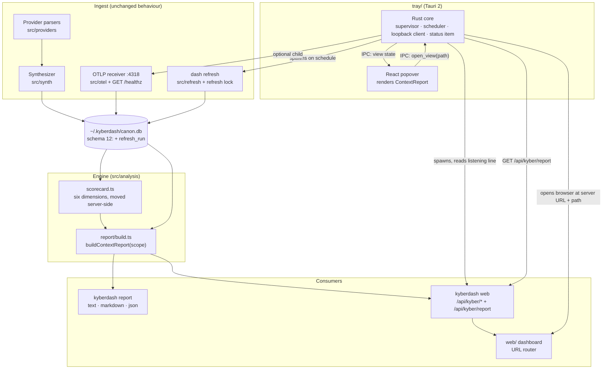
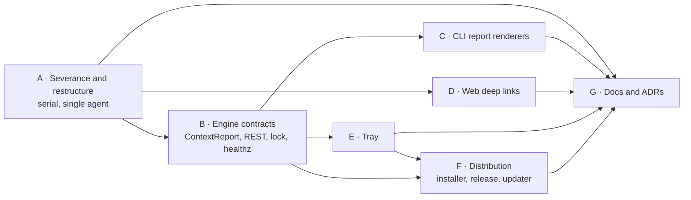

# Design Document

## Overview

This design implements the [requirements](requirements.md) in three moves:

1. **Own the code.** The vendored tree becomes one first-party TypeScript package. Deletions
   are driven by reachability from the commands that survive, not by a hand-kept list, and
   everything left carries the KyberDash identity.
2. **One view model, several renderers.** A single engine function, `buildContextReport`,
   produces a versioned `ContextReport` document. The CLI renders it as text, Markdown or
   JSON. The REST API serves it at `/api/kyber/report`. The tray draws its popover and its
   status item from it. So report, API and tray agree because they share code, not because
   a test compares three implementations (Requirements 7.5, 11.14).
3. **A thin tray.** The Tauri app owns processes and pixels, not analysis. It supervises one
   `kyberdash web` server and an optional OTLP receiver, runs the refresh on a schedule,
   fetches the report over loopback, and renders it. Clicks open the web dashboard, which
   gains a URL for every spine view.

Distribution adds a signed tray to the existing release. `kyberdash menubar` becomes the
only code that installs or updates it; `kyber-weave update` and `install.sh` both delegate
to it.

The last section, *Delivery and delegation*, splits the work into workstreams with disjoint
file ownership, so that Cursor and Antigravity sessions can each take a part.

## Architecture



### Target layout (Requirement 3)

| Path | Contents | Comes from |
|---|---|---|
| `dash/src/cli/` | `main.ts` (commander wiring) and one module per retained command: `report`, `web`, `menubar`, `doctor`, `refresh`, `otel`, `cursor-hook`, plus the `kyber` group | `src/main.ts`, `kyber/cli/` |
| `dash/src/providers/` | Session-file parsers, unchanged | `src/providers/` |
| `dash/src/ingest/` | Parser plumbing the providers need (`parser`, `session-cache`, `sqlite`, `fs-utils`, parse workers) | `src/*.ts`, only what is reachable |
| `dash/src/pricing/` | `models.ts`, the LiteLLM snapshot and its cached refresh | `src/models.ts`, `src/data/` |
| `dash/src/synth/`, `canon/`, `analysis/`, `otel/`, `refresh/`, `server/`, `branding/` | KyberDash engine | `kyber/*` |
| `dash/src/analysis/report/` | `types.ts`, `build.ts`, `render-text.ts`, `render-markdown.ts`, `fixtures/` | New |
| `dash/src/install/` | Tray download, verification, installation and update | `src/menubar-installer.ts`, rewritten |
| `dash/web/` | React dashboard | `dash/dash/` |
| `dash/tray/src-tauri/`, `dash/tray/ui/` | Tauri crate and React popover | New, plus the files salvaged under 6.11 |

Tests stay next to the module they test (`*.test.ts`), the convention `kyber/` already
uses. Upstream's separate `dash/tests/` directory is folded into that convention.

### Decisions

**D1 — Prune by reachability, then keep the check as a gate (2.3).** After the deleted
commands are removed from `cli/main.ts`, `dash/scripts/unreachable.mjs` walks the import graph
from every entry point (CLI, SEA shim, parse worker, operator tools, web app) and lists each
non-test source file the walk never visits. Those files are deleted. The script stays as the
`check:reachable` npm script in CI, so dead code cannot build up again. The graph comes from
TypeScript's `preProcessFile`, which sees static, type-only and dynamic imports.

It runs two passes, because a file can be dead in two ways. The production pass starts at
`ENTRIES` and reports modules under `src/` and `web/src/` that nothing reaches. The test pass
starts at every `*.test.ts` plus `TEST_ENTRIES` and reports test-support files - fixtures,
helpers, setup - that no test reaches. The second exists because the first cannot see those
files at all: its scan roots exclude `tests/`, and `isTestOnly` filters out anything under a
`fixtures/` directory so that test files do not all read as dead from a production entry
point. That left test-support code ungated, and a mock identity provider outlived the sign-in
feature it existed for. `TEST_ENTRIES` names the fixtures spawned by path rather than
imported, which `preProcessFile` cannot see because the path is a string literal.
*Rejected:*
- hand-deleting from the list in 2.1, which misses the long tail of helpers that only
  deleted commands used
- an esbuild metafile, which erases type-only imports and so reports every types-only
  module as dead
- `knip`, which adds a dependency to answer what `typescript` already can

**D2 — One `ContextReport` model (7.5, 11.14).** The report, the API and the tray all read
one versioned document. That document itself carries the selector's window-wide harness
inventory as `coverage.harnesses` — the canonical harnesses with a derived session in the
active day window (Requirement 8.8) — so choosing a harness scopes the analytic sections of
the same document and never triggers a second fetch, a second report, or a tray-side
derivation. *Rejected:* separate tray endpoints such as `/glance`, which would
be a second derivation of the same figures and need a parity test forever.

**D3 — The tray's Rust core does all HTTP (5.5, 6.10).** The web server rejects a
cross-origin `Origin`. The webview's origin (`tauri://localhost` on macOS,
`http://tauri.localhost` on Windows) is neither loopback nor allowed. Letting Rust fetch
with `reqwest` (already a dependency of the salvaged crate) and hand JSON to the UI over IPC
keeps the server's origin rule intact, lets the webview's CSP forbid every network
connection, and puts the loopback-only rule in one place. *Rejected:* adding the Tauri
origins to the server's allowlist, which widens the rule the dashboard relies on for CSRF
protection.

**D4 — A URL router with no library (5.1–5.4).** There are nine routes, and the spine
already has an explicit state (`SpineLocation[]`). A roughly 100-line
`web/src/lib/router.ts` maps location to path both ways, pushes history on navigation and
restores the spine on `popstate`. The server already serves `index.html` for unknown
non-API paths. *Rejected:* `react-router`, a dependency whose nested-route model duplicates
the spine reducer.

**D5 — The refresh lock reuses upstream's lock (10.3, 10.4).** `src/cache-refresh-lock.ts`
already implements a PID-liveness lock that recovers from abandoned lock files, with
process-level tests. It moves to `src/refresh/lock.ts`, gains a directory parameter, and
guards `~/.kyberdash/refresh.lock`. A refresh that finds the lock held exits **3**. *Rejected:*
a lock row inside SQLite, which cannot be released by a process that crashed.

**D6 — Delegate tray install and update to `kyberdash` (15.1).** Checksum, code-signature,
team-id and Gatekeeper checks, installer invocation, and quit-replace-relaunch live once, in
`src/install/`. The .NET self-updater only decides *whether* to call
`kyberdash menubar --update`. *Rejected:* re-implementing verification in C#, which would
be two security-sensitive copies that drift apart.

**D7 — Graceful quit through single-instance forwarding (15.5).** The tray uses
`tauri-plugin-single-instance`. Launching the installed app with `--quit` forwards the
arguments to the running instance, which stops its children and exits. The same mechanism
satisfies 6.5. *Rejected:* signalling a PID from a pidfile, which cannot stop children
cleanly on Windows. This plugin is the one new Rust dependency. It is an official Tauri
plugin, and every alternative is platform-specific IPC code.

**D8 — Share design tokens, not components, between web and tray (8.12).** The dashboard's
`@theme` tokens move into `web/src/kyber.css`, which both Vite builds import. The popover's
components are purpose-built, because the dashboard's panels assume a wide layout.

**D9 — ADRs.** ADR 0020 records the one-time fork, restates ADR 0006's surviving decisions,
and re-decides the engine language (1.3, 1.8). ADR 0021 records D2, D3, D5 and the tray's
ownership of the server, refresh and receiver, and supersedes only ADR 0016's refresh-button
clause (10.9).

On the language question, ADR 0020 records **TypeScript, for now, on current grounds**. The
provider parsers are 21.7k lines of reverse-engineered formats, and porting them buys no
capability, while the REST seam leaves a port possible later without touching any consumer.
That is a different reason from ADR 0006's mergeability argument, which is exactly why it has
to be written down.

## Components and Interfaces

### C1 — `buildContextReport` (`src/analysis/report/build.ts`)

```ts
export type ReportScope = {
  harness?: string          // canonical harness id; absent = all
  sessionId?: string
  runId?: string
  days: number              // positive integer, default 7
}
export type ReportSection = 'coverage' | 'detection' | 'findings' | 'harnesses' | 'latestSession' | 'cost'
export function buildContextReport(
  bridge: KyberBridge,
  scope: ReportScope,
  opts: { sections: ReportSection[]; findingLimit: number; now?: Date; detection?: DetectionSource },
): ContextReport
```

- **Sessions in scope** are those whose `session.ended` (or `started` when there is no end)
  falls inside `[now − days, now]`, filtered by harness, session or run.
- **Findings** are `finding` rows whose `session_id` or `run_id` belongs to a session or run in
  scope, ordered by `rank_score` descending, then by id for stable output. Every Finding
  Contract field is carried as stored (14.4).
- **The latest session** is the in-scope session with the greatest end time. Its latest turn's
  `pressure`, five bucket totals, residual, cache-invalidation flag and context-window size
  come from `analyzeContext` output already persisted in the session payload. Tool-definition
  sources come from `rankSchemas`.
- **Harness dimensions** come from `src/analysis/scorecard.ts`. That is the
  `dimensionForRow` logic now in `web/…/ScorecardMatrix.tsx`, moved server-side so the report
  and the dashboard cannot disagree (11.14). The dashboard then renders
  `harness.scorecard` from the API and no longer derives it.
- **Detection** (11.3, 11.15) calls doctor's `collectDoctorReport` with `sampleLimit: 0`, so
  it discovers sources without parsing any. Provider ids map to canonical harness ids through
  the harness-source registry in `src/refresh/registry.ts`. Detection is a separate section
  because it walks the filesystem: the CLI includes it and the tray does not.
- **Cost** sums `CostBlock`s of in-scope sessions per basis, never blending bases (5.1 of the
  archived KyberDash requirements), and is always emitted last.

### C2 — Renderers (`render-text.ts`, `render-markdown.ts`)

These are pure functions from `ContextReport` to a string, and both share one
`formatMeasured` helper. A null `Measured` renders as `— (reason)`; cost lines come after
token lines; no function computes across dimensions (14.1–14.3). Text output is coloured only
when `process.stdout.isTTY` and `NO_COLOR` is unset (11.8). Markdown contains no escape
sequences (11.9).

### C3 — `kyberdash report` (`src/cli/report.ts`)

```
kyberdash report [--format text|markdown|json] [--harness <id>] [--session <id>]
                 [--run <id>] [--days <n>] [--limit <n>] [--db <path>]
```

The command is the default. Arguments are validated before the store opens, with exit 2 on
invalid input. The store is opened read-only, and a failure to open or read it exits 1. Every
other outcome exits 0, including an empty store (11.12). No network access and no ingest
happen (11.13). Coverage prints the store path, and prints `kyberdash dash refresh` as the
remedy when the store is empty or the last successful refresh is more than an hour old
(11.4). Each finding ends with `kyberdash web --view finding/<id>` (11.5).

### C4 — REST additions (`src/server/routes.ts`)

| Endpoint | Returns | Notes |
|---|---|---|
| `GET /api/kyber/report?harness=&session=&run=&days=&limit=&sections=` | `ContextReport` | `sections` is a comma list; default is every section except `detection` |
| `GET /api/kyber/meta` | existing `MetaResult` + `version`, `apiVersion` | the tray compares `apiVersion` with its declared minimum (6.7) |

`coverage.refresh` reads the newest `refresh_run` row and the lock file, so a refresh started
from a terminal shows as in progress in the tray (10.3). The existing headers, 404 JSON and
405 rules apply to both endpoints.

### C5 — `kyberdash web` changes (`src/cli/web.ts`, `src/server/web-server.ts`)

- The first stdout line is machine-readable (5.7), followed by the existing human line:
  `{"event":"kyberdash.web.listening","url":"http://127.0.0.1:4747","pid":1234,"version":"x.y.z","apiVersion":1}`
- `--view <path>` opens `url + "/" + path` after checking `path` against the router's route
  table (5.6). An unknown view exits 2 and lists the valid forms.
- The upstream usage payload, the Share and devices endpoints, and prewarm are removed with
  the Usage tab (2.9). Loopback binding and the `Host`/`Origin` checks are kept unchanged
  (5.5).

### C6 — Web router (`web/src/lib/router.ts`)

| Route | Spine location | Ancestry resolved from |
|---|---|---|
| `/` | context-doctor | — |
| `/harness/:harnessId` | harness | — |
| `/run/:runId` | run | `run.harness` |
| `/session/:sessionId` | execution | execution → run → harness |
| `/session/:sessionId/turn/:turnIndex` | turn | as for session |
| `/finding/:findingId` | finding | `finding.run_id` or `session_id` |
| `/compare?a=:runId&b=:runId` | compare | — |
| `/quarantine`, `/problems` | header tabs | — |

`openSpine` pushes a history entry; `popstate` rebuilds the stack from the path. Opening a URL
directly runs `resolveAncestry`, which fetches the entity once and constructs the same stack
that navigating would have built (5.2). A 404 from the API renders `NotFoundPanel` in the
shell, naming the id and linking to `/` (5.4).

### C7 — Refresh lock and run log (`src/refresh/lock.ts`, `src/refresh/orchestrator.ts`)

`dash refresh` takes the lock before opening the store. When the lock is held, it exits 3 and
prints `refresh already running (pid N, since T)` (10.4). Each run writes one `refresh_run`
row at start and completes it at the end (Data Models). The exit codes 0, 1 and 2 keep their
ADR 0016 meanings.

### C8 — Receiver health (`src/otel/receiver.ts`)

A new `GET /healthz` route returns `{"service":"kyberdash-otlp","version":"x.y.z"}` and is
matched before the POST-only rule. It is what lets the tray tell "our receiver" apart from "a
different process holding 4318" (10.6, 10.8).

### C9 — Tray Rust core (`tray/src-tauri/src/`)

| Module | Responsibility | Requirements |
|---|---|---|
| `lib.rs` | App setup; `set_activation_policy(Accessory)` and `set_dock_visibility(false)` on macOS; tray icon; hidden, frameless, always-on-top popover window; single-instance with `--quit` handling | 6.2–6.5, 15.5 |
| `cli.rs` | Salvaged hardened spawn. Binary resolution order: `KYBERDASH_BIN`; the `kyberdashPath` that `kyberdash menubar` recorded in `~/.kyberdash/tray.json`; `~/.local/bin/kyberdash` (the `install.sh` default); then `PATH`. The recorded path comes second because a login-launched GUI app does not inherit the shell's `PATH` or `KYBER_WEAVE_INSTALL_DIR`. | 6.6 |
| `supervisor.rs` | Starts `kyberdash web --no-open`, reads the listening line (5 s timeout), restarts with backoff (1, 2, 4 … 60 s; after 5 consecutive failures, a stale state until Refresh now), kills the process tree on quit | 7.1–7.3, 6.9 |
| `scheduler.rs` | Runs `kyberdash dash refresh` at start and every *cadence*; one in flight at a time; maps exit 3 to "in progress elsewhere" | 10.1–10.5 |
| `api.rs` | `reqwest` client that refuses any host other than `127.0.0.1`; polls `/api/kyber/report` every 15 s while open and 60 s while closed; keeps the last good document with its fetch time | 7.4, 7.7, 6.10 |
| `receiver.rs` | Probes `127.0.0.1:4318/healthz`; optionally hosts `kyberdash otel`, with the port-held check done before spawning | 10.6–10.8 |
| `status_item.rs` | Title text on macOS; badge via salvaged `tray_badge.rs` on Windows; icon states neutral, attention, critical and stale; tooltip | 9.1–9.6 |
| `position.rs` | Salvaged `position_popover` | 6.4 |
| `autostart.rs` + `login_item_macos.rs` | Windows `Run` key (salvaged); macOS LaunchAgent at `~/Library/LaunchAgents/io.github.dpalfery.kyberdash.plist`; default off | 6.8 |
| `settings.rs` | JSON in the Tauri app-config directory | 8.8, 9.2, 10.1, 10.7 |

The IPC surface is the only thing the webview can call:

| Command or event | Direction | Payload |
|---|---|---|
| `get_view_state` | UI → Rust | `ViewState` (Data Models) |
| `view-state-changed` | Rust → UI event | `ViewState` |
| `refresh_now` | UI → Rust | — |
| `open_view` | UI → Rust | a view path, validated against the route table, joined to the server URL, and opened with the opener plugin |
| `set_settings` | UI → Rust | a partial `TraySettings` |
| `quit` | UI → Rust | — |

The webview's CSP is `default-src 'self'; connect-src ipc: http://ipc.localhost`, so the UI
cannot reach any network. Its capability file grants only these commands.

### C10 — Tray UI (`tray/ui/`)

These React components render `ViewState`: `HarnessSelector`, `SessionPanel` (pressure and a
composition bar of five buckets plus the residual), `FindingsList`, `HealthFooter`, `Actions`,
`SetupState`, `EmptyState`, `StaleBanner` and `SettingsView`. Types are imported from
`dash/src/analysis/report/types.ts`, type-only, so the UI and the engine cannot drift. The
Rust side forwards the report as JSON without re-modelling it; it only reads
`latestSession.latestTurn.pressure` for the status item.

### C11 — Installer (`src/install/`, `kyberdash menubar`)

```
kyberdash menubar [--force] [--update]
```

| Step | macOS | Windows |
|---|---|---|
| Resolve | `KYBER_WEAVE_RELEASE_ORIGIN`, else `github.com/dpalfery/kyber-weave/releases/download/v<own version>/` (12.5, 12.10) | same |
| Artifact | `kyberdash-tray-darwin-<arch>.zip` (made with `ditto`) | `kyberdash-tray-win-x64-setup.exe` (NSIS, per-user) |
| Verify | SHA-256 against `SHA256SUMS.txt`, then `codesign --verify --deep --strict`, `TeamIdentifier == J2UNNQ466J`, `spctl --assess --type execute` (12.6) | SHA-256 |
| Install | Stage, back up any existing `/Applications/KyberDash.app` (falling back to `~/Applications` when `/Applications` is not writable), rename into place; the quarantine attribute is left alone | Run the installer with `/S` |
| Record | `~/.kyberdash/tray.json` `{path, version, installedAt, platform, kyberdashPath}`, where `kyberdashPath` is the running binary's own path (12.11, 6.6) | same |
| Launch | `open` | start the installed exe |

`--update` does nothing and exits 0 unless `tray.json` names an existing install. It quits the
running tray via `--quit` (D7), waits up to 10 s, installs, relaunches, and deletes the
backup only after the relaunch succeeds. It restores the backup on any failure, then exits
non-zero naming the step (15.5, 15.6). On Linux the command exits 1 with the platform message
(12.8).

### C12 — Self-updater (`src/KyberWeave.Cli/Update/`)

`UpdateSettings` gains `--no-menubar`. After a successful KyberDash update, a new
`ShouldUpdateTray` mirrors `ShouldUpdateKyberDash`. It skips, with a log line, when
`--no-menubar` or `--no-kyberdash` is given, when the release predates `TrayMinVersion`, or
when `~/.kyberdash/tray.json` is absent. Otherwise it runs `<install dir>/kyberdash menubar
--update` and turns a non-zero exit into a `SelfUpdateException` naming the tray step
(15.1–15.6). `install.sh --with-menubar` calls `"${INSTALL_DIR}/kyberdash" menubar --force`,
and dies with a message when `--no-kyberdash` is also given (12.7).

### C13 — Release and CI

- **`build-tray` job in `release.yml`.** A matrix of darwin-arm64 (`macos-14`,
  `aarch64-apple-darwin`), darwin-x64 (`macos-14`, `x86_64-apple-darwin`) and win-x64
  (`windows-latest`), running under `environment: release`.
  - On macOS the job fails early when any signing secret is missing (12.3), because Tauri's
    bundler otherwise only warns and skips notarization. It then imports the certificate into
    a temporary keychain, writes the `.p8`, and runs `tauri build`.
  - After the build it asserts `spctl` acceptance, `stapler validate` and the team id before
    zipping.
  - Assets join `SHA256SUMS.txt`. Release notes carry the Windows SmartScreen line (12.4).
  - Secret names follow [the signing todo](../../archive/todo/macos-developer-id-signing.md). Every
    action is pinned to a commit SHA checked against its repository at authoring time (12.9).
- **CI.** New jobs cover `dash/web` and the `dash/tray/ui` React code (typecheck, lint,
  test), and `cargo fmt --check`, `cargo clippy -- -D warnings` and `cargo test` for the
  tray crate on macOS and Windows. The `check:reachable` script runs too.
- **CodeQL.** The `dash/**` exclusions are removed. Rust is added if the pinned CodeQL
  action supports it, which is to be confirmed when the job is written (4.1–4.3).

## Data Models

### `ContextReport` (JSON, `schemaVersion: 1`)

```ts
type Measured<T> = { value: T; unit?: string } | { value: null; reason: string }

type ContextReport = {
  schemaVersion: 1
  generatedAt: string                     // ISO-8601 UTC
  kyberdashVersion: string
  scope: ReportScope
  coverage?: {
    storePath: string
    refresh: {
      lastSuccessAt: string | null
      lastFailure: { at: string; summary: string } | null
      inProgress: { pid: number; since: string } | null
    }
    harnesses: Array<{ harness: string; name: string; sessionsInWindow: number;
                       measurability: Record<string, 'measurable' | { reason: string }> }>
    quarantineCount: number
    problemCount: number
    hints: string[]                       // e.g. "run `kyberdash dash refresh`"
  }
  detection?: Array<{ harness: string; detected: boolean; probedPaths: string[] }>
  findings?: Array<{
    id: string; title: string
    measurementClass: 'deterministic' | 'inferred' | 'coverage-gap'
    confidence: string; confidenceBasis: string | null
    mechanism: string; evidenceIds: string[]          // length ≥ 2 by contract
    recommendation: string                             // verbatim (14.4)
    recoverableTokens: Measured<number>; errorBar: { low: number; high: number } | null
    outcomeRiskCaveat: string; rankScore: number
    sessionId: string | null; runId: string | null; harness: string | null
    view: string                                       // "finding/<id>"
  }>
  harnesses?: Array<{ harness: string; name: string; dimensions: Record<
    'contextHygiene' | 'cacheEfficiency' | 'toolYield' | 'skillUtilisation' | 'delegationOverhead' | 'continuity',
    Measured<number> & { display?: string }> }>
  latestSession?: {
    sessionId: string; harness: string; project: string | null; lastActivityAt: string
    turnCount: number; view: string
    latestTurn: {
      index: number
      pressure: Measured<number>                       // 0..1 of the context window
      contextWindow: Measured<number>
      buckets: Record<'system_prompt' | 'tool_definitions' | 'instruction_context'
                    | 'conversation_history' | 'tool_result_content', Measured<number>>
      residual: Measured<number>
      cacheInvalidation: boolean
    }
    toolDefinitionSources: Array<{ source: string; tokens: Measured<number> }>
    cacheInvalidationTurns: number[]
  } | null
  cost?: Array<{ basis: string; amountUsd: Measured<number> }>
}
```

The fixtures in `src/analysis/report/fixtures/` cover every consumer state: full, empty
store, stale, unmeasurable pressure, no findings, and a mixed-basis cost. They are generated
from test stores, not written by hand. They are the contract the renderers, the tray UI and
the parity test consume.

### `refresh_run` table (schema 12, additive migration)

| Column | Type | Meaning |
|---|---|---|
| `id` | INTEGER PK | — |
| `started_at`, `ended_at` | TEXT | UTC; `ended_at` is null while running |
| `pid` | INTEGER | owning process |
| `trigger` | TEXT | `cli` or `tray`, from `--trigger`, hidden flag |
| `exit_code` | INTEGER | 0, 1 or 2; a lock-held run writes no row |
| `summary` | TEXT | the failure line from `formatRefreshDiagnostics`, or null |

Migration follows the existing in-place pattern (`SCHEMA_VERSION` 11 → 12). A run whose
process died leaves `ended_at` null; the lock's PID-liveness check, not this row, decides
whether a refresh is in progress.

### Tray `ViewState` and `TraySettings`

```ts
type ViewState = {
  phase: 'setup' | 'starting' | 'ready' | 'stale'
  setup?: { probed: string[]; remedy: string; reason: 'not-found' | 'too-old' }
  report: ContextReport | null
  reportFetchedAt: string | null
  error: string | null
  refresh: { state: 'idle' | 'running' | 'running-elsewhere' | 'failed'; lastSuccessAt: string | null; lastFailure: string | null }
  receiver: 'reachable' | 'not-reachable' | 'hosted' | 'port-held-by-other' | 'unknown'
  settings: TraySettings
}
type TraySettings = {
  harness: string | 'all'; windowDays: number; refreshMinutes: number
  attentionThreshold: number; criticalThreshold: number    // 0.70 and 0.90 by default
  launchAtLogin: boolean; hostReceiver: boolean            // both false by default
}
```

### Identity mapping (Requirement 3)

| Before | After |
|---|---|
| npm `codeburn`, bins `codeburn` and `kyberdash` | npm `kyberdash`, bin `kyberdash` |
| `CODEBURN_<NAME>`, about 40 variables | `KYBERDASH_<NAME>`, the same suffixes; `CODEBURN_*` is ignored |
| `~/.cache/codeburn` (`getCodeburnCacheDir`) | `~/.kyberdash/cache` (`getCacheDir`) |
| `~/Library/Application Support/CodeBurn/…` | not used; tray state lives in the Tauri app-config directory |
| bundle `org.agentseal.codeburn-menubar` | `io.github.dpalfery.kyberdash`, display name `KyberDash` |

## Error Handling

| Failure | Surface | Response |
|---|---|---|
| Invalid report arguments | CLI | exit 2 before the store opens, with a nearest-match hint for an unknown harness id |
| Store missing or unreadable | CLI; API | CLI exits 1 naming the path. The API returns 503 JSON, and the tray shows stale data with the error. |
| Empty store | all | an explicit empty state with `kyberdash dash refresh`, never zeros (8.11, 11.4) |
| Unmeasurable figure | all | `Measured` null with a reason, rendered as `—` (14.1) |
| Refresh lock held | `dash refresh`; tray | exit 3 with the holder's PID; the tray shows "running elsewhere" and does not retry until the next tick |
| Refresh failed | tray | the footer shows the failure time and summary while keeping the last success; the status item goes stale |
| Server fails to start or exits | tray | backoff restart; after 5 failures, stale state until Refresh now |
| Server not loopback, or URL outside the route table | tray | refused inside Rust; nothing is opened |
| `kyberdash` missing or `apiVersion` too old | tray | setup state listing the paths probed and the install or update command (6.7) |
| Port 4318 held by another process | tray | receiver shown as `port-held-by-other`; hosting is not attempted and not retried (10.8) |
| Deep link to an unknown id | web | `NotFoundPanel` inside the shell (5.4) |
| Checksum, signature, team or Gatekeeper mismatch | `menubar` | refuse, remove staging, exit 1 naming the check (12.5, 12.6) |
| Tray update fails midway | `menubar --update`; self-updater | restore the backup and relaunch it, exit non-zero naming the step; the self-updater reports it and exits non-zero (15.6) |
| Signing secrets absent in a release | `build-tray` | the job fails before building (12.3) |

## Testing Strategy

| Layer | What | How |
|---|---|---|
| Report builder | scoping, window arithmetic, latest-session choice, finding order, unmeasurable propagation, cost bases kept apart | vitest over seeded `CanonStore` fixtures; the same stores regenerate `fixtures/*.json` |
| Renderers | text, Markdown, JSON output for every fixture; display rules 14.1–14.3 | snapshot tests plus rule assertions (no `0` where the value is null, cost after tokens, no score keys) |
| Parity (11.14) | CLI JSON equals `GET /api/kyber/report` for the same store and scope | an in-process server on an ephemeral port |
| Scorecard move | the server-side dimensions match the current client derivation on the existing fixtures | port the `ScorecardMatrix` cases to `scorecard.test.ts` before removing the client code |
| Refresh lock | concurrent refresh exits 3; abandoned lock recovered | the existing lock process tests, re-pointed at the new directory |
| Schema 12 | migration from 11 in place; `refresh_run` rows | extend `migration.test.ts` |
| Router | path ↔ spine round trip for every route; direct open rebuilds ancestry; not-found | vitest; Playwright (already configured) for back, forward and reload |
| Pruning | no unreachable module | `check:reachable` in CI |
| Severance | no `getagentseal`, `agentseal.org` or `codeburn.app` outside the attribution files (1.6) | `UpstreamSeveranceTests.cs` replaces `MergeBoundaryTests.cs` |
| Tray Rust | loopback refusal, backoff schedule, exit-code mapping, view-path validation, settings round trip, badge rendering | `cargo test` with a fake process runner and a fake clock |
| Tray UI | every `ViewState` phase and fixture renders; no network API reachable | vitest + Testing Library against the fixtures |
| Installer | origin resolution, checksum refusal, backup and restore, `tray.json`, `--update` no-op | vitest with a local HTTP origin (`KYBER_WEAVE_RELEASE_ORIGIN`) and an injected verifier; real `codesign` and `spctl` checks run only in the release smoke step |
| Self-updater | skip reasons, delegation, failure propagation | xunit with the existing fake host; `update-loop.sh` must still pass (15.7) |
| Release | the signed app is accepted by Gatekeeper and carries the team id | a smoke step in `build-tray` after bundling |
| Docs | zero findings | `docs validate` and `docs drift` |

## Delivery and delegation

The work splits into seven workstreams. Workstream A has to land alone, first, because it
moves every path the others touch. After that, B defines the contract C, E and F build
against. From there the streams own disjoint paths, which is what makes them delegable.



| Stream | Owns (writes only here) | Squad roles | Proposed harness |
|---|---|---|---|
| A | all of `dash/` (moves), `tests/KyberWeave.Tests/MergeBoundaryTests.cs`, CI exclusions, AGENTS.md rule, ADR 0020 | conductor → react-dev, test-dev, docs-dev | **Claude Code** — this session; a cross-cutting diff where mistakes ripple |
| B | `dash/src/analysis/{report,scorecard}*`, `src/server/`, `src/refresh/lock.ts`, `src/otel/receiver.ts`, `src/canon/store.ts` migration | conductor → test-dev | **Claude Code** — it defines the contract |
| C | `dash/src/analysis/report/render-*`, `src/cli/report.ts` | react-dev (TypeScript), test-dev | **Antigravity** (`agy`) |
| D | `dash/web/**` | react-dev, test-dev | **Antigravity** (`agy`) |
| E | `dash/tray/**` | tauri-dev (Rust), react-dev (UI) | **Cursor** (`cursor-agent`) |
| F | `dash/src/install/`, `release.yml` `build-tray`, `scripts/install.sh`, `src/KyberWeave.Cli/Update/` | github-devops, csharp-dev | **Claude Code** — signing secrets and the self-updater are security-sensitive, and your Apple setup runs in parallel |
| G | `docs/**` | docs-dev | **Claude Code** |

**How a stream is handed off.** Each delegated stream receives a brief generated from
`tasks.md`, never from chat. The brief contains:
- the task ids and the requirement ids they satisfy
- the paths it may write and those it must not touch
- the fixture contract from B
- the gate commands from AGENTS.md
- a definition of done

The brief tells the agent to read the repository's `AGENTS.md` first and gives the spec path
explicitly: `docs/specs/kyberdash-context-surfaces/`. That matters because a harness may still
carry Squad instructions installed before `6-Docs` gave way to a resolvable docs root (see the
[archived squad-hardcoded-docs-root todo](../../archive/todo/squad-hardcoded-docs-root.md)).

**Running the delegates.** The flags below were checked against the CLIs installed on this
machine: `cursor-agent` 2026.09.02 and `agy` 1.2.2.
- **Cursor:** `cursor-agent -p --force -w kyberdash-tray "<brief>"` runs headless in an
  isolated worktree under `~/.cursor/worktrees/`, with the Squad agents installed globally in
  `~/.cursor/agents/`.
- **Antigravity:** `agy` has no worktree flag. Create one with `git worktree add` first, run
  `agy -p --dangerously-skip-permissions "<brief>"` from inside it, and name the Squad skill
  the brief should follow (`conductor`, `react-dev`).
- **Integration.** Each stream opens a PR into the integration branch. `task-reviewer` and
  `code-reviewer` review it here before merge, so every harness is held to one review bar.

**Delegation hazards found while installing the squads (2026-09-18).** None of these block
the design; each needs a decision before E, C or D starts.
- Antigravity's agent directory, `~/.gemini/config/agents/`, holds 21 hand-installed agents
  dated August 2026 (`conductor-v2`, `conductor-v3`, `tauri-dev`, …). Squad does not manage
  them, and `agy --agent tauri-dev` would load one of those stale copies rather than the
  current Squad role.
- `agy` 1.2.2 has a native agent primitive (`agy agents`, `--agent`), but Squad's
  Antigravity renderer still lowers roles to skills in the belief that none exists.
- A single global `squad install -t cursor,antigravity` fails with a receipt collision. Both
  targets write `skills/<name>/SKILL.md` under different home directories, and the receipt
  keys files by relative path alone. The dry run does not catch it.
- A global receipt is keyed by the path argument, which defaults to the current directory.
  An install run from a worktree is therefore orphaned when the worktree is deleted.
  `squad status -g` also resolves files against the path argument rather than each target's
  home, so it reports installed files as missing.
